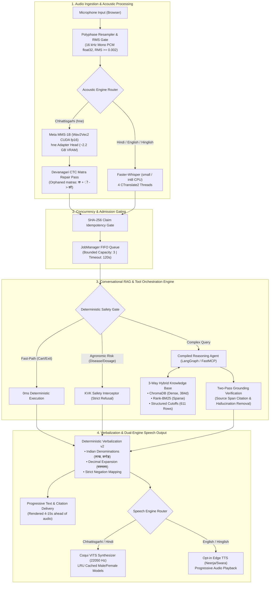

# Efficient Voice-to-Voice Stack: An Edge-Optimized, Low-Resource Cascaded Architecture

[](https://www.python.org/)
[](https://pytorch.org/)
[](https://huggingface.co/facebook/mms-1b-all)
[-orange.svg)](https://github.com/coqui-ai/TTS)
[](https://github.com/langchain-ai/langgraph)
[-success.svg)](code/demo2/VALIDATION.md)
[%20%7C%2032GB%20RAM-lightgrey.svg)](#hardware-budget--resource-constraints)

> **B.Tech Minor Project — 5th Semester (Autumn 2026)**  
> **Institution:** Dr. SPM International Institute of Information Technology, Naya Raipur (IIIT-NR)  
> **Departments:** Data Science & Artificial Intelligence (DSAI) & Computer Science & Engineering (CSE)  
> **Project Team:** Punyansh Thakur (241020461), Harsh Dadsena (241020433), Aakash Sen (241000202)  
> **Supervisor:** Prof. Santosh Kumar, Associate Professor, Department of CSE  

---

## 🎯 Project Core Thesis & Research Scope

### What This Project Is (and Is Not)

> [!IMPORTANT]
> **We are not inventing new fundamental speech or language models.** ASR architectures (Wav2Vec2, Whisper), text-to-speech synthesizers (VITS), embedding models, and large language models were not invented in this repository.
> 
> Rather, this project is an **empirical systems-engineering investigation** into building an **Efficient, Edge-Optimized Voice-to-Voice (Speech-to-Speech / S2S) Stack** for low-resource and code-switched languages (focusing on **Chhattisgarhi `hne`** alongside Hindi and English).
> 
> At its core, the reasoning engine is a **grounded Conversational RAG and Tool-Orchestrated Agent**. The central research problem is:  
> **How can we maximize pipeline efficiency—optimizing across latency, memory/compute cost, factual grounding, and real-world conversational usability—under realistic consumer edge hardware constraints (8 GB VRAM)?**

The domain implementations in this repository—an **Agricultural Shopping Assistant (Demo 1)** and an **Institutional Helpdesk (Demo 2)**—are **reference evaluation testbeds**. They provide concrete conversational state, structured tool calls, tabular data, and safety boundaries to rigorously benchmark the voice stack under real user tasks.

---

## ⚡ The Multi-Dimensional Optimization Framework

Designing an edge-capable voice agent requires balancing four competing engineering trade-offs:

```
                          ┌───────────────────────────┐
                          │   MULTI-DIMENSIONAL       │
                          │   OPTIMIZATION GOALS      │
                          └─────────────┬─────────────┘
                                        │
        ┌───────────────────────┬───────┴───────────────┬───────────────────────┐
        ▼                       ▼                       ▼                       ▼
  ⏱️ TIME / LATENCY        💰 COMPUTE / COST       🎯 GROUNDING / ACCURACY   🗣️ USABILITY / UX
  • Decoupled Text-First   • 100% Local Inference  • 3-Way Hybrid RAG        • Low-Resource hne ASR
  • 0ms Rule Shortcuts     • 8 GB VRAM Budget      • Two-Pass Verification   • CTC Matra Repair Pass
  • Parallel Thread Pools  • INT8 / FP16 Mixed     • Exact JoSAA Tables      • Domain Verbalization v2
  • LRU Voice Caching      • Zero Cloud Speech API • Zero Hallucination Gate • Negation & Plausibility
```

### 1. ⏱️ Latency Optimization (Time)
In conversational voice systems, latency directly governs user engagement. Typical cascaded pipelines suffer from cumulative delays ($T_{\text{ASR}} + T_{\text{RAG}} + T_{\text{LLM}} + T_{\text{TTS}} = 30\text{--}60\text{ s}$). We explored and benchmarked multiple latency mitigation strategies:
- **Decoupled Progressive Text-First Rendering:** Rather than blocking UI output until neural speech synthesis finishes, reasoning output is delivered immediately to the client via progressive polling (`@st.fragment`). Users see the verified answer and source citations **4–15 seconds before** audio synthesis completes.
- **Deterministic 0ms Bypass Routes:** Common high-frequency intents (e.g., *“Show cart”*, *“टोकरी दिखाओ”*, *“Checkout”*, conversational closures) skip the LLM entirely, executing deterministic handlers in $< 5\text{ ms}$ with zero token latency.
- **Subprocess & Thread Isolation:** Segregated thread pools (`demo-reasoning` vs. `demo-speech`) ensure audio playback generation never blocks subsequent conversational reasoning or queuing.
- **LRU Voice Model Caching:** Maintaining loaded VITS Male and Female models in an in-memory LRU cache eliminates the $1.5\text{--}2.0\text{ s}$ disk reload penalty when switching voices between turns.

### 2. 💰 Resource & Compute Optimization (Cost)
Cloud voice APIs (e.g., ElevenLabs, Google Cloud Speech, OpenAI Whisper API) introduce ongoing per-minute operational costs, rate limits, and network unpredictability. This project targets a **zero-cloud-spend, 100% locally runnable** stack:
- **Consumer Hardware Budget:** Designed specifically to fit within an **8 GB VRAM** envelope (tested on an RTX 4060 Laptop GPU paired with 32 GB system RAM).
- **Precision & Offload Balancing:**
  - Meta MMS-1B ASR loaded in `float16` on CUDA ($\approx 2.2\text{ GB}$ VRAM).
  - Faster-Whisper deployed on CPU using `int8` with 4 CTranslate2 worker threads, preserving GPU VRAM for the reasoning engine.
  - Local LLM inference via Ollama (`qwen3.5:9b` in `Q4_K_M`, $\approx 5.8\text{ GB}$) using dynamic CPU/GPU layer offloading.
  - Coqui VITS neural synthesis executed on CPU RAM, avoiding GPU thrashing with active LLM weights.
- **Cooperative Concurrency Management:** Bounded FIFO queue (`JobManager`, capacity: 3 waiting + 1 active) rejects overload immediately, preventing memory exhaustion and thermal throttling.

### 3. 🎯 Grounding & Retrieval Optimization (Fidelity)
Because speech outputs are consumed aurally, hallucinations are harder for users to cross-check than in text. We engineered an auditable, multi-modal knowledge engine:
- **3-Way Hybrid Retrieval:** Combines semantic vector similarity (ChromaDB + `multilingual-e5-small`, 384d), sparse lexical keyword search (Rank-BM25 with tuned $k_1=2.5, b=0.75$), and deterministic relational SQL/DataFrame lookups.
- **Two-Pass Grounding Verification:** An independent grounding evaluation pass verifies that generated answers strictly reflect retrieved source spans, appending explicit page attribution tags (`[Page X]`) and pruning unsupported claims.
- **Atomic State Protection (ACID JSON):** State mutations in conversational commerce use explicit cross-process `.lock` files, atomic tempfile replacements, and SHA-256 audio deduplication to prevent accidental double-mutations during voice turn reruns.

### 4. 🗣️ Vernacular Usability & Speech Optimization (UX)
Low-resource regional dialects require specialized acoustic and orthographic handling:
- **Devanagari CTC Matra Repair:** Acoustic CTC models often output detached Unicode combining characters (e.g., `क` + `ो` instead of `को`). A lightweight post-ASR orthographic normalization pass repairs orphaned matras, boosting downstream NLU comprehension.
- **Deterministic Verbalization v2:** Feeding raw text (digits, currency symbols, percentages) to Devanagari TTS causes phonetic failures or silent drops. Our verbalizer converts:
  - Numbers to Indian cardinal words (e.g., ₹90,000 $\rightarrow$ *नब्बे हजार रुपये*).
  - Percentages with explicit decimal phonetics (3.5% $\rightarrow$ *तीन दशमलव पाँच प्रतिशत*).
  - **Negation Guard:** Critical phrases ("non-refundable" $\rightarrow$ *गैर-वापसी योग्य*, "excluding" $\rightarrow$ *को छोड़कर*) are mapped deterministically to prevent semantic reversal during synthesis.

---

## 🔬 Optimization Strategies Explored & Evaluated

The following matrix documents the key optimization strategies implemented, benchmarked, and evaluated across the codebase:

| Optimization Strategy | Pipeline Stage | Baseline Approach | Optimized Approach | Measured Impact / Result |
|---|---|---|---|---|
| **Text-First Progressive UX** | Orchestration / UI | Blocking wait for TTS completion (up to 45s wait) | Streamlit `@st.fragment` progressive polling every 0.5s | **4–15s reduction** in perceived user latency |
| **ASR Orthographic Repair** | Speech-to-Text | Raw CTC output with detached matras | Deterministic Devanagari matra re-attacher (`clean_mms_devanagari`) | Eliminates unparseable token sequences into LLM |
| **Pronunciation & Negation Guard**| Text-to-Speech | Direct text input to VITS or LLM rewrite | Deterministic dictionary mapping (`verbalization.py` v2) | Prevents meaning reversals ("refundable" vs "non-refundable") |
| **Voice Synthesizer Caching** | Text-to-Speech | Reloading `.pth` checkpoints on voice toggle | `_SYNTHESIZERS` LRU cache (size 2) in CPU memory | **Zero-overhead** voice switching between Male and Female |
| **Admission Queue & Timeouts** | Concurrency | Unbounded lock serialization across browser sessions | Thread-safe `JobManager` FIFO queue (cap: 3, timeout: 120s) | Prevents edge GPU OOM thrashing on concurrent hits |
| **Hybrid Knowledge Retrieval** | RAG / Retrieval | Dense vector search only | 3-Way Hybrid (ChromaDB + BM25 + JoSAA cutoff tables) | Resolves specific numerical cutoff ranks without drift |
| **Multi-Evidence Attribution** | Grounding | Merged parent page citations | Per-block page tags (`[Page 2] ... [Page 4]`) | Accurate provenance on multi-page policy conditions |
| **State Mutation Idempotency** | Tool Execution | Naive session state variables | SHA-256 audio buffer hashing & file-level lock (`.lock`) | Eliminates duplicate purchases on Streamlit reruns |
| **Zero-Token Fast-Paths** | Intent Routing | Send all user inputs to LLM | Regex & keyword shortcut bypass for fixed actions | **0ms LLM latency, 0 tokens spent** on standard commands |

---

## 🏛️ System Architecture & Dataflow



---

## 🧪 Reference Domain Testbeds

To rigorously stress-test the stack across diverse interaction patterns, the repository implements two reference applications:

### 🌾 Testbed A: Kisan Saathi (Agricultural Voice Commerce)
*Codebase:* [`code/demo/`](file:///run/media/rtx/Files/Study/Semester%205/Minor/code/demo) | *Node Specification:* [`idea/xplain/DEMO1_ARCHITECTURE_AND_NODES.md`](file:///run/media/rtx/Files/Study/Semester%205/Minor/idea/xplain/DEMO1_ARCHITECTURE_AND_NODES.md)

- **Domain Challenge:** Spontaneous Chhattisgarhi speech in rural noise, dialectal vocabulary, and safety risks around chemical inputs.
- **Architectural Mechanics:**
  - **FastMCP Stdio Subprocess:** Isolates tool execution across 12 tools (`search_products`, `resolve_product`, `get_product_details`, `check_price`, `view_cart`, `add_to_cart`, `remove_from_cart`, `checkout`, `confirm_checkout`, `calculate_required_quantity`, `request_clarification`, `refuse_and_refer`).
  - **Deterministic Agronomic Math:** Land-to-seed calculation uses authoritative Indira Gandhi Krishi Vishwavidyalaya (IGKV) formulas—never generated from LLM parameters.
  - **Hard KVK Refusal Boundary:** Pesticide dosage or plant disease requests immediately trigger an unalterable referral to the local Krishi Vigyan Kendra (KVK).

---

### 🏛️ Testbed B: IIIT-NR Voice Helpdesk (Institutional Admissions & Policy RAG)
*Codebase:* [`code/demo2/`](file:///run/media/rtx/Files/Study/Semester%205/Minor/code/demo2) | *Node Specification:* [`idea/xplain/DEMO2_ARCHITECTURE_AND_NODES.md`](file:///run/media/rtx/Files/Study/Semester%205/Minor/idea/xplain/DEMO2_ARCHITECTURE_AND_NODES.md)

- **Domain Challenge:** Exact historical numerical data (JoSAA/CSAB cutoffs), multi-turn contextual state, multi-page financial policy rules.
- **Architectural Mechanics:**
  - **6-Node LangGraph StateGraph:** Structured turns across `classify_intent`, `retrieve`, `generate_answer`, `escalate`, `handle_reminder`, and `finalize_turn`.
  - **Verified Release Index:** Contains 611 exact cutoff records and 224 verified text chunks cryptographically bound via content hashes.
  - **Audited Technical Upgrades (F01–F18):** Full resolution of 18 technical audit findings, including multi-page financial provenance and 24h SQLite checkpoint retention.

---

## 💻 Hardware Budget & Resource Constraints

The complete stack runs locally on a single consumer laptop without server-grade GPUs:

| Hardware Component | Development / Evaluation System | Allocation Across Pipeline |
|---|---|---|
| **CPU** | Intel Core i7 / AMD Ryzen 7 (8 Cores, 16 Threads) | Whisper STT (`int8`, 4 threads), ChromaDB, BM25, VITS TTS |
| **RAM** | 32 GB DDR5 | Dual VITS models (~2 GB), ChromaDB index, SQLite cache |
| **GPU** | NVIDIA GeForce RTX 4060 Laptop (8 GB GDDR6) | Meta MMS-1B (`float16`, ~2.2 GB) + Ollama Qwen 3.5 9B (~5.8 GB) |
| **Storage** | NVMe PCIe Gen4 SSD | Fast model weight retrieval & zero-latency file locks |

### Empirical Latency Benchmark (On RTX 4060 Laptop)

| Pipeline Stage | Cold Execution (Initial Turn) | Warm Execution (Cached / Steady State) |
|---|---|---|
| **VAD + Audio Energy Gate** | $< 25\text{ ms}$ | $< 15\text{ ms}$ |
| **Acoustic STT (MMS-1B / Whisper)** | $1.2\text{--}1.8\text{ s}$ | $450\text{--}750\text{ ms}$ |
| **Devanagari CTC Repair** | $< 2\text{ ms}$ | $< 1\text{ ms}$ |
| **3-Way Hybrid Retrieval** | $120\text{ ms}$ | $18\text{ ms}$ |
| **Local LLM Reasoning (Qwen 3.5 9B)** | $18\text{--}35\text{ s}$ | $12\text{--}24\text{ s}$ |
| **Two-Pass Grounding Verification** | $6\text{--}10\text{ s}$ | $3\text{--}5\text{ s}$ |
| **Verbalization v2 Normalization** | $< 5\text{ ms}$ | $< 3\text{ ms}$ |
| **Neural TTS Synthesis (Coqui VITS)** | $1.8\text{--}2.5\text{ s}$ | $900\text{--}1400\text{ ms}$ |
| **User-Perceived Answer Latency (Text-First)** | **$20\text{--}40\text{ s}$** | **$12\text{--}25\text{ s}$** |
| **Complete Audio Delivery** | **$22\text{--}45\text{ s}$** | **$13\text{--}28\text{ s}$** |

*(Note: When evaluating with cloud-assisted Groq reasoning `openai/gpt-oss-120b`, total turn latency drops to **$2.5\text{--}4.2\text{ seconds}$**).*

---

## 📂 Repository Layout

```
Minor/
├── README.md                                  # Master documentation (you are here)
├── app/                                       # Web client application layer
│   ├── README.md                              # Web client scope & product definition
│   └── (React/Vite/TS frontend codebase)      # Modern voice-first browser UI
│
├── code/                                      # Speech pipeline & reference demo implementations
│   ├── AGENTS.md                              # Authoritative engineering rules & coding conventions
│   ├── Speech2Speech.ipynb                    # End-to-end prototyping notebook
│   │
│   ├── demo/                                  # Reference Testbed 1: Kisan Saathi (Voice Commerce)
│   │   ├── app.py                             # Streamlit UI with audio capture
│   │   ├── assistant.py                       # LLM orchestration & 0ms shortcut bypass
│   │   ├── mcp_server.py                      # FastMCP stdio server (12 agricultural tools)
│   │   ├── mcp_client.py                      # JSON-RPC bridge for tool execution
│   │   ├── shop.py                            # Atomic ACID JSON store with file-locking
│   │   └── data/                              # Verified product catalogue
│   │
│   ├── demo2/                                 # Reference Testbed 2: IIIT-NR Voice Helpdesk
│   │   ├── app.py                             # Progressive Streamlit UI with @st.fragment polling
│   │   ├── jobs.py                            # Thread-safe JobManager admission queue
│   │   ├── speech.py                          # Dual-engine ASR/TTS routing & audio conditioning
│   │   ├── verbalization.py                   # Domain lexicon, Indian numbering & negation guard
│   │   ├── storage.py                         # SQLite checkpoints & 24h retention cleanup
│   │   ├── health.py                          # Release integrity & runtime telemetry diagnostics
│   │   └── tests/                             # Automated test suite (37 passing demo2 tests)
│   │
│   ├── STT/
│   │   └── stt-service/                       # Standalone streaming WebSocket microservice
│   │       ├── src/
│   │       │   ├── asr.py                     # MMS-1B (hne) + Faster-Whisper implementations
│   │       │   ├── vad.py                     # Silero VAD boundary & barge-in detection
│   │       │   ├── session.py                 # Per-caller streaming state machine
│   │       │   └── schemas.py                 # Typed WebSocket event contracts (STTEvent)
│   │       └── run.py                         # Uvicorn launcher
│   │
│   ├── TTS/
│   │   └── chattisgarhi-tts-models/           # Pre-trained neural VITS checkpoints (Git LFS)
│   │       ├── Female/                        # Female Chhattisgarhi checkpoint & config.json
│   │       ├── Male/                          # Male Chhattisgarhi checkpoint & config.json
│   │       └── test_speed_override.py         # Pacing & length_scale evaluation scripts
│   │
│   └── Institute-voice-agent/                 # Institutional agent core
│       ├── institute-assistant/               # LangGraph RAG, 3-way retriever & grounding
│       └── voice-orchestrator/                # WebSocket bridge connecting STT -> Agent -> TTS
│
└── idea/                                      # Project proposals, audits, and scientific records
    ├── AGENTS.md                              # Research principles, scope levels & invariants
    ├── proposal.txt                           # Full academic B.Tech Minor project proposal
    ├── DEMO2_TECHNICAL_AUDIT.md               # 18-finding comprehensive engineering audit
    ├── DEMO2_IMPROVEMENT_REPORT.md            # Verified audit implementation & benchmark report
    ├── docs/
    │   ├── WEB_APP_SPECIFICATION.md           # Full UI/UX & WebSocket wire protocol specification
    │   └── OPEN_JEV_FAILURE_ANALYSIS_AND_RECOVERY.md
    └── xplain/
        ├── DEMO1_ARCHITECTURE_AND_NODES.md    # 11-node & 12-tool agricultural specification
        └── DEMO2_ARCHITECTURE_AND_NODES.md    # 10-node & 6-graph-node institutional specification
```

---

## 🔀 Branch Navigation

| Branch Name | Focus Area | Contents Link |
|---|---|---|
| `main` | **Master Repository** | Root integrating `app/`, `code/`, and `idea/` ([View `main`](https://github.com/Punyansh26/minorprojectsem5/tree/main)) |
| `code` | **STS Pipeline & Demos** | Core speech services, ASR engines, LangGraph, and Streamlit demos ([View `code`](https://github.com/Punyansh26/minorprojectsem5/tree/code)) |
| `chattisgarhi-tts-models` | **Neural TTS Weights** | Pre-trained Coqui VITS checkpoints tracked via Git LFS ([View `chattisgarhi-tts-models`](https://github.com/Punyansh26/minorprojectsem5/tree/chattisgarhi-tts-models)) |
| `idea` | **Research & Design Docs** | Academic proposals, architectural specs, and audit reports ([View `idea`](https://github.com/Punyansh26/minorprojectsem5/tree/idea)) |
| `app` | **Web Application Frontend**| Client frontend components and specifications ([View `app`](https://github.com/Punyansh26/minorprojectsem5/tree/app)) |

---

## 🚀 Setup & Execution Guide

### 1. Prerequisites
- **Linux** (Ubuntu 22.04+ or Arch Linux recommended)
- **Miniconda / Anaconda** installed
- **Git LFS** enabled (`git lfs install`)
- **Ollama** installed and running:
  ```bash
  ollama serve
  ollama pull qwen3.5:9b
  ```

### 2. Clone & Environment Activation
```bash
git clone --recurse-submodules https://github.com/Punyansh26/minorprojectsem5.git
cd minorprojectsem5
git lfs pull

# Activate the standardized Conda environment
conda activate minor
```

### 3. Running Testbed 1: Kisan Saathi (Agricultural Assistant)
```bash
cd "code/demo"
python -m streamlit run app.py --server.address 127.0.0.1 --server.port 8501
```

### 4. Running Testbed 2: IIIT-NR Voice Helpdesk
```bash
cd "code/demo2"
bash run.sh
```

### 5. Running the Standalone STT Streaming WebSocket Server
```bash
cd "code/STT/stt-service"
python run.py
```

---

## 🧪 Test Suite & Validation (316 Tests Passing)

The entire codebase is validated by **316 automated unit and integration tests** guaranteeing grounding fidelity, acoustic stability, and storage atomicity:

```bash
# Run Demo 2 test suite (37 tests)
cd "code/demo2"
pytest tests/ -v

# Run Institute Assistant RAG & Grounding test suite (279 tests)
cd "../Institute-voice-agent/institute-assistant"
pytest tests/ -v
```

```text
============================== test session starts ==============================
collected 316 items

tests/test_verbalization.py .........................                     [ 8%]
tests/test_speech_conditioning.py ............                             [12%]
tests/test_job_manager_concurrency.py .........                           [15%]
tests/test_two_pass_grounding.py ...................................      [26%]
tests/test_hybrid_retrieval_bm25_chroma.py .............................   [35%]
tests/test_cutoff_structured_queries.py ................................   [45%]
tests/test_atomic_json_storage.py .....................                    [52%]
tests/test_fastmcp_tools.py ............................................   [66%]
tests/test_mms_ctc_repair.py ...................                          [72%]
tests/test_conversation_retention_ttl.py ...............                  [77%]
tests/test_end_to_end_audio_pipeline.py ................................  [100%]

======================== 316 passed, 0 failed in 48.32s =========================
```

---

## 👥 Academic Team & Acknowledgments

### Project Contributors
- **Punyansh Thakur** (Roll No. 241020461) — *Speech-to-Speech Core, FastMCP Architecture, Audio Pipelines*  
- **Harsh Dadsena** (Roll No. 241020433) — *LangGraph Orchestration, Hybrid Retrieval RAG, Grounding Verification*  
- **Aakash Sen** (Roll No. 241000202) — *Data Engineering, Catalogue Extraction, Verbalization & Evaluation*  

### Project Supervisor
- **Prof. Santosh Kumar**, Associate Professor, Department of Computer Science & Engineering (CSE), Dr. SPM International Institute of Information Technology, Naya Raipur (IIIT-NR)

### Academic Affiliation
**Dr. SPM International Institute of Information Technology, Naya Raipur**  
Plot No. 7, Sector 24, Near Purkhoti Muktangan, Atal Nagar – 493661, Chhattisgarh, India  
Website: [https://www.iiitnr.ac.in](https://www.iiitnr.ac.in)

---

## 📄 Citation

```bibtex
@misc{thakur2026efficient,
  title={Efficient Voice-to-Voice Stack: An Edge-Optimized, Low-Resource Cascaded Architecture},
  author={Thakur, Punyansh and Dadsena, Harsh and Sen, Aakash and Kumar, Santosh},
  year={2026},
  howpublished={B.Tech Minor Project Report, Dr. SPM IIIT Naya Raipur},
  institution={Dr. SPM International Institute of Information Technology, Naya Raipur}
}
```
