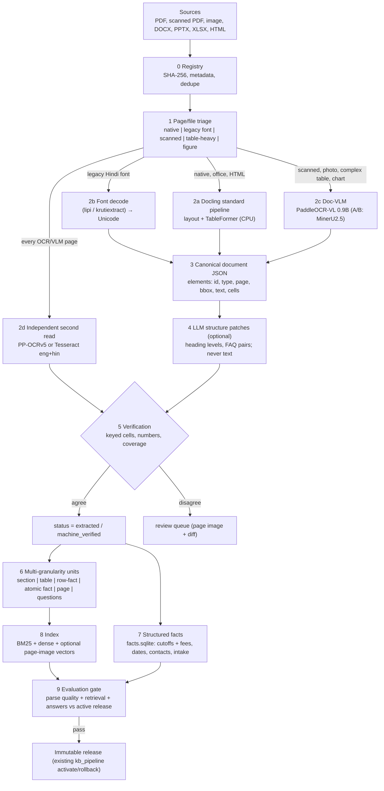

# 15 — Knowledge-Base Pipeline v2: Parser-First, Verified-by-Structure, Multi-Granularity

This chapter is the recommended replacement for the KBB proposal reviewed in
[14](14_KNOWLEDGE_BASE_METHODOLOGY_REVIEW.md). It targets the actual failure: PDFs, scans,
images and other formats chunk badly, so semantic search misses or mis-ranks evidence. It
reuses the existing release, evidence-block and grounding machinery
(`IA/assistant/kb/*`, `evidence.py::source_quote`). Every number carries the labels from
[00](00_INDEX.md).

`IA/` = `code/Institute-voice-agent/institute-assistant/`.

## 0. The method in one picture



Principles, in priority order:

1. **The source text is the evidence; nothing generated is.** Quotes shown to users and
   checked by `source_quote` come only from the parser/OCR text layer. Summaries, contextual
   prefixes, synthetic questions and atomic facts are retrieval aids that point to evidence.
2. **Parse with specialised models, not with a chat model.** Parsers are cheaper, faster
   and do not paraphrase.
3. **Verify structure, not just characters.** Table checks compare
   (row label, column label, value) triples from two independent reads.
4. **Index several granularities, answer from the parent.** Small units match the query;
   the verified parent block is what the LLM reads and quotes.
5. **Exact questions get exact answers.** Tabular facts go to SQL, as cutoffs already do.
6. **Everything is cached by content hash and gated by A/B evaluation**, as in the KBB
   proposal and the existing release system.

## 1. Which method to follow, by situation

| Situation | Use | Why |
|---|---|---|
| Born-digital PDF, DOCX, PPTX, XLSX, HTML | **Docling** standard pipeline (MIT) [R1408] | CPU-friendly, element-level page + bbox provenance, native office formats, HybridChunker |
| Scanned PDF, photo of a notice, image | **PaddleOCR-VL 0.9B** (Apache-2.0) [R1404] | 92.86 OmniDocBench v1.5, 109 languages incl. Hindi, Devanagari edit distance 0.097 [Reported]; small enough for 8 GB |
| Complex or multi-page tables, charts | PaddleOCR-VL (A/B **MinerU2.5**, which merges cross-page tables [R1424]) | Table TEDS 0.9195 vs MinerU2.5 0.9005 on OmniDocBench table blocks [R1404, Reported] |
| Kruti Dev / Chanakya / DevLys text layer | **Deterministic decoder** (`lipi`, `krutiextract`) [R1420], OCR as check | Exact and instant when the mapping is correct |
| English-only, very hard scans, T1+ GPU | olmOCR 2 (7B, Apache-2.0) [R1407] as a third read | Strong on English scans; not for Hindi |
| Charts or pages where text extraction fails, T1+ | Optional visual page retrieval (ColQwen-class) [R1411] | Recall safety net only; answers still need text evidence |
| Avoid in the production path | Marker (GPL ⚠), PyMuPDF4LLM (AGPL ⚠), Surya weights (modified OpenRAIL-M ⚠) [R1419], general VLM rewriting, semantic (embedding-breakpoint) chunking [R1400] | Licence or accuracy/cost reasons |

## 2. Stage 0–1: intake and triage

**What.** Register every source (existing `kb_sources.json` + local folders) with SHA-256,
then classify each page or file so that it takes the cheapest correct route.

**Where it fits.** `IA/assistant/kb/sources.py` (fetching, `html_main`) and the start of
`IA/assistant/kb/extraction.py::extract_pdf`. The KBB triage rules (character count,
mojibake patterns, font names, table and image area) are kept.

**How to implement.**
1. Reuse the registry and SHA-256 dedupe from the KBB proposal §5.2.
2. Detect the format by MIME type. Office files and HTML go straight to Docling, which parses
   PDF, DOCX, PPTX, XLSX, HTML and images [R1408]. Keep `html_main` for web notices if A/B
   shows it is cleaner.
3. Per PDF page, compute: text-layer characters, the share of characters in the Devanagari
   block, font names (`pdfplumber` already exposes them), Kruti Dev mojibake regexes, and
   image and table area. Route as in §0.
4. Store `triage.json` per document. Every page must have a class; none is silently dropped.

**Risks.** A page with a partly good text layer can be misrouted. Mitigation: if a native
page's extracted text has fewer than half the words of the doc-VLM read in the triage
sample, flag it.

**How to measure.** Triage confusion matrix on 50 hand-labelled pages from the seven corpus
PDFs. Target ≥95% correct routes, with no scanned page routed as native.

## 3. Stage 2: extraction

### 3.1 Docling for native files

**What.** Docling converts files into a `DoclingDocument`: typed elements (title, section
header, text, list item, table with cells, picture, caption, footnote), each with page
number and bounding box. It exports Markdown/JSON losslessly [R1408].

**How to implement.** `DocumentConverter` with table structure on and OCR off for native
pages. Save the JSON (`document.docling.json`) as the canonical artefact. Generate the
human-readable page-anchored text view from it, replacing KBB's hand-written tagged TXT
parser. Repeated header/footer removal: Docling labels page headers and footers; keep the
existing ≥60%-of-pages rule as a fallback.

**Expected effect.** Headings, reading order and table cells for born-digital brochures and
annual reports, without any LLM. CPU only, so no VRAM contention on T0.

### 3.2 Legacy-font decoding

**What.** Map legacy Hindi font code points to Unicode Devanagari.

**How to implement.** Run `lipi` [R1420] on pages flagged `legacy_font`. Accept the decode if
(a) ≥90% of resulting tokens are valid Devanagari syllables, and (b) numbers match the doc-VLM
read of the same page (§3.4). Otherwise fall back to OCR.

**Risk.** Wrong conjunct mappings produce plausible but misspelt words. The second read and a
Hindi dictionary check catch most of these.

### 3.3 Doc-VLM for scanned, photographed and complex pages

**What.** PaddleOCR-VL is two stages. PP-DocLayoutV2 (RT-DETR detector + pointer network)
finds the elements and their reading order. A 0.9B VLM (NaViT encoder + ERNIE-4.5-0.3B)
then recognises each element as text, an OTSL table, a formula or a chart [R1404].

**Intuition.** Decoupling layout from recognition avoids the long autoregressive page
outputs that make end-to-end VLMs hallucinate or skip text on dense multi-column pages. The
paper argues exactly this [R1404].

**Maths.** Reading order is recovered from a pairwise-precedence matrix
$P_{ij} = \sigma(q_i^\top W k_j)$ over detected elements, decoded by win-accumulation into a
consistent order. Table output is OTSL (cell tokens plus row/column merge tokens), which
converts deterministically to a cell grid. That grid is what makes keyed-cell verification
possible (§5).

**Evidence.** OmniDocBench v1.5 overall 92.86, text edit distance 0.035, table TEDS 90.89,
reading-order edit 0.043. Devanagari line edit distance 0.097 vs 0.164 for Qwen2.5-VL-72B on
the authors' in-house set. Throughput 1.15 pages/s on an RTX 4090D with vLLM, 16.6 GB average
VRAM in batch mode [R1404, Reported, A100/H800/4090D, batches of 512 pages].

**How to implement.** `pip install paddleocr` (PaddleOCR 3.x, Apache-2.0) and run the
PaddleOCR-VL pipeline on the routed pages only. On T0 use batch size 1 and run while Demo 2
is stopped (or with the chat model unloaded: `keep_alive: 0`).

**Expected effect on T0 [Estimated].** The 16.6 GB figure is for large batched serving.
Weights for 0.9B + layout model are well under 3 GB, so single-page inference should fit in
the ≈5.4 GB of free VRAM. Speed roughly 0.2–0.5 pages/s, i.e. a few minutes for the
corpus's routed pages. Measure before relying on it.

**A/B candidate.** MinerU2.5 / MinerU 3.x (1.2B VLM + hybrid backend, cross-page table
merging, PPTX/XLSX, licence moved from AGPLv3 to an Apache-2.0-based custom licence)
[R1424].

### 3.4 Independent second read

**What.** For every page whose text came from OCR/VLM or font decoding, run a second,
architecturally different reader: PP-OCRv5 (Paddle's classical detector+recogniser) or the
existing Tesseract `eng+hin` path in `IA/assistant/kb/extraction.py::ocr_image` /
`scanned_grid`.

**Intuition.** Two readers with different failure modes rarely make the *same* error on a
digit. Agreement is strong evidence; disagreement pinpoints what a human must look at. This
generalises the KBB "dual read" and the olmOCR idea of anchoring on the PDF text layer.

**Maths.** If reader A and reader B err on a given digit independently with probabilities
$e_A, e_B$, the chance both produce the *same* wrong digit is at most about
$e_A e_B / 9$ (assuming errors spread over the 9 other digits). With $e_A = e_B = 0.02$ that is
≈4×10⁻⁵ per digit **[Estimated]**. Errors are not fully independent (blur affects both), so
measure agreement precision on the hand-checked pages (§9).

## 4. Stage 3–4: canonical document and structure patches

**Canonical artefact.** One JSON per document: elements with `id`, `type`, `page`, `bbox`,
`text` (verbatim), `cells` for tables (row/col indices, spans, text), `reader`
(`docling` / `paddleocr-vl` / `lipi` / `tesseract`), and `confidence`. The page-anchored
Markdown is a *view* generated from it.

**LLM structure patches (optional).** Where the parser's structure is wrong (ALL-CAPS
headings, FAQ printouts, label-dot-value layouts), the local LLM receives the element list
(IDs, types, first 80 characters each) and returns operations only:

```json
[{"op": "set_heading", "id": "e17", "level": 2},
 {"op": "pair_qa", "question": "e31", "answer": ["e32", "e33"]},
 {"op": "as_kv_table", "ids": ["e40", "e41", "e42"], "separator": "...."}]
```

The applier validates each operation against an allow-list. `as_kv_table` must split each
original string at the separator, so the concatenated cell text equals the original text.
The applier never accepts text from the model. This keeps the useful part of KBB Stage 4.2
and removes its fact-change risk by construction.

**Where it fits.** A new module beside `IA/assistant/kb/extraction.py`. Its output is still
`make_block()`-compatible blocks, so `releases.py::build_release` continues to work.

## 5. Stage 5: verification and the `machine_verified` status

**Checks.**

| Check | Rule | On failure |
|---|---|---|
| Keyed table cells | For each table: set of (row header path, column header path, normalised value) from read A = set from read B (or = native text layer) | Table → review queue with a cell-level diff |
| Number tokens | Every number/date/₹/%/rank in the element text appears in the second read of the same bbox region (digits normalised: Devanagari → ASCII, strip separators, unify ₹/Rs.) | Element → review |
| Coverage | Words of read B inside the page's text regions recalled ≥0.95 by read A | Page → review |
| Reading order | Element order consistent with layout-model order (Kendall τ ≥ 0.9) | Flag |
| Provenance | Every element has page + bbox; page anchors monotonic | Fail build |

**Status policy.** This answers the decision left open in KBB §9:

| Status | Condition | Answerable? |
|---|---|---|
| `extracted` | Native text layer, checks pass | Yes (as today) |
| `machine_verified` (new) | OCR/VLM/decoded text and **every** keyed cell and number agrees across two independent reads | Yes, cited as "from scanned document" |
| `needs_review` | Any disagreement, or category is fees/dates/eligibility/loans and source is non-native | No, until a human approves |
| `approved` | Human-reviewed (existing `reviews.json` discipline) | Yes |

**Where it fits.** `IA/assistant/kb/search.py::eligible` admits
`{None, "extracted", "approved"}` today. Adding `"machine_verified"` is a one-line policy
change, gated by the evaluation in §9. The `critical policies` path (`kb/policies.py`) keeps
requiring approved evidence for fees and cutoffs.

**Expected effect.** Up to the 266 pending blocks (41% of extracted blocks) become eligible
when both readers agree **[Measured-here count; the share that will pass is not yet
measured]**.

## 6. Stage 6: multi-granularity retrieval units

All units carry `parent_id` (the verified evidence block), `heading_path`, page range,
years/period and source hash. Retrieval may match any unit. The answer step always receives
the parent block text, which keeps `source_quote` exact.

| Unit | Built from | Size | Why | Evidence |
|---|---|---|---|---|
| **Section chunk** | Docling HybridChunker (structure-aware, tokenizer-aware) [R1408] | 250–450 tokens, hard cap 512 for e5 | Coherent prose with heading-path prefix | Structure-aware > fixed on structured reports [R1401]; title-chain prefixes MRR@5 0.374→0.463 [R1422] |
| **Table chunk** | Whole table; split by row groups with the header and caption repeated | ≤512 tokens | Tables never orphaned | Tables kept atomic in NVIDIA's study [R1402] |
| **Row fact** | One line per row of key tables: `Doc › Section › Row › Column: value` | 1 line | BM25 and exact factoid matches | KBB proposal; element-level metadata gains [R1401] |
| **Atomic fact (proposition)** | LLM decomposition of prose into self-contained statements, each checked as a substring-supported paraphrase of its parent (claim checker from [06](06_VERIFICATION_AND_CACHING.md)) | 10–30 words | Long-tail entities, precise matching | Proposition retrieval R@5 +12.0 (SimCSE), +9.3 (Contriever), smaller for supervised retrievers [R1403, Reported] |
| **Synthetic questions** | 2–4 questions per unit, ≥1 Hindi/Hinglish | 1 line each | Bridges question ↔ statement phrasing and language | Atomic units + synthetic questions raise recall [R1416] |
| **Page unit** | Whole page text (≤1,024 tokens, else split in two) | Page | Most consistent single granularity across datasets | Page-level best average 0.648, lowest variance [R1402, Reported] |
| **Document summary** | 2–3 sentence summary per document and per top-level section | 1 short paragraph | Broad questions ("what scholarships exist?") | RAPTOR-style hierarchical summaries help multi-step questions [R1417] |

**Contextual prefixes.** Prepend 50–100 tokens of LLM-written context (document, period,
entity) to section, table and page units before embedding and BM25, as in the KBB proposal
and [R39]. Late chunking [R38] is a cheaper alternative, but only where a long-context
embedder is used. The comparison in [R40] found contextual retrieval more coherent and late
chunking more efficient.

**Score fusion across granularities.** Retrieve the top-$k$ of each unit type, map each unit
to its parent and score parents with RRF:

$$
s(p) = \sum_{t \in \text{types}} \sum_{u \in U_t(p)} \frac{w_t}{60 + \text{rank}_t(u)}
$$

where $U_t(p)$ are the retrieved units of type $t$ whose parent is $p$. Start with
$w_t = 1$, then tune $w_t$ on a development split. Rerank the top parents with the
cross-encoder from [04](04_RETRIEVAL_AND_KNOWLEDGE_BASE.md). This is the "aggregation" that
gave the best page accuracy (84.4%) in [R1401], applied to parents instead of raw chunks.

**Size check [Estimated].** About 147 non-cutoff parents → roughly 300–600 section/table
chunks, 1–3k row facts and atomic facts, 1–2k questions, about 200 pages. That is under
10k vectors, around 15 MB at 384-dimensional float32, so brute-force search stays at a few
milliseconds and no ANN tuning is needed.

**Cost on T0 [Estimated].** Prefixes, questions and propositions together generate roughly
150–300k tokens once per release; at ≈17.7 tok/s that is ≈2.5–5 hours of decoding. Run it
overnight, or on the T1 machine, cached by `sha256(unit + prompt version + model)`. Only
changed sources are regenerated in later releases.

## 7. Stage 7: structured facts beyond cutoffs

**What.** Extend `facts.sqlite` from JoSAA cutoffs to the other tabular facts students ask
about by voice: fee components by cohort/category/semester, academic-calendar dates,
intake/seats, contacts and offices, scholarship conditions (income limit, category,
renewal).

**Where it fits.** `IA/assistant/kb/structured.py` (`lookup_cutoffs`, `validate_record`,
`record_text`) is the pattern: each record links to its evidence block and source SHA-256 and
is validated against it. `kb/search.py::SearchEngine.search` already routes rank questions
to SQL first.

**How to implement.** For each verified table with a known schema (fee table, calendar), map
keyed cells (§5) to rows. Only keyed cells that passed verification become records.
`record_text` renders a citation line from the evidence block, so answers still quote source
text.

**Expected effect.** Exact, sub-millisecond answers to the most common factoid questions,
without generation of numbers. They also become candidates for deterministic templates in
the critical-policy path ([06](06_VERIFICATION_AND_CACHING.md)) **[Estimated]**.

## 8. Optional: visual page retrieval (T1 and above)

**What.** Embed page images directly with a late-interaction VLM retriever (ColPali /
ColQwen family) and score $s(q, d) = \sum_i \max_j \langle q_i, d_j \rangle$ over query-token
and image-patch vectors [R1411].

**Evidence, both sides.** ColPali-style retrievers reach nDCG@5 above 90 on ViDoRe v1 tasks
[R1411]. VisRAG reports 20–40% end-to-end gains over text RAG on multi-modality documents
[R1412]. However:

- OCR-based RAG generalised better than ColPali to **unseen** documents of varying quality
  [R1410].
- On a scientific-paper benchmark, text and image retrieval tied at Recall@5 (78% each)
  [R1413].

**Recommendation.** Do not replace text retrieval. Add page-image vectors as an extra
retrieval channel on T1+, fused by RRF at page level. That catches charts and forms where
text extraction failed. The answer must still cite verified text from that page; if none
exists, the page goes to review instead of being answered. Licences: ColPali uses Gemma
terms; check ColQwen/jina-embeddings-v4 licences before use (jina v4 is likely
non-commercial ⚠) [R1414].

## 9. Stage 9: evaluation gate

Extend `IA/assistant/kb/evaluation.py::evaluate_release` and the KBB §6 gate with
parse-quality metrics measured **on our own pages**:

| Metric | Definition | Target to promote |
|---|---|---|
| Triage accuracy | Correct route on 50 hand-labelled pages | ≥95%, no scanned→native errors |
| Text edit distance | Normalised Levenshtein vs hand transcription, 20 hard pages (scanned calendar, NIRF, fee table, Hindi notice) | ≤ best baseline (Tesseract/pdfplumber); report per page |
| Keyed-cell accuracy | Correct (row, col, value) triples on 10 hand-annotated tables | ≥99.5%, 0 wrong values marked `machine_verified` |
| Second-read agreement precision | Of cells both readers agree on, share that are correct | ≥99.9% |
| Coverage | Answerable blocks / non-blank extracted blocks | > 145/644 today; target ≥ 0.8 |
| Retrieval | Recall@5/@20 and MRR on the 117 cases **plus ≥60 new cases on currently pending content** (calendar dates, NIRF numbers, annual-report facts, Hindi notices) | No regression on old cases; ≥0.9 recall@5 on new |
| Answer status | Existing helpdesk evaluation, unsupported-claim audit ([12](12_EVALUATION_AND_BENCHMARKING.md)) | 0 new unsupported claims on `critical-cases.json` |
| Build cost | Wall time and GPU minutes per full and incremental build | Recorded |

Statistics and paired designs follow [12](12_EVALUATION_AND_BENCHMARKING.md). Promote only
through the existing `kb_pipeline.py build → evaluate → activate` path, keeping rollback.

## 10. Optional: whole-corpus context on larger hardware

The non-cutoff evidence is about 175k characters, roughly 45–60k tokens **[Estimated from
Measured-here character count]**. Cache-augmented generation (CAG) preloads a small
knowledge base into the context/KV cache and skips retrieval [R1418].

- **T0:** not feasible (8k context, model already partly on CPU).
- **T1/T2:** feasible with a 64k+ context model and prefix caching (vLLM/SGLang,
  [05](05_LLM_INFERENCE_AND_SERVING.md)). It is useful as an *evaluation oracle*: if CAG
  answers a question that RAG misses, the miss is a retrieval problem. It can also serve as a
  fallback for broad questions.
- Hybrid DeltaNet models (Qwen3.5) limit KV/state reuse ([01](01_BASELINE_AND_CURRENT_ARCHITECTURE.md)
  §4.3), so measure the prefill cost per turn before adopting it.

Grounding is unchanged: quotes are still checked against the parent blocks.

## 11. Updates and freshness

- Re-fetch sources on a schedule. Content-hash diffing means only changed pages are
  re-parsed, re-verified and re-enriched.
- Each parent records `published_at`, `period` and `superseded_by`. `eligible()` already
  filters retired and historical sources; keep that and add "superseded" when a newer notice
  with the same topic and period is verified.
- Release notes list added, removed and changed facts per table (keyed-cell diff), so a
  reviewer can approve fee or date changes explicitly.

## 12. Compute plan per tier

| Step | T0 (8 GB, laptop) | T1 (16–24 GB) | T2 (server) |
|---|---|---|---|
| Docling native | CPU, minutes for the corpus | same | same |
| PaddleOCR-VL routed pages | GPU batch 1 with Demo 2 stopped; or CPU (slow) | GPU, batched | vLLM-served, batched [R1404] |
| Second read (PP-OCRv5/Tesseract) | CPU | CPU/GPU | GPU |
| Structure patches + prefixes + questions + propositions | 9B overnight (≈2.5–5 h, estimated) or a 4B model with A/B | 9B/14B in under an hour | minutes, batched |
| Embeddings (e5-small → Qwen3-Embedding-0.6B A/B) | CPU | GPU | GPU |
| Visual page vectors | skip | optional | optional |
| CAG oracle | skip | evaluation only | evaluation + fallback |

## 13. Implementation steps (incremental, each gated)

1. **Measure first.** Hand-label 20 hard pages and 10 tables (§9) and record the current
   pipeline's text edit distance and keyed-cell accuracy. Add ≥60 retrieval cases on pending
   content.
2. **Docling for native files** producing `make_block()`-compatible blocks. A/B against the
   current pdfplumber blocks on the step-1 set.
3. **PaddleOCR-VL + second read + keyed-cell verification** on scanned, legacy-font and
   table pages. Introduce `machine_verified`. A/B coverage and cell accuracy.
4. **Legacy-font decoder** where triage finds Kruti Dev / Chanakya pages.
5. **Multi-granularity units + contextual prefixes**, parent-level RRF, reranker
   ([04](04_RETRIEVAL_AND_KNOWLEDGE_BASE.md)). A/B retrieval on old and new cases.
6. **Structured fact tables** for fees and calendar dates; route factoid questions to SQL.
7. **Optional on T1+:** visual page channel, CAG oracle.

Each step is one change and one A/B, as required by [12](12_EVALUATION_AND_BENCHMARKING.md)
and [13](13_ROADMAP_AND_PRIORITISATION.md).

## 14. Expected effects summary

| Change | Expected effect | Label |
|---|---|---|
| Doc-VLM + second read + `machine_verified` | Up to 266 more answerable blocks; scanned calendar and NIRF/annual-report tables usable | Count [Measured-here]; pass rate to measure |
| Keyed-cell verification | Wrong-row/column values blocked, which the KBB multiset check misses | Design guarantee; accuracy to measure |
| No LLM text rewrite | Removes generated-text risk from evidence; saves ≈1 h of GPU per build on T0 | [Estimated] |
| Multi-granularity units + prefixes | Higher recall/MRR on paraphrased, Hindi/Hinglish and long-tail questions | [Reported R1403][R39][R1422]; measure on new cases |
| Structured facts for fees/dates | Exact factoid answers in milliseconds | [Estimated] |
| Non-PDF formats via Docling/MinerU | DOCX/PPTX/XLSX/HTML/images ingested with the same provenance | Capability |

## What we could not verify

- No parser, decoder or chunker was run on the project corpus for this chapter. All model
  scores are as reported by their authors, mostly on Chinese/English benchmarks.
- PaddleOCR-VL single-page VRAM and speed on the RTX 4060 Laptop are estimates.
- The share of the 266 pending blocks that two readers will agree on is unknown until step 3.
- The proposition and synthetic-question gains come from English Wikipedia and enterprise
  data; Hindi/Hinglish gains must be measured.
- Licence terms of MinerU's new licence, jina-embeddings-v4 and ColQwen checkpoints should be
  read in full before deployment.
