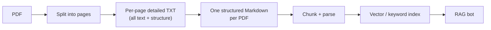
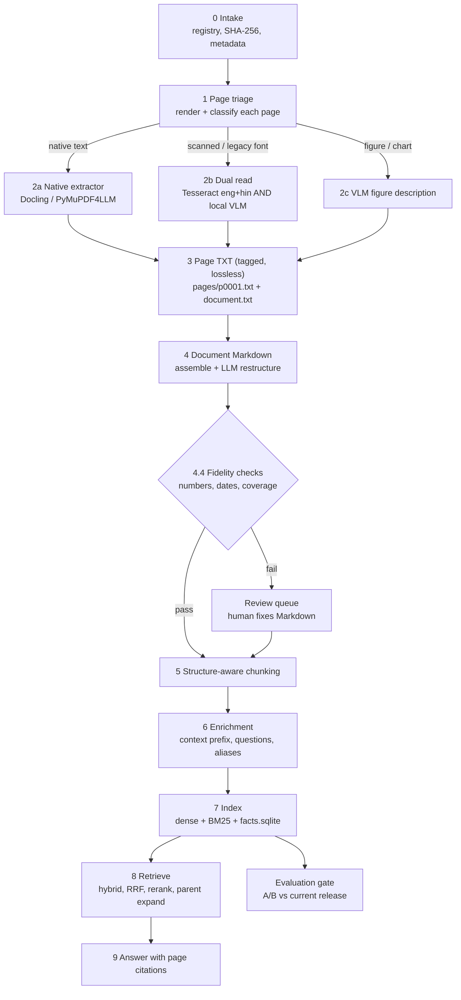
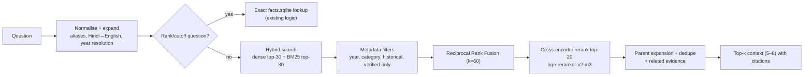

# Knowledge Base Building

> **Purpose of this document:** explore the idea of rebuilding the RAG knowledge base as
> **PDF → per-page detailed TXT → structured Markdown → chunks → index**, judge whether it is
> worth it, improve it using what others have published, and give an implementing agent a
> complete, buildable specification.
>
> **Target location for the new pipeline:** `code/knowledgebaseenhanced/`
> **Existing system it must improve on:** `code/Institute-voice-agent/institute-assistant/`
> (`assistant/kb/*`, `kb_pipeline.py`), served by `code/demo2/`.

---

## 0. TL;DR

- **The idea is sound and matches current best practice.** Parsing quality sets the *floor*
  of a RAG system. Converting PDFs to clean, hierarchical Markdown before chunking is the
  approach used by Docling, Marker, MinerU and olmOCR. Structure-aware chunking reliably
  beats page- or fixed-size chunking on documents like ours (brochures, FAQs, fee tables,
  annual reports).
- **Change the TXT stage.** It should be a *lossless, page-anchored, tagged* extraction
  (layout + tables + OCR + figure notes), not plain text. Plain text throws away the
  structure you are trying to keep.
- **The main danger is the LLM "rewrite" step.** Generative models silently "correct"
  numbers, dates, fees and ranks. Every number in the final Markdown must be machine-checked
  against the raw page text. Pages that fail go to review.
- **Add four retrieval upgrades that compound:** heading-path chunk headers, contextual
  chunk prefixes (Anthropic: −35% to −49% retrieval failures), hybrid BM25 + dense with
  reciprocal rank fusion, and a multilingual cross-encoder reranker (−67% total in
  Anthropic's tests).
- **Keep what already works:** provenance (source SHA-256, page numbers), exact SQLite
  lookups for cutoff ranks, versioned releases, and the evaluation gate.

---

## 1. The proposed idea



The motivation: today, PDFs go almost straight from `pdfplumber` text into chunks. A page is
the unit of extraction, and the document's real structure (sections, sub-sections, Q&A
pairs, table captions) is lost.

---

## 2. Is this a good idea? (research summary)

### 2.1 What the field does

| Approach | Who | Notes for us |
| --- | --- | --- |
| Layout model + table model → Markdown/JSON | **Docling** (IBM, MIT licence) | CPU-friendly. Gives headings, tables (TableFormer), reading order and **per-element page provenance**. Best fit as the primary converter. |
| Layout + OCR (Surya) + optional LLM pass → Markdown | **Marker** (GPL / RAIL-M) | Fast, good on born-digital PDFs. Optional LLM pass improves tables. |
| Multi-model fusion → Markdown | **MinerU** | Accuracy leader on complex layouts. GPU-hungry, restrictive licence. |
| VLM reads page image + PDF text "anchors" → Markdown | **olmOCR** (AI2, Qwen-VL 7B fine-tune) | Excellent, but **needs ≥12 GB VRAM**. Our RTX 4060 has 8 GB, so we can't run it locally. |
| Fast native extractor → Markdown per page | **PyMuPDF4LLM** (AGPL) | `page_chunks=True` returns Markdown + metadata per page. Good fast path / baseline. |
| Prepend 50–100 token LLM-written context to each chunk before embedding **and** BM25 | **Anthropic Contextual Retrieval** | Top-20 failure rate 5.7% → 3.7% (contextual embeddings), → 2.9% (+ contextual BM25), → 1.9% (+ reranking). |

**Common lessons from practitioners:**

1. **Hybrid routing beats one tool.** Send simple born-digital pages to a fast extractor and
   only scanned, complex or legacy-font pages to OCR/VLM.
2. **Hierarchy-aware chunking + metadata often matters more than which converter you pick.**
3. **VLM OCR hallucinations are "silent".** The output is fluent and confident, but numbers
   and table cells can be invented or "fixed". Mitigations: keep the PDF text layer as an
   anchor, cross-check against classical OCR, and send disagreements to a human.
4. **Benchmark on your own messy documents.** Public benchmarks (OmniDocBench,
   olmOCR-Bench) don't look like institute brochures.

### 2.2 Verdict on each stage of the proposal

| Stage | Verdict | Why |
| --- | --- | --- |
| PDF → pages | ✅ Keep | Pages are the natural unit for rendering, OCR, routing and **citations**. |
| Pages → "detailed TXT" | ⚠️ Keep, but redefine | Plain text loses tables, headings and reading order. Make it a **tagged** text format (§5.3), lossless and page-anchored. It is the audit trail and the "ground truth" for number checks. |
| TXT → structured Markdown | ✅ Keep (biggest win) | Rebuilds sections across page breaks, gives real headings, clean tables, and Q&A pairs. **Must be verified** (§5.4.4). |
| Markdown → chunks | ✅ Keep, make structure-aware | Split on headings. Tables stay atomic. Every chunk carries its heading path. |
| "A bot that understands the text" | ✅ Improve retrieval, not just the LLM | Contextual prefixes + hybrid search + reranker + parent expansion. |

### 2.3 Honest pros and cons

**Pros**
- Sections that span pages become one coherent unit. Today they are split at page edges.
- Tables get captions and header rows attached, so a chunk like `Tuition | 1,25,000` is
  never orphaned.
- Human-readable Markdown is easy to **review and correct**. Correcting Markdown is far
  easier than editing `reviews.json` block IDs.
- Re-chunking or re-embedding needs no re-parsing. Markdown is a stable, cacheable
  intermediate.
- Scanned pages (e.g. `ACF2026.pdf`, which has 0 extractable chars) become usable instead of
  permanently `needs_review`.

**Cons / risks**
- LLM/VLM rewriting can **fabricate or alter facts**. This is unacceptable for fees, dates,
  cutoffs and eligibility. → Fidelity checks + review queue.
- Ingestion gets slower (VLM ≈ 10–60 s per page on an 8 GB GPU). → Route only the pages that
  need it. Cache by SHA-256.
- The VLM and the chat LLM (`qwen3.5:9b`) can't share 8 GB VRAM at the same time. → Run
  ingestion as an offline batch job, separate from serving.
- Extra stages add more code and more places to lose provenance. → Page anchors are
  mandatory in every artefact.
- It won't fix failures caused by routing, prompts or missing source documents. → Measure
  with the existing evaluation set before and after.

### 2.4 Why the current PDFs "don't work well" (diagnosis of existing code)

From `assistant/kb/extraction.py`, `releases.py` and `search.py`:

1. **The page is the evidence unit.** `extract_pdf()` emits blocks per page, so headings and
   sections are never reconstructed and content that crosses a page break is split.
2. **Tables are separated from their context.** Table blocks are `" | ".join(cells)` with no
   caption or section heading, so rows lose meaning.
3. **OCR'd and table content is excluded from answers.** Scanned pages, figures and *all*
   tables start as `needs_review`. `eligible()` in `search.py` only admits `extracted` /
   `approved`. As recorded in `demo2/KNOWLEDGE_BASE.md`, 267 blocks were still pending
   review, so a large part of the corpus is invisible to the bot.
4. **Multi-column brochures** depend on pdfplumber's reading order, which interleaves
   columns.
5. **Legacy Hindi fonts** (Kruti Dev / Chanakya / DevLys) produce mojibake in the text layer
   and need OCR.
6. **Chunks have no document context.** Embeddings see a chunk with only a title prefix, so
   "Last date is 15 July" doesn't say *what* it is the last date for.

---

## 3. Improved design



**Design principles**

1. **Lossless before clever.** Stage 3 never paraphrases. Only Stage 4 restructures, and it
   is verified against Stage 3.
2. **Every artefact is page-anchored.** Page numbers flow PDF → TXT → Markdown → chunk →
   citation.
3. **Deterministic first, LLM second.** Use LLMs only where deterministic tools fail
   (structure inference, scanned pages, figures, context prefixes).
4. **Content-addressed caching.** Each stage output is keyed by
   `sha256(input) + stage_version + model_id`. Nothing is recomputed unless its input
   changed.
5. **Local-first.** Everything runs on the laptop (RTX 4060 8 GB, Ollama). Cloud (Groq) is
   optional and explicit.

---

## 4. Constraints the implementing agent must respect

- **Environment:** conda env `minor`. Do **not** upgrade or replace shared torch, CUDA,
  transformers or speech packages (see `demo2/requirements.txt` and
  `compatibility-constraints.txt`). Install new packages in a way that doesn't disturb
  them. If a package conflicts, make it optional and report it.
- **Hardware:** NVIDIA RTX 4060 Laptop, 8 GB VRAM. Use one GPU model at a time. Ingestion
  must be able to run CPU-only (slower) if the GPU is busy.
- **LLM runtime:** Ollama at `http://127.0.0.1:11434`. The chat model is `qwen3.5:9b`. Check
  `ollama list` before assuming any vision model exists, and pull it explicitly if the user
  agrees.
- **Languages:** English, Hindi (Devanagari) and Hinglish. Tesseract `eng+hin` data already
  lives in `institute-assistant/kb_state/models/tessdata`.
- **Never alter source facts.** Numbers, dates, money amounts, ranks, names and URLs must be
  reproduced exactly as in the source.
- **Never edit an active release** of the existing system. New output goes into new
  releases only.
- **Source corpus:** `institute-assistant/knowledge_base/**` plus `kb_sources.json`. Current
  PDFs:

  | File | Pages | Nature |
  | --- | --- | --- |
  | `academics/ACF2026.pdf` | 2 | **Scanned** (no text layer) |
  | `admissions/B TECH_2026.pdf` | 13 | Brochure, mixed layout/tables |
  | `admissions/JOSAA 2026 _ IIIT NAYA RAIPUR.pdf` | 2 | Web printout |
  | `general/AR_2022_23.pdf` | 104 | Annual report: long, tables, figures |
  | `general/FAQs _ IIIT NAYA RAIPUR.pdf` | 4 | Q&A web printout |
  | `general/NIFRengineering.pdf`, `NIRFoverall.pdf` | 5, 6 | Dense data tables |

---

## 5. Pipeline specification

### 5.1 Directory layout

```text
code/knowledgebaseenhanced/
├── Knowledge Base Building.md      # this document
├── README.md                       # how to run (agent writes)
├── kbb/                            # python package
│   ├── __init__.py
│   ├── config.py                   # paths, model ids, thresholds (env-overridable)
│   ├── registry.py                 # Stage 0
│   ├── triage.py                   # Stage 1
│   ├── extract_native.py           # Stage 2a
│   ├── extract_ocr.py              # Stage 2b (tesseract + VLM dual read)
│   ├── describe_figures.py         # Stage 2c
│   ├── page_txt.py                 # Stage 3 writer/reader (tagged format)
│   ├── assemble_md.py              # Stage 4 deterministic assembly
│   ├── restructure_md.py           # Stage 4 LLM restructuring
│   ├── verify.py                   # Stage 4.4 fidelity checks
│   ├── chunk.py                    # Stage 5
│   ├── enrich.py                   # Stage 6
│   ├── index.py                    # Stage 7
│   ├── retrieve.py                 # Stage 8
│   ├── answer.py                   # Stage 9 (thin; reuse existing graph if integrating)
│   ├── evaluate.py                 # metrics + A/B report
│   ├── export_legacy.py            # adapter → existing release format
│   └── llm.py                      # Ollama/Groq client wrappers with caching
├── prompts/                        # versioned prompt files (*.md)
├── kbb_cli.py                      # single CLI entry point
├── tests/
└── data/                           # (exists) all generated artefacts, git-ignored
    ├── registry.json
    ├── cache/                      # content-addressed stage caches
    ├── docs/<doc_id>/
    │   ├── source.pdf -> symlink or copy
    │   ├── triage.json
    │   ├── images/p0001.png        # rendered pages (150–200 DPI; 300 for OCR)
    │   ├── pages/p0001.txt         # Stage 3 tagged page text
    │   ├── document.txt            # all pages concatenated
    │   ├── document.draft.md       # Stage 4 deterministic assembly
    │   ├── document.md             # Stage 4 final (restructured + verified)
    │   ├── verify.json             # fidelity report
    │   └── chunks.jsonl            # Stage 5–6 output
    ├── review/                     # pages/sections awaiting human review
    ├── index/<build_id>/           # chroma/, bm25.json, facts.sqlite, manifest.json
    └── eval/<build_id>.json
```

### 5.2 Stage 0: Intake and registry

- Walk the source folders and `kb_sources.json`. For each PDF compute `sha256`, page count,
  and the metadata already in the registry: `title`, `category`, `topic`, `years`,
  `period`, `programme`, `historical`, `source_url`.
- `doc_id = <category>-<slug(title)>-<sha256[:8]>`.
- Skip duplicates by SHA-256. Mark retired sources and don't build them.

### 5.3 Stages 1–3: Page triage, extraction, tagged page TXT

#### Stage 1: Triage (per page)

Render every page with `pypdfium2` (already a pdfplumber dependency) and classify it:

| Class | Rule (starting heuristics, tune on corpus) | Route |
| --- | --- | --- |
| `native` | ≥ 40 meaningful chars in the text layer, no mojibake | 2a |
| `scanned` | < 40 chars and has images, **or** text layer empty | 2b |
| `legacy_font` | font names match `kruti\|chanakya\|devlys`, or mojibake patterns (`Nk=o`, `vk;qDr`) | 2b |
| `table_heavy` | detected table area > 40% of page | 2a + table model; VLM table cross-check optional |
| `figure` | image/vector region ≥ 90×45 pt (reuse the existing threshold) | 2c for that region |

Save `triage.json` with each page's class, char count, fonts, image boxes and table boxes.

#### Stage 2a: Native extraction

- **Primary: Docling** `DocumentConverter`, table structure enabled, OCR disabled for native
  pages. Use its JSON (`DoclingDocument`) rather than only `export_to_markdown()`, so each
  element keeps `page_no` and `bbox`.
- **Fallback / baseline: PyMuPDF4LLM** `to_markdown(path, page_chunks=True)`. Also use it to
  A/B quality on 10–20 hard pages.
- Remove repeated headers and footers (lines appearing on ≥ 60% of pages, reusing the
  existing logic).

#### Stage 2b: Scanned / legacy-font pages, the "dual read"

1. **Read A, classical OCR:** Tesseract `eng+hin` at 300 DPI, TSV output with word
   confidences (reuse `ocr_image()` / `scanned_grid()` ideas from `extraction.py`).
2. **Read B, local VLM:** send the page image to a vision model in Ollama (for example a
   Qwen2.5-VL-7B-class model, quantised to fit 8 GB, or whatever current VLM fits; verify
   availability). Use the strict transcription prompt in §7.1. If the PDF has any text
   layer, pass it as an "anchor" (the olmOCR technique).
3. **Consensus:** for every number, date or amount token, compare reads A and B.
   - Both agree → `confidence: high`.
   - Only the VLM has it, or they disagree → `confidence: low`, and the page goes to
     `review/`.
   - Prose differences that don't involve numbers → keep the VLM text (better reading order
     and Devanagari), record the OCR text alongside it.

#### Stage 2c: Figures and charts

- Crop the region and ask the VLM for a **factual description**: chart type, axis labels,
  legend, and only values that are **printed** on the figure. Never estimate values from bar
  heights.
- Mark it `kind: figure`, `method: vlm`. Figures are low-priority evidence and can't be the
  sole support for a numeric answer.

#### Stage 3: Tagged page TXT format (the "highly detailed TXT")

One file per page, plus a concatenated `document.txt`. The format is plain UTF-8 text with
**line-oriented tags**, so it is human-readable, diffable and parseable:

```text
=== PAGE 4 / 13 ===
@doc_id: admissions-btech-2026-3fa9c1d2
@source_file: admissions/B TECH_2026.pdf
@source_sha256: 3fa9c1d2...
@page_class: native
@methods: docling
@reading_order: column-major (2 columns)

[HEADING level=1 bbox=56,62,540,90]
Fee Structure 2026-27

[PARAGRAPH bbox=56,100,280,180]
The following fees are payable at the time of admission ...

[TABLE id=p4-t1 rows=6 cols=3 bbox=56,200,540,420 method=docling-tableformer]
[CAPTION] Table 2: Fee structure for B.Tech (per semester)
| Fee Type | General/OBC (₹) | SC/ST (₹) |
| Tuition Fee | 1,25,000 | 0 |
| Hostel Fee | 30,000 | 30,000 |
[/TABLE]

[LIST style=bullet]
- Fees once paid are non-refundable except ...
[/LIST]

[FIGURE id=p4-f1 bbox=300,430,540,600 method=vlm confidence=medium]
Bar chart titled "Placement statistics 2025"; printed labels: CSE 92%, ECE 85%.
[/FIGURE]

[FOOTNOTE]
* Subject to revision by the Board of Governors.

[OCR_ALT method=tesseract conf=71.4]   # present only for 2b pages
...raw tesseract text...
[/OCR_ALT]

[FLAGS] numbers_low_confidence=["30,000"]  # empty if none
```

**Rules**
- Tags in square brackets on their own line. Content is verbatim. No paraphrasing.
- Tables are always pipe rows with the header row first. Merged cells are expanded
  (repeated values) and the expansion noted with `merged=true`.
- Keep Devanagari as Unicode. Never transliterate at this stage.
- Write a `page_txt.py` parser that round-trips this format into Python objects. Tests must
  cover it.

### 5.4 Stage 4: Structured Markdown per document

#### 5.4.1 Deterministic assembly (`document.draft.md`)

Built from `pages/*.txt` with **no LLM**:

- Concatenate pages in order. Insert `<!-- page: N -->` anchors at every page start.
- Map `[HEADING level=k]` → `#`×k. If the extractor gave no levels, infer them from font
  size ranks (Docling/PyMuPDF give sizes).
- Join paragraphs split across a page break (last line has no terminal punctuation and the
  next page starts lowercase or mid-sentence). Keep the page anchor inline.
- Merge tables continued across pages: same column count and header repeated or absent →
  one table, with a `<!-- table-continues: page N -->` marker.
- Tables → GFM pipe tables preceded by a caption line and `<!-- table: id pages: 4-5 -->`.
- Figures → blockquote `> **Figure (p. 5, machine-described):** ...`.

#### 5.4.2 LLM restructuring (`document.md`)

Use the local LLM (`qwen3.5:9b` via Ollama, `temperature=0`) **section by section**
(≤ ~3k tokens input each) to:

- Fix the heading hierarchy (e.g. ALL-CAPS lines that are really headings, numbered
  sections `3.2.1`).
- Turn FAQ pages into `### Q: ...` / answer pairs.
- Turn label-value layouts ("Last date ........ 15 July 2026") into lists or tables.
- Add a **one-line section summary** as an HTML comment (`<!-- summary: ... -->`). This is
  used for context and is **not** treated as evidence.
- **Forbidden:** changing, adding or removing any fact, number, date, name or URL. Merging
  separate tables. Translating.

The prompt is in §7.2. If verification fails twice for a section, fall back to the draft
version of that section.

#### 5.4.3 Front-matter and document shape

```markdown
---
doc_id: admissions-btech-2026-3fa9c1d2
title: "B.Tech Admission Brochure 2026"
source_file: "admissions/B TECH_2026.pdf"
source_sha256: 3fa9c1d2...
source_url: ""
category: admissions
topic: btech-admission
years: [2026]
period: "2026-27"
languages: [en]
pages: 13
pipeline_version: kbb-1.0
extracted_at: 2026-10-04T00:00:00+05:30
verification: { status: passed, numbers_checked: 214, mismatches: 0, review_pages: [] }
summary: "Official IIIT-NR B.Tech 2026 brochure: programmes, intake, fees, hostel, scholarships, important dates."
---

# B.Tech Admission Brochure 2026

## Fee Structure 2026-27
<!-- page: 4 -->
<!-- summary: Per-semester B.Tech fees by category and refund conditions. -->

The following fees are payable at the time of admission ...

<!-- table: p4-t1 pages: 4 -->
**Table 2: Fee structure for B.Tech (per semester)**

| Fee Type | General/OBC (₹) | SC/ST (₹) |
| --- | --- | --- |
| Tuition Fee | 1,25,000 | 0 |
| Hostel Fee | 30,000 | 30,000 |

- Fees once paid are non-refundable except ...

> **Footnote (p. 4):** Subject to revision by the Board of Governors.
```

#### 5.4.4 Fidelity verification (`verify.py`), mandatory

Run on `document.md` against `pages/*.txt`. Run it per section, scoped to the section's
page range.

| Check | Rule | On failure |
| --- | --- | --- |
| **Number fidelity** | Every number, date, ₹ amount, %, rank and phone number in the Markdown (normalised: strip commas/spaces, unify `₹`/`Rs.`, Devanagari digits → ASCII) must occur in the TXT of the cited pages. | Section → fall back to draft; if the draft also fails → `review/` |
| **Reverse coverage** | ≥ 98% of number tokens in the TXT appear in the Markdown (nothing dropped). | Same as above |
| **Text coverage** | Token-level recall of TXT words in the Markdown ≥ 0.95 (excluding removed headers/footers). | Flag section |
| **Table integrity** | Same row × column count as the TXT table, and cell multiset equal. | Use the TXT table verbatim |
| **Page anchors** | Every page that has content has an anchor. Anchors are monotonic. | Fail build |
| **URL/email fidelity** | Exact string match. | Fall back |
| **Low-confidence OCR** | Any `[FLAGS] numbers_low_confidence` on a page → that page's sections are `needs_review`. | Review queue |

Write `verify.json` with per-section results. Provide a review command that opens the
page image next to its Markdown section, so a human can correct the Markdown and record
`reviewer` + `reviewed_at` (this mirrors the existing `reviews.json` discipline).

### 5.5 Stage 5: Structure-aware chunking

Algorithm:

1. Parse `document.md` into a section tree (headings). Each node holds its text, its tables
   and its page range.
2. **Unit types:**
   - `section`: prose under the deepest heading.
   - `table`: one whole table, **atomic** if ≤ budget. Otherwise split into row groups, and
     **repeat the header row and caption in every part**.
   - `table_row_facts`: for small key tables (fees, dates, intake, cutoffs), also emit one
     serialised line per row, e.g.
     `Fee Structure 2026-27 › Tuition Fee › General/OBC: ₹1,25,000 per semester`.
     These are great for BM25 and exact questions.
   - `faq`: one Q&A pair per chunk.
   - `figure`: the figure description (low priority).
3. **Size:** target 250–450 tokens, hard max 512 with the E5 tokenizer (the current
   embedding limit). Split oversized sections at paragraph, then sentence, boundaries with
   ~10–15% overlap. Never split inside a table row or list item.
4. Merge tiny sibling sections (< 60 tokens) with their next sibling under the same parent.
5. **Chunk header** (prepended to the text used for embedding and BM25, but kept separately
   in metadata):
   ```text
   [B.Tech Admission Brochure 2026 › Fee Structure 2026-27] (pages 4–5, 2026-27)
   ```
6. **Parent link:** each chunk stores `parent_id`, the full section (≤ 3,500 chars, matching
   the existing `search.py` behaviour) to return at answer time.

**Chunk record (`chunks.jsonl`)**

```json
{
  "chunk_id": "admissions-btech-2026-3fa9c1d2:fee-structure:003",
  "doc_id": "admissions-btech-2026-3fa9c1d2",
  "parent_id": "admissions-btech-2026-3fa9c1d2:fee-structure",
  "kind": "table",
  "heading_path": ["B.Tech Admission Brochure 2026", "Fee Structure 2026-27"],
  "page_start": 4, "page_end": 4,
  "text": "| Fee Type | General/OBC (₹) | SC/ST (₹) | ...",
  "context": "This table from the IIIT-NR B.Tech 2026 brochure lists per-semester fees ...",
  "questions": ["What is the B.Tech tuition fee for 2026?", "बी.टेक की फीस कितनी है?"],
  "keywords": ["tuition", "hostel", "fee", "फीस"],
  "language": "en",
  "category": "admissions", "topic": "btech-admission",
  "years": [2026], "period": "2026-27", "historical": false,
  "source_file": "admissions/B TECH_2026.pdf", "source_sha256": "3fa9c1d2...",
  "source_url": "", "extraction_method": "docling",
  "verification_status": "verified",
  "token_count": 212
}
```

### 5.6 Stage 6: Enrichment (offline, cached)

All enrichment is generated with the local LLM, cached by `sha256(chunk + prompt_version +
model)`, and **never shown as evidence**. It only improves retrieval.

1. **Contextual prefix** (Anthropic Contextual Retrieval). Input: the document `summary` +
   heading path + parent section + the chunk. Output: 50–100 tokens situating the chunk
   (what document, what period, what entity, what the chunk is about). Prompt in §7.3.
   Embed and BM25-index `header + context + text`.
2. **Hypothetical questions** (doc2query): 2–4 questions the chunk answers, **including at
   least one in Hindi/Hinglish** for bilingual recall. Index them as extra BM25 text and as
   separate small vectors pointing to the same chunk.
3. **Keywords / aliases:** abbreviations and synonyms (e.g. IIIT-NR ↔ IIIT Naya Raipur ↔
   Dr. SPM IIIT; fee ↔ फीस; hostel ↔ छात्रावास). Keep a hand-editable `aliases.yaml`
   merged with the LLM output.

### 5.7 Stage 7: Indexing

- **Dense:** Chroma, cosine. Start with the **existing** `intfloat/multilingual-e5-small`
  (`passage:` / `query:` prefixes) so results compare like-for-like with the current
  release. Then A/B **`BAAI/bge-m3`** (multilingual, 8k context, fits on CPU/GPU) as an
  upgrade candidate.
- **Sparse:** BM25 over `header + context + text + questions + keywords`, with Indic-aware
  tokenisation (reuse `tokens()` from `search.py`).
- **Structured facts:** keep the existing `facts.sqlite` cutoff tables and exact-lookup path
  untouched. Optionally add `fee_facts`, `date_facts` and `intake_facts` from
  `table_row_facts` chunks that passed verification.
- **Manifest:** build id, embedding model + revision, chunk counts by kind, source hashes,
  prompt versions and verification summary. Builds are immutable.

### 5.8 Stage 8: Retrieval



- Keep the existing filters: year intersection, `historical` exclusion unless asked,
  verified-only.
- Reranker: `BAAI/bge-reranker-v2-m3` (multilingual, handles Hindi). Run on CPU for ~20
  pairs. Make it optional through config, with a latency budget (skip if > 1.5 s).
- Return `RetrievedChunk`-compatible objects: `source_file`, `page_number` (= `page_start`),
  `title`, `period`, `kind`, `block_id` (= `parent_id`), plus `heading_path`.

### 5.9 Stage 9: Answering

- When integrating, reuse the existing LangGraph answer/grounding nodes. Only the retriever
  changes.
- Context block format given to the LLM:
  ```text
  [S1] B.Tech Admission Brochure 2026 › Fee Structure 2026-27 (p. 4, 2026-27)
  <parent section text>
  ```
- The answer must cite `[S#]` with page. If the evidence doesn't contain the answer, say so
  (keep the existing refusal behaviour). Numbers must be copied from the context.

---

## 6. Evaluation and release gate

**Golden set.** Reuse the existing evaluation cases (`assistant/kb/evaluation.py`,
`evaluate_helpdesk.py`, ≥ 90 cases) and add ~50 new ones targeting the new capabilities:
cross-page sections, fee and date tables, FAQ items, the scanned ACF2026 calendar, Hindi
questions and annual-report facts. Each case stores the expected `source_file` + `page` +
exact answer string.

| Metric | Definition | Target |
| --- | --- | --- |
| Evidence Recall@5 / @20 | Expected page appears in the top-k chunks | ≥ 0.90 / ≥ 0.97 |
| MRR | Mean reciprocal rank of the first correct chunk | ↑ vs baseline |
| Exact-cutoff checks | Existing structured checks | 100% pass |
| Number fidelity | Verified sections / all sections | ≥ 0.98, 0 unflagged mismatches |
| Page coverage | Pages with answerable content / non-blank pages | ≥ 0.95 (baseline is lower because of `needs_review`) |
| Answer faithfulness | LLM-judge + manual spot check: every claim supported | ≥ 0.95 |
| Latency | p50 retrieval time (with reranker) | ≤ 1.5 s on CPU |

**A/B protocol.** Run the same questions against (a) the current active release and (b) the
new build. Report per-case wins and losses in `data/eval/<build_id>.json` plus a Markdown
summary. **Promote only if the new build is ≥ baseline on every gate and better on recall
or coverage.**

---

## 7. Prompts (store in `prompts/`, versioned)

### 7.1 Page transcription (VLM)

```text
You are a transcription engine, not an editor.
Transcribe EVERYTHING visible on this page image into the tagged format below.
Rules:
- Copy text exactly, including numbers, dates, currency, punctuation, spelling mistakes.
- Do NOT correct, translate, summarise, or infer missing text. Use [ILLEGIBLE] if unreadable.
- Keep Hindi in Devanagari Unicode. Keep English as is.
- Follow the visual reading order (columns top-to-bottom, left column first).
- Tables: output [TABLE] with pipe-separated rows, header row first; expand merged cells.
- Figures: output [FIGURE] with only text printed on the figure. Never estimate values.
- Use tags: [HEADING level=n], [PARAGRAPH], [LIST], [TABLE]...[/TABLE], [FIGURE]...[/FIGURE], [FOOTNOTE].
{anchor_block}   # optional: "Native text layer (may be garbled, use only to confirm characters): ..."
Output only the tagged transcription.
```

### 7.2 Section restructuring (LLM)

```text
You restructure document text into clean Markdown WITHOUT changing content.
Input: one section of a document in draft Markdown with <!-- page: N --> anchors.
Allowed: fix heading levels; convert label/value lines into lists or tables;
format FAQ as "### Q: ..." followed by the answer; join broken lines; add ONE
<!-- summary: ... --> comment (≤ 25 words) under the section heading.
Forbidden: changing/adding/removing any number, date, amount, name, URL or fact;
translating; merging or splitting tables; removing page anchors; adding commentary.
If unsure, leave the text unchanged.
Return only the Markdown section.
```

### 7.3 Contextual chunk prefix (LLM)

```text
<document_summary>{doc_summary}</document_summary>
<section_path>{heading_path}</section_path>
<section>{parent_section_text}</section>
<chunk>{chunk_text}</chunk>
Write 1–3 sentences (50–100 tokens) that situate this chunk within the document for
search retrieval: name the institution, document, academic year/period and what the chunk
is about. Do not restate numbers. Answer only with the context.
```

### 7.4 Hypothetical questions (LLM)

```text
Given this chunk and its context, write 3 short questions a student might ask that this
chunk directly answers: 2 in English and 1 in Hindi (Devanagari) or Hinglish.
Return a JSON list of strings only.
```

---

## 8. CLI

```bash
conda activate minor
cd "/run/media/rtx/Files/Study/Semester 5/Minor/code/knowledgebaseenhanced"

python kbb_cli.py register                # Stage 0
python kbb_cli.py triage   [--doc ID]     # Stage 1
python kbb_cli.py extract  [--doc ID]     # Stages 2–3  -> pages/*.txt, document.txt
python kbb_cli.py markdown [--doc ID]     # Stage 4     -> document.md + verify.json
python kbb_cli.py review                  # list/open sections needing human review
python kbb_cli.py chunk                   # Stage 5–6   -> chunks.jsonl
python kbb_cli.py index                   # Stage 7     -> data/index/<build_id>
python kbb_cli.py ask "What is the B.Tech hostel fee?"   # Stage 8 debug, prints chunks + scores
python kbb_cli.py evaluate --baseline     # A/B vs current active release
python kbb_cli.py export-legacy --build ID   # optional: emit existing release format
python kbb_cli.py all                     # run everything incrementally (cache-aware)
```

Every command is **idempotent and incremental**: it only reprocesses documents whose
SHA-256, stage version or model changed. It prints a short summary (pages processed,
cache hits, flags, elapsed time).

---

## 9. Integration with the existing system

Two options. **Build A first, then B.**

- **A. Standalone (development):** `kbb/retrieve.py` + `kbb_cli.py ask` / `evaluate`
  against its own index. Fast iteration and no risk to Demo 2.
- **B. Drop-in (production):** `export_legacy.py` converts verified chunks/sections into the
  block/parent schema the existing pipeline uses (`make_block()` fields: `id`, `source_id`,
  `source_file`, `title`, `category`, `topic`, `page_number`, `kind`, `text`,
  `source_sha256`, `years`, `period`, `verification_status`, ...). Then
  `kb_pipeline.py build → evaluate → activate` reuses the existing release, rollback and
  evaluation gate. Inspect `assistant/kb/releases.py` and `search.py` for the exact schema
  before writing the adapter. Add `heading_path` and `context` as extra metadata.

> **Decision for the user:** should machine-verified OCR/VLM content (dual-read consensus +
> number fidelity passed) be **answerable without manual approval**? The current policy says
> no ("never promote uncertain OCR"). The recommended middle ground is a new status,
> `machine_verified`, answerable but labelled "from scanned document" in citations, with
> all fees, dates and eligibility conditions still requiring human approval.

---

## 10. Build order (milestones)

1. **Skeleton + Stage 0–1:** registry, rendering, triage report for all 7 PDFs. *Check:*
   `ACF2026.pdf` classified `scanned`; brochure pages `native`.
2. **Stage 2a + 3:** Docling extraction → tagged page TXT, plus the round-trip parser and
   tests. *Check:* NIRF tables come out with the correct row/column counts.
3. **Stage 2b/2c:** Tesseract + VLM dual read and figure descriptions. *Check:* ACF2026 dates
   transcribed, and disagreements flagged.
4. **Stage 4:** draft assembly → restructuring → `verify.py`. *Check:* 0 unflagged number
   mismatches across the corpus. Fee tables identical to the source.
5. **Stage 5–7:** chunking, enrichment and index. *Check:* no chunk > 512 E5 tokens, every
   chunk has pages and a heading path.
6. **Stage 8 + evaluation:** hybrid + RRF + reranker, A/B report vs the active release.
7. **Integration (option B)** only after the A/B passes. Then update `demo2/KNOWLEDGE_BASE.md`.

## 11. Acceptance criteria

- [ ] Every PDF page is accounted for in `triage.json` (native / scanned / blank / error,
      never silently dropped).
- [ ] Every page has a tagged `pages/pNNNN.txt`, and every document has `document.txt` +
      `document.md`.
- [ ] `verify.py` reports 0 unflagged numeric mismatches. Flagged items are in `review/`.
- [ ] Every chunk carries `source_file`, `source_sha256`, `page_start`, `page_end` and
      `heading_path`.
- [ ] Re-running `kbb_cli.py all` without source changes does no LLM/VLM calls (all cache
      hits).
- [ ] The A/B evaluation shows evidence Recall@5 ≥ the current release, all exact-cutoff
      checks pass, and page coverage improves.
- [ ] Unit tests cover the TXT parser, number normalisation/fidelity, table splitting with
      header repetition, chunk size limits and RRF.
- [ ] `README.md` documents setup, models to pull, commands and how to review/correct
      sections.

## 12. Risks and mitigations

| Risk | Mitigation |
| --- | --- |
| VLM/LLM alters numbers or facts | Lossless TXT ground truth, number fidelity + reverse coverage, fallback to the draft, review queue |
| VLM too slow or doesn't fit in 8 GB | Route only scanned/legacy pages to the VLM. Quantised model. CPU Tesseract fallback. Batch offline |
| Chat model and VLM compete for VRAM | Never ingest while Demo 2 is serving. Unload models (`keep_alive: 0`) between stages |
| Hindi legacy fonts / Devanagari OCR errors | Dual read (Tesseract `hin` + VLM). Low-confidence → review |
| Over-merged or over-split sections | Size limits, tiny-section merging, tests on FAQ/NIRF/AR documents |
| Enrichment text pollutes evidence | Context and questions are indexed for retrieval only. Answers quote the original section text |
| Licence issues (PyMuPDF AGPL, Marker GPL) | Docling (MIT) is primary. Others are optional. Fine for academic use, but note in README |
| Regression vs current bot | Immutable builds, A/B gate, existing rollback path |

---

## 13. References

- Anthropic, *Introducing Contextual Retrieval*: https://www.anthropic.com/news/contextual-retrieval
- Docling (IBM): https://github.com/docling-project/docling
- Marker (Datalab): https://github.com/datalab-to/marker
- MinerU (OpenDataLab): https://github.com/opendatalab/MinerU
- olmOCR (AI2), document-anchoring VLM OCR, needs ≥ 12 GB VRAM: https://github.com/allenai/olmocr
- PyMuPDF4LLM: https://pymupdf.readthedocs.io/en/latest/pymupdf4llm/
- LangChain `MarkdownHeaderTextSplitter` (structure-aware chunking reference)
- BGE-M3 embeddings and `bge-reranker-v2-m3`: https://huggingface.co/BAAI
- OmniDocBench / olmOCR-Bench: document-parsing benchmarks (use only as a guide, and
  benchmark on our own PDFs)
