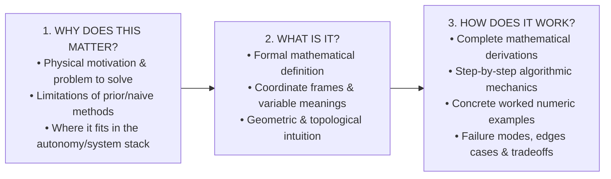
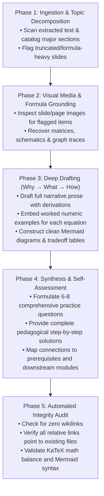

# Intuitive Notes Creator: Graduate-Level Study Notes Runbook

This skill defines the complete end-to-end engineering and pedagogical workflow for transforming raw, unstructured, bullet-heavy, or mathematically fragmented course materials into **mastery-grade, deeply intuitive Obsidian study notes**.

The output notes are designed to be self-contained: a student or engineer reading the note should understand not only **what** a formula or algorithm is, but **why** it was conceived, **how** it operates step-by-step, **where** it fails, and **how** to solve numerical problems by hand.

---

## 1. Core Pedagogical Philosophy: Why → What → How

Never transcribe slide bullets verbatim. Slides are visual presentation aids designed for spoken lectures; study notes are self-contained learning instruments. Every concept, algorithm, and theorem must be developed as a **narrative journey**:



### 1. Why does this matter?
- Situate the topic within the global engineering stack (e.g., in autonomous systems: $\text{SENSE} \rightarrow \text{PERCEIVE} \rightarrow \text{PLAN} \rightarrow \text{ACT}$).
- Present the fundamental physical dilemma or computational bottleneck that necessitates this concept.
- Highlight the failure modes of naive alternatives (e.g., why RNNs fail on long sequences due to gradient vanishing, why pinhole cameras suffer from aperture diffraction vs. blur tradeoffs, why grid search suffers from the curse of dimensionality).

### 2. What is it?
- Provide rigorous, unambiguous definitions.
- Explicitly state variable definitions, physical units, matrix dimensions, and coordinate frames.
- Provide geometric, probabilistic, or topological mental models so the reader visualizes the mathematics before calculating.

### 3. How does it work?
- Walk through the algorithm or physical process step-by-step.
- **Derive equations** from first principles (geometry, optics, calculus, Bayes' rule, optimization). Never present a complex equation as a fait accompli.
- Explain the physical meaning of every term and constant.
- Ground the theory in a **concrete worked numerical example**.

---

## 2. Mathematical Rigor & KaTeX Standards

All mathematics must be fully KaTeX-compatible for seamless rendering in Obsidian and GitHub markdown viewers.

### Display Math (`$$ ... $$`)
Use display math blocks for all primary definitions, derivations, systems of equations, and matrices:
- Separate display math blocks with newlines before and after.
- Explicitly format matrices with dimensions and row/column alignment:
  $$
  \mathbf{K} = \begin{bmatrix} f_x & s & c_x \\ 0 & f_y & c_y \\ 0 & 0 & 1 \end{bmatrix} \in \mathbb{R}^{3 \times 3}
  $$
- In multi-step algebraic derivations, show the algebraic transitions explicitly using `\implies` or aligned notation so the reader never has to guess how step $A$ led to step $B$.

### Inline Math (`$ ... $`)
- Wrap every mathematical variable, matrix symbol, dimension, scalar, or index in single dollar signs: e.g., $\mathbf{x} \in \mathbb{R}^d$, $N = 100$ tokens, $\sigma^2$ variance.
- Never write naked mathematical letters (e.g., write "$f(x)$", never "f(x)").

---

## 3. Mandatory Worked Numeric Examples

Every primary equation, algorithm, or metric introduced in the note **must** be accompanied by an explicit worked example with small, verifiable numbers.

### Required Worked Example Format:
```markdown
### Worked Example: [Descriptive Title]

Given:
- Parameter 1: [value with physical units]
- Parameter 2: [value with physical units]

Calculate: [Clear objective statement]

**Solution:**

Step 1: [State governing formula and intermediate substitution]
$$
\text{formula} = \text{substitution} = \text{intermediate result}
$$

Step 2: [Next arithmetic or geometric step]

Result:
[Final boxed or bold answer with physical interpretation and reality check]
```

### Rules for Example Numbers:
1. Use **small, clean, realistic numbers** (e.g., focal length $f = 500\text{ px}$, baseline $B = 0.2\text{ m}$, grid size $4 \times 4$).
2. Avoid arbitrary black-box outputs. The arithmetic must be transparent enough for a student to verify with pencil and paper.
3. Conclude with an **interpretation**: explain what the number means physically (e.g., *"Because disparity decreased by 5 pixels, metric depth increased from 10 m to 14.3 m, illustrating that stereo resolution degrades quadratically with distance."*).

---

## 4. Visual Synthesis: Mermaid Diagrams & Tradeoff Tables

### Mermaid Diagrams
Use Mermaid diagrams to visualize pipelines, data flows, state machines, and system architectures:
- Syntax: Use `flowchart LR` (horizontal) or `flowchart TD` (vertical).
- **Auto-Theming Rule**: Strictly **NO** custom CSS directives (`fill`, `stroke`, `style`), **NO** `classDef` rules, and **NO** inline HTML (`<br/>` inside brackets can break some parsers; prefer clean multi-line labels using quotes or separate subgraphs).
- Subgraphs: Group logical stages (e.g., `subgraph See`, `subgraph Think`, `subgraph Act`) to show system hierarchies.

### Tradeoff Comparison Tables
Whenever competing algorithms, sensors, or mathematical formulations exist, summarize their properties in a Markdown table:
- Standard columns: `| Method / Model | Core Principle | Primary Strengths | Critical Limitations | Autonomous Systems Role |`
- Contrast theoretical asymptotic complexity with practical real-time execution bounds (e.g., $O(N^2)$ vs. GPU tensor core utilization).

---

## 5. Visual Inspection of Source Media (The Image Recovery Heuristic)

Slide text extraction from PDFs or presentations is notoriously lossy:
- Mathematical equations, Greek letters, and matrix brackets often get stripped or become garbled unicode.
- Schematics, architecture diagrams, step-by-step visual graphs, and plots are often reduced to just slide numbers or empty bullet points.

### The Inspection Rule:
**If a slide's extracted text looks incomplete, vague, or contains only a title (e.g., "Coordinate Frames", "Architecture", "Step 1", "Algorithm"), you MUST inspect the corresponding slide image.**

1. Identify the image path corresponding to the slide index (e.g., `imgs/s<Deck>-<Index>.png` or page render).
2. Use the file viewing tool to visually examine the diagram, formula, or flowchart.
3. **Visually recover**:
   - The exact mathematical symbols, indices, and matrix layouts.
   - The topological layout of graph nodes, costs, and connectivity.
   - The visual architecture (e.g., encoder-decoder arrows, residual bypasses, channel dimensions).
4. **Translate the image into words and code**: Describe the diagram fully in structured prose and reconstruct its logical flow as a clean Mermaid diagram. **Never write "as shown in the diagram" without fully explaining what is depicted.**

---

## 6. Obsidian Markdown & Linking Conventions

To ensure the study notes form a cohesive, interlinked **Knowledge Graph** in Obsidian:

1. **Standard Markdown Links Only**:
   - Use plain Markdown links: `[Deck Title](filename.md)`.
   - **DO NOT USE WIKILINKS** (`[[filename]]`): Wikilinks break portability across standard GitHub / web viewers and external tool parsers.
2. **Angle Brackets for Paths with Spaces**:
   - When linking to source PDFs or references with spaces, wrap the URI in angle brackets:
     `[Source PDF](<../Lectures/2. Image Formation.pdf>)`
3. **Interactive Table of Contents**:
   - Every note must have an H2 `## Contents` section with numbered anchor links pointing to all primary H2 sections.
4. **Strategic Obsidian Callouts**:
   - Use GitHub-style / Obsidian callouts for high-value pedagogical interventions:
     - `> [!NOTE]`: Historical context or foundational definitions.
     - `> [!TIP]`: Implementation details, vectorization tricks, or numerical stability considerations.
     - `> [!WARNING]`: Critical edge cases, mathematical pitfalls, or common student exam mistakes.
     - `> [!IMPORTANT]`: Core theorems, invariance properties, or non-negotiable safety constraints.

---

## 7. Required Note Document Structure

Every generated study note file must follow this exact structural skeleton:

```markdown
# [N]. [Lecture / Topic Title]

[1-2 paragraphs framing the topic: its role in the system stack, why it is necessary,
how it connects to prior topics, and the fundamental problems it resolves.]

```mermaid
[High-level system flowchart showing where this topic sits in the pipeline]
\```

---

## Contents

1. [Section 1 Title](#1-section-1-anchor)
2. [Section 2 Title](#2-section-2-anchor)
...
N. [Connections to Other Decks / Modules](#connections)
N+1. [Practice Questions with Answers](#practice-questions-with-answers)

---

## 1. [First Core Concept]
### Physical Motivation
...
### Mathematical Formulation
...
### Worked Example: [Topic]
...

---

## [Intermediate Core Concept Sections ...]
[Rigorous Why → What → How for every major concept from the source material]

---

## Connections to Other Topics / Modules

- **[Prerequisite Topic](path.md)**: How that topic provides the mathematical/physical input for this one.
- **[Downstream Topic](path.md)**: How this topic feeds forward into subsequent planning, perception, or control layers.
- **[Lab Guide / Implementation](path.md)**: Practical hands-on code connections.
- **[Source PDF](<path.pdf>)**: Direct reference back to original lecture materials.

---

## Practice Questions with Answers

### Question 1: [Topic - Conceptual Understanding]
[Clear question statement testing deep intuition]

**Answer:**
[Thorough, pedagogical explanation with step-by-step reasoning]

### Question 2: [Topic - Mathematical Derivation / Calculation]
[Concrete mathematical or numerical problem]

**Answer:**
[Complete step-by-step derivation and calculation with all numbers shown]

... [Total 6 to 8 questions spanning the full breadth of the topic]
```

---

## 8. Five-Phase Operational Workflow for New Content

When the user provides source materials (slides, PDFs, text, or a new lecture) and requests intuitive notes, execute these five phases systematically:



### Phase 1: Ingestion & Topic Decomposition
1. Read the provided text file or extract text from slides/PDF.
2. Build an outline of core concepts, identifying the overarching theme and individual sub-topics.
3. Identify slides or sections with missing or truncated content (equations, diagrams, unlabeled graphs).

### Phase 2: Visual Media & Formula Grounding
1. For every slide or section flagged with minimal text, open the image file using `view_file`.
2. Visually verify the true mathematics, coordinate frame conventions, network architectures, and algorithm steps.

### Phase 3: Deep Drafting (Why → What → How)
1. Write the introductory framing connecting the topic to the broader engineering discipline.
2. Develop each section thoroughly. Never summarize in brief bullet lists when a narrative explanation is needed.
3. Derive every equation from first principles.
4. Insert concrete worked numerical examples with verified hand arithmetic.
5. Create simple, clean Mermaid flowcharts and comprehensive comparison tables.

### Phase 4: Synthesis & Self-Assessment
1. Construct the **Connections** section linking back to prerequisites, downstream tasks, lab guides, and source documents.
2. Develop **6 to 8 practice questions with detailed answers**:
   - Mix conceptual, structural, and computational questions.
   - At least 2–3 questions must require numerical calculations or multi-step algebraic derivations.
   - Provide full explanations and intermediate working, not just final answers.

### Phase 5: Automated Integrity Audit
Execute an automated python check or terminal verification to confirm:
- `wikilink_count == 0` (strictly plain Markdown links).
- All relative file paths resolve to valid existing files.
- KaTeX display math delimiters `$$` are balanced.
- Code blocks and Mermaid fences are properly terminated.

---

## 9. Quality Verification Checklist

Before reporting completion to the user, ensure every box is checked:

- [ ] **Framing**: Topic is clearly situated in the overarching system pipeline.
- [ ] **Completeness**: All major concepts from the source material are deeply covered without omissions.
- [ ] **Why → What → How**: Explains the physical rationale and alternatives, not just final definitions.
- [ ] **Derivations**: Equations are derived with step-by-step intermediate algebra.
- [ ] **Worked Examples**: Every major formula has an explicit `### Worked Example:` with small, concrete numbers.
- [ ] **Visual Elements**: Clean Mermaid diagrams (no custom CSS/classes) and structured comparison tables.
- [ ] **Visual Media Grounding**: Slide images were inspected for all truncated or diagrammatic slides.
- [ ] **Obsidian Compatibility**: Zero wikilinks (`[[...]]`), plain Markdown links only, angle brackets for paths with spaces.
- [ ] **Practice Questions**: 6–8 comprehensive graduate-level questions with complete solutions.
- [ ] **KaTeX Validity**: All `$$` and `$` delimiters are balanced and render cleanly.
