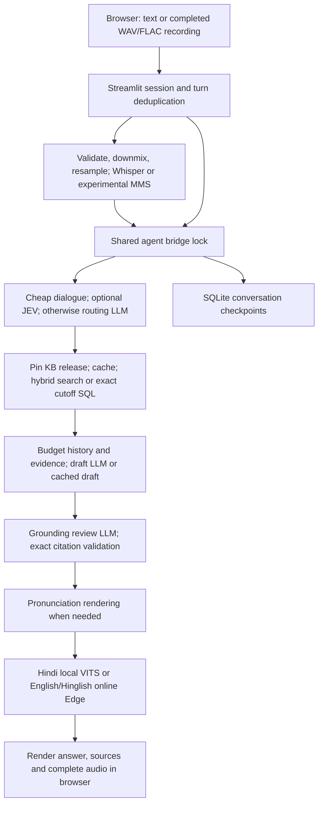

# Demo2 technical audit and local-pilot readiness

Audit dates: **29–30 September 2026 (Asia/Kolkata)**. Target: a supervised institute helpdesk on the existing **32 GB RAM / 8 GB RTX 4060 laptop**. This report contains assessments and proposed changes; it does not implement those changes or activate a model.

## 1. Executive verdict

**Demo2 is a useful supervised demonstration, but should not yet be treated as an unattended institute information service.** Its strongest features are explicit provider selection, versioned evidence, exact cutoff lookup, validated model responses, grounding review, independent conversation identifiers, and speech-only retries. Its main limitations are factual completeness, incomplete/conflicting reporting evidence, long serial model calls, speech fidelity, concurrency, and operational reproducibility.

**JEV can reduce time, but it currently does not accelerate normal Demo2 because its effective routing mode is `off`.** A fresh isolated comparison of the newer English router removed exactly one routing-model call, with identical answers and citations: warm uncached admissions answers improved from **16.280 s to 12.317 s median (24.34%)**; exact repeats improved from **10.646 s to 6.548 s (38.49%)**. Each figure uses three repeats of one English question, not a representative workload. Production activation remains unqualified: the candidate lacks the required completed benchmark, independently reviewed holdout, and source-review approval. The diagnostic bypassed only the activation-certificate check inside a temporary evaluation process, following the existing benchmark's method. It did not change configuration or create an activation record.

| Active component | Readiness assessment | Main condition before a supervised pilot |
|---|---|---|
| Text routing and conversation memory | Functional; English/Hindi/Hinglish supported | Verify ambiguous and natural follow-up behavior; expose safe failure states |
| Grounded answers and citations | Strong provenance controls; factual completeness not guaranteed | Source-based required/forbidden-claim checks, especially fees and eligibility |
| Verified retrieval | Strong development-set coverage | Repair missing reporting checklist, preserve conflicts, assign source owners |
| Exact cutoff lookup | Appropriate deterministic design | Keep every dimension and rank basis; do not imply coverage of CG/NTPC/CSAB ranks |
| JEV acceleration | Mechanism works; deployment intentionally disabled | Complete the existing promotion gates for the exact selected artifact |
| Whisper/VITS speech | Functional integration; human quality not established | Native-speaker recordings and listening checks for names, amounts and negation |
| Experimental Chhattisgarhi | Research path | Do not market Hindi fallback as validated Chhattisgarhi conversation |
| English/Hinglish speech | Online dependency | Explicit external-text disclosure, measured failure handling, service decision |
| Streamlit interface | Suitable prototype shell | Show verified text before speech; improve progress, retry and mobile behavior |
| Multiple users and persistence | Single-host, serialized prototype | Bounded admission, retention/deletion, checkpoint recovery and load checks |
| Reproducibility and deployment | Incomplete | Track shared source, resolve dependency conflicts in a separately tested future change, package artifact manifest |

The first spending decision should be **engineering and source validation on this laptop**, not a hardware purchase. Millisecond retrieval is not the main cause of multi-second answers. Keep grounding review and action safeguards while removing unnecessary waiting and measuring eligible routing shortcuts.

## 2. Scope, evidence rules and preservation

The only persistent project addition is this report. Application code, public interfaces, configuration, dependencies, original databases, source approvals, trained weights and release activation remain unchanged. Evaluation uses public/synthetic questions, temporary state or memory checkpoints, and blocked ticket/reminder writes. No email, real ticket, reminder, training, paid inference or knowledge-base activation is performed.

Evidence labels used below:

- **Reproduced:** exercised during this audit; the method and result are specified.
- **Confirmed by inspection:** directly supported by code, configuration, original documents or saved manifests; not necessarily exercised end to end.
- **Historical observation:** an explicitly dated earlier record, not a new measurement.
- **Unverified hypothesis:** a plausible consequence or proposed improvement awaiting measurement.

P1 means address before unsupervised or materially relied-upon use; P2 means subsequent pilot engineering; P3 means optional longer-term work. Effort estimates are engineering working time, not guarantees; institute review and recruiting participants are separate dependencies.

The user-supplied baseline is **17 Demo2 tests and 266 shared-agent tests passing**. These mocked regression tests were not redundantly rerun for a documentation-only task. They do not establish live model accuracy or speech quality. Existing READMEs cite older test counts; retain the dates of those earlier results.

An interruption between 29 and 30 September removed the first `/tmp` artifacts. Earlier decoding, storage, failure and retrieval observations quoted here survive in the tool transcript, but their raw files do not. They are explicitly identified as retained 29 September observations. The interrupted broad answer run is not counted as a completed suite. New 30 September paired JEV results were saved separately. Temporary evidence paths are aids to inspection, not durable repository dependencies; the essential outcomes and reproduction methods are included here.

The original proposal concerns Chhattisgarhi agricultural shopping, with a provisional under-five-second voice target and eight-second timeout (proposal pp. 12–13). Demo2 is an institute-domain adaptation. Its turn-based Streamlit implementation does not establish streaming, barge-in, shopping actions or spontaneous native Chhattisgarhi task success. The web-only decision in [project guidance](AGENTS.md) supersedes the proposal's Flutter choice; this audit does not silently change the research claims.

## 3. Active architecture and reproducibility

The diagram describes the current display ordering, not a proposed streaming architecture. Text-only mode bypasses speech. Deterministic greetings, abstentions and some failures use fewer calls than an answered knowledge request.

Active code is [Demo2](../code/demo2/README.md), its sibling `institute-assistant/assistant`, direct STT engine imports and the two VITS checkpoints. The old shopping demo, FastAPI streaming STT server, telephony adapter and broader voice orchestrator are not part of this active request path. Their authentication, VAD streaming, barge-in and capacity features must not be credited to Demo2. JEV experiment/training commands are also not on the normal path while routing is off.

### Environment recorded

| Item | Observed value |
|---|---|
| Outer repository commit | `96dcd7747287c080c62ec7334d3fc69b73c33c3b` |
| Shared agent tracking | Entire `code/Institute-voice-agent/` reported untracked by outer Git at audit start |
| Python | Existing `minor`, Python 3.11.15; `/home/rtx/miniconda3/envs/minor/bin/python` |
| CPU / GPU | Intel Core i7-14650HX, 16 cores / 24 threads; RTX 4060 Laptop, 8,188 MiB VRAM |
| Ollama | 0.32.6; `qwen3.5:9b`, Q4_K_M, 9.7B reported parameters |
| Model digest | `6488c96fa5faab64bb65cbd30d4289e20e6130ef535a93ef9a49f42eda893ea7` |
| Inference configuration | 8,192 context; 1,600 output-token limit; temperature 0; thinking disabled; 120 s HTTP timeout; 5 min keep-alive |
| Speech defaults | Whisper `small`, CPU/int8; VITS CPU; four speech threads; MMS experimental `hne` |
| JEV defaults | Off; default directory `~/.cache/institute-assistant/open-jev/pilot-v1`; two CPU threads |
| History / cache | Ten complete prior pairs, 12,000 history characters; 14,000 evidence characters before token budgeting; one-hour cache TTL, maximum 2,000 entries |
| SQLite runtime | Python `sqlite3` 3.53.2, recorded 30 September |

Installed versions: Streamlit 1.49.1, protobuf 7.36.2, Torch 2.13.0, Transformers 4.46.1, Coqui TTS 0.22.0, faster-whisper 1.2.1, CTranslate2 4.8.1, edge-tts 7.2.8, NumPy 1.26.4, SoundFile 0.13.0, SciPy 1.17.1, Chroma 0.5.23, sentence-transformers 3.3.1, LangChain 0.3.14/core 0.3.29, LangGraph 0.2.62/checkpoint-sqlite 2.0.1, langchain-groq 0.2.3, httpx 0.28.1 and tokenizers 0.20.3. The installed environment, rather than loose sibling requirements alone, is the effective runtime.

**Reproduced dependency conflict:** `python -m pip check` reported protobuf 7.36.2 outside Streamlit's `<7` requirement and descript-audiotools' `<5` requirement. Passing tests and a working page do not resolve those declared incompatibilities. No package was changed.

Startup requires the sibling sources, prepared matching tokenizer, cached model weights, running Ollama, reviewed release stores and writable Demo2 data directory. `run.sh` selects `minor`; `.streamlit/config.toml` binds `127.0.0.1`, caps uploads at 12 MB and disables Streamlit usage statistics. Demo2's `.env` precedes the shared `.env`, while existing process values have priority. Browser provider choice is passed per request; it does not rewrite process configuration. Reminders are forced off by the bridge setup. See [settings.py](../code/demo2/settings.py), lines 8–57, and [agent_bridge.py](../code/demo2/agent_bridge.py), lines 26–56.

### Knowledge release

The active pointer selects **`20260927T010544717749Z`**, activated 27 September at 01:08:59 UTC. Pipeline 2.2 contains **224 vector chunks**, **758 parent evidence blocks**, and **613 structured records**, including **611 JoSAA All India cutoff rows**. Those are different units, not counts of independent documents. There are no CG/NTPC/CSAB cutoff rows. The 75-source inventory includes 42 successful remote fetches, 26 failed fetches and seven local copies; 266 extraction blocks remain pending review. Recorded remote fetches are dated 22 September: a later build is not a later policy verification.

The active embedding model is `intfloat/multilingual-e5-small`, revision `614241f622f53c4eeff9890bdc4f31cfecc418b3`, CPU, normalized vectors, cosine similarity, `query:`/`passage:` prefixes and 350/50 token chunk/overlap. Legacy MiniLM configuration is a separate fallback index. Model changes require a new evaluated release, not an environment-only switch.

Worth preserving: source hashes and review metadata; whole-row extraction/chunking; complete short-parent restoration; exact cutoff dimensions; linked benefit/exclusion passages; immutable candidate releases and an atomic pointer covering vector and SQL stores together; explicit missing evidence; and a retained rollback release. Manual review entries labelled Codex are not evidence of institute-staff signoff.

## 4. Measured JEV behavior and performance

### Current deployment versus evaluated candidate

The effective fresh-process configuration is **off**, with no JEV override in either application environment file. No inspected experiment has `activation.json`. The newer English v2/v3 router is a **MiniLM encoder with supervised classification heads**, not the original Open Jev research architecture. It predicts routing/query actions; it does not answer institute questions. Avoid presenting its name as proof of an Open Jev model-quality claim.

The copied candidate was `english-v3-speed-r3`, artifact ID `a6508746430a1bb72f2ae7e06666a58335f548126b6191bf702da44c8d6fe757`. Its manifest-bound files and eight policy dependency hashes matched the original. Its underlying MiniLM revision is `1110a243fdf4706b3f48f1d95db1a4f5529b4d41`.

The question used in the new paired test was: **“How is admission to B.Tech at IIIT Naya Raipur decided in 2026?”** Three trials alternated off/enabled order, used distinct per-mode/per-trial caches and fresh memory-only conversations, and then repeated the exact question in another fresh conversation. Ollama, evidence release, schemas, review and action blockers were retained. This is twelve measured English answers plus a separate warmup and two non-English guard checks. It is not three complete validation-suite trials or an independent quality holdout.

| State | Off samples, seconds | Diagnostic JEV samples, seconds | Median reduction | Calls off → JEV |
|---|---|---|---:|---:|
| Warm model, empty application cache | 16.327, 16.280, 16.040 | 12.317, 12.380, 12.142 | 24.34% | 3 → 2 |
| Exact repeat, fresh conversation | 10.646, 10.656, 10.399 | 6.548, 6.590, 6.510 | 38.49% | 2 → 1 |

All twelve answers and quotations were identical: admission is governed by the JEE (Main) 2026 rank, supported by brochure page 7. The cache removes draft generation; JEV separately removes routing. **Grounding review remains the final model call even when both optimizations apply.** Three repeats justify reporting medians and ranges, not a stable p95 or a general speed guarantee.

| Stage, median seconds | Warm uncached off | Warm uncached JEV | Exact repeat off | Exact repeat JEV |
|---|---:|---:|---:|---:|
| Routing model | 4.026 | — | 3.977 | — |
| CPU classifier | — | 0.0065 | — | 0.0079 |
| Retrieval node, including cache handling | 0.0138 | 0.0144 | 0.0016 | 0.0016 |
| Draft generation | 5.551 | 5.533 | — | — |
| Grounding review | 6.645 | 6.634 | 6.612 | 6.503 |
| Complete graph turn | 16.280 | 12.317 | 10.646 | 6.548 |

Stage medians are calculated independently, so their sum need not equal the median total. These measurements exclude microphone capture, STT, pronunciation rendering, TTS, browser display and multi-session queueing.

The model was initially unloaded. One first answered turn took **37.883 s**, including **8.617 s provider-reported initial model loading** and **4.429 s first retrieval-node initialization**. Process setup through imports took 0.846 s separately. This is a process/model cold-start sample, not a disk-cold reboot. The paired run's parent Python RSS peaked at approximately 1.24 GB; this excludes Ollama and the JEV worker. Whole-device VRAM reached 7,391 MiB, including other desktop users, while available host RAM stayed above 16.67 GB. RAM and GPU samples were taken every two seconds and may miss brief peaks.

Hindi and Hinglish questions under diagnostic enabled mode correctly fell back with `non_english`, zero classifier calls and three model calls, taking 28.086 and 27.819 s respectively. Those paths receive no JEV acceleration by design. Shadow mode also retains the routing LLM and is a measurement mode, not a speed setting.

### Retained 29 September CPU/mechanism checks

Real CPU inference on the temporary r3 copy took 1.371 s on first worker load, plus a separately measured 0.107 s first artifact verification. Three warm admissions predictions had a 5.183 ms median; fee and loan-condition predictions had 4.511/5.338 ms medians. A real classifier with mocked factual providers reproduced three calls off, three calls shadow, three calls enabled without certification, and two calls with the isolated diagnostic certificate bypass. Missing certification and corruption of only a temporary checkpoint safely fell back before inference. These checks establish mechanism and fail-safe behavior, not broad answer quality.

### Historical JEV results — do not merge with this audit

| Candidate / record dated 25–27 September | Sample | Median off → candidate | Interpretation |
|---|---:|---:|---|
| Original pilot-v1 | 24 paired turns | 14.175 → 14.255 s | No coverage/call saving; failed |
| English v2 calibrated | 66 paired turns | 15.181 → 14.951 s | 1.52% gain; failed promotion |
| English v2 normalized | 66 paired turns | 17.583 → 17.191 s | 2.23% gain; failed median gate |
| English v3 calibrated | 198 paired turns, three full trials | 17.018 → 16.318 s | 4.11% gain; p95 worsened 5.56%; source review failed |
| English v3 r3, first trial of interrupted run | 66 paired turns | 16.947 → 12.739 s | Promising 24.83% gain; run stopped after 71 pairs and lacks completed promotion evidence |

The r3 interruption record gives `ValueError`, not enough information to establish its cause. Historical v3/r3 runs also had different GPU residency, so cross-run improvement cannot all be attributed to changed thresholds. In the earlier complete v3 run, routing time fell substantially, but generation/review still consumed most time. Exposed development/training/confirmation cases cannot be relabelled a fresh final holdout.

Existing promotion requirements remain appropriate: a frozen artifact, at least 100 accepted independent holdout examples, at least 98% accepted precision, zero critical errors, at least 15% classifier coverage, at least 10% median improvement and no more than 5% p95 regression **in every complete trial**, no new automated behavior failures, and completed source review. Deterministic follow-up coverage must be counted separately. See [English router speed guide](../code/Institute-voice-agent/institute-assistant/docs/ENGLISH_ROUTER_SPEED.md), [holdout guide](../code/Institute-voice-agent/institute-assistant/docs/ENGLISH_ROUTER_HOLDOUT.md), and `assistant/jev/paired_benchmark.py:108–174`.

Model digest, reported model size, GPU-resident size and context were identical across all twelve paired English samples; expiry timestamps naturally changed. Ollama reported 6,273,997,205 bytes of model residency, including 4,394,571,528 bytes on GPU. This is partial offload, not full-GPU residency. The warm uncached off/JEV paths consumed 10,602/9,299 input tokens and 311/233 output tokens per turn; exact repeats consumed 5,818/4,515 input and 206/128 output tokens. These are sums across calls, not a single context length. Observed aggregate output generation was approximately 20.7–21.3 tokens/s. Prefix reuse, output length and changing desktop load make comparison to other runs unreliable without control.

## 5. Test coverage and results

### Retrieval, measured separately from generated answers

The retained 29 September snapshot run exercised the existing 117 development cases. Supporting-evidence recall@6 was **92/93 (98.92%)**: English 31/31, Hindi 30/31 and Hinglish 31/31. Exact-cutoff checks passed **42/42**, including known and deliberately unavailable rows. Twelve ordinary unsupported questions were left for generated-answer review, not counted as retrieval successes. Mixed warm retrieval median/p95 was **11.1/13.7 ms**, with one measurement per case after warmup; initialization plus all cases took 3.851 s. Rank lookups bypass embeddings, so this is not a pure semantic-search latency distribution.

The remaining miss is the Hindi loan-repayment question `PM Vidyalaxmi दिशानिर्देशों में ऋण चुकाने की अवधि क्या है?`: the page-2 evidence containing 15 years is absent from the top six. This is a direct retrieval test; normal non-English app routing first rewrites questions into English, so it does not by itself establish a failed live Hindi answer. The evaluator checks an expected evidence-block intersection and required terms across returned chunks, not complete answer correctness. See `assistant/kb/evaluation.py:20–73` and [evaluation cases](../code/Institute-voice-agent/institute-assistant/docs/kb_evaluation_cases.json).

### Audio boundaries, recovery and storage

The following are **retained reproduced observations from 29 September**, with raw temporary files lost during interruption. They used real decoding/storage/failure paths; provider or action stubs are identified explicitly.

| Check | Observed result | Interpretation |
|---|---|---|
| Empty, malformed, >12 MiB, 0.299 s, 30.001 s, >2 channels, 192,001 Hz, non-finite audio | Rejected with `ValueError` | Input boundaries exercised without speech models |
| Exactly 0.3 s and 30 s; FLAC; stereo 48 kHz | Accepted; normalized to mono float32/16 kHz | Inclusive duration limits and conversion worked |
| Silence | Empty transcription; no model invocation | RMS short-circuit worked; not a general noisy-silence accuracy test |
| Unreachable local provider on unused port 9 | `unavailable` in 0.485 s, safe start-Ollama message | Existing service was not stopped; no automatic cloud fallback |
| Online speech subprocess running a synthetic sleep helper | `TimeoutExpired` after 45.046 s | Real child termination at configured deadline; not a claim about live network service latency |
| Cache database held under exclusive lock | Miss after 0.101 s | Optional cache fails open to normal computation |
| Checkpoint database held by another writer | Turn failed after 35.047 s; next turn succeeded after rollback | The complete turn can wait much longer than one SQLite connection timeout |
| Same turn identifier submitted twice | Same stored turn returned; one mock action invocation | In-session retained-ID deduplication works |
| Retyped explicit request with a new turn identifier | Second mock action invocation | No durable semantic/action idempotency; no real ticket was created |
| Reset after 100 greeting turns | New UUID; all 400 old checkpoints remained | Reset isolates conversation memory; it is not deletion |

Synthetic greetings grew checkpoint storage as follows. Sizes include the database and its sidecars at the observation time, not normalized post-checkpoint disk usage; do not extrapolate a universal per-user growth rate.

| Turns in one conversation | UI turns retained | Checkpoint rows | Pending-write table rows | Database plus sidecars |
|---:|---:|---:|---:|---:|
| 1 | 1 | 4 | 30 | 148,136 bytes |
| 10 | 10 | 40 | 300 | 1,524,216 bytes |
| 50 | 12 | 200 | 1,500 | 5,553,704 bytes |
| 100 | 12 | 400 | 3,000 | 8,490,536 bytes |

The installed SqliteSaver already enables WAL and serializes connection access. Recommending “turn on WAL” as the primary fix would miss the current behavior. Its individual operations can encounter repeated busy waits while a graph turn saves several checkpoints. The audit did not trace every internal wait; attributing the precise 35 seconds to a specific retry count would be an unverified hypothesis.

### Additional live-result tables

Live answer, speech, concurrency and browser result tables are appended after their runs complete.

## 6. Findings and proposed changes

### F01 — P1: JEV acceleration is unpromoted and invisible to the user

**Evidence: reproduced and confirmed by inspection.** Effective mode is off; uncertified enabled mode falls back; the temporary r3 comparison removes one routing call. References: `assistant/config.py:61–65`, `assistant/jev/runtime.py:148–174`, `assistant/nodes.py:195–234`. The GUI identifies the answer model but not the effective router. A trained artifact or a successful millisecond prediction does not mean the browser is using it.

**Future change:** show effective mode, artifact, activation state and aggregate accepted/fallback counts; finish frozen-artifact promotion before explicitly selecting r3 or its qualified successor. Keep Hindi/Hinglish fallback and distinguish shadow from acceleration. **Effort:** 0.5–1 day for visibility, plus full trials and independent review. **Compatibility/tradeoff:** additive metrics/UI; enabled routing can change query scoping and retrieval preference and therefore requires answer comparisons. **Acceptance:** production gate intact, eligible uncached English turns use two calls, exact repeats one, deferred turns retain baseline rewriting/review; every existing promotion gate passes. The measured 24.34% is not a promise for other topics or speech interactions.

### F02 — P1: genuine citations and `answered` status do not guarantee completeness

**Evidence: reproduced on the new CG follow-up; confirmed by prompt/evaluation inspection.** The broad live run's follow-up added incomplete eligibility facts even though its citations include omitted conditions. The final live quality table specifies the exact omissions. The grammar binds quotations to real excerpts but does not bind every answer assertion to a complete policy. The same LLM drafts and reviews. References: `assistant/llm.py:88–133,174–207`, `assistant/nodes.py:76–147,309–406`, `evaluate_helpdesk.py:90–106`.

**Future change:** add source-reviewed required and forbidden claims for material answers, including omissions and scope; use deterministic structured summaries for stable fee/cutoff/eligibility fields where appropriate. Preserve the review call and strict citation validation. **Effort:** 2–4 days for an initial rubric and regression set, plus institute review; structured rendering is a subsequent change. **Tradeoff:** terse speech can omit conditions, so offer a short accurate summary plus an explicit qualified detail view. New structured fields should be optional/versioned. **Acceptance:** zero critical amount/year/quota/eligibility/negation errors on the agreed pilot set; report factual scoring separately from status, retrieval and language scores.

### F03 — P1: reporting evidence is incomplete and a known year conflict is lost

**Evidence: confirmed by original-document and extraction inspection.** The supplied JoSAA/CSAB 2026 reporting PDF page 1 contains 14 checklist rows; active parent `ee62d05e7d7ab24569c0ee06` contains the heading without the list. The brochure page-10 table is for CG/NTPC and directs All India applicants to JoSAA instructions. It prints a 2024 rank card inside the 2026 brochure. The review record notes the conflict, but that note is not propagated into served metadata. Search also hard-prioritizes this brochure heading for English admission/reporting-document requests. References: `assistant/kb/extraction.py:151–169,294–299`, `assistant/kb/search.py:52–58,126–139`, `kb_state/reviews.json:4`.

**Future change:** review and activate the actual JoSAA checklist in a new release; retain the contradictory original faithfully and attach audience/year conflict metadata; condition document ranking on quota. **Effort:** 1–2 days plus source-owner review. **Compatibility:** additive citation metadata and a new retrieval/cache policy version; do not edit active stores or silently correct source text. **Acceptance:** JoSAA/CSAB reporting includes the 2026 CRL requirement and applicable document qualifications, without substituting CG/NTPC rules; ambiguous quota prompts clarify; all three text languages preserve scope.

### F04 — P1: pronunciation validation protects digit sequences, not meaning

**Evidence: reproduced guard behavior and confirmed by inspection.** A test renderer changing “Fee 120 is not refundable” to a Hindi sentence saying it is refundable passes because the digits still match. This was an intentionally faulty test renderer, not an observed live-model mistranslation. Hindi digit expansion speaks 90000 as individual digits; a 3.5% example becomes `तीन . पाँच प्रतिशत`, without an explicit decimal word. References: [speech.py](../code/demo2/speech.py), lines 98–127 and 213–225; [agent_bridge.py](../code/demo2/agent_bridge.py), lines 65–95.

**Future change:** a deterministic domain pronunciation lexicon and typed verbalization for money, dates, ranks, percentages, ranges and abbreviations; semantic checks for negation/units/qualifications before release. Use a vetted fallback if rendering fails. **Effort:** 1–3 days for a bounded initial lexicon/number formatter, plus bilingual listening. **Tradeoff:** mixed-language proper names still need evaluation; cache rendered text only with backend/model/version keys and appropriate retention. **Acceptance:** held-out critical-value and negation pairs preserve meaning in both voices; published original answer stays visible; no savings claim until renderer calls actually disappear. Arbitrary Azure SSML is not supported by the current consumer Edge adapter.

### F05 — P1: verified text waits behind speech preparation

**Evidence: confirmed by execution order; browser timing check specified below.** `workflow.run_turn` saves a turn, then synchronously synthesizes speech; `app.py` renders answer bubbles only after the function returns. A 45-second online timeout can therefore delay text that was already ready. References: [workflow.py](../code/demo2/workflow.py), lines 14–55; [app.py](../code/demo2/app.py), lines 78–111 and 145–150.

**Future change:** render the completed reviewed text and sources immediately, then synthesize/update audio with clear progress and cancellation semantics. **Effort:** 0.5–1.5 days. **Compatibility:** retain the current return contract or add a callback/status field; do not display an unreviewed draft as a final answer. **Acceptance:** browser timestamps show reviewed text before synthesis completes/fails, speech-only retry does not replay reasoning/actions, and reset suppresses obsolete audio. Expected perceived-latency savings equal the overlapped speech delay in a given turn; the actual distribution must be measured.

### F06 — P1 for multiple users: locks serialize whole reasoning turns

**Evidence: confirmed by inspection and the concurrency checks below.** The bridge lock spans `graph.invoke`; speech rendering takes the same lock. A second local lock spans each Ollama HTTP call, and one speech lock spans Whisper/MMS/VITS work. References: `agent_bridge.py:10,44–56,72–95`, `assistant/llm.py:174–201`, `speech.py:18,54–95,154–187`. These locks protect shared resources but also permit one user's long request to hold up another's short request. Streamlit's shared model/resource objects must remain thread-safe; simply removing locks is unsafe. [Streamlit 1.49 resource guidance](https://docs.streamlit.io/1.49.0/develop/api-reference/caching-and-state/st.cache_resource)

**Future change:** first add a bounded admission queue, queue-time metric, busy response and cancellation/deadline policy; then narrow ownership to the unsafe resource and preserve same-session ordering. **Effort:** 1–3 days initially; a worker-service split is 3–5+ days if measurements justify it. **Tradeoff:** more Ollama parallelism consumes context memory and may worsen offload on 8 GB VRAM. **Acceptance:** bounded 1/2/4-session trials, no cross-session facts/actions, measured fairness and predictable overload, no extra model copies per session. Preserve additive adapter fields and test checkpoint behavior before concurrent invocation.

### F07 — P2: voice switching reloads local TTS weights

**Evidence: confirmed by inspection; live switching measurements below.** `_SYNTHESIZER` caches one voice; switching Female/Male clears it and constructs a new Synthesizer. References: `speech.py:147–173`. Both voices are advertised in the UI, so alternating users can repeatedly incur this cost.

**Future change:** either keep two CPU synthesizers within a measured RAM budget or choose one fixed pilot voice and communicate the limitation; retain per-model serialization. **Effort:** 0.5–1 day. **Tradeoff:** two resident models increase memory; avoid putting both on the constrained GPU without an end-to-end benchmark. **Acceptance:** repeat Female/Female/Male/Male/Female with model-load and inference clocks; confirm reduced switching delay, unchanged audio parameters and an acceptable RSS ceiling. Do not infer savings from checkpoint file size alone.

### F08 — P1 before collecting real conversations: reset is not deletion

**Evidence: reproduced.** One hundred deterministic greetings left 400 checkpoints and 3,000 write rows; reset retained them. History trimming controls active context, while SQLite saves successive states. Browser turn history is capped at 12, but `consumed_audio` grows for the session. References: `workflow.py:10–11,35–37,58–64`, `assistant/nodes.py:409–422`, `assistant/graph.py:33–36`.

**Future change:** define separate “new conversation” and authenticated deletion/retention operations; expire checkpoints/drafts/cache content under a documented policy and prune consumed recording identifiers safely. **Effort:** 1–3 days plus institute policy. **Compatibility:** deletion is a new explicit operation, not a changed meaning of reset; migrate existing data carefully. **Acceptance:** synthetic expired sessions are removed from all relevant tables and backup policy, current sessions survive, resets remain isolated, and storage plateaus under a sustained workload. A one-hour cache TTL is lazy expiry on access, not immediate secure erasure.

### F09 — P2: checkpoint contention and per-call timeouts lack a turn deadline

**Evidence: reproduced retained 35.047 s checkpoint lock failure and 45.046 s speech-child timeout; confirmed 120 s local per-request timeout.** The optional cache handles contention as a miss after approximately 0.1 s, but essential checkpoint failure reaches a generic workflow error. There is no complete turn deadline or user cancellation spanning queue, routing, answer, review and rendering. References: `assistant/graph.py:33–36`, `assistant/cache.py:27–62`, `assistant/llm.py:169–207`, `speech.py:231–238`.

**Future change:** record operation/turn deadlines, add explicit recoverable error codes, short transactions and controlled backoff; test checkpoint recovery without replaying actions. **Effort:** 1–2 days. **Tradeoff:** shortening a deadline may reject usable slow answers; set it from pilot measurements. SQLite WAL permits readers with a writer but still only one writer; it is already enabled by SqliteSaver. Runtime 3.53.2 is newer than the upstream 3.51.3 WAL-reset fix; no observed corruption is alleged. [SQLite concurrency](https://www.sqlite.org/wal.html), [busy timeout](https://www.sqlite.org/c3ref/busy_timeout.html). **Acceptance:** held-lock, stopped-provider and child-timeout tests meet a documented wall-clock budget and recover on the next turn; no duplicate action on retry.

### F10 — P2: exact cache is useful but not a general conversation accelerator

**Evidence: reproduced JEV/cache matrix and confirmed cache keys.** Exact repeats in new sessions hit, while history, source contents, language, date, model/prompt and context changes can miss. Draft hits still review. Retrieval cache reads also update hit counts and delete expired rows, so they are writes. Maximum 2,000 entries at 131,072 bytes each permit about 250 MiB of value payload before SQLite overhead; actual usage may be much lower. References: `assistant/cache.py:14–85`, `assistant/nodes.py:265–295,333–405`.

**Future change:** measure hit rates by public query class, cache bytes and contention before altering policy; add periodic maintenance where needed. Consider reviewed static FAQ answers only with explicit release invalidation and equivalent factual safeguards. **Effort:** 0.5–1 day for telemetry/maintenance; a reviewed FAQ path is separate. **Compatibility:** never omit context from draft keys to manufacture hits, and never cache actions or failures. **Acceptance:** cold/warm/exact-repeat/natural-follow-up tests show correct invalidation and no cross-context answer reuse; stale entries expire and storage stays within configured limits.

### F11 — P2: evidence freshness, retirement and release integrity need ownership

**Evidence: confirmed by inspection.** Year/historical filters are not freshness TTLs; deleting a source file or failing a fetch does not necessarily retire the inventory entry. The current guide still names the 22 September/222-chunk release. Manifests contain absolute local model paths, while activation checks do not cryptographically bind all content to validation. The JoSAA importer treats 2026 as the current endpoint year. References: `assistant/kb/sources.py:139–147,171–189`, `search.py:25–42,64–74`, `releases.py:148–160`, `josaa.py:73–75`, [maintenance guide](../code/demo2/KNOWLEDGE_BASE.md), lines 9 and 181.

**Future change:** source owner/review-by/supersession metadata, generated active-release status, explicit retirement, content/model/evaluation hashes and portable restore preflight; derive/verify source year before import. **Effort:** 1–3 days plus source ownership. **Compatibility:** version the release manifest and keep old valid releases serving during failed upgrades. **Acceptance:** retired sources disappear only through reviewed releases, failed fetch dates stay honest, corrupted/mismatched candidates never activate, a temporary restore works, and a simulated 2027 page cannot silently create 2026 rows.

### F12 — P2: multilingual retrieval has a small but persistent gap

**Evidence: reproduced retained Hindi repayment miss; all 42 exact-cutoff checks passed.** The supporting page exists but ranking misses it. The app's English rewriting may compensate, at the cost of a model call and possible meaning drift. References: `assistant/kb/search.py:98–155`, `embeddings.py:13–52` and the repayment case in the evaluation manifest.

**Future change:** evaluate a source-grounded repayment FAQ/section or bounded bilingual normalization; keep E5 prefixes and complete conditions. **Effort:** 0.5–1.5 days. **Tradeoff:** larger top-k/context raises model cost and may dilute evidence; do not change embedding model without an isolated comparison. **Acceptance:** original plus new Hindi paraphrases recover page 2 within six hits, retain “15 years excluding moratorium,” and preserve cutoff/category performance. [E5 publisher guidance](https://huggingface.co/intfloat/multilingual-e5-small/blob/main/README.md)

### F13 — P1 for reproducibility: the checkout does not define a working installation

**Evidence: reproduced Git status and pip conflicts; confirmed artifact setup requirements.** The central shared agent is untracked, and ignored sources/releases/weights/tokenizer are required to run. Requirements span incompatible installed bounds. The setup panel checks the legacy index file rather than the active verified release. References: `code/demo2/requirements.txt`, shared `requirements.txt`, `app.py:48–54`, `settings.py:8–57`.

**Future change:** deliberately track the approved shared source after a secrets/generated-data review; document the resolved environment and exact artifact hashes/retrieval procedure; fix dependency conflicts in a separately tested environment plan without disturbing this working stack; make health checks follow the active release. **Effort:** 1–2 days for inventory/docs, additional compatibility work as indicated by testing. **Acceptance:** a clean documented copy starts with matching source/model/release versions, package checks pass, offline paths work after preparation, and a missing verified store fails health even if a legacy file exists. No dependency installation or source staging was part of this audit.

### F14 — P1 before network exposure: local isolation is not deployment security

**Evidence: confirmed by inspection.** Loopback binding is a good current boundary. Random session IDs and per-session provider selection are not authentication. Student identity/category are explicitly self-reported. Local drafts have no durable request idempotency key; GUI retained-ID suppression does not cover every restart/retry. There is no active Demo2 admission/rate limit, and its separate legacy STT server protections do not apply. References: `app.py:25–47`, `workflow.py:27–37`, `assistant/nodes.py:425–448`, `assistant/db.py:43–87`.

**Future change:** retain loopback for the laptop demonstration; before LAN use add HTTPS, authenticated staff access/ownership, bounded expensive requests and server-side durable request IDs for actions. **Effort:** 2–4 days for a minimal managed pilot boundary. **Compatibility:** authentication/ID fields need an explicit adapter version or additive transition; do not derive authorization from student category. **Acceptance:** unauthorized access and cross-session references fail, repeated request IDs create one draft, no action is sent automatically, and real browser microphone permission works over the actual hostname. The audit does not claim an observed cross-session leak or prompt-injection exploit. [Microphone secure-context requirements](https://developer.mozilla.org/en-US/docs/Web/API/MediaDevices/getUserMedia), [OWASP prompt-injection guidance](https://cheatsheetseries.owasp.org/cheatsheets/LLM_Prompt_Injection_Prevention_Cheat_Sheet.html)

### F15 — P2: external speech and model licenses require accurate product wording

**Evidence: confirmed by code and primary sources.** Local reasoning does not mean offline English/Hinglish speech: rendered answer text goes to Edge's consumer speech endpoint. Groq receives transcript/history/evidence only when selected. Whisper/VITS/MMS inputs stay local in the current path. The first uncached model setup can require network access. References: `speech.py:190–238`, `settings.py:29–35`, `app.py:27–37`.

**Future change:** expose an explicit online-speech choice and retain useful text on network failure; document what leaves the laptop and the chosen provider terms. Inventory distinct code, model, data and voice rights. **Effort:** 0.5–1 day engineering/docs plus rights review. **Acceptance:** network-disconnected Hindi/local tests work with cached assets; online modes disclose text egress; no claim of service guarantees inherited from an unrelated Azure subscription. See the provider/license tables below. Do not add a mandatory paid dependency.

### F16 — P2: useful metrics omit parts of the actual interaction

**Evidence: confirmed by inspection and temporary timing instrumentation.** `rag_metrics` records logical model calls and node time; provider retries and speech-rendering calls are outside that count. The UI shows answer/speech durations, not capture/upload/STT/queue/first-visible-text/first-playable-audio. Ollama returns token/load/evaluation timing that the adapter discards. References: `assistant/metrics.py:7–33`, `assistant/llm.py:186–201,267–290`, `workflow.py:14–53`, `app.py:151–153`.

**Future change:** additive privacy-preserving stage events with monotonic clocks, safe error categories, resource samples and optional provider fields; separate model load, queue and compute. **Effort:** 1–2 days. **Compatibility:** keep current result fields; do not log student text, keys or exception bodies. **Acceptance:** stage totals reconcile with observed user waiting, model-call totals include retries/rendering separately, and no misleading percentiles are published from three cases. [Ollama timing fields](https://docs.ollama.com/api/generate)

### F17 — P2: recording failures and router fallback reasons need clearer recovery

**Evidence: confirmed by code; failed-recording deduplication was reproduced in existing tests.** Recordings are consumed before transcription succeeds; reruns cannot automatically retry the same identifier. The general recording error message suggests a shorter clip even for format or device problems. Uncertified JEV is safely reported as generic `artifact_error`, obscuring the distinction from corruption. References: `workflow.py:58–64`, `app.py:78–94`, `assistant/jev/runtime.py:65–82,172–174,212–215`.

**Future change:** explicit safe transcription retry using the same recording without re-running a completed agent action; precise user-facing validation/error states; safe enumerated router reasons for not activated, corrupt artifact, timeout and busy. **Effort:** 0.5–1 day. **Compatibility:** preserve existing fields while documenting additional enum values and the recording lifecycle. **Acceptance:** invalid/silent/failed recordings recover visibly, successful recordings never duplicate a turn, corrupted artifacts remain rejected, and expected activation refusal is distinguishable from a broken installation.

### F18 — P2: merged financial facts can cite the wrong page

**Evidence: reproduced in the current loan-condition answer and confirmed by source inspection.** The scholarship-exclusion fact is correct, but one citation labels it page 2 although the original PDF places that condition on page 4, section 5.6. The merged finance record inherits the benefit block's page while inserting linked conditions. This is a provenance defect, not an invented exclusion. References: `assistant/kb/releases.py:91–103`, `assistant/kb/structured.py:88–111` and the PM-Vidyalaxmi PDF cited below.

**Future change:** retain evidence block/page identity for each structured field or span and emit separate correctly located citations. **Effort:** 0.5–1.5 days plus source checks. **Compatibility:** additive multi-span/page metadata with legacy citation fallback; rebuild a candidate release and invalidate relevant caches. **Acceptance:** every cited condition opens to the page containing that exact text, including linked exclusions; quote validation and known cutoff results remain intact.

## 7. Prioritized roadmap on the current laptop

All entries are **future work**, not changes made by this audit. Order by user impact and measured contribution, with correctness fixes preceding broader deployment.

| Order | Work | Benefit and dependency | Effort estimate | Verification |
|---:|---|---|---|---|
| 1 | Repair reporting evidence, preserve conflicts and correct citation page mapping (F02/F03/F18) | Prevent incorrect applicant instructions; needs source-owner review | 1–3 days plus review | Original-document claim/qualifier/page rubric in all three text languages |
| 2 | Display reviewed text before synthesis and provide precise progress (F05/F16/F17) | Removes speech preparation from text waiting time; no model change needed | 1–2 days | Browser clocks, speech failure and retry, no action replay |
| 3 | Make runtime/JEV/release state visible and finish r3 qualification (F01/F13) | Establish whether routing savings actually apply; depends on frozen artifacts and independent review | 0.5–1 day visibility; evaluation/review separately | Existing full three-trial and fresh-holdout gates; then production-gate-intact verification |
| 4 | Add critical-fact/negation checks and deterministic speech verbalization (F02/F04) | Prevent accurate-looking but incomplete answers and speech drift | 2–4 days plus listening | Required/forbidden assertions and native-speaker number/unit/negation comprehension |
| 5 | Measure/retain the two CPU voices or choose one pilot voice (F07) | Avoid reloads under alternating users | 0.5–1 day | Alternating-voice latency/RSS, identical pace/sample-rate behavior |
| 6 | Bound request admission and deadlines; show queueing (F06/F09) | Predictable service under 2–4 users | 1–3 days | Concurrency/overload/recovery checks and isolated histories |
| 7 | Implement retention/deletion and recovery procedures (F08/F10/F11) | Bound storage and protect real student conversations | 1–3 days plus policy | Synthetic expiry, deletion and consistent SQLite backup/restore drill |
| 8 | Reproducible source/environment/artifact bundle (F13/F15) | Enables recovery and a second machine without trial-and-error installs | 1–2 days plus compatibility testing | Clean documented installation; package checks; model/source hashes; offline smoke |
| 9 | Improve the narrow Hindi retrieval gap and source lifecycle (F11/F12) | Better multilingual coverage without enlarging every prompt | 1–3 days | Independent paraphrases, no cutoff regressions, retirement/rollover tests |
| 10 | Managed network pilot boundary (F14/F15) | Necessary only when moving beyond the trusted local laptop | 2–4 days initially | HTTPS, authentication/ownership, bounded requests, explicit external-data choices |

After these inexpensive changes, consider reducing prompt/evidence length or adding a reviewed deterministic FAQ path only with paired correctness tests. In the measured uncached English case, generation plus review cost approximately **12.2 s**, routing **4.0 s**, and retrieval **0.014 s**. Eliminating all warm retrieval time could save only milliseconds; removing an eligible routing call saved about four seconds. Speech rendering is another model call on some languages and must be counted separately. A one-call answer design, smaller model, aggressive quantization or skipping review might be faster but has **no demonstrated equivalent correctness** here.

Keep CPU speech and embeddings as the default until a whole-interaction placement test shows otherwise. Available RAM was ample in the controlled JEV run, while GPU space was tight. Do not replace the shared Torch/CUDA stack just to pursue an unmeasured Whisper GPU gain. Historical CTranslate2 CUDA incompatibility is a dated observation, not proof that the current libraries still fail.

Longer term, a dedicated inference worker with explicit jobs/cancellation can separate browser sessions from model ownership. A service/API migration needs versioned turn IDs, status/progress events, backward-compatible result fields and durable action idempotency. Streaming should expose progress or already verified text; unreviewed factual tokens must not be presented as confirmed policy. Continuous listening and barge-in require a separate interruption-aware voice protocol and evaluation, not merely `stream=True` on the LLM. Rewriting the entire frontend or replacing SQLite/Chroma should follow measured need rather than precede these fixes.

## 8. Optional cloud services and hardware

These are separate comparisons, researched from primary documentation on **30 September 2026**. No paid model or speech calls were invoked. Availability/prices are dated; neither vendor throughput nor publisher benchmarks establish Demo2 quality or end-to-end speed.

### Reasoning providers

| Option | Fit and documented cost | Compatibility/tradeoff | Decision check |
|---|---|---|---|
| Keep local Qwen/Ollama | Existing default; no per-request provider bill | Local resource and serial-call latency; retain matched tokenizer/context and schemas | Compare complete interaction, quality and 1/2/4-session behavior on the laptop |
| Existing Groq `openai/gpt-oss-120b` | Already selectable; $0.15 input / $0.60 output per million tokens | Sends transcript, history and evidence externally; quotas and failures remain; current adapter requests JSON-object output, not strict-schema mode | Same public cases, original-source review, provider timing and account data settings; no automatic fallback |
| OpenAI example `gpt-5.4-mini-2026-03-17` | Structured outputs; $0.75 input / $4.50 output per million tokens | New adapter/config/schema/error tests needed; unsupported as a current `LLM_PROVIDER` value | Frozen identical factual rubric, latency/cost and refusal/truncation handling before any adoption |
| Ollama Cloud | Hosted option, but current docs exclude structured outputs | Not a transparent substitute for this local schema-constrained path | Confirm capabilities first; reject a change that silently weakens validation |

Sources: [Groq model page](https://console.groq.com/docs/model/openai/gpt-oss-120b), [Groq structured-output requirements](https://console.groq.com/docs/structured-outputs), [OpenAI model page](https://developers.openai.com/api/docs/models/gpt-5.4-mini), [OpenAI structured outputs](https://developers.openai.com/api/docs/guides/structured-outputs), [Ollama structured outputs](https://docs.ollama.com/capabilities/structured-outputs).

Illustrative accounting only: 10,000 uncached input plus 1,000 output tokens **summed over the entire interaction** would be $0.0021 with those Groq rates or $0.012 with that OpenAI example, before taxes and other services. Include routing, drafting, review, rendering, retries and any billed reasoning in the real calculation; cloud tokenization/cache behavior can differ. Measure a spending cap and network-failure path. Review actual account retention settings rather than assuming zero retention from a provider selector. [Groq data controls](https://console.groq.com/docs/your-data), [OpenAI API data controls](https://developers.openai.com/api/docs/guides/your-data)

### Speech services

| Option | Potential benefit | Tradeoff and acceptance |
|---|---|---|
| Existing Edge client | Already produces English/Hinglish speech without an API key | Uses a consumer online endpoint; no institute SLA was established. Keep explicit disclosure, timeouts and offline text recovery. Test both voices and critical meanings. |
| Azure Speech | Subscription-backed Hindi/Indian English voices and supported pronunciation controls | Separate credentials/region/billing/adapter needed. Verify selected voice's SSML support; price depends on region/tier. Test whether deterministic pronunciation can replace an LLM rendering call. |
| Sarvam Bulbul v3 / Saaras | Candidate Hindi/English/code-switching comparison | Published lists inspected do not establish Chhattisgarhi support. Listed STT ₹30/hour and Bulbul v3 ₹30/10,000 characters; 10 s input plus 600 characters would be about ₹1.88 before LLM/tax. Verify current account/version rates and output contracts before purchase. |
| Retain local VITS/MMS | Keeps configured local speech paths independent of an online service | Requires native listening/recognition evaluation and checkpoint rights/provenance review; no population accuracy claim is established |

Sources: [edge-tts upstream](https://github.com/rany2/edge-tts), [pinned 7.2.8 endpoint source](https://raw.githubusercontent.com/rany2/edge-tts/7.2.8/src/edge_tts/constants.py), [Azure voice catalog](https://learn.microsoft.com/en-us/azure/ai-services/speech-service/language-support?tabs=tts), [Azure SSML](https://learn.microsoft.com/en-us/azure/ai-services/speech-service/speech-synthesis-markup-structure), [Sarvam Bulbul](https://docs.sarvam.ai/api/getting-started/models/bulbul), [STT language list](https://docs.sarvam.ai/api/api-guides-tutorials/speech-to-text/how-to/specify-language-codes), [Sarvam prices](https://docs.sarvam.ai/api/getting-started/pricing).

Microsoft's privacy statement for Edge Read Aloud describes encrypted text submission and deletion after conversion. That statement about the supported browser feature is not evidence that the third-party Python client has an institute-specific contract, enterprise region control or Azure guarantees. [Microsoft Edge privacy](https://learn.microsoft.com/en-us/legal/microsoft-edge/privacy#read-aloud)

### Hardware options

| Option | Likely benefit, conditional on measurement | Limit / verification before spending |
|---|---|---|
| Current 32 GB / 8 GB laptop | Sufficient to complete the present local workflow; highest-priority savings are software/source work | Measure sustained load and foreground desktop contention; keep baseline model residency stable |
| More system RAM | Could retain additional CPU models or reduce swap if memory pressure appears | Does not add VRAM; this controlled run had >16 GB available RAM. Verify exact laptop capacity/slots and actual memory pressure first. |
| Future 16–24 GB VRAM host | Can fit larger weight/context budgets and may reduce CPU offload | Capacity is not a promised speed multiplier. Run the same release, prompts, thermal conditions and concurrency workload. |
| Newer GPU with the same 8 GB capacity | Potential compute improvement | May preserve the same fit/offload constraint. Choose from measured AI workload and sustained power, not generation name or gaming FPS. |
| Dedicated institute workstation | Better availability than a student's laptop that sleeps/restarts | Adds administration, backup/network/power costs; does not fix missing evidence, locks or wrong conditions |

These are engineering inferences from observed placement and [Ollama memory/context guidance](https://docs.ollama.com/context-length), not purchase recommendations with measured returns. [Ollama concurrency guidance](https://docs.ollama.com/faq) explains why increasing parallel context also increases memory demand. No laptop SKU, eGPU compatibility, upgrade price, sustained power draw or alternative-host benchmark was established.

### Model and software rights inventory

| Asset | Primary declaration | Remaining work |
|---|---|---|
| Qwen3.5-9B | Apache-2.0 in [publisher card](https://huggingface.co/Qwen/Qwen3.5-9B) | Preserve exact Ollama digest and notices |
| Whisper code/weights | MIT in [upstream README/license](https://github.com/openai/whisper) | Record converted faster-whisper checkpoint identity and notices |
| Multilingual E5 small | MIT in [publisher card](https://huggingface.co/intfloat/multilingual-e5-small/blob/main/README.md) | Preserve pinned revision and model-specific input preprocessing |
| MiniLM routing encoder | Apache-2.0 in [publisher card](https://huggingface.co/sentence-transformers/all-MiniLM-L6-v2) | Preserve encoder, classifier-data and artifact provenance separately |
| MMS 1B | CC-BY-NC-4.0 in [Meta model card](https://huggingface.co/facebook/mms-1b-all) | Review intended use/attribution before commercialization; institute affiliation alone is not a license determination |
| Local Female/Male VITS checkpoints | Local [README](../code/TTS/chattisgarhi-tts-models/README.md), lines 68–70, asserts MIT | Checkpoint/data/speaker provenance and rights were not independently established; do not claim no license is stated |
| Coqui TTS software | [MPL-2.0](https://github.com/coqui-ai/TTS/blob/dev/LICENSE.txt) | Separate library obligations from checkpoint rights |
| edge-tts 7.2.8 software | [LGPL-3.0](https://raw.githubusercontent.com/rany2/edge-tts/7.2.8/LICENSE) | Software license and Microsoft service terms are separate |

This is an inventory and review dependency, not a legal clearance or claim of a license violation. [CC-BY-NC terms](https://creativecommons.org/licenses/by-nc/4.0/)

## 9. Proposed pilot acceptance criteria and open coverage

These are proposed gates to agree with the institute, **not targets already achieved**. The original under-five-second speech goal remains unmet by the measured multi-call reasoning alone and must stay distinct from a more tolerant supervised pilot.

| Area | Proposed acceptance check |
|---|---|
| Material answer correctness | Zero critical amount/year/quota/rank-basis/eligibility/negation errors in a staff-reviewed test set; score completeness separately from provenance and `answered` status |
| Retrieval | Preserve the existing 42 cutoff checks, recover the Hindi repayment case, add unseen paraphrases and missing/conflicting-source cases; keep language denominators explicit |
| JEV | Meet every existing frozen-artifact, three-full-trial, independent-holdout and source-review gate; then verify production activation with no bypass and the intended one-call saving |
| Interaction latency | Measure end-of-recording to first reviewed text and first playable audio, including queue/STT/rendering; initial pilot SLO proposal: p50 text ≤20 s and p95 ≤45 s for a declared warm single-session workload, with audio measured separately. Revise only openly from institute usability evidence. |
| Sampling | At least 100 representative warm turns for a useful pilot tail estimate, with cold starts and failures separately reported; compare changes using the same workload/model placement |
| Multiple sessions | Independent 1/2/4-session workloads show no contamination or duplicate action, bounded queue and clear overload; do not claim a four-user service level from one batch |
| Speech | Consented native Hindi/Hinglish/Chhattisgarhi recordings with speaker/noise/code-switch slices; publish WER/CER normalization and task outcomes; human listening verifies money, dates, rank basis and negation in both voices |
| Browser | Actual institute HTTPS hostname, microphone allow/deny, playback/autoplay, keyboard/screen-reader checks and narrow-screen task completion; physical testing remains separate from synthetic Chromium results |
| Recovery | Provider/online-speech failure retains safe text state; retry never replays an action; locked/corrupt temporary store recovers under a documented deadline |
| Privacy/storage | Document retention and external data choices; distinguish reset from deletion; synthetic expiry/deletion plus live-backup/restore drill verified |
| Operations | Named source owner, current-release health check, pinned artifact/environment inventory, rights review, recovery procedure and accountable pilot operator |

No native-speaker field study, physical microphone trial, acoustic listening panel, screen-reader audit, long-duration load test, paid-provider comparison, second-machine recovery, power/thermal study or full JEV promotion was completed by this audit. Synthetic round-trips demonstrate integration and can expose errors; they cannot establish human WER, intelligibility, accessibility or production readiness.

## 10. Evidence references and reproduction

### Original source checks

The following checks establish fidelity to saved public documents, not an independent claim that their policies remain current on every future date.

- [B.Tech 2026 brochure](https://www.iiitnr.ac.in/newspace/pdf/B%20TECH_2026-2.pdf), saved as `knowledge_base/admissions/B TECH_2026.pdf`: pages 7–11. Page 11: semester-I total ₹181,000, semester-II-onward ₹150,000, ₹90,000 tuition, ₹31,000 one-time charges including refundable ₹15,000; institution total ₹141,000 excludes hostel/mess additions. Page 8: CG schools in classes 10/12, PCM threshold, reserved relaxation, age/pass-year/certificate conditions. Page 10: quota-qualified documents and the conflicting 2024 rank-card entry.
- [JoSAA/CSAB 2026 reporting page](https://www.iiitnr.ac.in/content/josaa-2026), supplied PDF `knowledge_base/admissions/JOSAA 2026 _ IIIT NAYA RAIPUR.pdf`, pages 1–2: actual reporting checklist and 2026 CRL requirement.
- [PM-Vidyalaxmi guidelines, government copy](https://esic.gov.in/attachments/circularfile/PRADHAN_MANTRI_VIDYALAXMI_PM_Vidyalaxmi_SCHEME_GUIDELINES_1754038402.pdf), pages 2/4/6: repayment period, eligibility/subsidy conditions, other-benefit exclusion and moratorium. General rules do not certify current IIIT-NR applicability.
- [CG post-matric notice 2026–27](https://postmatric-scholarship.cg.nic.in/Notice/Notice%20Post-Matric%20Scholarship%202026_27-1.pdf), page 1: OBC annual income ceiling ₹1 lakh, SC/ST ₹2.5 lakh; domicile/caste/result/bank/OTR conditions, different new/renewal dates. The scan was compared visually with the extraction.
- [JoSAA ranks](https://josaa.admissions.nic.in/Applicant/SeatAllotmentResult/currentorcr.aspx): archived source HTML plus year/round hashes are needed to reproduce historical rows; the rolling URL alone is insufficient.

| Preserved artifact | SHA-256 recorded during source inspection |
|---|---|
| Active `release.json` | `87fb8b23c61da08998a7dc3cd5292aa2f45d1aba280ac57f2937ec882fd167be` |
| Active `parents.json` | `d4eff082e2b17a4977b9d42ff50e01ea9f793de59c4e4e2af60bf822af72b665` |
| Active `facts.sqlite` | `68cc7368fbd6e4f43b5067f019a2f91615b0ff1e26cfdfff59eff16e6c7a85d0` |
| Retrieval cases | `7e91e0d0115b173d6f356262fad9956b6c9000eb37c355f7358f89d62414d843` |
| B.Tech brochure | `3fdcf2d380898cd2bf3487f3aef0c808b634872470d418d438aa3941399ebbac` |
| JoSAA reporting PDF | `9729957089f7c6ae4e527813271d930d7cf80816b33ddf4f02a07c9b69837744` |
| Loan guidelines PDF | `407ea840edcdf28a5191fad968eacee35bb2f9b47db1102896d1182a34d6482b` |
| CG scholarship notice | `eb821fb52d6fb543c699e73d79925727f89901e0aa5d693433008c667f89faf1` |

Historical records are [Demo2 validation](../code/demo2/VALIDATION.md), [local model validation](../code/Institute-voice-agent/institute-assistant/docs/LOCAL_MODEL_VALIDATION.md), [cache validation](../code/Institute-voice-agent/institute-assistant/docs/RAG_MEMORY_CACHE_VALIDATION.md), [JEV validation](../code/Institute-voice-agent/institute-assistant/docs/OPEN_JEV_VALIDATION.md), and the English router guides linked above. September 22's 222 chunks, September 23's 142 shared tests and provider-rate-limit records remain dated observations, not measurements of the current state.

### Safe reproduction protocol

Use the existing `minor` interpreter with bytecode disabled and write all output/cache/checkpoint files under a new temporary directory. Before importing Demo2 or the shared config, set `DEMO2_DATA_DIR`, `KB_STATE_DIR`, `RAG_CACHE_DB_PATH`, `CHECKPOINT_DB_PATH` and `TICKETS_DB_PATH` to isolated paths as appropriate; the Demo2 setup overrides its database paths under `DEMO2_DATA_DIR`. Set `HF_HUB_OFFLINE=1` and `TRANSFORMERS_OFFLINE=1` after confirming cached models. Explicitly select Ollama and block `nodes.create_ticket`/`create_reminder` for audit runs.

1. Copy the immutable active release and pointer to the temporary KB root. Retain the prepared model as a read-only input. For mutable SQLite stores, use the [SQLite backup API](https://www.sqlite.org/backup.html) rather than copying only a live main file and losing WAL contents. Record source/code/model hashes and GPU residency before testing.
2. Run `assistant.kb.evaluation.evaluate_release(snapshot, cases_path)` on the copy: it **writes `validation.json`**. Never run it against the original release for a read-only audit. Keep initialization, warm semantic search and exact SQL distinctions.
3. Run the existing `evaluate_helpdesk.py --live --provider ollama --output /tmp/.../public.json --model-trace` with the isolated KB configuration. It uses memory checkpoints and blocks actions. Its status checks still require separate source review. Add the explicit CG-eligibility and JoSAA-reporting questions shown in the live-result section.
4. For the narrow paired JEV diagnostic, copy r3, authenticate its manifest, warm the worker/model, alternate off/enabled order for three repeats, isolate each mode/trial cache, then repeat each question in a new conversation. Patch `runtime.activation_valid` **only inside that diagnostic process**, as the existing benchmark does; never create a certificate or change Demo2 mode. Use `build_graph(MemorySaver())`, retain generation/review, and compare original questions, resolved queries, answers, sources, call counts and provider timings. Full promotion instead requires the complete `jev_pipeline.py ... benchmark --trials 3` workflow on copies and the independent review gates.
5. Wrap the temporary HTTP client's `/api/chat` response to record returned nanosecond timing/token fields; do not change provider parameters or response handling. Add a thread-local measurement around the existing bridge lock for simultaneous 1/2/4-session batches. Record queue wait separately from service time. Compare model digest/size/VRAM/context, ignoring expected changes in expiry timestamps.
6. Generate public synthetic audio in `/tmp`, test boundary/decoder paths and both voices, then run the actual transcriber. Separate initial load, warm synthesis, voice switching, pronunciation calls, network time and total output duration. Record semantic errors rather than calling every nonempty transcript a pass.
7. For browser isolation, run the original app via a temporary harness with explicitly simulated providers, known synthesis delay/failure and real audio decoding. Run a second live application check only when model benchmarks are idle. Record first-visible-text/playable-audio, DOM/keyboard and viewport behavior; do not claim a physical microphone or listening test from this.
8. Use synthetic greetings for checkpoint growth; hold locks only on temporary databases; test provider failure using an unused local port; test child timeout with an isolated sleep helper. Close audit-owned servers/processes, compare original hashes/metadata and Git status, and retain only this report as a project addition.

New evidence generated after resume resides temporarily under `/tmp/demo2-audit-20260930/`, with separate JEV artifact/source notes under `/tmp/demo2-jev-cpu/`. Scripts there are disposable audit harnesses, not new application interfaces. To reproduce after their removal, use the protocol above and the existing repository evaluators; do not rely on `/tmp` as archival storage.
