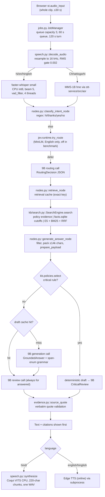
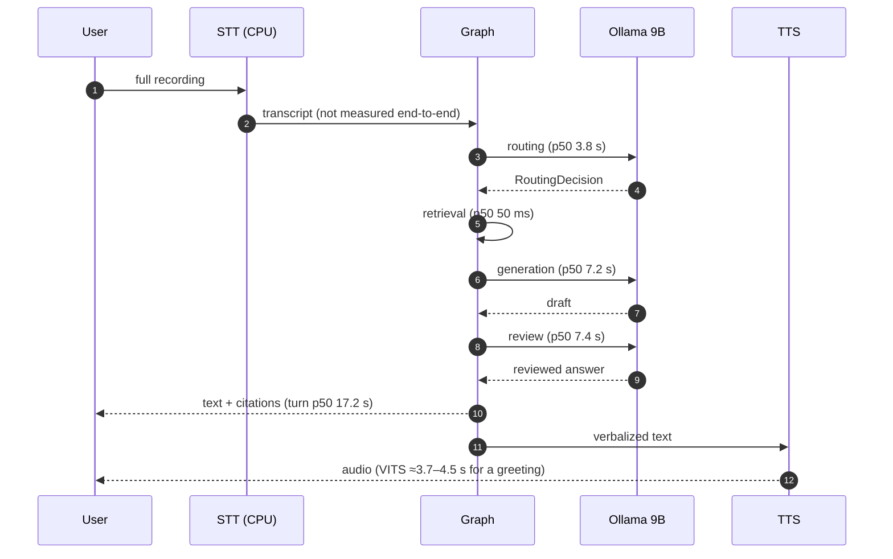

# 01 — Baseline and Current Architecture

This chapter records what the system actually does in code, which optimizations already
exist, what has been measured, and where earlier presentation claims disagree with the
evidence. Later chapters start from this baseline.

Paths are relative to the repository root (`Minor/`). `IA/` abbreviates
`code/Institute-voice-agent/institute-assistant/`.

## 1. Components

| Component | Location | Role |
|---|---|---|
| Demo 2 helpdesk UI and job runner | `code/demo2/app.py`, `jobs.py`, `speech.py`, `verbalization.py`, `agent_bridge.py` | Streamlit UI, bounded admission queue, STT/TTS, bridge to the agent graph |
| Institute agent (LangGraph) | `IA/assistant/graph.py`, `nodes.py`, `llm.py`, `retrieval.py`, `cache.py` | Routing, retrieval, generation, grounding review, tickets/reminders |
| Knowledge base releases | `IA/assistant/kb/*`, `IA/kb_pipeline.py`, `IA/kb_state/` | Extraction, chunking, embedding, verified immutable releases, `facts.sqlite` |
| Learned router (JEV) | `IA/assistant/jev/*`, `IA/jev_pipeline.py` | MiniLM classifier that can replace the routing LLM call on some English turns |
| Streaming STT service | `code/STT/stt-service/src/*` | WebSocket service with Silero VAD, partial/final Whisper decoding, barge-in events (not used by Demo 2) |
| Chhattisgarhi VITS voices | `code/TTS/chattisgarhi-tts-models/{Female,Male}` | Local Hindi/Chhattisgarhi TTS checkpoints |
| Shopping assistant (Demo 1) | `code/demo/*` | MCP tool server for products/cart, voice front end |

## 2. One voice turn as implemented today

Every arrow is sequential. Nothing streams: the recording is complete before ASR starts,
each LLM call returns only when finished (`stream: False` in
`IA/assistant/llm.py::_invoke_local`), and the whole answer is synthesised into one file
before playback (`code/demo2/speech.py::synthesize`).

Stage times come from §4.

## 3. Optimizations already implemented

| # | Optimization | Where | What it saves or protects | Evidence |
|---|---|---|---|---|
| O1 | Regex shortcuts for greetings, thanks, yes/no, cancel | `IA/assistant/nodes.py::classify_intent_node` | Skips all LLM calls on trivial turns | Code |
| O2 | Learned English router (JEV v3, MiniLM, CPU worker) with calibrated abstention | `IA/assistant/jev/runtime.py::try_route` | Replaces the 3.8 s routing call when confident | 36.36% coverage, median 17.018 → 16.318 s (−4.11%), p95 43.0 → 45.4 s; failed latency gates [Measured-here, `IA/docs/ENGLISH_ROUTER_SPEED.md`] |
| O3 | Deterministic rank follow-up rewrite | `IA/assistant/history.py::exact_rank_followup` | Resolves "and for ST?" without trusting the model | 6.06% extra deterministic coverage [Measured-here, same file] |
| O4 | Hybrid retrieval: E5 dense + BM25 + RRF (k = 60), parent expansion | `IA/assistant/kb/search.py::SearchEngine.search` | Lexical matches for names/numbers; complete tables | Recall@6 92/93 (see §5) |
| O5 | Exact SQL sidecar for JoSAA cutoffs; no substitute when absent | `kb/search.py` + `kb/structured.py::lookup_cutoffs` | Exact numbers; avoids cross-category contamination | 42/42 cutoff checks [Measured-here, `code/demo2/VALIDATION.md`] |
| O6 | Policy-bound evidence and deterministic drafts for critical questions | `IA/assistant/kb/policies.py::select`, `nodes.py::generate_answer_node` | Removes the generation call; review still runs | `critical_policy` in candidate run, generation calls 91 → 70 [Measured-here, `data/upgrade-20260930/*/results.json`] |
| O7 | Grammar-constrained JSON with quote enum of real source spans | `IA/assistant/llm.py::generation_schema`, `evidence_spans` | Quotes cannot be rewritten during decoding | Code; but costs decode speed (§6) |
| O8 | Deterministic verbatim quote validation and cutoff line repair | `IA/assistant/evidence.py::source_quote` | Rejects fabricated or reordered quotes | `IA/docs/RAG_MEMORY_CACHE_VALIDATION.md` |
| O9 | Release-bound exact-key caches for retrieval and drafts (SQLite, TTL 1 h, LFU 2000 entries) | `IA/assistant/cache.py::RagCache`, `nodes.py::retrieve_node` | Repeat questions skip retrieval and generation | Local exact repeat 25.882 → 12.687 s (3 → 2 calls) [Measured-here, `VALIDATION.md`] |
| O10 | Token-budgeted prompt (exact tokenizer; trims history, then low-ranked sources) | `IA/assistant/llm.py::prepare_payload` | Prevents context overflow at `num_ctx` 8192 | Code |
| O11 | `think: false`, temperature 0, no repetition penalty | `llm.py::_invoke_local` | No hidden reasoning tokens; stable quotes | Code |
| O12 | Text shown before audio; audio retry without re-running the graph | `code/demo2/app.py`, `jobs.py` | Perceived latency for readers | Code; `VALIDATION.md` |
| O13 | Bounded admission queue with deadlines and cancellation | `code/demo2/jobs.py::JobManager` | Overload protection | 12 operations tests [`VALIDATION.md`] |
| O14 | RMS silence gate before STT; `vad_filter`, `no_speech_prob < 0.6` | `code/demo2/speech.py::transcribe` | No LLM work on silence | Code |
| O15 | Domain initial prompt for Whisper | `speech.py::transcribe` (`initial_prompt=…`) | Biases recognition to institute terms | Code (accuracy not measured) |
| O16 | Resident voice LRU cache (both VITS voices in RAM) | `speech.py::synthesize` (`_SYNTHESIZERS`) | No checkpoint reload on voice switch | Code |
| O17 | Deterministic verbalization (numbers, currency, acronyms, negation guard) | `code/demo2/verbalization.py::normalize` | TTS pronounces amounts and negations correctly | 4 tests [`VALIDATION.md`] |
| O18 | Streaming STT service with VAD, partials (beam 1, last 6 s), finals (beam 5), 600 ms end-of-speech, barge-in | `code/STT/stt-service/src/session.py`, `vad.py`, `config.py` | Low-latency input path | Exists, **not wired into Demo 2** |

## 4. Measured baseline

### 4.1 Text-turn benchmark (no speech)

Source: `code/demo2/data/upgrade-20260930/{baseline,candidate}/results.json`, 120 text
turns each (40 questions × English/Hindi/Hinglish), Ollama `qwen3.5:9b` Q4_K_M,
`num_ctx` 8192, router mode off (every turn used the routing LLM), cold caches per case.
Percentiles computed on 2026-10-05 with linear interpolation. **[Measured-here]**

| Metric | Baseline | Candidate (critical policies) |
|---|---:|---:|
| Turn time p50 / p95 / max | 17.2 / 28.1 / 40.5 s | 14.5 / 30.4 / 44.3 s |
| Answered turns p50 / p95 (n) | 18.7 / 29.9 s (78) | 17.5 / 40.4 s (86) |
| Routing call p50 / p95 | 3.80 / 4.59 s | 3.79 / 4.58 s |
| Retrieval p50 / p95 | 50 / 66 ms | 49 / 70 ms |
| Generation call p50 / p95 (n) | 7.18 / 13.36 s (91) | 6.86 / 18.29 s (70) |
| Review call p50 / p95 (n) | 7.41 / 13.45 s (78) | 6.77 / 17.97 s (90) |
| Model calls per turn (3 / 2 / 1) | 78 / 13 / 29 | 58 / 44 / 18 |
| Status: answered / insufficient / out-of-scope | 78 / 28 / 14 | 86 / 28 / 6 |
| First (warm-up) turn | 30.9 s, routing 11.2 s (model load) | 35.9 s, routing 11.9 s |

On an answered turn the three 9B calls account for about 3.8 + 7.2 + 7.4 ≈ 18.4 s of the
18.7 s median; retrieval is under 0.3% of the turn. **The LLM is the bottleneck, and two of
its three calls produce the answer twice.**

### 4.2 Other recorded measurements

| Measurement | Value | Source |
|---|---|---|
| Final local recheck, 12 turns | median 23.711 s, range 19.2–47.1 s | `IA/docs/LOCAL_MODEL_VALIDATION.md` |
| Full local run, answered turns | median 34.187 s | same |
| CPU/GPU split reported by Ollama | 52%/48% (full run), 32%/68% (recheck) | same |
| Exact repeat, local | 25.882 → 12.687 s; 3 → 2 calls | `code/demo2/VALIDATION.md` |
| Exact repeat, **Groq** | 5.122 → 2.641 s | `IA/docs/RAG_MEMORY_CACHE_VALIDATION.md` |
| Warm retrieval median / p95 | 11.4 / 13.8 ms | `VALIDATION.md` (2026-09-22) |
| VITS greeting synthesis | Female ≈3.65 s, Male ≈4.51 s | `VALIDATION.md` (2026-09-18) |
| Edge TTS (Hinglish) | 27,072 bytes MP3 in 2.1 s | `VALIDATION.md` |
| ASR latency / WER, end-to-end voice latency | **not measured** | `VALIDATION.md` states no speech benchmark was run |

### 4.3 Read-only measurements taken for this report (2026-10-05)

All on the project laptop, Ollama with `qwen3.5:9b`, no configuration changed. **[Measured-here]**

| Probe | Result |
|---|---|
| Hardware | RTX 4060 Laptop 8188 MiB; i7-14650HX, 24 threads, **no AVX-512** (`avx512f` absent in `/proc/cpuinfo`); 31 GB RAM |
| VRAM in use before the model loaded | 2737 MiB (desktop session and other processes) |
| `ollama ps` after load | 6.3 GB, **45%/55% CPU/GPU**, context 8192 |
| `nvidia-smi` llama-server | 4412 MiB on GPU |
| `ollama show qwen3.5:9b` | arch `qwen35`, 9.7B params, Q4_K_M, includes vision capability |
| Cold load | 8.3 s |
| Prefill, 920-token prompt, cold | 1120 ms (≈820 tok/s) |
| Same prompt repeated | 111–138 ms (prefix fully reused) |
| Same system prompt, different 6-token user message | 732 ms (only ≈35% saved) |
| First token of system prompt changed | 1015 ms (no reuse) |
| Return to the original prompt after another request | 589 ms (slot was overwritten) |
| Decode, free text | ≈17.7 tok/s (10 tokens in 565 ms) |
| Decode, JSON schema with a 300-entry string enum | 157 ms/token vs 61 ms/token for the same schema without the enum (**2.6× slower**) |

Two conclusions matter for the later chapters:

1. **About 2.7 GB of VRAM is already taken by the desktop**, so only about 5.4 GB is free.
   The 6.3 GB model therefore runs partly on CPU. That explains the 20–50 s turns better
   than model size alone ([05](05_LLM_INFERENCE_AND_SERVING.md)).
2. **The quote-enum grammar makes decoding 2.6× slower** in this probe, and prefix reuse
   only works for byte-identical prompts. Changing just the user message reused a small
   part of the prefix. This fits the hybrid Gated-DeltaNet architecture: recurrent state
   cannot be rewound to an arbitrary token, so llama.cpp can reuse only at saved checkpoints
   [R45][R46]. The probe used one synthetic 300-span enum; real per-request enums differ
   in size, so the 2.6× factor is indicative, not a production measurement.

## 5. Gains over a "traditional" pipeline, using measured data only

| Comparison | Measured gain | Caveat |
|---|---|---|
| Retrieval: previous corpus/index vs current release | supporting-evidence recall@6 10/93 → 92/93 | Corpus, extraction and retrieval all changed; old metric used a source/page proxy. Not an isolated "hybrid vs vector" ablation. `VALIDATION.md` |
| Exact cutoffs via SQL | 42/42 known/unavailable cutoff checks | No vector-only baseline was run on the same cases |
| Exact-key cache | 25.9 → 12.7 s on one local repeat | One sample; review still runs |
| Critical deterministic policies | p50 17.2 → 14.5 s, answered 78 → 86 | p95 got worse (28.1 → 30.4 s); different turn mix |
| JEV router | median −4.11% | p95 +5.6%; failed its own latency gates |

There is no measured comparison against a naive cloud pipeline, and no measured cost per turn.

## 6. Claim corrections (existing presentation documents)

The documents under `idea/presentation/minor/` were **not edited**. Use this table when
presenting.

| Claim | Location | Repository evidence | Status |
|---|---|---|---|
| Warm perceived latency 2.64 s, "8.2× faster" | `minor/03_…` summary and latency tables | 2.641 s was a **Groq** exact-repeat sample, excluding speech (`RAG_MEMORY_CACHE_VALIDATION.md`). Local exact repeat was 12.687 s | **Contradicted** for local |
| Cold perceived text latency 18.68 s; total voice turn 21.2 s | `minor/03_…` | Text turn p50 17.2 s / answered 18.7 s (benchmark JSON); recheck median 23.7 s. Voice turn not measured | Text partly confirmed; voice **unverified** |
| ASR 1850 ms, VAD 210 ms, TTS first chunk 1650 ms, verbalization 4.2 ms | `minor/03_…` stage table | No speech benchmark exists (`VALIDATION.md`) | **Unverified** |
| Hallucination rate 0% / "0 of 120 hallucinated citations" / "zero hallucinations" | `minor/03_…`, `minor/02_…` | Quote validation proves quotes exist in sources; `LOCAL_INFERENCE.md` states this "does not prove that the prose is supported". No claim-level audit of 120 answers | **Overstated** — say "no unverifiable quotations" |
| 316 passing tests | `minor/02_…`, `minor/03_…` | `VALIDATION.md` October section reports 316; Sept 23 section and root `README.md` report 159 | Two figures coexist; cite with date |
| 682× cheaper, $0.60/month | `minor/03_…` §3 | Assumes 15.7 s × 115 W per query and list prices; no power measurement | **Estimate**, not a measurement |
| Chhattisgarhi WER 45% → 12% | `minor/03_…` summary | No WER/CER measurement found in the repository | **Unverified** |
| 6.3 GB on GPU, ~0.9 GB free, "100% uptime", speech never on GPU | `minor/03_…` §5 | `ollama ps` shows 45–52% of the model on CPU; desktop uses ~2.7 GB VRAM | **Contradicted** |
| CPUs "with AVX-512" accelerate speech | `minor/01_…`, `minor/03_…` | i7-14650HX lacks AVX-512 | **Contradicted** |
| Context in 350-token chunks with 50-token overlap | `minor/02_…` | `IA/assistant/config.py`: `KB_CHUNK_TOKENS=350`, `KB_OVERLAP_TOKENS=50` (legacy `CHUNK_SIZE=1000` chars is the old index) | **Confirmed** |
| BM25 k1 = 2.5, b = 0.75 | `minor/02_…` | Code uses factor 2.5 in the numerator and 1.5·(0.25 + 0.75·len/avg) in the denominator, i.e. k1 = 1.5, b = 0.75 | **Mislabelled** (k1 = 1.5) |
| Routing p50 3795 ms, generation 7176.5 ms, review 7413.4 ms | `minor/03_…`, `minor/04_…` | Matches baseline JSON | **Confirmed** (p95 values in the slide differ slightly from recomputation) |
| Laya integration: routing 3.8 s → 33 ms "with zero loss" | `minor/04_…` | 33 ms is on a T4 GPU [R29]; ~100 ms laptop CPU per a third-party port; independent study finds it under-confident [R30]. Not tried here | **Unverified projection** |
| LLMLingua: "without losing numbers" | `minor/04_…` | Compression reduced citation grounding by 40–50% on ASQA [R55] | **Risky** for this project |

## 7. Gaps

| Gap | Evidence | Chapter |
|---|---|---|
| No streaming anywhere (whole-clip ASR, non-streamed LLM, whole-file TTS) | `speech.py`, `llm.py` (`stream: False`), `app.py` (`st.audio_input`) | 03, 05, 07 |
| Up to three 9B calls per answered turn; review runs even on draft-cache hits | `nodes.py::generate_answer_node`; 78/120 turns used 3 calls | 05, 06 |
| Model does not fit in free VRAM → 45–52% on CPU | §4.3 | 05 |
| Per-request quote-enum grammar slows decoding (2.6× in probe) and sits in the system message, defeating prefix reuse | `llm.py::_messages` puts the schema into the system prompt; §4.3 | 05 |
| Prefix reuse breaks unless prompts are byte-identical (hybrid DeltaNet checkpointing) | §4.3; [R45][R46] | 05 |
| `/api/tags` HTTP call before every model call | `llm.py::_invoke_local` | 05 |
| Exact-key cache only; paraphrases miss | `RAG_MEMORY_CACHE_VALIDATION.md` | 06 |
| No reranker; small embedding model (e5-small) | `kb/search.py`, `config.py` | 04 |
| English/Hinglish TTS is online (Edge) | `speech.py::make_audio` | 07 |
| Turn end = button press; no semantic end-of-turn, no barge-in in Demo 2 | `app.py` | 03 |
| No speech benchmarks (WER, ASR latency, TTS quality, end-to-end) | `VALIDATION.md` | 12 |
| Single serialized model lock; one user at a time | `llm.py::_LOCAL_LOCK` | 10 |
