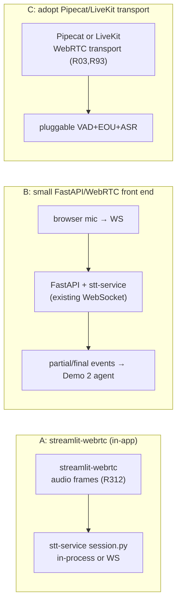

# 03 — Speech Input and Turn-Taking

How the user's voice reaches the agent: when the recording starts and stops, how fast and
accurate the transcript is, and how to overlap it with everything downstream. Today Demo 2
uploads a whole clip (`st.audio_input`) and transcribes it in one blocking call on the CPU
([01](01_BASELINE_AND_CURRENT_ARCHITECTURE.md) §2, O14/O15), so the entire turn length is
paid as input latency ($t_{\text{EOU}}$ = button press + upload, $t_{\text{ASR,residual}}$ =
full transcription). A streaming input path already exists in `code/STT/stt-service/` (O18)
but is **not wired into Demo 2**. This chapter shows how to connect it, add a semantic
end-of-turn (EOU) model, start generation on stable partials, and pick an Indic/Hinglish ASR
model that fits beside the 9B LLM on the 8 GB T0 laptop.

Paths are relative to the repository root (`Minor/`). `IA/` = `code/Institute-voice-agent/institute-assistant/`.

## Recommendations by tier

| Tier | Streaming ASR | VAD + EOU | Model | Expected input-path win vs today |
|---|---|---|---|---|
| **T0** (RTX 4060 8 GB, LLM resident) | Wire `stt-service` WebSocket into Demo 2 via a small FastAPI/WebRTC front end or `streamlit-webrtc` [R312]; faster-whisper `small` **CPU int8** (keep VRAM for LLM) [R305] | Silero VAD [R89] + Smart-Turn v3 **or** vedants254 EOU on CPU (8M, int8 ONNX, ~12 ms) [R301][R302] | faster-whisper `small` (hi/en) + MMS `hne` (hne) as today; add Hindi/Hinglish fine-tune only if WER measured better | Residual ASR ≈ last chunk, not whole clip; EOU 300–600 ms vs button press |
| **T1** (16–24 GB GPU) | SimulStreaming/WhisperLiveKit, Whisper `large-v3` on GPU (AlignAtt) [R304][R309] | Silero + LiveKit audio turn-detector v1-mini (local, ⚠ licence) or vedants254 (MIT) [R302][R303] | `large-v3-turbo` fp16 or IndicConformer-hi GPU [R314] | Full streaming overlap; residual 100–200 ms |
| **T2** (40–80 GB) | SimulStreaming batched, GPU Whisper/Conformer | Audio EOU model, batched | Fine-tuned large model; concurrency in [10](10_THROUGHPUT_CONCURRENCY_AND_TELEPHONY.md) | Residual < 100 ms |
| CPU-only | `stt-service` partials greedy (beam 1), finals beam 5 (as configured) | Silero + Smart-Turn v3 (8M CPU) [R301] | faster-whisper `small`/`base` int8 | Streaming hides most ASR time |

Hard constraint on T0: **CTranslate2 cannot load `libcublas.so.12` on the project machine**,
so Whisper runs CPU int8 regardless of the GPU (`code/demo2/VALIDATION.md` lines 224–225;
`code/demo2/README.md` line 129; fallback logic in `speech.py::transcribe`). MMS `hne` can
still use Torch CUDA. Plan all T0 ASR latency as CPU latency.

## 1. The input path today vs the target

```mermaid
flowchart TB
  subgraph Today["Today (Demo 2, batch)"]
    A1["Browser st.audio_input<br/>(records whole clip)"] --> A2["Press stop → upload WAV"]
    A2 --> A3["speech.py::decode_audio<br/>resample 16 kHz, RMS gate 0.002"]
    A3 --> A4["speech.py::transcribe<br/>faster-whisper small, CPU int8,<br/>beam 5, vad_filter, initial_prompt"]
    A4 --> A5["transcript → agent graph"]
  end
  subgraph Target["Target (streaming input path)"]
    B1["Mic → WebRTC/WebSocket<br/>20–32 ms PCM frames"] --> B2["vad.py Silero VADIterator<br/>512-sample frames"]
    B2 -->|speech| B3["session.py buffer +<br/>partial every 700 ms<br/>(last 6 s, beam 1)"]
    B2 -->|silence ≥ min| B4["EOU check:<br/>Silero silence OR<br/>Smart-Turn/vedants254 p_complete"]
    B4 -->|not done| B3
    B4 -->|turn done| B5["final transcript<br/>(full buffer, beam 5)"]
    B3 -. stable prefix .-> B6["preemptive routing/retrieval<br/>on stable partial (R06)"]
    B5 --> B7["agent graph<br/>(commit / rollback if partial changed)"]
    B6 --> B7
  end
```

The target path turns one big serial block into overlapping stages: by the time the user
stops, the buffer up to the last partial is already transcribed, so only the last
~0.7–1.0 s needs a final pass. See the overlap maths in
[02](02_LATENCY_COST_MODEL_AND_METRICS.md) §1.1.

## 2. Streaming ASR: committing stable prefixes

### 2.1 LocalAgreement-n

**What.** Re-transcribe a growing audio buffer every update; only *commit* (freeze and emit)
the longest common prefix that agreed across the last $n$ consecutive updates. Unstable tail
tokens stay revisable.

**Intuition.** Whisper is an offline model; its hypothesis for the latest audio flickers
until more context arrives. If the same prefix survives $n$ updates it is unlikely to change,
so it is safe to show and to act on.

**Maths.** Let $H_t$ be the hypothesis token sequence at update $t$. LocalAgreement-$n$ emits

$$
C_t = \operatorname{LCP}\big(H_{t}, H_{t-1}, \dots, H_{t-n+1}\big)
$$

the longest common prefix of the last $n$ hypotheses, minus what was already committed.
With $n=2$ this is just $\operatorname{LCP}(H_t, H_{t-1})$. Larger $n$ → fewer corrections
(lower flicker) but more added latency (a correct token waits $n-1$ extra updates before
being trusted). Commit delay $\approx (n-1)\cdot \Delta_{\text{update}}$.

**Evidence.** Whisper-Streaming introduced self-adaptive-latency LocalAgreement and reports
state-of-the-art streaming quality with faster-whisper as the recommended backend [R311,
Reported]. SimulStreaming calls LocalAgreement "the second best-performing policy, but much
easier to implement" [R304, fetched].

### 2.2 AlignAtt

**What.** Use the Whisper decoder's cross-attention to find which audio frame each output
token attends to. Stop decoding when attention reaches a "dangerous zone" within
`frame_threshold` frames of the end of the current audio buffer; resume when more audio
arrives.

**Intuition.** If the model is already attending to the very end of the audio, the next token
depends on sound not yet received, so emitting it risks a correction. One Whisper frame is
0.02 s for large-v3 [R304, fetched], so the threshold maps directly to a latency floor.

**Maths.** For decoding step $i$, let $a_i = \arg\max_f \text{attn}(i, f)$ be the most-attended
source frame and $F$ the number of frames in the buffer. Emit token $i$ only while

$$
F - a_i > \texttt{frame\_threshold}.
$$

Lower threshold → lower latency, higher correction risk. SimulStreaming is "~5× faster than
WhisperStreaming" and was the best system at IWSLT 2025 Simultaneous Speech Translation
[R304, fetched]. It also truncates the last decoded word with a CIF model (no large-v3 CIF
model exists, so `--never_fire` keeps the last word).

**Where it fits.** The current `stt-service` does **not** use either policy. It approximates
streaming by re-transcribing only the last `PARTIAL_WINDOW_MS` of audio each 700 ms
(`code/STT/stt-service/src/session.py::_emit_partial`, `config.py::PARTIAL_WINDOW_MS=6000`,
beam 1) and does a full-buffer beam-5 final (`session.py::_finalize`). This is a windowed
re-decode, not prefix-committing — partials can rewrite earlier words. Adopting
LocalAgreement-2 on top of the existing partial loop is the smallest change; adopting AlignAtt
means switching the backend to SimulStreaming/WhisperLiveKit [R304][R309].

**How to implement.**
1. T0/CPU: keep faster-whisper (`stt-service` already uses it, MIT [R305]). Add LocalAgreement-2
   in `session.py`: keep the previous partial's token list, emit only the common prefix, keep
   the rest revisable. ~30 lines; no new dependency.
2. T1/T2: run WhisperLiveKit [R309] (MIT) which bundles SimulStreaming (AlignAtt, MIT [R304])
   and WhisperStreaming; point its WebSocket at the same client. Whisper large-v3 needs
   ≥10 GB VRAM [R304], so T1+ only.

**Expected effect.** Converts $t_{\text{ASR,residual}}$ from "whole clip" to "last chunk".
With a 6 s utterance and 0.7 s partial cadence, residual ≈ one final pass over the last
≤1 s of audio instead of 6 s. [Estimated] from `config.py` cadence; magnitude depends on CPU
ASR speed (§5). No isolated measurement exists in the repo (`VALIDATION.md`: no speech
benchmark).

**Risks / interactions.** Committing a prefix before the user finishes risks acting on a
wrong partial; keep preemptive work (§4) idempotent and rollback-safe. Grounding is
unaffected (ASR feeds the question, not the evidence quotes checked by
`IA/assistant/evidence.py::source_quote`).

**How to measure.** Streaming WER/CER vs the non-streaming final, plus commit latency
(seconds from a word being spoken to being committed) and correction rate (committed tokens
later changed). See [12](12_EVALUATION_AND_BENCHMARKING.md).

## 3. VAD and endpointing

### 3.1 Silero VAD (already wired in `stt-service`)

**What.** A small neural voice-activity detector that labels 32 ms frames as speech/non-speech
and emits start/end events. `code/STT/stt-service/src/vad.py::SpeechDetector` wraps Silero's
`VADIterator` with `threshold=0.5`, `min_silence_duration_ms=100`
(`config.py::VAD_THRESHOLD`, `VAD_MIN_SILENCE_MS`), one shared ONNX model per process, 512
samples per frame at 16 kHz.

**Evidence.** Silero VAD is MIT and ships ONNX weights inside the pip package (no runtime
download), as the code comment and repo state [R89, snippet].

**Endpointing silence trade-off.** `stt-service` finalises after
`END_OF_SPEECH_SILENCE_MS = 600` ms of continuous silence (`session.py`:
`should_finalize = silence_ms >= 600 or utterance_ms >= 20000`). The trade-off is:

$$
t_{\text{EOU}} \approx t_{\text{VAD lag}} + T_{\text{silence}}.
$$

- Too short $T_{\text{silence}}$ → **false cut**: the agent interrupts a mid-sentence pause.
- Too long → the user waits $T_{\text{silence}}$ of dead air after every turn.

Human inter-turn gaps are ~200–300 ms; above ~800 ms a call feels sluggish
([02](02_LATENCY_COST_MODEL_AND_METRICS.md) §1, [R94]). A pure-silence cutoff cannot tell a
thinking pause ("admission… for ST category?") from a finished turn — that is what a semantic
EOU model (§3.2) adds. LiveKit requires VAD `min_silence ≥ 250 ms` when an audio turn-detector
is used, and lowers its endpointing window from 0.5–3.0 s to 0.3–2.5 s because the model gives
a confident signal [R303, fetched].

### 3.2 Acoustic vs semantic end-of-turn detection

**What.** Instead of (or on top of) a fixed silence timer, a model predicts the probability
that the turn is complete from the audio itself (prosody + content).

| Model | Type | Base / size | Languages (verified) | Reported accuracy | Licence | ID |
|---|---|---|---|---|---|---|
| Smart-Turn v3 | audio, semantic VAD | Whisper-Tiny encoder + linear head, 8M, 8 MB int8 ONNX | multilingual (not individually listed) | — (model card gives no WER; blog claims **12 ms CPU** inference) | BSD-2 | [R301][R300] |
| vedants254 voice-turn-detection | audio classifier | Whisper-Tiny encoder, 8 s / 400 frames, ONNX | English, **Hindi, Hinglish** | 93.70% overall / **93.93% Hindi** / 93.66% English acc@0.5; ROC-AUC 0.9826 on `smart-turn-data-v3.2-test` (9,104 clips) | **MIT** | [R302] |
| LiveKit turn-detector v1 (audio) | audio, cloud | not disclosed | 14 incl. **Hindi** | benchmarked on eot-bench (numbers not on page) | LiveKit cloud | [R303] |
| LiveKit v1-mini (audio) | audio, local CPU | small | 14 incl. Hindi | — | LiveKit Model License ⚠ | [R303] |
| LiveKit text detector (deprecated) | text, needs transcript | Qwen2.5-0.5B, 396 MB | 14 incl. Hindi | Hindi TPR 99.4% / TNR 96.3%; ~50–160 ms CPU | LiveKit Model License ⚠ | [R303] |

For this project the **vedants254 model is the recommended EOU**: it is the only one that
explicitly covers English/Hindi/Hinglish, is **MIT-licensed**, runs on CPU from ONNX, needs no
transcript, and shares architecture + test set with Smart-Turn (so results are comparable)
[R302, fetched]. Smart-Turn v3 is a drop-in alternative (BSD-2, 12 ms CPU) if its language
coverage is confirmed on Hindi [R301][R300].

**Maths of a thresholded EOU classifier.** The model outputs $p_{\text{complete}}\in[0,1]$
(a sigmoid; vedants254 input is the last 8 s left-padded to `[batch, 128000]`, output
`p_complete` [R302]). Decide "turn over" when $p_{\text{complete}} \ge \tau$. Two error modes:

- **False cut** (false positive): declare the turn over while the user intends to continue.
  Rate $= P(p \ge \tau \mid \text{not done})$ — decreasing in $\tau$.
- **Added delay** (false negative region): the user *has* finished but $p < \tau$, so the
  system falls back to the silence timer, adding up to $T_{\text{silence}}$.

Expected extra latency from using a threshold instead of acting on true completion:

$$
\mathbb{E}[\Delta t_{\text{EOU}}] \approx \underbrace{P(p<\tau \mid \text{done})}_{\text{missed completions}}\cdot \bar T_{\text{silence}}
\;+\; \underbrace{P(p\ge\tau \mid \text{not done})}_{\text{false cuts}}\cdot C_{\text{interrupt}},
$$

where $C_{\text{interrupt}}$ is the cost (in effective latency/UX) of a wrong interruption
(apology, re-prompt, user repeats). Choose $\tau$ to minimise this: raise $\tau$ when
interruptions are expensive (barge-in weak), lower it to cut dead air when the VAD min-silence
is already short. Both LiveKit [R303] and vedants254 [R302] explicitly tell deployers to
**calibrate $\tau$ on their own traffic** and note "higher threshold → fewer interruptions but
more delay". Use a per-language $\tau$ (LiveKit supports a dict keyed by language code [R303]),
since Hindi/Hinglish prosody differs from English.

**Where it fits.** New: between `vad.py` events and `session.py::_finalize`. Replace the pure
`silence_ms >= END_OF_SPEECH_SILENCE_MS` test with
`silence_ms >= min_silence AND (eou_p >= tau OR silence_ms >= max_silence)`. The EOU model runs
in the existing `_EXECUTOR` thread pool (`session.py`). Demo 2 does not currently have this
path at all (button press = EOU).

**How to implement.**
1. `pip`-free ONNX: load vedants254 ONNX with `onnxruntime` (CPU); feed the last 8 s of the
   session buffer, left-padded, on each silence event. [R302]
2. Gate finalisation on `p_complete ≥ τ` with a `max_silence` safety cap (keep the current
   600 ms as `min_silence`, add e.g. 1500 ms `max_silence`).
3. Expose `τ` per language in `config.py` (new env var), defaulting to 0.5 and tuned per §12.

**Expected effect.** [Reported] 93.9% Hindi / 93.7% English turn-classification accuracy
[R302] means most turns can commit on the model's signal within one inference (~tens of ms on
CPU) instead of waiting the full silence timer, cutting dead air by up to several hundred ms
while keeping false cuts low. Exact $t_{\text{EOU}}$ depends on $\tau$ and must be
[Measured-here] after wiring.

**Risks / interactions.** A false cut truncates the user's question → wrong retrieval → wrong
answer; this is a correctness risk, not just latency. Keep the silence `max_silence` cap so a
low-confidence model never hangs. Independent of grounding caches
(`IA/assistant/cache.py`) and SQL cutoffs (`facts.sqlite`).

**How to measure.** EOU false-cut rate and median added delay on held-out
English/Hindi/Hinglish turns; sweep $\tau$ and plot the ROC/latency curve. See [12](12_EVALUATION_AND_BENCHMARKING.md).

## 4. Preemptive generation on stable partials

**What.** Start routing/retrieval (and optionally a draft) as soon as a *stable* partial
transcript is available, before the final transcript, then commit or roll back when the final
arrives.

**Intuition.** On a knowledge turn, routing (3.8 s) and retrieval can run while the user is
still finishing the sentence. If the final transcript equals the stable prefix, the work is
reused; if it differs, discard and redo.

**Maths / rollback cost.** Let $p_{\text{match}}$ be the probability the final transcript's
intent equals the stable partial's. Expected saved time:

$$
\mathbb{E}[\text{saving}] = p_{\text{match}}\cdot t_{\text{overlapped}} - (1-p_{\text{match}})\cdot t_{\text{wasted work}}.
$$

Only cheap, side-effect-free stages should run preemptively: retrieval (50 ms, O4) and
routing are safe to redo; a 9B generation call is expensive to waste and must **not** be
emitted until the final transcript is committed. LiveKit exposes exactly this as "preemptive
generation" turn-handling [R06, snippet]; the rollback cost is a wasted LLM prefill/decode if
the partial was wrong ([02](02_LATENCY_COST_MODEL_AND_METRICS.md) §2).

**Where it fits.** Between the streaming partial (`session.py::_emit_partial`) and
`IA/assistant/graph.py`: trigger `classify_intent_node` / `retrieve_node` on a stable partial;
gate `generate_answer_node` on the final. Today nothing is preemptive (whole-clip ASR).

**Expected effect.** Hides routing+retrieval (≈3.85 s on T0, [01](01_BASELINE_AND_CURRENT_ARCHITECTURE.md) §4.1)
behind the user's last words when $p_{\text{match}}$ is high. [Estimated]; net win requires
$p_{\text{match}} \cdot 3.85\text{ s} > (1-p_{\text{match}})\cdot t_{\text{wasted}}$.

**Risks / interactions.** Acting on a wrong partial → wrong retrieval cache key
(`cache.py` is exact-key; a wrong key simply misses, not corrupts). Never let a preemptive
draft reach `evidence.py::source_quote` before the final transcript is confirmed. Must respect
the single model lock (`IA/assistant/llm.py::_LOCAL_LOCK`, [10](10_THROUGHPUT_CONCURRENCY_AND_TELEPHONY.md)).

**How to measure.** $p_{\text{match}}$ (stable-partial-intent == final-intent) and net latency
delta on real turns; abort rate of preemptive work.

## 5. Barge-in and echo cancellation

**What.** Let the user interrupt the agent's speech ("barge-in"), and stop the TTS feeding
back into the mic (acoustic echo cancellation, AEC).

**Current state.** `stt-service` already emits barge-in: `speech_started` carries
`interrupt_previous_response: true` (`code/STT/stt-service/src/session.py` line ~151,
`schemas.py::STTEvent.interrupt_previous_response`, documented in
`code/STT/stt-service/README.md` and `code/AGENTS.md`). Demo 2 has **no** barge-in — it plays
a single pre-rendered WAV ([07](07_SPEECH_OUTPUT.md)); you cannot interrupt it.

**Intuition / maths.** Without AEC, the agent's own output in the mic triggers VAD and the EOU
model, causing self-interruption. AEC estimates the echo path $\hat h$ and subtracts the
predicted echo $\hat y = \hat h * x_{\text{far}}$ from the mic signal $d$: residual
$e = d - \hat y$, with $\hat h$ adapted (e.g. NLMS). WebRTC's APM/AEC3 does this plus noise
suppression [R313].

**How to implement.** Easiest is browser-side: WebRTC `getUserMedia({ echoCancellation: true,
noiseSuppression: true, autoGainControl: true })` runs libwebrtc AEC3 in the browser before
audio ever leaves the client — no server dependency, BSD-3 [R313]. Server-side AEC
(`webrtc-audio-processing` bindings) is only needed for non-browser/telephony transports
([10](10_THROUGHPUT_CONCURRENCY_AND_TELEPHONY.md), [R93]). Wire the `interrupt_previous_response`
event to cancel the TTS job (Demo 2's `jobs.py::JobManager` already supports cancellation, O13).

**Expected effect.** Enables duplex conversation; removes self-triggered false cuts.
[Reported] AEC quality is standard in libwebrtc; no project measurement.

**Risks / interactions.** Over-aggressive AEC/NS can clip quiet speech → higher WER. Barge-in
must cancel the current turn's downstream work (graph + TTS) cleanly via the existing
cancellation path.

## 6. Contextual biasing and entity post-correction

**What.** Steer ASR toward domain terms and fix misheard names against the knowledge base.

**Current state.** Both pipelines already pass an `initial_prompt`:
`code/demo2/speech.py::transcribe` uses `"IIIT Naya Raipur, admissions, hostel, fees, प्रवेश,
शुल्क"` (O15); `stt-service` uses `config.py::ASR_INITIAL_PROMPT` (a dental-clinic example to
be replaced per deployment). Whisper treats `initial_prompt` as prior context, biasing proper
nouns [R305 docs; code comment in `asr.py`]. **Accuracy effect is not measured** in the repo.

**Intuition / maths.** `initial_prompt` conditions the decoder's prior
$P(\text{token}\mid\text{prompt})$ toward in-vocabulary spellings. Post-correction is a second
stage: for each recognised span, if edit/phonetic distance to a KB entity name is below a
threshold, snap to the canonical name:

$$
\hat e = \arg\min_{e\in \text{KB names}} d_{\text{phon}}(w, e)\quad\text{if } \min_e d_{\text{phon}} < \theta.
$$

**Where it fits.** `initial_prompt`: `speech.py::transcribe`, `asr.py::FasterWhisperEngine`.
Entity post-correction is **new**, placed after the final transcript and before
`classify_intent_node`; the candidate name list is the set of KB entity names (programmes,
hostels, categories) already indexed by `IA/assistant/kb/*`. Note faster-whisper has no true
hotword-boost API — biasing is only via `initial_prompt` (soft) today.

**How to implement.** (1) Replace the generic `initial_prompt` with the institute lexicon
(programmes, "JoSAA", category codes). (2) Build a small gazetteer of KB names; apply a
Devanagari-aware fuzzy match (e.g. normalized edit distance + a phonetic key) on recognised
tokens. Keep it conservative (`θ` small) to avoid rewriting correct words.

**Expected effect.** [Estimated] Biasing mainly helps names/numbers that drive retrieval and
exact SQL cutoffs — a small WER win but a larger *task-success* win because a misheard
category code queries the wrong `facts.sqlite` row. Must be measured per §12.

**Risks / interactions.** **Grounding-critical**: post-correction must not alter numbers used
for exact cutoffs — snapping "OBC" vs "OBC-NCL" to the wrong canonical name would query the
wrong `facts.sqlite` cutoff (O5). Over-long `initial_prompt` can itself be hallucinated back as
output on near-silence; `stt-service` guards this with
`NO_SPEECH_PROB_THRESHOLD` (0.6) and `MIN_FINAL_AUDIO_MS` (`config.py`, `session.py::_finalize`).

**How to measure.** Entity-level recall/precision on a held-out set of spoken questions
containing KB names; WER/CER with vs without biasing; downstream retrieval recall@6.

## 7. Indic / Hinglish / Chhattisgarhi ASR model comparison

WER numbers below are **[Reported]** from each source with its own test set and conditions —
they are *not* comparable across rows (different datasets, reference styles). Verify on the
project's own audio before choosing (§12).

| Model | Params | hi / Hinglish / hne support | Reported WER (dataset, conditions) | Size | CPU/GPU latency | Licence | Source |
|---|---|---|---|---|---|---|---|
| faster-whisper `small` (current Demo 2) | 244M | hi/en via Whisper; Hinglish = `language=None` | general Whisper WER; no Hindi number in repo | ~0.5 GB int8 | CPU int8: 13-min audio in **1m42s** / 1477 MB (i7-12700K, 8 thr) [R305] | MIT | [R305] |
| faster-whisper `medium` | 769M | hi/en | — | ~1.5 GB int8 | slower than small (not benchmarked here) | MIT | [R305] |
| faster-whisper `large-v3-turbo` | 809M | hi/en, 99 langs | — | ~1.6 GB fp16 | GPU-oriented; CPU slow | MIT | [R305] |
| IndicWhisper (Vistaar) | ~1.5B (large) | hi + 11 Indian langs | lowest WER in 39/59 Vistaar benchmarks, avg −4.1 WER vs baselines | large | GPU-oriented | MIT | [R306] |
| Whisper-Hindi2Hinglish-Prime (Oriserve) | 2B | hi → **Hinglish output** | Hinglish-text WER **32.43 CommonVoice / 28.68 FLEURS / 60.82 IndicVoices** (vs Whisper-L-v3 61.94/50.84/82.56) | 2B (fp32) | GPU-oriented (large-v3 base) | Apache-2.0 | [R307] |
| IndicConformer-hi (AI4Bharat) | large Conformer | hi (22 langs) | — (verify) | — | GPU-oriented (NeMo) | custom ⚠ (verify) | [R314] |
| Parakeet-TDT-0.6B-v3 | 600M | **Hindi NOT supported** (25 European langs) | Fleurs 11.97 / MLS 7.83 / CoVoST 11.98 avg (European) | ~0.6 GB; GGUF q8 | very high throughput GPU (RTFx 3332 EN); 2 GB RAM min | CC-BY-4.0 | [R308] |
| Canary-1B-v2 | 1B | **Hindi NOT supported** (25 European langs) | per [R316] | ~1 GB | GPU | CC-BY-4.0 | [R316] |
| MMS-1B `hne` (current Chhattisgarhi) | 1B | **hne** (Chhattisgarhi) | no WER in repo | ~1 GB fp32 | heavy on CPU (code comment warns); Torch CUDA ok | **CC-BY-NC-4.0 ⚠** | [R317] |

Key takeaways:
- **Do not recommend Parakeet/Canary for this project**: verified — their v3 covers 25
  European languages and **not Hindi** [R308, fetched]. They are only relevant to an
  English-only kiosk or a future European deployment.
- **T0 default stays faster-whisper `small` CPU int8** (fits beside the LLM, MIT). Only move
  to a Hindi/Hinglish fine-tune (Oriserve [R307], IndicWhisper [R306]) if a measured WER win
  justifies the extra size/latency — and note Oriserve emits *romanised Hinglish*, which
  changes the downstream text and the KB-matching stage.
- **MMS `hne` is CC-BY-NC-4.0 ⚠** (non-commercial) — fine for the academic demo, must be
  flagged before any commercial use. It is also 1B params and slow on CPU (code comment in
  `asr.py::ChhattisgarhiMMSEngine` warns to test latency; consider final-only).

## 8. VRAM contention with the LLM on T0

On the project laptop only ~5.4 GB VRAM is free after the desktop (~2.7 GB) and the resident
9B model runs 45–52% on CPU ([01](01_BASELINE_AND_CURRENT_ARCHITECTURE.md) §4.3). Loading a
GPU Whisper beside it would evict LLM layers to CPU and slow decoding further
([02](02_LATENCY_COST_MODEL_AND_METRICS.md) §2.1). Combined with the CTranslate2/libcublas
failure, the correct T0 choice is **CPU int8 Whisper** (as configured) — paying ASR time on
the 24-thread CPU rather than stealing VRAM from the LLM. Streaming (§2) hides most of that CPU
time; the EOU model (§3.2) is 8M params and trivial on CPU. MMS `hne` may use Torch CUDA when
VRAM allows, but on T0 it competes with the LLM, so prefer CPU or final-only there too.

## 9. Wiring the streaming path into Demo 2

Demo 2 is Streamlit with `st.audio_input` (whole clip, `code/demo2/app.py` line 109). Three
options, least-invasive first:

| Option | Effort | Keeps local-first | Notes |
|---|---|---|---|
| A. `streamlit-webrtc` [R312] (MIT) | low | yes | Streams mic frames into Python; feed to `stt-service` `SttSession.process_chunk`. Simplest reuse of the existing VAD/partial/final state machine. Streamlit reruns can complicate long-lived sessions. |
| B. FastAPI/WebRTC front end | medium | yes | Run `stt-service` as-is (it already is a WebSocket server) behind a tiny WebRTC page; Demo 2 subscribes to `partial`/`final`/`speech_started` events. Clean separation; barge-in event already emitted. |
| C. Pipecat [R03] / LiveKit [R06][R93] | high | yes (self-host) | Full duplex, telephony-ready, pluggable Smart-Turn/LiveKit EOU; biggest rewrite. Pays off for concurrency/phone ([10](10_THROUGHPUT_CONCURRENCY_AND_TELEPHONY.md)). |

Recommended: **B for a demo-grade win** (reuses `session.py`, `vad.py`, `asr.py` unchanged,
adds barge-in), **C only when moving to telephony/concurrency**.

## 10. Target EOU + ASR latency budget per tier

Targets for the input path only (feeds the routing stage in
[02](02_LATENCY_COST_MODEL_AND_METRICS.md) §7). Today's T0 values are the whole-clip batch
path; targets are [Estimated] planning goals from §2–§5 and the cited sources, to be replaced
by [Measured-here] after wiring.

| Input-path stage | Today T0 (batch) | Target T0 | Target T1 | Target T2 | Basis |
|---|---:|---:|---:|---:|---|
| VAD lag | n/a (button) | ~30–100 ms | ~30–100 ms | ~30 ms | Silero 32 ms frames [R89] |
| Silence hold ($T_{\text{silence}}$) | n/a (button) | 300–600 ms | 300–500 ms | 300–500 ms | `EOS 600 ms`; LiveKit 0.3 s min [R303] |
| Semantic EOU inference | — | ~10–30 ms (CPU, 8M) | ~10 ms | ~10 ms | Smart-Turn 12 ms [R300]; vedants254 8M [R302] |
| **$t_{\text{EOU}}$ total** | button + upload | **350–700 ms** | **350–600 ms** | **~400 ms** | sum above |
| ASR residual (last chunk) | whole clip (CPU, unmeasured) | 150–400 ms | 100–200 ms | <100 ms | streaming overlap §2; CPU small int8 [R305] |
| EOU false-cut rate | n/a | ≤5% @tuned τ | ≤5% | ≤5% | vedants254 ~6% error @0.5 [R302] |

The whole-clip baseline cannot be scored precisely because the repo has **no speech
benchmark** (`VALIDATION.md`): the earlier "ASR 1850 ms / VAD 210 ms" slide numbers are
**unverified** ([01](01_BASELINE_AND_CURRENT_ARCHITECTURE.md) §6).

## 11. Interactions with the rest of the system

- **Routing/retrieval**: preemptive work on stable partials overlaps the 3.8 s routing call
  ([05](05_LLM_INFERENCE_AND_SERVING.md), [09](09_DISTILLATION_AND_FINE_TUNING.md) replace it).
- **Verification/caching**: ASR text is the question, not the evidence; the verbatim quote
  check (`IA/assistant/evidence.py::source_quote`), release-bound caches
  (`IA/assistant/cache.py`) and exact SQL cutoffs (`facts.sqlite`) are downstream and unchanged
  — but a wrong transcript or wrong entity post-correction (§6) poisons the retrieval key and
  the cutoff lookup, so input accuracy is a *correctness* lever, not only latency
  ([06](06_VERIFICATION_AND_CACHING.md)).
- **Speech output**: barge-in (§5) requires streaming/cancellable TTS ([07](07_SPEECH_OUTPUT.md)).
- **Throughput/telephony**: the `stt-service` `MAX_CONCURRENT_SESSIONS`/shared ASR executor
  and SIP transports belong to [10](10_THROUGHPUT_CONCURRENCY_AND_TELEPHONY.md) [R93].
- **End-to-end models**: a speech-to-speech model folds ASR+EOU into one stack
  ([11](11_END_TO_END_SPEECH_MODELS.md)).

## 12. How to measure (summary)

Link all of these to [12](12_EVALUATION_AND_BENCHMARKING.md).

| Metric | Dataset | Pass criterion |
|---|---|---|
| WER / CER | Hindi (FLEURS-hi, Common Voice hi, IndicVoices hi), English, Hinglish (Oriserve-style romanised set), Chhattisgarhi `hne` set | New ASR choice ≤ current faster-whisper `small` WER on each language, measured on the same clips |
| EOU false-cut rate | labelled spoken turns per language with mid-turn pauses | ≤ 5% false cuts at the chosen per-language τ |
| EOU added delay | same | median added delay ≤ 300 ms vs oracle completion |
| Residual ASR latency | timed streaming runs | residual (final-pass) latency < full-clip latency; T0 target 150–400 ms |
| Streaming correction rate | streaming vs offline final | committed tokens later changed ≤ small threshold (LocalAgreement-2) |
| Entity post-correction | spoken questions with KB names | precision ≥ 0.98 (no wrong snaps to cutoff-bearing names), recall improved vs baseline |

Instrument spans for VAD start/end, each partial, EOU decision, final, using the tracing in
[02](02_LATENCY_COST_MODEL_AND_METRICS.md) §8; separate cold vs warm.

## What we could not verify

- **No in-repo speech benchmark exists** (`code/demo2/VALIDATION.md`): current ASR latency,
  WER/CER on any language, and the slide figures (ASR 1850 ms, VAD 210 ms, "Chhattisgarhi WER
  45%→12%") are **unverified** ([01](01_BASELINE_AND_CURRENT_ARCHITECTURE.md) §6). All target
  input-path latencies here are [Estimated] until measured.
- **Smart-Turn v3 per-language accuracy and the "12 ms CPU" figure**: the 12 ms is from the
  Daily blog title [R300]; the HF card [R301] gives architecture/size but no WER and does not
  list Hindi individually. Confirm Hindi coverage before preferring it over vedants254.
- **LiveKit audio turn-detector accuracy numbers**: the docs point to eot-bench but do not
  print per-language accuracy for the audio v1 model [R303]; only the deprecated text model's
  Hindi TPR/TNR are published.
- **IndicConformer-hi WER and exact licence**: not fetched to a specific number here; the
  AI4Bharat weight licence must be checked before use [R314].
- **vedants254 CPU inference latency**: not stated on the card [R302]; estimated from the 8M
  Whisper-Tiny-encoder architecture (comparable to Smart-Turn's 12 ms) — measure on T0.
- **Cross-model WER comparability**: §7 numbers use different datasets/reference conventions
  (romanised Hinglish vs Devanagari), so the table ranks *candidates to test*, not a decided
  winner.
- **faster-whisper `small` CPU latency on the actual T0 laptop**: only the upstream i7-12700K
  benchmark is cited [R305]; the project's i7-14650HX (no AVX-512) will differ and was not
  measured here.
