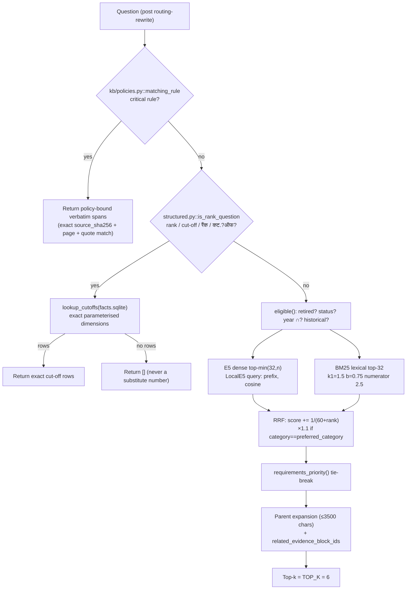
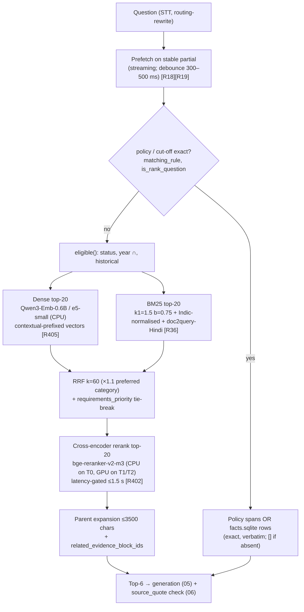

# 04 — Retrieval and Knowledge Base

Retrieval is already the cheapest stage of a turn: warm median **11.4 ms**, p95 **13.8 ms**,
under 0.3% of a ~18.7 s answered turn ([01](01_BASELINE_AND_CURRENT_ARCHITECTURE.md) §4).
So the goal here is **not** to make retrieval faster — it is to make it *more accurate and
more robust across Hindi / Hinglish / cross-lingual queries* so the expensive LLM calls in
[05](05_LLM_INFERENCE_AND_SERVING.md) and [06](06_VERIFICATION_AND_CACHING.md) have better
evidence and can be shortened or removed. The corpus is tiny (**222 vector chunks**,
[Measured-here, `IA/docs/KB_REBUILD_VALIDATION.md`]), so index memory and ANN speed are not
bottlenecks — a reranker or a bigger embedder costs latency, not RAM, and that trade is
usually worth it here. The one failing retrieval case today is `loan_repayment_hindi`
[Measured-here, same file], a cross-lingual recall miss, which points directly at the
upgrades below.

> Corpus-building (PDF→Markdown parsing, structure-aware chunking, contextual prefixes,
> reranking) is already specified in detail in
> [`code/knowledgebaseenhanced/Knowledge Base Building.md`](../../../code/knowledgebaseenhanced/Knowledge%20Base%20Building.md):
> Docling (MIT) as the primary converter, tagged lossless page TXT, LLM restructuring with
> mandatory number-fidelity checks, heading-path + contextual chunk prefixes, hybrid
> BM25+dense with RRF (k=60) and a `bge-reranker-v2-m3` reranker, A/B gated against the
> active release. This chapter does **not** duplicate that; it quantifies the *retrieval-time*
> levers (fusion, embeddings, quantization, rerankers, adaptive retrieval, prefetch) and
> scores each against the 117-case benchmark.
>
> **Update:** that proposal is reviewed critically in
> [14_KNOWLEDGE_BASE_METHODOLOGY_REVIEW.md](14_KNOWLEDGE_BASE_METHODOLOGY_REVIEW.md), and the
> recommended replacement ingestion pipeline is in
> [15_KNOWLEDGE_BASE_PIPELINE_V2.md](15_KNOWLEDGE_BASE_PIPELINE_V2.md). It covers parser
> choice, second-read verification and multi-granularity units.

## Recommendations by tier

| Tier | Do first | Then | Avoid |
|---|---|---|---|
| **CPU-only** | Keep e5-small + hybrid+RRF; fix Indic/HyDE tokenisation (R2); add `bge-reranker-v2-m3` top-6 only, latency-gated | Contextual prefixes (offline, free at query time) | LLM rerankers; HyDE on numeric queries |
| **T0 (RTX 4060 8 GB)** | Reranker `bge-reranker-v2-m3` on CPU over fused top-20→6 (R3); Indic tokeniser fix (R2) | Swap embedder to Qwen3-Embedding-0.6B or EmbeddingGemma-300M (R4); contextual prefixes (R1) | Loading reranker/embedder on GPU while the 9B is resident — VRAM contention (01 §4.3) |
| **T1 (16–24 GB)** | Reranker on GPU; Qwen3-Embedding-0.6B dense (R4) | Adaptive retrieval depth (R6); predictive prefetch (R7) | — |
| **T2 (40–80 GB)** | Everything on GPU, batched; Qwen3-Reranker-0.6B | Learned fusion weights; multi-vector (bge-m3) | — |

Effort/effect ranking is in [§12](#12-ranked-retrieval-upgrades). Measurement protocol and
pass criteria are in [§11](#11-how-to-measure) and
[12_EVALUATION_AND_BENCHMARKING.md](12_EVALUATION_AND_BENCHMARKING.md).

---

## 1. What retrieval does today (as built)

`IA/` = `code/Institute-voice-agent/institute-assistant/`.

Grounding facts confirmed in code:

- **TOP_K=6, RETRIEVAL_FETCH_K=32, RETRIEVAL_MAX_DISTANCE=1.5** — `IA/assistant/config.py`.
- **Chunking: KB_CHUNK_TOKENS=350, KB_OVERLAP_TOKENS=50**, header (title+period, ≤70 tok)
  prepended, `passage:`/`query:` E5 prefixes, 512-token embedding cap, table rows kept atomic —
  `IA/assistant/kb/releases.py::chunk_block`, `IA/assistant/kb/embeddings.py::LocalE5`.
  (The legacy `CHUNK_SIZE=1000` chars in config is the *old* `chroma_index`, not the active
  release — see 01 §6.)
- **Embedding model: `intfloat/multilingual-e5-small`** [R37], revision pinned, CPU, 4 threads —
  `config.py::KB_EMBEDDING_MODEL`, `LocalE5.__init__`.
- **Policy / cut-off exactness**: `kb/search.py::SearchEngine.search` returns policy spans or
  exact `facts.sqlite` rows *before* any fuzzy search, and returns `[]` rather than a
  cross-category substitute — `kb/structured.py::lookup_cutoffs`.
- **Verbatim quote check** downstream: `IA/assistant/evidence.py::source_quote` requires the
  normalised quote to be a substring of the source; strict for non-cut-off sources.

---

## 2. Reciprocal Rank Fusion and weighted/learned fusion

### What
Combine the dense (E5) and lexical (BM25) rankings into one by summing reciprocal ranks.

### Intuition
A chunk that is near the top of *either* list should rank highly; RRF is robust because it
ignores raw score scales (cosine distance vs BM25 score are not comparable).

### Maths
Current code (`search.py::SearchEngine.search`), with constant **k = 60**:

$$
\text{RRF}(d) = \sum_{\text{list } \ell \in \{\text{dense},\text{bm25}\}} \frac{1}{k + \text{rank}_\ell(d)}, \qquad k = 60
$$

then a **category bias** multiplier is applied before sorting:

$$
\text{score}(d) = \text{RRF}(d) \cdot \big(1.1 \text{ if } \text{category}(d) = \text{preferred\_category else } 1\big)
$$

with `requirements_priority(question, parent)` as a hard tie-break key (−1/0/1/2) applied
*before* the score. The original RRF paper [R41] uses the same $1/(k+r)$ form, k=60.

**Weighted fusion** generalises to per-list weights $w_\ell$ (e.g. up-weight BM25 for numeric
or name queries where lexical overlap matters). **Learned fusion** fits $w_\ell$ (or a small
logistic model over rank/score features) on labelled query–chunk pairs.

### Evidence
- RRF outperforms Condorcet and individual rank-learning on TREC in the original study [R41,
  Reported]. No *weighted* vs *plain* RRF number exists for this corpus — not measured here.
- The large k=60 flattens the contribution gap between ranks (1/61 vs 1/62 ≈ 0.03% apart),
  so on a 222-chunk corpus the category ×1.1 bias and `requirements_priority` often dominate
  the fusion. [Measured-here, by reading `search.py`.]

### Where it fits
`IA/assistant/kb/search.py::SearchEngine.search` (the `candidates` / `ranked` block).
Legacy path mirrors it in `IA/assistant/retrieval.py::retrieve`.

### How to implement
Weighted RRF is a one-line change (multiply the per-list increment by $w_\ell$). Learned
fusion needs the 117 cases (plus harder ones) as training labels; fit a logistic regression
on `[dense_rank, bm25_rank, same_category, has_year_match]`. No new dependency.

### Expected effect
- Weighted RRF: **[Estimated]** small, +0–2 recall@6 cases, mainly on numeric/name queries;
  risk of hurting others. Not tier-dependent (CPU-cheap).
- Learned fusion: **[Estimated]** low ceiling on 222 chunks and 93 answerable cases — too
  little data to learn robustly; defer until the corpus and benchmark grow.

### Risks / interactions
Changing fusion must not reorder the **policy** and **cut-off** paths, which run *before*
fusion and must stay exact (`matching_rule`, `lookup_cutoffs`). Do not let a learned weight
pull an undated chunk above a year-matched one — `eligible()` already filters, but fusion
weights could re-introduce the bias.

### How to measure
recall@6 / MRR on the 117 cases split by language; pass = **≥ 0.9892** (current) and the
exact-cut-off 42/42 unchanged ([§11](#11-how-to-measure)).

---

## 3. BM25 maths and Indic tokenisation

### What
The lexical half of hybrid search, implemented inline (Okapi BM25).

### Maths (exactly as coded)
Per term $t$ in query, chunk length $|d|$, average length $\bar{L}$:

$$
\text{idf}(t) = \ln\!\Big(1 + \frac{N - n_t + 0.5}{n_t + 0.5}\Big), \qquad
\text{score} = \sum_{t} \text{idf}(t)\cdot \frac{f_{t,d}\cdot 2.5}{f_{t,d} + 1.5\,(0.25 + 0.75\,|d|/\bar{L})}
$$

Matching standard Okapi $\frac{f(k_1+1)}{f + k_1(1-b+b|d|/\bar L)}$ gives **k₁ = 1.5, b = 0.75**,
and the numerator factor 2.5 = k₁+1. (The presentation slides mislabel this as "k1 = 2.5";
the code constant 2.5 is k₁+1, so **k₁ = 1.5** — see 01 §6.) [Measured-here, `search.py`.]

### Intuition
BM25 rewards rare query terms (idf) and saturates term frequency, so exact tokens — fee
amounts, "JoSAA", "DSAI", "छात्रावास" — get matched even when the dense model misses them.

### The Indic tokenisation problem
`tokens()` in `search.py` uses `re.findall(r"[^\W_]+(?:[\u0900-\u097f]+)?", text.casefold())`.
Two concrete issues for Hindi/Hinglish:

1. **No stemming/normalisation of Devanagari inflections.** "फीस"/"फ़ीस", मात्रा variants, and
   English transliterations ("fees" vs "फीस" vs "fis") are different BM25 terms, so a Hinglish
   query rarely lexically overlaps a Devanagari chunk. This is the likely mechanism behind the
   failing `loan_repayment_hindi` case.
2. **`casefold()` does nothing for Devanagari** and `len(w) > 1` drops single-syllable Hindi
   tokens. The regex keeps a trailing Devanagari run but still splits on ZWJ/nuktas
   inconsistently.

[Measured-here by reading `search.py::tokens`; the aliasing hack for "vidya laxmi" in
`SearchEngine.search` is an explicit, source-grounded patch for exactly this gap.]

### Where it fits
`IA/assistant/kb/search.py::tokens`, used by `SearchEngine.__init__` (index) and `.search`
(query). Legacy `retrieval.py::_tokens` uses a *weaker* `\w+` regex that drops Devanagari
entirely — only relevant to the deprecated index.

### How to implement
- Add a normalisation pass: `indic-nlp-library` (indicnlp, Apache-2.0) `normalize` +
  transliteration to a common script for the *lexical* channel only (never for displayed
  evidence). Or fold aliases via the hand-editable `aliases.yaml` already proposed in the KB
  building doc §5.6.
- Keep the contextual prefix (R1) and hypothetical-questions (doc2query) text in the BM25
  field, including at least one Hindi question per chunk — this is the cheapest cross-lingual
  lexical bridge.

### Expected effect
**[Estimated]** fixes the single failing Hindi case and reduces Hinglish lexical misses;
+1–3 recall@6 cases on Hindi/Hinglish splits. CPU-cheap, tier-independent.

### Risks / interactions
Normalisation must be identical at index and query time (same risk the code already guards
for E5 prefixes). Do not normalise numbers/amounts — the `facts.sqlite` exact path and
`source_quote` verbatim check depend on exact digit strings.

### How to measure
recall@6 and MRR on the **Hindi** and **Hinglish** splits specifically; pass = fix
`loan_repayment_hindi` without regressing English.

---

## 4. Contextual retrieval vs late chunking (and the comparison)

### What
Two ways to stop a 350-token chunk from losing its document context before embedding.

- **Contextual Retrieval** [R405/R39]: an LLM writes a 50–100 token prefix situating each
  chunk ("This is from the IIIT-NR B.Tech 2026 brochure fee section …"); embed and BM25-index
  `prefix + chunk`. Offline, cached.
- **Late Chunking** [R38]: run the *whole document* through a long-context embedding model
  once, then **mean-pool token embeddings over each chunk's token span** — so every chunk
  embedding already carries full-document context, with no LLM and no extra storage.

### Maths
Late chunking: for a document tokenised to hidden states $h_1,\dots,h_T$ from a single
long-context forward pass, chunk $c$ spanning tokens $[a_c, b_c]$ gets

$$
e_c = \frac{1}{b_c - a_c + 1}\sum_{i=a_c}^{b_c} h_i
$$

i.e. mean pooling applied *after* the transformer sees the whole document, versus the normal
pipeline that pools over an isolated chunk's own forward pass. Contextual retrieval instead
changes the *input text* ($\text{chunk}' = \text{LLM-context} \Vert \text{chunk}$) and embeds
normally.

### Evidence
- Contextual Retrieval [R405, Reported, Anthropic internal eval]: top-20 chunk failure rate
  **5.7% → 3.7%** (contextual embeddings, −35%), **→ 2.9%** (+contextual BM25, −49%), **→ 1.9%**
  (+reranking, −67%). Conditions: Anthropic's mixed corpora, Claude-generated prefixes,
  Voyage/Gemini embeddings. [Verified: fetched anthropic.com + cookbook.]
- Late Chunking [R38, Reported]: "superior results across various retrieval tasks … works
  without additional training", applied to long-context models (jina-embeddings-v2/v3).
  [Verified: fetched arxiv abstract; the abstract states improvement but I did not extract a
  single headline % — treat as directional.]
- Comparison [R40]: evaluates both advanced chunking strategies; neither dominates universally —
  [Reported, snippet only; not fetched in full]. Flagged as unverified detail below.

### Where it fits
Both are *build-time*, feeding `IA/assistant/kb/releases.py::chunk_block` /
`embeddings.py::LocalE5`. Contextual prefix is already specced in the KB building doc §5.6/§7.3.
**Late chunking requires a long-context embedder** (e5-small's `max_seq_length=512` is too
short to pool a whole multi-page document), so it is coupled to the embedder swap in §5.

### How to implement
- Contextual prefix: offline LLM pass (local `qwen3.5:9b`, temperature 0), cache by
  `sha256(chunk+prompt+model)`. **Zero query-time cost.** Already designed.
- Late chunking: use `bge-m3` [R36] or `jina-embeddings-v3` [R407] (long context); the Jina
  `late-chunking` repo [R38] (Apache-2.0) has reference code. Note **jina-v3 is CC-BY-NC ⚠**.

### Expected effect
- Contextual prefix: **[Estimated from R405]** on our corpus the gain is likely smaller than
  Anthropic's −49% because our chunks already carry a heading-path header and we are near the
  recall ceiling (0.9892). Expect it to help mostly the *hard* new cases (cross-page sections,
  FAQ, Hindi). Tier-independent at query time.
- Late chunking: **[Estimated]** comparable to contextual prefix on English, cheaper to build
  (no LLM), but needs the long-context embedder; benefit on 350-token chunks of short brochures
  is modest.

### Risks / interactions
The prefix/pooled context is **retrieval-only** — it must never become displayed evidence or
the `source_quote` verbatim check will fail (the prefix text is not in the source). The KB
doc already enforces "answers quote the original section text". Late chunking changes vectors,
so it forces an immutable rebuild + A/B gate (`releases.py`, `evaluation.py`).

### How to measure
recall@6 / nDCG@6 on the 117 cases + new cross-page/FAQ/Hindi cases; pass = **≥ current and
better on the new-capability subset** (mirrors the KB-doc A/B gate).

---

## 5. Embedding model comparison (English / Hindi / Hinglish / cross-lingual)

### What
Candidates to replace `multilingual-e5-small` (current, 118M, 384-dim, 512 ctx).

All numbers below are **MTEB/MMTEB multilingual mean(task)** unless noted. These are *general*
benchmarks — **none measures IIIT-NR Hindi/Hinglish retrieval**; use them to rank candidates,
then A/B on the 117 cases. CPU latency is **[Estimated]** from parameter count (e5-small is the
only one measured here at 11.4 ms warm *retrieval incl. ANN*, not embed-only).

| Model | Params | Dim (MRL) | Ctx | MTEB-Multi mean(task) | Licence | Checked |
|---|---:|---|---:|---|---|---|
| multilingual-e5-small (current) [R37] | 118M | 384 | 512 | — (large-instruct 0.6B = 63.22) | MIT | fetched (R34 card) |
| **Qwen3-Embedding-0.6B** [R400] | 600M | 1024 (32–1024) | 32k | **64.33** | Apache-2.0 | fetched |
| **EmbeddingGemma-300M** [R401] | 308M | 768 (768/512/256/128) | 2048 | **61.15** (768d), 58.23 (128d) | Gemma Terms ⚠ | fetched |
| bge-m3 [R36] | 568M | 1024 + sparse + multivec | 8192 | 59.56 (MMTEB, per R408) | MIT | snippet (R408) |
| Snowflake arctic-embed-l-v2.0 [R406] | ~568M | 1024 (MRL) | 8192 | multilingual, retrieval-focused (no single mean fetched) | Apache-2.0 | snippet |
| jina-embeddings-v3 [R407] | 570M | 1024 (→32) | 8192 | multilingual (no mean fetched) | CC-BY-NC-4.0 ⚠ | snippet |
| Granite-embedding-278M-multi [R411] | 278M | 768 | 512 | multilingual (no mean fetched) | Apache-2.0 | snippet |

Key verified facts: Qwen3-0.6B beats bge-m3 on MMTEB **64.33 vs 59.56 at equal-ish size**
[R408, Reported — Verdict from a third-party blog; the official Qwen3 blog states 64.33
[R400 fetched], the bge-m3 59.56 figure is from R408 only]. EmbeddingGemma MRL lets you drop
to 128-dim with only 61.15→58.23 loss [R401, fetched].

### Intuition
A stronger multilingual encoder maps a Hindi query and its English source chunk closer in
one space — the core fix for cross-lingual recall (CLIR, §8). Bigger dim/ctx also helps late
chunking (§4).

### Where it fits
`IA/assistant/kb/embeddings.py::LocalE5` (the `SentenceTransformer` load + `passage:`/`query:`
prefixing) and the pinned revision in `config.py`. **Prefixes differ per model** — Qwen3 uses
an `Instruct:` query template; EmbeddingGemma uses `task: search result | query:` /
`title: none | text:`; e5 uses `query:`/`passage:`. The wrapper must switch prefixing when the
model changes.

### How to implement
1. Build a parallel immutable release with the new embedder (`kb_pipeline.py build`), keep
   e5 release active.
2. Run `IA/assistant/kb/evaluation.py::evaluate_release` on both; A/B per language.
3. Activate only if recall@6 ≥ 0.9892 and exact 42/42 hold.
4. On T0, run the embedder on **CPU** (it must not share the 8 GB with the resident 9B — 01
   §4.3); embed-only latency for 600M on CPU is **[Estimated]** ~30–80 ms/query, still << the
   LLM calls.

### Expected effect
| Tier | Expected |
|---|---|
| CPU-only | **[Estimated]** EmbeddingGemma-300M@128d or Granite-278M: similar latency to e5-small, better cross-lingual recall; +1–3 Hindi cases |
| T0 | **[Estimated]** Qwen3-Embedding-0.6B best quality; CPU embed adds ~tens of ms, negligible vs 18 s turn |
| T1/T2 | **[Estimated]** Qwen3-0.6B on GPU, embed-only sub-ms; enables bge-m3 multi-vector |

### Risks / interactions
- **EmbeddingGemma Gemma Terms ⚠** and **jina-v3 CC-BY-NC ⚠** — review before any commercial
  deployment; prefer Qwen3-0.6B / bge-m3 / arctic (all permissive).
- Any swap is a full rebuild + A/B (immutable releases, `releases.py`). The `facts.sqlite`
  exact path and `source_quote` are embedder-independent, so cut-off exactness is unaffected.
- A near-ceiling benchmark (0.9892) means headline gains will be small; the real win is on the
  *unmeasured* Hindi/Hinglish/cross-lingual tail, so expand the benchmark first ([§11](#11-how-to-measure)).

---

## 6. Matryoshka truncation and int8 / binary quantization

### What
Shrink each embedding vector: MRL truncation (keep the first $m$ dims) [R409], or quantize
floats to int8 / 1-bit, with a float **rescoring** pass over a shortlist.

### Maths
- MRL: use $e_{1:m}$ (renormalised). Memory scales $m/d$.
- Binary: $b_i = \mathbb{1}[e_i > 0]$; Hamming distance for search; memory **32×** smaller
  (1 bit vs 32-bit float). int8: scale to 8-bit; memory **4×** smaller.
- Rescoring: retrieve top-$R$ by the cheap metric, then re-rank those $R$ with full-precision
  cosine. Recall is preserved if the true top-$k$ ⊆ the binary top-$R$ (R ≫ k).

### Evidence
- EmbeddingGemma MRL [R401, fetched]: 768d **61.15** → 128d **58.23** multilingual (−2.9 abs
  for 6× smaller). Qwen3-0.6B MRL 32–1024 [R400, fetched].
- Binary/int8 + rescoring [R412, Reported, blog]: ~**32×**/**4×** memory cut with ">90% of
  performance retained" when a rescoring step is used. [Verified: snippet; headline numbers
  from HF blog, not re-measured.]

### Honest note for this project
**The corpus is 222 chunks** [Measured-here]. At 384-dim float32 that is
$222 \times 384 \times 4 = 341$ KB; even at 1024-dim it is ~0.9 MB. **Index memory is not a
bottleneck and never will be at this scale.** Quantization/MRL buys *nothing* on memory here.
The only reasons to touch it: (a) tiny latency reduction (irrelevant — retrieval is 11 ms),
or (b) if a future embedder is only shipped quantized. **Recommendation: do not quantize; it
can only lose quality for no benefit at 222 chunks.** State this plainly rather than cargo-cult
the technique.

### Where it fits
`embeddings.py::LocalE5.embed_*` (truncate before normalise); Chroma stores float vectors.

### Expected effect
**[Measured-here reasoning]** memory: negligible (sub-MB either way). Quality: MRL truncation
*costs* up to −2.9 MTEB abs [R401]. Net: **avoid** at current scale, all tiers.

### Risks / interactions
Truncation changes vectors → rebuild + A/B. No interaction with grounding (vectors never
appear in evidence).

### How to measure
If ever needed: recall@6 at full dim vs truncated/quantized; pass = within −1 case.

---

## 7. Cross-encoder / LLM rerankers after fusion

### What
Re-score the fused top-N chunks with a model that reads **(query, chunk) jointly**, then keep
the best $k$. This is the single highest-leverage accuracy upgrade for a near-ceiling dense
system, because it fixes ordering errors fusion cannot.

### Intuition
Bi-encoders compress query and chunk independently; a cross-encoder attends across both, so
it catches "this chunk mentions the fee but for the *wrong* category/year". Inserted *after*
`eligible()` filtering and RRF, before parent expansion.

### Maths
For fused shortlist $C$ (|C| = N, e.g. 20), score $s(q,c) = \text{CE}(q, c)$ and take
$\arg\text{top-}k$. Cost is $N$ forward passes of a ~0.3–0.6B encoder — the dominant new
latency, linear in N.

### Candidates
| Reranker | Params | Multilingual | Licence | Notes |
|---|---:|---|---|---|
| **bge-reranker-v2-m3** [R402] | 0.6B (XLM-R) | yes | **Apache-2.0** | "lightweight, fast inference"; reranks bge-m3 top-100 on MIRACL. Best default. [fetched] |
| Qwen3-Reranker-0.6B [R404] | 0.6B | yes, instruction-aware | **Apache-2.0** | 32k ctx; pairs with Qwen3-Embedding. [snippet] |
| jina-reranker-v2-base-multilingual [R403] | 278M | 100+ langs | **CC-BY-NC-4.0 ⚠** | 6× faster than v1, 1024 ctx; non-commercial. [fetched] |
| mxbai-rerank-base-v2 [R410] | ~0.5B | yes | Apache-2.0 | permissive alt. [snippet] |

### Evidence
Reranking adds the final step in Anthropic's −67% (vs −49% without) failure-rate reduction
[R405, Reported]. The KB-building doc targets `bge-reranker-v2-m3`, CPU, ~20 pairs,
latency-gated (skip if > 1.5 s). No reranker latency measured here.

### Where it fits
`IA/assistant/kb/search.py::SearchEngine.search`, immediately after the `ranked = sorted(...)`
fusion step and **before** parent expansion / dedupe. Fetch N=20 (raise `RETRIEVAL_FETCH_K`
from 32 as needed), rerank, keep TOP_K=6.

### How to implement
`CrossEncoder("BAAI/bge-reranker-v2-m3")` (sentence-transformers). Score the 20 fused
candidates' *chunk text* (not parent) against the query; reorder; then expand parents. Gate on
a wall-clock budget and fall back to the fusion order on timeout.

### Expected effect
| Tier | Latency (N≈20 pairs) | Note |
|---|---|---|
| CPU-only / T0-CPU | **[Estimated]** 0.3–1.0 s for 20 short pairs on the 24-thread CPU | Latency-gate; still << 18 s turn, but adds to the one stage that was ~0 |
| T0-GPU | **avoid loading on GPU** while 9B resident — only ~5.4 GB free, VRAM contention and model eviction (01 §4.3). Run reranker on CPU |
| T1 | **[Estimated]** 20–60 ms on GPU | free |
| T2 | **[Estimated]** <20 ms batched | free |

Accuracy: **[Estimated from R405]** this is where the remaining recall/precision comes from;
expect the biggest *answer-quality* gain of any item here, especially on ambiguous
Hindi/Hinglish queries, even if recall@6 is already high (reranking improves *ordering* →
better top-1–3 evidence for the LLM → shorter, more faithful answers).

### Risks / interactions
- **T0 VRAM**: do not co-locate with the 9B. CPU-only reranking on T0.
- Reranker reorders but must **not bypass** the policy/cut-off exact paths (they return before
  fusion) nor change the `source_quote` verbatim requirement.
- Latency is now > 0 on the cheapest stage; keep the ≤1.5 s gate so a slow rerank cannot blow
  the turn budget ([02](02_LATENCY_COST_MODEL_AND_METRICS.md) §7).

### How to measure
MRR / nDCG@6 and recall@3 (ordering-sensitive) on the 117 cases + hard cases, per language;
pass = MRR ↑ and no exact-cut-off regression. Report reranker wall-clock p50/p95.

---

## 8. Cross-lingual retrieval (CLIR) for Hindi / Chhattisgarhi queries over English docs

### What
Answer a Hindi or Chhattisgarhi *spoken* query against an English (and Hindi) corpus without
first translating the query.

### Intuition
The corpus is mostly English brochures; many user queries arrive in Hindi/Hinglish (STT output)
or Chhattisgarhi. A multilingual embedder places them in one space; a multilingual reranker
confirms. The one failing case today (`loan_repayment_hindi`) is exactly this gap.

### Where it fits
Embedder (§5) + reranker (§7) + Indic tokeniser (§3) together are the CLIR stack. The existing
`SearchEngine.search` *routing rewrite* and the hand-coded Hindi/English alias injection
("education loan repayment … शिक्षा ऋण चुकौती …") are early, source-grounded CLIR patches
[Measured-here, `search.py`].

### How to implement
Prefer a strong multilingual dense model (Qwen3-0.6B / bge-m3) + `bge-reranker-v2-m3`, plus the
doc2query Hindi questions in the BM25 field (KB doc §5.6). **Chhattisgarhi** is not covered by
any of these embedders' training data (MMS handles its ASR per 01, but no embedder claims cg) —
so route cg queries through the Hindi path and flag as experimental, consistent with the README
("Chhattisgarhi remains experimental").

### Expected effect
**[Estimated]** fixes `loan_repayment_hindi` and improves the Hindi/Hinglish splits; cg remains
best-effort. Tier gains follow §5/§7.

### Risks / interactions
Do **not** auto-translate the query with the LLM before retrieval if the query contains numbers
(see §9 HyDE risk). Keep exact digit strings for `facts.sqlite`.

### How to measure
Build cg and more Hindi cases; recall@6 / MRR on the cg + Hindi split; pass = `loan_repayment_hindi`
passes.

---

## 9. Adaptive retrieval and query rewriting

### 9a. Adaptive retrieval (skip / single / multi-step) — [R33]

**What.** Classify query complexity and spend retrieval effort accordingly: no retrieval for
chit-chat, single-shot for simple factoids, iterative for multi-hop.

**Intuition.** The pipeline already *partly* does this: `classify_intent_node` regex-skips
retrieval for greetings; `is_rank_question` routes to exact SQL; policies short-circuit. R33
formalises a learned complexity classifier.

**Evidence.** Adaptive-RAG [R33, Reported] improves the efficiency/accuracy trade-off on
multi-hop QA; conditions are open-domain English QA, not a 222-chunk institute corpus.
[snippet only.]

**Where it fits.** Sits beside `nodes.py::classify_intent_node` / the JEV router and
`SearchEngine.search`'s rank/policy branches.

**Expected effect.** **[Estimated]** low on this corpus — most questions are single-hop
factoids already handled; the win is latency (skip retrieval on more turns), not recall.
Multi-step would mostly add latency. Defer unless multi-hop cases appear.

**Risks.** A mis-classified "skip" that should have retrieved → wrong refusal. Keep abstention
behaviour.

### 9b. Query rewriting: HyDE vs the existing routing rewrite — [R413]

**What.** HyDE generates a *hypothetical answer* with the LLM, embeds it, and retrieves with
that vector instead of the raw query.

**The hard risk here.** HyDE's hypothetical answer **fabricates concrete numbers** (fees,
cut-off ranks, dates). Even though only the *embedding* of the fake answer is used (not shown),
a fabricated "₹1,45,000" biases retrieval toward the wrong fee chunk, and worse, if the fake
number leaks into any logged/cached rewrite it collides with the grounding guarantees:
`facts.sqlite` exact cut-offs and `evidence.py::source_quote` exist precisely to prevent
invented numbers. **Do not use HyDE on numeric/cut-off/fee/date queries.** [Reasoning grounded
in R413 behaviour + the code's exactness contracts.]

**The existing rewrite is safer**: the routing LLM rewrite + deterministic
`history.py::exact_rank_followup` + the source-grounded alias injection in `search.py` rewrite
*toward known source terms*, not toward invented facts.

**Expected effect.** HyDE: **[Estimated]** possible small recall gain on *vague prose* queries,
net-negative on this numeric-heavy institute corpus. **Avoid.** Keep the existing rewrite.

**How to measure.** If trialled, HyDE must be gated off for any query matching
`is_rank_question` or containing a number; measure recall@6 on *non-numeric* Hindi prose cases
only.

---

## 10. Predictive prefetch and the fast-talker cache

### What
Start retrieval on **partial** STT transcripts, before the user finishes, and cache the result
keyed to the stabilising transcript — so when the turn ends the evidence is already in hand.

### Intuition
Retrieval is 11 ms, so prefetch saves little *on retrieval*. The value is (a) warming the
**retrieval cache** (`cache.py::RagCache`) and (b) in a streaming future, overlapping retrieval
+ reranking with the user's final words so the first LLM prefill can start immediately
([02](02_LATENCY_COST_MODEL_AND_METRICS.md) §1.1). For a reranker (§7) that now costs
0.3–1.0 s on CPU, prefetching *is* worth it.

### Evidence
- VoiceAgentRAG [R19, Reported]: dual-agent design to hide RAG latency behind speech. [snippet]
- Stream RAG [R17] / [R18, Reported]: streaming tool/RAG use with tool-intent stabilization —
  warns that acting on *unstable* partial transcripts causes wrong retrievals. [snippet]

### Where it fits
Requires the streaming STT service (`code/STT/stt-service`, exists but **not wired into
Demo 2** — 01 O18) to emit partials; a debounced hook calls `retrieve()` + reranker and writes
`RagCache`. Keyed on normalised partial transcript.

### How to implement
Debounce: only prefetch when the partial transcript's tail has been stable for ~300–500 ms
(the "stabilization" lesson of [R18]). On final transcript, reuse the cached result if the key
matches; else re-run. **Release-bound cache keys** (`cache.py` TTL 1 h, exact key) must include
the active release id so a rebuild invalidates prefetched entries.

### Expected effect
**[Estimated]** on T0 today (no streaming): 0. Once streaming STT + a reranker are in: hides
the 0.3–1.0 s rerank behind end-of-turn, net perceived saving ~0.3–1.0 s. Larger on tiers with
heavier rerankers.

### Risks / interactions
- **Unstable partials → wrong prefetch** [R18]: debounce and never *answer* on a partial, only
  pre-warm.
- **Cache correctness**: `RagCache` is release-bound and exact-key; a partial that differs from
  the final by one token misses — acceptable (just recompute). Never let a prefetched result
  bypass `eligible()` year filters at answer time.
- No interaction with `facts.sqlite`/`source_quote` (prefetch only pre-runs the same search).

### How to measure
End-to-end perceived latency with/without prefetch on a streaming harness
([12](12_EVALUATION_AND_BENCHMARKING.md)); cache hit-rate on partial→final; pass = no change in
answer correctness, perceived latency ↓.

---

## 11. How to measure

**Dataset.** `IA/docs/kb_evaluation_cases.json` — **117 cases**, perfectly balanced
**39 English / 39 Hindi / 39 Hinglish**; **93 answerable, 12 no_cutoff, 12 insufficient**
[Measured-here]. Harness: `IA/assistant/kb/evaluation.py::evaluate_release`.

**Metrics the code computes today** [Measured-here, `evaluation.py`]:
- **Supporting-evidence recall@6** = fraction of answerable cases whose expected block is in the
  retrieved blocks *and* all `required_terms` appear. Current = **0.9892** (release
  20260922…) [R-internal `KB_REBUILD_VALIDATION.md`].
- **Exact-rank pass** on `cutoff_filters` + `no_cutoff` cases: current **42/42** must stay 100%.
- Warm retrieval median/p95 latency: **0.0114 / 0.0138 s**.

**Metrics to add (not computed yet)** — specify in
[12_EVALUATION_AND_BENCHMARKING.md](12_EVALUATION_AND_BENCHMARKING.md):
- **MRR** and **nDCG@6** (ordering — the metrics a reranker moves; recall@6 is already saturated).
- **Per-language split** of all metrics (English/Hindi/Hinglish) — the harness aggregates only;
  split by the `language` field to expose the Hindi/Hinglish gap.
- **recall@3** (ordering-sensitive, what the LLM actually sees first).
- Reranker/embedder **wall-clock p50/p95** added to the latency row.

**Pass criteria for any change in this chapter:**
1. recall@6 **≥ 0.9892** overall and **non-decreasing per language**;
2. exact-rank **42/42** unchanged;
3. MRR / nDCG@6 **≥ baseline** (strictly ↑ for the reranker);
4. `loan_repayment_hindi` **passes** (for §3/§5/§8 changes);
5. no new `source_quote` verbatim failures, `facts.sqlite` exactness intact;
6. added stage latency within the [02](02_LATENCY_COST_MODEL_AND_METRICS.md) §7 budget
   (retrieval+rerank ≤ 200 ms T1/T2; CPU reranker latency-gated ≤ 1.5 s).

---

## 12. Ranked retrieval upgrades

| Rank | Upgrade | Effort | Expected effect (label) | Tier |
|---|---|---|---|---|
| 1 | **Cross-encoder reranker** `bge-reranker-v2-m3` after fusion, top-20→6 (§7) | M | Biggest ordering/answer-quality gain; MRR↑, better top-1–3 evidence **[Estimated from R405]** | T0-CPU, T1, T2 |
| 2 | **Indic/Hinglish tokeniser + aliases** for BM25 (§3) | S | Fixes `loan_repayment_hindi`; +1–3 Hindi/Hinglish cases **[Estimated]** | all |
| 3 | **Per-language metrics + MRR/nDCG + harder cases** (§11) | S | No model gain, but unblocks *measuring* 1–2,4–5; prerequisite | all |
| 4 | **Contextual chunk prefixes** (offline, §4) | M | Helps hard cross-page/FAQ/Hindi cases; zero query-time cost **[Estimated from R405]** | all |
| 5 | **Embedder swap → Qwen3-Embedding-0.6B** (permissive) or EmbeddingGemma-300M ⚠ (§5) | M | Better cross-lingual recall; near-ceiling so small on English **[Estimated]** | T0 (CPU), T1, T2 |
| 6 | **Predictive prefetch + reranker warm** on streaming partials (§10) | L (needs streaming STT wired) | Hides 0.3–1.0 s rerank behind end-of-turn **[Estimated]** | T1, T2 (T0 after streaming) |
| 7 | **Weighted/learned fusion** (§2) | S / M | Marginal on 222 chunks; defer learned until corpus grows **[Estimated]** | all |
| 8 | **Adaptive retrieval depth** [R33] (§9a) | M | Latency only; low on single-hop corpus **[Estimated]** | all |
| — | **HyDE query rewrite** (§9b) | — | **Avoid** on numeric corpus (fabricates numbers) | — |
| — | **int8/binary/MRL quantization** (§6) | — | **Avoid** at 222 chunks (no memory benefit, costs quality) | — |

### Target retrieval path

---

## What we could not verify

- **Weighted/learned-fusion gain on this corpus**: no measurement exists; all §2 numbers
  are [Estimated]. Learned fusion is likely under-powered at 93 answerable cases.
- **Reranker / embedder CPU latency on this laptop**: not measured here (no installs allowed);
  the 0.3–1.0 s (CPU, 20 pairs) and ~30–80 ms embed figures are [Estimated] from parameter
  count, to be replaced by a read-only microbenchmark.
- **Late Chunking [R38] headline numbers**: the arxiv abstract was fetched and confirms the
  mean-pool-after-full-pass mechanism, but I did not extract a single quantified improvement %;
  treat as directional. **[R40] comparison** read via snippet only — its claim that neither
  strategy universally dominates is unverified in detail.
- **bge-m3 59.56 MMTEB** and **arctic/jina-v3/granite multilingual means**: taken from a
  third-party blog [R408, snippet] / model pages without a fetched MTEB table for each; Qwen3
  64.33 and EmbeddingGemma 61.15/58.23 and bge-reranker-v2-m3 size/licence **are** fetched and
  verified.
- **Qwen3-Reranker-0.6B** and **mxbai-rerank-v2** facts: snippet-level only (card not fetched).
- **MTEB does not measure IIIT-NR Hindi/Hinglish/cg retrieval**: every embedder/reranker
  ranking is a proxy; the real decision needs the A/B on an *expanded* 117-case benchmark,
  which does not exist yet.
- **Chhattisgarhi embedding quality**: no embedder here claims cg training data; the cg path is
  unverified and flagged experimental.
