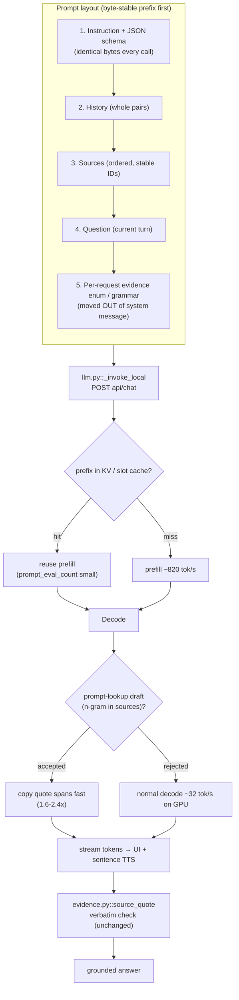

# 05 — LLM Inference and Serving

The LLM is the bottleneck: on T0 the three 9B calls account for ≈18.4 s of an 18.7 s
answered turn ([01 §4.1](01_BASELINE_AND_CURRENT_ARCHITECTURE.md)). This chapter targets
four levers, in priority order: (1) **fit the model fully in VRAM** so decode roughly
doubles; (2) **make the prompt prefix byte-stable** so prefill is reused; (3) **cut
structured-output cost** (the 300-span quote enum made decode 2.6× slower
[Measured-here, 01 §4.3]); (4) **stream output and remove the per-call `/api/tags`**.
Speculative decoding by **prompt-lookup** (answers copy quotes verbatim from sources) is the
highest-value acceleration here. All changes map to `IA/assistant/llm.py` and `.env`; none
require editing code to be *evaluated* — Phase 0 is config-only.

> `IA/` = `code/Institute-voice-agent/institute-assistant/`. Model = Ollama `qwen3.5:9b`
> Q4_K_M unless stated. Baseline numbers are [Measured-here] from
> [01](01_BASELINE_AND_CURRENT_ARCHITECTURE.md); the cost model is
> [02](02_LATENCY_COST_MODEL_AND_METRICS.md).

## Recommendations by tier

| Priority | Change | T0 (RTX 4060 8 GB) | T1 (16–24 GB) | T2 (40–80 GB) | Expected effect |
|---|---|---|---|---|---|
| 1 | Free desktop VRAM → model fully on GPU | iGPU display / PRIME offload | native | native | decode ~17.7 → ~32 tok/s **[Estimated]** (≈1.8×) |
| 2 | Byte-stable static prefix (schema+instruction first, enum last) | yes | yes | yes | prefill reuse 111–138 ms vs 1120 ms cold **[Measured-here]** on repeats |
| 3 | Prompt-lookup speculative decoding (n-gram from prompt) | `n_draft` 10, `ngram` 3 | yes | yes (or MTP/EAGLE-3) | 1.6–2.4× decode on quote-heavy answers **[Reported R500][R44]** |
| 4 | Replace quote **string enum** with source_id+span-index integer | yes | yes | yes | removes the 2.6× grammar penalty **[Measured-here]** |
| 5 | Remove per-call `/api/tags`; raise `OLLAMA_KEEP_ALIVE` | `keep_alive=-1` on kiosk | same | same | avoids 8.3 s cold reload + one HTTP RTT/call **[Measured-here]** |
| 6 | Stream tokens (`stream:true`) to UI + sentence TTS; cut `num_predict` | yes | yes | yes | first speakable sentence ≈1.4 s vs whole JSON **[Estimated, 02 §1.1]** |
| 7 | Stage model cascade (small router/drafter, 9B only to answer) | 1.7B/4B router | 4B drafter | batched | routing 3.8 s → <0.3 s **[Estimated]**; see [09](09_DISTILLATION_AND_FINE_TUNING.md) |
| 8 | Serving engine upgrade | keep Ollama/llama.cpp | llama.cpp / vLLM | vLLM / SGLang | batching + prefix cache; see §9 |

Grounding is non-negotiable: every acceleration must keep the verbatim quote check
(`IA/assistant/evidence.py::source_quote`), the release-bound draft cache
(`IA/assistant/cache.py::RagCache`) and the exact SQL cutoffs (`facts.sqlite`) intact
([06](06_VERIFICATION_AND_CACHING.md)). Pass criteria are in
[12](12_EVALUATION_AND_BENCHMARKING.md).

## Target call path

## Phase-0 checklist (zero code, zero config edits — read-only measurements)

These are measurements, not changes. They do not install, pull models, edit config or
restart the service beyond what you already run. Run them to confirm the planning numbers
before writing any code. Results feed [12](12_EVALUATION_AND_BENCHMARKING.md).

| # | Question | Command (read-only) | What to record |
|---|---|---|---|
| 0.1 | How much VRAM is free before load? | `nvidia-smi --query-gpu=memory.used,memory.total --format=csv` | desktop baseline (expect ≈2737 MiB used **[Measured-here]**) |
| 0.2 | CPU/GPU split of the resident model | `ollama ps` | `%` CPU/GPU, context, size (expect 6.3 GB, 45–55 % GPU) |
| 0.3 | Cold load time | `ollama stop qwen3.5:9b; time ollama run qwen3.5:9b ""` *(stop reloads; counts as a measurement you already can do)* | load seconds (expect ≈8.3 s) |
| 0.4 | Prefill vs decode split on real traffic | read `prompt_eval_count/_duration`, `eval_count/_duration` already captured by `operations.py::record_attempt` | tok/s per phase |
| 0.5 | Grammar penalty, this model | time one `api/chat` with `format` = full `GroundedAnswer` schema vs no `format`, same prompt | ms/token ratio (expect ≈2.6× **[Measured-here]**) |
| 0.6 | Prefix reuse window | send identical prompt twice, then change only the user line | ms second call vs first (expect 111–138 ms vs 1120 ms) |
| 0.7 | Fully-on-GPU decode | *(T1/T2 only, or after freeing VRAM)* `ollama run` then `--verbose` tok/s | tok/s (expect ≈32 on 4060) |

`ollama stop`/`run` only reload a model you already control; nothing in the repo changes.
If you cannot free VRAM without altering the desktop session, skip 0.7 and treat ≈32 tok/s
as [Estimated] (derivation in [02 §2.1](02_LATENCY_COST_MODEL_AND_METRICS.md)).

---

## A. Making the model fit on T0

### A.1 Free the desktop's VRAM (highest leverage, zero model change)

**What.** About 2737 MiB of the 8188 MiB is already taken by the Linux desktop before the
model loads [Measured-here, 01 §4.3], leaving ≈5.4 GB free for a 6.3 GB model, which is why
Ollama offloads 45–55 % to CPU. Run the display on the Intel iGPU (PRIME render offload) or a
headless session so almost all 8 GB is free for weights.

**Intuition.** Decode is memory-bound ([02 §2.1](02_LATENCY_COST_MODEL_AND_METRICS.md)):
the CPU-resident fraction is read over ≈60 GB/s DDR5 instead of ≈180 GB/s effective VRAM, and
costs ≈2.4× per byte. Removing the CPU split roughly doubles decode.

**Maths.** From the bandwidth model, $t_{token}\approx B_{GPU}/BW_{GPU}+B_{CPU}/BW_{CPU}$.
At 45 % CPU: ≈59 ms/token → ≈17 tok/s (measured 17.7). Fully on GPU: $5.6/180\approx31$ ms →
**≈32 tok/s** [Estimated, 02 §2.1].

**Evidence.** 4060 Laptop peak BW 256 GB/s [Reported R520, snippet]; measured 17.7 tok/s at
45/55 split [Measured-here, 01 §4.3].

**Where it fits.** No code change — OS/display config. `IA/assistant/llm.py::_invoke_local`
is unaffected; `ollama ps` reports the new split.

**How to implement.** On the laptop: configure Xorg/Wayland to render on the iGPU
(`DRI_PRIME`, `prime-run`, or a headless kiosk X server), leaving the 4060 for compute. No
model pull. On a kiosk, run headless and reach Streamlit over the network.

**Expected effect.** T0: decode ≈17.7 → ≈32 tok/s **[Estimated]** (≈1.8×); a 300-token
answer drops from ≈17 s to ≈9.4 s of decode. T1/T2: already fully on GPU, no gain.

**Risks/interactions.** None to grounding. If the iGPU is also used by Whisper/VITS (CPU
today), no conflict. Verify the model fully loads (`ollama ps` shows 100 % GPU) before
claiming the speedup.

**How to measure.** Phase-0 0.2 and 0.7; metric = decode tok/s and answered-turn p50; pass =
decode ≥1.6× baseline with unchanged grounding pass rate
([12](12_EVALUATION_AND_BENCHMARKING.md)).

### A.2 Text-only GGUF (drop the vision projector)

`ollama show qwen3.5:9b` reports vision capability [Measured-here, 01 §4.3]; the agent is
text-only. A text-only GGUF (no `mmproj` vision tower) removes those weights and buffers from
the 6.3 GB footprint. The vision tower is a few hundred MB; combined with A.1 it can be the
difference between fitting and not. **Expected effect:** frees ~0.3–0.8 GB VRAM
**[Estimated]** (tower size not individually measured — see *What we could not verify*).
Requires pulling/importing a text-only GGUF of the same release; verify output parity with
the behaviour suite in [12](12_EVALUATION_AND_BENCHMARKING.md) before adopting.

### A.3 Smaller prefill batch → smaller logits buffer

The logits buffer for a 512-token prefill batch is ≈485 MiB (512·248320·4 B)
[Estimated, 02 §3] because the vocabulary is 248,320 [Reported R90, fetched]. Lowering the
prefill ubatch (llama.cpp `-ub`/`-b`; Ollama is less exposed) shrinks this transient buffer,
trading a little prefill speed for headroom to keep weights on GPU. **Effect:** frees up to
~0.3–0.4 GB during prefill **[Estimated]**; prefill (≈820 tok/s) slows slightly. Marginal vs
A.1 but stackable on T0.

### A.4 Lower-bit quants (quality caveat)

| Quant | ~bits/w | 9B size est. | Note |
|---|---:|---:|---|
| Q4_K_M (current) | ~4.8 | 6.3 GB loaded | selected; passed 7/7 hard cases **[Measured-here]** |
| Q4_K_S / IQ4_XS | ~4.3–4.5 | ~5.3–5.6 GB **[Estimated]** | smaller; imatrix (IQ) preserves quality better at equal bits |
| Q3_K_M | ~3.5 | ~4.6 GB **[Estimated]** | **failed cases here**: CG follow-up hit output limit, loan question misrouted [Measured-here, `IA/docs/LOCAL_MODEL_VALIDATION.md`] |

**Recommendation:** prefer A.1 over dropping to Q3. If VRAM is still short, try **IQ4_XS**
(importance-matrix 4-bit) before Q3, and re-run the behaviour suite — Q3_K_M already failed
grounded cases in this project. Sizes are [Estimated] from bits/param; confirm with
`ollama show`.

### A.5 KV quantization + flash attention (small gain here — explain why)

**What.** `OLLAMA_KV_CACHE_TYPE=q8_0` with flash attention halves the KV cache [R42].

**Why it barely helps on this model.** Qwen3.5-9B is hybrid: only 8 of 32 layers are full
attention, so the f16 KV cache at 8192 ctx is just ≈256 MiB; q8_0 saves ≈128 MiB
[Estimated, 02 §3]. On dense models this halves a multi-GB cache; here it frees a rounding
error. Flash attention still helps prefill compute, so enable it, but do **not** expect it to
make the model fit.

**Expected effect.** T0: ≈128 MiB freed **[Estimated]**; negligible for fitting, small
prefill speedup from flash attention. T1/T2: irrelevant to fit.

**Risks.** KV quantization can slightly perturb logits; with temperature 0 and the verbatim
quote check, grounding is protected, but re-run [12](12_EVALUATION_AND_BENCHMARKING.md).

### A.6 Smaller model per stage

Current Qwen3 family sizes [Reported R508, fetched]: 0.6b (523 MB), 1.7b (1.4 GB), 4b
(2.5 GB), 8b (5.2 GB), 14b (9.3 GB), 30b-A3B MoE (19 GB). The Qwen3.5 small models used by
this project are published in Ollama as 0.8B, 2B, 4B and 9B tags (`ollama.com/library/qwen3.5`,
search snippet, sizes not re-checked); the per-stage sizing below applies equally to them.
Qwen3.5-4B was *faster* and passed
6/7 constrained-evidence checks but **failed category scope** [Measured-here,
`IA/docs/LOCAL_MODEL_VALIDATION.md`]; Llama 3.1 8B and Qwen3 8B failed Hindi/evidence/
follow-up. So a single small model cannot replace 9B for grounded answering **here**. The
viable pattern is per-stage sizing (§H, [09](09_DISTILLATION_AND_FINE_TUNING.md)): a 1.7B/4B
model for routing and drafting, 9B only for the grounded answer. Gemma-3, Llama-3.2 and
Phi-4-mini are alternatives to benchmark, but none is validated for this KB — treat as
candidates, not drop-ins.

**Expected decode by size on T0, fully on GPU [Estimated, 02 §2.1]** (0.7·256 GB/s ÷ size):

| Model | ~Q4 size | Decode tok/s (GPU) |
|---|---:|---:|
| 0.6B | 0.5 GB | ~360 |
| 1.7B | 1.4 GB | ~130 |
| 4B | 2.5 GB | ~72 |
| 9B | 5.6 GB | ~32 |

These are bandwidth-ceiling estimates; real tok/s is lower. Measure per Phase-0 0.7.

---

## B. Prefix caching: reuse the prefill

### B.1 Static-prefix prompt layout

**What.** Order the prompt so the longest possible leading byte-span is identical across
calls: **(1) instruction + JSON schema → (2) history → (3) sources → (4) question → (5)
per-request evidence enum/grammar last.** Today `IA/assistant/llm.py::_messages` puts the
instruction **and the full JSON schema** into the system message, and
`generation_schema(schema, payload)` injects a per-request `oneOf`/`enum` of evidence spans
into `$defs.Evidence` — a different grammar every turn. The grammar sits in the `format`
field (not the prompt), but any per-request variation at the front of the token stream
defeats reuse.

**Intuition.** Prefill is reused only up to the first differing token. Probes showed
byte-identical prompts reused prefill in 111–138 ms vs 1120 ms cold, but changing only the
user line reused ~35 %, and changing the first token reused nothing [Measured-here, 01 §4.3].
Keeping instruction+schema byte-identical maximises the reusable head.

**Maths.** $t_{call}=t_{load}+t_{oh}+ (N_{prompt}-N_{reused})/r_{prefill}+N_{out}/r_{decode}$
([02 §2](02_LATENCY_COST_MODEL_AND_METRICS.md)). Maximising $N_{reused}$ shrinks the prefill
term; with a 920-token prompt that term is ≈1.12 s cold → ≈0.12 s reused [Measured-here].

**Where it fits.** `IA/assistant/llm.py::_messages` (prompt assembly order),
`generation_schema` (keep the per-request enum out of the prompt head),
`prepare_payload` (budgeting trims history then low-ranked sources — already drops from the
*end*, which preserves the head). The static system instruction is already fixed; the enum is
the only per-request front-matter to move.

**How to implement.** (1) Freeze a canonical instruction+schema string. (2) Put history,
then sources, then the question. (3) Express evidence constraints via the `format` grammar
or integer span indices (§C), never by editing the system message per turn. (4) Verify with
`prompt_eval_count` from `operations.record_attempt`: a reused prefix shows a small
`prompt_eval_count` on the second identical-prefix call.

**Expected effect.** Repeat/near-repeat turns: prefill ≈1.0 s → ≈0.12 s **[Measured-here]**
on identical prefixes; partial on new questions sharing the instruction/history head.

**Risks/interactions.** None to grounding (quote check unchanged). The release-bound draft
cache (`cache.py`) is a separate, stronger win on exact repeats; prefix reuse helps the
*first* answer of near-duplicate prompts the semantic cache would miss.

### B.2 Why hybrid Gated-DeltaNet limits reuse

Qwen3.5-9B's 24 Gated-DeltaNet layers carry a **recurrent state**, not a per-token KV cache
[Reported R90, fetched]. Standard prefix KV reuse rewinds to any token; a recurrent state
cannot be rewound to an arbitrary position — the engine can only resume from a **saved
checkpoint** of that state. So reuse works for an exactly-matching leading span but breaks on
mid-prompt edits, which forces a full re-prefill [Reported R45][R46], and
`enable_thinking=false` chat-template differences have been reported to break KV reuse on the
Qwen3 arch [Reported R47]. This is exactly the 01 §4.3 observation that only byte-identical
prefixes reused well.

### B.3 llama.cpp / Ollama checkpointing options to research

| Mechanism | Engine | What it does | Status |
|---|---|---|---|
| Longest-common-prefix slot reuse | llama-server | keeps matching prefix tokens, re-prefills only the divergent suffix | default; `-sps` sets similarity threshold (0.5) [Reported R504, fetched] |
| `--cache-reuse N` | llama-server | reuse chunks after small gaps | available (verify N semantics on your build) |
| Slot save/restore (`--slot-save-path`, `/slots/{id}?action=save`) | llama-server | park a slot's KV to disk, reload without re-prefill | works for save; **restore after restart reported as a no-op** [Reported R506][R507] |
| Host-memory prompt caching | llama-server | store prompt KV in system RAM | discussed [R505] |
| `keep_alive` residency | Ollama | keeps the model (and its slot) warm | config (§E) |

For the **hybrid** arch, confirm your llama.cpp build actually checkpoints the DeltaNet
recurrent state (the quivent MTP research notes design exactly this on Qwen3.5
[R509, snippet]); otherwise reuse is limited to the full-attention layers' KV and the win is
smaller than on a dense model. **Verify empirically** with `prompt_eval_count`, do not assume.

---

## C. Structured-output cost

### C.1 Measure-backed explanation of the enum slowdown

A `GroundedAnswer` grammar with a 300-entry **string enum** of evidence spans decoded at
157 ms/token vs 61 ms/token for the same schema without the enum — **2.6× slower**
[Measured-here, 01 §4.3]. Cause: at each step the sampler must build a token mask over a
248,320-token vocabulary [Reported R90] constrained by hundreds of long alternative strings;
Ollama's default GBNF-style grammar engine pays this per token. The spans themselves are
long and overlapping (`evidence_spans()` emits contiguous sentence windows up to 1500 chars),
so the enum is large.

### C.2 Alternatives (keep grounding)

| Option | Idea | Grammar cost | Grounding |
|---|---|---|---|
| **Integer span index** | emit `source_id` + `span_index:int` instead of a quoted string; map index → verbatim span server-side | tiny (bounded int) | **stronger** — model cannot even typo a quote |
| Two-step | free-text answer first, then deterministic quote matching against sources | none during answer | quote check unchanged |
| llguidance backend | lexer/parser split; token mask ≈50 µs avg (p99 0.5 ms, p100 20 ms) on a 128k vocab [Reported R502/R503, fetched] | very low | same |
| XGrammar | compressed grammar + mask cache [R51] | low | same |
| Smaller enum | fewer/shorter spans | lower | weaker recall |

**Recommended: integer span index.** `generation_schema` already builds a `oneOf` of
`{source_id, quote-enum}`; replace the `quote` string-enum with
`span_index: {type:int, enum:[0..k-1]}` per source. The model picks an index into the span
list computed by `evidence_spans(source["text"])`; the server resolves it to the exact span
and runs `source_quote` unchanged. This both removes the long-string mask (the 2.6× cost) and
makes fabricated quotes impossible — the index can only point at a real span.

**Where it fits.** `IA/assistant/llm.py::generation_schema` (emit int enum),
`llm.py::Evidence`/`GroundedAnswer` (add span-index field), `nodes.py::generate_answer_node`
(resolve index → span before `source_quote`). Keep the Pydantic `quote` field populated from
the resolved span so `evidence.py::source_quote` and the citation path are untouched.

**llguidance note.** It needs the Rust toolchain at build time (`LLAMA_LLGUIDANCE=ON`) and is
a llama.cpp feature, not exposed through stock Ollama [R502, fetched]. It also preserves
`properties` definition order and defaults `additionalProperties:true` — differences to
account for if you port the schema. Prefer it on T1/T2 llama-server; on T0 the integer-index
change alone removes most of the cost with no new build dependency.

**Expected effect.** Removing the string enum: decode penalty ≈2.6× → ≈1.0× **[Measured-here
basis]**, i.e. the quoted-answer decode returns to free-text speed. **Risks:** span
boundaries must be stable between request and resolution (they are: `evidence_spans` is pure
over `source["text"]`). **Measure:** ms/token with vs without enum (Phase-0 0.5); pass =
grammar overhead <1.2× with unchanged quote-validation pass rate
([12](12_EVALUATION_AND_BENCHMARKING.md)).

---

## D. Remove per-call `/api/tags`; tune `keep_alive`

**What.** `IA/assistant/llm.py::_invoke_local` does `client.get("api/tags")` **before every**
`api/chat`, to refresh the model digest and invalidate drafts when a tag is re-pulled. That
is one extra HTTP round-trip on the hot path, every call, up to 3× per answered turn.

**Intuition.** The digest changes only when someone re-pulls the model — rare. Cache it, and
refresh only on a 404/`model missing` error or on an explicit admin signal. The existing
`_LOCAL_DIGESTS` map already stores it; the GET just needs to become lazy.

**Where it fits.** `llm.py::_invoke_local` (skip the GET when
`_LOCAL_DIGESTS[(base_url, model)]` is set; refresh in the 404 branch that already raises
`LocalModelError`). `model_identity()` already reads `_LOCAL_DIGESTS`.

**Expected effect.** Saves one localhost RTT per call. On localhost this is small (single-digit
ms) but it is pure overhead on the critical path and removes a failure point; **[Estimated]**
≈3–15 ms/turn. The real value is architectural cleanliness before streaming.

**Risks/interactions.** Grounding depends on the digest feeding the **draft-cache key**
(`cache_key(... "model": model_identity(settings) ...)` in `generate_answer_node`). If you
cache the digest, you must still refresh it when the model is swapped, or a stale digest would
let an old tag reuse drafts built by a different model. Mitigate: refresh on error **and** on
process start; keep `keep_alive` long so swaps are deliberate.

**`keep_alive` tuning.** `OLLAMA_KEEP_ALIVE=5m` today; cold load is 8.3 s [Measured-here].
A kiosk should set `keep_alive=-1` (or a long duration) so the model never unloads between
users, eliminating the 8.3 s reload entirely. Set it in `.env` (`OLLAMA_KEEP_ALIVE`) — it is
already passed through in the `api/chat` body as `"keep_alive": settings.OLLAMA_KEEP_ALIVE`.
**Risk:** VRAM stays occupied; fine on a dedicated kiosk, costly if the GPU is shared.

---

## E. Streaming output and output budgets

### E.1 Stream tokens to the UI and to sentence TTS

**What.** `_invoke_local` sets `"stream": False`; the whole JSON answer returns at once, then
TTS synthesises the whole file ([01](01_BASELINE_AND_CURRENT_ARCHITECTURE.md) §2). Switching
to `stream:true` lets the UI show tokens as they arrive and lets TTS start on the **first
complete sentence** instead of the whole answer.

**Intuition.** Perceived latency is time-to-first-*speakable*-token, not total decode
([02 §1](02_LATENCY_COST_MODEL_AND_METRICS.md)). The first ~25-token sentence needs
≈25/17.7 ≈ 1.4 s today (≈0.8 s fully on GPU) vs decoding the entire JSON **[Estimated,
02 §1.1]**.

**The JSON + review tension.** Streaming a JSON object is awkward: the answer must be
parseable, and the grounding review (`REVIEW_PROMPT`) today runs on the *whole* draft. Two
compatible moves:
1. **Field order: answer before evidence.** `GroundedAnswer` is `status, answer, evidence,
   clarification_field`. Keeping `answer` early means the spoken text streams first while
   `evidence` is still being produced; evidence feeds citations shown with/after the text.
   llguidance preserves `properties` order [R502]; stock Ollama grammar reorders required
   fields first — a reason to pin order explicitly or stream only the `answer` substring.
2. **Per-sentence verification** (see [06](06_VERIFICATION_AND_CACHING.md)): only sentences
   whose quotes pass `source_quote` are released to TTS. Streaming without per-sentence
   verification would speak unverified text — **not acceptable** for this project's grounding
   contract.

**Where it fits.** `llm.py::_invoke_local` (consume the streamed `api/chat` chunks),
`code/demo2/app.py` + `speech.py::synthesize` (sentence-chunked TTS, which already chunks at
220 chars). Interacts tightly with [06](06_VERIFICATION_AND_CACHING.md) and
[07](07_SPEECH_OUTPUT.md).

**Expected effect.** First audio ≈1.4 s (T0) / ≈0.8 s (T0 on-GPU) / ≈0.3 s (T1) vs whole-JSON
today **[Estimated]**. Moves the "generation to first speakable sentence" budget row
([02 §7](02_LATENCY_COST_MODEL_AND_METRICS.md)).

**Risks/interactions.** Must not stream unverified claims; gate on per-sentence quote checks.
The draft cache stores the final validated draft, unchanged.

### E.2 Output budget: `num_predict` 1600 is far above need

`LLM_MAX_TOKENS=1600` sets `num_predict` [Measured-here, config.py]. Answers are "1–3 short
sentences" (ANSWER_PROMPT) plus ≤8 evidence quotes. A tighter budget (e.g. 384–512) prevents
runaway generation, bounds worst-case decode, and tightens the p95 tail
([02 §5](02_LATENCY_COST_MODEL_AND_METRICS.md)). **Caveat:** `prepare_payload` reserves
`LLM_MAX_TOKENS` twice (draft + review) against `OLLAMA_NUM_CTX` 8192 and `config.py`
`__post_init__` enforces `OLLAMA_NUM_CTX > 2*LLM_MAX_TOKENS + 512`; lowering the budget also
*frees* prompt room. Pick the budget from the measured 99th-percentile answer length, not a
guess — record output `eval_count` distribution first (Phase-0 0.4). **Where:** `.env`
`LLM_MAX_TOKENS`. **Risk:** too-low a budget truncates long evidence; `_invoke_local` already
treats `done_reason=="length"` as an error, so truncation fails safe rather than silently.

---

## F. Speculative decoding

### F.1 Prompt-lookup (n-gram) decoding — best fit here

**What.** Replace the draft model with string matching in the prompt: when the last *n* tokens
match an earlier span, propose the following *k* tokens as the draft; the target verifies them
in one pass [R500, fetched]. No draft model, no extra VRAM.

**Intuition.** This agent's answers **copy quotes verbatim from the sources** (that is the
whole grounding design). Input-grounded generation is exactly where prompt-lookup shines —
entity names, numbers and quoted spans are already in the prompt.

**Maths.** Speculative decoding verifies *K* draft tokens in one memory-bound forward pass; if
acceptance is high the effective tok/s rises ≈ by the mean accepted run length. Prompt-lookup's
drafts cost ~0 (string search), so the only risk is wasted verification on misses.

**Evidence.** PLD reported a **2.4× average** speedup on summarization and context-QA
(A100 40 GB, Mistral-7B-Instruct, greedy, max_ngram=3, continuation=10) [Reported R500,
fetched]; integrated in vLLM (`speculative_model="[ngram]"`) and HF transformers
(`prompt_lookup_num_tokens`) [R500], and in llama.cpp `examples/lookup`
(`ngram_min/ngram_max/n_draft`) [R501, fetched]. On consumer hardware, a from-scratch study
found best **1.61× at K=6** with acceptance declining 69.7 %→37.8 %, and **3 of 5
configurations decelerated** when the draft could not out-run a small target or verification
ran serially [Reported R44, fetched].

**Where it fits.** Decoding engine, below `llm.py::_invoke_local`. Stock Ollama does not expose
prompt-lookup; use **llama-server** (`examples/lookup` / server speculative options) or
**vLLM** ngram spec. No change to the prompt, schema or `source_quote`.

**Expected effect.** T0: decode 1.6–2.4× on quote-heavy answers **[Reported R500][R44]**;
T1/T2 similar or better with batch-parallel verification. Greedy (temperature 0) output is
**bit-identical** to normal decoding — grounding unaffected.

**Risks/interactions.** On a *memory-bound 8 GB* target, verifying rejected drafts wastes a
pass; keep *k* modest (≈3–8) and measure acceptance. Pairs cleanly with the integer-span
grammar (§C) — the copied spans are precisely the n-grams PLD finds.

### F.2 Draft model / MTP / EAGLE-3 (when they help, when they hurt)

| Method | Needs | T0 (8 GB) | T1/T2 |
|---|---|---|---|
| Separate draft model (e.g. 0.6B drafts for 9B) | extra VRAM for the draft | **risky** — draft competes for the 8 GB that is already short; can *slow down* [R44] | viable |
| **Qwen3.5 MTP head** (`mtp_num_hidden_layers=1`) self-speculation (`--spec-type draft-mtp` / `--model-draft`) | GGUF with MTP head; llama.cpp build with MTP support | emerging; up to ≈1.99× reported in community MTP work [R509, snippet] — **verify on your build** | yes |
| EAGLE-3 | trained draft head; vLLM/SGLang | not on 8 GB today | strong [R48] |

MTP is self-speculation: the checkpoint ships a small head that drafts 1–3 tokens, verified in
one pass, output distribution preserved [R509, snippet]. For Qwen3.5 it is **arch-specific and
still maturing** in llama.cpp (the hybrid attention+DeltaNet complicates it); do not assume it
works until measured. On 8 GB, **prompt-lookup is the safe default** because it adds no VRAM;
EAGLE-3 belongs on T2 (see [10](10_THROUGHPUT_CONCURRENCY_AND_TELEPHONY.md)).

**Low-memory caveat [Reported R511/R44]:** high-performing speculative schemes often need
either a high-end GPU or extra VRAM; under tight memory a method can slow inference several-fold.
Hence the T0 preference for zero-overhead prompt-lookup.

---

## G. Model cascades / routing by stage

**What.** Use a cheap model (or classifier) for the easy stages and escalate to 9B only where
quality demands it. Routing is 3.8 s today [Measured-here, 01 §4.1] — a full 9B call just to
classify intent and rewrite the query.

**Intuition.** FrugalGPT cascades from cheap to expensive models with a learned stopping rule
[R31]; RouteLLM learns to route by difficulty from preference data [R32]. The agent already
has O1 regex shortcuts and the JEV MiniLM router (`IA/assistant/jev/runtime.py::try_route`,
36.36 % English coverage, median −4.11 % but failed latency gates [Measured-here, 01 O2]).

**Maths.** Amdahl ([02 §4](02_LATENCY_COST_MODEL_AND_METRICS.md)): routing is $p\approx0.20$;
removing it with a ~0-cost classifier takes an 18.7 s turn to ≈14.9 s **[Estimated, 02 §4]**.

**Where it fits.** Routing: `IA/assistant/nodes.py::classify_intent_node` → JEV / small LLM
before the 9B `RoutingDecision` call. Drafting: a 4B model could draft; 9B reviews
([06](06_VERIFICATION_AND_CACHING.md)). Keep the 9B only for grounded answering, where 4B
failed category scope [Measured-here].

**Expected effect.** Routing 3.8 s → <0.3 s on covered turns **[Estimated]**; a small drafter
+ 9B review is explored in [09](09_DISTILLATION_AND_FINE_TUNING.md).

**Risks/interactions.** JEV already *raised p95* ([01 §5](01_BASELINE_AND_CURRENT_ARCHITECTURE.md));
a cascade must gate on calibrated confidence and fall back to 9B, and must preserve the
deterministic follow-up rewrite (`history.py::exact_rank_followup`) and SQL cutoffs. Routing
errors change which sources are retrieved, so measure end-to-end grounding, not just routing
accuracy. See [12](12_EVALUATION_AND_BENCHMARKING.md).

---

## H. Serving engines per tier

**Local-first.** Ollama (today) and llama.cpp `llama-server` run GGUF on CPU+GPU with no
licence friction (MIT). vLLM [R49] and SGLang [R50] (both Apache-2.0) are built for batched,
multi-user serving with paged KV and prefix/radix caching — their advantages (continuous
batching, RadixAttention prefix sharing) appear on **T1/T2**, not single-stream T0.
ExLlamaV2/V3 (MIT) [R513][R514] give fast EXL2/EXL3 quant decode on a single NVIDIA GPU;
TensorRT-LLM (Apache-2.0) [R515] is fastest on NVIDIA with FP8/NVFP4 but is heavy to build.

### H.1 Engine comparison

| Engine | Licence | Quant formats | Strength | Tier |
|---|---|---|---|---|
| Ollama | MIT | GGUF | simplest; keep_alive; current baseline | T0 |
| llama.cpp llama-server | MIT | GGUF | prompt-lookup, slot cache, llguidance, flash-attn, hybrid support | T0/T1 |
| vLLM [R49] | Apache-2.0 | AWQ/GPTQ/FP8/GGUF | PagedAttention, continuous batching, ngram spec | T1/T2 |
| SGLang [R50] | Apache-2.0 | AWQ/GPTQ/FP8 | RadixAttention prefix cache, EAGLE-3 | T2 |
| ExLlamaV2/V3 [R513][R514] | MIT | EXL2/EXL3 | fast single-GPU decode | T1 |
| TensorRT-LLM [R515] | Apache-2.0 | FP8/NVFP4/AWQ | peak NVIDIA throughput | T2 |

Quant format notes: **GGUF** (llama.cpp/Ollama, CPU+GPU); **AWQ** [R516] / **GPTQ** [R517]
(4-bit, GPU, vLLM/SGLang); **FP8/NVFP4** (Hopper/Blackwell, TensorRT-LLM/vLLM). On 8 GB,
GGUF is the practical choice.

### H.2 Serving configuration matrix (tier × config → VRAM, prefill, decode)

All tok/s are **[Estimated]** from the 02 bandwidth model (0.7·BW ÷ weight-bytes) unless a
cell is [Measured-here]; prefill scales with compute and is harder to estimate — ranges are
planning figures to replace with Phase-0/[12](12_EVALUATION_AND_BENCHMARKING.md) measurements.

| Tier | Config | ~VRAM | Prefill tok/s | Decode tok/s |
|---|---|---:|---:|---:|
| T0 today | Ollama 9B Q4, 45 % CPU, 8192 ctx | 6.3 GB (4.4 on GPU) | ~820 **[M-here]** | ~17.7 **[M-here]** |
| T0 goal | llama-server 9B Q4, 100 % GPU, free desktop VRAM | ~5.6 GB + 0.5 GB KV/logits | ~900–1100 | ~32 |
| T0 + spec | above + prompt-lookup (k≈6) | same | same | ~45–70 (1.6–2.4× on quotes) **[R500][R44]** |
| T0 small | 4B Q4 router/drafter on GPU | ~2.5 GB | high | ~72 |
| T1 | vLLM/llama.cpp 9B AWQ, RTX 4090 | ~6 GB | high | ~125 |
| T1 + spec | + ngram/EAGLE-3 | ~7 GB | high | ~200+ |
| T2 | vLLM 9B FP8, H100, batched | ~10 GB/stream | very high | ~240/stream, ×batch |

T1/T2 decode figures from [02 §2.1](02_LATENCY_COST_MODEL_AND_METRICS.md) (vendor peak BW,
0.7 efficiency assumption). Batching on T2 reads weights once for many sequences, so aggregate
throughput rises nearly linearly ([10](10_THROUGHPUT_CONCURRENCY_AND_TELEPHONY.md)).

---

## I. Change → code map

| Change | File / symbol | `.env` / option |
|---|---|---|
| Free VRAM, fully on GPU | OS display config (no code) | — (verify `ollama ps`) |
| Text-only GGUF, lower-bit quant | model artifact | `OLLAMA_MODEL` |
| KV q8_0 + flash attention | serving flags | `OLLAMA_KV_CACHE_TYPE=q8_0` [R42] |
| Static prefix layout | `llm.py::_messages` | — |
| Keep enum out of prompt head | `llm.py::generation_schema` | — |
| Integer span index instead of string enum | `llm.py::generation_schema`, `Evidence`, `GroundedAnswer`; resolve in `nodes.py::generate_answer_node` | — |
| Drop per-call `/api/tags` | `llm.py::_invoke_local` (lazy digest via `_LOCAL_DIGESTS`) | — |
| keep_alive residency | `_invoke_local` body already passes it | `OLLAMA_KEEP_ALIVE=-1` |
| Streaming tokens | `_invoke_local` (`stream:true`), `demo2/app.py`, `speech.py::synthesize` | — |
| Output budget | — | `LLM_MAX_TOKENS` 1600 → ~384–512 |
| Prompt-lookup / spec decoding | llama-server / vLLM below `_invoke_local` | engine flags |
| Stage cascade / small router | `nodes.py::classify_intent_node`, `jev/runtime.py` | `JEV_ROUTING_MODE` |
| Serving engine | deployment | `OLLAMA_BASE_URL` (OpenAI-compat for vLLM) |

Grounding invariants preserved by every row: verbatim quote check
`IA/assistant/evidence.py::source_quote`; release-bound caches `IA/assistant/cache.py`;
exact JoSAA cutoffs in `facts.sqlite` via `kb/structured.py::lookup_cutoffs`.

---

## What we could not verify

- **Fully-on-GPU ≈32 tok/s** is [Estimated] from the 02 bandwidth model (0.7 efficiency
  assumption, 256 GB/s vendor peak [R520, snippet]); not measured on this laptop (requires
  freeing the desktop VRAM, which Phase-0 0.7 could not do without altering the session).
- **Vision-tower size** (A.2): the few-hundred-MB figure is [Estimated]; `ollama show` reports
  vision capability but not a separate tower byte count. Confirm with a text-only GGUF.
- **Quant sizes** for Q4_K_S/IQ4_XS/Q3 (A.4) are [Estimated] from bits/param; confirm with
  `ollama show` on the actual artifacts. Q3_K_M *failures* are [Measured-here].
- **The 2.6× grammar penalty** is one synthetic 300-span probe [Measured-here, 01 §4.3]; real
  per-request enums vary in size, so treat 2.6× as indicative. Phase-0 0.5 reproduces it.
- **MTP self-speculation on Qwen3.5 in llama.cpp** (F.2): community reports up to ≈1.99×
  [R509, snippet], but hybrid attention+DeltaNet support is still maturing and build-dependent;
  not reproduced here.
- **llama-server slot restore across restart** is reported as a no-op [R507, snippet]; verify
  on your build before relying on disk-parked KV.
- **T1/T2 decode tok/s and all prefill figures** in H.2 are planning [Estimated]s; no T1/T2
  hardware was measured for this report.
- **PLD / consumer-hardware speculative speedups** (2.4× [R500]; 1.61× [R44]) were measured on
  A100 / Apple-silicon with Mistral-7B, **not** on Qwen3.5-9B on an RTX 4060 — directional
  evidence, to be re-measured here per [12](12_EVALUATION_AND_BENCHMARKING.md).

New references for this chapter: see [REFERENCES.md](REFERENCES.md), section "Added by 05" (R500–R520).
