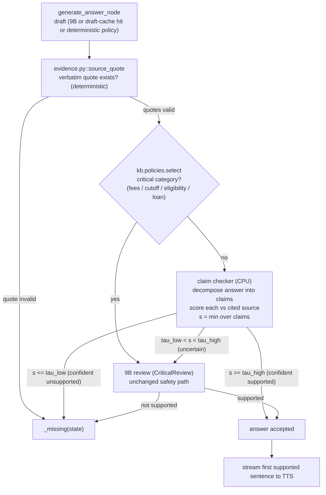

# 06 — Verification and Caching

The single most expensive thing an answered turn does today is **produce the answer twice**:
one 9B generation call and one 9B review call. The review alone is p50 7.41 s / p95 13.45 s,
about 40% of the median answered turn (18.7 s) [Measured-here, [01](01_BASELINE_AND_CURRENT_ARCHITECTURE.md) §4.1].
This chapter shows how to replace most of those 9B reviews with a small claim-level
grounding checker (≤0.8B, CPU, ~0.1–1.5 s), keep the 9B reviewer only for uncertain or
critical turns, skip re-review on byte-identical draft-cache hits, and add a semantic answer
cache with a formal false-hit bound — without weakening the verbatim quote check
(`evidence.py::source_quote`), the release-bound keys (`cache.py`), or the exact SQL cutoffs
(`facts.sqlite`).

Paths are relative to the repository root (`Minor/`). `IA/` abbreviates
`code/Institute-voice-agent/institute-assistant/`.

## Recommendations by tier

| Lever | T0 (RTX 4060 8 GB, Ollama) | T1 (16–24 GB GPU) | T2 (server) |
|---|---|---|---|
| Replace most 9B reviews with a claim checker | **MiniCheck-Flan-T5-L (0.8B) or HHEM-2.1-open (0.1B) on CPU**; min-aggregation over claims | Same checker on GPU (<50 ms) | Checker batched on GPU |
| Keep the deterministic quote check | **Keep as-is** (`source_quote`); it is necessary but not sufficient | Keep | Keep |
| Risk-gated selective review (conformal threshold) | **Do** — escalate to 9B only when checker is uncertain or category is critical | Do | Do |
| Skip re-review on verified draft-cache hits | **Do** — key already binds release+prompt+model+schema; argue byte-identity | Do | Do |
| Semantic answer cache with per-entry threshold + exact slot/release gate | Static FAQ bank first; vCache-style later | vCache-style | vCache-style, async promotion |
| Speculative RAG drafter/verifier | Optional (one 9B verify pass over small-model drafts) | Good fit | Good fit |
| KV-cache reuse for RAG chunks (CacheBlend/LMCache) | **Avoid** (hybrid DeltaNet + fits poorly in VRAM) | Partial | **Do** (vLLM/SGLang) |
| Prompt compression of evidence (LLMLingua-2) | **Do not compress evidence**; history only | Same | Same |

Headline expected effect on T0: verification stage **7.4 s → 0.1–1.5 s** on the ~85–95% of
answered turns handled by the checker [Estimated, derived in §3 and §5]; critical turns
(fees, cutoffs, eligibility, loans) still get the 9B review and lose nothing.



---

## 1. The problem precisely: what the current pipeline guarantees and what it does not

`generate_answer_node` (`IA/assistant/nodes.py:311-437`) runs, for an answered turn:

1. Filter + pack sources (`prepare_payload`, ≤`MAX_CONTEXT_CHARS`).
2. **Critical policy path**: if `kb.policies.select` matches (regex on fees/cutoff/eligibility/loan
   terms), build a *deterministic* draft from release-bound templates and send it to the 9B
   `CriticalReview` (`policies.py::REVIEW`, boolean `supported`). Verified repo behaviour.
3. **Otherwise**: draft-cache lookup (`RagCache`, `cache_key("draft", …)`); on miss, 9B
   generation (`GroundedAnswer`); then — for *every* answered draft, including a cache hit —
   a 9B review call with `REVIEW_PROMPT`.
4. For each evidence item, `evidence.py::source_quote` checks the quote is a verbatim
   substring of the cited source (with one deterministic cutoff-line-expansion repair for
   verified `kind=="cutoff"` rows). Any failure → `_missing`.

Two facts drive this chapter:

- **The review call runs even on a draft-cache hit** (`result = call_model(... REVIEW_PROMPT ...)`
  is reached whether `result` came from the cache or a fresh generation). The draft cache
  therefore saves the *generation* call but not the *review* call — confirmed in
  `IA/docs/RAG_MEMORY_CACHE_VALIDATION.md`: "A draft hit still runs grounding review and
  quote validation." That is the biggest easy win in this chapter (§4).
- **`source_quote` proves the quote exists in the source; it does not prove the prose is
  entailed by it.** The model can cite a true verbatim quote and still write a surrounding
  sentence the quote does not support. `IA/docs/LOCAL_INFERENCE.md` already states the
  quote check "does not prove that the prose is supported" ([01](01_BASELINE_AND_CURRENT_ARCHITECTURE.md) §6).
  The 9B review is what currently fills that gap. A claim checker fills it far more cheaply.

So the design is: **keep the deterministic quote check (cheap, necessary), add a cheap
entailment checker (fills the prose-support gap), and spend the 9B reviewer only where the
cheap checker is uncertain or the stakes are high.**

---

## 2. Technique: claim-level grounding checkers to replace most 9B reviews

### What
A small model that, given a source passage (premise) and an answer sentence/claim
(hypothesis), returns a support probability `p(supported | premise, claim)`. Run it on each
claim of the drafted answer against the specific source it cites, and aggregate.

### Intuition
Grounding review is a textual-entailment problem, not a generation problem. A 0.1–0.8B
NLI/fact-check model trained on this exact task reaches GPT-4-level agreement on public
grounding benchmarks while running on CPU, so a 9B general model is overkill for the yes/no
"is this claim supported?" decision.

### Maths
Decompose the answer `A` into claims `c_1…c_m` (sentence split, or the project's existing
evidence items each paired with their cited quote). For claim `c_j` with cited source `S_j`:

$$ s_j = p_\theta(\text{supported}\mid S_j, c_j) \in [0,1]. $$

An answer is accepted only if its **weakest** claim is supported (one unsupported claim
makes the whole answer unsafe):

$$ s(A) = \min_{j} s_j, \qquad \text{accept iff } s(A) \ge \tau. $$

`min`-aggregation is the conservative choice for a grounded helpdesk: it refuses to average
away a single fabricated fee or rank. Ensemble min-aggregation [R28] generalises this by
taking the min over claims **and** over an ensemble of checkers, trading hit-rate for safety.

### Evidence
All numbers are balanced accuracy on the **LLM-AggreFact** grounding benchmark (11 datasets)
unless noted; conditions are the public leaderboard, read 2026-10-05 [R605, fetched].

| Checker | Size | Base | LLM-AggreFact avg | RAGTruth slice | Licence | Multilingual |
|---|---:|---|---:|---:|---|---|
| Bespoke-MiniCheck-7B [R25][R600] | 8B (internlm2.5) | internlm2.5-7b-chat | 77.4 | 84.6 | **CC-BY-NC-4.0 ⚠** | English |
| Granite Guardian 3.3 [R601] | 8B | Granite 3.3 | 76.5 | 84.3 | Apache-2.0 | multi (safety); groundedness English-centric |
| FactCG-DeBERTa-L [R602] | **0.4B** | DeBERTa-v3-L | 75.6 | 78.9 | arXiv non-exclusive (code: check repo) | English |
| MiniCheck-Flan-T5-L [R25] | **0.8B** | Flan-T5-L | ~77 (comparable size SOTA, paper) | — | **MIT** | English |
| MiniCheck-RoBERTa-L / DeBERTa-v3-L [R25] | **0.3–0.4B** | RoBERTa/DeBERTa | lower than FT5-L | — | MIT | English |
| HHEM-2.1-open [R27] | **0.1B** | Flan-T5-base | — (RAGTruth/AggreFact in card) | reported ≈ GPT-4 on AggreFact-SOTA subset | **Apache-2.0** | English only (Hindi only in commercial HHEM-2.3 ⚠) |
| LettuceDetect (ModernBERT-base/large) [R26] | 150M/400M | ModernBERT | span-level (RAGTruth) | v2 mmBERT 0.528 span-F1 | **MIT** | 7 lang (EuroBERT); 14 lang (v2 mmBERT/PsiloQA) |
| TinyLettuce (Ettin) [R26][R603] | **17M/32M/68M** | Ettin encoders | span-level | — | **MIT** | English (train-your-own) |
| HalluGuard [R604] | 4B | small reasoning model | — | 84.0 BAcc | check repo | English |

Verified specifics:
- MiniCheck: "small fact-checking models that have GPT-4-level performance but for 400× lower
  cost"; best system MiniCheck-FT5 (770M) "reaches GPT-4 accuracy" [R25, fetched abstract].
  The MiniCheck API is `Model(document, claim) → {0,1}`; a multi-sentence claim "should first
  be broken up into sentences"; document chunked only above 32K tokens [R600, fetched].
  Throughput >500 docs/min with vLLM on one A6000 for both the 7B and the Flan-T5-L variant
  [R600, fetched] — that is a GPU number, not a T0 CPU number.
- HHEM-2.1-open: "less than 600MB RAM at 32-bit precision and around 1.5 second for a
  2k-token input on a modern x86 CPU"; 0.1B params; Apache-2.0; English; HHEM-2.1-open
  beats GPT-4 on AggreFact-SOTA by 2.64% balanced accuracy per its card [R27, fetched].
- LettuceDetect: MIT models and code; EuroBERT multilingual gives "up to 17 F1 points
  improvement over baseline LLM judges like GPT-4.1-mini across different languages";
  TinyLettuce Ettin variants 17M/32M/68M; v2 mmBERT covers 14 languages incl. the
  PsiloQA set [R26, fetched]. Returns **character spans**, so it both decides and localises.
- FactCG-DeBERTa-L: 0.4B, "outperforms GPT-4-o on the LLM-AggreFact benchmark with much
  smaller model size"; NAACL 2025; code at github.com/derenlei/FactCG [R602, fetched].
- Granite Guardian 3.3: 8B, 3rd on LLM-AggreFact, has an explicit non-thinking low-latency
  yes/no mode and function-call/RAG groundedness checks; Apache-2.0 [R601, fetched].

### Where it fits
`IA/assistant/nodes.py::generate_answer_node` — insert a `claim_check(...)` step **between**
the `source_quote` loop and the final `_reply`, and gate the existing
`call_model(... REVIEW_PROMPT ...)` behind it (see §3). The checker consumes exactly the
`sources` list and the drafted `result.evidence` already present in the function, so each
claim is paired with the source it cites rather than the whole context.

### How to implement
1. New module `IA/assistant/grounding.py::claim_check(answer, evidence, sources) -> (score, per_claim)`.
   For each `Evidence(source_id, quote)` plus the answer sentence(s) that reference it, call
   the checker with `premise = sources[source_id-1]["text"]`, `hypothesis = sentence`.
2. **T0 recommended**: MiniCheck-Flan-T5-L (0.8B, MIT) or HHEM-2.1-open (0.1B, Apache-2.0)
   via `transformers` on CPU, or export to ONNX/CTranslate2 for speed. Keep it in a resident
   process like the VITS LRU cache (`speech.py::_SYNTHESIZERS`) so there is no reload cost.
3. Aggregate with `min` over claims; return `score` and the index of the weakest claim (for
   logging and for the escalation decision in §3).
4. **Licence**: prefer MIT/Apache (MiniCheck-FT5/RoBERTa/DeBERTa, HHEM-2.1-open,
   LettuceDetect, Granite Guardian). **Avoid Bespoke-MiniCheck-7B (CC-BY-NC-4.0 ⚠)** for a
   deployable helpdesk; it is also 8B, no smaller than the current reviewer.
5. **Multilingual caveat — this project answers in Hindi/Hinglish from English sources.**
   The strongest small checkers are English-only (MiniCheck, HHEM-2.1-open, FactCG). Options:
   (a) check the **English evidence quote against the English source** deterministically
   (already done by `source_quote`) and run the entailment checker on an English rendering of
   the claim; (b) use LettuceDetect EuroBERT/mmBERT multilingual, which does not include
   Hindi in its listed 7/14 languages — verify Devanagari/Hinglish coverage before trusting
   it; (c) for Hindi/Hinglish answers, **fall back to the 9B review** until a Hindi-capable
   small checker is validated. Treat multilingual grounding as [Estimated]/unverified (see
   "What we could not verify").

### Expected effect
Per answered English turn, verification stage **7.4 s → 0.1–1.5 s** [Estimated]:
HHEM-2.1-open ~1.5 s for 2k tokens on CPU [R27, Reported]; MiniCheck-FT5-L is sub-second per
short claim on GPU [R600] and seconds on CPU for long docs (measure on T0). Per
[02](02_LATENCY_COST_MODEL_AND_METRICS.md) §4 Amdahl worked example, replacing the 9B review
with a ~0.3 s checker moves the median answered turn **18.7 s → ≈11.6 s** [Estimated]. On T1
the checker is <50 ms on GPU; on T2 it batches.

### Risks / interactions
- **Does not replace `source_quote`.** The quote check proves the cited string exists;
  the entailment checker proves the prose is supported. Keep both; they are complementary.
- A checker can be *over-confident on paraphrase* in a non-native language — hence the
  Hindi/Hinglish fallback above and the critical-category gate in §3.
- Must never relax the exact SQL cutoff path: cutoff answers come from `facts.sqlite` /
  `kb/structured.py`; the checker runs **after** those exact numbers are fixed, never
  substituting a "close enough" number.
- `min`-aggregation can reject a correct answer whose one weak claim is poorly phrased
  (false `insufficient`). Measure abstention accuracy (§Acceptance test) and tune `τ`.

### How to measure
LLM-AggreFact-style agreement vs the current 9B reviewer on the project's own 120-turn set
and `critical-cases.json`; pass criterion in §Acceptance test. Link
[12](12_EVALUATION_AND_BENCHMARKING.md).

---

## 3. Technique: risk-gated selective review (conformal threshold)

### What
Run the cheap checker on every answered turn. Accept when it is confidently supported,
reject (`_missing`) when confidently unsupported, and **escalate to the 9B review only in the
uncertain band or when the category is critical**.

### Intuition
Most helpdesk answers are easy to verify (a fee quoted verbatim, a date copied from a
brochure). Spending 7 s of 9B review on those is waste. Spend it only where the small model
is unsure, or where a mistake is expensive.

### Maths — selective prediction / conformal risk control
Let the checker output `s(A) = min_j s_j`. Choose two thresholds and a policy:

$$
\text{decision}(A)=
\begin{cases}
\text{accept} & s(A)\ge \tau_{\text{high}}\ \text{and category}\notin \text{critical}\\
\text{reject} & s(A)\le \tau_{\text{low}}\\
\text{escalate to 9B} & \text{otherwise}
\end{cases}
$$

Pick `τ_high` so the **unsupported-answer rate among auto-accepted answers is ≤ α with
confidence 1−δ**. With a labelled calibration set of `n` turns, Conformal Risk Control / LTT
gives a distribution-free bound: choose the largest acceptance region whose empirical risk
`R̂` satisfies a one-sided (e.g. Hoeffding) bound

$$ \hat R(\tau) + \sqrt{\tfrac{\ln(1/\delta)}{2n}} \le \alpha . $$

Only thresholds passing this test are deployed; everything below `τ_high` escalates, so the
*guarantee is on the auto-accepted slice*. Critical categories bypass auto-accept entirely,
so their guarantee is the 9B reviewer's, unchanged from today.

### Evidence
This is a method, not a product number. vCache [R57] uses the same per-entry online-threshold
idea with a user-defined error bound for caching (see §6) — "the first verified semantic
cache with user-defined error rate guarantees" [R57, fetched]. FrugalGPT/RouteLLM
([R31][R32] in REFERENCES) establish cascade/routing cost savings. The abstention policy
here is identical in spirit to the project's existing JEV router calibrated abstention
([01](01_BASELINE_AND_CURRENT_ARCHITECTURE.md) O2) — reuse that calibration machinery.

### Where it fits
`generate_answer_node`: after `claim_check`, branch on `(score, critical_category)`. The
critical-category test already exists as `kb.policies.select` / `matching_rule` (fees, cutoff,
eligibility, loan regexes); reuse it so "critical" has one definition. The 9B review call that
is unconditional today becomes the `escalate` branch.

### How to implement
1. Build a calibration set: run the current 9B reviewer on the 120-turn benchmark + extra
   turns, record `(checker_score, reviewer_verdict)` pairs. **No model/config changes needed
   to collect**; `operations.record_attempt` already logs calls.
2. Fit `τ_high` by Conformal Risk Control at `α` (e.g. 0.01 unsupported) and `δ=0.05`.
3. Hard-wire: `critical` categories (from `policies.matching_rule`) always escalate; Hindi/
   Hinglish answers escalate until a Hindi checker is validated (§2).
4. Log the escalation rate; it is the knob between safety and latency.

### Expected effect
If 85–95% of English non-critical turns auto-accept [Estimated — must be measured], the mean
verification time ≈ `0.9·(checker) + 0.1·(checker+9B)` ≈ **0.5–2 s** vs 7.4 s today. Tail p95
improves because only the uncertain 10–15% still pay the 9B review. T1/T2 similar fractions,
smaller absolute times.

### Risks / interactions
- The guarantee holds **only on the calibration distribution**. New brochure releases change
  the distribution → re-calibrate per release (ties naturally to the release-bound cache in §6).
- Setting `α` too loose silently lets unsupported answers through on the auto-accept slice;
  the acceptance test (bottom) bounds this empirically with a confidence interval.
- Keep critical categories on the 9B path: fees/cutoffs/eligibility/loans are exactly where a
  confident-but-wrong small model would be most damaging.

### How to measure
Measured unsupported-claim rate with a bootstrap CI on the auto-accepted slice; must be
≤ α. Escalation rate and its effect on p50/p95. Link [12](12_EVALUATION_AND_BENCHMARKING.md).

---

## 4. Technique: skip re-review on verified draft-cache hits

### What
When `generate_answer_node` gets a draft-cache **hit**, do not run the 9B review again.

### Intuition / safety argument (precise)
The draft `cache_key` already binds every input that could change the correct answer:

```
cache_key("draft", {release, payload, prompt=ANSWER_PROMPT, review_prompt=REVIEW_PROMPT,
                    schema=GroundedAnswer schema, model=model_identity, temperature=0, max_tokens})
```
and the cache is SHA-256 exact-match (`cache.py::cache_key`), TTL 3600 s, LFU 2000 entries,
128 KiB/entry (`config.py` `RAG_CACHE_TTL_SECONDS=3600`, `RAG_CACHE_MAX_ENTRIES=2000`,
`RAG_CACHE_MAX_ENTRY_BYTES=131072`) [Measured-here, code]. Crucially, **what is stored is the
answer that already passed the 9B review and `source_quote`** — `generate_answer_node` only
calls `cache.put(key, …)` on the *reviewed, quote-validated* result at the end, and calls
`cache.delete(key)` whenever a draft fails review or quote validation (`if key and (result.status
!= "answered" or not result.evidence): cache.delete(key)` and the per-evidence delete paths).

Therefore a cache hit is, by construction, a previously-approved answer for byte-identical
`(release, payload, prompts, schema, model)`. Re-running the review on identical bytes with
`temperature=0` cannot *correctly* change the verdict; it only adds ~7 s and risks
nondeterministic flakiness (a rate-limit or a sampling blip flipping `answered`→`unavailable`,
as actually happened once in `RAG_MEMORY_CACHE_VALIDATION.md`). The quote check
(`source_quote`) is deterministic and cheap, so **keep running it on hits** — it re-proves the
stored quotes still match the (immutable, release-bound) sources at near-zero cost.

### Maths
Let `k = draft cache hit rate` on answered turns. Saved time per answered turn
= `k · t_review` (the review no longer runs on hits). With `t_review ≈ 7.4 s` [Measured-here],
even a modest `k` is worth seconds. (Today the hit path *does* run review, so this is pure
upside.)

### Evidence
`RAG_MEMORY_CACHE_VALIDATION.md` states the exact-key design and that a hit currently still
reviews. The one live local exact-repeat sample went 25.882 s (3 calls) → 12.687 s (2 calls)
— the 2 remaining calls were routing + review; removing the review on a verified hit would
take it toward 1 call [Measured-here, [01](01_BASELINE_AND_CURRENT_ARCHITECTURE.md) §4.2].

### Where it fits
`generate_answer_node`: when `cached is not None` and validates as a prior **answered** draft,
return it after `source_quote` re-validation **without** the `REVIEW_PROMPT` call. Today the
code falls through to the shared review line regardless of hit/miss.

### How to implement
1. Mark cached entries as review-passed (they already are, by the put/delete discipline).
2. On a validated hit: run the `source_quote` loop (deterministic) and the claim checker from
   §2 as a *cheap* re-confirmation; skip the 9B review.
3. Keep `cache.delete(key)` on any quote re-validation failure (defence against a corrupted
   or release-mismatched entry — though the release hash already prevents cross-release serves).

### Expected effect
Removes `t_review ≈ 7.4 s` from every answered **draft-cache hit** [Estimated from
Measured-here review latency]. On an exact repeat this can take the turn from ~2 model calls
to 1 (routing only, if the router is also cached/short-circuited).

### Risks / interactions
- Only safe because the stored draft is post-review and the key is byte-exact and
  release-bound. If any future change stores *pre-review* drafts, this reasoning breaks —
  guard it with an explicit `reviewed=True` flag in the cached payload.
- Does not apply to the critical-policy path (that path has no draft cache; it always runs
  `CriticalReview`). Leave it exactly as is.

### How to measure
Re-run the exact-repeat case; verify model calls drop and the answer bytes are identical to
the first turn's reviewed answer. Pass: identical citations, no new 9B review call logged.

---

## 5. Technique: Speculative RAG (small drafter, single large verify)

### What
A smaller distilled specialist LM writes several RAG drafts in parallel from different source
subsets; a larger generalist LM does **one** verification pass over the drafts and picks/uses
the best [R53].

### Intuition
It inverts today's cost: generation (the expensive decode) moves to a small model; the big
model only *verifies*, which for the helpdesk is exactly the review it already does.

### Maths
With `d` drafts over disjoint source subsets, each draft has fewer input tokens
(`N_prompt/d` + fixed), reducing per-draft prefill and position bias; the generalist runs one
scoring pass. Expected latency ≈ `t_draft(small, parallel) + t_verify(large, once)` vs
`t_gen(large) + t_review(large)` today.

### Evidence
"accelerates RAG by delegating drafting to the smaller specialist LM, with the larger
generalist LM performing a single verification pass … enhances accuracy by up to 12.97% while
reducing latency by 50.83% compared to conventional RAG" on PubHealth; ICLR 2025 [R53, fetched].
Conditions: their drafter/verifier pair and benchmarks, **not** this project's 9B/Qwen3.5
stack — treat as [Reported], not a T0 prediction.

### Where it fits
A larger refactor of `generate_answer_node`: the current 9B generation becomes the small
drafter (or the existing deterministic policy draft), and the 9B review becomes the single
verifier — which is close to what the critical-policy path already does (deterministic draft
→ one `CriticalReview`). Mapping: **the deterministic-policy path is a degenerate
Speculative-RAG (one trusted draft, one verify)**; §2+§3 generalise it with a cheap verifier.

### Expected effect
[Reported] up to −50% latency / +13% accuracy on their setup; on T0 the realistic win is
avoiding the second *9B* decode (the review becomes a small-checker pass, §2). Needs a
distilled drafter to fully realise — see [09](09_DISTILLATION_AND_FINE_TUNING.md).

### Risks / interactions
- A small drafter must still cite real spans; keep the span-enum grammar
  ([01](01_BASELINE_AND_CURRENT_ARCHITECTURE.md) O7) and `source_quote`.
- Parallel drafts need VRAM; on T0 (model barely fits, 45–52% on CPU) parallelism is limited
  — this is a T1/T2 technique.

### How to measure
Compare accuracy + latency of (drafter+verify) vs today on the 120-turn set; grounding
unchanged on `critical-cases.json`. Link [12](12_EVALUATION_AND_BENCHMARKING.md).

---

## 6. Technique: streaming-compatible, sentence-level verification

### What
Check and release the answer **one sentence at a time** so the first supported sentence can
be synthesised and spoken while later sentences are still being checked.

### Intuition
Per [02](02_LATENCY_COST_MODEL_AND_METRICS.md) §1.1, perceived latency is the sum of
*first-chunk* latencies. If the first sentence (~25 tokens) is verified in isolation, TTS can
start ~1.4 s into decoding instead of after the whole JSON + full review.

### Maths
`T_first_audio = t_gen(first sentence) + t_check(first sentence) + t_tts(first chunk)`.
With `t_check` ≈ 0.1–1.5 s (small checker, one claim) and `t_gen(25 tok)` ≈ 1.4 s at
17.7 tok/s [Measured-here, 01 §4.3], the first spoken word can arrive in ~2–3 s on T0
[Estimated] vs ~18 s today.

### Evidence
Claim checkers are inherently per-claim (MiniCheck API is `(document, sentence)` [R600];
LettuceDetect returns per-span verdicts [R26]), so sentence-level checking needs no new model
— just a different call site. The current whole-JSON, non-streamed `_invoke_local`
(`stream:False`, [01](01_BASELINE_AND_CURRENT_ARCHITECTURE.md)) is the blocker.

### Where it fits
Depends on streaming generation ([05](05_LLM_INFERENCE_AND_SERVING.md)) and streaming TTS
([07](07_SPEECH_OUTPUT.md)). `generate_answer_node` would emit verified sentences to the
`agent_bridge`/`verbalization` path incrementally.

### Risks / interactions
- A later sentence may fail the check *after* an earlier one was spoken — mitigate by
  speaking only sentences whose claims are self-contained and already verified, and by never
  streaming critical-category answers sentence-by-sentence (verify the whole critical answer
  first).
- The span-enum grammar and `source_quote` must run per sentence; ensure the quote for a
  sentence is validated before that sentence is spoken.

### How to measure
Time-to-first-audio on voice turns (currently unmeasured, [01](01_BASELINE_AND_CURRENT_ARCHITECTURE.md) §4.2);
grounding unchanged. Link [12](12_EVALUATION_AND_BENCHMARKING.md).

---

## 7. Technique: semantic answer caching with guarantees

### What
Serve a cached answer for a **semantically equivalent** new question — but only under a
formal false-hit bound and only within the same release and exact structured slots.

### Intuition
The exact-key `RagCache` misses paraphrases ("fee for first sem" vs "first semester total
fee"). A semantic cache catches those, but naïve embedding-similarity caches serve wrong
answers when two questions are *close but not equivalent* (e.g. SC vs ST, 2025 vs 2026).

### Maths — per-entry verified threshold (vCache)
For a new query `q` and nearest cached entry `e` with embedding similarity `sim(q,e)`, a
static global threshold has no correctness guarantee. vCache learns a **per-entry** threshold
`t_e` online so the expected error of serving `e` stays under a user-set bound `ε`:

$$ \text{serve } e \iff \big[\,\text{slot}(q)=\text{slot}(e)\ \wedge\ \text{release}(q)=\text{release}(e)\,\big]\ \wedge\ \widehat{P}(\text{correct}\mid sim) \ge 1-\varepsilon . $$

The slot/release gate is **hard** (non-probabilistic); the semantic part only *adds* recall
within an exactly-matched slot bucket.

### Evidence
vCache "the first verified semantic cache with user-defined error rate guarantees"; "up to
12.5× higher cache hit and 26× lower error rates" vs static-threshold/fine-tuned baselines;
ICLR 2026; implementation + 4 benchmarks released [R57, fetched]. Krites adds asynchronous
LLM-judged promotion for tiered caches [R58]; category-aware caching tunes thresholds per
workload type [R59]; semantic caches are poisonable and need defences [R60] (verify these
three — fetched only as snippets in REFERENCES).

### Where it fits
A new layer *in front of* `generate_answer_node`, keyed on:
`embed(resolved_query)` (the standalone, slot-resolved query the router already produces) **+
exact match of {year, programme, category, quota, round, language}** (the same dimensions the
follow-up rewriter preserves, `history.py::exact_rank_followup`,
[01](01_BASELINE_AND_CURRENT_ARCHITECTURE.md) O3) **+ release hash** (same binding as
`cache.py`). Never serve across releases — identical rule to the existing draft cache.

### How to implement
1. **Phase 1 (do first): static pre-verified FAQ answer bank.** Offline, run the full
   pipeline (generation + 9B review + `source_quote`) on the known FAQ list per release; store
   the approved answers. At runtime serve only on exact slot+release match. Zero online risk,
   because every entry was reviewed offline against the current release.
2. **Phase 2: vCache-style per-entry threshold** on `embed(resolved_query)` within a slot
   bucket, with `ε` set like `α` in §3. Reuse the project's e5-small embeddings
   (`kb/search.py`) for `embed`.
3. **Poisoning defence [R60]**: only cache answers that passed review+quote check; never cache
   user text as an answer; bound entry size (already 128 KiB).

### Expected effect
Turns a paraphrase from a full ~18 s answered turn into a cache serve (ms) [Estimated]. The
static FAQ bank alone can cover the most frequent fee/cutoff/eligibility questions. Up to
12.5× hit-rate improvement over a static-threshold semantic cache is [R57 Reported] on their
benchmarks, not this corpus.

### Risks / interactions
- **The slot+release gate is the safety guarantee**; the embedding similarity only widens
  recall inside a bucket. A cross-category serve (SC answer for an ST question) must be
  impossible by construction — the slot match forbids it, exactly as the follow-up rewriter
  keeps category/round fixed.
- Semantic caches can be poisoned [R60]; only cache post-review answers.
- Re-verify (cheap quote check, §4) stored answers against the current release's sources on
  serve, so a stale entry that somehow survived a release change still fails closed.

### How to measure
Cache false-hit rate (served answer disagrees with a fresh reviewed answer) with an upper CI
bound ≤ ε; hit rate; zero cross-slot/cross-release serves. Link
[12](12_EVALUATION_AND_BENCHMARKING.md).

---

## 8. Technique: KV-cache reuse for RAG chunks (T1/T2 mostly)

### What
Precompute and reuse the attention KV state of repeated source chunks so repeated contexts
skip prefill (CacheBlend/LMCache [R52], TurboRAG, Block-Attention, KVLink).

### Intuition
RAG prompts share long verbatim chunks across turns; caching their KV avoids re-prefilling
them.

### Evidence / where it fits
CacheBlend/LMCache is Apache-2.0 and targets vLLM-class servers [R52]. **On T0 this is a poor
fit for two measured reasons** ([01](01_BASELINE_AND_CURRENT_ARCHITECTURE.md) §4.3):
(1) the model barely fits (45–52% on CPU), leaving no room for a large KV store; (2) Qwen3.5
is **hybrid Gated-DeltaNet** — only 8 of 32 layers are full attention, and llama.cpp cannot
rewind the recurrent state to an arbitrary token, so mid-prompt KV reuse is limited to saved
checkpoints [R45][R46 in REFERENCES]. Prefill is already <0.3% of the turn here, so the payoff
is tiny on T0 regardless. Recommend **T2 (vLLM/SGLang) only**, where prefill of long shared
contexts actually dominates.

### Expected effect / risks
[Reported] large prefill savings on dense-attention models in server settings [R52]; **not
recommended on T0**. Risk: stale KV serving an old chunk — bind KV entries to the release hash
like every other cache here.

### How to measure
Prefill time with/without KV reuse on T2; grounding unchanged. Link [12](12_EVALUATION_AND_BENCHMARKING.md).

---

## 9. Caveat: prompt compression and grounding loss

**Do not compress the evidence.** LLMLingua-2 [R54] compresses prompts, but compression
reduced citation grounding by 40–50% on ASQA [R55], and rate-adherence/quality vary in the
wild [R56] (existing references). For a verbatim-quote helpdesk this directly breaks
`source_quote`: a compressed source no longer contains the exact span the model must cite.
**Allowed**: compress *conversation history* (not the sources) if context pressure appears —
history is not quoted. This matches the latency-budget guidance in
[02](02_LATENCY_COST_MODEL_AND_METRICS.md) and the warning in
[01](01_BASELINE_AND_CURRENT_ARCHITECTURE.md) §6.

---

## 10. Acceptance test spec

Run against `code/demo2/evaluation/upgrade-20260930/cases.json` (120 turns) and
`critical-cases.json` (12 critical/clarification/insufficient turns). Compare the proposed
cheaper verification pipeline (§2–§4, §7) to the current 9B-review baseline. See
[12](12_EVALUATION_AND_BENCHMARKING.md) for harness details.

| # | Criterion | Metric | Pass condition |
|---|---|---|---|
| A | **Zero unsupported claims on critical cases** | For every `expected:"answerable"` critical case (`cg_eligibility_*`, `cg_reporting_*`), every emitted claim is entailed by its cited source (human-adjudicated or 9B-reviewer-labelled) | **0** unsupported claims across all critical answerable cases |
| B | **Critical refusals preserved** | `loan_current_eligibility_*` → `insufficient`; `ambiguous_reporting_*` → `clarification` | identical status to baseline for all 12 critical cases |
| C | **Abstention accuracy unchanged** | status-match rate (answered / insufficient / out-of-scope / clarification) vs baseline on the 120-turn set | no net regression (within CI); specifically no new false-`answered` |
| D | **Unsupported-claim rate on auto-accepted slice** | fraction of auto-accepted (non-escalated, non-critical) answers with ≥1 unsupported claim, with 95% bootstrap CI | upper CI bound ≤ α (target α = 0.01) |
| E | **Cache false-hit rate** | semantic-cache serves whose answer disagrees with a fresh reviewed answer, 95% upper CI | ≤ ε (target ε = 0.01); **0** cross-slot or cross-release serves |
| F | **Quote integrity** | every citation still passes `evidence.py::source_quote` verbatim | 100% (unchanged from today) |
| G | **Latency** | verification-stage p50/p95 and answered-turn p50/p95 | verification p50 < 1.5 s on T0; answered-turn p50 improved vs 18.7 s; p95 not worse |
| H | **Exact cutoffs** | `facts.sqlite` cutoff cases (42/42 baseline) | still 42/42 exact or `unavailable`; no substituted numbers |

Criteria A, B, F, H are **hard safety gates** (must be exactly met). C–E are statistical
(reported with CIs). G is the latency objective. Numbers for A/B/F/H come from the repo's own
labelled cases; D/E require a labelled calibration/holdout split (collectable read-only via
`operations.record_attempt`, no config change).

---

## What we could not verify

- **CPU latency of the checkers on T0.** HHEM-2.1-open's "~1.5 s / 2k tokens on a modern x86
  CPU" is the vendor card [R27, Reported], not measured on the i7-14650HX. MiniCheck's
  >500 docs/min is a GPU (A6000) figure [R600]. No checker was installed or run here
  (documentation-only scope); treat all T0 checker latencies as [Estimated] until measured.
- **Hindi/Hinglish grounding accuracy.** The strongest small checkers (MiniCheck, HHEM-2.1-open,
  FactCG) are English-only; LettuceDetect's listed multilingual sets (7 lang EuroBERT, 14 lang
  mmBERT/PsiloQA) do **not** clearly include Hindi/Devanagari — unverified. The project
  answers in Hindi/Hinglish from English sources, so cross-lingual entailment accuracy is an
  open risk; the design falls back to the 9B review for those turns.
- **Auto-accept fraction (85–95%).** This is an [Estimated] planning assumption; the real
  fraction depends on calibration against the project's own turns and must be measured before
  claiming the latency win.
- **Speculative RAG / vCache transfer.** The −50% latency / +13% accuracy [R53] and 12.5×
  hit / 26× lower error [R57] are from the papers' own benchmarks, not this corpus or the
  Qwen3.5 stack; use as motivation, not predictions.
- **Krites [R58], category-aware caching [R59], poisoning defences [R60]** were only confirmed
  as snippets in REFERENCES; re-read before relying on their numbers.
- **FactCG / HalluGuard code licences** were not opened file-by-file; the leaderboard links to
  their repos but the exact LICENSE file was not fetched here.
