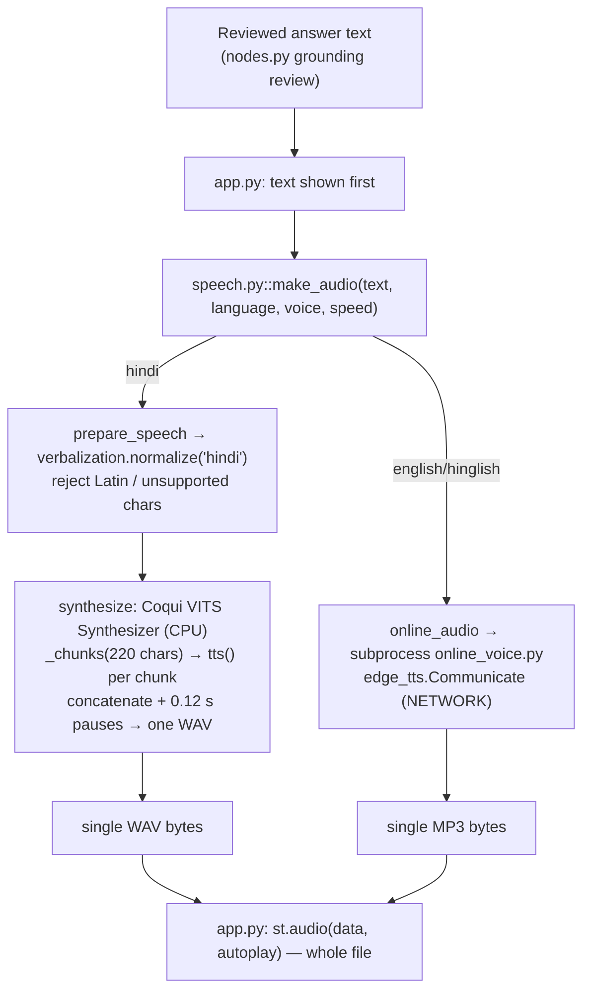
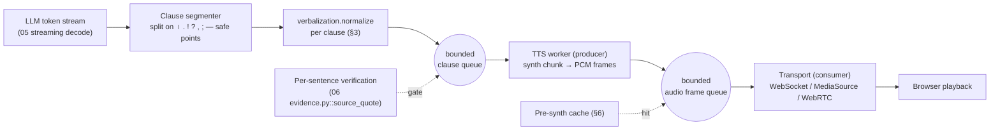

# 07 — Speech Output

The agent speaks only after the full reviewed answer is text, then synthesises the whole
answer into one file before playback. Hindi uses a local Coqui VITS checkpoint on CPU;
English/Hinglish go to the **online** Edge TTS service. This chapter makes TTS stream
(sentence-by-sentence with a short first chunk), replaces the online path with a fully
local English/Hinglish voice, benchmarks local Hindi/Indic alternatives to the current
VITS, accelerates VITS with ONNX/int8, and adds a pre-synthesised cache for greetings,
acknowledgements and verified repeats.

Paths are relative to the repository root (`Minor/`). `IA/` abbreviates
`code/Institute-voice-agent/institute-assistant/`. Read with
[02_LATENCY_COST_MODEL_AND_METRICS.md](02_LATENCY_COST_MODEL_AND_METRICS.md) (TTFB/RTF
maths), [06_VERIFICATION_AND_CACHING.md](06_VERIFICATION_AND_CACHING.md) (per-sentence
release gating) and [12_EVALUATION_AND_BENCHMARKING.md](12_EVALUATION_AND_BENCHMARKING.md)
(quality protocol).

## Summary

- TTS is batch today: the whole answer is one WAV (`speech.py::synthesize`), and audio only
  starts after the reviewed text is final. For a greeting the Hindi voice already needs
  **≈3.65 s (Female) / ≈4.51 s (Male)** of synthesis on CPU before any sound
  [Measured-here, `code/demo2/VALIDATION.md`].
- The biggest, cheapest win is **sentence/clause streaming with a short first chunk**: emit
  audio for the first clause while later clauses synthesise. This cuts TTS time-to-first-byte
  (TTFB) from "whole answer" to "first clause", roughly 3–8× for a typical multi-sentence
  answer [Estimated].
- **Replace online Edge TTS** with local Kokoro-82M (Apache-2.0, Hindi + English voices)
  [R61][Reported] routed through sherpa-onnx or the Kokoro package; this removes the network
  dependency and the subprocess, and makes English/Hinglish gap-free offline.
- For local Hindi/Indic quality, keep the current VITS as the fast default and add
  IndicF5 (MIT) [R64] or Indic Parler-TTS (Apache-2.0) [R65] as higher-quality options; both
  are heavier and need a GPU for interactive latency.
- A **pre-synthesised audio cache** keyed by `hash(normalized text + voice + speed + model
  version + KB release)` makes greetings, fillers and frequently asked verified answers play
  with ~0 ms synthesis.

### Recommendations by tier

| Tier | First change | Then | Hindi voice | English/Hinglish voice |
|---|---|---|---|---|
| **CPU-only** | Sentence streaming + short first chunk; pre-synth cache | VITS→ONNX int8 via sherpa-onnx | Current VITS (ONNX) | Kokoro-82M (ONNX, CPU) [R61] or Piper ⚠GPL [R62] |
| **T0** (RTX 4060 8 GB) | Sentence streaming; pre-synth cache | VITS int8 CPU (keep GPU for LLM); Kokoro for en/hinglish | Current VITS CPU; optional IndicF5 on GPU for set-piece answers | Kokoro-82M CPU [R61] |
| **T1** (16–24 GB) | Streaming + browser WebSocket playback | IndicF5 / Indic Parler-TTS on GPU | IndicF5 [R64] or VITS | Kokoro / Indic Parler-TTS [R65] |
| **T2** (40–80 GB) | Streaming server (WebRTC), batched TTS | Model-parallel with LLM batching ([10](10_THROUGHPUT_CONCURRENCY_AND_TELEPHONY.md)) | Indic Parler-TTS / IndicF5 | Indic Parler-TTS / Kokoro |

Chhattisgarhi stays on the project's own VITS checkpoints (MIT, `code/TTS/chattisgarhi-tts-models`)
regardless of tier; §5 discusses fine-tuning paths.

---

## 1. Where speech output sits today

Verified from code:

- `code/demo2/speech.py::make_audio` routes `hindi` → `prepare_speech` + `synthesize`
  (Local VITS), `english`/`hinglish` → `online_audio` (Edge, requires `allow_online`).
- `speech.py::synthesize` holds a process-wide `_LOCK`, loads a resident
  `TTS.utils.synthesizer.Synthesizer` per voice (LRU `_SYNTHESIZERS`, cap `VOICE_CACHE_SIZE`
  = 2 on CPU), sets `torch.set_num_threads(SPEECH_THREADS)` (default **4**,
  `settings.py::SPEECH_THREADS`), calls `tts()` on each chunk from `_chunks`, concatenates
  with `TTS_PAUSE_SECONDS` = 0.12 s of silence, and writes **one** PCM-16 WAV.
- `speech.py::_chunks` splits on words, flushing at `TTS_CHUNK_CHARS` = **220** or after a
  sentence terminator (`।`, `!`, `?`). Chunks exist already but are concatenated, not
  streamed.
- `app.py` line 182: `st.audio(audio["data"], format=audio["mime"], autoplay=...)` plays the
  **entire** byte string; there is no incremental playback.
- VITS config (`code/TTS/chattisgarhi-tts-models/Female/config.json`): model `vits`,
  22,050 Hz, `inference_noise_scale` 0.667, `length_scale` 1.0 (mapped from UI `speed` as
  `1/speed` in `make_audio`), `use_sdp: true` (stochastic duration predictor). Repo licence
  **MIT** (`README.md`).

Measured baseline (CPU, `code/demo2/VALIDATION.md`): VITS greeting ≈**3.65 s** Female /
≈**4.51 s** Male; a full Hindi answer produced a **358,988-byte** WAV; Edge Hinglish
produced **27,072 bytes** MP3 in **≈2.1 s** (network). No per-clause latency, RTF, MOS or
intelligibility number exists in the repository — those are gaps for [12](12_EVALUATION_AND_BENCHMARKING.md).

---

## 2. Streaming TTS: maths, pipeline and browser playback

### 2.1 Definitions and the gap-free condition

**Real-time factor (RTF)** of a synthesiser is synthesis time divided by audio duration:

$$
\text{RTF} = \frac{t_{\text{synth}}}{t_{\text{audio}}}, \qquad \text{RTF} < 1 \iff \text{faster than real time.}
$$

**TTS time-to-first-byte (TTFB)** when streaming by clause:

$$
t_{\text{TTS,TTFB}} = t_{\text{first\_chunk\_text}} + t_{\text{synth}}(\text{chunk}_1)
= t_{\text{first\_chunk\_text}} + \text{RTF}\cdot t_{\text{audio}}(\text{chunk}_1).
$$

A short first chunk (one short clause, ~5–8 words) minimises $t_{\text{audio}}(\text{chunk}_1)$,
so a smaller first chunk means lower TTFB even at fixed RTF.

**Gap-free playback condition**: while chunk $i$ plays (duration $d_i = t_{\text{audio},i}$),
chunk $i{+}1$ must finish synthesising:

$$
t_{\text{synth}}(\text{chunk}_{i+1}) \le d_i
\quad\Longleftrightarrow\quad
\text{RTF}\cdot d_{i+1} \le d_i.
$$

For similar chunk lengths this is just **RTF ≤ 1 with a one-chunk lead**. The first chunk
sets TTFB; every later chunk is hidden behind playback if RTF < 1. If RTF > 1 (slower than
real time), playback stalls and you must either shorten text, raise speed, or move to a
faster model/accelerator.

Worked estimate on T0 **[Estimated]** from the greeting measurement. The Female greeting
("नमस्ते, मैं IIIT नया रायपुर…"-class, a few seconds of audio) took ≈3.65 s to synthesise;
if that greeting is ≈3.5–4 s of audio, VITS CPU RTF ≈ **0.9–1.0** — right at the real-time
edge on 4 threads. So on T0 CPU, streaming hides later chunks only marginally; the first
short clause (≈1.2 s audio) would need ≈1.0–1.2 s to synthesise → **TTFB ≈ 1.0–1.4 s**
instead of 3.65 s. Accelerating VITS (§4) pushes RTF to ≈0.3–0.5 and makes streaming
comfortably gap-free. These are planning numbers; the RTF is derived from one greeting and
must be re-measured per §6.

### 2.2 Producer/consumer pipeline

- The segmenter emits a **short first clause** and larger later clauses (fill to
  `TTS_CHUNK_CHARS`), so TTFB is small but throughput stays high.
- A bounded clause queue plus a bounded audio-frame queue decouple synthesis from playback.
  The TTS worker is the producer; the transport is the consumer. Back-pressure (bounded
  queues) prevents unbounded memory if the browser lags.
- Verification gates the queue: a clause is only enqueued for synthesis **after** its quotes
  pass `IA/assistant/evidence.py::source_quote`. This keeps grounding intact while streaming
  (interaction detailed in §7 and [06](06_VERIFICATION_AND_CACHING.md)). If verification is
  per-whole-answer today, streaming TTS must wait for the final reviewed text; the honest
  near-term win is streaming the **already-final** text clause-by-clause, which still removes
  the "synthesise whole answer first" delay.

### 2.3 Browser playback options (and the Streamlit limitation)

| Option | How | Latency | Fits current UI? | Notes |
|---|---|---|---|---|
| `st.audio(bytes)` (today) | whole file element | starts after full synth | yes | No incremental feed; no partial playback. `app.py:182` |
| Chunked `st.audio` per clause | render N audio elements as clauses finish | first clause fast | partial | Multiple players, no gapless join; `autoplay` on each is fragile |
| **MediaSource Extensions (MSE)** | JS `SourceBuffer.appendBuffer(chunk)` on one `<audio>` | first chunk fast, gapless | needs custom component | Append WAV/Opus fragments; standard browser API |
| **WebSocket audio** | server streams PCM/Opus frames to a JS player | low | needs custom component | Pairs with the existing STT WebSocket service (`code/STT/stt-service`, O18) |
| **WebRTC audio** | SFU/peer audio track | lowest, duplex | needs transport layer | Best for telephony/barge-in; see [10](10_THROUGHPUT_CONCURRENCY_AND_TELEPHONY.md) |

**Streamlit reality**: `st.audio` only plays a complete object and reruns the whole script on
interaction; it has no native streaming-audio sink. True streaming needs a **custom
component** (JS + MSE or a WebSocket player) or a move off Streamlit for the voice loop
(FastAPI + WebSocket/WebRTC front end, as voice-agent frameworks do [R02][R94]). A pragmatic
middle step inside Streamlit: synthesise and show the first clause immediately via `st.audio`
autoplay, then append subsequent clauses — perceived TTFB drops even without MSE, at the cost
of small inter-clause gaps.

---

## 3. Incremental verbalization across chunk boundaries

**What.** `verbalization.normalize` (`code/demo2/verbalization.py`) must run per clause
without ever splitting a number, currency amount, date, range or negated phrase across a
chunk boundary.

**Intuition.** `normalize` expands `₹90,000`→`नब्बे हजार रुपये`, `3.5%`→`तीन दशमलव पाँच
प्रतिशत`, `2026-01-15`→a spoken date, ranges `12-15`→`12 से 15`, and negations
(`not`→`नहीं`, `without`→`बिना`). If the segmenter cuts between `नब्बे` and `हजार`, or
splits `12-15` or a `not`-phrase, the two clauses are synthesised separately and the meaning
or the number is spoken wrong. Grounding depends on numbers being read verbatim.

**Maths / rule.** Segment on safe boundaries only. Let the raw tokens carry *protected
spans* produced by the same regexes `normalize` uses:
`\d+(?:,\d+)*(?:\.\d+)?`, `₹\s*…`, the date patterns, the range pattern `(?<=\d)\s*[-–]\s*(?=\d)`,
and negation tokens from `NEGATION`/`HINGLISH`. A clause break is legal iff it is a sentence
terminator (`। ! ?`) or a comma/semicolon that is **not inside** a protected span. Formally,
split at index $k$ only if no protected span $[a,b]$ has $a < k \le b$.

**Where it fits.** New segmenter wraps `verbalization.py::normalize` and feeds
`speech.py::_chunks`/`synthesize`. `normalize` itself already protects spans *within* a
string; the change is to run it **before** segmentation (normalize whole answer, then split
on safe points) or to pass protected-span offsets to the splitter. Normalizing first is
simplest and keeps `normalize`'s existing negation/number/date handling intact.

**How to implement.** (1) Normalize the final text once with the correct language.
(2) Compute protected-span offsets with the same regexes. (3) Split into clauses at
terminators/commas outside spans, filling to ≤ `TTS_CHUNK_CHARS`, with a short first clause.
(4) Feed clauses to the TTS worker. No external dependency; pure Python, reuses `verbalization.py`.

**Expected effect.** Correctness (not latency): removes a class of mis-spoken numbers/
negations that streaming would otherwise introduce. [Estimated] 0 regressions vs batch on
the number-reading test set (§8) is the pass bar.

**Risks / interactions.** The Hindi path's `prepare_speech` rejects any Latin character and
any glyph outside the VITS `characters` set — this must run **per clause** too, else a clause
with an unsupported glyph fails mid-stream. Decide policy: fail the whole turn before
streaming starts (safer) or skip the offending clause (worse). Currency/decimal expansion
must be identical to batch (regression test the two paths produce byte-identical normalized
text).

**How to measure.** Number-reading accuracy test set + ASR round-trip CER on clause-split vs
whole-answer synthesis must match (§8, [12](12_EVALUATION_AND_BENCHMARKING.md)).

---

## 4. Accelerating the current VITS

### 4.1 ONNX export + sherpa-onnx runtime

**What.** Export the Coqui VITS checkpoints to ONNX and run them through sherpa-onnx
(Apache-2.0) instead of the PyTorch `Synthesizer`.

**Evidence.** sherpa-onnx README: runs **TTS (VITS, Piper, Kokoro, Matcha)** locally on
x86/ARM/Raspberry Pi with C++/Python/… APIs, no Internet; Apache-2.0 licence
[R700][Reported, fetched]. The community app *VoxSherpa TTS* reports Kokoro-82M, Piper and
VITS engines running **100% offline on Android including Hindi** [R700][Reported, snippet].
Coqui TTS ships a VITS→ONNX exporter (`TTS` package, same version 0.22.0 already installed
per `VALIDATION.md`) [R67][R701].

**Where it fits.** New synthesis backend behind `speech.py::synthesize` (keep the PyTorch
path as fallback). `prepare_speech`, `_chunks`, verbalization unchanged.

**How to implement.** (1) Export `best_model.pth` + `config.json` to ONNX with Coqui's VITS
exporter; (2) load with `sherpa_onnx.OfflineTts` (`num_threads=SPEECH_THREADS`); (3) feed
clause text; (4) stream PCM frames to the queue (§2.2). Models stay local; licences: Coqui
MPL-2.0 (exporter) [R67], sherpa-onnx Apache-2.0 [R700], the Chhattisgarhi weights MIT.

**Expected effect.** ONNX Runtime + int8 typically lowers CPU RTF versus eager PyTorch; the
exact factor must be measured. [Estimated] RTF ≈0.9–1.0 → ≈0.4–0.7 on T0 CPU (ONNX graph +
int8), i.e. TTFB for a short first clause ≈0.5–0.9 s. Not a reported VITS-specific number;
treat as a target.

### 4.2 int8 quantization

Dynamic int8 (ONNX Runtime `quantize_dynamic`) shrinks the ≈0.95 GB fp32 checkpoint
(`best_model.pth` is 997,882,550 bytes [Measured-here, directory listing]) and speeds matmul
on CPU. Risk: quantization can degrade intelligibility; gate on the ASR round-trip CER test
(§8). Keep fp32 as the quality reference.

### 4.3 Thread tuning

`SPEECH_THREADS` = 4 on a 24-thread CPU (`settings.py`). On T0 the LLM runs partly on CPU
(45–52% offload, [01 §4.3]), so TTS threads **contend** with LLM CPU work. Guidance:

| Scenario | SPEECH_THREADS | Why |
|---|---|---|
| TTS while LLM decoding on CPU (T0 today) | keep ≤4 | avoid stealing LLM cores |
| TTS after LLM finishes (text-first UI) | raise to 8–12 | answer text already shown; speech can use idle cores |
| CPU-only kiosk, no concurrent LLM | 8–16 | maximise TTS throughput |

VITS is partly sequential (flow + SDP); thread scaling saturates — measure RTF vs threads,
do not assume linear. [Estimated]

### 4.4 GPU placement vs LLM VRAM contention (T0)

On T0 only ≈5.4 GB VRAM is free and the 6.3 GB LLM already offloads to CPU ([01 §4.3]).
Putting VITS on CUDA (`DEMO2_TTS_DEVICE=cuda`, which forces `VOICE_CACHE_SIZE`→1 in
`synthesize`) competes for that VRAM and can push **more** of the LLM to CPU, slowing the
much larger LLM cost. **Recommendation T0: keep TTS on CPU; spend VRAM on the LLM.** On T1/T2
with headroom, GPU VITS/IndicF5 is fine and gives RTF ≪ 1.

---

## 5. Fully local English/Hinglish (replace Edge) and Hindi/Indic options

### 5.1 Model comparison (verified where marked)

| Model | Params | Langs incl. | Hindi | Code-mix | Licence | CPU viable | Checked |
|---|---:|---|:--:|:--:|---|:--:|---|
| **Kokoro-82M** [R61] | 82 M | 8 (en, hi, …) | ✅ hf/hm: 2F+2M | partial (per-lang pipeline) | **Apache-2.0** | ✅ (ONNX) | fetched |
| **Piper** [R62] | ~5–30 M/voice | many (per-voice) | ✅ (hi voices) | ✖ (one lang/voice) | ⚠ **GPL-3.0** (piper1-gpl) | ✅ (fast on Pi) | fetched |
| **IndicF5** [R64] | 0.4 B | 11 Indic + en-in | ✅ | via Indic script | **MIT** | ⚠ heavy; GPU preferred | fetched |
| **Indic Parler-TTS** [R65] | 0.9 B | 21 (Indic+en) | ✅ NSS 84.79% | ✅ (prompt lang-detect) | **Apache-2.0** | ✖ (GPU) | fetched |
| **Pocket TTS (Hindi)** [R63][R702] | ~110 M | en + hi | ✅ | partial | ? (check card) | ✅ streaming | snippet |
| **Current VITS** (project) | ~0.1 B infer | Chhattisgarhi/Hindi script | Devanagari only | ✖ (rejects Latin) | ✅ CPU | — | code |
| XTTS-v2 [R703] | ~0.4 B | 17 | ✅ | ✅ | ⚠ **CPML** non-commercial | GPU | snippet |
| MeloTTS [R704] | small | en/zh/… + hi? | partial | partial | MIT | ✅ | snippet |
| F5-TTS [R705] | ~0.3 B | en/zh (base) | via IndicF5 fork | — | MIT (base) | GPU | snippet |
| Chatterbox [R706] | ~0.5 B | en (+ expand) | ✖ base | — | MIT | GPU | snippet |
| Orpheus [R707] | 3 B | en (+ multiling.) | partial | — | Apache-2.0 | GPU | snippet |
| Sesame CSM-1B [R708] | 1 B | en | ✖ | — | Apache-2.0 | GPU | snippet |
| Kyutai TTS [R709] | ~1.6 B | en/fr | ✖ | — | CC-BY-4.0 | GPU/streaming | snippet |
| Praxy [R66][R710] | — | Indic | ✅ | ✅ | ? (check) | GPU | snippet |
| Veena [R711] | 3 B | hi/en (code-mix) | ✅ | ✅ | Apache-2.0 (check) | GPU | snippet |

Verified in detail (fetched):

- **Kokoro-82M** [R61]: Apache-2.0 open weights, 82 M params; v1.0 lists **8 languages & 54
  voices**; Hindi uses `hf_`/`hm_` prefixes with **2 female + 2 male** voices
  [Reported, HF model card + VOICES.md snippet]. 24 kHz output. StyleTTS2 + ISTFTNet
  architecture, non-autoregressive → fast and CPU-friendly via ONNX/sherpa-onnx. This is the
  recommended **Edge replacement** for English and Hinglish on all tiers; for Hinglish, run
  the Hindi pipeline on Devanagari-normalised text (reuse `verbalization.normalize('hinglish')`
  which already maps Roman Hindi function words to Devanagari).
- **Piper** [R62]: the maintained repo is `OHF-Voice/piper1-gpl`, licence **GPL-3.0** ⚠
  [Reported, fetched — "GPL-3.0 license" on repo page]. The *old* `rhasspy/piper` was MIT, but
  it is superseded. GPL-3.0 is copyleft: flag before any closed-source distribution. Piper has
  Hindi voices and is extremely fast on CPU/Raspberry Pi, so it is attractive technically but
  the licence is the catch for a product.
- **IndicF5** [R64]: **MIT**, 0.4 B params, trained on **1417 h** (Rasa, IndicTTS, LIMMITS,
  IndicVoices-R), **11 Indian languages incl. Hindi**, 24 kHz, **zero-shot via a reference
  prompt audio + its transcript** [Reported, fetched]. Needs a fixed reference clip per voice;
  no MOS on the card. Good "set-piece" Hindi quality on GPU; too heavy for interactive CPU.
- **Indic Parler-TTS** [R65]: **Apache-2.0**, 0.9 B params, **21 languages incl. Hindi**,
  prompt-controlled prosody/emotion; **Hindi NSS finetuned 84.79% ± 2.09** [Reported, fetched].
  Notably it was trained on **80.11 h of Chhattisgarhi (unofficial support, voices Bhanu &
  Champa)** [Reported, fetched] — relevant to §5.3. Autoregressive → needs a GPU for
  interactive latency; supports torch.compile/streaming per its inference guide.

Snippet-level (claims from search results / cards, not individually re-fetched here — re-read
before quoting numbers): Pocket TTS Hindi (≈110 M, streaming, voice-prompting) [R63][R702];
XTTS-v2 **non-commercial CPML** ⚠ [R703]; MeloTTS MIT, real-time CPU [R704]; F5-TTS MIT
base en/zh [R705]; Chatterbox MIT, English [R706]; Orpheus 3 B Apache-2.0 [R707]; Sesame
CSM-1B Apache-2.0, English [R708]; Kyutai TTS streaming, CC-BY-4.0 [R709]; Praxy Indic
[R66][R710]; Veena 3 B Hindi/English code-mix [R711]. These need per-model fetch + a CPU/GPU
RTF measurement before adoption (§6, §8).

### 5.2 Recommended model per language per tier

| Language | CPU-only | T0 | T1 | T2 |
|---|---|---|---|---|
| **Hindi** | VITS (ONNX int8) | VITS CPU; IndicF5 on GPU for curated answers | IndicF5 [R64] / Indic Parler-TTS [R65] | Indic Parler-TTS (batched) |
| **English** | Kokoro-82M (ONNX) [R61] | Kokoro CPU [R61] | Kokoro / Indic Parler-TTS en | Indic Parler-TTS / Kokoro |
| **Hinglish** | Kokoro hi-pipeline on normalized Devanagari [R61] | Kokoro CPU [R61] | Indic Parler-TTS (code-mix) [R65] / Veena [R711] | Indic Parler-TTS [R65] |
| **Chhattisgarhi** | Project VITS (ONNX) | Project VITS CPU | Project VITS / fine-tune | Fine-tuned VITS / Indic Parler-TTS CG voices |

Rationale: Kokoro replaces Edge locally everywhere (Apache-2.0, small, CPU-OK). VITS stays the
Hindi default because it is already resident and ~real-time on CPU. IndicF5/Indic Parler-TTS
are quality upgrades that need a GPU.

### 5.3 Chhattisgarhi: keep VITS, fine-tuning paths

The project VITS checkpoints (MIT, Devanagari, 22,050 Hz, Female+Male, trained ~650 epochs per
`config.json`) are the only Chhattisgarhi voices and should remain the default. Improvement
paths, in order of effort:

1. **Fine-tune the existing VITS** on more reviewed Chhattisgarhi audio (Coqui trainer, same
   config). Lowest risk; preserves the current voice identity. Needs clean paired audio/text.
2. **Fine-tune / use Indic Parler-TTS CG voices.** Its training set already contains **80.11 h
   Chhattisgarhi** with voices Bhanu & Champa [R65][Reported, fetched]; evaluate those voices
   directly, or LoRA-fine-tune on project data ([09](09_DISTILLATION_AND_FINE_TUNING.md) covers
   fine-tuning mechanics). Apache-2.0 licence is product-friendly.
3. **IndicF5 zero-shot with a Chhattisgarhi reference clip** [R64]: no training, but Chhattisgarhi
   is not an officially listed language — quality must be measured, not assumed.

Any new/fine-tuned voice must pass the quality protocol (§8) before replacing the current
checkpoints; do not change the shipped weights (documentation-only rule).

---

## 6. Pre-synthesised audio cache

**What.** Cache rendered audio for fixed or frequently repeated utterances: greetings,
acknowledgements/backchannels ("एक सेकंड…", "let me check…"), error/recovery lines, and
**verified** frequently asked answers.

**Intuition.** Greetings and fillers never change; re-synthesising them costs 2–4.5 s every
time (`VALIDATION.md`). A keyed cache turns that into a file read (~0 ms synthesis).

**Maths / key.** Store under
`key = hash(normalized_text ‖ voice ‖ speed ‖ model_version ‖ kb_release)`.
Including `kb_release` and `model_version` makes the cache **release-bound** exactly like the
RAG/draft cache (`IA/assistant/cache.py::RagCache`): when the KB release or TTS model changes,
old audio is simply not found and is regenerated. This prevents a stale answer being spoken
after a knowledge update.

**Where it fits.** A thin layer in `speech.py::make_audio` before `synthesize`/`online_audio`;
reuse the existing SQLite cache pattern (`IA/assistant/cache.py`) and the demo data dir
(`settings.py::DATA_ROOT`). Greetings/fillers can be **pre-rendered at build time** per voice.

**How to implement.** (1) Build-time script renders greeting/filler lines for Female+Male and
each default speed into `DATA_ROOT/tts_cache/`; (2) at request time compute the key, return
cached bytes on hit; (3) only cache verified-status answers for the FAQ path (never cache
`insufficient`/`out-of-scope`); (4) LFU/TTL eviction mirroring `RagCache`. No external
dependency.

**Expected effect.** Greeting/filler TTFB **≈3.65–4.51 s → ~0 ms** [Estimated from
VALIDATION.md synth times]; FAQ repeats skip synthesis entirely. Per tier the saving is the
same (it removes synthesis, not transport).

**Risks / interactions.** Must respect `kb_release`: a verified answer cached under an old
release must not be spoken after a new release — the key handles this. Never cache un-reviewed
or non-`answered` text. For the Hindi path, cache only `prepare_speech`-approved text (so a
later unsupported-glyph change does not resurface). Audio cache poisoning: only write on
verified turns, and key on normalized text to avoid near-duplicate flooding (cf. semantic-cache
poisoning concerns in [06](06_VERIFICATION_AND_CACHING.md)).

**How to measure.** Cache hit rate on a replayed FAQ trace; TTFB on hit vs miss; a correctness
check that a KB-release bump invalidates the relevant audio (§8).

---

## 7. Prosody, pace and backchannels to cover latency

**What.** Use speaking pace, short pauses, and pre-synthesised acknowledgements/fillers to
mask the LLM/tool latency that dominates a turn ([01](01_BASELINE_AND_CURRENT_ARCHITECTURE.md),
[08](08_TOOL_CALLING_AND_TASK_AGENTS.md)).

**Intuition.** A voice turn has two silences for tool/LLM work [R02]: before the first word
and (for tools) while the tool runs. Humans fill these with "let me check…". Playing a cached
backchannel immediately after end-of-turn makes the agent feel responsive even though the 9B
answer is still 7–15 s away.

**Where it fits.** Driver in `app.py`/`jobs.py`: on turn accept, play a cached filler (from
§6) while the graph runs; `speech.py` exposes `length_scale`/`speed` for pace. `make_audio`
already maps UI `speed` to VITS `length_scale` via `1/speed`; Edge via a rate string.

**How to implement.** (1) Pick a short filler by language/voice from the pre-synth cache;
(2) start it immediately after admission; (3) when the first answer clause is ready, cross-fade
or follow with a 0.12 s pause (reuse `TTS_PAUSE_SECONDS`); (4) expose a user pace control
(already present, `speed` 0.7–1.4). No new dependency.

**Expected effect.** Perceived first-response latency drops to the filler TTFB (≈0 ms if
cached) even though the true answer latency is unchanged — a UX win, not a compute win.
[Estimated] Measure as "time to first audible agent sound", distinct from "time to first
answer word".

**Risks / interactions.** Do not let a filler imply an answer that verification later rejects
(use neutral "एक पल…"/"one moment…" fillers only). Fillers must not be spoken on
out-of-scope/insufficient turns if that would mislead. Pace changes (`length_scale`) alter
intelligibility — bound to the existing 0.7–1.4 range and regression-test CER at extremes.

---

## 8. Quality protocol (speech output)

Pass criteria feed [12_EVALUATION_AND_BENCHMARKING.md](12_EVALUATION_AND_BENCHMARKING.md).
No TTS quality number exists in the repo today — this is the measurement plan.

| Dimension | Metric | Dataset | Pass criterion |
|---|---|---|---|
| Naturalness | **UTMOS** (automatic MOS predictor) and/or small human MOS | 30 answers/lang (hi/en/hinglish) + 10 CG | New voice UTMOS ≥ current VITS; no human-MOS regression |
| Intelligibility | **ASR round-trip CER/WER**: synth → Whisper (`faster-whisper small`, already in repo) → compare to normalized input | same set | CER ≤ baseline VITS; en/hinglish ≤ Edge baseline |
| **Number reading** | exact-match accuracy of spoken numbers/currency/dates/ranges after ASR round-trip | a curated set of JoSAA cutoffs, fees (`₹90,000`), dates, ranges (`12-15`), negations | 100% on the fixed set (grounding-critical) |
| Streaming TTFB | $t_{\text{first\_chunk\_text}} + \text{RTF}\cdot t_{\text{audio}}(c_1)$ | 20 answers/lang | T0 ≤ 1.4 s; T1 ≤ 0.5 s |
| RTF / gap-free | $t_{\text{synth}}$ vs audio duration; stall count | 20 answers/lang | RTF < 1 on target device; 0 stalls with 1-chunk lead |
| Cache correctness | hit rate; KB-release invalidation | replayed FAQ trace | 0 stale answers after release bump |
| VRAM impact (T0) | `nvidia-smi` + `ollama ps` CPU/GPU split with TTS on GPU vs CPU | live probe | TTS placement does not increase LLM CPU offload beyond baseline |

Method notes: the ASR round-trip reuses the project's own Whisper (`speech.py::transcribe`),
so intelligibility can be measured with existing components; UTMOS needs a small added
dependency (document, do not install here). Report p50/p95 and separate cold/warm (per
[02 §8](02_LATENCY_COST_MODEL_AND_METRICS.md)).

---

## What we could not verify

- **No measured RTF/TTFB/MOS/CER** for any TTS in this repository — all VITS-vs-alternative
  latency/quality numbers here are [Estimated] from the two greeting measurements
  (3.65 s / 4.51 s) in `VALIDATION.md`; they must be measured per §8.
- **Kokoro Hindi quality for code-mixed Hinglish** is not quantified on the model card; the
  Hindi voice count (2F+2M) and Apache-2.0 licence are verified, naturalness on Indian
  institute text is not.
- **sherpa-onnx RTF for the project's specific VITS checkpoint** was not run (documentation
  rule: no installs). The claim that sherpa-onnx runs VITS/Piper/Kokoro on CPU is verified
  from its README; the speedup over the current PyTorch path is estimated.
- **int8 VITS intelligibility** impact is unmeasured — must gate on the CER test before use.
- **IndicF5 / Indic Parler-TTS CPU latency**: both are 0.4–0.9 B and effectively GPU-only for
  interactive use; exact CPU RTF not measured. IndicF5 reports no MOS; Indic Parler-TTS NSS is
  reported (Hindi 84.79%) but NSS is not the same scale as MOS.
- **Pocket TTS, XTTS-v2, MeloTTS, F5-TTS, Chatterbox, Orpheus, Sesame CSM, Kyutai, Praxy,
  Veena**: covered at snippet level only; params/licence/Hindi/code-mix claims and all numbers
  must be re-fetched and measured before adoption (see the Checked column of the "Added by 07" section in [REFERENCES.md](REFERENCES.md)).
- **Browser streaming inside Streamlit**: the MSE/WebSocket approach is described from standard
  web APIs and [R02]/[R94] practice; it was not prototyped against this app.
