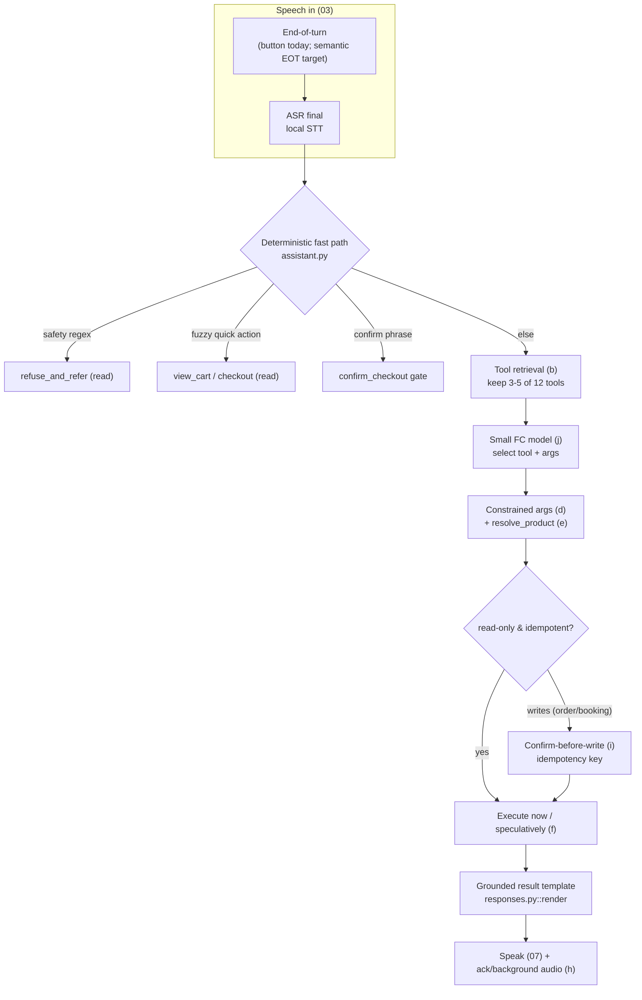
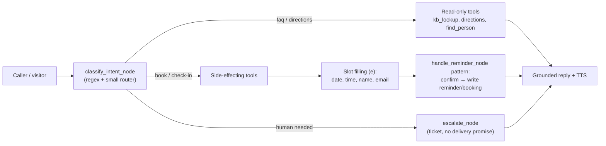

# 08 — Tool Calling and Task Agents

The shopping demo (`code/demo/`) and a planned receptionist agent both run an LLM that
chooses tools, fills arguments, and sometimes writes state (orders, bookings, reminders).
This chapter generalises the latency and safety optimizations from chapters
[01](01_BASELINE_AND_CURRENT_ARCHITECTURE.md)–[07](07_SPEECH_OUTPUT.md) to those agents:
cut the tools in the prompt, run read-only tools in parallel and speculatively while the
user is still speaking, replace model slot-filling with the deterministic resolver that is
already in the code, keep a hard confirm-before-write gate, and pick a small local
function-calling model per tier. The design target is the **two-silence** tool turn from
[02](02_LATENCY_COST_MODEL_AND_METRICS.md) §1: a short silence before an acknowledgement,
the tool running under speech, and no second model call just to narrate a write.

Scope note: `code/demo/` currently routes through **Groq** (`config.py::CHAT_MODEL =
openai/gpt-oss-120b`); that is the cloud comparison. Everything below is written for a
**local** function-calling model served by Ollama/llama.cpp on T0–T2.

## Recommendations by tier

| Technique | T0 (RTX 4060 8 GB) | T1 (16–24 GB) | T2 (40–80 GB) | Evidence of effect |
|---|---|---|---|---|
| Deterministic slot filling + fuzzy resolve before any LLM call (§e) | **Do first** — already coded (`shop.py::resolve_product`) | Do | Do | ~0 LLM calls on quick actions [Measured-here, `assistant.py`] |
| Dynamic tool retrieval / fewer tools in prompt (§b) | Do (12 → 3–5 tools) | Do for large tool sets | Do for large tool sets | prompt tokens −50%+, selection 13.62→43.13% [R802] |
| Spoken acknowledgement + background audio over the tool (§h) | **Do first** — perception win | Do | Do | fills 2nd silence [R02] |
| Speculative read-only tool calls during user speech (§f) | Do for `search`/`resolve` | Do | Do | removes a tool round-trip from the critical path [R17][R18] |
| Small local FC model (§j) | Hammer2.1-1.5b / xLAM-2-1b ⚠NC, or Qwen2.5-3B-Instruct (Apache) | xLAM-2-3b ⚠NC / Qwen2.5-7B | 8B+ FC fine-tune | BFCL / τ-bench [R74][R800][R801][R803] |
| Parallel / DAG tool execution (§c) | Low priority (tools are fast, mostly sequential dependencies) | Do when independent reads exist | Do | up to 3.7× latency, 6.7× cost vs ReAct [R69] |
| Constrained argument decoding: integer index / fuzzy-after-decode, **not** big enums (§d) | Do | Do | Do | enum grammar 2.6× slower decode [Measured-here, 01 §4.3] |
| Confirm-before-write + idempotency keys + injection defence (§i) | **Mandatory** — already coded | Mandatory | Mandatory | `shop.py::_write`, `nodes.py::handle_reminder_node` |
| MCP: local stdio, cache tool list, reuse session (§k) | Do | Do | Do | avoids per-turn connect cost [Measured-here, `mcp_client.py`] |

Legend: ⚠NC = non-commercial / research-only licence, review before deployment.

## a. Reference architectures

Both agents share one control loop: **classify → (retrieve tools) → select tool → fill
args → execute → confirm if writing → speak**. The current shopping loop
(`assistant.py::run_async`) is a bounded `for _ in range(MAX_ROUNDS)` loop
(`config.py::MAX_ROUNDS = 4`, `parallel_tool_calls=False`, `tool_choice="required"` on the
first round) over a real MCP stdio session.

Receptionist agent (appointments, visitor check-in, directions, call routing, FAQ). Its
tools map one-to-one onto the shopping pattern: read-only FAQ/directions/availability vs
side-effecting booking/check-in/routing. The confirm-before-write gate and ticket pattern
already exist in `IA/assistant/nodes.py::handle_reminder_node` and `escalate_node`.

Per-tier perceived-latency budget for a **read-only tool turn** (e.g. "what's in my cart?",
"is Dr Rao free at 3?"), extending the budget sheet in [02](02_LATENCY_COST_MODEL_AND_METRICS.md) §7.
Targets are [Estimated] planning goals; "today" is [Measured-here] where marked.

| Stage | Today T0 (shopping, Groq) | Target T0 (local) | Target T1 | Target T2 |
|---|---:|---:|---:|---:|
| End of turn | button + upload | 300–600 ms | 300–500 ms | 300–500 ms |
| Fast-path check (regex + fuzzy) | <5 ms [Measured-here, `assistant.py`] | <5 ms | <5 ms | <5 ms |
| Tool selection (model) | network RTT + decode | 0.3–1.0 s | 0.1–0.3 s | <0.1 s |
| Tool execution (MCP stdio read) | 10–60 ms [Measured-here, `mcp_client.py` traces] | 10–60 ms | 10–60 ms | 10–60 ms |
| TTS first audio | whole file (03/07 gap) | 0.2–0.5 s | 0.1–0.3 s | <0.1 s |
| **Perceived (read-only turn)** | — (voice not benchmarked) | **1–2 s** | **0.6–1 s** | **<0.6 s** |

A **write turn** (checkout, booking) adds the confirmation exchange and is intentionally not
optimised for raw speed; see §i.

---

## b. Dynamic tool selection / tool retrieval

**What.** Do not put every tool schema in the prompt. Retrieve the few tools relevant to
the user turn (semantic search over tool descriptions, or a rule map) and expose only those
to the model.

**Intuition.** Each tool schema costs prompt tokens and distracts selection. The shopping
server exposes **12 tools** (`mcp_server.py`; the demo filters out `confirm_checkout`, so
the model sees 11 — `assistant.py::allowed`). For 11 small tools this is cheap, but a
receptionist with dozens of tools, or an MCP host aggregating several servers, bloats the
prompt and lowers accuracy.

**Maths.** Prompt tokens for tool schemas ≈ Σ over exposed tools of (name + description +
JSON-schema tokens). From the one-LLM-call model in [02](02_LATENCY_COST_MODEL_AND_METRICS.md)
§2, prefill cost is `N_prompt / r_prefill`; on T0 `r_prefill ≈ 820 tok/s` [Measured-here,
01 §4.3], so trimming 1,000 schema tokens saves ≈1.2 s of prefill per call that is not
prefix-cached. Selection accuracy also rises as the candidate set shrinks (fewer confusable
options).

**Evidence.**
- RAG-MCP: semantic retrieval of relevant MCP tools **cuts prompt tokens by over 50%** and
  raises tool-selection accuracy from **13.62% to 43.13%** on their MCP stress test
  [Reported, R802, abstract fetched; model/dataset = their MCP benchmark].
- MCP-Zero (active tool discovery): **98% token reduction on APIBank** while keeping
  accuracy, selecting from ~3k candidates / 248.1k tokens [Reported, R804, snippet].
- Less-is-More (dynamic tool selection, fine-tuning-free): **execution time −70%, power
  −40%** on edge hardware with SoTA LLMs [Reported, R68, abstract fetched; DATE 2025].

**Where it fits.** `assistant.py::run_async` builds `tools = [...]` from
`discovered`/`schemas` and passes all of them every round. Insert a retrieval/rule step
that narrows `allowed` per turn. For the small 12-tool catalogue, a static rule map is
enough: safety-regex → `refuse_and_refer`; cart words → `view_cart`; price words →
`check_price`+`resolve_product`; area words → `calculate_required_quantity`. The demo
already does the extreme case (0 tools, direct call) for quick actions and safety.

**How to implement.** (1) Embed each tool description once at startup (reuse the e5-small
embedder from `IA/assistant/kb`, [04](04_RETRIEVAL_AND_KNOWLEDGE_BASE.md)); (2) at turn
start, retrieve top-k (k = 3–5) tools by cosine on the ASR transcript; (3) always include a
small fixed safety set (`refuse_and_refer`, `request_clarification`); (4) fall back to the
full set if retrieval confidence is low. Repo: RAG-MCP has no public code (abstract only);
implement with the existing embedder. Licence: n/a (own code).

**Expected effect.** T0: for the 12-tool demo, negligible token saving but a small
selection-accuracy gain [Estimated]. For a receptionist with 30+ tools or an aggregated MCP
host, prompt −30–50% and selection accuracy up materially [Reported ranges, R802/R804].
T1/T2: same accuracy gain; latency saving smaller because prefill is faster.

**Risks / interactions.** Retrieval can drop the tool the user actually needs → always keep
a low-confidence fallback to the full set. Narrowing must not remove the safety/clarify
tools. Does not touch grounding (`evidence.py::source_quote`) or the release-bound caches
(`cache.py`); it only changes which tools the model sees.

**How to measure.** Tool-selection accuracy and prompt-token count on a held-out set of
transcripts, varying k. Pass: selection accuracy ≥ full-prompt baseline at ≤50% of its
schema tokens. Link [12](12_EVALUATION_AND_BENCHMARKING.md).

---

## c. Parallel / DAG tool execution

**What.** When a turn needs several *independent* tool calls, plan them as a DAG and run
the independent branches in parallel instead of one ReAct step per call.

**Intuition.** Sequential reason-act per tool pays the model latency once per call. If calls
don't depend on each other (e.g. "price of urea and of DAP"), they can run together.

**Maths.** For n independent tools, sequential cost ≈ n·(t_model + t_tool); DAG cost ≈
t_plan + max_i(t_tool_i) + t_join. Speedup grows with n and with t_model.

**Evidence.** LLMCompiler (Planner + Task-Fetching Unit + parallel Executor): **up to 3.7×
latency speedup, 6.7× cost saving, ~9% accuracy improvement vs ReAct** across function-call
patterns; code is MIT [Reported, R69, abstract fetched]. LLM-Tool-Compiler fuses
heterogeneous tool calls for further parallelism [Reported, R70, snippet]. Parallel decoding
for function calling targets the decode step itself [Reported, R71, snippet].

**Where it fits.** `assistant.py::run_async` sets `parallel_tool_calls=False` and executes
one validated call per round (and explicitly rejects multi-call batches:
`"invalid or parallel tool request"`). That is deliberate for a *mutating* shopping loop.
DAG parallelism belongs only on **read-only** fan-out (several `check_price`/`get_product_details`
or receptionist `find_person`/`directions`).

**How to implement.** Keep the single-write invariant. Add a read-only planning branch:
if the model proposes multiple read tools, validate the whole batch (the code already parses
and schema-validates each) and `asyncio.gather` them over the one MCP session. Repo:
LLMCompiler `github.com/SqueezeAILab/LLMCompiler` (MIT) for the planner pattern; the MCP
session in `mcp_client.py::invoke` is already async.

**Expected effect.** T0: small — demo turns rarely need ≥2 independent tools, and MCP reads
are 10–60 ms [Measured-here]. T1/T2: up to the LLMCompiler range when a turn genuinely has
independent reads [Reported, R69]. Low priority relative to §b/§e/§f.

**Risks / interactions.** Never parallelise writes: the demo's batch rejection and
`shop.py::_write` idempotency assume one mutation per turn. Parallel reads must not race the
cart snapshot used by `checkout`/`confirm_checkout` (preview is cart-bound).

**How to measure.** Turn latency and task success on multi-tool queries, sequential vs DAG.
Pass: no accuracy regression, latency ≤ sequential. Link [12](12_EVALUATION_AND_BENCHMARKING.md).

---

## d. Constrained tool-argument decoding

**What.** Force arguments to a JSON schema / grammar so the model cannot emit malformed or
out-of-range values. The demo already validates arguments *after* decoding
(`mcp_client.py::invoke` → `jsonschema.validate`; `assistant.py` re-validates each call).

**Intuition.** Grammar-constrained decoding guarantees valid JSON and valid enums, removing
a retry. But a **large enum** (e.g. all valid product IDs) is expensive to mask per token on
this model's 248,320-token vocabulary.

**Maths / measurement.** [Measured-here, 01 §4.3]: a JSON schema with a **300-entry string
enum decoded at 157 ms/token vs 61 ms/token** without the enum — **2.6× slower** on T0 with
`qwen3.5:9b`. The large vocabulary makes per-token mask construction costly.

**Evidence.** XGrammar accelerates masked decoding and is the engine behind many servers
[Reported, R51, snippet]. The 2.6× local figure is the number that matters here.

**Where it fits.** `mcp_server.py` already constrains with Pydantic types: `Count = int in
[1,100]`, `unit = Literal[...]`, `ProductID = str(1..40)`. There is **no product-ID enum in
the decoder** today — IDs are resolved by `shop.py::resolve_product`, not enumerated in the
grammar. Keep it that way.

**How to implement (alternatives to a big enum).**
1. **Integer index**: expose a short numbered candidate list from `resolve_product` and have
   the model emit a small integer, then map index → product ID in code. Tiny enum, cheap mask.
2. **Fuzzy-match after decoding**: let the model emit a free-text `mention`; resolve with the
   existing `shop.py::fuzzy_match` (rapidfuzz, threshold 70). This is already the demo's path
   and tolerates STT noise (dhan↔dhaan).
3. Constrain only *structure and small enums* (units, categories) with grammar; never the ID
   universe. Engine: XGrammar (Apache-2.0, R51) or llama.cpp GBNF.

**Expected effect.** Avoiding a product-ID enum keeps decode near the free-text rate
(≈17.7 tok/s on T0) instead of ≈6.4 tok/s under a big enum [Measured-here, 01 §4.3] — i.e.
avoids the measured 2.6× penalty. T1/T2: the penalty is smaller in absolute ms but the index
approach is still preferable.

**Risks / interactions.** Fuzzy resolution can be ambiguous → `resolve_product` returns
`ambiguous` and the loop asks for clarification (`request_clarification`), which is the
grounded, safe behaviour. Grammar on the system prompt harms prefix reuse (01 §4.3,
[05](05_LLM_INFERENCE_AND_SERVING.md)); keep per-request grammar out of the cached prefix.

**How to measure.** Argument exact-match and decode tok/s with (a) big enum, (b) integer
index, (c) fuzzy-after-decode, on a transcript set with noisy product mentions. Pass:
exact-match ≥ enum baseline at ≥2× the decode speed. Link [12](12_EVALUATION_AND_BENCHMARKING.md).

---

## e. Deterministic slot filling / dialogue state tracking

**What.** Fill slots (product, quantity, unit, date, email) with rules and fuzzy matching;
call the LLM only for what rules cannot resolve.

**Intuition.** Most slots are regular. The demo already does spoken-number and package-word
mapping in the system prompt, but the deterministic layer can own them.

**Maths.** If a fraction f of turns is fully resolvable by rules, LLM calls per turn drop by
f. The demo's quick actions and safety path already give f > 0 with **zero** model calls
(`assistant.py`: `fuzzy_quick_action`, `SAFETY_PATTERN`, `is_confirmation`).

**Evidence.** Zero-shot slot-filling for industry assistants reaches usable accuracy with
small models/rules [Reported, R73, snippet]. The receptionist's date/email/name slots are
exactly this.

**Where it fits.**
- Shopping: `shop.py::resolve_product` / `fuzzy_match` (rapidfuzz, threshold 70) already
  resolve product mentions; `assistant.py::fuzzy_quick_action` / `is_confirmation`
  (thresholds 75 / 80) resolve cart/checkout/confirm without the model.
- Receptionist: mirror `IA/assistant/nodes.py::handle_reminder_node`, which deterministically
  validates `date.fromisoformat`, rejects past dates, checks `valid_email`, and only then
  asks the model/goes to confirm. `classify_intent_node` already short-circuits greetings,
  thanks, yes/no, and cancel before any routing call (optimization O1, 01 §3).

**How to implement.** Add rule extractors for numbers/units/dates/emails ahead of the tool
loop; pass resolved slots as tool arguments directly; only invoke the model when a slot is
missing or ambiguous. Reuse `rapidfuzz` (already a dependency, `requirements.txt`) and the
reminder node's validators. Licence: own code; rapidfuzz MIT.

**Expected effect.** T0: each fully rule-resolved turn removes 1–`MAX_ROUNDS` model calls.
On the shopping demo, "show cart"/"checkout"/confirmation already cost **0** model calls
[Measured-here, `assistant.py` quick-action/confirm branches]. Same on T1/T2.

**Risks / interactions.** Over-eager rules can mis-resolve → keep thresholds conservative
(the code's 70/75/80) and surface ambiguity instead of guessing (`resolve_product` returns
`ambiguous`). Negation guard is essential for confirmations (`is_confirmation` rejects
"nahi/mat/न"); do not weaken it.

**How to measure.** Rule-resolution coverage, slot exact-match, and false-resolve rate.
Pass: false-resolve rate ≈ 0 on the confirmation/negation set. Link
[12](12_EVALUATION_AND_BENCHMARKING.md).

---

## f. Speculative / streaming tool calls during user speech

**What.** Start **read-only, idempotent** tools as soon as the ASR partial makes the intent
likely, before the user finishes, and cancel if the final transcript disagrees.

**Intuition.** The second silence in a tool turn ([02](02_LATENCY_COST_MODEL_AND_METRICS.md)
§1) is tool time. If a read (search/resolve/availability) already ran during the user's last
words, its result is ready at end-of-turn.

**Maths.** If the read overlaps the tail of user speech of length t_tail and the read takes
t_read ≤ t_tail, the read is removed from the critical path (saving ≈ t_read + one model
round-trip for the read).

**Evidence.** Stream RAG triggers retrieval/tool use from streaming ASR and stabilises
tool-intent before the turn ends [Reported, R17/R18, snippets]. VoiceAgentRAG's dual-agent
design overlaps retrieval with dialogue to cut the RAG latency bottleneck [Reported, R19,
snippet].

**Where it fits.** The demo is strictly post-recording (`app.py::st.audio_input` → full
clip → `run_turn`), so there is **no** speculation today (gap, 01 §7). The streaming STT
service with partials and barge-in exists but is **not wired into Demo 2** (O18, 01 §3). The
read-only tools are already annotated: `mcp_server.py` marks `search_products`,
`resolve_product`, `get_product_details`, `check_price`, `view_cart`,
`calculate_required_quantity` with `ToolAnnotations(readOnlyHint=True)`.

**How to implement.** (1) Consume ASR partials (03); (2) when a partial resolves a product
with high fuzzy confidence, speculatively call `resolve_product`/`search_products`;
(3) on final transcript, reuse the result if the mention is unchanged, else discard;
(4) restrict strictly to tools with `readOnlyHint=True` and never to `add_to_cart`,
`checkout`, `confirm_checkout`. Use `asyncio` cancellation on the MCP session.

**Expected effect.** T0: removes one read round-trip from perceived latency on turns where a
product is named mid-sentence [Estimated; magnitude = t_read ≈ 10–60 ms + model round-trip].
Larger on T1/T2 where speech and model run concurrently on GPU.

**Risks / interactions.** Must be read-only and idempotent, or a cancelled speculation could
mutate state — the demo's `WRITE`/side-effecting tools are excluded by annotation. Barge-in
must cancel in-flight speculation. No effect on grounding or caches.

**How to measure.** Perceived latency and wasted-speculation rate (speculations discarded).
Pass: latency reduced with wasted-speculation rate below a set budget and **zero** state
mutations from speculation. Link [12](12_EVALUATION_AND_BENCHMARKING.md).

---

## g. Fast-talker / slow-thinker and conversational infill

**What.** A small fast model speaks immediately and keeps the floor while a larger/slower
process (retrieval, a bigger model, a write) completes; the two are stitched so the reply
stays coherent.

**Intuition.** Humans say "let me check…" and keep talking. The agent can emit a safe
acknowledgement and backchannel while the tool runs.

**Evidence.** Thinking-While-Speaking does inference-time knowledge transfer so a voice agent
can talk while a slower reasoner catches up [Reported, R20, snippet]. VoiceAgentRAG dual-agent
overlaps the two roles [Reported, R19, snippet]. Qwen-Audio-Agent reports mixed (interleaved)
execution of speaking and tool use [Reported, R72, snippet].

**Where it fits.** The demo has one model and one blocking `run_turn`; there is no fast/slow
split. The grounded result templates (`responses.py::render`) are the natural "slow" output;
a fixed acknowledgement is the natural "fast" output.

**How to implement.** Emit a templated acknowledgement (§h) at tool start; run the tool/model;
replace or append the grounded template when ready. Keep the acknowledgement content-free
("ek minute, dekh raha hoon") so it is never wrong. The receptionist can backchannel while
`find_person`/availability runs.

**Expected effect.** Perceived first-audio latency drops to the acknowledgement's TTS
first-chunk time rather than the full tool+model time [Estimated]. Same mechanism on all tiers.

**Risks / interactions.** The acknowledgement must not assert any fact (no "yes, it's in
stock" before the tool returns) or it breaks the no-unverifiable-claims posture (01 §6).

**How to measure.** Time-to-first-audio and user-rated naturalness. Pass: first audio within
the §a budget without any pre-tool factual claim. Link [12](12_EVALUATION_AND_BENCHMARKING.md).

---

## h. Spoken acknowledgements and background audio during tools

**What.** Play a short spoken "working on it" and/or ambient audio to fill the second silence
while a tool runs.

**Intuition.** A filled gap feels far shorter than silence; it also signals the system is
alive.

**Evidence.** The voice-agent latency playbook treats tool turns as two silences and
recommends filling the second with speech or background audio [Reported, R02, fetched].

**Where it fits.** Today the UI shows a text spinner ("काम हो रहा है / Working…",
`app.py`) but speaks only the final reply (`synthesize` runs after `run_turn`). The hook
exists: play a pre-synthesised acknowledgement clip at tool start.

**How to implement.** Pre-synthesise a few short Hindi/Chhattisgarhi acknowledgement WAVs
once with the local VITS voice ([07](07_SPEECH_OUTPUT.md)); play on tool start; cross-fade
into the grounded reply. Keep clips content-free. Licence: own audio from the existing VITS
checkpoint (`code/TTS/chattisgarhi-tts-models`).

**Expected effect.** Perceived latency improves even when wall-clock is unchanged
[Reported mechanism, R02]. Cheap on all tiers (pre-rendered).

**Risks / interactions.** Must not overlap/clip the real reply; barge-in should stop it.
No grounding impact.

**How to measure.** User-rated latency vs measured latency (perception gap). Pass: improved
perceived rating at equal wall-clock. Link [12](12_EVALUATION_AND_BENCHMARKING.md).

---

## i. Confirmation and safety for side-effecting tools

**What.** Writes (orders, bookings, emails, reminders) require explicit confirmation, an
idempotency key, and a human-handoff path; tool outputs are treated as untrusted
(prompt-injection defence).

**Intuition.** A voice slip or an STT error must never place an order or send an email. The
model must not be able to self-confirm.

**Evidence / repo (this is already implemented well).**
- **Model cannot confirm**: `assistant.py` removes `confirm_checkout` from `allowed`; the
  model never sees the confirmation tool. `confirm_checkout` needs a host capability
  (`CONFIRM_TOKEN`) absent to the model (`mcp_server.py`).
- **Preview-bound confirmation**: `shop.py::checkout` creates a `uuid4` token bound to the
  exact cart snapshot; `confirm_checkout` refuses on `stale_checkout` if the cart changed.
- **Explicit phrases, negation-guarded**: `is_confirmation` requires a fuzzy match to fixed
  confirm phrases (threshold 80) and rejects negations; a generic "yes" is insufficient
  (README).
- **Idempotency keys**: `shop.py::_write` hashes `[session_id, request_id|turn_id, name,
  args]` and replays the stored result, so a retried write (reconnect, double-submit) does
  not duplicate. Confirmation replays under `request_id = "checkout:" + token`.
- **Confirm-before-write for reminders**: `IA/assistant/nodes.py::handle_reminder_node`
  validates date/email, then returns a `confirmation` reply and only writes when
  `state["action_confirmed"]`. `escalate_node` saves a staff-review ticket without promising
  delivery and requires `action_confirmed`.
- **Scope refusal**: `SAFETY_PATTERN` + `refuse_and_refer` block diagnosis/dosage/pesticide
  advice before any cart mutation.

**How to implement (receptionist).** Reuse the same shape: a booking tool returns a
cart-like preview token bound to {person, date, slot}; `confirm_booking` is host-gated and
idempotent; past dates/invalid emails rejected deterministically; escalate to a human ticket
when the model is unsure. Idempotency key = hash(session, slot, person).

**Prompt-injection from tool outputs.** Tool results can contain adversarial text
(a product description, an FAQ snippet, an email body). Defences present/addable:
(1) the model consumes only **structured** fields, and the user-visible reply is built from
fixed templates (`responses.py::render`), not free model prose
(`assistant.py`: "Free-form final text is not displayed"); (2) `confirmation_token` is
stripped from anything the model sees (`mcp_client.py::invoke` filters it); (3) keep tool
outputs out of any instruction position; (4) for the receptionist, never let an FAQ/email
field re-enter as a tool-selection instruction.

**Expected effect.** No latency change; this is the correctness/safety floor. Unsafe-action
rate is the metric to drive to ~0.

**Risks / interactions.** Weakening the negation guard or exposing `confirm_checkout` to the
model would break the whole safety story. Idempotency depends on stable `turn_id`/`request_id`
(the app passes a fresh `uuid4` per submit, `app.py`).

**How to measure.** Unsafe-action rate (writes without valid confirmation), duplicate-write
rate under retries, injection-resistance on a red-team set. Pass: 0 unconfirmed writes,
0 duplicates, 0 successful injections. Link [12](12_EVALUATION_AND_BENCHMARKING.md).

---

## j. Small function-calling models per tier

**What.** Replace the cloud 120B router with a small **local** function-calling model sized
to the tier. BFCL [R74] and small-model studies give comparative accuracy.

**Evidence (verified).**

| Model | Size | Base | Reported result | Licence | Source |
|---|---|---|---|---|---|
| xLAM-2-fc-r | 1B / 3B / 8B / 32B / 70B (GGUF for 1B/3B/8B) | Qwen2.5 / Llama | 70B **τ-bench 56.2%** (> GPT-4o 52.9%); SoTA on BFCL v3 per card; 1B/3B specific numbers shown only as images | **CC-BY-NC-4.0 ⚠ research-only** | [R800, card fetched] |
| Hammer2.1 | 0.5B / 1.5B / 3B / 7B | Qwen2.5-coder | "best performance at comparable scales" on BFCL-v3 (table is an image); function-masking; integrated into Google AI Edge | **CC-BY-NC-4.0 ⚠** | [R801, card fetched] |
| ToolACE (8B) | 8B | Llama-3.1 | "even with only 8B parameters, SoTA on BFCL, rivaling GPT-4 models" | per card (check) | [R803, abstract fetched] |
| TinyLLM study | <1B vs 1–3B | TinyAgent/TinyLlama/Qwen/xLAM | medium (1–3B) **≫** ultra-compact (<1B): up to **65.74% overall, 55.62% multi-turn** with hybrid optimisation on BFCL | paper (CC) | [R76, abstract fetched] |

**Tier mapping.**
- **T0 (8 GB, ~5.4 GB free, 01 §4.3):** a 1–3B FC model in Q4 fits comfortably alongside
  speech. Permissive option: **Qwen2.5-3B-Instruct (Apache-2.0)** which supports tool calling;
  fine-tune later ([09](09_DISTILLATION_AND_FINE_TUNING.md)). Strong-but-NC options:
  Hammer2.1-1.5b / xLAM-2-1b (⚠ CC-BY-NC — not for commercial deployment).
- **T1:** xLAM-2-3b / Qwen2.5-7B-Instruct; headroom for grammar and a reranker.
- **T2:** 8B FC fine-tune (ToolACE-8B / Llama-xLAM-2-8b) with vLLM/SGLang batching
  ([10](10_THROUGHPUT_CONCURRENCY_AND_TELEPHONY.md)).

**Where it fits.** `config.py::CHAT_MODEL`. Swapping to a local model also removes the
network RTT and the provider-error handling (`assistant.py::provider_warning`) from the hot
path, and lets the fast-path/slot-filling (§e) carry most turns with no model call at all.

**How to implement.** Serve the chosen model locally (Ollama/llama.cpp GGUF; xLAM/Hammer
ship GGUF); keep `tools=[...]` and `parallel_tool_calls=False`; use the model's native tool
template. For xLAM, a vLLM tool-call parser plugin is provided (card). Verify tool-call
format against `mcp_client.py` validation.

**Expected effect.** Removes cloud dependency and RTT; accuracy per BFCL/τ-bench above.
Local decode on T0 ≈17.7 tok/s for a 9B (01 §4.3); a 1–3B model decodes several times faster
and leaves VRAM for speech [Estimated from the bandwidth model, 02 §2.1].

**Risks / interactions.** ⚠ xLAM-2 and Hammer2.1 are **CC-BY-NC-4.0 / research-only** — not
deployable commercially; prefer Apache-2.0 Qwen2.5 for production or fine-tune your own
([09](09_DISTILLATION_AND_FINE_TUNING.md)). 1B/3B exact BFCL numbers on the cards are images,
not text — re-read before quoting a specific figure. Smaller models need the §b/§d/§e scaffolding
(fewer tools, constrained args, rules) to hit usable accuracy.

**How to measure.** BFCL categories (simple, multiple, parallel, relevance, multi-turn) and
your own transcript set; tool-selection accuracy, argument exact-match, task success. Pass:
≥ the current cloud router on your set, locally. Link [12](12_EVALUATION_AND_BENCHMARKING.md).

---

## k. MCP best practices for latency

**What.** Prefer local **stdio** MCP, cache the tool list, and reuse one session per turn/
conversation instead of reconnecting.

**Evidence (repo).** `mcp_client.py::connect` spawns the server over **stdio**
(`StdioServerParameters(command=sys.executable, args=[mcp_server.py])`) — in-process, no
HTTP. It lists tools once per connect (`session.list_tools()`), caches `schemas`, and sets
`additionalProperties=False` on every schema. `assistant.py::run_async` records
`mcp_connect_ms` and tool `duration_ms` in traces [Measured-here].

**How to implement.**
1. **stdio over HTTP** for co-located servers (no network stack).
2. **Cache the tool list / schemas** across turns of a conversation; re-list only on server
   restart (RAG-MCP/MCP-Zero both reduce how much of that list reaches the model, §b).
3. **Reuse the session** across turns rather than `connect` per turn where the Streamlit
   lifecycle allows (the demo opens a session per `run_async`; the connect cost is captured
   in `mcp_connect_ms`).
4. **Batch read-only calls** on one session (§c) with `asyncio.gather`.

**Expected effect.** Avoids per-turn process spawn + initialize + list_tools. Magnitude is
the measured `mcp_connect_ms` per turn [Measured-here, varies]; same on all tiers.

**Risks / interactions.** A long-lived server must stay isolated per session identity (the
demo injects `DEMO_SESSION_ID`/`DEMO_TURN_ID` via env and never passes the API key to the
server — keep that). Cached tool lists must be invalidated on server version change.

**How to measure.** `mcp_connect_ms` and tool `duration_ms` with per-turn connect vs reused
session. Pass: lower connect overhead, no identity leakage. Link
[12](12_EVALUATION_AND_BENCHMARKING.md).

---

## Tool-call accuracy metrics (define here, run in 12)

| Metric | Definition | Pass criterion (example) |
|---|---|---|
| Tool-selection accuracy | fraction of turns where the correct tool (or correct "no tool") is chosen | ≥ cloud-router baseline on the local set |
| Argument exact-match | fraction of calls whose arguments equal the gold arguments after normalisation | ≥ baseline; higher with §d index/fuzzy |
| Task success | end-to-end: did the turn achieve the user goal (cart state / booking created / FAQ answered) | report with 95% bootstrap CI |
| Unsafe-action rate | writes executed without valid confirmation, or scope violations (diagnosis/dosage) | **0** |
| Duplicate-write rate | identical write committed more than once under retries | **0** (idempotency keys) |
| Injection-resistance | successful instruction-injection from tool outputs | **0** on red-team set |
| Perceived latency (read-only / write turn) | silence from EOU to first agent audio | within §a budget per tier |

Datasets: BFCL [R74] for selection/arguments; a project transcript set
(English/Hindi/Hinglish/Chhattisgarhi, with STT noise) for task success and safety; a
red-team set for injection. See [12](12_EVALUATION_AND_BENCHMARKING.md) for harness and the
reproducible tool-calling framework [R83].

---

## What we could not verify

- **xLAM-2 and Hammer2.1 exact 1B/3B BFCL scores**: the per-size BFCL tables on both model
  cards are rendered as **images**, so the specific small-model percentages were not readable
  as text. Verified: model sizes, bases, GGUF availability, licences (both **CC-BY-NC-4.0**),
  xLAM-2 70B τ-bench 56.2% (text). Re-read the leaderboard before quoting a 1B/3B number.
- **ToolACE-8B licence**: the paper abstract states the 8B/BFCL/GPT-4 claim [R803]; the exact
  weight licence on the HF repo was not fetched here — verify before deployment.
- **Less-is-More / RAG-MCP / MCP-Zero numbers** are from fetched **abstracts** (−70% exec time
  / −40% power; prompt −50%+ and 13.62→43.13%; 98% token cut on APIBank). They were not
  reproduced on this project's agents or hardware; treat as [Reported] on the authors' setups.
- **Streaming/speculative tool use (R17–R20, R72)**: cited from snippets/abstracts; no code
  was run. Their latency gains are not measured on T0.
- **Voice tool-turn latency on this project**: not benchmarked (no speech benchmark exists,
  01 §4.2); all §a "today" voice figures are gaps, and targets are [Estimated].
- **LLMCompiler 3.7×/6.7×/~9%** are the paper's cross-task maxima vs ReAct [R69]; the demo's
  single-write loop cannot use them for writes, so the realised gain here is read-only-only
  and unmeasured.
