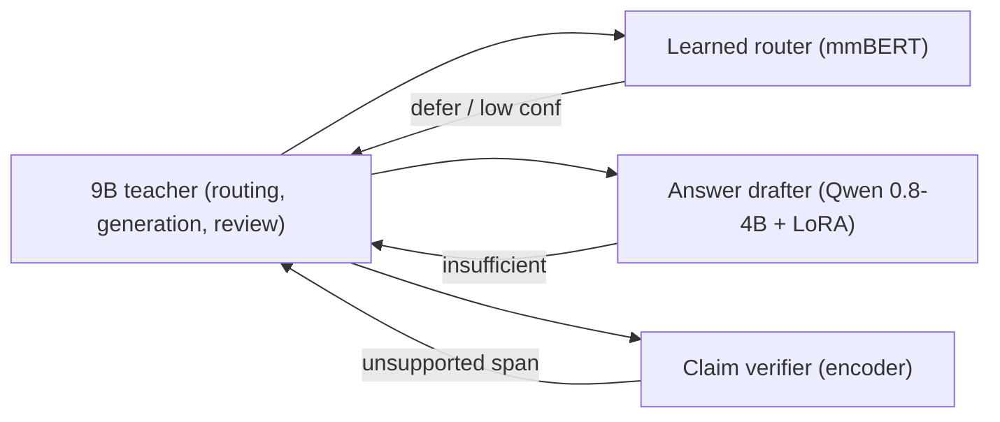
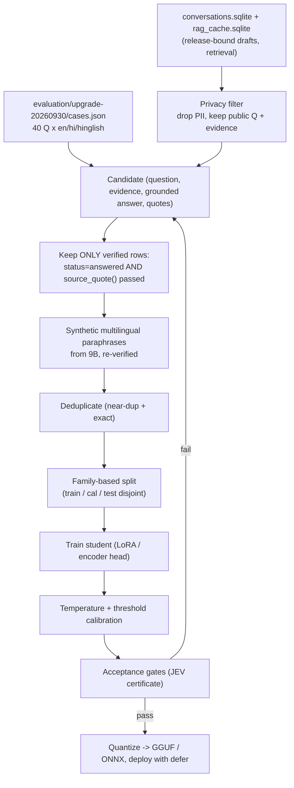

# 09 — Distillation and Fine-tuning

Replace the expensive 9B stages of the pipeline with small, locally trained students, one
narrow task at a time, each promoted only through a certificate like the JEV router's.
The project already proved this is feasible but hard: the learned English router
(`IA/assistant/jev`) cut the median only −4.11% at 36.36% coverage and raised p95, and
**failed its own latency gates** [Measured-here, `IA/docs/ENGLISH_ROUTER_SPEED.md`]. This
chapter keeps that discipline: students are trained on **verified** outputs only, split by
topic family to stop leakage, calibrated for ≥98% accepted precision, and allowed to defer
to the 9B whenever unsure. The target is to turn the three serial 9B calls (routing +
generation + review ≈ 18.4 s of an 18.7 s answered turn, 01 §4.1) into one small drafter,
one encoder verifier and a learned router, with the 9B kept as the escalation path.

## Recommendations by tier

| Rank | Technique | T0 (8 GB laptop) | T1 (16–24 GB) | T2 (40–80 GB) |
|---|---|---|---|---|
| 1 | Encoder claim verifier (ModernBERT/mmBERT/Ettin) replacing most of the 9B review call | **Train + deploy on CPU/GPU** — removes ~7.4 s review on accepted turns [Est.] | Deploy on GPU | Deploy, batch |
| 2 | Multilingual learned router (extend JEV with mmBERT/XLM-R to Hindi/Hinglish) | **Train on GPU, run on CPU worker** — removes ~3.8 s routing when confident [Est.] | same | same |
| 3 | LoRA/QLoRA answer drafter, small Qwen (0.8–4B), RAFT + verified triples | QLoRA 4-bit train (Unsloth), GGUF Q4 deploy; replaces 9B gen when confident | LoRA bf16 train; faster deploy | full/LoRA, batch serving |
| 4 | Smart-Turn v3 fine-tune for Hindi/Hinglish/CG end-of-turn | **Deploy ONNX on CPU (~12 ms [Reported])**; fine-tune on GPU | same | same |
| 5 | ASR (Whisper LoRA) / TTS (VITS) adaptation | Optional, deploy via CTranslate2/ONNX | GPU | GPU |

Evidence labels: **[Measured-here]**, **[Reported]** (`[Rxx]`, with conditions),
**[Estimated]** (derivation shown). See [00_INDEX.md](00_INDEX.md).

---

## 1. Why small students can match the 9B on these narrow tasks

The pipeline does not need a general chat model at each stage; it needs three narrow
functions — classify-and-rewrite, draft-from-evidence, and verify-against-evidence — on a
single institute domain. Published results show sub-1B models reach large-model quality on
exactly these shapes:

| Task shape | Small-model result | Conditions | Source |
|---|---|---|---|
| Grounding fact-check | Flan-T5-Large (770M) "the best fact-checking model with size < 1B and reaches GPT-4 performance" | LLM-AggreFact (11 datasets) | [R907, Reported, fetched] |
| Span hallucination detection | mmBERT-base encoder 0.642 span-F1 (0.528 on RAGTruth slice); EuroBERT up to **17 F1 points over GPT-4.1-mini** across languages | unified 10,698-ex v2 test set / RAGTruth; multilingual sets | [R906, Reported, fetched] |
| In-domain RAG answering | RAFT "consistently improves" over base + RAG-prompting | PubMed, HotpotQA, Gorilla | [R86, Reported, fetched abstract] |
| Reasoning distillation | 770M model beats a 540B LLM using less labelled data | task-specific distillation | [R908, Reported, snippet] |

The through-line: on a **closed, verifiable** task with a fixed evidence set, a 10–770M
encoder or a ≤4B drafter can match a far larger model, because the hard part (world
knowledge) is supplied by retrieval, not by the model's parameters. This is the same bet
the project already made with grammar-constrained quotes (01 §O7) and exact SQL cutoffs
(01 §O5): the model only has to copy and arrange verified spans.

---

## 2. Shared maths

### 2.1 LoRA / QLoRA

LoRA [R84] freezes a weight matrix $W_0 \in \mathbb{R}^{d\times k}$ and learns a low-rank
update:

$$
W = W_0 + \Delta W = W_0 + \frac{\alpha}{r} B A, \qquad B \in \mathbb{R}^{d\times r},\; A \in \mathbb{R}^{r\times k},\; r \ll \min(d,k)
$$

Only $A,B$ are trained: $r(d+k)$ parameters instead of $dk$. For a 4B model with
$d=k=3072$ attention projections, rank $r=16$ gives $16\cdot(3072+3072)=98{,}304$ params per
matrix versus $3072^2 = 9.4\text{M}$ — a **~96×** reduction per adapted matrix
[Estimated, from the formula]. Trainable fraction is typically well under 1% of the model.

QLoRA [R85] keeps the frozen base in **4-bit NF4** (information-theoretically optimal for
normally distributed weights) with double quantization, and back-propagates through it into
bf16 LoRA adapters. Memory for the frozen base drops ~4× versus fp16:

$$
M_{\text{base}} \approx N_{\text{params}} \cdot \frac{4\ \text{bits}}{8} + \text{(double-quant + paged optimizer overhead)}
$$

A 4B base at NF4 ≈ 2.0 GB of weights [Estimated: $4\times10^9 \cdot 0.5$ B]; adapters +
gradients + paged AdamW states for <1% of params are a few hundred MB, so QLoRA of a 4B
model fits the T0 8 GB budget once the display VRAM (~2.7 GB, 01 §4.3) is freed or training
runs with Ollama stopped. See §8 for feasibility.

### 2.2 Knowledge distillation

Logit (token-level) KD minimises temperature-softened KL between teacher $p_T$ and student
$p_S$ over the vocabulary at every position [R910]:

$$
\mathcal{L}_{\text{KD}} = \tau^2 \, \mathrm{KL}\!\big(p_T(\cdot\mid x;\tau)\,\|\,p_S(\cdot\mid x;\tau)\big) + \lambda\,\mathcal{L}_{\text{CE}}(y, p_S)
$$

Token-level KD needs the teacher's full logits, which Ollama does not expose. The practical
alternative is **sequence-level KD** [R909]: generate the teacher's *text* output, keep only
verified ones, and train the student with ordinary cross-entropy on those sequences. For
this project that is exactly the data pipeline in §3 — no logit access required.

### 2.3 Temperature scaling and selective escalation

A classifier's confidence is calibrated with a single scalar $T$ fit on held-out data
[R911], dividing logits before softmax: $\hat p = \mathrm{softmax}(z/T)$. The student then
*abstains* (defers to 9B) unless $\max_c \hat p_c \ge \theta$, with $\theta$ chosen on
calibration data to hold **precision ≥ 0.98** at the largest coverage — precisely the JEV
rule ("98% accepted precision", `IA/docs/OPEN_JEV.md`). Expected cost of a selective student:

$$
\mathbb{E}[t] = \text{cov}\cdot t_{\text{student}} + (1-\text{cov})\cdot(t_{\text{student}} + t_{\text{9B}})
$$

so coverage, not peak accuracy, drives the saving — which is why JEV's 36% coverage barely
moved the median.

---

## 3. Data pipeline (shared by all students)

Principles, each matched to existing code:

1. **Verified outputs only.** A training triple is accepted only when the turn's
   `status == "answered"` (`IA/assistant/llm.py::GroundedAnswer`) **and** every quote passed
   `IA/assistant/evidence.py::source_quote` (verbatim/structured match). This blocks teacher
   hallucinations from entering the student's targets (§7).
2. **Data sources.** Verified drafts and retrieval results already live in the
   release-bound caches `code/demo2/data/rag_cache.sqlite` and in
   `IA/assistant/cache.py::RagCache` (SQLite, TTL 1 h, LFU 2000). `conversations.sqlite`
   holds real turns. These are **described, never printed** here; they contain student
   messages and must be privacy-filtered before any export.
3. **Privacy filtering.** Strip names, IDs, phone numbers and free-text PII; keep only the
   public question text and the verified public evidence spans. `OPEN_JEV.md` states the JEV
   corpus used **no user conversations or student databases** — the safe default; real-log
   mining is a later, reviewed step.
4. **Synthetic multilingual paraphrases.** The 9B teacher generates Hindi/Hinglish/CG
   paraphrases of accepted English questions; each paraphrase is kept only if routed to the
   same `RoutingDecision` (`IA/assistant/llm.py:222`) and still answerable from the same
   evidence. This is how JEV built its "English, Hindi and Hinglish public helpdesk
   utterances" corpus (`OPEN_JEV.md`).
5. **Family-based splits to prevent leakage.** Assign whole topic families (including
   translations and template variants) to one split before training, as JEV does: "430
   authored families: 258 training, 65 validation, 107 calibration" with "Clean/mixed/
   translated relatives in one family" [Measured-here, `IA/docs/ENGLISH_ROUTER_RECOVERY.md`].
   Reusing a family across splits inflates accuracy and voids the gate.
6. **Scale honesty.** JEV's corpus was template-based and small; `ENGLISH_ROUTER_SPEED.md`
   calls for a "1,200-family expansion". Expect to author/verify thousands of families
   before a drafter student generalises beyond the 40-question eval set
   (`code/demo2/evaluation/upgrade-20260930/cases.json`).

How to measure the pipeline itself: track accepted-triple count, family disjointness
(a reviewer must reject inflated template sets, `ENGLISH_ROUTER_HOLDOUT.md`), and the
fraction of teacher outputs rejected by verification. Link
[12_EVALUATION_AND_BENCHMARKING.md](12_EVALUATION_AND_BENCHMARKING.md).

---

## 4. Technique: multilingual learned router / query rewriter

**What.** Extend JEV's MiniLM encoder (`IA/assistant/jev/english_v3_model.py::QueryRouter`,
heads for intent/department/English-defer/query-action) to a **multilingual** encoder so
Hindi and Hinglish turns can also skip the 3.8 s routing LLM call. Options: swap the pinned
`all-MiniLM-L6-v2` for `paraphrase-multilingual-MiniLM-L12-v2` [R902], XLM-R [R901], or
mmBERT-small (140M, 42M non-embed, 1800+ langs, 8192 ctx) [R900]. Alternatively a tiny
*generative* rewriter (≤0.6B, LoRA) that emits the `RoutingDecision.query` directly for the
contextual cases JEV currently defers.

**Intuition.** The routing call is a fixed-cost classifier dressed as generation. A 42–110M
encoder on CPU answers it in tens of ms; the 9B spends 3.8 s. Hindi/Hinglish are today
100% deferred, so a multilingual encoder enlarges coverage where the biggest saving sits.

**Maths.** §2.3 selective escalation. Replace $t_{\text{9B}}=3.8$ s with
$t_{\text{student}}\approx 0.02$–0.1 s on confident turns.

**Evidence.** mmBERT "significantly outperforms XLM-R on classification, embedding, and
retrieval" and is "significantly faster than any previous multilingual encoder" [R900,
Reported, fetched]; small variant is 42M non-embedding params. JEV English v3 at 36.36%
coverage gave only −4.11% median and +5.6% p95 [Measured-here, `ENGLISH_ROUTER_SPEED.md`] —
the cautionary baseline. Compare Laya [R29]: 33 ms typed decisions on a **T4 GPU**
[Reported], ~100 ms laptop-CPU per a third-party port, and an independent study finds it
**under-confident** [R30] — so Laya's calibration must be re-fit on project data, exactly
JEV's temperature-scaling step.

**Where it fits.** `IA/assistant/jev/runtime.py::try_route`,
`english_v3_model.py::QueryRouter.forward`; schema target
`IA/assistant/llm.py::RoutingDecision`. The CPU worker, fallback and metrics
(`classifier_calls`, `router_path`) already exist.

**How to implement.** (1) Add an mmBERT/XLM-R backend alongside the MiniLM encoder in the
`ENGLISH_BACKENDS` dispatch (`runtime.py`). (2) Author Hindi/Hinglish families (teacher-
paraphrased, re-verified, §3). (3) Train heads frozen + fine-tuned, calibrate per
`ENGLISH_ROUTER_SPEED.md`. (4) Keep defer-on-uncertainty. Repos/licences: mmBERT MIT [R900];
XLM-R MIT [R901]; multilingual-MiniLM Apache-2.0 [R902]; Laya licence **unstated `?`** [R29]
— flag before use.

**Expected effect.** Removes routing (01 §7 budget row): **0–100 ms** classifier vs 3.8 s on
covered turns, per tier T0/T1/T2 (CPU-bound, tier-insensitive). Turn-level saving scales
with coverage — Amdahl $p\approx0.20$ (02 §4): at 100% coverage ≈18.7→14.9 s [Estimated];
at JEV's 36% much less. **[Estimated]**, to be measured.

**Risks / interactions.** A wrong `query` corrupts retrieval scope and thus
`facts.sqlite` cutoff selection (exact category/round, 01 §O5) — mis-scoping is a critical
error, so route-level gates must keep "zero critical action/mixed-topic errors"
(`OPEN_JEV.md`). Latin script ≠ English; keep JEV's learned language gate. Does not touch
quote validation or caches.

**How to measure.** Accepted precision ≥98% on a fresh family-disjoint holdout, coverage,
median/p95 turn time over 3 full paired trials; zero critical errors
(`ENGLISH_ROUTER_HOLDOUT.md`). Link [12](12_EVALUATION_AND_BENCHMARKING.md).

---

## 5. Technique: fine-tuned answer drafter (LoRA/QLoRA + RAFT)

**What.** A small Qwen (0.8–4B) fine-tuned with LoRA/QLoRA on verified
(question, evidence, grounded-answer-with-quotes) triples to produce the `GroundedAnswer`
JSON directly, replacing the 7.2 s 9B generation call on confident turns. Train with the
**RAFT** recipe [R86]: include distractor documents the model must ignore, cite the correct
span verbatim, and emit a chain-of-thought-style rationale. Optionally add **Self-RAG**
reflection tokens [R87] (`[Retrieve]`, `[IsSup]`) so the drafter emits its own
"insufficient" signal.

**Intuition.** The 9B regenerates the answer twice (gen + review, 01 §4.1). If the drafter
only copies and arranges verified spans — which RAFT explicitly trains for — a 1–4B model
suffices, and decoding is memory-bound (02 §2.1) so a 4× smaller model decodes several×
faster on the same VRAM.

**Maths.** LoRA/QLoRA §2.1. Decode time $\propto$ resident weight bytes (02 §2.1): a 4B Q4
(~2.4 GB) fully on the 8 GB GPU decodes faster than the partly-CPU 9B (~17.7 tok/s measured,
01 §4.3). RAFT objective = cross-entropy over the gold answer with a fraction of distractor
docs in context.

**Evidence.** RAFT "consistently improves the model's performance across PubMed, HotpotQA,
and Gorilla" by training to ignore distractors and cite verbatim [R86, Reported, fetched
abstract]; Apache-2.0 code under Gorilla. QLoRA fine-tunes quantized LLMs with 4-bit NF4 and
bf16 adapters [R85, known]. Self-RAG MIT [R87]. No project-local drafter has been trained —
this is a proposal, not a measurement.

**Where it fits.** `IA/assistant/nodes.py::generate_answer_node` and the
`IA/assistant/llm.py::generation_schema` / `evidence_spans` grammar; drafter must still emit
quotes drawn from the real `evidence_spans` enum (01 §O7) so `source_quote` can validate.

**How to implement.** (1) Build triples (§3). (2) QLoRA-train on T0 with Unsloth [R88]
(§8), base e.g. Qwen3.5-4B. (3) RAFT: mix 1 golden + k distractor chunks from the same
release; keep answers that pass `source_quote`. (4) Export GGUF Q4 (§9), serve via the same
Ollama path with `stream:false` kept. (5) Gate behind draft-cache + defer-to-9B on `status
== insufficient` or low self-confidence. Licences: PEFT Apache-2.0 [R84]; QLoRA MIT [R85];
Unsloth **Apache-2.0 core, AGPL-3.0 Studio UI ⚠** [R88, fetched] — use the Apache core only.

**Expected effect** (generation-to-first-sentence budget row, 01 §7):

| Tier | Drafter | Expected gen latency | Label |
|---|---|---|---|
| T0 | Qwen 1.5–4B Q4, GGUF, partly GPU | ~2–4 s whole JSON vs 7.2 s (9B) | [Estimated] |
| T1 | 4B bf16 fully on GPU | ~0.5–1.5 s | [Estimated] |
| T2 | 4B batched (vLLM) | ~0.3–0.8 s/stream | [Estimated] |

All [Estimated] from the decode-bandwidth model (02 §2.1); replace by measurement.

**Risks / interactions.** A drafter that paraphrases evidence can **break grounding**: it
must only quote spans from the enum so `evidence.py::source_quote` still rejects
fabrications. It can inherit teacher errors (§7). It must not invent `facts.sqlite` cutoffs —
keep the exact-SQL sidecar (01 §O5) upstream of the drafter, and keep the deterministic
critical-policy drafts (01 §O6) for policy-bound questions. Release-bound draft cache
(`cache.py`) keys must include the student's artifact ID so a model swap invalidates stale
drafts.

**How to measure.** Answer accuracy on `cases.json` `required_terms` (e.g. `"1,81,000"`),
quote-validation pass rate (must stay 100%), claim-level support audit (§7), latency per
tier. Link [12](12_EVALUATION_AND_BENCHMARKING.md) and [06](06_VERIFICATION_AND_CACHING.md).

---

## 6. Technique: fine-tuned encoder claim verifier (replace most of the 9B review)

**What.** A token-classification encoder (ModernBERT [R903], Ettin [R904], or mmBERT [R900])
fine-tuned to flag answer spans unsupported by the retrieved evidence — a project-local
LettuceDetect/MiniCheck. It runs on CPU in milliseconds and replaces the 7.4 s 9B review on
the common case, escalating to the 9B only when it flags a span.

**Intuition.** Review is a verification task, and §1 shows encoders match GPT-4-class judges
on it. Verification is cheaper than generation because it is one forward pass over a short
sequence, not autoregressive decoding.

**Maths.** Per-token support probability $p(\text{supported}\mid \text{token}, \text{doc})$;
flag span if any token's $p<\theta$. Selective escalation §2.3; keep precision high so a
missed hallucination is rare, accepting more 9B escalations (lower coverage) to buy safety.

**Evidence.**
- MiniCheck Flan-T5-Large (770M) "reaches GPT-4 performance" at <1B; trained on **14K
  synthetic rows (7K C2D + 7K D2C)**; Apache-2.0 code (Bespoke-7B needs a commercial
  contact ⚠) [R907, Reported, fetched].
- LettuceDetect v2 **mmBERT-base 0.642 span-F1** (0.528 RAGTruth slice); EuroBERT up to **17
  F1 points over GPT-4.1-mini**; training recipe = ModernBERT token classification on
  RAGTruth, **6 epochs, batch 8, one A100** [R906, Reported, fetched]; MIT.
- TinyLettuce Ettin 17M/32M/68M variants + a synthetic hallucination-generation pipeline
  [R905, Reported, fetched]; MIT — small enough for CPU-only (01 CPU-only tier).

**Where it fits.** After `nodes.py::generate_answer_node`, in front of / replacing the 9B
review branch; cross-checks against the same retrieved chunks that feed
`evidence.py::source_quote`. The verbatim quote check stays as a hard gate; the encoder adds
**semantic** support that quote-matching cannot (a correct quote used to support a wrong
claim).

**How to implement.** (1) Build (claim, evidence, label) rows from verified vs
deliberately-corrupted answers (the TinyLettuce generation pipeline [R905] or C2D/D2C
[R907]). (2) Fine-tune ModernBERT-base/mmBERT for token classification (recipe above). (3)
Calibrate threshold for precision ≥98% recall of unsupported spans on project data. (4)
Export ONNX [R915], run on the CPU worker. (5) Escalate flagged answers to the 9B review.
Licences: LettuceDetect MIT [R906], MiniCheck Apache-2.0 [R907], ModernBERT Apache-2.0
[R903], Ettin/mmBERT MIT [R900][R904].

**Expected effect** (verification budget row, 01 §7): review **~0.05–0.5 s encoder** +
selective 9B vs 7.4 s always-9B. On the measured mix (78/120 answered turns ran the review,
01 §4.1) removing it on, say, 80% of answered turns saves ≈0.8·7.4 ≈ 5.9 s on those turns
[Estimated]. Tiers: T0 CPU/GPU encoder; T1/T2 GPU/batched, <0.1–0.3 s.

**Risks / interactions.** A miss lets a hallucination through — this is the safety-critical
student, so set the threshold conservatively and keep the 9B as backstop. mmBERT/ModernBERT
cover Hindi/Hinglish (1800+ langs [R900]) but **Chhattisgarhi coverage is unverified** — must
be measured before trusting CG verdicts. Does not change caches or SQL; it reads the same
evidence the quote check uses.

**How to measure.** Span-F1 and support-recall on a project RAGTruth-style set; end-to-end
hallucination rate on `cases.json` with human claim audit; the "no unverifiable quotations"
standard (01 §6) upgraded toward claim-level support. Link
[06](06_VERIFICATION_AND_CACHING.md), [12](12_EVALUATION_AND_BENCHMARKING.md).

---

## 7. Avoiding teacher-error inheritance

Sequence-level KD copies the teacher's mistakes. Guards, all available in the repo:

- **Train only on verified rows** (§3): `status == answered` + `source_quote` pass. A turn
  the teacher got wrong but that failed verification never becomes a target.
- **Independent test labels.** JEV authored test labels in code, "not copied from the
  teacher" (`OPEN_JEV.md`) — mirror this so the gate is not graded by the teacher.
- **Claim-level audit before promotion.** `ENGLISH_ROUTER_SPEED.md` records that even with
  "zero new automated failures" a human source review *failed* (omitted CG-quota conditions,
  fee period). Automated quote-matching "is not factual review" (`OPEN_JEV.md`). Keep the
  human source-review gate.
- **Keep deterministic facts upstream of the student**: exact SQL cutoffs (01 §O5) and
  critical-policy drafts (01 §O6) must not be delegated to a learned model.

---

## 8. Training feasibility on T0 vs T1/T2

The JEV encoder+heads is **22,719,376 parameters** and loaded on the RTX 4060 CUDA using
"about 101 MiB of allocated CUDA memory" for a forward-only batch of 16 (training memory not
measured) [Measured-here, `ENGLISH_ROUTER_RECOVERY.md`]. Encoder students are therefore
clearly trainable on T0 — JEV already trains with `--device cuda` and runs inference on a
CPU worker to coexist with Ollama on the 8 GB GPU (`OPEN_JEV.md`).

| Student | T0 (8 GB, Unsloth [R88]) | T1 (16–24 GB) | T2 (40–80 GB) |
|---|---|---|---|
| Router/verifier encoder (≤310M) | Fits easily; train on GPU, infer CPU | trivial | trivial |
| Drafter LoRA 0.8–1.5B | QLoRA 4-bit, free display VRAM or stop Ollama | LoRA bf16 | full FT |
| Drafter QLoRA 4B | Feasible: NF4 base ~2.0 GB [Est.] + adapters/paged AdamW; Unsloth "70% less VRAM" [R88, Reported, fetched] | comfortable | fast |

Unsloth README [R88, fetched]: "Fine-tuning … 2× faster with 70% less VRAM with no accuracy
loss"; the **Qwen3.5 (4B)** free notebook is listed "1.5× faster, 60% less" memory. Licence
is dual: **Apache-2.0 core, AGPL-3.0 Studio UI ⚠** — train with the Apache core library.
Time is unmeasured here; treat Unsloth's multipliers as planning numbers to confirm on T0.

Constraint: T0 cannot train a QLoRA 4B drafter *and* serve Ollama simultaneously (8 GB).
Train with Ollama stopped (documentation task — not done here), or train on T1/T2 and deploy
the GGUF on T0.

---

## 9. Quantization-aware deployment

- **Drafter → GGUF.** Export LoRA-merged weights to GGUF Q4_K_M via llama.cpp/Unsloth
  [R914][R88] and serve through the existing Ollama path (`llm.py::_invoke_local`,
  `stream:false` preserved). Keep the span-enum grammar (01 §O7) — note it cost 2.6× decode
  on the 9B (01 §4.3); re-measure on the small model, it may be cheaper relative to a shorter
  base latency.
- **Encoders → ONNX.** ModernBERT/mmBERT/Ettin and Smart-Turn export to ONNX for CPU
  inference [R915]; Smart-Turn v3 already ships int8 ONNX (8 MB) [R04/R905 context].
- **Artifact binding.** Deploy behind the JEV-style certificate: checksum weights/tokenizer/
  thresholds and bind them to the passing evaluation/benchmark (§10). Any recalibration
  "changes the artifact identity and invalidates older activation records" (`OPEN_JEV.md`).

---

## 10. Acceptance gates (mirror the JEV certificate)

Promote any student only with a certificate like
`IA/assistant/jev/runtime.py::activation_valid`, which requires `activation.json`,
`evaluation.json`, `benchmark.json`, matching artifact hashes, `evaluation_kind ==
"final_holdout"`, `independent_human_review == true`, and passing quality + benchmark checks.
Concrete thresholds already in use (`OPEN_JEV.md`, `ENGLISH_ROUTER_SPEED.md`):

| Gate | Threshold | Applies to |
|---|---|---|
| Accepted precision | ≥ 98% on fresh family-disjoint holdout | router, verifier |
| Critical errors | 0 (action/mixed-topic/scope) | router |
| Coverage | ≥ 15% | router |
| Median latency improvement | ≥ 10% | any latency-claiming student |
| p95 regression | ≤ 5% | any (JEV v3 failed: +5.6%) |
| New behaviour failures | 0 | any |
| Human source review | passed (recorded reviewer+date) | drafter, verifier |

A student that improves p50 but regresses p95 (02 §5) fails, as JEV v3 did.

---

## 11. Distillation roadmap with per-stage expected savings

| Stage | Student | Budget row (01 §7) moved | Expected saving on an answered turn | Label |
|---|---|---|---|---|
| 0 | Data store | — | enables all later stages | — |
| 1 | Encoder verifier | Verification 7.4 s → ~0.1–0.5 s + selective 9B | ~5–7 s on turns the encoder clears | [Estimated] |
| 2 | Multilingual router | Routing 3.8 s → ~0–0.1 s | up to ~3.7 s × coverage | [Estimated] |
| 3 | LoRA drafter | Generation 7.2 s → ~2–4 s (T0) | ~3–5 s when confident | [Estimated] |
| 1+2+3 | combined | three 9B calls → one small drafter + encoder + router | answered turn ≈18.7 s → ~4–6 s (T0) | [Estimated, Amdahl 02 §4] |

Order rationale: verifier first (biggest single saving, safety-critical, cheapest to train);
router second (reuses existing JEV machinery); drafter last (hardest to generalise, needs the
most verified data). Combined estimate aligns with 02 §4's "all three together ≈ 4–5 s".

---

## 12. Optional: ASR / TTS adaptation (brief)

- **ASR.** LoRA fine-tune `faster-whisper small` (01 ASR path) on Hindi/Hinglish/hne using
  AI4Bharat IndicVoices-style data [R916] via PEFT [R912]; deploy with CTranslate2/ONNX. No
  WER baseline exists (01 §6), so adaptation gain is unmeasurable until a WER benchmark runs
  ([12](12_EVALUATION_AND_BENCHMARKING.md)). See [03](03_SPEECH_INPUT_AND_TURN_TAKING.md).
- **End-of-turn.** Fine-tune **Smart-Turn v3** (Whisper-Tiny encoder + linear head, **8M
  params, 8 MB int8 ONNX, ~12 ms CPU** [R04, blog title; R905 context, fetched]) on
  Hindi/Hinglish/CG turn-end audio; it already markets as multilingual semantic VAD. Deploy
  on the CPU worker; see [03](03_SPEECH_INPUT_AND_TURN_TAKING.md).
- **TTS.** VITS fine-tune of the existing Chhattisgarhi checkpoints
  (`code/TTS/chattisgarhi-tts-models`) is a separate data-heavy effort; VITS code MPL-2.0
  [R67]. See [07_SPEECH_OUTPUT.md](07_SPEECH_OUTPUT.md).

---

## What we could not verify

- **No project student was trained or benchmarked for this chapter.** All latency savings in
  §4–§11 are [Estimated] from the cost model (02) and the JEV baseline; none is
  [Measured-here] for a drafter/verifier.
- **Unsloth time/VRAM multipliers** ("2× faster, 70% less"; 4B "1.5×, 60%") are the vendor
  README [R88, fetched]; not reproduced on T0. QLoRA-4B-on-8 GB feasibility is argued from
  the NF4 size estimate, not a run.
- **Chhattisgarhi coverage** of mmBERT/ModernBERT/Smart-Turn is unverified; 1800+ languages
  [R900] does not guarantee usable `hne` quality.
- **Smart-Turn ~12 ms** is from the Daily/Pipecat blog title [R04 link, R905 context]; not
  measured on this laptop, and per-language turn-end accuracy for Hindi/Hinglish/CG is
  unverified.
- **Laya 33 ms / ~100 ms** figures are a T4 GPU result and a third-party port [R29][R30], not
  tested here; its calibration caveat [R30] is from the abstract (`snippet`).
- **Real conversation-log mining** (`conversations.sqlite`) was not performed; privacy
  filtering is described, not executed. JEV deliberately used no user data.
- **Teacher (9B) answer quality as a KD source** is bounded by the human review that *failed*
  in `ENGLISH_ROUTER_SPEED.md`; the verified-only filter mitigates but does not eliminate
  this.
