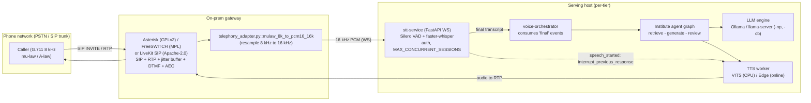

# 10 — Throughput, Concurrency and Telephony

How the system goes from one user at a time to many, and how it answers a phone call. The
current design serves exactly one turn at a time (`IA/assistant/llm.py::_invoke_local` holds
`_LOCAL_LOCK` for every local model call), so capacity is set by service time, not by load.
This chapter derives capacity from queueing theory against the measured ~17–19 s answered
turn ([01](01_BASELINE_AND_CURRENT_ARCHITECTURE.md) §4.1), shows the levers that raise it
(continuous batching, parallel slots, prefix sharing, GPU co-residency), and specifies a
fully local telephony path (SIP → ASR → agent → TTS) with its security and observability
gaps. Numbers are labelled [Measured-here] / [Reported] / [Estimated]; see
[02](02_LATENCY_COST_MODEL_AND_METRICS.md) for the equations.

Paths are relative to the repository root (`Minor/`). `IA/` abbreviates
`code/Institute-voice-agent/institute-assistant/`.

## Recommendations by tier

| Tier | Do first | Expected effect | Evidence |
|---|---|---|---|
| **T0** (laptop, 8 GB) | Keep one-worker admission queue (`jobs.py`); add short-turn priority + deadline-aware shedding; do **not** enable Ollama parallelism (it multiplies KV/context RAM the model cannot spare) | ~**3–3.5 answered turns/min**, no overload collapse | [Estimated] §1; [R1000] |
| **T0→T1** | Move display off the 4060 to free ~2.7 GB VRAM so the model fits fully on GPU; then enable 2 slots | decode ~17→~32 tok/s ⇒ turn-time −35–45%; ~2× concurrent | [Estimated] §4, [02](02_LATENCY_COST_MODEL_AND_METRICS.md) §2.1 |
| **T1** (16–24 GB) | llama-server with `-np 2–4 -cb` (continuous batching) + shared system-prompt prefix | **2–4× aggregate throughput** at similar p50 | [Reported] vLLM 2–4× [R1008]; [R1001] |
| **T2** (40–80 GB) | vLLM/SGLang: PagedAttention + RadixAttention prefix cache + chunked prefill; disaggregate prefill/decode only at scale | **up to 6.4×** throughput (RadixAttention) | [Reported] [R1007][R1008] |
| **Telephony (all)** | Local Asterisk ⚠(GPLv2) or FreeSWITCH (MPL) → μ-law 8 kHz → resample 16 kHz (`telephony_adapter.py`) → stt-service → agent; LiveKit SIP (Apache-2.0) if WebRTC-native | fully local phone calls; cloud trunks only as labelled comparison | [R1004][R1005][R1006] |
| **Security (all)** | Add auth + TLS + rate limiting before any non-localhost exposure (Streamlit app has none) | closes the open-endpoint risk | code: `OPERATIONS.md`; [R1001] |

## 1. Why one-at-a-time serving limits capacity

### 1.1 The model is a single server

`IA/assistant/llm.py` defines `_LOCAL_LOCK = RLock()` and `_invoke_local` runs its entire
body — `api/tags`, `api/chat`, parse — inside `with _LOCAL_LOCK`. Demo 2 reinforces this
above the model: `code/demo2/jobs.py::JobManager` starts exactly one reasoning worker
(`Thread(target=self._loop, name="demo-reasoning")`) and one speech worker
(`ThreadPoolExecutor(max_workers=1)`). `submit()` also enforces at most one outstanding
request per conversation (`"conversation_busy"`). So the whole stack is a **single server**:
turns are processed strictly in order, one at a time. **[Measured-here, `jobs.py`, `llm.py`]**

### 1.2 Little's Law and utilisation

For a stable queue, the mean number in system is **L = λ·W** [R1002], where λ is arrival
rate (turns/s) and W is mean time in system (wait + service). Utilisation of a single
server is **ρ = λ/μ = λ·S**, where μ = 1/S is service rate and S the mean service time. A
single server is stable only while ρ < 1, i.e. **λ < 1/S**.

With the measured answered-turn mean S ≈ 18.7 s ([01](01_BASELINE_AND_CURRENT_ARCHITECTURE.md)
§4.1), the hard ceiling is **[Estimated]**:

$$
\lambda_{\max} = \frac{1}{S} = \frac{1}{18.7\text{ s}} \approx 0.0535\text{ turns/s} \approx 3.2\text{ turns/min} \approx 193\text{ turns/hour}.
$$

That is a *saturation* bound (ρ→1), where waiting time diverges. A usable operating point
keeps ρ ≤ 0.7, i.e. **≈ 2.2 turns/min (≈ 135 turns/hour)** before queues grow painful.

### 1.3 Waiting time: M/M/1 vs M/M/c

Treating arrivals as Poisson and service as exponential (a planning approximation; real
service time is less variable, so these are pessimistic), the M/M/1 mean waiting time in
queue is [R1003]:

$$
W_q^{(1)} = \frac{\rho}{\mu - \lambda} = \frac{\rho}{\mu(1-\rho)} = \frac{\rho\,S}{1-\rho}.
$$

Worked **[Estimated]** at S = 18.7 s:

| ρ (load) | λ (turns/min) | M/M/1 mean queue wait $W_q$ | Mean total W |
|---:|---:|---:|---:|
| 0.3 | 0.96 | 8.0 s | 26.7 s |
| 0.5 | 1.60 | 18.7 s | 37.4 s |
| 0.7 | 2.25 | 43.6 s | 62.3 s |
| 0.9 | 2.89 | 168 s | 187 s |

At ρ = 0.7 the mean wait already exceeds the demo's **60 s queue timeout**
(`QUEUE_TIMEOUT_SECONDS`, `settings.py`), so callers are shed rather than served — the
system fails safe but at low load.

Adding servers helps super-linearly. With **c** identical servers (M/M/c), waiting time is
governed by the Erlang-C probability $P_{\text{wait}}=C(c,a)$ with offered load $a=\lambda/\mu$ [R1003]:

$$
W_q^{(c)} = \frac{C(c,a)}{c\mu - \lambda}, \qquad
C(c,a) = \frac{\dfrac{a^c}{c!}\dfrac{1}{1-\rho}}{\sum_{k=0}^{c-1}\dfrac{a^k}{k!} + \dfrac{a^c}{c!}\dfrac{1}{1-\rho}},\quad \rho=\frac{a}{c}.
$$

Example **[Estimated]**: at λ = 2.25 turns/min and S = 18.7 s, offered load a = ρ·c. With
**c = 2** servers each at S = 18.7 s, ρ = 0.35 per server; Erlang-C gives $W_q^{(2)}≈3.9$ s,
an order of magnitude below the single-server 43.6 s at the same arrival rate. **Two slots
do far more than double the comfortable throughput** because they cut queueing delay, not
just service rate. This is the quantitative case for §2–§3.

### 1.4 Admission control, deadlines and short-turn priority (mostly already built)

`jobs.py` already implements overload protection — this chapter's job is to tune it, not
replace it:

| Mechanism | Where | Behaviour |
|---|---|---|
| Bounded FIFO, capacity 3 + executing | `JobManager.submit` → `cfg.QUEUE_CAPACITY` | 4th waiter raises `"busy"`, counter `overload` |
| One request per conversation | `submit` (`"conversation_busy"`) | prevents a single user flooding the queue |
| Queue deadline 60 s | `snapshot`/`_loop` vs `QUEUE_TIMEOUT_SECONDS` | stale waiters fail `queue_timeout` before any model work |
| Turn deadline 120 s | `operations.py::Operation.check` vs `TURN_TIMEOUT_SECONDS` | `deadline_exceeded`; checked between stages (native calls not interruptible) |
| Speech budget 45 s | `_speak` vs `EDGE_TIMEOUT_SECONDS` | bounds TTS tail |
| Admit before STT/LLM | `submit` runs before `_run` transcribes | sheds load *before* spending compute |

Two cheap, local improvements, documentation-only to propose:

- **Short-turn priority.** Regex/learned-router turns (greetings, thanks, yes/no, cutoff
  lookups — [01](01_BASELINE_AND_CURRENT_ARCHITECTURE.md) O1–O3, O5) finish in ≪1 s and
  need 0 LLM calls. A two-class queue (a second `deque` drained first) lets these jump the
  line, so a 20 s knowledge turn does not block a 50 ms "thanks". Expected effect
  **[Estimated]**: p50 wait for trivial turns from "behind a 18 s turn" to ≈0; no change to
  heavy-turn throughput.
- **Deadline-aware shedding by predicted service time.** The token-budget estimate already
  computed in `llm.py::prepare_payload`/`prompt_tokens` plus the §1.2 bound lets `submit`
  reject a turn whose expected completion exceeds its remaining budget, instead of admitting
  it and timing out at 120 s. Non-destructive: it only changes which turns get a fast
  `"busy"`.

> Grounding is unaffected by any §1 change: admission/priority never touch
> `evidence.py::source_quote`, the release-bound caches in `cache.py`, or the exact SQL
> cutoffs in `facts.sqlite`. They reorder *when* turns run, not *what* a turn computes.

## 2. Parallel slots in the current engines (Ollama / llama-server)

### What
Ollama and llama-server can process more than one request against **one loaded model** by
allocating independent "slots", each with its own KV/state, and interleaving their decode
steps. This is cheaper than loading the model twice.

### Intuition
Decoding is memory-bandwidth-bound ([02](02_LATENCY_COST_MODEL_AND_METRICS.md) §2.1): one
stream leaves the GPU's compute idle while weights stream in. Batching several streams reads
each weight once and amortises it across sequences, so aggregate tokens/s rises until
compute- or bandwidth-saturated. The cost is extra memory per slot.

### Maths / knobs (verified 2026-10-05)
- **Ollama** [R1000]: `OLLAMA_NUM_PARALLEL` (default **1**) = parallel requests per model;
  `OLLAMA_MAX_LOADED_MODELS` (default **3×GPUs or 3**); `OLLAMA_MAX_QUEUE` (default **512**),
  503 when exceeded. Critically: *"Parallel request processing … results in increasing the
  context size by the number of parallel requests"* and *"Required RAM will scale by
  `OLLAMA_NUM_PARALLEL` × `OLLAMA_CONTEXT_LENGTH`."* So 4 parallel × 8192 ctx behaves like a
  32K context allocation.
- **llama-server** [R1001]: `-np, --parallel N` server slots (default auto); `-cb` continuous
  batching (default **enabled**); `--kv-unified-per-slot N` sets per-slot context (shared KV
  pool sized to `n_parallel·N`); context checkpoints per slot default **32**
  (`-ctxcp`). KV cache memory grows with slots.

Per-slot memory for Qwen3.5-9B is special ([02](02_LATENCY_COST_MODEL_AND_METRICS.md) §3):
the attention KV cache is small (≈256 MiB at 8192 ctx, f16) because only 8 of 32 layers are
full attention, **but each slot also needs its own Gated-DeltaNet recurrent state** (≈48 MiB
fp32) and conv state. So per-slot overhead is modest in VRAM but the **context-length
multiplier** on Ollama is the real constraint on T0.

### Evidence
Defaults and scaling rule: [R1000][R1001] (both fetched). No throughput number is published
for Qwen3.5-9B specifically; treat per-tier estimates below as [Estimated].

### Where it fits
`IA/assistant/llm.py::_invoke_local` posts to `api/chat` with `num_ctx` and `keep_alive`;
it does not set any parallelism. The engine, not the app, owns slots. The app's own
`_LOCAL_LOCK` would have to be relaxed to let two turns reach the engine at once — otherwise
engine slots sit idle behind the Python lock.

### How to implement
- T1/T2 with llama-server: launch `llama-server -m qwen3.5-9b-Q4_K_M.gguf -np 2 -cb
  --kv-unified-per-slot 8192 -fa on --metrics --api-key …` (MIT [R1001]). Point
  `OLLAMA_BASE_URL`-equivalent at it (OpenAI-compatible `/v1/chat/completions`).
- Relax `_LOCAL_LOCK` to a bounded semaphore of size = slots so the app admits up to `c`
  concurrent model calls, keeping `jobs.py` admission above it.

### Expected effect
| Tier | Advice | Effect [Estimated] |
|---|---|---|
| T0 | **Keep NUM_PARALLEL=1.** 2× ctx would push more of the 6.3 GB model onto CPU (already 45–55% CPU) and slow *every* turn | avoids a regression |
| T0 (display freed) | 2 slots once model fits fully on GPU | ~2 concurrent at ~32 tok/s each |
| T1 | 2–4 slots, `-cb` | 2–4× aggregate throughput ([R1008] class) |
| T2 | 8+ slots | compute-bound; see §3 |

### Risks / interactions
- On T0, enabling parallelism is a **net loss** (RAM multiplier → more CPU offload). This is
  the single most important engine caveat for this project.
- Prefix reuse is byte-exact and fragile on this architecture
  ([01](01_BASELINE_AND_CURRENT_ARCHITECTURE.md) §4.3, [R45][R46]); slots do not fix that.
- Grounding unaffected: slots change *scheduling*, not quote validation
  (`evidence.py::source_quote`), caches (`cache.py`), or SQL cutoffs (`facts.sqlite`).

### How to measure
Replay the 120-case set (§6) at increasing `-np`; record aggregate turns/hour and per-turn
p50/p95 from `/metrics` (`llamacpp:predicted_tokens_seconds`, `requests_processing`). Pass:
aggregate throughput rises without p95 regression beyond budget. See
[12](12_EVALUATION_AND_BENCHMARKING.md).

## 3. Continuous batching, PagedAttention, prefix sharing, chunked prefill

### What
Server-grade techniques that raise many-user throughput: **continuous (in-flight) batching**
schedules new requests into a running batch at token granularity; **PagedAttention** (vLLM
[R49][R1008]) stores KV in fixed pages to remove fragmentation and allow sharing;
**RadixAttention** (SGLang [R50][R1007]) reuses a radix tree of KV prefixes across requests;
**chunked prefill** interleaves long prompt-processing with decode so one big prompt doesn't
stall others.

### Intuition
Three users of this agent share an identical long system prompt (the schema-bearing message
built in `llm.py::_messages`, which embeds the full JSON schema). A prefix cache computes
that once and reuses it for all three — directly attacking the fact that the quote-enum
grammar sits in the *system* prompt and currently defeats reuse
([01](01_BASELINE_AND_CURRENT_ARCHITECTURE.md) §7). Chunked prefill matters because RAG
prompts here are large (≤14k chars packed) and prefill-heavy.

### Maths
Aggregate decode throughput with batch size B scales roughly as
$T(B) \approx \min(B\cdot r_1,\; r_{\text{compute}})$ until compute-bound, where $r_1$ is
single-stream tok/s. Prefix sharing cuts prefill cost by the shared fraction f:
$t_{\text{prefill}} \approx (1-f)\,N_{\text{prompt}}/r_{\text{prefill}}$.

### Evidence (reported, with conditions)
| System | Reported number | Conditions | Ref |
|---|---|---|---|
| vLLM / PagedAttention | **2–4× throughput at same latency**; larger with longer seqs | vs FasterTransformer & Orca, SOSP'23 eval models | [R1008] (fetched) |
| SGLang / RadixAttention | **up to 6.4× higher throughput** | agent/logical/few-shot/JSON/RAG/multi-turn; vs SOTA systems | [R1007] (fetched) |
| DeepSpeed-FastGen (Dynamic SplitFuse / chunked prefill) | up to 2.3× effective throughput, 2× lower latency | vs vLLM, throughput-oriented | [R1013] (snippet) |
| Disaggregated prefill/decode (DistServe) | higher goodput under tight SLOs | multi-GPU serving | [R1014] (snippet) |

None of these were run on Qwen3.5-9B or this hardware; they are directional for T2.

### Where it fits
The shared prefix is `llm.py::_messages()[0]["content"]` (system message with schema). Moving
the per-request quote enum **out** of the system message (into the user turn or a
`format`-only grammar) would make the system prefix identical across users and cacheable —
a change for [05](05_LLM_INFERENCE_AND_SERVING.md) to own; here we note it unlocks §3.

### How to implement
T2 only: serve with vLLM (`--enable-prefix-caching`, Apache-2.0 [R1008]) or SGLang
(RadixAttention on by default, Apache-2.0 [R1007]); enable chunked prefill. Keep the agent's
Pydantic validation and `evidence.py::source_quote` as a post-filter regardless of engine
grammar.

### Expected effect
| Tier | Effect [Estimated from Reported ranges] |
|---|---|
| T0/T1 | Not applicable at these VRAM sizes for a 9B at useful batch; stay on llama-server §2 |
| T2 | 2–6× aggregate throughput; shared-prefix prefill savings proportional to schema size |

### Risks / interactions
- **Grounding is the hard constraint.** Any engine-side structured-output path must still be
  checked by `evidence.py::source_quote` (verbatim quotes), and release-bound caches
  (`cache.py`) and exact SQL cutoffs (`facts.sqlite`) must remain authoritative. A shared KV
  prefix must not leak one conversation's history into another — isolate per-request/user
  turns, share only the static system prefix.
- Prefix-cache poisoning is a real risk if user text enters the shared prefix [R60]
  ([06](06_VERIFICATION_AND_CACHING.md)).

### How to measure
120-case replay at B = 1,2,4,8 on T2; report throughput-latency curve (p50/p95 vs B) and
prefill-reuse rate. Pass: documented knee of the curve; grounding checks still 100% pass
([12](12_EVALUATION_AND_BENCHMARKING.md)).

## 4. Sharing one GPU between ASR, TTS, embeddings and LLM

### What
On a single-GPU box the LLM is not the only tenant: Whisper/MMS ASR, VITS TTS and the E5
embedder also want the GPU. Placement decides whether they contend.

### Intuition
On T0 the LLM already overflows to CPU and the desktop holds ~2.7 GB
([01](01_BASELINE_AND_CURRENT_ARCHITECTURE.md) §4.3), so the right move is the opposite of
sharing: **keep speech on CPU** (as the demo already does — `settings.py`
`DEMO2_STT_DEVICE=cpu`, `DEMO2_TTS_DEVICE=cpu`, `SPEECH_THREADS=4`) and give the GPU wholly
to the LLM. The STT service can independently target CUDA (`src/config.py`
`STT_DEVICE=cuda`) when a GPU is free.

### Maths
VRAM budget ([02](02_LATENCY_COST_MODEL_AND_METRICS.md) §3):
$M_{\text{GPU}} \ge M_{\text{LLM}} + M_{\text{ASR}} + M_{\text{TTS}} + M_{\text{embed}} + M_{\text{desktop}}$.
On T0, $M_{\text{LLM}}$ alone (6.3 GB) + desktop (2.7 GB) ≈ 9 GB > 8 GB, hence CPU offload;
adding GPU speech makes it worse.

### Evidence
Current CPU placement and thread count: `settings.py` **[Measured-here]**. NVIDIA MPS lets
multiple processes share a GPU with separate contexts [R1015]; Triton batches multiple
callers' inference [R1016] (both snippet).

### Where it fits
`code/demo2/settings.py` (`TTS_DEVICE`, `STT_DEVICE`, `SPEECH_THREADS`); STT service
`src/config.py` (`ASR_DEVICE`, `ASR_WORKER_THREADS`, `MAX_CONCURRENT_SESSIONS`).

### How to implement / per-tier placement
| Tier | LLM | ASR | TTS | Embeddings |
|---|---|---|---|---|
| T0 | GPU (partial, CPU offload) | **CPU int8** | **CPU** | CPU (E5-small) |
| T1 | GPU (fits fully) | GPU faster-whisper fp16 **or** CPU | CPU/GPU | GPU |
| T2 | GPU(s), separate process; MPS/Triton for speech | separate GPU/process | separate | separate |
| CPU-only | remote or ≤4B LLM | CPU CTranslate2 | CPU | CPU |

### Expected effect
Freeing the desktop's ~2.7 GB (run display on the iGPU) lets the 9B fit fully on the 4060,
roughly doubling decode (~17→~32 tok/s, [02](02_LATENCY_COST_MODEL_AND_METRICS.md) §2.1) —
the biggest single T0 win and a prerequisite for §2 slots. **[Estimated]**

### Risks / interactions
GPU speech competing with the LLM on T0 would increase, not decrease, turn time. MPS has no
hard memory isolation; a speech process OOM can take down the LLM. Grounding unaffected.

### How to measure
`nvidia-smi` memory + `ollama ps` CPU/GPU split before/after freeing desktop VRAM; 120-case
turn-time p50/p95. Pass: `ollama ps` shows 100% GPU and p50 drops as predicted.

## 5. Telephony: answering a phone call

### What
Bring PSTN/SIP calls into the pipeline. A phone call is **8 kHz G.711 μ-law/A-law** [R1011],
not the 16 kHz PCM the ASR expects, so a gateway must terminate SIP, decode G.711, and
resample to 16 kHz. The project already ships the converter:
`code/STT/stt-service/src/telephony_adapter.py::mulaw_8k_to_pcm16_16k` (μ-law→linear via
`audioop.ulaw2lin`, then `audioop.ratecv` 8k→16k) **[Measured-here]**, and the STT service
documents a Twilio Media Streams path and local auth/capacity knobs (`README.md`).

### Intuition
Local-first means a local softswitch, not a cloud trunk. Asterisk or FreeSWITCH terminates
SIP on-prem; cloud providers (Twilio/Telnyx/Plivo) are a labelled convenience comparison, not
the design. The agent core does not change — the orchestrator
(`code/Institute-voice-agent/voice-orchestrator/orchestrator.py`) already consumes stt-service
`final` events and calls the graph; a telephony front end just replaces the microphone source.

### Local vs cloud transport (comparison)
| Path | Local? | Licence | Notes |
|---|---|---|---|
| **Asterisk** (SIP/PSTN gateway) | ✅ | **GPLv2** ⚠ (dual commercial) [R1005] | mature PBX, dialplan, IVR, DTMF, queues |
| **FreeSWITCH** | ✅ | **MPL-1.1** [R1006] | modular softswitch, SIP↔WebRTC, media-heavy |
| **LiveKit SIP** | ✅ (self-host) | **Apache-2.0** [R1004] | SIP↔WebRTC bridge; dial in/out, digest auth, DTMF; libopus/libsoxr; Redis state; needs public IP; `prometheus_port` |
| **Pipecat telephony** | partial | BSD-2 [R1009] | transports for Twilio/Telnyx/Plivo + local SIP |
| Twilio Media Streams | ❌ cloud | proprietary ⚠ [R1010] | 8 kHz μ-law over WebSocket; `telephony_adapter.py` already targets this format |

### Audio-path engineering
- **G.711 → 16 kHz** already handled by `telephony_adapter.py`. One correctness note from the
  code's own docstring: `audioop.ratecv` `state` is **not persisted across chunks**, causing a
  small click at chunk boundaries — persist the returned state for production fidelity
  (non-destructive fix). On Python ≥3.13, `audioop` moved out of stdlib → `audioop-lts`
  (the file already falls back to it) [R1012].
- **Narrowband ASR robustness.** 8 kHz telephone speech is harder than 16 kHz mic audio;
  WER rises. Mitigations: fine-tune/augment faster-whisper on down-sampled (8 kHz→16 kHz)
  and codec-degraded audio, and keep the domain `initial_prompt`
  ([01](01_BASELINE_AND_CURRENT_ARCHITECTURE.md) O15; `STT_INITIAL_PROMPT`). Quantify in
  [03](03_SPEECH_INPUT_AND_TURN_TAKING.md)/[12](12_EVALUATION_AND_BENCHMARKING.md).
- **Jitter buffer**: the softswitch/RTP stack (e.g. LiveKit SIP's RTP ports) absorbs network
  jitter before frames reach VAD; without it, Silero VAD endpointing (`STT_EOS_SILENCE_MS`
  600 ms, `src/config.py`) misfires.
- **AEC + barge-in**: over a phone there is acoustic/line echo; WebRTC AEC3 [R1021] on the
  gateway suppresses it so the caller's speech triggers barge-in rather than the agent's own
  TTS. The STT service already emits the barge-in signal: `speech_started` with
  `interrupt_previous_response: true` (`README.md`, `src/session.py`) — the TTS side must act
  on it ([07](07_SPEECH_OUTPUT.md)).
- **DTMF fallback**: when ASR confidence is low (noisy line), fall back to keypad digits
  (Asterisk/LiveKit SIP read DTMF [R1004][R1005]) for menu choices and category selection.
- **Call-recording consent**: a recorded disclosure at call start is standard
  (`stt-service/README.md` §7); the project stores no audio by default (`OPERATIONS.md`).

### India regulatory context (uncertain — flagged)
TRAI/DoT rules on interconnecting an IP/OTT voice service with the PSTN (and on bridging
internet telephony to the public network) are **not verified here** and have historically
been restrictive and changing. Treat PSTN interconnect in India as an open compliance
question to resolve with a current primary source before deployment. [R1019, not verified]

### Deployment diagram (fully local telephony)

## 6. Security for exposed endpoints

### The gap
`OPERATIONS.md` is explicit: the Streamlit app is *"a supervised laptop application bound to
`127.0.0.1`. Student references … are **not** authentication. Do not expose this instance to a
LAN or public URL without a separate HTTPS/authentication/ownership design."* So **today
there is no auth, no TLS, no rate limiting** on the app. The STT service is better: it has
`STT_API_KEY`, `STT_MAX_CONCURRENT_SESSIONS`, `STT_IDLE_TIMEOUT_S` and `session_rejected`
(`src/config.py`, `README.md`). The moment a phone number or public URL is attached, the app
and LLM endpoint become internet-reachable and need the controls below.

| Control | Where to add | Mechanism |
|---|---|---|
| Authentication | reverse proxy in front of Streamlit; STT already has `STT_API_KEY` | per-caller token; SIP digest auth at the gateway [R1004][R1005] |
| TLS | gateway / reverse proxy; llama-server `--ssl-key-file`/`--ssl-cert-file` [R1001] | WSS required by Twilio; TLS for SIP/HTTP |
| Rate limiting | reverse proxy + existing `jobs.py` admission + `OLLAMA_MAX_QUEUE` [R1000] | per-IP/per-caller caps; the FIFO already sheds overload |
| Abuse / cost protection | admission + per-conversation single-request rule (`submit`) + call-duration/turn caps | 120 s turn, 60 s queue, 45 s speech budgets already bound work |
| Endpoint isolation | keep Ollama/llama-server on `127.0.0.1`; never bind `0.0.0.0` without a proxy | Ollama binds localhost by default [R1000] |

Grounding note: none of these touch answer correctness; they gate *who* may submit, not
*what* `evidence.py::source_quote`/`facts.sqlite` return.

## 7. Observability under load

Extend the per-turn tracing already proposed in
[02](02_LATENCY_COST_MODEL_AND_METRICS.md) §8 with concurrency signals:

- **Engine metrics**: llama-server `/metrics` (Prometheus) exposes
  `llamacpp:requests_processing`, `requests_deferred`, `prompt_tokens_seconds`,
  `predicted_tokens_seconds` [R1001]; scrape with Prometheus + Grafana [R1020].
- **App counters already exist**: `JobManager.stats()`/`self.counters` track `overload`,
  router paths and fallbacks (`jobs.py`); surface queue depth and `overload` rate as gauges.
- **Per-stage spans** (EOU, ASR, routing, retrieval, generation, review, TTS) via
  `IA/assistant/operations.py::record_attempt` (already captures `prompt_eval_count`,
  `eval_count`, durations) and OpenTelemetry GenAI conventions [R92].
- **Telephony**: LiveKit SIP `prometheus_port`, call setup/teardown, DTMF events, barge-in
  counts [R1004].
- Always log CPU/GPU split (`ollama ps`) and other GPU tenants; the same code ran at 52/48
  and 32/68 splits ([01](01_BASELINE_AND_CURRENT_ARCHITECTURE.md) §4.2).

## 8. Per-tier capacity estimates

Derivations use S = answered-turn service time and λ_max = 1/S (§1.2); concurrent-call
estimates assume one active turn per call at a time and the ρ ≤ 0.7 comfort rule. All
**[Estimated]** unless a cited throughput factor is applied to a measured base.

| Tier | S (answered turn) | Basis | λ_max (sat.) | Comfort (ρ=0.7) turns/hour | Concurrent calls (comfort) |
|---|---:|---|---:|---:|---:|
| **T0 today** | 18.7 s | [Measured-here] 01 §4.1 | 3.2/min = 193/h | **~135/h** | **1** (single worker) |
| **T0 display freed** | ~10–12 s | decode ~2× (02 §2.1) | ~5–6/min | ~230–250/h | 1–2 |
| **T1** (fits GPU, `-np 2`, `-cb`) | ~6–8 s/turn, 2 slots | 02 §2.1 (~125 tok/s) + [R1008] 2× | — | **~600–900/h** | **2–4** |
| **T2** (vLLM/SGLang batch) | prefill-shared, batched | [R1007] up to 6.4×, [R1008] 2–4× | — | **several ×10³/h** | **8–32** |
| CPU-only | ≥40–60 s (≤4B or remote) | no GPU | <1.5/min | ~60–90/h | 1 |

These are planning numbers. The honest ceiling *today* is **one concurrent call** and
**≈135 answered knowledge turns/hour** before the 60 s queue timeout sheds callers; trivial
(router-handled) turns are far cheaper and raise the mixed-traffic number.

## 9. Load-test method

Reuse the existing 120-case set (`code/demo2/evaluate_upgrade.py` replays a JSON of cases via
`--cases`; `data/upgrade-20260930/*/results.json` are prior runs) rather than inventing a
corpus:

1. **Text-path load**: drive the agent HTTP/graph entry with **Locust** [R1017] (MIT) or
   **k6** ⚠(AGPL [R1018]), N concurrent virtual users each replaying the 120 cases at a
   Poisson arrival rate; sweep λ and `-np`. Record turns/hour, p50/p95/p99 wait + service,
   `overload`/503 rate.
2. **Voice-path load**: feed recorded 16 kHz WAVs (and 8 kHz μ-law for telephony) into
   stt-service over WebSocket using the existing `tests/test_client_wav.py` pattern, N
   concurrent sessions up to `STT_MAX_CONCURRENT_SESSIONS`; measure ASR partial lag,
   `session_rejected` rate, end-to-end perceived latency.
3. **Pass criteria** ([12](12_EVALUATION_AND_BENCHMARKING.md)): find the knee (max λ with
   p95 ≤ budget); verify grounding checks still 100% pass under load (no shortcut path skips
   `evidence.py::source_quote`); verify overload is shed (busy/503), never silently slow.

Read-only: replaying cases and recorded audio changes no config, pulls no model, starts no
service beyond the ones under test.

## 10. Scaling plan

| Step | Tier | Change | Keeps grounding? | Expected effect |
|---|---|---|---|---|
| 1 | T0 | Short-turn priority + deadline-aware shedding in `jobs.py` | yes | trivial turns bypass heavy queue; fewer timeouts |
| 2 | T0 | Free desktop VRAM (display on iGPU) → model fully on GPU | yes | decode ~2×; turn p50 −35–45% |
| 3 | T0→T1 | 2 slots (`-np 2 -cb`), relax `_LOCAL_LOCK` to semaphore=2 | yes (post-filter unchanged) | ~2× concurrent, W_q collapses (§1.3) |
| 4 | T1 | Move quote-enum grammar out of system prefix; enable prefix cache | yes | shared-prompt prefill reuse |
| 5 | T2 | vLLM/SGLang: PagedAttention + RadixAttention + chunked prefill | yes (Pydantic + source_quote post-check) | 2–6.4× aggregate [R1007][R1008] |
| 6 | T2 | Disaggregate prefill/decode only under tight SLOs at scale | yes | goodput under SLO [R1014] |
| 7 | Telephony | Local Asterisk/FreeSWITCH or LiveKit SIP + `telephony_adapter.py` + AEC/jitter/DTMF | yes | phone calls, fully local |
| 8 | All | Auth + TLS + rate limiting + observability before any exposure | yes | safe public operation |

## What we could not verify

- **No measured concurrency or throughput for this system.** Every capacity figure in §1 and
  §8 is [Estimated] from the measured single-turn S (01 §4.1) and queueing theory; no
  multi-user run exists in the repo (`VALIDATION.md` has no load test).
- **Throughput factors are from other systems/hardware.** vLLM 2–4× [R1008] and SGLang 6.4×
  [R1007] are the published figures on *their* models and GPUs, not Qwen3.5-9B on T0/T1/T2.
  DeepSpeed-FastGen [R1013] and DistServe [R1014] numbers are from snippets, not reproduced.
- **Per-slot DeltaNet state size** (≈48 MiB) is derived ([02](02_LATENCY_COST_MODEL_AND_METRICS.md) §3),
  not measured per slot under multi-request serving.
- **Narrowband (8 kHz) ASR WER** is unmeasured here; the robustness claim is directional.
- **India TRAI/DoT IP-PSTN interconnect rules** are **not verified** [R1019]; treat as an open
  legal question requiring a current primary source.
- **llama-server throughput for a hybrid Gated-DeltaNet 9B** at various `-np` was not run; the
  "2–4× on T1" row assumes dense-model batching behaviour, which may differ for the recurrent
  layers.
- The decode-doubling from freeing desktop VRAM is an estimate from the bandwidth model
  ([02](02_LATENCY_COST_MODEL_AND_METRICS.md) §2.1), not a before/after measurement.
