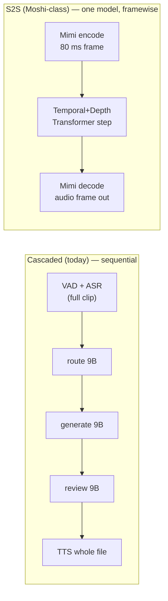
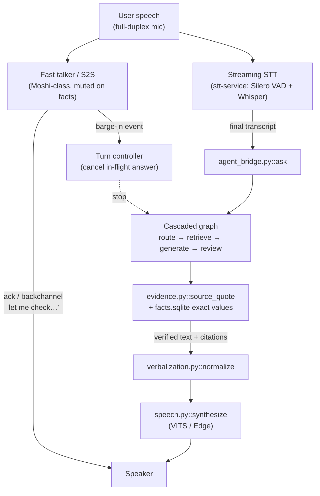

# 11 — End-to-End Speech Models

Should we replace the cascaded pipeline (STT → routed RAG → verified answer → TTS) with a
single speech-to-speech (S2S) model such as Moshi [R1100] or an omni model like
Qwen3-Omni [R1101]? This chapter surveys 2024–2026 open S2S / omni / speech-LM options,
explains the codec and decoding maths that make them fast, and tests them against the one
requirement that defines this project: **every answer is grounded with a verbatim quote
(`evidence.py::source_quote`) and exact numbers (`facts.sqlite`)**. The conclusion is that
speech-native generation is **incompatible with the current grounding contract** and should
not be the back-end on any tier. A **hybrid** — a small fast "talker" for turn-taking and
backchannels, with the existing cascaded, verified text back-end driving TTS — is the only
S2S use that preserves grounding, and it is worth a T1/T2 experiment, not a T0 change.

See [01_BASELINE_AND_CURRENT_ARCHITECTURE.md](01_BASELINE_AND_CURRENT_ARCHITECTURE.md) for
the as-built system, [02_LATENCY_COST_MODEL_AND_METRICS.md](02_LATENCY_COST_MODEL_AND_METRICS.md)
for the budget sheet, [07_SPEECH_OUTPUT.md](07_SPEECH_OUTPUT.md) for TTS, and
[06_VERIFICATION_AND_CACHING.md](06_VERIFICATION_AND_CACHING.md) for the grounding review.

## Recommendations by tier

| Tier | Primary answer path | S2S role | Rationale |
|---|---|---|---|
| **T0** (RTX 4060 8 GB, LLM resident) | Keep cascaded, verified text → VITS/Edge TTS | **None.** No omni model fits beside the 9B LLM; Moshi alone needs ~24 GB bf16 [R1100] | VRAM already oversubscribed (01 §4.3); grounding would be lost |
| **T1** (16–24 GB GPU) | Keep cascaded, verified text as the factual source | **Experiment**: small S2S/talker (Moshi-class) for first-token acknowledgement + barge-in, muted on the final grounded answer | Fits a quantised S2S *or* the LLM, rarely both at full quality; validate grounding loss is zero |
| **T2** (40–80 GB GPU) | Cascaded verified text back-end (optionally omni *understanding* front-end, text out) | **Hybrid**: omni/S2S talker streams filler; cascaded answer feeds TTS | Memory headroom; still must forbid speech-native fact generation |
| CPU-only | Cascaded, CPU STT/TTS | None | S2S models are GPU-bound |

**One-line verdict:** S2S/omni models are excellent *mouths and ears*, poor *sources of
record*. Use them for latency-perception (acknowledge, backchannel, barge-in), never for
the grounded answer.

## 1. Why S2S exists — the latency and prosody argument

A cascade loses two things [R1100]: (1) **seconds of latency** from serialised VAD → ASR →
LLM → TTS, and (2) **non-linguistic information** (emotion, interruption, overlap) because
text is the intermediate modality. Moshi reports a **theoretical latency of 160 ms (80 ms
Mimi frame + 80 ms acoustic delay), 200 ms in practice on an L4 GPU** [Reported, R1100].
Compare the project's measured answered-turn median of **18.7 s** text-only, before any
speech (01 §4.1) — two orders of magnitude apart. That gap is the entire motivation for
looking at S2S.

But the project's value is *verifiable local answers*, not conversational fluency. The rest
of this chapter weighs that trade.

## 2. Core ideas, with maths

### 2.1 Neural audio codecs and token rate

An S2S model does not emit waveforms; it emits **discrete tokens** from a residual-vector-
quantised (RVQ) neural codec, which a decoder turns back into audio. The token budget is
the whole story for context length and latency.

For a codec with frame rate $f$ (frames/s) and $Q$ codebooks (quantiser levels):

$$
R_{\text{tok}} = f \times Q \quad\text{tokens/s}, \qquad
N_{\text{ctx,audio}} = R_{\text{tok}} \times D_{\text{seconds}}
$$

Mimi (Moshi's codec) runs at **$f = 12.5$ Hz** with a **1.1 kbps** bandwidth on 24 kHz
audio [Reported, R1100]. Moshi uses **$Q = 8$** acoustic codebooks (plus the semantic one),
so a naïve flattening would be $12.5 \times 8 = 100$ tokens/s. Moshi avoids paying that in
*temporal* autoregressive steps: a large 7B **Temporal Transformer** advances once per
frame (12.5 Hz), and a small **Depth Transformer** predicts the 8 codebooks *within* a
frame [R1100]. So the expensive sequence length grows at **12.5 steps/s**, not 100.

$$
\text{temporal steps/s} = f = 12.5, \qquad
\text{per-frame inner steps} = Q = 8
$$

Why 12.5 Hz matters: text tokens arrive at **~3–4 Hz** [Reported, R1100]. Keeping audio
near that rate lets the model interleave text and audio with few autoregressive steps,
which is what bounds latency. A 50 Hz codec (SpeechTokenizer, SemantiCodec) would need
4× more steps for the same audio [Reported, R1100].

**Context-length consequence.** One minute of Moshi dialogue (both streams) costs roughly
$2 \times 12.5 \times 60 = 1500$ temporal frames — modest. But a *flattened* codec at
50 Hz × 8 would be $2 \times 400 \times 60 = 48{,}000$ tokens/min, which is why high-frame-
rate codecs are impractical for long turns. **[Estimated]** from $R_{\text{tok}}$ above.

### 2.2 Interleaved text–speech decoding (inner monologue)

Moshi's "Inner Monologue" predicts **time-aligned text tokens as a prefix to audio tokens**
[R1100]. The joint factorisation per frame $t$ is, schematically:

$$
p(\text{frame}_t) = p(\text{text}_t \mid \text{past}) \cdot \prod_{q=1}^{Q} p(\text{audio}_t^{(q)} \mid \text{text}_t, \text{audio}_t^{(<q)}, \text{past})
$$

The text stream improves linguistic quality and gives *free* streaming ASR and TTS [R1100].
**This text stream is the one hook a grounding system could use** — see §5. VITA-Audio
[R1108] pushes interleaving further: it is "the first MLLM capable of generating audio
output during the first forward pass" [Reported, R1108], i.e. no separate decode phase
before speech starts.

### 2.3 Full-duplex dual streams

Moshi models **two audio streams** (its own and the user's) in parallel, removing explicit
speaker turns so interruptions and backchannels are native [R1100]. Formally the model
jointly predicts its stream while *conditioning on* the live user stream each frame — there
is no "end of turn" gate. This is exactly the capability the current button-press UI lacks
(01 §7, cross-ref [03_SPEECH_INPUT_AND_TURN_TAKING.md](03_SPEECH_INPUT_AND_TURN_TAKING.md)).

### 2.4 Chunk-wise streaming and the first-token budget

From 02 §1.1, streaming replaces $\sum_i t_i^{\text{full}}$ with $\sum_i t_i^{\text{first chunk}}$.
An S2S model collapses the sum to **one model**: time to first audio frame ≈ one frame
period + model step. Moshi's 80 ms frame is the floor [R1100]. Omni models with a
multi-codebook talker (Qwen3-Omni) claim "latency driven to a minimum" by the same multi-
codebook design [Reported, R1101] but do not publish a single-GPU millisecond figure in the
README; treat their latency as **unverified for our hardware**.

## 3. Model survey (verified where fetched)

All memory/latency figures carry their source and conditions. Hindi/Indic support is the
decisive column for this project.

| Model | Params / active | Modalities | Speech out? | Hindi / Indic | VRAM (reported) | Latency (reported) | Licence | Source |
|---|---|---|---|---|---|---|---|---|
| **Moshi** (Moshika/Moshiko) | 7B temporal + small depth | speech↔speech + inner text | **Yes** | **No** (English) | PyTorch bf16 **24 GB**; MLX int4/int8 on Mac [R1100] | 160 ms theo / 200 ms L4 [R1100] | code MIT/Apache; **weights CC-BY-4.0** | fetched R1100 |
| **Qwen3-Omni-30B-A3B-Instruct** | 30B total / **3B active** MoE | text+image+audio+video → text+**speech** | Yes | speech-in **Urdu, not Hindi**; speech-out **no Hindi** [R1102] | **78.85 GB** BF16 (15 s video); −~10 GB without talker [R1102] | "minimised" (no single-GPU ms) [R1101] | Apache-2.0 (code) | fetched R1101/R1102 |
| **Qwen3.5-Omni** | 30B / 3B MoE, 256k ctx | omni | Yes | not confirmed for Hindi | not fetched | — | check | snippet R1103 |
| **MiniCPM-o 2.6** | **8B** (Qwen2.5-7B + Whisper-med + ChatTTS) | vision+speech, full-duplex | Yes | not stated (EN/ZH focus) | ~8B class; phone-targeted [R1104] | streaming (no ms fetched) | ⚠ MiniCPM licence (commercial registration) | fetched R1104 |
| **GLM-4-Voice** | 9B | speech↔speech | Yes | **No** (CN/EN) | 9B class | real-time (no ms fetched) | ⚠ GLM terms | snippet R1105 |
| **Kimi-Audio** | 7B class | audio understanding+gen | partial | not stated | not fetched | — | check | snippet R1106 |
| **Step-Audio 2** | large | speech↔speech, paralinguistic | Yes | not stated | not fetched | — | check | snippet R1107 |
| **VITA-Audio** | speech-LM | speech↔speech, interleaved | Yes | open data, not Indic-specific | not fetched | first-forward-pass audio [R1108] | check (NeurIPS'25) | snippet R1108 |
| **Freeze-Omni** | frozen LLM + speech dec | speech↔speech | Yes | not stated | depends on base LLM | streaming low-latency [R1109] | check | snippet R1109 |
| **Sesame CSM** | ~1B | contextual speech gen | Yes (TTS-like) | not stated | ~1B (small) | — | Apache (check) | snippet R1116 |
| **LLaMA-Omni 2** | 0.5B–14B (Qwen2.5) | speech↔speech modular | Yes | base-dependent | base-dependent | streaming synth [R1117] | check | snippet R1117 |
| **Ultravox** | base LLM + Whisper enc | **speech-in only** → text | **No** | base-dependent | base-dependent | — | MIT (check) | snippet R1118 |
| **Voxtral** (Mini/Small) | 3B / 24B | **speech-in** → text, 40 min ctx | No | not Indic-specific | 3B/24B class | — | Apache (verify) | snippet R1110 |
| **Shuka v1** (Sarvam/AI4Bharat) | **9B** (Saaras enc + Llama3-8B) | **speech-in** (Indic) → text | **No** | **Yes — HI + 10 Indic** [R1111] | 9B class, bf16 | — | ⚠ Llama 3 Community | fetched R1111 |

Notes:
- **Hindi gap in true S2S is near-total.** The only open model that natively *understands*
  Hindi/Indic audio is **Shuka v1**, and it is **speech-in only** (audio → text) [R1111] —
  it still needs a separate TTS, so it is a cascade ASR replacement, not an S2S model.
  There is **no open Hindi speech-*out* S2S model** found in this survey.
- **Qwen3-Omni does not list Hindi** in either its 18-language speech-input set (which
  includes Urdu) or its 10-language speech-output set [R1102]. For a Hindi helpdesk this is
  disqualifying for the speech path.
- **Voxtral, Ultravox, Shuka are "speech-in only"** — they belong in
  [03_SPEECH_INPUT_AND_TURN_TAKING.md](03_SPEECH_INPUT_AND_TURN_TAKING.md) as ASR
  alternatives, not here, but are listed for completeness.

## 4. Speech-native retrieval (MoshiRAG, VoxRAG, WavRAG)

A second line of work makes **retrieval** speech-native so the S2S model never leaves the
audio domain:

- **WavRAG** [R1113]: *"the first retrieval augmented generation framework with native,
  end-to-end audio support … Bypassing ASR, WavRAG directly processes raw audio for both
  embedding and retrieval"* [Reported, R1113]. Removes the ASR error source but makes the
  retrieved unit an **audio segment**, not a quotable text span.
- **VoxRAG** [R1114]: transcription-free speech-to-speech retrieval; authors state
  *"precision and retrieval quality remain key limitations"* [Reported, R1114].
- **MoshiRAG** [R21]: asynchronous retrieval for full-duplex speech LMs (seed reference;
  cross-ref [04_RETRIEVAL_AND_KNOWLEDGE_BASE.md](04_RETRIEVAL_AND_KNOWLEDGE_BASE.md)).
- Reranking across heterogeneous speech+text retrievers [R1115] notes ASR *"introduces
  transcription errors that propagate through the pipeline"* [Reported, R1115].

**Why this fails the grounding contract.** The project's `kb/search.py::SearchEngine.search`
returns text spans, `facts.sqlite` returns exact JoSAA cutoff rows, and
`evidence.py::source_quote` validates that a **verbatim text substring** of a source appears
in the answer (01 §3, O7/O8). An audio-segment retriever cannot produce a byte-exact text
quote or an exact SQL cutoff number. Speech-native RAG trades the project's core guarantee
for latency. It is **out of scope as a back-end**; it could only ever feed a human-review UI.

## 5. The grounding verdict — why S2S cannot be the answer path

| Project guarantee | Repo mechanism | Does S2S break it? |
|---|---|---|
| Verbatim quote in every answer | `IA/assistant/evidence.py::source_quote` | **Yes.** Speech tokens are sampled acoustically; the spoken words are not constrained to a source substring. Even Moshi's inner-monologue text is *free-form*, not grammar-constrained to an evidence enum (contrast O7 `llm.py::generation_schema`). |
| Exact numbers / cutoffs | `IA/assistant/kb/structured.py::lookup_cutoffs`, `facts.sqlite` | **Yes.** No open S2S model exposes a constrained-decoding path for an exact SQL value; TTS-ing a number risks digit errors (cf. verbalization guard O17). |
| Release-bound caches | `IA/assistant/cache.py::RagCache` | **Yes.** Caches key on exact text; audio tokens are non-deterministic across runs, so cache keys and reuse collapse. |
| Deterministic review | 9B review call + quote validation (O8) | Partially. A text reviewer could run on the S2S inner-monologue transcript, but only if that transcript is faithful to the audio — not guaranteed. |
| Controllability | temperature 0, `think:false` (O11), grammar | **Weak.** S2S models are tuned for natural, varied speech; forcing them to read a fixed verified string defeats their purpose. |

**Conclusion:** the back-end answer must stay in constrained text. S2S can only occupy the
*parts of the turn that carry no facts*.

## 6. Proposed hybrid design (talker + grounded back-end)

Use a small fast model (or even a lightweight TTS + canned phrases) to **fill the first
silence** and handle barge-in, while the existing cascaded, verified text back-end produces
the factual answer and drives TTS. The talker **never speaks facts**; it says
"let me check that", acknowledges, backchannels, and detects interruptions.

Key properties:
- **Two silences handled** (02 §1): the talker fills silence #1 (before the tool/retrieval)
  with an acknowledgement; the verified back-end fills silence #2 with the real answer.
- **Grounding untouched**: the fact path is byte-for-byte the current graph. The talker's
  output is discarded for the record and never cached as an answer.
- **Barge-in**: the full-duplex talker emits an interrupt event that cancels the in-flight
  job via `jobs.py::JobManager` (O13) — a capability the stt-service already models
  (`stt-service/src/session.py`, O18) but Demo 2 does not use.

### Minimal talker alternatives (lowest risk first)
1. **Canned-phrase TTS** (no new model): pre-synthesised "एक सेकंड…/let me check" played
   immediately on turn end. Zero VRAM, zero grounding risk. **Recommended first step.**
2. **Small streaming TTS talker** (Kokoro/Piper, cross-ref [07_SPEECH_OUTPUT.md](07_SPEECH_OUTPUT.md))
   reading a tiny LLM-free script.
3. **Full S2S talker** (Moshi-class) for natural backchannels + barge-in — **T1/T2 only**.

## 7. Where it fits (repo integration points)

| Integration | Path | Change (documentation only — not applied) |
|---|---|---|
| Turn controller + barge-in | `code/demo2/app.py` (`st.audio_input`), `code/demo2/jobs.py::JobManager` | Replace button-press turn end with a full-duplex event source; wire cancellation to barge-in |
| Acknowledgement playback | `code/demo2/speech.py::synthesize` (resident `_SYNTHESIZERS`, O16) | Add a pre-synthesised "checking…" clip played on turn start |
| Fact path (unchanged) | `code/demo2/agent_bridge.py::ask` → `IA/assistant/graph.py` | **No change**; remains the only source of record |
| Streaming input | `code/STT/stt-service/src/session.py`, `vad.py` (O18, already built) | Wire the existing VAD/partial/barge-in service into Demo 2 |
| S2S talker service (T1/T2) | new sidecar, parallel to `agent_bridge.py` | Runs Moshi/omni on a second GPU slot; output muted for facts |

The hybrid adds a *parallel* talker; it does not touch `agent_bridge.py::ask`,
`evidence.py::source_quote`, `cache.py`, or `facts.sqlite`. That is the whole point.

## 8. VRAM per tier (why T0 is a hard no)

From 02 §3 and 01 §4.3: on T0 the desktop already holds **~2.7 GB** and the 9B LLM runs
**partly on CPU** because only ~5.4 GB is free. Adding any S2S model is impossible without
evicting the LLM.

| Model | Reported min VRAM | Fits beside 9B LLM on T0 (8 GB)? | T1 (24 GB)? | T2 (80 GB)? |
|---|---|---|---|---|
| Moshi (PyTorch bf16) | 24 GB [R1100] | **No** | Alone, not with LLM | Yes |
| Moshi (MLX int4) | Mac-only [R1100] | n/a (CUDA laptop) | n/a | n/a |
| Qwen3-Omni Instruct | 78.85 GB (15 s) [R1102] | **No** | **No** | Tight; multi-GPU recommended |
| Qwen3-Omni, talker disabled | −~10 GB → ~69 GB [R1102] | **No** | **No** | Yes |
| MiniCPM-o 2.6 (8B) | ~8B class [R1104] | **No** (no room beside LLM) | Yes (one of the two) | Yes |

**[Estimated]** Moshi weights are ~7B; at int8 ≈ 7 GB, at int4 ≈ 3.5 GB (derivation:
params × bytes/param; CUDA int4/int8 for Moshi PyTorch is *experimental/unsupported* per
R1100, so a laptop int4 Moshi is not a verified option today). Even an int4 Moshi plus the
resident 9B LLM plus 2.7 GB desktop exceeds 8 GB. T0 therefore stays cascaded.

## 9. How to measure (if a hybrid is piloted)

Link to [12_EVALUATION_AND_BENCHMARKING.md](12_EVALUATION_AND_BENCHMARKING.md).

| Question | Metric | Dataset | Pass criterion |
|---|---|---|---|
| Does the talker speak any fact? | Fact-leakage rate: fraction of talker utterances containing a number/entity from the KB | 120-turn benchmark (01 §4.1) audio-logged | **0%** — any leak fails |
| Grounding preserved? | `source_quote` pass rate on the back-end answer, vs cascaded baseline | same benchmark | **No regression** vs 01 baseline |
| First-silence reduction | $t$ from turn end to first talker audio (ack) | live multilingual check | < 800 ms [R94 threshold] |
| Barge-in correctness | % interruptions that cancel the in-flight job within one frame budget | scripted barge-in set | ≥ 95% |
| S2S Hindi quality (if any S2S talker used for HI) | MOS / WER of talker speech on Hindi acks | Hindi ack set | ≥ cascaded VITS MOS |
| VRAM headroom | peak `nvidia-smi` with talker + LLM resident | T1/T2 run | fits with margin; no CPU offload of the LLM |

Record cold vs warm separately and report p50/p95/p99 per 02 §5/§8.

## 10. Risks and interactions

- **Grounding (primary):** any path where the S2S model emits the final answer bypasses
  `evidence.py::source_quote` and `facts.sqlite` → fabrication/number drift. Mitigation:
  talker is *mechanically muted* on the answer; only verified text reaches
  `verbalization.py::normalize` → TTS.
- **Caching:** S2S outputs are non-deterministic; never key `cache.py::RagCache` on audio.
  The cache stays on text answers only.
- **Licences:** Moshi **weights are CC-BY-4.0** [R1100] (attribution; usable); MiniCPM-o and
  GLM-4-Voice carry **⚠ non-Apache model terms** [R1104][R1105]; Shuka is **⚠ Llama 3
  Community** [R1111]. Qwen3-Omni code is Apache-2.0 but verify weight terms before any
  deployment.
- **Language:** no open **Hindi speech-out** S2S model exists (survey §3); a Hindi talker
  must still use the project's VITS/Edge TTS, which already works (01 §4.2, O16/O17).
- **Dual-GPU assumption:** the hybrid at T1/T2 assumes the talker and LLM occupy separate
  memory; a single 24 GB card forces a choice between a quantised S2S *or* a full-quality
  LLM, not both — validate before piloting.
- **Complexity:** full-duplex adds a turn controller and barge-in cancellation
  (`jobs.py`); the canned-phrase alternative (§6.1) achieves most of the perceived-latency
  win with none of this risk and should be tried first.

## What we could not verify

- **Single-GPU millisecond latency for omni models** (Qwen3-Omni, MiniCPM-o, GLM-4-Voice,
  Step-Audio 2, VITA-Audio, Freeze-Omni) on our hardware or any comparable GPU — the README
  for Qwen3-Omni states latency is "minimised" via multi-codebook design but gives no number
  [R1101]; only **Moshi's 160 ms/200 ms (L4)** is a concrete figure [R1100].
- **Exact VRAM** for MiniCPM-o 2.6, GLM-4-Voice, Kimi-Audio, Step-Audio 2, VITA-Audio,
  Freeze-Omni, Sesame CSM, LLaMA-Omni 2 — not fetched to a numeric spec; "~8B class" is a
  parameter-count inference, not a measured footprint.
- **Qwen3.5-Omni Hindi support and licence** [R1103] — only architecture/size confirmed via
  snippet; Hindi coverage and weight licence not read.
- **Precise licences** marked "check"/"verify" in §3 (Kimi-Audio, Step-Audio 2, VITA-Audio,
  Freeze-Omni, Sesame CSM, LLaMA-Omni 2, Voxtral weights) — not read from the model cards.
- **Moshi int4/int8 on CUDA** — README marks PyTorch quantisation as experimental/
  unsupported [R1100]; a working 8 GB-laptop Moshi was **not** demonstrated. The §8 int4
  size is an [Estimated] derivation, not a measurement.
- **Any Indic (Hindi) open speech-*out* S2S model** — none found; absence is reported, not
  proven exhaustive.
- No S2S model was run locally (rule 9: no installs/model pulls); all S2S numbers are
  [Reported] from fetched pages.
