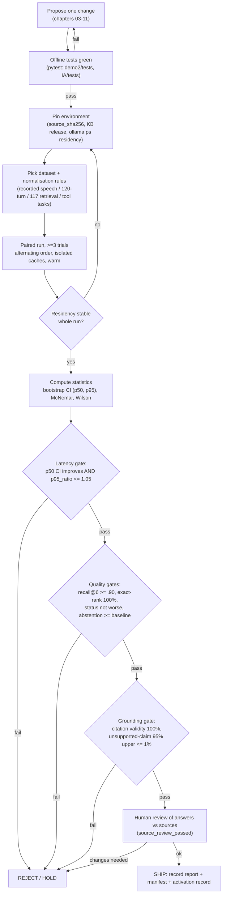

# 12 — Evaluation and Benchmarking

This is the protocol chapter. Every technique proposed in chapters
[03](03_SPEECH_INPUT_AND_TURN_TAKING.md)–[11](11_END_TO_END_SPEECH_MODELS.md) states "How to
measure" and links here. This chapter defines the metrics per stage, the datasets to use or
build, the statistics that decide whether a change is real, the reporting template, and the
regression gates. It builds directly on the already-shipped evaluation code
(`code/demo2/evaluate_upgrade.py`, `IA/assistant/jev/paired_benchmark.py`,
`IA/assistant/kb/evaluation.py`) rather than inventing a new harness.

**Summary.** The repository already has a strong, paired, cache-isolated text-turn harness
with environment pinning and residency checks — reuse its design everywhere. The biggest gap
is **speech**: no WER/CER, no end-of-turn, no end-to-end voice latency, and no claim-level
grounding audit have ever been run (`code/demo2/VALIDATION.md`;
[01 §4.2, §6](01_BASELINE_AND_CURRENT_ARCHITECTURE.md)). Numbers that matter (perceived
latency p95, unsupported-claim rate, abstention recall) need paired designs and interval
estimates, not single runs. Below, every gate is a one-change-at-a-time, warm, residency-pinned
comparison against the measured baseline in [01](01_BASELINE_AND_CURRENT_ARCHITECTURE.md) and
the budget sheet in [02 §7](02_LATENCY_COST_MODEL_AND_METRICS.md).

## Recommendations by tier

| Priority | Action | Tier | Expected effect | Evidence |
|---|---|---|---|---|
| P0 | Build the three missing datasets (recorded Hindi/Hinglish/hne speech + transcripts, number-reading TTS set, simulated multi-turn calls) | all | Unblocks every speech gate; without them chapters 03/07/08/11 cannot be scored | [Measured-here] no speech set exists (`VALIDATION.md`) |
| P0 | Adopt the paired-bootstrap + McNemar + Wilson statistics module as the single decision rule for all gates | all | Stops "p50 looks better" false positives like the JEV router (median −4.1%, p95 +5.6%) | [Measured-here, 01 §5] |
| P1 | Extend `rag_metrics.stage_ms` with Ollama token counts/durations, cache outcomes, `ollama ps` residency, energy | T0/T1/T2 | Enables per-stage attribution and energy-per-turn gates | [Measured-here] fields already captured by `operations.record_attempt`, not yet logged |
| P1 | Claim-level unsupported-claim audit (human sample of ≥300 clean cases + local checker) | all | Replaces the overstated "0% hallucination" claim with a bounded rate | [Reported, R1200]; [01 §6] |
| P2 | Wire local automatic metrics: jiwer (WER/CER), UTMOS/SpeechMOS (TTS MOS), RAGChecker-style claim entailment with a *local* checker | T1/T2 (GPU for checker) / T0 (jiwer only) | Cheap continuous regression signal between human audits | [Reported, R1200/R1207/R1209] |
| P2 | Reuse τ²-bench / VoiceAgentBench task structure for the tool agents (Demo 1 shopping, receptionist) | all | Standard tool-selection / parameter-filling / task-success scoring | [Reported, R1206/R1204] |

---

## 1. What already exists (inventory)

Read before extending. All paths relative to repo root; `IA/` = `code/Institute-voice-agent/institute-assistant/`.

| Asset | Path | What it measures | Design features to keep |
|---|---|---|---|
| Text-turn workload runner | `code/demo2/evaluate_upgrade.py::main` | 120 text turns (40 Q × en/hi/hinglish), per-turn `seconds`, `response_status`, `sources`, `rag_metrics.stage_ms`; resumable | Per-case isolated SQLite cache; `JEV_ROUTING_MODE=off`; warm-up turn recorded separately; actions patched to raise |
| Baseline/candidate results | `code/demo2/data/upgrade-20260930/{baseline,candidate}/results.json` | 120 rows each; `rag_metrics.stage_ms` keys `routing_model, routing, retrieval, generation_model, review_model, answer`; `model_calls`, `router_path`, `retrieval_cache`, `draft_cache` | Verified: 120 rows each [Measured-here] |
| Case set + critical cases | `code/demo2/evaluation/upgrade-20260930/{cases.json,critical-cases.json}` | `expected` (answerable/…), `expected_blocks`, `required_terms`, `topic`, `language` | Required-term check is a cheap grounding proxy |
| Baseline manifest | `.../baseline-manifest.json` | Per-file `source_sha256` of all agent code; `release`, `case_sha256` | Pins the exact code + KB release of a run |
| Environment snapshot | `.../environment-before.json` | Full `pip freeze` (faster-whisper 1.2.1, ctranslate2 4.8.1, torch 2.13.0, TTS 0.22.0, silero-vad 6.2.1, onnxruntime 1.28.0 …) | Reproducibility record |
| Speech mechanics probe | `code/demo2/evaluate_speech.py::main` | VITS synth seconds + RSS, cache-hit effect, synthetic round-trip STT; **explicitly `native_speech_validated: false`** | Honest labelling; not a quality measurement |
| Live behaviour smoke | `code/demo2/smoke.py::main` | One grounded answer per check (tts/stt/mms/agent/pipeline); fails if not answered + sourced | Component isolation |
| Helpdesk behaviour suite | `IA/evaluate_helpdesk.py::main` (25 `CASES`) | status-in-expected + `context_checks` (rank-filter resolution, topic switch); `--cache-benchmark`, `--model-trace` | Dialogue-level expectations beyond status |
| Retrieval release gate | `IA/assistant/kb/evaluation.py::evaluate_release` | recall@6 on ≥90 source-checked cases, exact-rank via `facts.sqlite`, abstention cases flagged for human review; writes `validation.json` with `cases_sha256` | Verified: 117 cases in `IA/docs/kb_evaluation_cases.json` [Measured-here]; **gate = recall ≥ .90 and all exact-rank pass** |
| Router quality gate | `IA/assistant/jev/evaluation.py::quality_passed` | precision ≥ .98, ≥100 accepted, 0 critical failures, fresh holdout, no family overlap | Family-leakage check; threshold search on calibration only |
| Paired latency benchmark | `IA/assistant/jev/paired_benchmark.py::benchmark` | ≥3 trials, alternating `off`/`enabled` order per trial/case/cache phase, residency-pinned, isolated caches; `summarize_pairs` + `diagnostics` | **This is the reference paired design** — mirror it for every change |
| Benchmark pass rule | `IA/assistant/jev/evaluation.py::performance_passed` | pairs ≥ 12, coverage ≥ .15, median_improvement ≥ .10, **p95_ratio ≤ 1.05**, 0 new-behaviour failures | p95 guard is the lesson from the JEV router |
| Tests | `code/demo2/tests/{test_demo,test_operations}.py`, `IA/tests/test_*.py` (14 files incl. `test_memory_cache`, `test_retrieval`, `test_jev*`, `test_llm`, `test_rank_followup`) | Offline regression; `python -m pytest -q` | Keep green as a gate precondition |

The paired benchmark's environment pinning is the model to copy: `paired_benchmark.py::environment`
reads `/api/ps` for `size_vram`, `context_length`, `digest`; `benchmark` **raises if residency
changes mid-run**. Any new gate must do the same (see [§7](#7-confounders-you-must-control)).

### 1.1 What is missing

| Missing | Consequence | Chapter it blocks |
|---|---|---|
| Recorded speech test set (Hindi/Hinglish/Chhattisgarhi) with reference transcripts | No WER/CER, no real ASR latency, no EOU metrics | 03, 11 |
| End-to-end **perceived latency** instrumentation (EOU → first audio) | §1 of [02](02_LATENCY_COST_MODEL_AND_METRICS.md) cannot be scored; "21.2 s voice turn" stays unverified ([01 §6](01_BASELINE_AND_CURRENT_ARCHITECTURE.md)) | 03, 05, 07 |
| Claim-level grounding audit | "0% hallucination" is unverifiable; only verbatim-quote existence is checked (`evidence.py::source_quote`) | 06 |
| Number-reading TTS set + ASR round-trip CER | TTS correctness of ₹ amounts/dates unmeasured despite `verbalization.py` | 07 |
| Energy per turn | `$0.60/month` is an estimate; only idle GPU power read ([01 §6](01_BASELINE_AND_CURRENT_ARCHITECTURE.md)) | 02, 13 |
| Tool-agent task-success harness | Demo 1 shopping / receptionist unscored | 08 |

---

## 2. Metrics per stage

Each row names the metric, the local tool, the dataset, and the pass criterion. Stage names
map to chapters and to `rag_metrics.stage_ms` keys where they already exist.

### 2.1 Speech input — ASR and turn-taking ([03](03_SPEECH_INPUT_AND_TURN_TAKING.md))

| Metric | Definition / tool | Dataset | Pass criterion (gate) |
|---|---|---|---|
| WER | word error rate = (S+D+I)/N via jiwer [R1207] | recorded hi/hinglish set §6; FLEURS-hi [R1214], Kathbath-hi [R1213] as external anchors | no regression vs current faster-whisper-small on the same clips; report absolute |
| CER | character error rate (jiwer) — primary for Devanagari and digit strings | same | report; CER preferred where tokenisation of Hindi is ambiguous |
| EOU false-cut rate | fraction of turns cut while the user was still speaking | recorded multi-utterance set with marked pauses; Full-Duplex-Bench "pause handling" protocol [R1205] | ≤ baseline button-press behaviour's effective 0 false cuts; a model that cuts > 5% fails |
| EOU delay | ms from true end-of-speech to turn-end decision | same | target 300–600 ms ([02 §7](02_LATENCY_COST_MODEL_AND_METRICS.md)); must not raise perceived-latency p95 gate |
| ASR residual latency | wall-clock from EOU to final transcript | recorded set, warm | ≤ target in budget sheet; report p50/p95 |

**Normalisation rules (decide once, record in the run manifest).** WER/CER on Hindi/Hinglish is
dominated by normalisation choices, so fix them before any number is quoted:

1. Script policy per clip: Devanagari reference vs Roman/Hinglish reference are scored
   separately; never mix. Code-switched clips get a Roman reference and are scored with CER plus
   a transliteration-aware pass.
2. Use an **Indic-aware** normalizer, not Whisper's `BasicTextNormalizer`, which the
   whisper_normalizer authors warn "can cause issues in Indic languages and other low resource
   languages" [R1208, fetched]. Use `IndicNormalizer` / `indic_normalize` from that package.
3. Numbers: normalise ₹/comma/lakh forms to a canonical digit string before scoring (reuse the
   intent of `code/demo2/verbalization.py::normalize` but in reverse, for scoring only — do not
   modify the file).
4. Casing and punctuation stripped for WER; kept for a separate "entity-exact" check on names and
   amounts (a single wrong digit in a fee is a hard fail even at low WER).

### 2.2 Retrieval ([04](04_RETRIEVAL_AND_KNOWLEDGE_BASE.md))

| Metric | Definition | Dataset | Pass criterion |
|---|---|---|---|
| recall@k | fraction with ≥1 relevant block in top-k | `IA/docs/kb_evaluation_cases.json` (117 cases, verified) via `kb/evaluation.py::evaluate_release` | recall@6 ≥ .90 (existing gate) |
| MRR | mean reciprocal rank of first relevant block | add to `evaluate_release` (currently binary pass) | report; must not drop vs baseline |
| nDCG@k | graded relevance, discounts rank | same, with graded labels | report for reranker changes (04) |
| Exact-rank accuracy | JoSAA cutoffs via `facts.sqlite` + `kb/structured.py::lookup_cutoffs` | `cutoff_filters` cases | **all must pass** (existing gate: 42/42 historically, [01 O5]) |
| Abstention correctness | "no_cutoff"/unknown returns no false answer | flagged `passed is None` for human review in `evaluate_release` | human-reviewed; 0 false answers |

### 2.3 Generation, grounding and verification ([05](05_LLM_INFERENCE_AND_SERVING.md), [06](06_VERIFICATION_AND_CACHING.md))

| Metric | Definition | Dataset | Pass criterion |
|---|---|---|---|
| Answer-status accuracy | predicted vs gold {answered, insufficient, out_of_scope, clarification, unavailable} | `evaluate_helpdesk.py::CASES` + the 120-turn set | ≥ baseline; McNemar not significantly worse |
| Unsupported-claim rate | claim-level: decompose answer into atomic claims, mark each entailed by cited sources | human audit of ≥300 clean cases (§5.4); automated with RAGChecker-style entailment [R1200] using a **local** checker [R26/R1222] | human-audited rate upper 95% bound ≤ 1% (rule of three → need ≥300 clean, [R1218]) |
| Abstention precision/recall | over the should-abstain set (unknown/out-of-scope) | `unknown`, `off_topic`, `sc_ntpc_rank`, `loan_institute_eligibility` style cases | recall ≥ baseline; never answer a should-abstain case |
| Citation validity | every cited quote is verbatim in the named source | deterministic: `evidence.py::source_quote` already enforces this | 100% (hard invariant; a failure is a bug, not a metric) |
| Faithfulness / context-utilisation (diagnostic) | RAGChecker generator metrics (faithfulness, hallucination, noise sensitivity) [R1200] | 120-turn set | report as diagnostics; not a sole gate |

The claim-level distinction is the key correction from [01 §6](01_BASELINE_AND_CURRENT_ARCHITECTURE.md):
`source_quote` proves a quote exists in a source; it does **not** prove the prose is supported.
So "citation validity 100%" and "unsupported-claim rate" are different metrics and both must be
reported. RAGChecker reports claim-level precision/recall and a `hallucination` figure
(example output precision 73.3, recall 62.5, hallucination 4.2) [R1200, fetched] — use its
*method* (claim extraction + entailment) with a local extractor/checker, not its cloud default
(`bedrock/meta.llama3-1-70b`).

### 2.4 Speech output ([07](07_SPEECH_OUTPUT.md))

| Metric | Definition / tool | Dataset | Pass criterion |
|---|---|---|---|
| TTS TTFB | ms to first audio frame of first sentence | number-reading set §6, warm | ≤ budget ([02 §7](02_LATENCY_COST_MODEL_AND_METRICS.md)); current whole-file synth has no TTFB |
| MOS (predicted) | UTMOS/UTMOSv2 or SpeechMOS torch.hub [R1209/R1210] | synthesized sentences | report; no significant drop vs current VITS |
| MOS (human) | 1–5 opinion score, ≥15 native listeners, confidence interval | sampled utterances | for any TTS swap: not worse than current within CI |
| ASR round-trip CER | synth → ASR → CER vs intended text (reuses `evaluate_speech.py` method) | number-reading set | ≤ threshold; catches dropped/garbled words |
| Number-reading accuracy | exact match of spoken ₹/dates/acronyms after ASR | number-reading set §6 | 100% on amounts; a wrong digit is a hard fail |

### 2.5 Tool calling and task agents ([08](08_TOOL_CALLING_AND_TASK_AGENTS.md))

| Metric | Definition | Dataset | Pass criterion |
|---|---|---|---|
| Tool-selection accuracy | correct tool chosen | simulated shopping/receptionist tasks; VoiceAgentBench structure [R1204] | report; ≥ baseline |
| Argument / parameter-filling accuracy | correct, correctly-typed arguments | same | report (VoiceAgentBench: ASR-LLM pipelines reach up to 60.6% avg parameter-filling on English, lower on Indic [R1204, fetched] — a difficulty anchor, not our target) |
| Task success | end goal state reached | τ²-bench-style final-state comparison [R1206] | report |
| pass^k | fraction of tasks solved in all of k independent trials (reliability) [R1206] | repeated runs | report pass^1 and pass^k; voice agents must be reliable, not lucky once |
| No-side-effect safety | no ticket/reminder/email written during eval | `nodes.create_ticket`/`create_reminder` patched to raise (already done in all harnesses) | 0 writes (hard) |

### 2.6 System resource metrics (all stages)

| Metric | How to measure (read-only) | Pass criterion |
|---|---|---|
| Perceived latency p50/p95/p99 | per-turn spans EOU→first audio; browser timestamps + `stage_ms` | p95 within budget; **p95 must not regress** (p95_ratio ≤ 1.05, mirroring `performance_passed`) |
| TTFT | Ollama `prompt_eval_duration` end → first `eval` token; already in `operations.record_attempt` | report; decode-bound per [02 §2](02_LATENCY_COST_MODEL_AND_METRICS.md) |
| VRAM peak | `nvidia-smi --query-gpu=memory.used` sampled during run; `ollama ps` `size_vram` | ≤ 8188 MiB on T0 with desktop (~2.7 GB) resident ([01 §4.3](01_BASELINE_AND_CURRENT_ARCHITECTURE.md)) |
| CPU/GPU split | `ollama ps` size_vram / size (residency); record per run | pin; a change that shifts split invalidates latency comparison ([01 §4.2](01_BASELINE_AND_CURRENT_ARCHITECTURE.md)) |
| Energy per turn | ∫P dt: sample `nvidia-smi --query-gpu=power.draw` [R1223] + RAPL `/sys/class/powercap/intel-rapl*` [R1224] during the run; integrate over turn window | report Wh/turn and derived cost; replaces the [Estimated] `$0.60/month` |
| Cache hit / false-hit rate | `rag_metrics.retrieval_cache`/`draft_cache` ∈ {hit,miss,bypass}; false-hit = served stale after a KB release | hit-rate report; **false-hit = 0** (release-bound keys, `cache.py::RagCache`) |

---

## 3. Datasets to use (external anchors)

Local-first means our own recorded sets decide gates; external sets are **comparison anchors**
with reported numbers. All verified on 2026-10-05.

| Dataset | Content | Licence | Reported anchor | Use |
|---|---|---|---|---|
| FLEURS-hi [R1214] | read Hindi, 102-lang set | CC-BY-4.0 | IndicWhisper WER 11.4 on Vistaar-hi FLEURS [R1213, fetched] | ASR WER anchor |
| Kathbath-hi [R1213] | read Hindi (Vistaar) | code MIT; data CC (verify) | IndicWhisper WER 10.3 (hi), Kathbath-Hard 12.0 [R1213, fetched] | ASR WER anchor, incl. noisy |
| Svarah [R1211] | Indian-accented English, 9.6 h, 117 speakers | CC-BY-4.0 (check HF) | Whisper-medium WER 8.3; Whisper-large 7.2 [R1211, fetched] | English-India / Hinglish anchor |
| Lahaja [R1212] | Hindi across dialects/accents | CC-BY-4.0 (verify) | — (not fetched) | dialect robustness |
| VoiceAgentBench [R1204] | 6000+ spoken agentic queries, en + 6 Indic | CC-BY-4.0 | ASR-LLM pipelines ≤ 60.6% param-filling (en) [R1204, fetched] | tool-agent difficulty anchor |
| Full-Duplex-Bench [R1205] | turn-taking/pause/backchannel/interruption | check repo | automatic metrics per behaviour | EOU/barge-in method |
| τ²-bench [R1206] | tool-agent-user, voice full-duplex, banking RAG | MIT | pass^k reliability metric | tool-agent method |
| VoiceBench [R1203] | LLM voice-assistant multi-task | Apache-2.0 (check) | — | voice-assistant task breadth |
| RAGChecker [R1200] | claim-level RAG metrics + 4k-Q benchmark | Apache-2.0 | precision/recall/hallucination example 73.3/62.5/4.2 | grounding method |
| MMS-hne [R16] ⚠ | Chhattisgarhi ASR weights | CC-BY-NC-4.0 ⚠ | — | non-commercial; eval-only |

⚠ MMS weights are CC-BY-NC — fine for research evaluation of the Chhattisgarhi path, **not** for
a commercial deployment; flag in any report that uses it.

---

## 4. Statistics: deciding whether a change is real

A single run is not evidence. The repository already does the right thing for latency
(`paired_benchmark.py`): same cases, both systems, alternating order, isolated caches, ≥3 trials,
p95 guard. Generalise it with explicit interval estimates.

### 4.1 Paired design (reuse `paired_benchmark.py`)

Run baseline B and candidate C on the **same** cases in the same session, alternating which
runs first (`paired_benchmark.py::mode_order` flips order by `(trial + case_index + repeat) % 2`).
This cancels warm-up, residency drift and ordering effects. Pair the per-turn `seconds`.

### 4.2 Paired bootstrap CI for a median or p95 difference

To get a confidence interval on Δ = statistic(C) − statistic(B) for a paired latency metric
(median or p95), bootstrap over **pairs**, not individual turns:

```text
# inputs: pairs = [(b_i, c_i)]  (paired per-turn seconds), stat ∈ {median, p95}, R = 10000
diffs = []
for r in 1..R:
    sample = draw len(pairs) pairs WITH replacement from pairs
    b_star = [b for (b, _) in sample]
    c_star = [c for (_, c) in sample]
    diffs.append(stat(c_star) - stat(b_star))
CI_95 = (percentile(diffs, 2.5), percentile(diffs, 97.5))
point = stat([c for _,c in pairs]) - stat([b for b,_ in pairs])
# "improvement" only if the whole 95% CI is below 0 (for latency, lower = better)
```

Resampling pairs preserves the within-case correlation the paired design created
[R1215, R1220]. Report the point estimate and the CI for p50 **and** p95; a change ships only if
the p50 CI shows improvement **and** the p95 CI upper bound respects `p95_ratio ≤ 1.05`
(`performance_passed`). This is exactly the test that would have rejected the JEV router
(p95 +5.6%, [01 §5](01_BASELINE_AND_CURRENT_ARCHITECTURE.md)).

### 4.3 McNemar for paired accuracy (status, abstention, tool-selection)

For a binary correct/incorrect outcome measured on the same cases under B and C, build the
2×2 table of discordant pairs:

```text
             C correct   C wrong
B correct       a           b
B wrong         c           d
# McNemar statistic (use exact binomial when b+c is small):
chi2 = (|b - c| - 1)^2 / (b + c)      # continuity-corrected, df=1
# exact: p = 2 * sum_{i=0..min(b,c)} C(b+c, i) * 0.5^(b+c)
```

Only the discordant cells (b, c) carry information [R1216]. A change to answer-status accuracy or
abstention passes only if it is not significantly worse (p ≥ 0.05 on a worsening direction) and
ideally significantly better.

### 4.4 Wilson interval for a proportion; rule of three

For any rate (unsupported-claim rate, false-cut rate, cache false-hit rate, number-reading error
rate), report a Wilson score 95% interval rather than p̂ alone [R1217]:

```text
# p_hat = x/n, z = 1.96
center = (p_hat + z^2/(2n)) / (1 + z^2/n)
half   = (z/(1 + z^2/n)) * sqrt(p_hat*(1-p_hat)/n + z^2/(4 n^2))
CI = (center - half, center + half)
```

Sample-size reasoning: to claim an unsupported-claim rate below 1% at 95% confidence when the
audit finds **zero** unsupported claims, the rule of three gives an upper bound ≈ 3/n, so
3/n ≤ 0.01 ⟹ **n ≥ 300 clean, grounded cases** [R1218]. Fewer cases cannot support a "<1%"
claim; this is the quantitative replacement for "0% hallucination".

### 4.5 Multiple comparisons and one-change-at-a-time

- Change **one** thing per experiment (one reranker, one quant, one EOU model). The baseline
  measured the opposite problem: O6 critical policies changed the turn mix *and* the call count,
  so p95 moved for mixed reasons ([01 §5](01_BASELINE_AND_CURRENT_ARCHITECTURE.md)).
- When you report many metrics or many language slices at once, control the family-wise error
  (Bonferroni: use α/m) or at least label the comparison as exploratory [R1219]. Do not cherry-pick
  the one slice that improved.
- Keep an exposure counter on any held-out set, as `jev/evaluation.py` already does
  (`test_exposures.json`, `fresh_test`): a test set reused for tuning is no longer a test set.

---

## 5. Datasets to build (gap list, P0)

| Set | Spec | Size for its gate | Why |
|---|---|---|---|
| Recorded speech | real microphone clips, Hindi + Hinglish + Chhattisgarhi (hne), with verified transcripts, mixed quiet/noisy, with marked true end-of-speech timestamps | ≥100 utterances/language (ASR); subset with pauses for EOU | no speech benchmark exists (`VALIDATION.md`); synthetic round-trip ≠ native speech (`evaluate_speech.py` labels this honestly) |
| Number-reading TTS set | sentences packed with ₹ amounts, lakh/crore, dates, ranks, acronyms (IIIT-NR, JoSAA, CSE, SC/ST) | ≥50 sentences | TTS correctness of money/dates is unmeasured despite `verbalization.py` |
| Simulated multi-turn conversations | scripted caller goals (admissions, fees, cutoff follow-ups, topic switch, barge-in), both languages; usable by a simulated-caller driver (τ²-bench/VoiceAgentBench-style) | ≥30 dialogues | tests full-duplex turn-taking, context carry-over, tool orchestration |
| Clean grounded QA audit set | questions whose answer is fully supported by one release's sources, human-labelled claim-by-claim | ≥300 (for the <1% bound, §4.4) | enables the unsupported-claim gate |

Recording residency note: when measuring speech latency, record `ollama ps` CPU/GPU split and
other GPU users at the time, because speech (faster-whisper CPU int8) and the 9B LLM contend for
the same machine ([01 §4.2](01_BASELINE_AND_CURRENT_ARCHITECTURE.md)); a WER run that also warms
the LLM is not comparable to one that does not.

---

## 6. Reporting template

Every experiment produces one markdown block with this schema plus the pinned manifest
(`baseline-manifest.json` style: code `source_sha256`, KB `release`, `case_sha256`) and
`environment.json` (residency from `/api/ps`).

```markdown
### Experiment: <id>  (<chapter>, one change: <what changed>)
- Change under test: <single change> vs baseline <ref/commit, KB release>
- Tier: T0 | T1 | T2    Warm/Cold: warm    Trials: >=3    Order: alternating
- Residency (ollama ps): size_vram=<MiB>/<total>, context=<n>, digest=<...>  (unchanged across run: yes/no)
- Dataset: <name + sha256 + n cases>    Normalisation: <WER/CER rules>

| Metric | Baseline (p50 / p95) | Candidate (p50 / p95) | Δ p50 [95% CI] | Δ p95 [95% CI] | Gate |
|---|---|---|---|---|---|
| Perceived latency (s) |  |  |  |  | p95_ratio<=1.05 |
| Stage X latency (s) |  |  |  |  |  |
| WER / CER (%) |  |  |  | — | no regression |
| Answer-status acc. (%) |  |  | McNemar p=<> | — | not worse |
| Unsupported-claim rate (%) |  |  | Wilson 95% [lo,hi] | — | hi<=1% |
| Abstention recall (%) |  |  |  | — | >=baseline |
| VRAM peak (MiB) |  |  |  | — | <=8188 (T0) |
| Energy/turn (Wh) |  |  |  | — | report |
| Cache false-hit rate (%) |  |  | Wilson 95% | — | ==0 |

- Verdict: SHIP / HOLD / REJECT    Reason: <which gate decided>
- Human review done: yes/no (reviewer, date)    Side-effects written: 0
```

Numbers in a report carry the same labels as the rest of this set: **[Measured-here]**,
**[Reported]** (with [Rxx] + conditions), or **[Estimated]** (with derivation). A gate decision
may rest only on [Measured-here] values.

---

## 7. Confounders you must control

Copy these from `paired_benchmark.py`; they are the difference between a real result and noise.

1. **Residency pinning.** Read `/api/ps` before and after every turn; abort if `size_vram`,
   `context_length` or `digest` changed (`paired_benchmark.py::benchmark` already raises on this).
   The baseline saw 45–52% CPU in one run and 32% in another ([01 §4.2](01_BASELINE_AND_CURRENT_ARCHITECTURE.md)) — those runs are not comparable.
2. **Cold vs warm.** Record the warm-up turn separately (both `evaluate_upgrade.py` and
   `paired_benchmark.py` do). Cold load is 8.3 s on T0 ([01 §4.3](01_BASELINE_AND_CURRENT_ARCHITECTURE.md)); never fold it into a warm distribution.
3. **Cache isolation.** One SQLite cache per case, release-bound keys (`cache.py::RagCache`,
   TTL 1 h, LFU 2000). A shared cache leaks answers between cases and fabricates "speed-ups".
4. **GPU contention.** Record other GPU users and desktop VRAM (~2.7 GB). Speech on CPU and LLM
   on GPU/CPU contend; measure them in the configuration you will ship.
5. **Grammar/prompt identity.** Prefix reuse needs byte-identical prompts on this hybrid model
   ([01 §4.3](01_BASELINE_AND_CURRENT_ARCHITECTURE.md); [R45][R46]); a change that edits the
   system prompt changes TTFT for reasons unrelated to the feature under test.
6. **Exact SQL cutoffs.** Any retrieval/caching change must re-run the exact-rank cases against
   `facts.sqlite` (`kb/structured.py::lookup_cutoffs`); a paraphrase cache that returns a stale
   or cross-category cutoff is a correctness failure, not a latency win.
7. **No side effects.** Patch `create_ticket`/`create_reminder` to raise (all harnesses do).

---

## 8. Evaluation workflow



This mirrors the JEV promotion path (`jev/evaluation.py::activate`): quality gate **and**
latency gate **and** source review, with artifact hashes tying the report to the exact code and
data.

---

## 9. Regression gates (pass criteria)

Default gates for any change. A change ships only if every applicable gate passes on
[Measured-here] values.

| Gate | Criterion | Source of rule |
|---|---|---|
| G-tests | `pytest -q` green in `code/demo2/tests` and `IA/tests` | existing suites |
| G-latency-p50 | Δ p50 perceived latency 95% CI entirely ≤ 0 (improvement) or ≥ baseline unchanged for non-latency changes | §4.2; `performance_passed` median_improvement |
| G-latency-p95 | p95_ratio candidate/baseline ≤ 1.05 | `jev/evaluation.py::performance_passed` |
| G-recall | retrieval recall@6 ≥ .90 | `kb/evaluation.py::evaluate_release` |
| G-exact | all exact-rank/cutoff cases pass against `facts.sqlite` | `kb/evaluation.py`; [01 O5] |
| G-status | answer-status accuracy not significantly worse (McNemar p ≥ 0.05 worsening) | §4.3 |
| G-abstain | abstention recall ≥ baseline; 0 false answers on should-abstain set | §2.3 |
| G-cite | citation validity 100% (`evidence.py::source_quote`) | hard invariant |
| G-claim | unsupported-claim rate 95% Wilson upper bound ≤ 1% (needs ≥300 clean cases) | §4.4; [R1218] |
| G-cache | cache false-hit rate = 0 (release-bound keys) | `cache.py::RagCache` |
| G-vram | VRAM peak ≤ 8188 MiB on T0 with desktop resident | [01 §4.3] |
| G-wer | ASR WER/CER no regression vs current faster-whisper-small on the same clips | §2.1 |
| G-tts | TTS: predicted MOS no significant drop; round-trip CER ≤ threshold; number-reading 100% | §2.4 |
| G-tool | tool-selection + task-success report; 0 unintended side effects | §2.5 |
| G-residency | `ollama ps` residency unchanged across the whole run | `paired_benchmark.py` |
| G-review | human source review passed before activation | `jev/evaluation.py::activate` |

---

## 10. Acceptance checklist by recommendation family

Maps each optimisation family (chapters 03–11) to the gates that must pass. "+" = primary gate.

| Family (chapter) | G-latency-p50/p95 | G-wer/EOU | G-recall/exact | G-status/abstain | G-cite/claim | G-tts | G-tool | G-vram/energy |
|---|:--:|:--:|:--:|:--:|:--:|:--:|:--:|:--:|
| Streaming ASR / turn-taking (03) | + | + | | | | | | |
| Retrieval / reranking (04) | + | | + | + | + | | | |
| LLM serving / quant / spec-decode (05) | + | | | + | + | | | + |
| Verification / caching (06) | + | | | + | + (primary) | | | |
| Local TTS / streaming (07) | + | | | | | + (primary) | | |
| Tool calling / task agents (08) | + | | + | + | | | + (primary) | |
| Distillation / fine-tuning (09) | + | | + | + | + | | + | + |
| Throughput / concurrency / telephony (10) | + | | | + | | | | + (primary) |
| End-to-end speech models (11) | + | + | + | + | + | + | + | + |

Every family additionally requires G-tests, G-cache, G-residency, G-review.

---

## 11. Minimal implementation plan (local, additive, no edits to shipped files)

New files only; do not modify existing code/config/documents.

1. `metrics_ext` collector: wrap a run to also log `operations.record_attempt`
   token counts/durations, `/api/ps` residency, `nvidia-smi power.draw` [R1223] and RAPL [R1224]
   samples alongside `rag_metrics.stage_ms`. (Read-only sampling.)
2. `stats.py`: paired bootstrap CI (§4.2), McNemar exact (§4.3), Wilson (§4.4), rule-of-three
   helper. Pure Python/NumPy; no new heavy deps (NumPy already present).
3. `asr_eval`: jiwer [R1207] WER/CER with the Indic normalisation rules (§2.1) using
   whisper_normalizer's IndicNormalizer [R1208]; input = recorded set §5.
4. `tts_eval`: SpeechMOS/UTMOS [R1209/R1210] + ASR round-trip CER + number-reading exact match,
   extending the honest method already in `evaluate_speech.py`.
5. `claim_audit`: RAGChecker-style claim extraction + entailment [R1200] with a **local**
   checker ([R26]/[R1222] LettuceDetect/MiniCheck-class), plus a human-review spreadsheet export
   for the ≥300-case audit.
6. `tool_eval`: τ²-bench/VoiceAgentBench-style task runner [R1206/R1204] for Demo 1 and the
   receptionist, scoring tool-selection, parameter-filling, task success, pass^k.

Each writes the §6 report block and refuses to emit a verdict if residency drifted or any
side-effect patch was bypassed.

---

## What we could not verify

- **Lahaja [R1212] and VoiceBench [R1203] licences** are not confirmed to be fully permissive;
  only Vistaar code (MIT), Svarah (CC-BY-4.0 per HF), FLEURS (CC-BY-4.0), VoiceAgentBench
  (CC-BY-4.0), RAGChecker/Ragas/jiwer/tau2-bench (Apache-2.0/MIT) were read on 2026-10-05.
  Verify dataset-card licences before redistribution.
- **Full-Duplex-Bench [R1205] repository licence** was not located in the fetched pages; confirm
  before adopting its code.
- **ARES [R1202]** was cited from search snippets, not fetched; confirm its PPI/confidence-interval
  details before relying on them.
- **No numbers in §§2–10 were produced by running the system for this chapter.** All gate
  thresholds are design targets derived from the measured baseline
  ([01](01_BASELINE_AND_CURRENT_ARCHITECTURE.md)) and the budget sheet
  ([02 §7](02_LATENCY_COST_MODEL_AND_METRICS.md)); the external anchors (WER 10.3–11.4,
  param-filling ≤ 60.6%, MOS predictors) are [Reported] under their own conditions and are not
  predictions for this system.
- **The ≥300-clean-case audit and the three recorded datasets do not yet exist** (§1.1, §5), so
  the unsupported-claim and WER/EOU/TTS gates cannot be executed today; they define what must be
  built first ([13](13_ROADMAP_AND_PRIORITISATION.md)).
- **Energy per turn** has no measured value yet; only idle GPU power (16.8 W) was read
  ([01 §6](01_BASELINE_AND_CURRENT_ARCHITECTURE.md)). The RAPL/NVML method here is the plan to
  obtain it.
