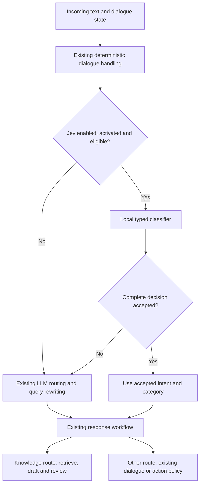

# Why the Open Jev pilot failed, what public implementations demonstrate, and how to recover

**Report date:** 26 September 2026, Asia/Kolkata.  
**Local experiment:** 25 September 2026.  
**Scope:** the Open Jev intent/category routing experiment in the institute helpdesk and Demo 2.  
**Current recommendation:** retain the existing router; keep this checkpoint disabled.

The integration runs, loads trained weights, and produces typed decisions quickly. The trained model does not make sufficiently reliable decisions to replace the existing routing call. On the development test set it accepted 14 of 336 examples, but only 2 accepted decisions were correct. On the live diagnostic questions that did not overlap training, it replaced **zero** LLM routing calls. That explains why the application did not become faster.

The most consequential findings are insufficient independent training data for a randomly initialized model, incorrect teacher labels, a mismatch in what “needs rewriting” means, and acceptance thresholds selected from six successes belonging to only two question families. These are supported by local artifacts and code. The relative contribution of each cause has not been isolated experimentally.

Public research also changes the available options: there is a **different** trained project, `Zefan-Cai/Open-Jev`, with published adapters, evaluation artifacts and measured limitations. It must not be confused with the `kyegomez/open-jev` architecture used here. TypeSafe also publishes concrete RAG recipes and measurements. Their existence supports further experiments; their results do not validate our checkpoint.

## Contents

1. [Meaning of the failure and evidence boundaries](#1-meaning-of-the-failure-and-evidence-boundaries)
2. [Local experiment and results](#2-local-experiment-and-results)
3. [Detailed local failure analysis](#3-detailed-local-failure-analysis)
4. [Why fast inference did not produce faster RAG](#4-why-fast-inference-did-not-produce-faster-rag)
5. [Public research: implementations, successes and limitations](#5-public-research-implementations-successes-and-limitations)
6. [Recovery plan and decision criteria](#6-recovery-plan-and-decision-criteria)
7. [Reproduction, artifacts and remaining uncertainty](#7-reproduction-artifacts-and-remaining-uncertainty)

## 1. Meaning of the failure and evidence boundaries

### 1.1 What failed

| Question | Finding |
| --- | --- |
| Was the code integration completed? | Yes. The previous validation records 179 helpdesk tests and 17 Demo 2 tests passing, including 37 Jev tests. |
| Could the classifier run? | Yes. It ran 20 times in the filtered diagnostic benchmark, with median classifier-stage latency of 8.51 ms. |
| Did the trained decisions meet the quality requirement? | No. Accepted precision was 14.29%, with two critical routing errors. |
| Did it reduce actual LLM calls on the retained live cases? | No. Both variants made 49 logical LLM calls. |
| Why is it inactive? | The checkpoint failed the quality/promotion gates; there is no activation certificate. The configured default remains `off`. |
| Does this establish that all Jev models fail? | No. This was one bounded local experiment using a particular unofficial architecture and dataset. |

The previously passing tests establish software behavior such as fallback, artifact validation and preservation of answer review. They do not establish model accuracy. This investigation rechecked saved results and source code; it did not rerun that entire software suite. [Local validation][local-validation], [runtime][runtime], [configuration][config].

### 1.2 What was investigated

The investigation examined the original and corrected teacher labels; saved training history; tokenizer/model manifests; every saved test prediction; runtime eligibility and acceptance code; raw paired benchmark records; and primary internet sources. Additional statistics below were recomputed from those artifacts. The six accepted calibration examples were recovered through read-only inference with the saved checkpoint and existing thresholds. The training pipeline, evaluation files and test-exposure counter were not changed.

Three evidence levels are kept separate:

- **Observed locally:** counts, predictions, code paths, artifact identities and saved timing records.
- **Reported publicly:** results published by model authors or service providers, not independently reproduced for this report.
- **Proposed explanation or remedy:** an inference that requires a controlled local experiment.

### 1.3 Project scope matters

The [proposal, sections 6 and 24](../Chhattisgarhi_Voice_Shopping_Assistant_Proposal2.pdf) calls for stage-by-stage evaluation of a Chhattisgarhi speech-to-speech system. This Jev pilot instead evaluates **text routing for the institute-helpdesk domain**, using English, Hindi and Hinglish plus unsupported-language examples. It provides no measured Chhattisgarhi speech, ASR, translation or TTS improvement. Hindi performance cannot be substituted for Chhattisgarhi performance. The current web-only decision in [the project guidance](../AGENTS.md) also supersedes the proposal's older Flutter details.

## 2. Local experiment and results

### 2.1 What was actually built

The local model predicts four fields together: intent, department category, language and whether retrieval needs a rewritten query. It can supply a conservative replacement for the existing LLM routing decision. It does not choose between answer models, generate the final answer, translate a query or replace the retriever. This differs from the model-selection workflow described in the user-linked MindStudio article. [Question definitions and acceptance policy][common], [integration][nodes].



The benchmark temporarily exercised the candidate inside an isolated evaluator; it did not activate the checkpoint in the application. Action writes were blocked. [Benchmark implementation][evaluation].

### 2.2 Configuration and provenance

| Item | Recorded value |
| --- | --- |
| Upstream architecture | `kyegomez/open-jev`, commit `93843ef288f3d35fd91263377c40b6f917d77da0` |
| Initial weights | Random initialization; no pretrained language encoder |
| Parameter count | 4,842,261, counted from the saved model configuration |
| Tokenization | Byte-level BPE trained on the training messages; 1,341 realized tokens within an 8,192-entry configured vocabulary |
| Model dimensions | Width 128; 4 attention heads; 3 state layers; 2 question layers; 4 readout layers; 8 slots |
| Context limit | 512 state tokens |
| Teacher | Local Ollama `qwen3.5:9b`, temperature 0 |
| Training | CPU, 4 threads, AdamW, learning rate 0.0003, batch size 16, seed 42 |
| Training stop | 13 epochs; best validation checkpoint at epoch 8 |
| Checkpoint size | 19,433,291 bytes, about 19.4 MB |
| Pilot budget | At most 2,000 synthetic examples and four hours for generation/training; original timer retained across attempts |
| Final thresholds | Each categorical probability ≥ 0.80; each categorical confidence ≥ 0.60; knowledge rewrite probability ≤ 0.05 |

Sources: preserved `manifest.json`, `tokenizer.json`, `teacher_manifest.json`, `training.json` and checkpoint; [training implementation][training]. No new model training was performed for this report.

### 2.3 The corpus is much smaller than its row count suggests

| Split | Expanded rows | Independent authored families* | Language-specific base utterances |
| --- | ---: | ---: | ---: |
| Training | 1,104 | 64 | 184 |
| Calibration/development | 336 | 20 | 56 |
| Test, now development-only | 336 | 20 | 56 |
| Total | 1,776 | 104 | 296 |

\*“Independent authored families” means distinct family identifiers, not a statistical guarantee that topics or wording are independent.

Most families contain three language versions, each expanded by six shared prefix/suffix templates. The training set consists of 60 such trilingual families plus four unsupported-language families. It therefore contains **184 base utterances expanded into 1,104 rows**, not 1,104 unrelated natural requests. All translations and variants of a family stay in one split, which is the correct leakage precaution, but family-level sample sizes remain small. No real student conversations or native-speaker Chhattisgarhi recordings were used. [Corpus generator][data].

### 2.4 First attempt versus corrected attempt

| Metric | Original batched teacher attempt | Corrected single-message teacher attempt |
| --- | ---: | ---: |
| Teacher intent agreement with authored labels, 240 bases | 126/240 = 52.50% | 213/240 = 88.75% |
| Teacher category agreement | 146/240 = 60.83% | 213/240 = 88.75% |
| Teacher language agreement before the later normalization | 139/240 = 57.92% | 181/240 = 75.42% |
| Corrected teacher language agreement after normalization | Not applied in original attempt | 220/240 = 91.67% |
| Raw test intent accuracy | 27/336 = 8.04% | 233/336 = 69.35% |
| Accepted test decisions | 0 | 14 |
| Correct accepted decisions | 0 | 2 |
| Promotion result | Failed | Failed |

The corrected teacher uses the application's existing `RoutingDecision` prompt/schema, one base utterance per call. Only training rows contribute gradients; calibration bases were labeled for audit but their teacher labels are not used as training targets. Unsupported languages retain authored annotations because the existing router schema exposes only three languages. The deterministic runtime language hint is also applied during training-label normalization. [Teacher and training code][training].

The improvement establishes that the corrected pipeline produced a substantially better model. It does not isolate batching as the sole cause: teacher prompting/schema use and language-label handling also changed. Both attempts remain preserved.

### 2.5 Corrected model quality in detail

| Metric | Result | Interpretation |
| --- | ---: | --- |
| Overall intent accuracy | 233/336 = 69.35% | Dominated by the knowledge class |
| Always predict `knowledge` baseline | 210/336 = 62.50% | Only 6.85 percentage points below the model's aggregate accuracy |
| Macro-average intent recall | 40.11% | Gives each of the seven intents equal weight |
| Category accuracy, all rows | 191/336 = 56.85% | Includes easy/default categories for non-knowledge requests |
| Category accuracy, gold knowledge requests only | 72/210 = 34.29% | More relevant to department routing |
| Language accuracy | 299/336 = 88.99% | Does not establish reliable joint decisions |
| Accepted decisions / coverage | 14/336 = 4.17% | Only five distinct families represented |
| Correct accepted decisions / precision | 2/14 = 14.29% | Both successes belong to one clarification family |
| Accepted knowledge decisions | 0 | No demonstrated test fast path for factual RAG queries |
| Critical accepted errors | 2 | Both are variants of one mixed-request family |

Intent recall by true class, recomputed from the saved predictions:

| True intent | Correct / total | Recall |
| --- | ---: | ---: |
| Knowledge | 193/210 | 91.90% |
| Smalltalk | 6/18 | 33.33% |
| Out of scope | 12/36 | 33.33% |
| Clarification | 11/18 | 61.11% |
| Handoff | 11/18 | 61.11% |
| Reminder | 0/18 | 0.00% |
| Cancel | 0/18 | 0.00% |

Reminder/cancel errors describe the classifier, not executed actions: the runtime policy excludes action language and will not accept those action intents from Jev. [Saved aggregate results][summary], [scoring definition][evaluation], [runtime policy][common].

The test set has been exposed twice. These are **development results**, not a fresh final holdout. They are already sufficient to reject the checkpoint, but cannot certify a subsequently tuned replacement.

## 3. Detailed local failure analysis

### 3.1 The architecture supplied no pretrained language understanding

The pilot supplied model structure and locally learned weights, but no pretrained semantic knowledge. Training had to learn text representations, three-language distinctions, seven intents, five department categories and confidence behavior from 64 training families. The small tokenizer improves Unicode handling and reproducibility; it does not supply language understanding. The upstream authors themselves disclose random initialization and missing production weights, as detailed in the public-source section below.

**Assessment:** the absence of pretraining and limited data are confirmed. That combination is a strong explanation for poor generalization. It is not proof that this architecture could never work with substantially different training.

**Useful remedy:** compare against a pretrained local text classifier before spending more effort on from-scratch modeling. Preserve the same acceptance policy and evaluation cases so the comparison answers a clear question.

### 3.2 The original teacher produced valid structures with wrong meanings

Only 52.50% of the original teacher's intent labels agreed with the independently authored base labels. A JSON object can satisfy the schema while assigning a college question to `out_of_scope`. Distilling that output teaches the student the wrong decision boundary. The first checkpoint overwhelmingly predicted out-of-scope or clarification and reached only 8.04% intent accuracy.

The existing single-message routing call improved labeling substantially, but the corrected training bases still contain **20/184 intent disagreements**, **21/184 category disagreements**, **15/184 language disagreements**, and **32/184 rewrite disagreements** after normalization. Disagreement is not automatically proof the teacher is wrong: ambiguous taxonomy and authored-label errors also require review. It is evidence that supervision is inconsistent and should not be accepted blindly.

**Already fixed:** use of the custom batch-labeling path was removed. **Still needed:** adjudicate disagreements before training, with explicit examples defining mixed requests, helpdesk capability questions and department boundaries. The exact mechanism behind the batch failure has not been isolated; model size, JSON validity or temperature alone do not explain it. [Training code][training], archived and corrected teacher artifacts.

### 3.3 “Teacher rewrote the text” was treated as “rewriting is required”

The labeler sets `rewrite=True` when a knowledge query returned by the teacher differs from the original message, or when the language requires translation. String inequality conflates necessary transformation with optional phrasing changes. A perfectly searchable English question may be shortened or paraphrased by the LLM even though it is safe to search verbatim. [Label derivation][training].

This mismatch is measurable:

- Of 30 clean English knowledge training bases whose authored label is `rewrite=False`, **18 (60%)** receive `rewrite=True` from the corrected teacher.
- The same disagreement affects **6/10** corresponding calibration bases.
- Of 60 clean English knowledge test rows, only **5** have predicted rewrite probability ≤ 0.05.
- No knowledge test decision passes the complete gate.

Examples labeled as needing rewriting include “How much is tuition at IIIT Naya Raipur?” and “Can students change rooms at IIIT-NR?” The stored teacher output contains derived labels, not the original rewritten query for every request, so the individual edit cannot be reconstructed from this artifact alone. The code and disagreement counts establish the labeling mismatch.

**Assessment:** confirmed target-definition defect and a plausible major contributor to lost RAG coverage. Correcting it alone would not fix the weak department classifier or accepted intent errors.

**Useful remedy:** label the operational question directly: “Can this exact text be safely used as the retrieval query?” Explicitly distinguish missing referents, translation, mixed requests and necessary normalization from harmless optional paraphrasing. A rewrite teacher should be judged on retrieval usefulness, not exact text equality.

### 3.4 Synthetic smoothing did not provide measured uncertainty

For every training target, the selected teacher label receives probability 0.95 and the other labels share 0.05. That is label smoothing. It does not distinguish a certain teacher from an uncertain or incorrect teacher. The saved teacher manifest explicitly records this limitation.

The local `RLCDLoss` call also omits `augmented_states`. Its consistency term therefore contributes zero, despite the class exposing a nonzero consistency weight. The six template variants appear as separate examples; they are not paired in the consistency objective. The learned confidence target is the dot product of predicted probabilities and the supplied target distribution. Agreement with noisy smoothed labels is not the same as correctness on unseen user requests. [Training call][training], [vendored loss implementation][vendor].

**Assessment:** confirmed training-recipe limitations. They do not prove that adding consistency or teacher ensembles would solve the task. A controlled comparison is needed, with meaningful semantic paraphrases and reviewed labels.

### 3.5 Threshold selection had almost no independent support

The code searches **126 threshold combinations**: seven probability levels × six confidence levels × three rewrite limits. It chooses the most coverage with at least 98% empirical precision and zero critical errors on calibration. It does not require a minimum number of accepted calibration cases. The same calibration split has already been used for checkpoint selection. [Threshold selection][evaluation], [checkpoint selection][training].

The selected gate accepted six calibration rows, all correct. Read-only replay showed that those six are:

| Calibration family | Accepted variants | Predicted intent |
| --- | ---: | --- |
| “My name is Arjun” and its translated/prefixed forms | 4 | Smalltalk |
| “Where do I go for it?” and its suffixed form | 2 | Clarification |

There were **no accepted calibration knowledge examples**. The chosen thresholds therefore supplied no positive evidence that the fast RAG path worked.

Even pretending the six successes were independent Bernoulli observations, the exact one-sided 95% lower bound on precision would be `0.05^(1/6) ≈ 60.7%`, not 98%. Shared families and selection among 126 candidate thresholds make that simple bound an optimistic illustration, not a valid certification calculation for this experiment.

**Assessment:** confirmed weak calibration protocol. The collapse to 2/14 correct accepted test decisions is direct evidence that the selected gate did not generalize.

**Useful remedy:** require substantial independent accepted support; report risk versus coverage; separate checkpoint-selection and acceptance-calibration data where feasible; use untouched final evaluation families; and quantify uncertainty at the family level. A confidence threshold is a decision policy, not a reliability guarantee.

### 3.6 The accepted errors explain why overall accuracy was misleading

The following rows come from the saved test predictions; the probability is the model's predicted intent probability, not an empirically established correctness rate.

| Input | Gold → accepted prediction | Intent probability | Why it matters |
| --- | --- | ---: | --- |
| “Please help: Tell me about whales” | Out of scope → smalltalk | 0.917 | Confident semantic error despite valid output shape |
| “Yeh helpdesk kya kar sakti hai?” | Smalltalk → clarification | 0.869 | A capability question is handled as missing information |
| “मेरा एक प्रश्न है: कल के शेयर के भाव बताओ” | Out of scope → smalltalk | 0.871 | Correct language does not imply correct intent |
| “I have a question: What are IIIT-NR tuition fees, and tell me whale facts?” | Knowledge requiring rewrite → out of scope | 0.914 | Legitimate college content would be discarded |
| “Yeh samjha sakte ho? Please samjhao.” | Clarification/Hinglish → clarification/English | 0.916 | Correct intent still fails the complete route contract |

Both critical errors are English variants of the mixed tuition-fees/whales request. They are **incorrect refusals of the college portion**, not evidence that Jev executed an unsafe transaction. The accepted set contains no knowledge routes: it is a different and much weaker subset than the knowledge-heavy overall test distribution. That is how 69.35% overall intent accuracy coexists with 14.29% accepted-route precision.

The runtime's deterministic language override was also checked for these accepted examples; it does not rescue the incorrect Hinglish/English case. [Integration after routing][nodes].

### 3.7 Generalization plateaued before the training budget ran out

| Epoch | Training composite loss | Validation mean NLL |
| --- | ---: | ---: |
| 1 | 1.3761 | 0.9815 |
| 5 | 0.7829 | 0.6695 |
| 8, selected | 0.5622 | 0.6548 |
| 10 | 0.4445 | 0.7661 |
| 13, stop | 0.3427 | 0.6695 |

Training loss continues falling after epoch 8 while validation fails to improve. The two loss columns use different objectives, so their absolute magnitudes should not be compared; the within-column trends are informative. The saved timer still had about 12,147 seconds remaining at epoch 13. Early stopping, rather than exhaustion of the four-hour budget, ended this run.

**Assessment:** observed generalization plateau, consistent with memorization, noisy supervision and limited diversity. More epochs or GPU training would not directly repair label definitions or create independent examples. A GPU could accelerate a larger future experiment, but CPU training is not an established cause of incorrect predictions.

### 3.8 Runtime eligibility limits useful coverage even for a better classifier

The current policy declines messages with conversation history, pending actions, action-related language or excessive size before prediction. Knowledge shortcuts additionally require English, an explicit IIIT-NR/IIIT Naya Raipur mention, no Devanagari text, and a sufficiently low rewrite score. It requires category and language confidence even for non-knowledge intents. These are deliberate constraints around capabilities the small classifier does not supply. [Policy][common].

Using perfect gold predictions under the same policy, only **132/336 test rows (39.29%)** would be eligible. This is a ceiling for this particular corpus/policy, not an estimate of real traffic. The observed model accepts only 14 rows, with poor precision. Therefore policy restrictions and model quality are separate issues; relaxing the former does not repair the latter.

A future design can investigate whether category confidence is necessary for non-knowledge responses, or whether classification and query rewriting should be separate stages. Any such change must be evaluated against complete response behavior. Hindi/Hinglish factual queries and multi-turn references still require an explicit supported transformation path.

### 3.9 Evaluation contamination was identified and contained

One live benchmark question, “How much is it?”, already appeared in the synthetic training corpus. Its two cache-state pairs showed a shortcut, but that result cannot demonstrate generalization. Both were removed from the reported live summary. Future corpus preparation now reserves the existing live questions and removes entire overlapping families; a fresh preparation produces 1,758 rows. The historical 1,776-row dataset and checkpoint were retained unchanged for audit. [Preparation][data], [overlap detection][common], [validation][local-validation].

The second test exposure is also marked development-only. These issues do not explain away the model's poor results; they restrict which evidence is valid for promotion. A new test set is needed after development decisions are finished.

## 4. Why fast inference did not produce faster RAG

### 4.1 The actual paired timing result

The filtered benchmark contains 22 case pairs across 11 question/dialogue cases, tested with first-use and repeat caches. The follow-up case has two turns, so there are **24 paired turns**. Timings below measure individual helpdesk text turns, excluding audio. The models and retrieval path were warmed, conversations were isolated, and the two variants used separate application caches. [Recorded validation][local-validation], [benchmark code][evaluation].

| Measure | Existing router | Candidate plus fallback |
| --- | ---: | ---: |
| Median turn latency | 14.1750 s | 14.2548 s |
| p95 turn latency | 28.9406 s | 37.1317 s |
| Logical LLM calls | 49 | 49 |
| Turns using accepted Jev routing | 0 | 0 |
| New automated behavior failures relative to baseline | — | 0 |

The candidate's classifier ran on 20 turns, with median stage time **8.51 ms**, including adapter/IPC work. All 20 returned `uncertain_or_ineligible`; two other turns bypassed it for `conversation_history`, and two for `action_language`.

Median end-to-end latency was 0.56% higher and p95 was 28.30% higher in this small run. The result establishes no speed benefit. It does **not** establish that an 8.51 ms classifier caused a multi-second tail regression: LLM timing variation, cache/order effects and small sample size prevent that causal conclusion. A complete promotion benchmark and source review were not performed after quality failed.

### 4.2 The classifier must remove work to save time

Let `R` be the existing routing-model time, `D` all remaining work, `A` an indicator that Jev actually replaces the router, and `C` the total added classifier overhead per turn. If downstream behavior stays equivalent:

```text
baseline time  = R + D
candidate time = C + (1 - A)R + D
mean saving    = E[A × R] - E[C]
```

The saving depends on the routing cost of **accepted** cases, not simply on average classifier speed. When every attempted decision falls back, `A=0`: the original routing call still runs.

The retained baseline turns average 15.589 s total and 4.925 s in `routing_model`. Under the idealized assumption that every routing call could be removed while all other work stayed unchanged, the maximum mean reduction from that stage alone would be about **31.6%**, or roughly **1.46×** total speedup before classifier overhead. This is a workload-specific upper-bound illustration, not a measured result or a forecast.

At 15% accepted coverage, assuming accepted turns have the same routing cost as the average, the corresponding reduction would be only about 4.7% before overhead. Actual accepted-case costs may differ substantially. This explains why the existing promotion gate separately requires both useful coverage and at least 10% median total improvement.

### 4.3 Routing, reranking and generation are different experiments

An uncached factual turn may involve routing, answer drafting and grounding review; cache hits can remove drafting work while retaining review. Our Jev experiment tries to remove only routing. It does not make the vector database faster or eliminate all generation. A reranker instead adds a scoring step after retrieval and may improve evidence quality; that does not automatically reduce latency.

Official speed figures for short typed decisions must therefore not be presented as a multiplier for the entire RAG or speech pipeline. The exact relevant public measurements and their limits are described next.

## 5. Public research: implementations, successes and limitations

All web sources below were inspected on 25–26 September 2026. Public benchmark figures are attributed to their authors; they were not rerun locally. No new weights were downloaded and no hosted model API was invoked for this investigation.

### 5.1 Four projects must not be conflated

| Name | What is actually available | What it establishes |
|---|---|---|
| TypeSafe AI Jev | A hosted, trained decision model, SDK/API, official examples and measured cookbooks | Evidence for that hosted model on the stated workloads |
| `kyegomez/open-jev` | A small PyTorch architecture reconstruction initialized with random weights | A research starting point, not pretrained Jev intelligence |
| `openjev.sh` / OpenJEV | An independently operated access service, documentation, and community repository collection | An integration route whose model/operator provenance and behavior need separate verification |
| `Zefan-Cai/Open-Jev` | A different open-source implementation with released trained adapters and decision heads on pretrained Qwen backbones | A concrete local decision-model candidate with public model cards, measurements and limitations |

The **local pilot used the second row**, not the fourth. A failed run of the second does not establish that the first or fourth cannot work. Conversely, successes of the first or fourth cannot be credited to the second.

The pinned kyegomez README explicitly identifies the project as an unofficial random-weight reconstruction, says the architecture/training details are hypotheses, and lists real pretraining/distillation and trained checkpoints as unfinished work. It warns that typed answers can still be wrong. These are author disclosures, not an inference from disappointing local results. [Pinned upstream README](https://github.com/kyegomez/open-jev/blob/93843ef288f3d35fd91263377c40b6f917d77da0/README.md)

OpenJEV's own documentation states that it is independent of TypeSafe and describes public access to Jev. Its sample response is explicitly illustrative, not a live result. Its API uses `choice`, `score`, and **`noul`**. The webpage is not a checkpoint distribution or proof that the kyegomez implementation matches hosted Jev. [OpenJEV API documentation](https://openjev.sh/docs)

### 5.2 Public documentation adds two important distinctions

#### Confidence semantics differ between implementations

This is an unusually useful source discrepancy. The current official TypeSafe confidence documentation describes confidence as a statistic **derived from the returned probability distribution**, reflecting concentration. The kyegomez implementation instead learns a separate evidence scalar and computes `1 - K / (K + evidence)`. Its comments describe an epistemic-confidence hypothesis. Therefore one must not import a numerical confidence threshold from a hosted-Jev example and assume it has the same interpretation in the clone. Neither implementation's field should be treated as a calibrated application-level error bound without evaluation. [Official confidence semantics](https://docs.typesafe.ai/confidence), [clone confidence head](https://github.com/kyegomez/open-jev/blob/93843ef288f3d35fd91263377c40b6f917d77da0/open_jev/main.py#L466)

**Project inference:** review probability calibration and the complete acceptance policy separately. The outcome to calibrate is whether the final accepted route is correct, including every required field and rewrite condition. Per-head scores are insufficient evidence for that joint event. Changing the confidence formula alone would not restore missing semantics or incorrect labels.

#### Documented limitations of the trained commercial model

TypeSafe's `jev-1.13` limitations page, reviewed 2026-09-17, explicitly lists literal interpretation, numeric precision, date comparisons, indirection, irrelevant state, adversarial content, contradictory instructions, structural invariants and generation. Its remedies include precise criteria, smaller relevant state, decomposition, arithmetic/comparisons in code and using a generative model when prose is required. These are **documented hosted-model limitations**, not measured causes of our clone's failure. [Official Jev 1.13 limitations](https://docs.typesafe.ai/model-jaggedness/jev-1.13)

**Project inference:** classification can fit a fast path; translation, conversational query rewriting and unrestricted answer generation do not become available just because a typed decision interface is present. A future route needs an explicit way to distinguish “rewrite is necessary” from “the teacher happened to rewrite the input.” For fixed local tasks, changing prompts/option wording also changes the learned input contract and requires revalidation.

### 5.3 What people have actually implemented successfully

“Implemented” can mean software runs, a checkpoint was trained, an offline evaluation improved, or a deployed workflow became better. These are different levels of evidence.

#### 5.3.1 Official RAG reranking: measured retrieval improvement, not an end-to-end speed claim

TypeSafe publishes executable code using BM25 to shortlist 30 passages per query and Jev to score each query–candidate pair. On its 40-query CLERC slice, drawn from a 3,565-passage pool, the reported top-1 result changes from 5% to 18%, and top-10 from 38% to 62%. The run makes 1,200 scoring calls, with a 12-worker pool. This is specific, inspectable evidence of improved ranking in that experiment. It does not demonstrate an improvement in answer-generation latency, Hindi routing or the local kyegomez clone. Candidate recall still limits reranking: a missing passage cannot be recovered by reordering a shortlist. [Official reranking cookbook](https://docs.typesafe.ai/cookbooks/rerank_typesafe)

**Transferable method:** benchmark retrieval-only ranking separately from routing and answer generation. If adding a passage scorer, measure whether higher evidence quality outweighs its additional calls and latency; do not assume that adding a model always speeds the system up.

#### 5.3.2 Official passage filtering: a complete RAG integration pattern

A second TypeSafe cookbook builds a corpus of 81 documentation passages, retrieves 12 per query, then asks four independent Noul questions about each passage: relevance, usable evidence, contradiction and prompt injection. Ordinary code places passages into evidence/conflict/excluded sets before answer generation. It includes recorded API cache data for replay and says its thresholds were selected for that corpus, not universal defaults. This is a worked integration with failure-sensitive ordering of gates, not a published broad RAG-quality benchmark. [Official passage-classification cookbook](https://docs.typesafe.ai/cookbooks/classifying_rag_passages)

**Transferable method:** keep the generator, provide passage-level evidence, ask narrow questions together, and log each gating outcome. This is an alternative experiment to the current intent fast path, not a proven fix for its trained checkpoint.

#### 5.3.3 Official batching and uncertainty handling: useful measured engineering techniques

The 13-question TypeSafe cookbook reports about 10× lower latency and 12.2× lower cost for batching questions against one shared article. The comparison sums thirteen **sequential** single-question calls; it explicitly notes that concurrency narrows the latency gap. This is not a 10× full-application speedup. [Official parallel-question measurements](https://docs.typesafe.ai/cookbooks/parallel_questions)

A separate repeated-choice experiment reports that abstention raises policy agreement from 90.8% to 99.2%, with 25.8% abstention and 74.2% automatic action. The authors emphasize that this measures **repeatability, not correctness**; the illustrative 0.60 threshold is not a calibrated guarantee. This supports measuring both coverage and mistakes, rather than presenting a threshold as proof of reliability. [Official self-consistency cookbook](https://docs.typesafe.ai/cookbooks/consistency_choice_cookbook)

#### 5.3.4 Concrete community RAG library: `hotchpotch/jev-reranker`

This author-maintained Python library implements hosted-Jev relevance filtering/reranking, with listwise, pointwise and pairwise modes; request splitting; bounded concurrency; response validation; retry handling; and detailed request/response traces. It includes an evaluation script comparing Jev with a Sentence Transformers CrossEncoder on the same candidate pool. The code is meaningful implementation evidence. Its README is not proof that our dataset would improve, and mock unit tests are not model-quality measurements. The `openjevai` copy is a fork; cite the original author repository when discussing the implementation. [Original reranker repository](https://github.com/hotchpotch/jev-reranker)

**Transferable method:** compare against a pretrained reranker on identical candidates, retain failure records and inspect truncation. Avoid converting service failures into low relevance scores, which would silently erase evidence.

#### 5.3.5 Real community routers: useful source code, limited outcome evidence

`hyspacex/jev-router` implements a self-hosted routing service that calls hosted TypeSafe Jev to classify a new task, then applies YAML policy and binds the selected model for the session. It documents explicit fallback behavior, decision replay and deployment-specific evaluation. “Self-hosted router” here does **not** mean a self-hosted Jev model. Its authors explicitly avoid promising equivalent quality or savings for another model pool. [Router source and documentation](https://github.com/hyspacex/jev-router)

`TypeSafeAI/typesafe-router` describes itself as an independent community tool/model-routing demo. It distinguishes live Jev from keyword mocks and leaves downstream execution to the integrating application. It is useful for studying validation and confidence/fallback policy; a working UI or mock test suite does not establish live routing accuracy. [Community router repository](https://github.com/TypeSafeAI/typesafe-router)

#### 5.3.6 A trained local alternative: `Zefan-Cai/Open-Jev`

The **separate** Open-Jev-2B release supplies a LoRA adapter and scalar decision head for pinned pretrained Qwen3.5-2B weights. Its model card records 80,816 consumed training rows, a temperature fitted on 512 calibration rows, and artifact hashes. Reported hard-label accuracy is 94.71% on test and 86.02% on OOD; ECE rises from 0.011606 to 0.105594. These are evidence of a completed trained checkpoint and substantial distribution-shift effects, not a guarantee for institute helpdesk traffic. The public redistributable training projection omits 1,700 Wiki records from the original mixture, so it is not byte-identical full training reproduction. [Open-Jev-2B model card](https://huggingface.co/ZefanCai/Open-Jev-2B)

The project publishes an audit covering all 26,452 original test/OOD rows, reports zero missing/duplicate/failed records, and recomputes saved-prediction metrics. It states there was no matched **full-data base-model evaluation**, so the full table alone does not isolate the gain caused by training. It also separates synthetic customer-control decisions from live customer-support completion. These are project-produced audits with source and hashes, not a claim of an independent external organization certifying the model. [Full-data audit](https://github.com/Zefan-Cai/Open-Jev/blob/3308a15ccd7eea1df7a37d6ddc39b023b801ba16/reports/full-data-eval-n1-v1/README.md)

The repository additionally reports an external public JevBench result of 150/231 (64.94%) for the 2B model. That substantially lower number is on a different benchmark and cannot be averaged with its synthetic test score. It is a useful warning against choosing only favorable aggregate metrics. The same repository disclaims reproducing proprietary TypeSafe RLCD or published speedups. [Pinned project overview](https://github.com/Zefan-Cai/Open-Jev/tree/3308a15ccd7eea1df7a37d6ddc39b023b801ba16)

Its September 20 latency report measures warmed 2B inference on an H100. Customer-service local-HTTP median is 85.0 ms, versus 295.3 ms for remote Jev HTTPS; for 1,024 state tokens and 32 candidates the local result is **1,015.9 ms**, versus 301.4 ms remotely. Hardware and network paths differ, so these are deployment timings, not matched-hardware superiority. Experimental prefix caching violates the report's probability-parity tolerance on 9/11 workloads and remains off. [Measured latency report](https://github.com/Zefan-Cai/Open-Jev/blob/3308a15ccd7eea1df7a37d6ddc39b023b801ba16/docs/inference-latency.md)

**Transferable lessons:** start from language-pretrained weights, publish exact checkpoint/tokenizer provenance, separate calibration from test, retain unfavorable subgroups, and benchmark actual candidate/context sizes. This alternative is a research candidate, **not a drop-in replacement** for the current 128-dimensional clone checkpoint. Its GPU, dependency and memory requirements differ. Local Hindi/Hinglish/Chhattisgarhi behavior remains to be measured.

### 5.4 What changed in the exact kyegomez ecosystem

PR #1 proposes BPE tokenization, a training pipeline, evaluation, benchmarking and checkpoint release tooling. This is useful engineering progress in the exact architecture's ecosystem. A cache benchmark or completed training command does not by itself establish decision quality. [PR #1](https://github.com/kyegomez/open-jev/pull/1)

The author's fork, `syntaxerror64/open-jev`, now publishes **v0.2.0**, which supersedes the random-initialization v0.1.0 artifact. Its model card describes actual distillation: 500 training rows, 100 holdout rows, a local Qwen2.5-0.5B-Instruct logit teacher and 200 training steps. It reports holdout Brier improving from 0.3133 to 0.1509 and NLL from 0.8850 to 0.6695 relative to random weights. However, its reference targets are the teacher's distributions; it explicitly has **no ground-truth labels**. These results demonstrate improved teacher agreement, not independently established task correctness. The released architecture and hash tokenizer also differ from this project's artifact. [Fork v0.2.0 release and model card](https://github.com/syntaxerror64/open-jev/releases/tag/v0.2.0)

**Transferable method:** use actual teacher distributions, preserve a holdout and publish checkpoint-bound comparisons. Add reviewed task labels before calling the resulting scores helpdesk accuracy. A `.pt` file and lower distillation loss are useful evidence of training, but insufficient evidence for activation.

Bounded search conclusion: trained artifacts do exist in this ecosystem, but the inspected original repository, fork, PR and checkpoint searches did **not** establish a useful multilingual helpdesk checkpoint for the exact kyegomez architecture. This is not a claim that no private deployment exists. The separately developed Zefan implementation provides stronger published task-evaluation evidence for a different local approach.

### 5.5 Related methods with published implementations

SetFit fine-tunes pretrained Sentence Transformers and supports multilingual backbones. Its documentation provides an actual few-shot classification workflow, making it a closer methodological baseline for fixed helpdesk labels than a from-scratch foundation-style reconstruction. Its published examples do not establish that eight examples per class will suffice for this multilingual project. [Official SetFit documentation](https://huggingface.co/docs/setfit/en/index)

Guo et al. show that modern neural networks can be poorly calibrated and that post-hoc temperature scaling can help. This motivates a held-out calibration stage; it does not repair class confusion. A single positive temperature preserves within-head class ordering, so it cannot by itself turn a wrongly ranked intent into the correct intent. [Calibration paper, ICML 2017](https://proceedings.mlr.press/v70/guo17a.html)

SelectiveNet formalizes joint classification and rejection as a risk–coverage problem. The practical lesson here is to evaluate the accepted subset and the declined fraction together, including uncertainty from small sample/family counts. It is an analogous method, not a Jev implementation or a reason to copy published benchmark results. [Selective prediction paper, ICML 2019](https://proceedings.mlr.press/v97/geifman19a.html)

RouteLLM publishes trained routers and evaluation/calibration tools for selecting a stronger versus cheaper answer model. This is relevant if the project later adds **model selection**. It is a different task from the current intent/category gate, and its savings do not imply a speedup from the current Jev pilot. [Author-maintained RouteLLM repository](https://github.com/lm-sys/RouteLLM)

### 5.6 How to interpret the originally linked articles

The September 22 article is a secondary architecture narrative about task, difficulty and privacy-based routing. It is not evidence that `kyegomez/open-jev` ships usable pretrained weights, nor a reproducible evaluation of our pipeline. Its use of “null” for the yes/no primitive conflicts with the official name **Noul**. Its conceptual flow can inspire an experiment, while technical API details should be checked against provider documentation and model-quality claims against artifacts. [User-provided MindStudio article](https://www.mindstudio.ai/blog/how-to-build-model-router-with-jev)

The TypeSafe launch article's speed figures concern structured decision workloads on the hosted service, with explicit caveats about short favorable inputs, client location and upper-end real-world gains. Replacing one routing stage cannot automatically reproduce the same multiplier over retrieval, generation, review, STT and TTS combined. [TypeSafe launch article](https://typesafe.ai/blog/introducing-system-one-models-and-jev)

### 5.7 Search scope and evidence strength

Inspected primary material included the TypeSafe documentation index, confidence/limitations pages, five concrete cookbooks, official workflow evaluation methodology, the pinned kyegomez source and GitHub API metadata, its changed fork/release/PR, OpenJEV's operator statement and repository listings, author-maintained community routers/rerankers, and the separate Zefan checkpoint, audit and latency report. Representative queries included `"kyegomez/open-jev" trained checkpoint accuracy`, `"Jev" "TypeSafe" implementation github router`, `"open-jev" "model card" checkpoint`, and `"OpenJEV" "RAG" benchmark`.

Evidence strength in this report: source-code behavior and existence of public artifacts are directly inspectable; published experiment outcomes are first-party reports; transfer to this institute assistant is an inference requiring local evaluation. No broad customer-production success, multilingual guarantee, or speedup for this project is established by the inspected public materials.

## 6. Recovery plan and decision criteria

### 6.1 Changes already made versus work still proposed

| Area | Already implemented or preserved | Proposed next work |
| --- | --- | --- |
| Teacher | Existing one-message router call; local labeling; provenance and language normalization | Review semantic disagreements and fix rewrite-necessity targets |
| Tokenization | Stable byte-level BPE, tokenizer/model checksums | Compare a tokenizer/encoder with pretrained language representations |
| Runtime | Off/shadow/enabled modes; eligibility checks; bounded CPU worker; fallback; artifact validation | More detailed per-condition rejection counters and representative concurrency evaluation |
| Evaluation | Family splits; held-out authored labels; paired timing; overlap exclusions; test-exposure record | More independent families, final untouched test set and stronger calibration support |
| Promotion | Failed model stays disabled; activation binds reports and artifact identity | Validate a different candidate, then complete the full suite and evidence review |

The present task produced this research report. The proposed work below has **not** been implemented or measured as part of it.

### 6.2 Recommended order of experiments

1. **Repair the task definition and labels.** Review the 184 training bases before generating more variants. Explicitly define intent/category boundaries and whether the exact query can be used for retrieval. Review all mixed requests and actions. Preserve original teacher outputs in future labeling runs so derived targets can be audited.
2. **Build a stronger dataset within a declared budget.** Favor independently worded questions over adding the same greetings to old seeds. Include misspellings, Romanized variation, missing institute names, domain near-misses and multi-intent queries. Keep translations, paraphrases and conversation relatives in one split. Version a new dataset rather than overwriting this pilot.
3. **Establish inexpensive baselines.** Compare the current LLM, simple deterministic rules where appropriate, a frozen pretrained multilingual embedding classifier, and a fine-tuned classifier such as SetFit. The existing greeting/thanks shortcuts already handle some easy traffic, so measure incremental coverage beyond them.
4. **Evaluate the separate trained Open-Jev candidate offline.** Pin its base model, adapter, decision head, tokenizer and calibration artifacts. Measure memory and latency alongside the existing Ollama/speech stack. Its 2B-scale implementation is fundamentally different from this 4.84-million-parameter clone; checkpoint files and timing expectations are not interchangeable.
5. **Retain the current clone as a controlled research comparison.** After label correction, compare meaningful soft targets and equivalent-state consistency separately. Do not change model, labels, thresholds and test set simultaneously and then attribute the result to one intervention.
6. **Choose acceptance policy on development data, then freeze it.** Plot or tabulate accepted precision against coverage, including per-language, knowledge-category and critical-family results. Evaluate the complete route contract, not only intent accuracy. Prefer an explicit defer decision when evidence is insufficient.
7. **Run a fresh full benchmark for a qualifying candidate.** Keep prompts, KB release, caches, answer model, hardware and workload fixed. Include cold/warm starts, normal concurrency, follow-ups and audio-stage timing when making speech claims. Inspect the underlying citations/evidence before promotion.

These are ordered experiments, not a promise that any candidate will pass. The local-first, zero-budget project baseline should remain usable throughout. A hosted-provider experiment would be a separately scoped comparison, not a hidden new dependency.

### 6.3 Targeted ablations that would answer the remaining causal questions

| Question | Controlled comparison | Evidence to collect |
| --- | --- | --- |
| How much did incorrect teacher labels hurt? | Same model/data split, current labels versus reviewed labels | Per-intent confusion, accepted precision/coverage |
| Is rewrite-label mismatch suppressing useful RAG cases? | Same model setup, string-inequality target versus reviewed query-usability target | Clean knowledge eligibility, retrieval relevance and final answer correctness |
| Is missing pretraining the main limitation? | Same labels and held-out families, random clone versus pretrained classifier | Quality, memory, cold/warm latency, learning curves |
| Does consistency training improve stability? | Same examples, with/without correctly paired equivalent states | Family-level disagreement and held-out selective risk |
| Are confidence scores usable? | Raw scores versus a held-out calibration method | Reliability curves, Brier/NLL, risk–coverage, accepted support |
| Does the policy reject unnecessary fields? | Current joint gate versus reviewed task-conditional gate | Complete-route errors and additional safe coverage |
| Does a reranker help this KB? | Same retrieved candidates, baseline ordering versus reranking | Recall@k, ranking metrics, grounded answer accuracy and extra time |

Use development data for these comparisons. Stop using the final test set once it has informed an implementation choice.

### 6.4 Existing promotion gates and what they do not prove

Current code requires all of the following. [Promotion definitions][evaluation].

| Gate | Existing requirement | Current pilot |
| --- | --- | --- |
| Accepted quality support | At least 100 accepted test examples | 14 |
| Accepted precision | At least 98% | 14.29% |
| Critical errors | Zero | 2 |
| Gold/splits | Reviewed gold, no family overlap, fresh test | Test reused; fails freshness |
| Live coverage | At least 15% | 0% |
| Median latency improvement | At least 10% | −0.56% |
| p95 ratio | At most 1.05 | 1.283 |
| Behavior | No newly failing cases | Passed only the diagnostic subset |
| Completeness | Full suite and source review | Both incomplete |
| Artifact binding | Passing reports match exact artifact | No activation certificate |

These are engineering gates, not a statistical proof of 98% population precision. Even 100/100 independent successes would have an exact one-sided 95% lower bound of only about 97.05%. With zero errors, at least **149 independent successes** are needed for that simple lower bound to exceed 98%, because `0.05^(1/149) > 0.98`. Any errors, clustered templates, threshold selection or distribution shift require a more careful design and often more data.

The `gold_reviewed` flag currently checks correspondence with the authored canonical synthetic rows. It is not evidence of an independent human annotation study. A stronger follow-up should record reviewer decisions and label disagreements explicitly. Keeping a failed checkpoint disabled is correct behavior; reducing thresholds to make the feature appear active would invalidate the purpose of the gate.

### 6.5 Recommended project decision

For the current application, retain the existing router. The next useful research step is **label repair plus a pretrained local baseline**, with the separately trained Open-Jev release as an additional candidate if resources permit. Repeating the same tiny from-scratch experiment with more epochs is lower priority.

For a report or presentation, an accurate finding is: “A bounded local typed-decision router was integrated and evaluated. It achieved millisecond classifier inference but failed selective accuracy and did not reduce valid live routing calls. The existing router was retained. Follow-up analysis identified supervision, data-diversity, calibration and task-fit limitations.”

## 7. Reproduction, artifacts and remaining uncertainty

### 7.1 Local evidence inventory

The preserved artifact directory is:

```text
/home/rtx/.cache/institute-assistant/open-jev/pilot-v1
```

| Artifact | Purpose |
| --- | --- |
| `data.json` | Original 1,776 rows, family/split identifiers, authored labels and critical flags |
| `teacher.json`, `teacher_manifest.json` | Corrected labels, provider identity, prompt hash, labeling method and agreement audit |
| `training.json`, `resume.pt` | Learning history and saved optimizer/training progress |
| `model.pt`, `tokenizer.json`, `manifest.json` | Inference artifact, vocabulary, architecture and hashes |
| `evaluation.json`, `test_predictions.json` | Aggregate quality and every predicted distribution |
| `test_exposures.json` | Records two exposures; explains development-only status |
| `benchmark_pairs.json` | All original timing/output pairs, including the two excluded overlap pairs |
| `benchmark.json` | Final filtered per-turn summary |
| `benchmark_unfiltered.json` | Earlier summary retained for audit; not the final reported benchmark |
| `attempt-01-batched-teacher/` | First attempt's labels, checkpoint, training history and failed evaluation |
| `pilot.json` | Original budget start and limits |
| `activation.json` | Absent: this checkpoint was not promoted |

The committed-size documentation is [the validation report][local-validation], [machine-readable pilot summary][summary] and [operating guide][guide]. Large models and generated evaluation records remain outside Git.

Selected SHA-256 values recomputed during this investigation:

```text
model.pt
7e1242d6f38fcc9bd8948ad02d46ef5d0bff68a93b04a28bf6fdfe432bf8dff1

data.json
1aa4b2e316569b12a3b43d51455c5165d5cd635dd3a1bcd1a201f4a9d3004272

teacher.json
6fa7901a2bd978d6563987df72f315f329bf22a36bab433d0a9ae654914328fd

tokenizer.json
9e85d3ddcde8212d53575296fa7e1432865802bf26053ec0a91d278e872c69f2

benchmark_pairs.json
da194872e6e4cce0a0410eafa1d89077fe2cfe6e8b9d96cfcd04d4d59f9302d5
```

The manifest's content-derived artifact ID is `21bb3d5442119590f997c8c1fe02c5dcfc0614fd0b9a4bc0f733275dd6d9d513`; it is computed from canonical JSON, so it differs from the hash of the formatted `manifest.json` file.

### 7.2 Read-only reproduction of the main quality findings

Run from the repository root using the existing `minor` environment. This reads saved predictions and the existing pure scoring functions. It does not retrain, relabel, retune or overwrite the evaluation.

```bash
conda activate minor
cd code/Institute-voice-agent/institute-assistant
python - <<'PY'
import json
from collections import Counter
from pathlib import Path
from assistant.jev.common import accepted, preflight
from assistant.jev.evaluation import correct, summarize_pairs

root = Path.home() / ".cache/institute-assistant/open-jev/pilot-v1"
read = lambda name: json.loads((root / name).read_text())
rows = read("data.json")
by_id = {row["id"]: row for row in rows}
predictions = read("test_predictions.json")
thresholds = read("manifest.json")["thresholds"]
for split in ("train", "calibration", "test"):
    group = [row for row in rows if row["split"] == split]
    print(split, "rows", len(group),
          "families", len({row["family"] for row in group}))
decisions = []
for item in predictions:
    row = by_id[item["id"]]
    decision = (None if preflight(row["message"]) else
                accepted(row["message"], item["prediction"], thresholds))
    if decision is not None:
        decisions.append((row, decision))
print("accepted", len(decisions))
print("correct", sum(correct(row, decision) for row, decision in decisions))
print("accepted intents", Counter(d.intent for _, d in decisions))
knowledge = [x for x in predictions if x["gold"]["intent"] == "knowledge"]
print("knowledge category correct",
      sum(x["gold"]["category"] == x["prediction"]["category"] for x in knowledge),
      "of", len(knowledge))
pairs = [x for x in read("benchmark_pairs.json") if x["case"] != "ambiguous"]
stats = summarize_pairs(pairs)
print({k: stats[k] for k in ("pairs", "turn_pairs", "coverage", "llm_calls",
                            "baseline_p50_seconds", "candidate_p50_seconds")})
PY
```

Expected key outputs: 14 accepted, 2 correct, no accepted knowledge decisions, 72/210 correct knowledge categories, 22 retained pairs, 24 paired turns, zero live coverage and 49 LLM calls per variant. Do not use the mutating `evaluate` command merely to inspect old numbers: it records another test exposure and rewrites evaluation artifacts. A future experiment should use a new versioned artifact directory.

### 7.3 Questions this report does not settle

- How much each individual defect contributes; no controlled retraining ablation was performed here.
- Whether the independently authored labels are all optimal; disagreement review remains necessary.
- Whether a pretrained local candidate, a trained Open-Jev release or hosted Jev meets this helpdesk's quality and resource requirements.
- Whether any candidate improves Chhattisgarhi voice outcomes; that requires representative speech and native-speaker evaluation.
- Whether the observed p95 difference persists under repeated, larger, controlled timing runs.
- Whether a private organization has a successful deployment of the exact kyegomez architecture; the public search cannot establish absence of private deployments.

The strongest current conclusion is specific and actionable: the local inference mechanism is fast, but this checkpoint lacks reliable accepted decisions and therefore removes no valid live routing work. Better labels, broader independent data, a pretrained baseline and a statistically stronger acceptance evaluation are the next justified steps.

[local-validation]: ../../code/Institute-voice-agent/institute-assistant/docs/OPEN_JEV_VALIDATION.md
[summary]: ../../code/Institute-voice-agent/institute-assistant/docs/open_jev_pilot_summary.json
[guide]: ../../code/Institute-voice-agent/institute-assistant/docs/OPEN_JEV.md
[common]: ../../code/Institute-voice-agent/institute-assistant/assistant/jev/common.py
[data]: ../../code/Institute-voice-agent/institute-assistant/assistant/jev/data.py
[training]: ../../code/Institute-voice-agent/institute-assistant/assistant/jev/training.py
[evaluation]: ../../code/Institute-voice-agent/institute-assistant/assistant/jev/evaluation.py
[runtime]: ../../code/Institute-voice-agent/institute-assistant/assistant/jev/runtime.py
[vendor]: ../../code/Institute-voice-agent/institute-assistant/assistant/jev/vendor/model.py
[nodes]: ../../code/Institute-voice-agent/institute-assistant/assistant/nodes.py
[config]: ../../code/Institute-voice-agent/institute-assistant/assistant/config.py
