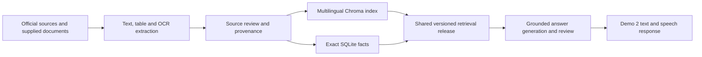

# Demo 2: Knowledge-base rebuild — presentation update

**Results date:** 22 September 2026  
**Active release:** `20260922T095421217856Z`  
**Status:** Implemented, activated, and checked through Demo 2's shared retrieval configuration.

## Presentation summary

The IIIT Naya Raipur helpdesk now combines multilingual document retrieval with exact database lookups for admission cutoffs. The rebuild adds official rank data, scholarship and education-finance evidence, scanned-document extraction, and traceable source references.

- **98.92% supporting-evidence recall@6:** 92 of 93 answerable benchmark questions retrieved the required evidence.
- **42/42 exact-cutoff checks passed:** includes published rank lookups and requests for unavailable cutoffs.
- **11.4 ms median / 13.8 ms p95 warm retrieval:** local retrieval only; excludes answer generation and speech processing.
- **611 official JoSAA cutoff records**, **222 vector chunks**, and **82 passing automated tests**.
- **46 offline information questions** prepared to collect missing institute policies and confirm uncertain information.

These are development-benchmark results for the institute-helpdesk domain. They demonstrate a further application of the voice project's domain layer; they do not establish Chhattisgarhi speech accuracy, agricultural task success, or completion of the original proposal's end-to-end evaluation.

## Measured results

| Metric | Achieved result | Interpretation |
| --- | --- | --- |
| Evaluation set | 117 questions | 39 English, 39 Hindi, 39 Hinglish |
| Answerable questions | 93 | 31 per language |
| Supporting-evidence recall@6 | **92/93 = 98.92%** | Expected evidence present among up to six results, with required terms present |
| Previous corpus baseline | **10/93 = 10.75%** | Supporting-source/page recall on the expanded question set |
| Observed difference | **+88.17 percentage points** | Corpus, extraction and retrieval changed together; not an isolated model comparison |
| Exact-cutoff checks | **42/42 = 100%** | 30 known-cutoff scenarios and 12 unavailable-cutoff scenarios |
| Other unsupported questions | 12 | Require generated-answer abstention review; not counted as passed |
| Warm retrieval median | **0.0114 s / 11.4 ms** | Across the mixed semantic-retrieval and exact-lookup benchmark |
| Warm retrieval p95 | **0.0138 s / 13.8 ms** | Excludes model initialization, LLM calls, STT and TTS |
| Agent regression tests | **69 passed** | Mocked providers, temporary databases and local fake embeddings |
| Demo 2 regression tests | **13 passed** | Application and adapter checks with mocked providers |
| Combined automated tests | **82 passed** | Software regression coverage, not 82 live user trials |
| Live answer checks | **7 attempted; all 7 unavailable** | Groq rate limits prevented completed answer validation |

### Language breakdown

| Question language | Answerable cases | Evidence retrieved | Recall@6 |
| --- | --- | --- | --- |
| English | 31 | 31 | 100.00% |
| Hindi | 31 | 30 | 96.77% |
| Hinglish | 31 | 31 | 100.00% |
| **Total** | **93** | **92** | **98.92%** |

The remaining retrieval failure is `loan_repayment_hindi`. These small, source-checked development cases are not an independent held-out study or evidence of equivalent performance on arbitrary user questions. Chhattisgarhi retrieval was not evaluated in this set.

### How to explain the benchmark

The evaluator checks whether a retrieved block, or its linked source evidence, matches a labelled reference and whether required terms appear in the returned context. Exact-rank cases additionally check the stored opening and closing values under explicit filters. Unavailable-cutoff cases must return no substitute row.

The old baseline uses matching source filename and page as a proxy for supporting evidence; the new release uses block identifiers and required terms. The comparison therefore shows development progress on the expanded corpus, not a controlled model ablation. It is not a measurement of generated-answer accuracy, hallucination rate, OCR character accuracy, or user satisfaction.

## Data coverage

| Item | Count / scope |
| --- | --- |
| Source inventory entries | 75, including local copies, public result pages and failed source requests |
| Failed source fetches | 26; failures are not represented as fresh evidence |
| Vector chunks | 222 |
| Release evidence/parent blocks | 757, including cutoff evidence and two derived scheme records |
| Structured database records | 613: 611 cutoff records and 2 scholarship/finance records |
| Extraction blocks awaiting review | 267; excluded from factual answers pending review |
| Offline collection checklist | 46 questions with priority, suggested office and required evidence |

### Official JoSAA rows collected

| Admission year | Cutoff rows | Rounds represented in the collected data |
| --- | --- | --- |
| 2022 | 86 | 1–6 |
| 2023 | 81 | 1–6 |
| 2024 | 92 | 1–5 |
| 2025 | 192 | 1–6 |
| 2026 | 160 | 1–5 |
| **Total** | **611** | Coverage of the downloaded official result pages |

Every cutoff keeps its **year, counselling authority, round, programme, quota, seat category, gender pool, rank basis, opening rank and closing rank**. The collected rows are JoSAA All India quota records for CSE, ECE and DSAI. They do not establish CG, NTPC, CSAB or institute spot-round cutoffs.

Other available evidence includes the supplied admissions brochure, reporting instructions, FAQs, academic calendar, NIRF submissions and historical annual report; the Chhattisgarh post-matric scholarship notice for 2026–27; and government-hosted PM-Vidyalaxmi guidelines. General scheme rules do not establish current IIIT-NR eligibility or an individual student's eligibility.

## Implemented improvements

| Area | Implementation | Benefit |
| --- | --- | --- |
| Acquisition | Bounded public-source downloads, JoSAA public-form adapter, raw-byte hashes and fetch records | Evidence can be traced to its source; failed refreshes retain the previous copy and date |
| Native PDFs | Text and tables extracted separately with page and bounding-box metadata | Table values retain row/column context |
| Scans and Indic fonts | Local English/Hindi Tesseract OCR and scanned-grid detection | Previously inaccessible calendar and scholarship content becomes reviewable |
| Graphs and illustrations | Figure crops, vector-figure evidence and extracted labels retained for review | Visual evidence remains inspectable; uncertain chart values are not guessed |
| Embeddings | Pinned multilingual E5-small, normalized query/passage embeddings, local CPU inference | Supports English, Hindi and Hinglish retrieval |
| Chunking | 350-token target, 50-token overlap, source headings and intact table rows | Reduces loss of context; overlong rows are flagged rather than silently truncated |
| Retrieval | Semantic search plus BM25 and reciprocal rank fusion; short parent blocks restored | Combines meaning-based search with exact terminology |
| Numerical facts | Exact SQLite cutoff lookup | Prevents a similar-looking category or quota from replacing the requested record |
| Financial rules | Linked benefits, conditions, exclusions and explicit institution applicability | Keeps eligibility qualifications with the retrieved benefit |
| Dates and provenance | Reviewed source/row periods, historical flags, official links and source/page references | Separates publication year from the period a statistic describes |
| Deployment | Immutable releases with one atomic active pointer and a preserved previous index | Chroma and structured facts switch together; failed builds preserve working data |

The fee table, both academic-calendar pages, NIRF summary tables and CG scholarship notice were visually checked against rendered originals. The pipeline does **not** automatically understand every graph or guarantee that all OCR output is correct.



Embedding and OCR inference are local. Routing, answer generation and grounding review still use Groq; the full assistant is not an entirely offline system. This rebuild did not rebenchmark or replace the speech models.

## Reliability and integration evidence

- Demo 2 resolves the same active release as the text helpdesk.
- The integration check retrieved the exact 2026 JoSAA round 5 CSE/SC/All India/Gender-Neutral record, with category-rank semantics retained.
- An unavailable NTPC cutoff returned no substitute from another quota.
- A question about first-semester mid-term examinations retrieved the reviewed scanned calendar.
- Regression tests cover source-bound financial conditions, failed fetch/build preservation, activation, rollback and switching away from a cached legacy index.
- The original index is backed up at `kb_state/backups/legacy-before-verified-20260922`; existing conversations and tickets were preserved.

## Limitations and next evaluation work

1. **Current institute coverage:** institute requests timed out. Current spot notices, institute-funded scholarships, CG/NTPC cutoffs and several campus policies still require an official source or offline confirmation.
2. **Financial eligibility:** current bank-specific rates and IIIT-NR's inclusion in loan-subsidy eligibility lists were not established.
3. **Visual extraction:** 267 blocks await review. Obtain clear tables, source spreadsheets or verified descriptions where graphs cannot be read reliably.
4. **Source contradictions:** the supplied brochure has conflicting NTPC seat totals and a rank-card-year inconsistency. These unresolved claims are withheld and included in the offline checklist.
5. **Generated answers:** all seven live checks were blocked by provider rate limits. Rerun them, inspect answers and quotations, and evaluate abstention on unsupported questions when the provider is available.
6. **Research evaluation:** add an independent held-out question set, student/staff review and a Chhattisgarhi slice. Measure speech recognition, answer correctness, full speech-response latency and usability separately.

## Reproducibility

The saved benchmark was generated at `2026-09-22T10:03:51.241675+00:00`. Its evaluation-file SHA-256 is `7e91e0d0115b173d6f356262fad9956b6c9000eb37c355f7358f89d62414d843`.

| Setting | Recorded configuration |
| --- | --- |
| Embedding model | `intfloat/multilingual-e5-small` |
| Model revision | `614241f622f53c4eeff9890bdc4f31cfecc418b3` |
| Pipeline version | `2.2` |
| Vector metric / preprocessing | Cosine; normalized vectors; `query:` and `passage:` prefixes |
| Embedding runtime | CPU, four Torch threads, batch size 32 |
| Retrieval output | Up to six evidence results |
| Host inspected for this documentation | Linux x86_64, Intel Core i7-14650HX |
| Python environment | Existing `minor` Conda environment; Python 3.11.15 |

Relevant installed versions, inspected while preparing this update: Torch `2.13.0`, Sentence Transformers `3.3.1`, Transformers `4.46.1`, Chroma `0.5.23`, langchain-chroma `0.2.0`, pdfplumber `0.11.4`, OpenCV headless `4.10.0.84`, Beautiful Soup `4.13.5`. This is an environment snapshot, not a dependency lockfile. No repeated-run confidence interval, cold-start timing or concurrent-load result is reported.

From the repository root:

```bash
conda activate minor
cd code/Institute-voice-agent/institute-assistant
python -m pytest -q
python kb_pipeline.py evaluate --release 20260922T095421217856Z --baseline
# Requires the configured provider and available quota:
python evaluate_helpdesk.py --live --release 20260922T095421217856Z \
  --case verified_cutoff --case cg_scholarship --case loan_conditions \
  --case loan_institute_eligibility --case spot_current --case scanned_calendar \
  --case fee_structure --interval 30 --output /tmp/demo2-live-recheck.json
```

The release's local models and downloaded artifacts must be present to reproduce retrieval. Re-running evaluation updates its saved validation results; the numbers above describe the recorded 22 September run.

## Supporting artifacts

- [Rebuild validation report](../../code/Institute-voice-agent/institute-assistant/docs/KB_REBUILD_VALIDATION.md)
- [117 evaluation questions and expected evidence](../../code/Institute-voice-agent/institute-assistant/docs/kb_evaluation_cases.json)
- [Per-case validation results for this release](../../code/Institute-voice-agent/institute-assistant/kb_state/releases/20260922T095421217856Z/validation.json)
- [Source inventory and official URLs](../../code/Institute-voice-agent/institute-assistant/docs/KB_SOURCE_INVENTORY.md)
- [Extraction review queue](../../code/Institute-voice-agent/institute-assistant/docs/KB_EXTRACTION_REVIEW.md)
- [Saved live answer checks](../../code/Institute-voice-agent/institute-assistant/docs/kb_live_evaluation.json)
- [Code and integration checks](../../code/Institute-voice-agent/institute-assistant/docs/kb_code_checks.json)
- [46 questions to collect offline](../../code/demo2/OFFLINE_INFORMATION_NEEDED.md)
- [Maintenance and release instructions](../../code/Institute-voice-agent/institute-assistant/README.md)

## Suggested closing statement for the presentation

“Demo 2 now uses a traceable multilingual knowledge base with exact category-specific cutoff lookup. In our 117-question development benchmark, it retrieved supporting evidence for 92 of 93 answerable questions and passed all 42 cutoff checks. Warm retrieval took 11.4 milliseconds at the median. These results validate the retrieval layer; generated-answer accuracy and end-to-end speech performance still need separate evaluation.”
