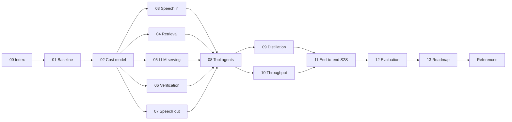

# Future Work: Making the Local Voice Agent Fast, Cheap and Reliable

## Executive summary

The basic voice RAG agent works: hybrid retrieval, exact SQL cutoffs, verbatim-quote
grounding and release-bound caches are in place ([01](01_BASELINE_AND_CURRENT_ARCHITECTURE.md)).
It is slow. On the project laptop an answered text turn takes **18.7 s at the median and
29.9 s at p95**, and the recorded local voice runs commonly took 20–50 s
**[Measured-here]**. Almost all of that is three sequential calls to the 9B model
(routing 3.8 s, generation 7.2 s, a second review call 7.4 s). Retrieval takes 50 ms.

Measurements taken for this report found three causes that matter more than model size:

- The desktop already uses about 2.7 GB of the 8 GB GPU, so 45–52% of the model runs on the CPU.
- The quote-enum JSON grammar made decoding 2.6× slower in a probe.
- Prompt-prefix reuse works only for byte-identical prompts on this hybrid DeltaNet model.

Nothing streams: not the speech input, not the model output, not the speech output.

The research in chapters 03–12 points to one strategy that applies to any local voice agent,
including the shopping assistant and a receptionist:

1. Make each token cheaper.
2. Make fewer large-model calls, without giving up claim-level grounding.
3. Overlap what remains with the user's speech and with playback.
4. Only then add concurrency, telephony or new hardware.

The estimated effect on the current laptop is that the first answer audio moves from about
22–28 s to about 11–14 s after config-level changes, about 5–8 s after a cheap verifier and
streaming input, and about 2.5–4 s after streaming verification and speculative decoding.
A 16–24 GB GPU brings it to about 1–1.5 s **[Estimated, 13 §5]**. Speech-to-speech models are
not recommended as the answer path, because they cannot keep the verbatim-quote guarantee
([11](11_END_TO_END_SPEECH_MODELS.md)).

## Top 10 recommendations

| # | Recommendation | Expected effect | Where |
|---|---|---|---|
| 1 | Free the desktop's VRAM (display on the iGPU) and use a text-only model file so the 9B fits fully on the GPU | Decode ≈17.7 → ≈32 tok/s; turn −35–45% [Estimated] | [05](05_LLM_INFERENCE_AND_SERVING.md), [02 §2.1](02_LATENCY_COST_MODEL_AND_METRICS.md) |
| 2 | Skip the 9B re-review on byte-identical verified draft-cache hits | −≈7 s per cache hit [Estimated] | [06](06_VERIFICATION_AND_CACHING.md) |
| 3 | Replace most 9B reviews with a small claim checker (MiniCheck / HHEM) and escalate only uncertain or critical answers | Review 7.4 s → 0.1–1.5 s on most turns [Estimated] | [06](06_VERIFICATION_AND_CACHING.md) |
| 4 | Quote by source ID + integer span index, with a byte-stable prompt prefix | Removes the 2.6× grammar penalty [Measured-here]; prefill reuse 1.1 s → 0.1 s | [05](05_LLM_INFERENCE_AND_SERVING.md) |
| 5 | Stream speech output per sentence with a short first clause; play an acknowledgement immediately; pre-synthesise frequent audio | First sound < 1 s; first answer clause ≈1–1.4 s after text [Estimated] | [07](07_SPEECH_OUTPUT.md) |
| 6 | Wire the existing streaming STT service (VAD, partials) into Demo 2 and add a semantic end-of-turn model | ASR residual whole clip → ≈last second; end of turn 300–600 ms [Estimated] | [03](03_SPEECH_INPUT_AND_TURN_TAKING.md) |
| 7 | Extend the learned router to Hindi/Hinglish (or a small routing model) with calibrated deferral | Routing 3.8 s → ≈0.1 s on covered turns [Estimated] | [09](09_DISTILLATION_AND_FINE_TUNING.md) |
| 8 | Prompt-lookup speculative decoding (answers copy quotes from the prompt) via llama-server | 1.6–2.4× decode [Reported, other models/hardware] | [05](05_LLM_INFERENCE_AND_SERVING.md) |
| 9 | Replace online Edge TTS with local Kokoro-82M; add a multilingual reranker and an Indic BM25 tokeniser | Fully offline voice; better Hindi/Hinglish evidence | [07](07_SPEECH_OUTPUT.md), [04](04_RETRIEVAL_AND_KNOWLEDGE_BASE.md) |
| 10 | Build the missing evaluation assets: recorded speech sets, claim-level audit, paired statistics, energy logging | Every gain becomes provable; replaces overstated claims | [12](12_EVALUATION_AND_BENCHMARKING.md) |

For tool agents, the deterministic fast path (slot filling, fuzzy entity resolution), tool
retrieval, speculative read-only tool calls and confirm-before-write carry most of the gain
([08](08_TOOL_CALLING_AND_TASK_AGENTS.md)). For many users and phone calls, see
[10](10_THROUGHPUT_CONCURRENCY_AND_TELEPHONY.md). The phased plan is in
[13](13_ROADMAP_AND_PRIORITISATION.md). Corrections to earlier presentation claims are in
[01 §6](01_BASELINE_AND_CURRENT_ARCHITECTURE.md).

## Reading guide

| # | Document | Question it answers |
|---|---|---|
| 01 | [Baseline and current architecture](01_BASELINE_AND_CURRENT_ARCHITECTURE.md) | What does the system really do today, and how fast is it? |
| 02 | [Latency, cost model and metrics](02_LATENCY_COST_MODEL_AND_METRICS.md) | Where can time and memory go, in equations? |
| 03 | [Speech input and turn-taking](03_SPEECH_INPUT_AND_TURN_TAKING.md) | Streaming ASR, VAD, end-of-turn, barge-in |
| 04 | [Retrieval and knowledge base](04_RETRIEVAL_AND_KNOWLEDGE_BASE.md) | Embeddings, reranking, contextual chunks, prefetch |
| 05 | [LLM inference and serving](05_LLM_INFERENCE_AND_SERVING.md) | Fitting the model, caching prefixes, decoding faster |
| 06 | [Verification and caching](06_VERIFICATION_AND_CACHING.md) | Keeping grounding while removing the second 9B call |
| 07 | [Speech output](07_SPEECH_OUTPUT.md) | Streaming, fully local TTS |
| 08 | [Tool calling and task agents](08_TOOL_CALLING_AND_TASK_AGENTS.md) | Shopping assistant, receptionist, generic tool agents |
| 09 | [Distillation and fine-tuning](09_DISTILLATION_AND_FINE_TUNING.md) | Replacing 9B stages with small trained students |
| 10 | [Throughput, concurrency and telephony](10_THROUGHPUT_CONCURRENCY_AND_TELEPHONY.md) | From one user to many; phone calls |
| 11 | [End-to-end speech models](11_END_TO_END_SPEECH_MODELS.md) | Should we use Moshi-style speech-to-speech models? |
| 12 | [Evaluation and benchmarking](12_EVALUATION_AND_BENCHMARKING.md) | How to prove any of this works |
| 13 | [Roadmap and prioritisation](13_ROADMAP_AND_PRIORITISATION.md) | What to do first, per hardware tier |
| — | [References](REFERENCES.md) | Ledger of every external source |

## How to read the technique entries

### Evidence labels

| Label | Meaning |
|---|---|
| **[Measured-here]** | Taken from a file in this repository (path given) or from a read-only measurement on the project laptop on 2026-10-05. |
| **[Reported]** | Stated by a cited source (`[Rxx]`). The conditions (model, hardware, dataset) are given next to the number. Not reproduced here. |
| **[Estimated]** | Derived by us. The derivation is shown. Treat as a planning number to be replaced by a measurement. |

### Hardware tiers

| Tier | Machine | Typical serving stack |
|---|---|---|
| **T0** | Current laptop: RTX 4060 Laptop 8 GB VRAM, i7-14650HX (24 threads, no AVX-512), 31 GB RAM | Ollama / llama.cpp, Q4 GGUF, CPU speech |
| **T1** | Single 16–24 GB GPU workstation (e.g. RTX 4080/4090/5090-class) | llama.cpp server or vLLM/SGLang single GPU, everything on GPU |
| **T2** | Server with one or more 40–80 GB GPUs | vLLM / SGLang with batching, prefix cache, speculative decoding |
| CPU-only | Kiosk / no GPU | ONNX/CTranslate2 speech, ≤4B LLM or remote LLM |

### Technique entry template

Every technique in chapters 03–11 follows this structure:

| Field | Content |
|---|---|
| **What** | One-paragraph definition. |
| **Intuition** | Why it should help, in plain words. |
| **Maths** | The governing equation(s) or algorithm. |
| **Evidence** | Sources with reported numbers and the conditions they were measured under. |
| **Where it fits** | Repository location as `path::function`. |
| **How to implement** | Steps, repository/model to reuse, licence. |
| **Expected effect** | Range with an evidence label, per hardware tier where it differs. |
| **Risks / interactions** | Especially with grounding: verbatim quote check, release-bound caches, exact SQL cutoffs. |
| **How to measure** | Metric, dataset, and pass criterion (see [12](12_EVALUATION_AND_BENCHMARKING.md)). |

### Citation style

External sources: `[R25]` linking to [REFERENCES.md](REFERENCES.md). Repository code:
`code/Institute-voice-agent/institute-assistant/assistant/nodes.py::generate_answer_node`
(paths are relative to the repository root `Minor/`).

Scope rule: documents only. No code, configuration, model or existing document was changed
to produce this set.
