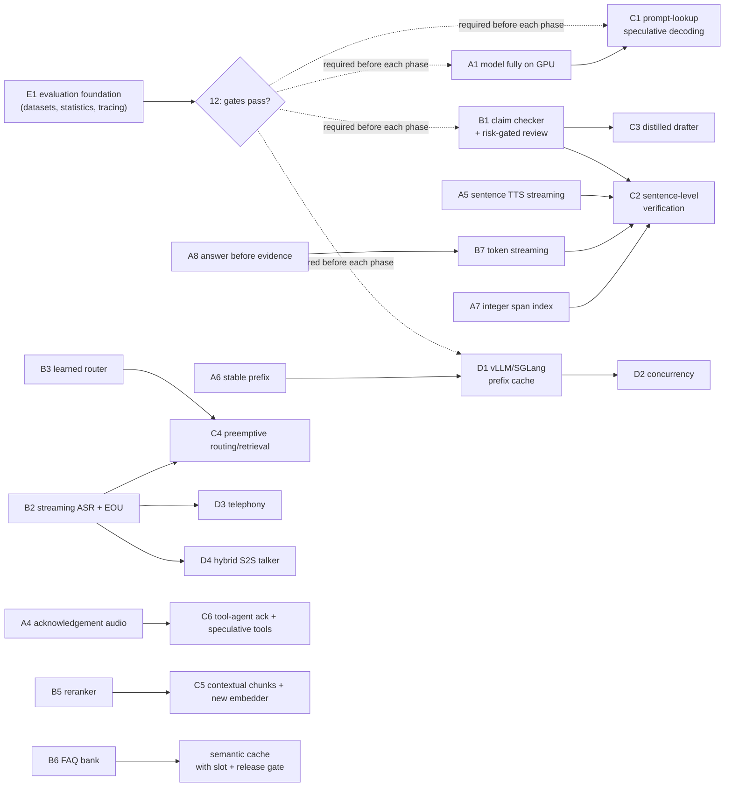

# 13 — Roadmap and Prioritisation

This chapter ranks every recommendation from chapters 03–12 by impact, effort and risk,
orders them into phases for each hardware tier, and estimates the cumulative latency after
each phase. Every latency in this chapter is **[Estimated]** from the cost model in
[02](02_LATENCY_COST_MODEL_AND_METRICS.md) and the measured baseline in
[01](01_BASELINE_AND_CURRENT_ARCHITECTURE.md) unless stated otherwise. Each phase must pass the
gates in [12](12_EVALUATION_AND_BENCHMARKING.md) before the next one starts.

## 1. Starting point

On T0 an answered text turn has a median of **18.7 s** (p95 29.9 s), and the three 9B calls
take about 18.4 s of it. Retrieval takes 50 ms. Speech is not measured yet. The model runs
45–52% on the CPU because the desktop already uses 2.7 GB of VRAM, and the quote-enum grammar
made decoding 2.6× slower in a probe. **[Measured-here, 01 §4]**

So the order of work follows from where the time goes:

1. Make every LLM token cheaper (fit in VRAM, faster decoding, stable prefixes).
2. Make fewer 9B calls (cheap verifier, learned router, cache hits without re-review).
3. Overlap what remains with the user's speech and with playback (streaming in and out).
4. Only then scale out (concurrency, telephony) or change architecture (speech-to-speech).

## 2. Impact × effort × risk matrix

Impact = expected reduction in perceived latency, or the quality/locality gain where noted.
Effort: S ≤ 2 days, M ≤ 2 weeks, L > 2 weeks. Risk = chance of hurting grounding or quality.

| ID | Technique | Chapter | Impact on T0 | Effort | Risk | Phase |
|---|---|---|---|---|---|---|
| A1 | Free desktop VRAM (display on iGPU / PRIME), text-only GGUF so the 9B fits fully on the GPU | [05 §A](05_LLM_INFERENCE_AND_SERVING.md) | Decode ≈17.7 → ≈32 tok/s; turn −35–45% | S | Low | 0 |
| A2 | Skip the 9B re-review on byte-identical verified draft-cache hits | [06](06_VERIFICATION_AND_CACHING.md) | −≈7 s on every cache hit (exact repeat 12.7 s → ≈5 s) | S | Low (key binds release, prompt, model) | 0 |
| A3 | Drop the per-call `/api/tags`; longer `OLLAMA_KEEP_ALIVE` | [05](05_LLM_INFERENCE_AND_SERVING.md) | Removes 8.3 s cold reloads; one RTT per call | S | None | 0 |
| A4 | Pre-recorded acknowledgement ("let me check") on end of turn | [07](07_SPEECH_OUTPUT.md), [11](11_END_TO_END_SPEECH_MODELS.md) | First silence < 1 s (perception only) | S | None | 0 |
| A5 | Sentence-level TTS streaming with a short first clause; pre-synthesised audio cache | [07](07_SPEECH_OUTPUT.md) | TTS time to first audio: whole file → first clause (≈1–1.4 s on CPU VITS) | S–M | Low (protect numbers/negations across chunks) | 0 |
| A6 | Byte-stable static prompt prefix; per-request grammar out of the system message | [05 §B](05_LLM_INFERENCE_AND_SERVING.md) | Prefill 1.1 s → ≈0.1 s on repeated prefixes | S | Low | 0 |
| A7 | Quote as `source_id` + integer span index instead of a string enum | [05 §C](05_LLM_INFERENCE_AND_SERVING.md), [08](08_TOOL_CALLING_AND_TASK_AGENTS.md) | Removes the 2.6× grammar decode penalty on evidence tokens | M | Low (index can only point at a real span) | 0–1 |
| A8 | Cut `num_predict` 1600 → ≈384–512; answer field before evidence | [05](05_LLM_INFERENCE_AND_SERVING.md) | Bounds tail latency (p95) | S | Low (truncation → `unavailable`, already handled) | 0 |
| B1 | Claim-level checker (MiniCheck-Flan-T5-L / HHEM-2.1) + risk-gated 9B review | [06](06_VERIFICATION_AND_CACHING.md), [09 §6](09_DISTILLATION_AND_FINE_TUNING.md) | Review 7.4 s → 0.1–1.5 s on most non-critical English turns | M | Medium — needs calibration; Hindi/Hinglish fall back to 9B | 1 |
| B2 | Wire `stt-service` (Silero VAD, partials) into Demo 2; semantic end-of-turn model | [03](03_SPEECH_INPUT_AND_TURN_TAKING.md) | ASR residual: whole clip → last ≈1 s; end of turn 300–600 ms | M | Low–medium (false cuts) | 1 |
| B3 | Multilingual learned router (extend JEV to Hindi/Hinglish) or small LLM router | [09 §4](09_DISTILLATION_AND_FINE_TUNING.md), [05 §H](05_LLM_INFERENCE_AND_SERVING.md) | Routing 3.8 s → ≈0.1 s × coverage | M–L | Medium (JEV v3 failed its gates) | 1 |
| B4 | Local English/Hinglish TTS (Kokoro-82M) replacing Edge | [07](07_SPEECH_OUTPUT.md) | Fully offline voice; removes network dependency | S–M | Low (quality must be checked) | 1 |
| B5 | Cross-encoder reranker (bge-reranker-v2-m3) + Indic BM25 tokeniser fix | [04](04_RETRIEVAL_AND_KNOWLEDGE_BASE.md) | Quality: better evidence ordering, fixes `loan_repayment_hindi`; +50–200 ms | S–M | Low | 1 |
| B6 | Static pre-verified FAQ answer bank; later a semantic cache with slot + release gate | [06](06_VERIFICATION_AND_CACHING.md) | Frequent questions answered in milliseconds | M | Medium (false hits) — exact slot gate mandatory | 1–2 |
| B7 | Stream LLM tokens (`stream: true`) to the UI | [05](05_LLM_INFERENCE_AND_SERVING.md) | Text appears progressively (readers) | S | Low (verify before speaking) | 1 |
| C1 | Prompt-lookup (n-gram) speculative decoding via llama-server | [05 §F](05_LLM_INFERENCE_AND_SERVING.md) | 1.6–2.4× decode on quote-heavy output [Reported, other models/hardware] | M | None (greedy output identical) | 2 |
| C2 | Sentence-level verification so the first supported sentence is spoken early | [06](06_VERIFICATION_AND_CACHING.md) | First audio ≈2–3 s instead of after the full answer | M–L | Medium | 2 |
| C3 | Distilled small drafter (Qwen 0.8–4B + LoRA, RAFT on verified triples) | [09 §5](09_DISTILLATION_AND_FINE_TUNING.md) | Generation 7.2 s → 2–4 s on T0 when confident | L | Medium–high | 2 |
| C4 | Preemptive routing/retrieval on stable partial transcripts | [03](03_SPEECH_INPUT_AND_TURN_TAKING.md), [04](04_RETRIEVAL_AND_KNOWLEDGE_BASE.md) | Hides routing + retrieval behind the last words | M | Low (idempotent reads only) | 2 |
| C5 | Contextual chunk prefixes; embedder upgrade (Qwen3-Embedding-0.6B) | [04](04_RETRIEVAL_AND_KNOWLEDGE_BASE.md) | Cross-lingual recall; harder cases | M | Low (offline, release-gated) | 2 |
| C6 | Tool agents: deterministic slot filling first, tool retrieval, speculative read-only tools, ack audio | [08](08_TOOL_CALLING_AND_TASK_AGENTS.md) | One model call per tool turn; second silence covered | M | Medium (writes stay behind confirmation) | 2 |
| D1 | Move to T1 (16–24 GB GPU) or T2; vLLM/SGLang with prefix cache and batching | [05 §I](05_LLM_INFERENCE_AND_SERVING.md), [10](10_THROUGHPUT_CONCURRENCY_AND_TELEPHONY.md) | ≈4× decode on T1; 2–4× aggregate throughput | Hardware | Low | 3 |
| D2 | Concurrency: short-turn priority, deadline shedding; parallel slots on T1 | [10](10_THROUGHPUT_CONCURRENCY_AND_TELEPHONY.md) | Capacity ≈3 → 6–12 answered turns/min | M | Low | 3 |
| D3 | Telephony: local SIP (Asterisk ⚠GPLv2 / FreeSWITCH / LiveKit SIP), 8 kHz path, auth + TLS | [10](10_THROUGHPUT_CONCURRENCY_AND_TELEPHONY.md) | Phone access | L | Medium (narrowband ASR, security) | 3 |
| D4 | Hybrid speech-to-speech talker for backchannels and barge-in (T1/T2 only) | [11](11_END_TO_END_SPEECH_MODELS.md) | Natural turn-taking (~200 ms talker) | L | High unless muted on facts | 3 |
| E1 | Evaluation foundation: speech test sets, claim-level audit, paired statistics, energy logging | [12](12_EVALUATION_AND_BENCHMARKING.md) | Makes every other row measurable | M | None | 0 (runs alongside all phases) |
| X | **Avoid:** compressing evidence (LLMLingua) [R55], HyDE on numeric queries, speech-native answers, KV-chunk reuse on T0 | [04](04_RETRIEVAL_AND_KNOWLEDGE_BASE.md), [06](06_VERIFICATION_AND_CACHING.md), [11](11_END_TO_END_SPEECH_MODELS.md) | — | — | Grounding loss | — |

## 3. Phases per tier

| Phase | Goal | T0 (current laptop) | T1 (16–24 GB GPU) | T2 (server) |
|---|---|---|---|---|
| **0 — Quick wins** (≈1 week) | Cheaper tokens, no lost time | A1–A8 and E1 setup | Same; A1 not needed | Same |
| **1 — Fewer 9B calls, streaming input** (≈3–4 weeks) | One 9B call per typical turn | B1–B7 | B1–B7 with checker/reranker on GPU | Same, batched |
| **2 — Overlap and distil** (≈1–2 months) | Speak while thinking | C1–C6 (C3 trained on T1 if available) | C1 or EAGLE-3/MTP; C3 trained locally | EAGLE-3 in vLLM/SGLang; C3 full fine-tune |
| **3 — Scale and new interaction** | Many users, phone, duplex | D2 (priority/shedding only), D3 pilot | D1, D2 with 2–4 slots, D3, D4 experiment | D1–D4 |

## 4. Dependencies

## 5. Cumulative latency budget (knowledge question, T0)

All values **[Estimated]**. Baseline text values are [Measured-here] (01 §4.1). Speech terms
assume the targets in 03 and 07. "First audio" means the first word of the grounded answer,
not the acknowledgement (which is < 1 s from Phase 0 onwards).

| Stage | Today | After Phase 0 | After Phase 1 | After Phase 2 | T1 after Phase 2 |
|---|---:|---:|---:|---:|---:|
| End of turn + ASR residual | button + whole clip (not measured) | same | 0.5–1.0 s | 0.5–1.0 s (routing/retrieval preempted) | 0.4–0.7 s |
| Routing | 3.8 s | ≈2.0 s (on GPU) | 0–0.1 s on covered turns, ≈2 s otherwise | 0–0.1 s (overlapped) | 0–0.05 s |
| Retrieval (+ rerank) | 0.05 s | 0.05 s | 0.1–0.25 s | 0.1–0.25 s (overlapped) | 0.05–0.1 s |
| Generation | 7.2 s | ≈3.5–4.5 s | ≈3.5–4.5 s | first sentence 0.8–1.5 s (C1, C3, streaming) | first sentence 0.3–0.6 s |
| Verification | 7.4 s | ≈4 s; ≈0 s on cache hits | 0.1–1.5 s (most turns); ≈4 s escalated | per sentence 0.1–0.3 s | < 0.1 s |
| TTS first audio | whole file (greeting 3.7–4.5 s) | 1.0–1.4 s (first clause) | 0.5–1.0 s (Kokoro/ONNX VITS) | 0.3–0.6 s | 0.1–0.3 s |
| **First answer audio after the user stops** | **≈22–28 s** (18.7 s text + ASR + TTS) | **≈11–14 s** | **≈5–8 s** | **≈2.5–4 s** | **≈1–1.5 s** |
| Exact-repeat question | 12.7 s text | ≈2–3 s | ≈1–2 s | < 1 s (FAQ bank/semantic cache) | < 0.5 s |

Derivation, Phase 0: A1 roughly halves decode time on all three calls (02 §2.1),
18.4 s × ≈0.55 ≈ 10 s; A7 and A8 shorten generation and review further but are not counted.
Add ≈1 s for ASR (CPU, not measured) and ≈1.2 s for the first TTS clause. Phase 1 removes the
routing call on covered turns and replaces most reviews (Amdahl table, 02 §4). Phase 2
releases the first verified sentence instead of the whole answer (02 §1.1). These figures
are planning targets; replace each with the measured value from the corresponding gate.

## 6. Generalising to other voice agents

| Agent | What carries over unchanged | What changes |
|---|---|---|
| Institute helpdesk (this project) | All phases | Grounding gates are strictest; critical categories always get the 9B review |
| Shopping assistant (`code/demo`) | A1–A8, B2, B4, C1, C6, D1–D3 | Deterministic slot filling and tool retrieval replace most generation; confirm-before-write stays mandatory ([08](08_TOOL_CALLING_AND_TASK_AGENTS.md)) |
| Receptionist (appointments, check-in, routing) | Same as shopping, plus telephony | Many small tools → tool retrieval matters most; booking writes behind confirmation; phone path (D3) is core, not optional |
| Any RAG voice agent | Streaming in/out, prefix reuse, cheap verifier, FAQ bank, evaluation protocol | Thresholds and gates recalibrated per domain |

## 7. Decision rules

- A change ships only if it passes its gate in [12](12_EVALUATION_AND_BENCHMARKING.md):
  paired comparison, p50 **and** p95 not worse, zero new unsupported claims on
  `critical-cases.json`, abstention unchanged.
- Anything that can alter quoted text or numbers (compression, speech-native generation,
  semantic cache) needs an explicit grounding guard before it is tried.
- Record `ollama ps` residency and GPU co-tenants with every timing; the same code ran at
  52/48 and 32/68 CPU/GPU splits on different days (01 §4.2).
