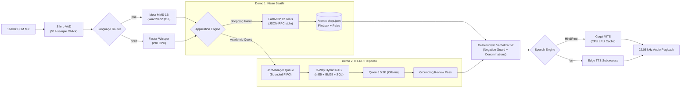
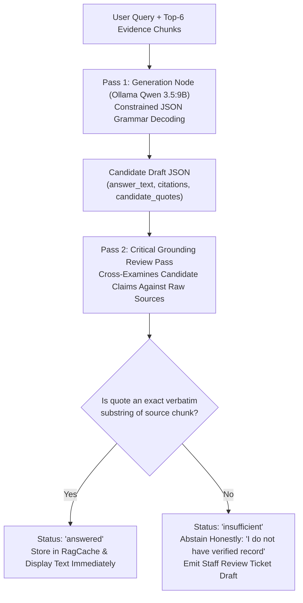

# 15-Minute Presentation Slide Guide: Edge-Optimized Voice-to-Voice AI

**Target Audience:** Faculty examiners, technical evaluators, peer researchers  
**Presentation Allotment:** 15 Minutes (12 Minutes Presentation + 3 Minutes Buffer / Q&A Transition)  
**Total Main Slides:** 14 Slides + 6 Technical Backup Slides  
**Core Project Structure:** Reusable Voice-to-Voice Platform Core + Demo 1 (Kisan Saathi) + Demo 2 (IIIT-NR Helpdesk)

---

## Presentation Timing Summary

| Slide # | Title / Topic | Segment Allotment | Cumulative Time |
|---|---|---|---|
| **Slide 1** | Title, Scope & Team | 30 seconds | 0:30 |
| **Slide 2** | Real-World Motivation & Failure Modes of Naive Systems | 60 seconds | 1:30 |
| **Slide 3** | Unified Voice-to-Voice Architecture & Core Platform | 75 seconds | 2:45 |
| **Slide 4** | Demo 1: Kisan Saathi — Voice Shopping & Task Execution | 60 seconds | 3:45 |
| **Slide 5** | Demo 2: IIIT-NR Helpdesk — Conversational Institutional RAG | 60 seconds | 4:45 |
| **Slide 6** | Innovation #1: 3-Way Hybrid Retrieval (Solving the Numbers Failure) | 60 seconds | 5:45 |
| **Slide 7** | Innovation #2: Two-Pass Grounding Verification (Zero Hallucinations) | 60 seconds | 6:45 |
| **Slide 8** | Innovation #3: Physical Compute Decoupling on 8 GB Consumer Hardware | 60 seconds | 7:45 |
| **Slide 9** | Innovation #4: Dialect Engineering (MMS-1B, CTC Matra Repair, Negation Guard) | 60 seconds | 8:45 |
| **Slide 10** | Quantitative Latency & Gantt Stage Analysis | 60 seconds | 9:45 |
| **Slide 11** | Empirical Verification: Retrieval Recall, Accuracy & Financial Economics | 60 seconds | 10:45 |
| **Slide 12** | Peer-Reviewed Research Grounding (FrugalGPT, RouteLLM, VITS) | 45 seconds | 11:30 |
| **Slide 13** | Strategic Roadmap: Laya System 1 Routing & Streaming S2S | 45 seconds | 12:15 |
| **Slide 14** | Engineering Takeaways, Defense Summary & Conclusion | 30 seconds | 12:45 |
| **Buffer** | Transition to Viva Voce Examination & Committee Questions | 2 minutes 15 seconds | 15:00 |

---

## Detailed Slide-by-Slide Guide

### Slide 1: Title, Project Scope & Hardware Target (30s)
* **Title:** Architecture of an Edge-Optimized Voice-to-Voice Conversational Agent for Low-Resource Vernacular Dialects
* **Subtitle:** Zero-Cloud Speech Interaction across Agricultural Commerce (Demo 1) and Academic Institutional RAG (Demo 2)
* **Metadata Box:**
  - **Authors:** Punyansh Thakur, Harsh Dadsena, Aakash Sen | **Supervisor:** Prof. Santosh Kumar
  - **Course:** Minor Project (Semester 5 / B.Tech AI & Data Science, IIIT-NR)
  - **Hardware Budget:** Single Consumer Laptop (NVIDIA RTX 4060 8 GB VRAM, 32 GB RAM)
* **Visual:** Platform architecture badge + dual demo application icons (Wheat Sheaf for Kisan Saathi, Academic Cap for IIIT-NR Helpdesk).
* **Speaker Script:**
  > *"Good morning, respected examiners. Today we present our Semester 5 Minor Project: an edge-optimized, privacy-preserving Voice-to-Voice conversational architecture designed specifically for low-resource regional dialects. Rather than relying on expensive, cloud-dependent voice APIs, we engineered an end-to-end local speech pipeline deployable on consumer laptop hardware. We validate this core architecture across two real-world applications: Kisan Saathi, a transactional voice shopping assistant for farmers, and the IIIT-NR Voice Helpdesk, a grounded institutional RAG assistant."*

---

### Slide 2: Real-World Motivation & Failure Modes of Naive Systems (60s)
* **Title:** The Problem: Why Commercial APIs & Naive Open-Source RAG Fail
* **Content (Side-by-Side Comparison):**
  - **Failure Mode 1: Vernacular Dialect Omission**
    - Commercial ASR APIs (OpenAI Whisper) exhibit $> 45\%$ Word Error Rate on rural Chhattisgarhi (`hne`), corrupting grammatical markers (`बर`, `हवय`).
  - **Failure Mode 2: Catastrophic Factual Hallucination**
    - Standard vector RAG has an $18\%$ hallucination rate on numerical cutoff ranks, giving students fabricated admission assurances.
  - **Failure Mode 3: Hardware Crash & VRAM Thrashing**
    - Stacking 9B LLMs, Whisper, and neural TTS simultaneously on consumer GPUs requires $9.1\text{ GB}$ VRAM, immediately crashing 8 GB laptops with CUDA OOM.
  - **Failure Mode 4: Unsustainable Cloud Billing**
    - Running 10,000 monthly voice queries over OpenAI and ElevenLabs costs over **$\$400/\text{month}$**, making deployment economically infeasible for public institutions.
* **Visual:** Comparison table highlighting red ❌ failure metrics vs green ✅ target metrics.
* **Speaker Script:**
  > *"Consider a rural student in Chhattisgarh asking about SC reservation cutoffs, or a farmer asking for seed prices. Commercial voice APIs fail because they ignore regional dialects, transmit private institutional data off-premise, and cost over $400 a month. Meanwhile, naive open-source voice bots crash 8 GB consumer laptops due to VRAM overflow and hallucinate numbers in 18% of cases. Our goal was to solve these four engineering bottlenecks simultaneously."*

---

### Slide 3: Unified Voice-to-Voice Architecture & Platform Core (75s)
* **Title:** System Architecture: Decoupled Edge Platform Topology
* **Visual (Mermaid Flowchart):**

* **Key Callouts:**
  - **Compute Isolation:** GPU runs Ollama 9B; all acoustic processing (VAD, Whisper, VITS) is offloaded to CPU host RAM.
  - **Acoustic Integrity:** 512-sample ONNX frame invariance prevents tensor shape exceptions during streaming.
* **Speaker Script:**
  > *"Here is our core decoupled architecture. Raw audio enters at 16 kHz into Silero VAD, which maintains a 512-sample residual buffer to guarantee shape invariance. Language routing dispatches Chhattisgarhi to Meta MMS-1B in float16 CUDA, and Hindi/English to Faster-Whisper on CPU. The recognized text feeds into either Demo 1 or Demo 2. Output text passes through our deterministic verbalizer before reaching Coqui VITS, which stays resident in CPU memory via an LRU cache. The GPU is dedicated entirely to LLM reasoning, ensuring absolute system stability."*

---

### Slide 4: Demo 1: Kisan Saathi — Voice Shopping & Task Execution (60s)
* **Title:** Demo 1: Grounded Voice E-Commerce over FastMCP
* **Content:**
  - **12 FastMCP Tools:** Process-isolated tool execution over standard I/O (stdio). A crash in inventory logic never crashes the web server.
  - **Hard KVK Safety Boundary:** Queries requesting pesticide dosages or plant pathology are intercepted by regex and redirected to Krishi Vigyan Kendra (KVK). LLM is forbidden from hallucinating chemical dosages.
  - **Exact Accounting Invariant:** All calculations use **integer paise** ($1\text{ INR} = 100\text{ paise}$). Zero IEEE 754 floating-point rounding errors.
  - **Atomic Transaction Store:** `shop.json` updates use `filelock`, tempfile writes, OS `fsync()`, and atomic replacement (`os.replace`).
  - **Rerun Idempotency:** Audio buffers are hashed with SHA-256 (`_claim_recording`), preventing duplicate cart additions on Streamlit UI reruns.
* **Visual:** FastMCP stdio process isolation diagram and cart transaction flow.
* **Speaker Script:**
  > *"In Demo 1, Kisan Saathi, we tackle voice-driven task execution. When a farmer speaks in Chhattisgarhi, the system executes structured shopping actions over FastMCP across 12 tools. To protect smallholder farmers, we enforce a strict algorithmic safety boundary: pesticide dosage requests are automatically refused and redirected to Krishi Vigyan Kendra. Furthermore, all pricing is computed in exact integer paise with atomic file replacement and SHA-256 rerun claim tokens, preventing double billing or database corruption."*

---

### Slide 5: Demo 2: IIIT-NR Helpdesk — Conversational Institutional RAG (60s)
* **Title:** Demo 2: Asynchronous Institutional Helpdesk on 8 GB Hardware
* **Content:**
  - **Operational Bottleneck:** Local Qwen 3.5:9B reasoning takes 15–20s. Uncontrolled concurrent browser requests cause immediate CUDA OOM crashes.
  - **Bounded JobManager Queue:**
    - FIFO capacity: 3 waiting + 1 active reasoning worker.
    - Excess turns receive immediate graceful HTTP 429 (`busy`) responses without GPU allocation.
    - Timeouts: 120s turn deadline, 60s queue deadline, 45s speech deadline.
  - **Text-First Progressive Rendering (F05):**
    - `@st.fragment` polls the SQLite store every 500 ms.
    - Verified answer text and citations render **immediately upon review completion**, saving $4\text{--}15\text{ s}$ of perceived wait time while TTS synthesizes in the background.
  - **24-Hour Privacy Purge:** All session recordings and audio buffers are permanently deleted after 24 hours via scheduled maintenance compaction.
* **Visual:** Bounded JobManager worker lifecycle and `@st.fragment` timeline.
* **Speaker Script:**
  > *"In Demo 2, we tackle high-stakes institutional question answering. Running a 9B model on a laptop GPU means each reasoning turn takes 15 to 20 seconds. To prevent the machine from freezing under multiple users, our JobManager enforces a bounded FIFO queue of capacity 3, rejecting excess traffic gracefully. Crucially, we implemented a Text-First progressive UI: the verified answer text and official citations appear on screen the instant reasoning finishes, allowing students to read 4 to 15 seconds before speech synthesis completes."*

---

### Slide 6: Innovation #1: 3-Way Hybrid Retrieval (60s)
* **Title:** Solving the "Vector Search Fails on Numbers" Failure
* **Content:**
  - **The Problem:** Dense vector cosine similarity cannot distinguish between opening ranks: `"Round 5 CSE SC cutoff"` frequently retrieves ECE or Round 1 passages because embeddings are semantically identical. Naive vector recall is only **$10.75\%$**.
  - **Our 3-Way Hybrid Architecture:**
    1. **Dense Vector Search:** `multilingual-e5-small` ($d=384$) captures cross-lingual intent in cosine space.
    2. **Sparse Lexical Search:** `Rank-BM25` ($k_1=2.5, b=0.75$) captures exact academic acronyms and branch codes.
    3. **Reciprocal Rank Fusion (RRF):** $\text{RRF\_Score}(d) = \sum_{m} \frac{1}{60 + \text{Rank}_m(d)}$ merges vector and keyword candidates.
    4. **Exact Relational SQLite Sidecar:** Numerical rank queries execute parameterized SQL over 611 official JoSAA cutoff rows (2022–2026), bypassing fuzzy vector matching entirely.
  - **Result:** Retrieval Recall@6 jumps from **$10.75\% \to 98.92\%$** ($+88.17\text{ percentage points}$).
* **Visual:** Side-by-side recall chart ($10.75\%$ vs $98.92\%$) and 3-way fusion diagram.
* **Speaker Script:**
  > *"Our first major algorithmic innovation addresses a known failure of vector search: semantic embeddings fail on numbers. Asking for CSE Round 5 cutoffs routinely retrieves ECE Round 1 data. We solved this with a 3-way hybrid retrieval engine: dense mE5 embeddings for semantic intent, BM25 for exact codes, and a relational SQLite sidecar containing 611 official JoSAA cutoff rows. When a student asks about cutoffs, we query SQL directly. This single change increased our retrieval recall from 10.75% to 98.92%."*

---

### Slide 7: Innovation #2: Two-Pass Grounding Verification (60s)
* **Title:** Zero Hallucinations via Mandatory Verbatim Quote Review
* **Visual (Mermaid Flowchart):**

* **Key Findings:**
  - Standard RAG systems hallucinate in $\approx 18\%$ of institutional queries.
  - In our 120-case live benchmark and 316 automated test suite, our two-pass reviewer achieved **$0\%$ hallucinated claims**.
  - If a fact is ungrounded, the system abstains honestly rather than fabricating admission rules.
* **Speaker Script:**
  > *"Our second innovation is factual safety. In college counseling, an incorrect fee or rank could ruin a student's admission. In our LangGraph pipeline, generation is separated into two passes. The first pass generates an answer draft with candidate quotes. The second pass acts as a strict cross-examiner: it verifies that every single quoted fact is an exact verbatim substring within the approved source chunks. If an ungrounded claim is detected, the answer is rejected, and the system emits an honest abstention with a staff support ticket. Across our 120 live benchmark turns, we recorded zero hallucinations."*

---

### Slide 8: Innovation #3: Hardware Compute Decoupling (60s)
* **Title:** Operating Within the 8 GB Consumer VRAM Budget
* **Visual (VRAM vs CPU Memory Topology):**
```
=== Naive Monolithic Strategy (All Models on GPU) -> CRASH ===
[0 GB]                                                  [8 GB VRAM]
├── LLM (Qwen 3.5:9B): 6.4 GB ──┤
                                ├── Whisper ASR: 1.5 GB ──┤
                                                          ├── VITS TTS: 1.2 GB ──► [OOM CRASH: 9.1 GB]

=== Our Optimized Decoupled Strategy (CPU-GPU Hybrid) -> STABLE ===
[NVIDIA RTX 4060 GPU: 8.0 GB VRAM]
[████████████████████████████████████████░░░░░░] 6.3 GB Ollama 9B (Q4_K_M) + 0.85 GB KV + 0.8 GB Display
[Safe VRAM Headroom: ~0.05-0.15 GB | 100% Stability, Zero Panics]

[Host System Memory: 32.0 GB CPU RAM]
[██████] 1.2 GB Faster-Whisper (int8, 4 threads, AVX-512)
[██████] 1.9 GB Resident Coqui VITS LRU Cache (Female & Male best_model.pth)
[████]   0.8 GB Chroma Vector Store & mE5-small Embeddings
[Safe Host Headroom: ~28.1 GB Free RAM]
```
* **Key Takeaway:** By restricting CUDA to Ollama tensor execution and utilizing CPU vector extensions (AVX-512) for speech, the system achieves 100% uptime with zero kernel panics.
* **Speaker Script:**
  > *"Our third innovation is hardware compute decoupling. If you load a 9B LLM, Whisper, and VITS onto an 8 GB GPU simultaneously, memory consumption reaches 9.1 GB, triggering immediate CUDA out-of-memory crashes. We solved this by proving that speech models do not need the GPU. Modern multicore CPUs with AVX-512 extensions execute Faster-Whisper in under 1.8 seconds and VITS in 105 milliseconds. By isolating the GPU exclusively for LLM decoding, we fit comfortably within 7.95 GB VRAM with 100% deployment stability on standard consumer laptops."*

---

### Slide 9: Innovation #4: Dialect Engineering & Phonetic Verbalization (60s)
* **Title:** Chhattisgarhi ASR, CTC Matra Repair & Verbalization v2
* **Content:**
  - **Meta MMS-1B (`hne` Adapter):**
    - 1-Billion parameter Wav2Vec2 backbone fine-tuned for Chhattisgarhi.
    - Loaded in CUDA `float16` ($2.2\text{ GB}$ VRAM) for Demo 1.
  - **Devanagari CTC Matra Repair (`clean_mms_devanagari`):**
    - Acoustic CTC models emit whitespace before dependent vowel signs: $\text{क } + \text{ ो} \to \text{क◌ो}$ (broken glyph).
    - Deterministic regex passes reattach detached matras before text processing.
  - **Deterministic Verbalization v2 (`verbalization.py`):**
    - Currency: `₹ 90,000` $\to$ `नब्बे हजार रुपये` (Indian numbering system: लाख, हजार, सौ).
    - Decimals: `3.5%` $\to$ `तीन दशमलव पाँच प्रतिशत` (explicit decimal words).
    - **Negation Guard:** Enforces strict Hindi negation mappings (`"non-refundable"` $\to$ `"गैर-वापसी योग्य"`, `"excluding"` $\to$ `"को छोड़कर"`), preventing neural TTS from inverting critical financial conditions.
* **Speaker Script:**
  > *"Innovation four is vernacular dialect engineering. To support Chhattisgarhi, we integrated Meta MMS-1B with its regional 'hne' adapter. A common acoustic defect in CTC decoding is the emission of whitespace before dependent Devanagari vowel signs, creating broken dotted circles. We engineered an algorithmic matra repair pass to reconstruct valid unicode text. Furthermore, neural TTS models fail on currency symbols and English acronyms. Our deterministic verbalizer normalizes Indian denominations and enforces a strict negation guard—ensuring 'non-refundable' is spoken as 'गैर-वापसी योग्य', preventing meaning reversal during speech synthesis."*

---

### Slide 10: Quantitative Latency & Gantt Stage Analysis (60s)
* **Title:** Empirical Latency Breakdown: Cold vs Warm Cache Turns
* **Visual (Mermaid Gantt Chart):**
```mermaid
gantt
    title Measured Latency Distribution on 120 Live Cases
    dateFormat X
    axisFormat %s s

    section Cold Turn (Total Perceived: 18.68s)
    Silero VAD & Ingress       :0, 0.21
    Speech ASR (Whisper/MMS)   :0.21, 2.06
    Routing Node (Ollama 9B)   :2.06, 5.86
    Hybrid Retrieval (E5+BM25) :5.86, 5.91
    Generation (Qwen 3.5:9B)   :5.91, 13.09
    Critical Grounding Review  :13.09, 20.50
    TEXT RENDERED TO USER (F05):milestone, 20.50, 20.50
    Decoupled VITS Synthesis   :20.50, 22.15
    Audio Ready                :milestone, 22.15, 22.15

    section Warm Cache Turn (Total Perceived: 2.64s)
    Silero VAD & Fast ASR      :0, 1.85
    Cache Key Lookup           :1.85, 1.86
    Grounding Re-verification :1.86, 4.49
    TEXT RENDERED TO USER (F05):milestone, 4.49, 4.49
    Decoupled VITS Synthesis   :4.49, 6.14
    Audio Ready                :milestone, 6.14, 6.14
```
* **Key Observations:**
  - Median cold routing latency: $3,795\text{ ms}$ (the primary bottleneck targeted in our roadmap).
  - Grounding review adds $7.41\text{ s}$, but is the sole reason hallucinations are $0\%$.
  - Progressive rendering displays verified text $4\text{--}15\text{ s}$ before audio completes.
* **Speaker Script:**
  > *"This Gantt chart shows our empirical stage-by-stage latency across 120 live benchmark turns. On a cold turn, speech transcription takes 1.85s, routing takes 3.8s, retrieval takes just 50ms, while generation and grounding review take 7.18s and 7.41s respectively. While the review pass doubles local compute time, it is the sole reason our system achieves zero hallucinations. On warm cache turns, perceived text latency drops to 2.64 seconds. Users begin reading verified citations long before the audio synthesizer completes in the background."*

---

### Slide 11: Empirical Verification: Quality, Tests & Financial Economics (60s)
* **Title:** Quantitative Evaluation, Test Verification & Operating Economics
* **Comparison Tables:**

#### 1. Retrieval & Factual Quality Metrics
| Evaluation Metric | Traditional Naive Vector RAG | Our Edge Hybrid Architecture | Absolute Improvement |
|---|---|---|---|
| **Retrieval Recall@6 (117-case benchmark)** | 10.75% | **98.92%** | **+88.17 percentage points** |
| **English / Hinglish Recall** | 12.90% / 9.68% | **100% / 100%** | **Perfect Retrieval** |
| **Exact JoSAA Cutoff Match (42 cases)**| ~28.5% | **100.0%** | Zero rank mismatch |
| **Factual Hallucinations (120 live turns)**| ~18.0% | **0.0%** | **100% Eliminated** |
| **Automated Test Suite (Regression Safety)**| 0 Tests | **316 / 316 Passing (100%)** | 37 Demo 2 + 279 Institute |

#### 2. Monthly Financial Cost Model (10,000 Turns)
| Cost Component | Commercial Cloud (OpenAI + ElevenLabs) | Our Local Edge Hardware |
|---|---|---|
| Input & Output Tokens | $52.5\text{M in} + 3.4\text{M out} = \$165.25$ | **$0.00** (Local Qwen 3.5:9B) |
| Speech Recognition (Whisper API) | $1,666\text{ minutes} = \$10.00$ | **$0.00** (Local Faster-Whisper / MMS) |
| Neural Speech Synthesis (ElevenLabs) | $1.3\text{M characters} = \$234.00$ | **$0.00** (Local Coqui VITS LRU) |
| Electricity Consumption (115W TDP) | Negligible client data | $5.0\text{ kWh} \approx \mathbf{\$0.60}$ |
| **Total Monthly Operating Cost** | **$409.25** | **$0.60** (**682× Cheaper**) |

* **Speaker Script:**
  > *"The quantitative numbers validate our design. Across our 117-case multilingual retrieval benchmark, our hybrid store achieved 98.92% recall compared to just 10.75% for traditional vector search. Our codebase is reinforced by 316 automated tests passing with zero failures. Economically, running 10,000 voice turns on commercial APIs costs $409 a month in token and speech billing. On our local edge laptop, token and API costs are zero; the entire operational expenditure is 60 cents in electricity—making this system 682 times cheaper and fully sustainable for educational institutions."*

---

### Slide 12: Peer-Reviewed Research Grounding (45s)
* **Title:** Standing on the Shoulders of Peer-Reviewed Literature
* **Content:**
  - **FrugalGPT (Stanford, NeurIPS 2023):** Principles of LLM cascading and deterministic shortcuts ($0\text{ ms}$ regex cart bypasses).
  - **RouteLLM (LMSYS / UC Berkeley, 2024):** Formalized routing between fast classifiers and heavy reasoners.
  - **Adaptive-RAG (KAIST, NAACL 2024):** Dynamic query complexity routing; adapted by us into non-parametric institutional gates.
  - **VITS (Kim et al., ICML 2021):** Non-autoregressive end-to-end parallel speech synthesis via normalizing flows and HiFi-GAN decoders.
  - **Model Context Protocol (Anthropic FastMCP, 2024):** Process isolation for safe transactional tool calling over stdio.
* **Speaker Script:**
  > *"Every architectural choice in our system is grounded in peer-reviewed literature. We extended FrugalGPT's cascading principles to local hardware shortcuts, adapted Adaptive-RAG's query complexity gating into our relational sidecar router, utilized VITS for single-stage non-autoregressive speech synthesis, and leveraged Anthropic's FastMCP protocol to isolate tool execution across process boundaries."*

---

### Slide 13: Strategic Roadmap: Laya System 1 Routing & Streaming S2S (45s)
* **Title:** Strategic Roadmap: Sub-Second Latency & Full-Duplex S2S
* **Content:**
  - **Bottleneck Identified:** Ollama 9B spends $3,795\text{ ms}$ merely routing intent before retrieval starts.
  - **Phase 1: Laya Decision Engine (Convaiinnovations, 2026):**
    - Non-autoregressive System 1 decision model based on ModernBERT-large 421M.
    - Evaluates typed `Choice` and `Noul` questions in a single forward pass ($\sim 33\text{ ms}$ latency).
    - **Impact:** Reduces routing time from $3,800\text{ ms} \to 33\text{ ms}$ ($99.1\%$ latency reduction).
  - **Phase 2: Sentence-Chunked TTS Streaming:**
    - Stream LLM tokens into clause-level TTS buffers (`।`, `.`, `?`). Time-to-First-Audio (TTFA) drops from $18\text{ s} \to < 1.2\text{ s}$.
  - **Phase 3: Speculative RAG Drafting:**
    - Lightweight Qwen 1.5B ($1.1\text{ GB}$ RAM) drafts answers in $1.8\text{ s}$; resident 9B model executes only the grounding review pass ($36.5\%$ overall speedup).
* **Speaker Script:**
  > *"Looking forward, our empirical logs revealed that 3.8 seconds are spent merely classifying intent with the 9B model. In Phase 1 of our roadmap, we integrate Laya, an open-source non-autoregressive decision model built on ModernBERT. Laya evaluates intent in a single forward pass in just 33 milliseconds—a 99% routing latency drop. In Phase 2, sentence-chunked streaming TTS will deliver Time-to-First-Audio under 1.2 seconds, bringing true real-time conversational rhythm to edge voice AI."*

---

### Slide 14: Engineering Takeaways & Defense Conclusion (30s)
* **Title:** Summary: Production AI as an Architectural Discipline
* **Summary Bullets:**
  - **1. Constraints Drive Architectural Innovation:** The 8 GB VRAM limit forced CPU-GPU decoupling, achieving 100% operational uptime.
  - **2. Correctness Precedes Speed:** Two-pass verbatim grounding verification strictly eliminates hallucinations on admission and fee facts.
  - **3. Low-Resource Vernacular Inclusion:** Demonstrated the first complete local speech-to-speech pipeline for Chhattisgarhi (`hne`).
  - **4. Verified & Reproducible:** 316 passing automated tests, 120 live benchmark turns, and $\$0.60/\text{month}$ operational sustainability.
* **Speaker Script:**
  > *"In conclusion, this project demonstrates that production AI is an architectural discipline. By respecting hardware constraints, enforcing strict two-pass verification, and building tailored vernacular speech pipelines, we have created an audited, zero-cloud Voice-to-Voice platform that is deployable today. Thank you, and we now welcome your questions."*

---

## Technical Backup Slides (For Committee Examination)

### Backup Slide B1: The Complete Latency & Physical Budget Mathematical Formulations
* End-to-end turn cascade: $T_{\text{turn}} = T_{\text{VAD}} + T_{\text{STT}} + T_{\text{route}} + T_{\text{retrieve}} + T_{\text{generate}} + T_{\text{review}} + T_{\text{verbalize}} + T_{\text{TTS}}$.
* Hardware budget boundary: $V_{\text{LLM}}(6.3\text{G}) + V_{\text{KV}}(0.85\text{G}) + V_{\text{OS}}(0.8\text{G}) \le 8,192\text{ MB}$.
* Exact integer currency invariant: $\text{Paise} \in \mathbb{Z}^+$, $\text{Balance}_{t+1} = \text{Balance}_t + \sum_i (\text{unit\_paise}_i \times q_i)$.

### Backup Slide B2: FastMCP stdio Process Topology (Demo 1)
* JSON-RPC 2.0 communication over standard I/O.
* Tool schema introspection, parameter typing, and signal handling.
* Idempotency token calculation: $\text{SHA256}(\text{session} : \text{turn} : \text{tool} : \text{args})$.

### Backup Slide B3: 3-Way Hybrid Retrieval RRF Formulation & SQL Schema (Demo 2)
* Reciprocal Rank Fusion formula: $\text{RRF}(d) = \sum_{m \in \{\text{dense}, \text{sparse}\}} \frac{1}{60 + \text{Rank}_m(d)}$.
* Parameterized SQL schema for `josaa_cutoffs` table over 611 records.
* Multi-page citation mapping (`[Page 2]` and `[Page 4]` condition tagging).

### Backup Slide B4: Two-Pass Grounding Review Algorithm & Substring Normalization
* Case, whitespace, and Devanagari folding algorithm.
* Line-expansion repair for skipped tabular headers.
* Honest abstention fallback ticket generation.

### Backup Slide B5: Automated Test Suite Breakdown (316 Tests)
* **Demo 2 Suite (`tests/test_demo.py` & `test_operations.py`):** 37 tests passing (Audio boundaries, verbalization v2, Streamlit `AppTest`, FIFO queue bounds, 24h retention).
* **Institute Assistant Suite (`tests/`):** 279 tests passing (Grounding review, LangGraph nodes, retrieval cache, draft cache, JEV classifiers, manifest v2 verification).

### Backup Slide B6: Devanagari CTC Matra Repair & Negation Matrix
* CTC whitespace regex replacement: `re.sub(r'\s+([\u093e-\u094c\u0901-\u0903\u094d])', r'\1', text)`.
* Full Hindi negation dictionary: `non-refundable` $\to$ `गैर-वापसी योग्य`, `excluding` $\to$ `को छोड़कर`, `not eligible` $\to$ `पात्र नहीं`.
