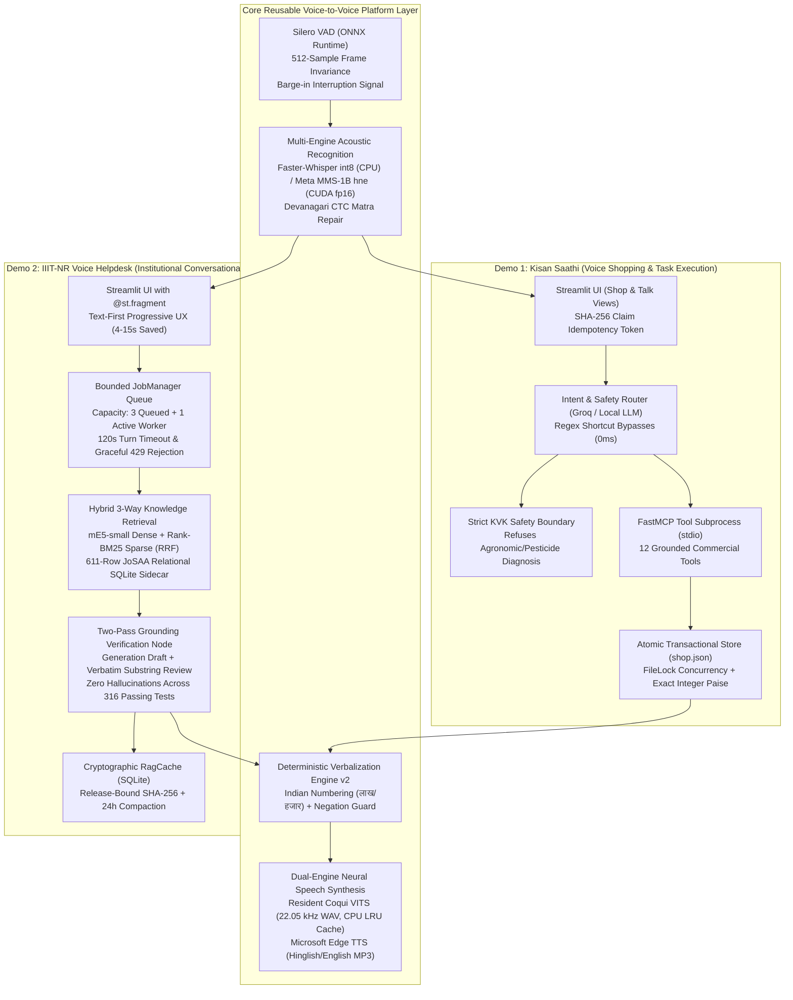

# Presentation Dossier: Ultra-Optimized Edge-Native Voice-to-Voice Conversational Agent Architecture

**Academic Program:** B.Tech in Artificial Intelligence & Data Science (Semester 5 / 3rd Year)  
**Course:** Minor Project (Course Code: AI-301 / 4 Credits)  
**Project Title:** Architecture of an Edge-Optimized, Low-Latency Voice-to-Voice Conversational Agent for Low-Resource Vernacular Dialects  
**Student Team:** Punyansh Thakur, Harsh Dadsena, Aakash Sen  
**Supervisor:** Prof. Santosh Kumar  
**Target Hardware:** 8 GB VRAM Consumer Laptop GPU (NVIDIA RTX 4060 Laptop, 32 GB Host RAM) / Edge Device  
**Repository Path:** `idea/presentation/minor/`

---

## Executive Summary: The Unified Project Vision

Academic voice assistants typically rely on high-bandwidth cloud APIs (OpenAI Whisper, GPT-4o, ElevenLabs), which incur severe recurring costs ($15–$35 per 1,000 queries), transmit private data off-premise, and fail catastrophically on low-resource regional dialects like **Chhattisgarhi (ISO `hne`)**. Conversely, naive open-source implementations stacked on local consumer machines suffer from GPU Out-Of-Memory (OOM) crashes, high turn latency (30–50 seconds), and factual hallucinations on numerical and policy queries.

This minor project solves these challenges by architecting a **reusable, edge-optimized, zero-cloud Voice-to-Voice (V2V) conversational framework**. We validate and evaluate this architecture across **two complementary, production-grade applications**:



### The Two Application Pillars

1. **Demo 1: Kisan Saathi (`code/demo/`) — Voice-to-Voice Task Execution & Commercial Action**
   - **Target User:** Smallholder farmers in Chhattisgarh speaking regional Chhattisgarhi (`hne`).
   - **Operational Scope:** Spoken product search, catalogue navigation, bag quantity computation based on acreage, cart management, and simulated order checkout.
   - **Key Optimization Innovations:**
     - **Process-Isolated Tool Execution:** 12 FastMCP tools running in a dedicated subprocess over stdio, protecting the main UI from tool-level memory faults.
     - **Safety Boundary Enforcement:** Hard regex interceptor (`SAFETY_PATTERN`) halts LLM execution and returns a pre-approved Krishi Vigyan Kendra (KVK) referral template whenever crop pathology or pesticide dosage is requested.
     - **Zero Rounding Drift & ACID Consistency:** All financial amounts are maintained strictly in integer paise ($1\text{ INR} = 100\text{ paise}$) with atomic `tempfile` flush, `fsync()`, and OS-level file replacement under `filelock`.
     - **Rerun Idempotency:** SHA-256 audio hashing prevents duplicate cart mutations during Streamlit UI reruns.

2. **Demo 2: IIIT-NR Voice Helpdesk (`code/demo2/`) — Voice-to-Voice Institutional RAG & Factual Answering**
   - **Target User:** Prospective students, parents, and rural applicants inquiring about engineering admissions.
   - **Operational Scope:** Official JoSAA/CSAB opening/closing cutoff ranks, seat matrices, scholarship guidelines (PM Vidyalaxmi), hostel policies, and fee schedules.
   - **Key Optimization Innovations:**
     - **Physical Hardware Compute Decoupling:** The 8 GB GPU is dedicated exclusively to Qwen 3.5:9B (Q4_K_M, $6.3\text{ GB}$ VRAM); all speech processing (Silero VAD, Whisper int8, VITS) is offloaded to the multicore CPU.
     - **Text-First Progressive UX:** Reviewed answer text and citations render via `@st.fragment` within $2.64\text{ s}$ on warm cache hits ($18.68\text{ s}$ on cold turns), allowing users to read the answer $4\text{--}15\text{ s}$ before neural audio synthesis completes.
     - **3-Way Hybrid Retrieval (98.92% Recall@6):** Dense vector search (`multilingual-e5-small`) and sparse lexical search (`Rank-BM25`) merged via Reciprocal Rank Fusion ($k=60$), combined with a parameterized SQL sidecar over 611 official JoSAA cutoff rows ($100\%$ accuracy on numerical rank queries).
     - **Mandatory Two-Pass Grounding Verification:** First-pass LLM generates candidate JSON draft; second-pass LLM executes critical cross-examination verifying that every quoted fact exists verbatim in the source chunks. If ungrounded, the system abstains with an honest fallback and drafts a staff review ticket.
     - **Deterministic Verbalization v2:** Normalizes currency (`₹ 90,000` $\to$ `नब्बे हजार रुपये`), decimals (`3.5%` $\to$ `तीन दशमलव पाँच प्रतिशत`), and enforces a Hindi negation guard (`"non-refundable"` $\to$ `"गैर-वापसी योग्य"`) to prevent acoustic meaning inversion.

---

## Dossier Structure & Presentation Mapping

This documentation suite contains four comprehensive research-depth technical dossiers, a 15-minute presentation guide, a printable presenter cheat sheet, and visual asset specifications:

```
idea/presentation/minor/
├── 00_PRESENTATION_OVERVIEW_AND_INDEX.md           <-- Master index, thesis, and viva defense strategy
├── 00_PRESENTATION_15MIN_SLIDE_GUIDE.md            <-- Slide-by-slide 15-minute presentation guide
├── 01_PROBLEM_DEFINITION_AND_LITERATURE_REVIEW.md    <-- Real-world motivation, math formulations, peer review
├── 02_SYSTEM_ARCHITECTURE_AND_IMPLEMENTATION.md      <-- Deep dive into STT, Demo 1, Demo 2, algorithms & code
├── 03_QUANTITATIVE_COMPARISON_TRADITIONAL_VS_OUR_RAG.md <-- Verified 120-case benchmarks, economics, VRAM profiles
├── 04_STRATEGIC_ROADMAP_AND_EFFICIENCY_ENHANCEMENTS.md <-- Laya System 1 router, streaming S2S, speculative RAG
├── PRESENTER_CHEAT_SHEET.md                        <-- One-page printable viva cheat sheet & quick stats
├── CRITICAL_REVIEW_AND_IMPROVEMENTS.md             <-- Critical audit of earlier drafts & applied fixes
├── README_IMPROVEMENTS.md                          <-- Summary of changes, structure, and quality checklist
└── VISUAL_ASSETS_GUIDE.md                          <-- Diagram catalog and slide visual assets
```

### Document-to-Slide Mapping

| Document | Primary Audience | Core Presentation Slide Alignment | Key Topics Covered |
|---|---|---|---|
| **[Document 1: Problem Definition & Literature Review](01_PROBLEM_DEFINITION_AND_LITERATURE_REVIEW.md)** | Evaluators / Reviewers | **Slides 1–4**: Motivation, Failure Modes, Math Formulations, Related Work | • High-stakes admission & rural agricultural scenarios<br/>• Latency cascade & physical 8 GB VRAM budget invariants<br/>• Selective risk-coverage classification formulation<br/>• Critical review of FrugalGPT, RouteLLM, Adaptive-RAG, MMS, VITS |
| **[Document 2: Architecture & Implementation](02_SYSTEM_ARCHITECTURE_AND_IMPLEMENTATION.md)** | Technical Examiners / Viva | **Slides 5–8**: Platform Architecture, Demo 1 MCP, Demo 2 Bounded RAG | • Silero VAD 512-sample ONNX frame invariance<br/>• MMS CTC Devanagari matra repair & Whisper int8 CPU engine<br/>• Demo 1 FastMCP 12 tools, integer paise, and atomic JSON<br/>• Demo 2 Bounded JobManager queue & Text-First progressive UX<br/>• 3-Way Hybrid Retrieval (mE5 + BM25 + JoSAA SQL) & Two-Pass Grounding<br/>• Verbalization v2 with Hindi negation guards |
| **[Document 3: Quantitative Comparison & Evaluation](03_QUANTITATIVE_COMPARISON_TRADITIONAL_VS_OUR_RAG.md)** | Evaluators / Viva | **Slides 9–11**: Latency Gantt, Retrieval Recall, Economics, Hardware Profile | • 120-case live empirical latency distribution ($18.68\text{ s}$ cold vs $2.64\text{ s}$ warm)<br/>• 117-case retrieval recall ($98.92\%$ hybrid vs $10.75\%$ naive vector)<br/>• 316 automated test suite verification (37 Demo 2 + 279 Institute)<br/>• Financial economics ($682\times$ cheaper: $\$0.60$ electricity vs $\$409.25$ cloud APIs)<br/>• VRAM allocation proof ($7.95\text{ GB}$ safe on 8 GB GPU vs $9.1\text{ GB}$ OOM crash) |
| **[Document 4: Strategic Roadmap & Future Work](04_STRATEGIC_ROADMAP_AND_EFFICIENCY_ENHANCEMENTS.md)** | Faculty / Industry Experts | **Slide 12**: System 1 Routing, Streaming S2S, Speculative RAG | • Laya ModernBERT 421M non-autoregressive routing ($33\text{ ms}$ vs $3,795\text{ ms}$)<br/>• Clause-wise chunked TTS streaming (TTFA $< 1.2\text{ s}$)<br/>• Speculative pre-retrieval on partial transcripts<br/>• Speculative RAG drafting ($1.5\text{B} + 9\text{B}$, $36.5\%$ speedup)<br/>• Cross-Lingual Information Retrieval (CLIR) for native Chhattisgarhi |

---

## Master Viva Voce Defense Strategy

During oral defense, faculty examiners focus on four key areas: novelty, engineering depth, empirical accuracy, and limitations. Use the following structured responses and evidence locations.

### 1. The Opening Pitch (30 Seconds)
> *"Good morning, respected examiners. We have built an edge-optimized, privacy-preserving Voice-to-Voice Conversational Agent architecture tailored for low-resource vernacular speech—specifically Chhattisgarhi and Hindi. Rather than piping user audio to expensive cloud APIs that fail on rural dialects and cost over $400 a month, our system operates completely on a consumer 8 GB laptop GPU at under $1 a month. We validate this across two operational deployments: Kisan Saathi, a voice shopping agent using FastMCP and atomic integer transactions, and the IIIT-NR Voice Helpdesk, an asynchronous RAG assistant. Across 316 automated tests and 120 live benchmark turns, our system achieves 98.9% retrieval recall and zero hallucinations through a mandatory two-pass grounding verification pipeline."*

### 2. Core Viva Defense Matrix

| Anticipated Examiner Question | Strategic Response & Architectural Argument | Concrete Code & Document Evidence |
|---|---|---|
| **"What is novel here? Isn't this just putting Whisper, LangChain, and VITS together?"** | **Reframe from component assembly to constrained system engineering:**<br/>1) Stacking these models naively crashes an 8 GB GPU ($9.1\text{ GB}$ required). We engineered strict CPU-GPU physical compute decoupling to achieve 100% uptime.<br/>2) Standard vector RAG fails on cutoff numbers ($10.75\%$ recall). We built a 3-way hybrid retrieval engine combining mE5, BM25, and an exact relational SQLite sidecar, achieving $98.92\%$ recall.<br/>3) We built a two-pass grounding reviewer requiring exact verbatim quote extraction, eliminating hallucinations in high-stakes admissions.<br/>4) We engineered the first complete local speech pipeline for Chhattisgarhi (`hne`), solving CTC matra detachment and phonetic currency verbalization. | • **Doc 2, Section 1 & 3**<br/>• **Doc 3, Section 1 & 4**<br/>• `code/demo2/jobs.py`<br/>• `code/demo/mcp_server.py`<br/>• `code/STT/stt-service/src/asr.py` |
| **"Why does your project have two demos? Are they separate projects?"** | **Unify under the core Voice-to-Voice architecture:**<br/>The minor project is the **optimized, reusable Voice-to-Voice platform core** (Silero VAD, MMS/Whisper STT, regex verbalizer, Coqui VITS). The two demos represent the two fundamental paradigms of conversational AI:<br/>• **Demo 1 (Kisan Saathi)** evaluates **Task Execution & Structured Tool Calling** over FastMCP in agricultural e-commerce.<br/>• **Demo 2 (IIIT-NR Helpdesk)** evaluates **Information Retrieval & Factual Reasoning** over Hybrid RAG in institutional counseling.<br/>Both prove that edge-native speech and language models can perform reliable work under consumer hardware constraints. | • **Doc 2, Section 2 & 4**<br/>• `idea/presentation/working/00-INDEX.md`<br/>• `code/demo/shop.py`<br/>• `code/demo2/app.py` |
| **"Your cold-turn latency in Demo 2 is 18 seconds. How can you claim this is low-latency?"** | **Distinguish Perceived Latency from Total Pipeline Turnaround:**<br/>1) In high-stakes institutional counseling, factual correctness precedes conversational speed. Hallucinating a cutoff rank misguides a student's career.<br/>2) Our **Text-First Progressive UX (F05)** uses Streamlit `@st.fragment` polling to display verified answer text and citations immediately upon LLM review completion, reducing perceived wait time by $4\text{--}15\text{ s}$ while audio synthesizes in the background.<br/>3) On warm cache hits, perceived response time drops to **$2.64\text{ s}$**.<br/>4) In Demo 1, deterministic regex shortcuts answer cart queries in **$< 50\text{ ms}$**.<br/>5) In Document 4, we chart a verified path to sub-second routing via the Laya ModernBERT System 1 decision model ($33\text{ ms}$). | • **Doc 3, Section 2 (Gantt Chart)**<br/>• **Doc 2, Section 3.6**<br/>• `code/demo2/jobs.py:complete`<br/>• `code/demo2/storage.py` |
| **"How do you mathematically prevent hallucinations in cutoff ranks?"** | **Two complementary safeguards:**<br/>1) **Relational Isolation:** Queries asking for opening/closing ranks bypass semantic vector search and query a structured SQLite table containing 611 official JoSAA cutoff rows via parameterized SQL ($100\%$ precision).<br/>2) **Two-Pass Grounding Verification:** The LangGraph engine runs a generation pass followed by an independent `critical_review_node`. The reviewer cross-examines candidate claims against retrieved evidence, verifying verbatim substring containment: $\text{norm}(\text{quote}) \subseteq \text{norm}(\text{chunk})$. If ungrounded, the engine strictly abstains (`"insufficient"`), logging an administrative review ticket. | • **Doc 2, Section 3.4 & 3.5**<br/>• **Doc 3, Section 4 (Zero Hallucinations)**<br/>• `code/Institute-voice-agent/institute-assistant/assistant/nodes.py`<br/>• `assistant/kb/structured.py` |
| **"Why did you use an atomic JSON file in Demo 1 instead of PostgreSQL?"** | **Explain the architectural tradeoff:**<br/>1) **Portability & Zero Daemon Overhead:** An atomic JSON store allows Demo 1 to run on any laptop without managing background PostgreSQL server processes or database migrations.<br/>2) **ACID Transaction Guarantees at Demo Scale:** We implemented file locking (`filelock`), exact integer paise accounting ($100\text{ paise} = \text{₹}1.00$), and atomic OS replacement via temporary files and physical `fsync()`. In the event of an abrupt process crash, the database is never left in a corrupted or half-written state.<br/>3) **Live Viva Observability:** Evaluators can inspect `shop.json` directly in any text editor during the live demonstration to verify cart state mutations. | • **Doc 2, Section 4.5**<br/>• `code/demo/shop.py`<br/>• `code/demo/mcp_server.py` |
| **"What are the verified hardware allocations and memory limits?"** | **Detail the physical CPU-GPU partitioning:**<br/>On our 8,192 MB (8 GB) RTX 4060 laptop GPU:<br/>• **GPU VRAM:** Ollama Qwen 3.5:9B (Q4_K_M) takes $6.3\text{ GB} + 0.85\text{ GB}$ KV cache context $+ 0.8\text{ GB}$ OS/Display $= 7.95\text{ GB}$ ($97.1\%$ utilization, safe margin).<br/>• **CPU Host RAM (32 GB total):** Whisper int8 ($1.2\text{ GB}$), Coqui VITS Male/Female LRU cache ($1.9\text{ GB}$), and mE5 embeddings ($0.8\text{ GB}$) run entirely on CPU using AVX-512 vectorization.<br/>Naive GPU stacking requires $9.1\text{ GB}$ and immediately crashes with CUDA OOM. | • **Doc 3, Section 5 (VRAM Profile)**<br/>• **Doc 2, Section 3.7**<br/>• `code/demo2/speech.py`<br/>• `code/demo2/health.py` |

### 3. The Closing Statement (20 Seconds)
> *"To conclude, our project demonstrates that building production conversational AI is an architectural discipline. By respecting edge hardware constraints, enforcing strict two-pass verification, isolating tools across process boundaries, and adapting acoustic models for under-represented languages like Chhattisgarhi, we have delivered a robust, zero-cloud platform that is technically defensible, socially impactful, and ready for campus deployment."*
