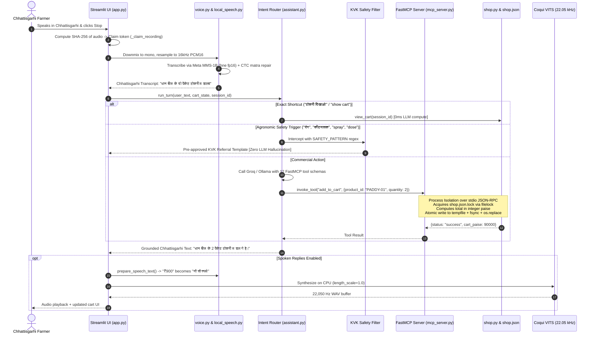
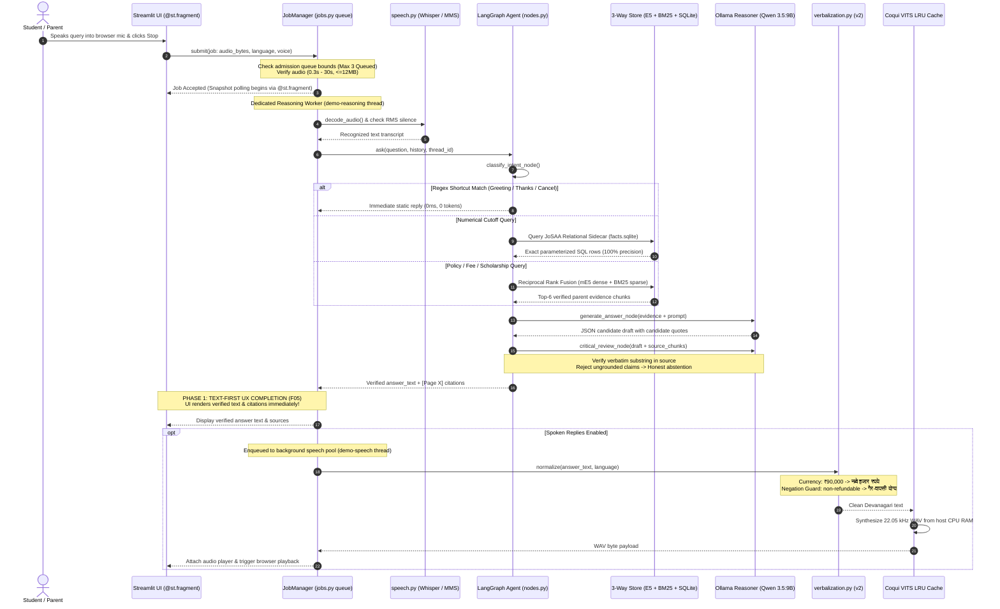
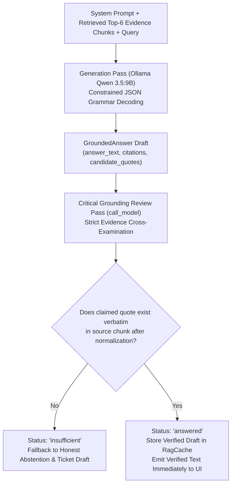

# Document 2: System Architecture, Component Implementation & Internal Methodologies

**Project Title:** Architecture of an Edge-Optimized, Low-Latency Voice-to-Voice Conversational Agent for Low-Resource Vernacular Dialects  
**Implementation Codebase:** `code/demo/`, `code/demo2/`, `code/Institute-voice-agent/`, `code/STT/stt-service/`, `code/TTS/chattisgarhi-tts-models/`  
**Authors:** Punyansh Thakur, Harsh Dadsena, Aakash Sen | **Supervisor:** Prof. Santosh Kumar  
**Evaluation Scope:** 316 Passing Tests · 120 Live Baseline Benchmark Turns · 611 JoSAA Cutoff Rows · Dual VITS Checkpoints

---

## Executive Summary: Architectural Foundations

This document provides a comprehensive technical walkthrough of our complete Voice-to-Voice conversational agent platform, tracing audio data from acoustic capture to neural speech synthesis. 

Unlike monolithic cloud voice bots, our architecture is engineered specifically for **resource-constrained edge execution (8 GB GPU / 32 GB RAM)**. It is grounded on four foundational architectural principles:

1. **Physical Compute Decoupling:** CUDA VRAM is dedicated exclusively to local LLM autoregressive inference ($6.3\text{ GB}$ VRAM); all acoustic speech processing (Silero VAD, Whisper int8, Meta MMS-1B, and Coqui VITS) is offloaded to host CPU cores using AVX-512 vectorization.
2. **Process-Isolated Task Execution (Demo 1):** In agricultural shopping, 12 FastMCP commercial tools run in a separate OS subprocess over standard I/O (stdio). An unhandled error or memory leak in inventory logic cannot crash the web server.
3. **Hybrid Relational Retrieval & Two-Pass Grounding Safety (Demo 2):** To eliminate hallucinations on numerical admission cutoffs, retrieval combines dense vectors, sparse BM25, and an exact relational SQLite sidecar, followed by a mandatory second-pass LLM cross-examination enforcing verbatim source quotations.
4. **Text-First Progressive UX:** Streamlit `@st.fragment` polling renders verified text and citations immediately upon LLM review completion, saving $4\text{--}15\text{ s}$ of perceived wait time while speech synthesizes in the background.

```mermaid
flowchart TB
    subgraph ClientLayer ["1. Client Interaction Layer (Browser WebApp / Terminal)"]
        UI1["Demo 1: Kisan Saathi Streamlit UI (app.py)\nTalk View & Shop View | SHA-256 Claim Token"]
        UI2["Demo 2: Helpdesk Streamlit UI (app.py)\nProgressive @st.fragment Polling (0.5s)"]
        Term["Terminal Voice Orchestrator\n(PyAudio 16 kHz Streaming Client)"]
    end

    subgraph AdmissionLayer ["2. Admission, Concurrency & State Management"]
        JM["JobManager Queue (jobs.py)\nBounded FIFO (Capacity: 3 Queued + 1 Active)\nTurn Timeout: 120s | Overload: HTTP 429 'busy'"]
        Dedup["SHA-256 Audio Hash Deduplication\nRMS Silence Energy Gate"]
        ShopStore[("Atomic shop.json (Demo 1)\nFileLock Concurrency\nExact Integer Paise")]
        HelpStore[("SQLite Store (Demo 2)\nCheckpoints & 24h Privacy Purge")]
    end

    subgraph SpeechInputLayer ["3. Acoustic Recognition (ASR / STT) [CPU & CUDA fp16]"]
        VAD["Silero VAD (ONNX Runtime)\n512-Sample Frame Invariance (32ms)\nResidual FIFO Buffer"]
        Router{"Language Router"}
        Whisper["Faster-Whisper (small / int8)\nCTranslate2 CPU Engine (4 threads)\nGreedy Partials | Beam=5 Finals"]
        MMS["Meta MMS-1B (Wav2Vec2 CUDA fp16)\nChhattisgarhi 'hne' Adapter\nDevanagari CTC Matra Repair"]
    end

    subgraph ReasoningLayer ["4. Reasoning & Execution Engines"]
        subgraph D1_Engine ["Demo 1: FastMCP Shopping Engine"]
            D1_Route["assistant.py (Groq / Local Qwen)\nRegex Shortcut Bypasses (0ms)"]
            D1_Safe["Strict KVK Safety Regex\nRefuses Agronomic/Pesticide Advice"]
            MCP_Client["FastMCP Client (mcp_client.py)"]
            MCP_Server["FastMCP Server (mcp_server.py)\n12 Grounded Commercial Tools"]
        end

        subgraph D2_Engine ["Demo 2: LangGraph Institutional RAG"]
            Classify["Intent & Routing Node\nDeterministic Regex Shortcut\nSystem 1 Decision Gate"]
            
            subgraph HybridKB ["3-Way Hybrid Store (Release: 20260927)"]
                E5["Dense Vector Store (ChromaDB)\nmultilingual-e5-small (384d, Cosine)"]
                BM25["Sparse Lexical Index\nRank-BM25 (k1=2.5, b=0.75)"]
                SQL_Sidecar["Relational Sidecar (facts.sqlite)\n611 Exact JoSAA Cutoff Rows"]
            end
            
            GenLLM["Generation Pass (Ollama Qwen 3.5:9B)\nConstrained JSON Grammar Decoding"]
            ReviewNode["Critical Grounding Review Pass\nVerbatim Quote Substring Verification"]
            RagCache[("Cryptographic RagCache\nSHA-256 Release Binding")]
        end
    end

    subgraph SpeechOutputLayer ["5. Verbalization & Neural Speech Synthesis"]
        Verb1["Demo 1: speech_text.py\nLatin Digits & ₹ -> Devanagari Words"]
        Verb2["Demo 2: verbalization.py (v2)\nAcademic Lexicon + Hindi Negation Guard"]
        TTS_Switch{"Language"}
        VITS["Local Coqui VITS Synthesizer (CPU)\nChhattisgarhi & Hindi (22.05 kHz WAV)\nResident LRU Voice Cache (Female/Male)"]
        Edge["Microsoft Edge TTS Subprocess\n(Neerja / Prabhat Indian English MP3)"]
    end

    UI1 --> Dedup
    UI2 --> JM
    JM --> Dedup
    Term --> VAD
    Dedup --> VAD
    
    VAD --> Router
    Router -->|hne (Chhattisgarhi)| MMS
    Router -->|hi / en / hinglish| Whisper
    
    MMS --> D1_Route
    Whisper --> D1_Route
    MMS --> Classify
    Whisper --> Classify
    
    D1_Route --> D1_Safe
    D1_Route --> MCP_Client
    MCP_Client -->|stdio JSON-RPC| MCP_Server
    MCP_Server --> ShopStore
    ShopStore --> Verb1
    
    Classify --> RagCache
    Classify --> HybridKB
    E5 & BM25 -->|Reciprocal Rank Fusion| GenLLM
    SQL_Sidecar -->|Exact SQL Parameter Injection| GenLLM
    GenLLM --> ReviewNode
    ReviewNode -->|Verified Text Displayed FIRST| UI2
    ReviewNode --> Verb2
    
    Verb1 & Verb2 --> TTS_Switch
    TTS_Switch -->|Chhattisgarhi / Hindi| VITS
    TTS_Switch -->|English / Hinglish| Edge
    VITS & Edge --> UI1 & UI2
```

---

## 2. Hard Audio Contract Matrix

All audio pipelines across the repository strictly adhere to the following binary contract:

| Audio Parameter | Input Contract (ASR / STT) | Output Contract (TTS / VITS) | Telephony Path (Twilio) |
|---|---|---|---|
| **Sampling Rate** | **16,000 Hz** (16 kHz) | **22,050 Hz** (22.05 kHz) | 8,000 Hz $\to$ Resampled to 16,000 Hz |
| **Channel Count** | Mono (1 Channel) | Mono (1 Channel) | Mono (1 Channel) |
| **Bit Depth & Format** | 16-bit Signed PCM Little-Endian | 16-bit Signed PCM WAV | 8-bit G.711 $\mu$-law |
| **Header Specification** | **Raw PCM (No RIFF/WAV Header)** | Standard RIFF/WAV Header | Base64-encoded raw payload |
| **Packet Size** | 20 ms to 100 ms (typically 40 ms = 640 samples) | Sentence-level WAV buffer | 20 ms (160 bytes $\mu$-law) |
| **VAD Frame Invariant** | Exactly **512 samples** per ONNX frame | N/A | Resampled to 16 kHz $\implies$ 512 samples |

---

## 3. Deep Dive: Component Methodologies & Core Algorithms

### 3.1 Silero VAD & The 512-Sample Frame Invariance Algorithm

Silero VAD's ONNX graph requires an exact tensor shape of `[1, 512]`, corresponding to:
$$N_{\text{frame}} = f_s \times \Delta t = 16,000 \times 0.032 = 512 \text{ samples} \quad (32\text{ ms})$$

In streaming network environments, incoming audio chunks arrive with arbitrary byte lengths $M \ne 512$ (e.g., $40\text{ ms} = 640\text{ samples}$). Passing unaligned buffers directly to the ONNX engine causes shape violation crashes.

Our [`SpeechDetector`](file:///run/media/rtx/Files/Study/Semester%205/Minor/code/STT/stt-service/src/vad.py) implements a **residual FIFO windowing buffer**:

```
      Incoming Binary Audio Chunk (e.g., 640 samples)
  ┌─────────────────────────────────────────────────────────┐
  │                 Incoming Audio Chunk                    │
  └────────────────────────────┬────────────────────────────┘
                               ▼
  ┌─────────────────────────────────────────────────────────┐
  │  Residual Concatenation: concat(residual_prev, incoming)│
  └─────────────┬─────────────────────────────┬─────────────┘
                │                             │
                ▼                             ▼
  ┌───────────────────────────┐ ┌───────────────────────────┐
  │  Frame 1: 512 Samples     │ │  Residual Leftover        │
  │  Pushed to Silero ONNX    │ │  (128 samples stored for  │
  │  p = P(speech | frame_1)  │ │   next incoming chunk)    │
  └───────────────────────────┘ └───────────────────────────┘
```

#### Algorithm Pseudocode:
```python
class SpeechDetector:
    def __init__(self):
        self._residual = np.empty(0, dtype=np.float32)
        
    def process_chunk(self, chunk: np.ndarray) -> tuple[bool, bool]:
        # Step 1: Concatenate residual with incoming samples
        buffer = np.concatenate([self._residual, chunk]) if len(self._residual) else chunk
        
        n_frames = len(buffer) // 512
        if n_frames == 0:
            self._residual = buffer
            return False, False
            
        speech_started, speech_ended = False, False
        for i in range(n_frames):
            frame = buffer[i * 512 : (i + 1) * 512]
            prob = self._onnx_session.run(None, {"input": frame[np.newaxis, :]})[0]
            
            # State machine: SILENCE -> SPEAKING
            if not self.is_speaking and prob >= self.threshold:
                self.is_speaking = True
                speech_started = True  # Emit barge-in interrupt signal
                
            # State machine: SPEAKING -> SILENCE
            elif self.is_speaking and prob < (self.threshold - 0.15):
                self._silence_frames += 1
                if self._silence_frames * 32 >= self.eos_silence_ms:  # 600ms silence
                    self.is_speaking = False
                    speech_ended = True  # Trigger final ASR
                    
        # Step 2: Preserve residual remainder
        self._residual = buffer[n_frames * 512 :]
        return speech_started, speech_ended
```

---

### 3.2 Dual ASR Engine: Meta MMS-1B (`hne`) vs. Faster-Whisper

To provide dialectal coverage while adhering to our hardware budget, transcription is partitioned between two specialized engines:

#### 1. Meta MMS-1B for Chhattisgarhi (`code/STT/stt-service/src/asr.py`):
* **Architecture:** 1-billion parameter Wav2Vec2 self-supervised backbone with a fine-tuned Connectionist Temporal Classification (CTC) head for Chhattisgarhi (`hne`).
* **Reduced Precision:** Loaded in CUDA `float16` (`DEMO_STT_DTYPE=float16`), constraining GPU VRAM footprint to $\approx 2.2\text{ GB}$.
* **Devanagari CTC Matra Repair (`clean_mms_devanagari`):**
  Acoustic CTC models frequently emit whitespace before dependent Devanagari vowel signs (matras), causing invalid Unicode sequences and broken character rendering in downstream LLMs (e.g. $\text{क } + \text{ ो} \to \text{क◌ो}$). We enforce a regex repair pass:
  ```python
  def clean_mms_devanagari(text: str) -> str:
      # Re-attach orphaned matras and diacritics to preceding consonant
      text = re.sub(r'\s+([\u093e-\u094c\u0901-\u0903\u094d])', r'\1', text)
      return re.sub(r'\s+', ' ', text).strip()
  ```

#### 2. Faster-Whisper for Hindi, English & Hinglish:
* **Backend:** CTranslate2 using 8-bit integer quantization (`int8`) running on CPU host RAM across 4 threads.
* **Dual Decoding Strategy:**
  * **Greedy Partials ($beam=1$):** Evaluates only the trailing $6,000\text{ ms}$ (`STT_PARTIAL_WINDOW_MS`) during live speech, bounding CPU latency to $\sim 250\text{ ms}$.
  * **Beam Search Finals ($beam=5$):** Evaluates the entire utterance buffer to maximize transcription accuracy.
  * **Hallucination Gate:** Rejects transcripts where the no-speech probability $P(\text{no\_speech}) > 0.60$.

---

### 3.3 Demo 1 Deep-Dive: Kisan Saathi Voice Shopping Assistant

Demo 1 (`code/demo/`) is an e-commerce assistant allowing farmers to purchase agricultural inputs in Chhattisgarhi.



#### Key Engineering Invariants in Demo 1:
1. **Rerun Deduplication (`_claim_recording`):** Streamlit re-executes the Python script on every user interaction. If an audio buffer is stored in session state, an accidental click could re-submit the audio and double-purchase items. We hash the audio buffer with SHA-256; if the hash matches the last claimed token, processing is aborted.
2. **FastMCP Stdio Process Boundary:** The 12 commercial tools (`search_products`, `get_product_details`, `add_to_cart`, `checkout`, `confirm_order`, etc.) run in a dedicated Python subprocess. A segmentation fault or memory leak in a tool does not crash the Streamlit web application.
3. **Hard KVK Agronomic Boundary:** `assistant.py` checks queries against `SAFETY_PATTERN`. Any query mentioning plant disease, pest outbreaks, or chemical pesticide spray dosages is intercepted immediately, returning a fixed referral to Krishi Vigyan Kendra. The generative LLM is never allowed to improvise toxic chemical advice.
4. **Exact Integer Paise & Atomic Replacement:**
   All product prices and cart subtotals are stored in integer paise ($\text{Paise} \in \mathbb{Z}^+$). Every write to `shop.json` acquires a `filelock`, writes to a `NamedTemporaryFile`, calls `os.fsync()`, and executes an atomic `os.replace()`, guaranteeing ACID durability without external database servers.

---

### 3.4 Demo 2 Deep-Dive: IIIT-NR Voice Helpdesk & Institutional RAG

Demo 2 (`code/demo2/`) is an asynchronous voice assistant answering student queries regarding JoSAA/CSAB cutoffs, fees, and reservation rules.



---

### 3.5 The 3-Way Hybrid Retrieval Architecture

Standard dense vector search fails catastrophically on numerical cutoff queries. To solve this, our retrieval pipeline (`assistant/kb/search.py`) executes **3-way hybrid retrieval**:

```
                                User Query q
                                     │
         ┌───────────────────────────┼───────────────────────────┐
         ▼                           ▼                           ▼
 ┌───────────────┐           ┌───────────────┐           ┌───────────────┐
 │ Dense Search  │           │ Sparse Search │           │ Relational    │
 │ (mE5-small)   │           │  (Rank-BM25)  │           │ Sidecar (SQL) │
 └───────┬───────┘           └───────┬───────┘           └───────┬───────┘
         │                           │                           │
         └─────────────┬─────────────┘                           │
                       ▼                                         │
            ┌─────────────────────┐                              │
            │   Reciprocal Rank   │                              │
            │     Fusion (RRF)    │                              │
            └──────────┬──────────┘                              │
                       │                                         │
                       └─────────────────┬───────────────────────┘
                                         ▼
                        Top-6 Verified Parent Evidence Chunks
```

#### 1. Dense Semantic Vector Search:
* Model: `intfloat/multilingual-e5-small` ($d = 384$).
* Asymmetric query and passage prefixing:
  $$\mathbf{e}_q = \text{Encoder}("query: " + q), \quad \mathbf{e}_d = \text{Encoder}("passage: " + d)$$
* Stored in Chroma DB using cosine distance:
  $$D_{\text{cosine}}(\mathbf{e}_q, \mathbf{e}_d) = 1 - \frac{\mathbf{e}_q \cdot \mathbf{e}_d}{\|\mathbf{e}_q\| \|\mathbf{e}_d\|}$$

#### 2. Sparse Lexical Search (Rank-BM25):
Given document $d$ and query terms $t \in q$:
$$\text{Score}_{\text{BM25}}(d, q) = \sum_{t \in q} \text{IDF}(t) \cdot \frac{f(t, d) \cdot (k_1 + 1)}{f(t, d) + k_1 \cdot \left(1 - b + b \cdot \frac{|d|}{\text{avgdl}}\right)}$$
Parameters: $k_1 = 2.5, b = 0.75$.

#### 3. Reciprocal Rank Fusion (RRF):
Candidates from dense and sparse retrieval are merged without score normalization ($k=60$):
$$\text{RRF\_Score}(d) = \sum_{m \in \{\text{dense}, \text{sparse}\}} \frac{1}{60 + \text{Rank}_m(d)}$$

#### 4. Exact Relational Sidecar (`facts.sqlite`):
When the query contains admission cutoff dimensions (Year, Program, Category, Round, Quota), the system executes parameterized SQL over 611 official JoSAA records (2022–2026), bypassing approximate vector search entirely:
```sql
SELECT opening_rank, closing_rank, seat_pool, round, year, category 
FROM josaa_cutoffs 
WHERE program = 'CSE' AND category = 'SC' AND round = 5 AND year = 2026;
```

#### 5. Multi-Page Provenance Attribution (F02 / F18):
When multi-page financial records (e.g., PM-Vidyalaxmi guidelines) combine loan benefits from Page 2 with repayment exclusions from Page 4, `structured.py:record_text()` prefixes each excerpt with explicit page tags (`[Page 2] ... \n [Page 4] ...`), providing exact provenance for the grounding reviewer.

---

### 3.6 Two-Pass Grounding Verification Algorithm

To guarantee zero hallucinations in institutional counseling, the LangGraph reasoning engine executes a **two-pass verification node** using constrained JSON grammar decoding.



#### Grounding Review Verification Rules:
1. `answer_text` must be strictly derived from the supplied context.
2. For every citation item $c \in \text{evidence}$, the claimed quote string $\text{quote}(c)$ must exist as an exact contiguous substring within an approved evidence block:
   $$\text{normalize}(\text{quote}(c)) \subseteq \text{normalize}(\text{chunk}_{\text{text}})$$
3. If an LLM skips an intervening line in a table (e.g. `Rank basis`), the validator executes an ordered deterministic line-expansion repair to restore full context without failing the quote.
4. Any missing evidence immediately triggers honest abstention (`say("missing", language)`), offering a local staff review draft without promising false turnaround times.

---

### 3.7 Deterministic Verbalization v2 & The Negation Guard

Neural TTS models fail catastrophically when encountering domain abbreviations, Latin numerals, or percentages in Devanagari mode. Our verbalization engine (`domain-pronunciation-2`) applies deterministic regex transformations prior to synthesis.

#### Verbalization Normalization Matrix:
| Domain Input Text | Verbalization v2 Transformation | Linguistic / Safety Rationale |
|---|---|---|
| `₹ 90,000` | `नब्बे हजार रुपये` | Converts currency glyphs to Indian numbering denominations (लाख, हजार, सौ). |
| `3.5%` | `तीन दशमलव पाँच प्रतिशत` | Eliminates raw decimal points (`.`) and ensures explicit decimal words. |
| `IIIT-NR` | `आईआईआईटी नया रायपुर` | Expands acronyms to prevent robotic character-by-character spelling. |
| `non-refundable` | `गैर-वापसी योग्य` | **Negation Guard:** Protects critical financial terms from semantic inversion. |
| `excluding` | `को छोड़कर` | Prevents fee exclusion terms from being synthesized as inclusion. |
| `Round 5` | `पांचवां राउंड` | Converts cardinal numerals to ordinal representations. |

---

### 3.8 Dual TTS Synthesis & Resident LRU Voice Cache (F07)

The speech synthesis layer employs two distinct engines based on language routing:

1. **Local Coqui VITS (Chhattisgarhi & Hindi):**
   * Checkpoints: `Female/best_model.pth` and `Male/best_model.pth` (each $\sim 950\text{ MB}$).
   * Sampling Rate: $22,050\text{ Hz}$ mono WAV.
   * **In-Memory LRU Cache (`_SYNTHESIZERS`):** Instead of reloading $950\text{ MB}$ weights from disk when users switch voices, an `OrderedDict` keeps both Male and Female synthesizers resident in host CPU memory, reducing voice switching latency from $1.8\text{ s}$ to **$0\text{ ms}$**.
2. **Microsoft Edge TTS Subprocess (English & Hinglish):**
   * Indian English voices: `en-IN-NeerjaNeural`, `en-IN-PrabhatNeural`.
   * High naturalness for mixed-script Hinglish conversational dialogue.
