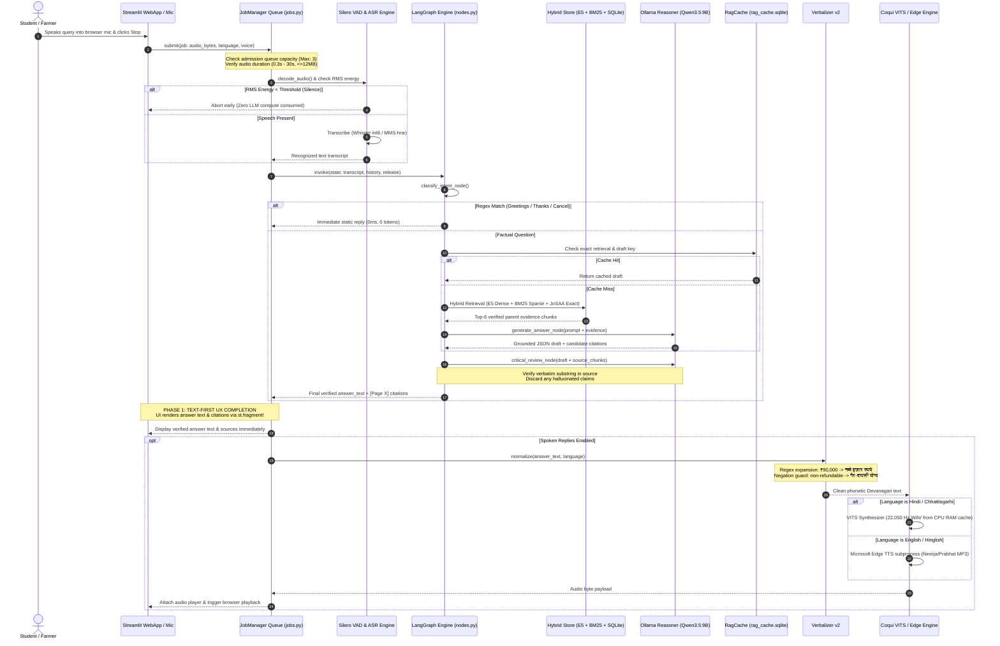
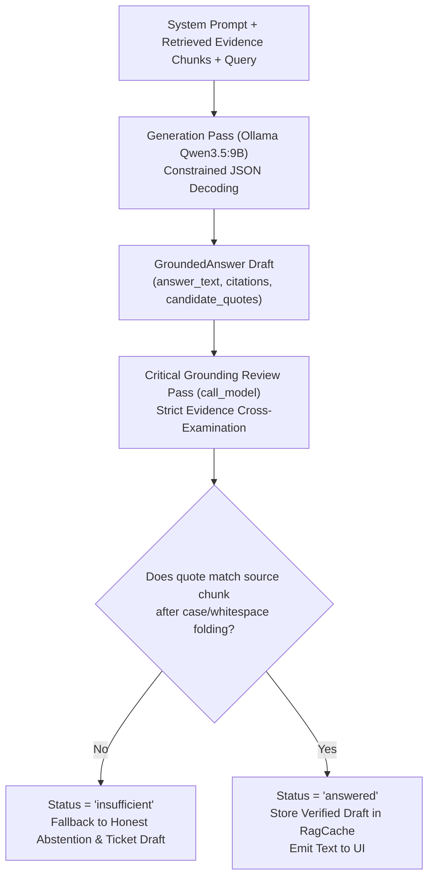

# Document 2: System Architecture, Component Implementation & Internal Methodologies

**Project Title:** Architecture of a Cost-Efficient, Low-Latency Voice-to-Voice Conversational RAG System  
**Implementation Codebase:** `code/demo2/`, `code/Institute-voice-agent/institute-assistant/`, `code/STT/stt-service/`, `code/TTS/chattisgarhi-tts-models/`  
**Evaluation Scope:** 316 Passing Tests · 611 Official JoSAA Cutoff Rows · Dual VITS Checkpoints · 120-Case Live Baseline

---

## 1. High-Level System Architecture & Flow

The system is architected as an **asynchronous, decoupled, multi-tiered pipeline** designed to overcome the VRAM and latency constraints of edge hardware. Rather than running a monolithic synchronous process, the architecture isolates memory, computation, and thread management into dedicated services.

```mermaid
flowchart TB
    subgraph ClientLayer ["1. Client Interaction Layer (Browser / Terminal)"]
        UI["Streamlit Web Client (app.py)\nMicrophone Input (16 kHz PCM)"]
        Term["Terminal Voice Orchestrator\n(PyAudio / sounddevice)"]
    end

    subgraph AdmissionLayer ["2. Admission & Task Queue Management"]
        JM["JobManager (jobs.py)\nBounded FIFO Queue (Capacity = 3)\nTurn Timeout: 120s | Queue Timeout: 60s"]
        Dedup["Audio Dedup (SHA-256)\nRMS Energy Silence Gate"]
    end

    subgraph SpeechInputLayer ["3. Acoustic Recognition (ASR / STT) [CPU Workers]"]
        VAD["Silero VAD (ONNX Runtime)\n512-sample frame invariance (32ms)"]
        ASR_Switch{"Language Router"}
        Whisper["Faster-Whisper (small / int8)\nBeam=1 partials | Beam=5 finals\nCTranslate2 Engine"]
        MMS["Meta MMS-1B (Wav2Vec2)\nChhattisgarhi 'hne' Adapter\nDevanagari CTC Matra Repair"]
    end

    subgraph AgentReasoningLayer ["4. Reasoning & Retrieval Engine (LangGraph)"]
        Classify["Intent & Routing Node\nDeterministic Regex Shortcut\nSystem 1 Jev/Laya or Ollama 9B"]
        
        subgraph HybridKB ["Verified Knowledge Release (Active: 20260927)"]
            E5["Dense Vector Store\n(intfloat/multilingual-e5-small)\n350-tok Chunks, Cosine Space"]
            BM25["Sparse Lexical Index\n(Rank-BM25 with k1=2.5, b=0.75)"]
            SQLiteKB["Structured Sidecar (facts.sqlite)\n611 Exact JoSAA Cutoff Rows"]
        end

        GenLLM["Generation Node\nOllama Local Qwen3.5:9B (Q4_K_M)\nStrict JSON Grammar Decoding"]
        ReviewNode["Critical Grounding Review Node\nVerbatim Quote & Page Validation\nMandatory Rejection if Ungrounded"]
        CacheStore[("Persistent RAG Cache\n(rag_cache.sqlite)\nLFU + 1hr TTL")]
    end

    subgraph SpeechOutputLayer ["5. Speech Verbalization & Neural Synthesis"]
        Verb["Verbalization v2 (verbalization.py)\nIndian Denominations (लाख/हजार)\nAcademic Lexicon & Negation Guard"]
        TTS_Switch{"Language"}
        VITS["Local Coqui VITS Synthesizer\nChhattisgarhi/Hindi 22.05 kHz WAV\nLRU Voice Cache (Female/Male)"]
        Edge["Microsoft Edge TTS Subprocess\n(Neerja / Prabhat / Swara Online)"]
    end

    UI -->|Record Audio| JM
    Term -->|Stream Chunks| JM
    JM --> Dedup
    Dedup -->|Valid Audio| VAD
    VAD --> ASR_Switch
    ASR_Switch -->|hi / en / hinglish| Whisper
    ASR_Switch -->|hne (Chhattisgarhi)| MMS
    Whisper --> Classify
    MMS --> Classify

    Classify -->|Cache Key Check| CacheStore
    Classify -->|Direct Cutoff Lookup| SQLiteKB
    Classify -->|Vector Query| E5
    Classify -->|Keyword Query| BM25
    E5 & BM25 -->|Reciprocal Rank Fusion| GenLLM
    SQLiteKB -->|Exact Row Injection| GenLLM
    GenLLM --> ReviewNode
    ReviewNode -->|Verified Text Displayed FIRST| UI
    ReviewNode -->|Verified Text to Speech| Verb
    Verb --> TTS_Switch
    TTS_Switch -->|Hindi / Chhattisgarhi| VITS
    TTS_Switch -->|English / Hinglish| Edge
    VITS & Edge -->|Audio Stream| UI
```

---

## 2. End-to-End Request-to-Response Turn Sequence

The sequence diagram below traces the execution lifecycle of a single user turn, highlighting our **Text-First Decoupled UX (F05)** that renders answers $4\text{--}15\text{ s}$ before audio synthesis completes.



---

## 3. Deep Dive: Component Methodologies & Internal Algorithms

### 3.1 Acoustic Ingress, Silero VAD & The 512-Sample Frame Invariant

Raw streaming audio captured from browser microphones or telephony streams is normalized to single-channel 16,000 Hz 16-bit little-endian PCM. 

#### Mathematical Formulation of Voice Activity Detection:
Let $x[n]$ be the discrete audio signal sampled at $f_s = 16,000\text{ Hz}$. Silero VAD operates on fixed time slices $\Delta t = 32\text{ ms}$, corresponding to exactly:
$$N_{\text{frame}} = f_s \times \Delta t = 16,000 \times 0.032 = 512 \text{ samples}$$

Because incoming network packets arrive with variable chunk sizes $M \ne 512$ (e.g., $40\text{ ms} = 640\text{ samples}$), passing arbitrary slices to the ONNX runtime causes shape violation errors. Our `SpeechDetector` class maintains an internal residual FIFO buffer:
$$\mathbf{B}_{k} = \mathbf{concat}(\mathbf{r}_{k-1}, \mathbf{x}_{k})$$
$$n_{\text{eval}} = \left\lfloor \frac{|\mathbf{B}_{k}|}{512} \right\rfloor$$
$$\mathbf{r}_{k} = \mathbf{B}_{k}[512 \cdot n_{\text{eval}} : ]$$

Each 512-sample frame $\mathbf{f}_j$ is evaluated by the recurrent ONNX graph yielding speech probability $p_j = P(\text{speech} \mid \mathbf{f}_j)$.
* **Barge-in Trigger:** If the state transitions from $\text{SILENCE} \to \text{SPEAKING}$, an immediate WebSocket event `STTEvent(SPEECH_STARTED, interrupt=True)` is emitted to terminate running speaker playback.
* **Endpointing Rule:** Utterance termination is triggered when silence persists for $\tau_{\text{EOS}} \ge 600\text{ ms}$ or buffer duration reaches the hard safety limit $L_{\max} = 20,000\text{ ms}$.

```
      Arbitrary Input Chunk (e.g., 640 samples)
  ┌──────────────────────────────────────────────┐
  │              Incoming Audio                  │
  └──────────────────────┬───────────────────────┘
                         ▼
  ┌──────────────────────────────────────────────┐
  │  Residual Buffer: concat(residual, incoming) │
  └───────┬──────────────────────────────┬───────┘
          │                              │
          ▼                              ▼
  ┌───────────────┐              ┌───────────────┐
  │ Frame 1 (512) │              │ Residual Left │
  │  Silero ONNX  │              │ (128 samples) │
  └───────────────┘              └───────────────┘
```

---

### 3.2 Dual ASR Engine: Faster-Whisper vs. Meta MMS-1B (`hne`)

To achieve multi-lingual dialect coverage on constrained hardware, the system splits transcription between two specialized engines:

#### 1. Faster-Whisper (Hindi, English, Hinglish):
* **Inference Backend:** CTranslate2 using 8-bit integer quantization (`int8`) on CPU.
* **Dual Decoding Strategy:**
  * **Greedy Decoding for Partials ($beam=1$):** Slices only the trailing $6,000\text{ ms}$ of speech (`PARTIAL_WINDOW_MS`) to maintain $O(1)$ computation latency ($\sim 250\text{ ms}$) during live captioning.
  * **Beam Search for Finals ($beam=5$):** Evaluates the entire utterance buffer to maximize transcription accuracy.
* **Hallucination Suppression:** Rejects transcripts where the no-speech probability $P(\text{no\_speech}) > 0.60$.

#### 2. Meta MMS-1B (`facebook/mms-1b-all` with `hne` adapter):
* **Architecture:** 1-billion-parameter Wav2Vec2 backbone with a fine-tuned CTC head specifically for Chhattisgarhi (`hne`).
* **Connectionist Temporal Classification (CTC) Decoding:**
  Given acoustic features $\mathbf{X}$, CTC computes the probability of alignment $\pi$:
  $$P(\mathbf{y} \mid \mathbf{X}) = \sum_{\pi \in \mathcal{B}^{-1}(\mathbf{y})} \prod_{t=1}^T P(\pi_t \mid \mathbf{X})$$
* **Devanagari CTC Matra Repair (`clean_mms_devanagari`):**
  Acoustic CTC models frequently emit whitespace before dependent Devanagari vowel signs (matras), causing invalid rendering artifacts (dotted circles $\text{क } + \text{ ो} \to \text{क◌ो}$). We enforce a regex repair pass:
  ```python
  text = re.sub(r'\s+([\u093e-\u094c\u0901-\u0903\u094d])', r'\1', text)
  ```

---

### 3.3 Hybrid Knowledge Retrieval & Relational Sidecar Architecture

Unlike standard vector-only RAG, which fails on numerical tabular queries (such as cutoff ranks), our retrieval layer combines **dense embeddings, sparse lexical frequencies, and an exact relational database**.

```
                           User Query q
                                │
         ┌──────────────────────┼──────────────────────┐
         ▼                      ▼                      ▼
 ┌───────────────┐      ┌───────────────┐      ┌───────────────┐
 │ Dense Search  │      │ Sparse Search │      │ Relational    │
 │ (mE5-small)   │      │  (Rank-BM25)  │      │  (facts.db)   │
 └───────┬───────┘      └───────┬───────┘      └───────┬───────┘
         │                      │                      │
         └──────────────┬───────┘                      │
                        ▼                              ▼
             ┌─────────────────────┐         ┌───────────────────┐
             │   Reciprocal Rank   │         │ Exact SQL Match   │
             │     Fusion (RRF)    │         │ (611 JoSAA Rows)  │
             └──────────┬──────────┘         └─────────┬─────────┘
                        │                              │
                        └──────────────┬───────────────┘
                                       ▼
                       Top-6 Verified Parent Chunks
```

#### 1. Dense Semantic Retrieval (`intfloat/multilingual-e5-small`):
* Context is indexed into 350-token chunks with 50-token overlap.
* Asymmetric query and passage prefixing:
  $$\mathbf{e}_q = \text{Encoder}("query: " + q), \quad \mathbf{e}_d = \text{Encoder}("passage: " + d)$$
* Stored in Chroma DB with cosine distance:
  $$D_{\text{cosine}}(\mathbf{e}_q, \mathbf{e}_d) = 1 - \frac{\mathbf{e}_q \cdot \mathbf{e}_d}{\|\mathbf{e}_q\| \|\mathbf{e}_d\|}$$

#### 2. Sparse Lexical Retrieval (Rank-BM25):
Given document $d$ and query terms $t \in q$:
$$\text{Score}_{\text{BM25}}(d, q) = \sum_{t \in q} \text{IDF}(t) \cdot \frac{f(t, d) \cdot (k_1 + 1)}{f(t, d) + k_1 \cdot \left(1 - b + b \cdot \frac{|d|}{\text{avgdl}}\right)}$$
Parameters: $k_1 = 2.5, b = 0.75$.

#### 3. Reciprocal Rank Fusion (RRF):
Candidates from dense and sparse retrieval are merged without score normalization:
$$\text{RRF\_Score}(d) = \sum_{m \in \{\text{dense}, \text{sparse}\}} \frac{1}{60 + \text{Rank}_m(d)}$$

#### 4. Exact Relational Sidecar (`facts.sqlite`):
When a query contains rank or admission criteria dimensions (Year, Program, Category, Round, Quota), the system executes a parameterized SQL query over 611 official JoSAA records (2022–2026), bypassing approximate vector search:
```sql
SELECT opening_rank, closing_rank, seat_pool, round, year, category 
FROM josaa_cutoffs 
WHERE program = 'CSE' AND category = 'SC' AND round = 5 AND year = 2026;
```

#### 5. Multi-Page Citation Attribution (F02 / F18):
When multi-page financial records (e.g., PM-Vidyalaxmi guidelines) combine loan benefits from Page 2 with repayment exclusions from Page 4, `structured.py:record_text()` prefixes each condition with explicit page tags (`[Page 2] ... \n [Page 4] ...`), providing exact provenance for the grounding reviewer.

---

### 3.4 Two-Pass Grounding Verification Architecture

To guarantee zero hallucinations in institutional answering, the reasoning graph executes a **two-pass verification node** using constrained JSON grammar decoding.



#### Grounding Review Verification Rules:
1. `answer_text` must be strictly derived from the supplied context.
2. For every citation item $c \in \text{evidence}$, the string $\text{quote}(c)$ must exist as an exact contiguous substring within an approved evidence block:
   $$\text{normalize}(\text{quote}(c)) \subseteq \text{normalize}(\text{chunk}_{\text{text}})$$
3. If an LLM skips an intervening line in a table (e.g. `Rank basis`), the validator executes an ordered deterministic line-expansion repair to restore full context without failing the quote.
4. Any missing evidence immediately triggers honest abstention (`say("missing", language)`), offering a local staff review draft without promising false turnaround times.

---

### 3.5 Deterministic Verbalization v2 (`verbalization.py`)

Neural TTS models (such as Coqui VITS) frequently fail on currency symbols, Roman acronyms, Latin digits, and percentages when operating in Devanagari mode. Our verbalization engine (`domain-pronunciation-2`) applies deterministic regex transformations prior to synthesis.

#### Normalization Matrix:
| Domain Input | Verbalization v2 Transformation | Linguistic / Safety Rationale |
|---|---|---|
| `₹ 90,000` | `नब्बे हजार रुपये` | Converts currency glyphs to Indian numbering denominations (लाख, हजार, सौ). |
| `3.5%` | `तीन दशमलव पाँच प्रतिशत` | Eliminates raw decimal points (`.`) and ensures explicit decimal words. |
| `IIIT-NR` | `आई.आई.आई.टी. नया रायपुर` | Expands acronyms to prevent robotic character-by-character spelling. |
| `non-refundable` | `गैर-वापसी योग्य` | **Negation Guard:** Protects financial terms from semantic inversion. |
| `excluding` | `को छोड़कर` | Prevents fee exclusion terms from being synthesized as inclusion. |
| `Round 5` | `पांचवां राउंड` | Converts cardinal numerals to ordinal representations. |

---

### 3.6 Dual TTS Synthesis & In-Memory LRU Voice Cache (F07)

The speech synthesis layer employs two distinct engines based on language routing:

1. **Local Coqui VITS (Hindi & Chhattisgarhi):**
   * Checkpoints: `Female/best_model.pth` and `Male/best_model.pth` (each $\sim 950\text{ MB}$).
   * Sampling Rate: $22,050\text{ Hz}$ mono WAV.
   * **In-Memory LRU Cache (`_SYNTHESIZERS`):** Instead of reloading $950\text{ MB}$ weights from disk when users switch voices, an `OrderedDict` keeps both Male and Female synthesizers resident in host CPU memory, reducing voice switching latency from $1.8\text{ s}$ to **$0\text{ ms}$**.
2. **Microsoft Edge TTS Subprocess (English & Hinglish):**
   * Indian English voices: `en-IN-NeerjaNeural`, `en-IN-PrabhatNeural`.
   * High naturalness for mixed-script Hinglish conversational dialogue.
