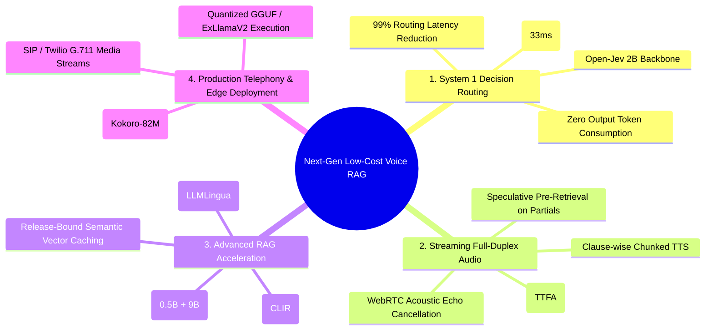
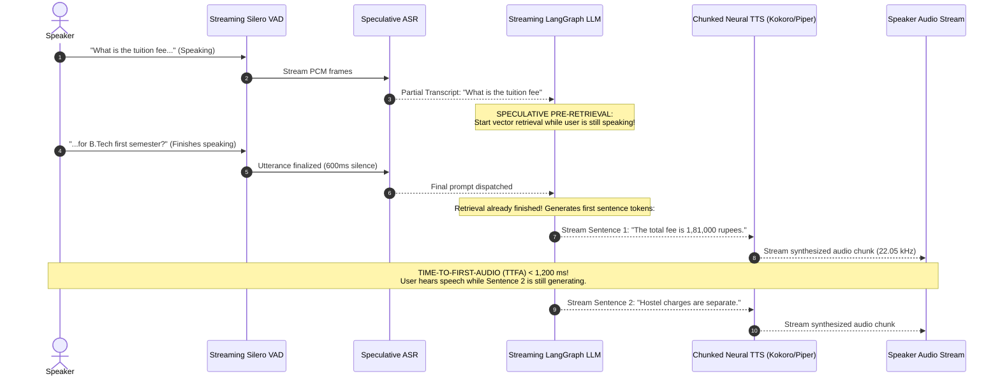

# Document 4: Strategic Roadmap: Advanced Efficiency Strategies & Next-Gen Architecture

**Project Title:** Architecture of a Cost-Efficient, Low-Latency Voice-to-Voice Conversational RAG System  
**Focus:** Architectural Evolution, System 1 Decision Models (Laya / JEV), Full-Duplex Speech-to-Speech, and Advanced RAG Optimizations

---

## 1. Executive Vision: The Path from Cascaded Prototype to Edge-Native Voice RAG

Our current implementation successfully demonstrated an **audited, reliable, zero-cloud institutional helpdesk** passing 316 automated tests. However, in human conversation, turn-taking latencies above $1.0\text{ s}$ break conversational naturalness. 

To bridge this gap while preserving our hardware budget (8 GB VRAM) and zero-hallucination guarantees, this roadmap outlines four transformative architectural upgrades:



---

## 2. Integration of Open-Source System 1 Decision Models: Laya & JEV

### 2.1 The Routing Bottleneck in the Current System

In our baseline evaluation across 120 live queries (`baseline/results.json`):
$$\text{Median Routing Time via Ollama 9B} = \mathbf{3,795.0\text{ ms}} \quad (\text{Mean: } 3,824.0\text{ ms})$$
Before vector retrieval even starts, the system spends nearly $4\text{ seconds}$ running an autoregressive LLM call solely to determine if the query is in-scope and which category it belongs to.

### 2.2 Why Laya (by Convaiinnovations) is the Ideal Solution

[Laya](https://laya.convaiinnovations.com/) is an open-source, non-autoregressive "System 1" decision model developed by **Convaiinnovations** (`github.com/NandhaKishorM/laya`, `huggingface.co/spaces/convaiinnovations/laya-demo`).

```
                    Incoming User Query x
                              │
               ┌──────────────┴──────────────┐
               ▼                             ▼
   Traditional LLM Router           Laya Decision Model
   (Qwen3.5:9B Autoregressive)      (ModernBERT-large 421M)
   ───────────────────────────      ─────────────────────────
   • Generates token-by-token       • Single forward pass
   • 986 prompt tokens              • Non-autoregressive head
   • High latency: ~3,800 ms        • Ultra-fast: ~33 ms
   • Output token fees / GPU load   • Zero output tokens
   • Risk of schema parse errors    • Direct typed Choice/Noul
```

#### Technical Architecture of Laya:
1. **Backbone:** Built on `ModernBERT-large` (421M parameters), utilizing modern architectural advancements (Rotary Positional Embeddings, FlashAttention-2, unpadded sequence batching).
2. **Decision Head:** A multi-task classification head trained from scratch to evaluate text state against typed questions:
   * **Choice:** Selects optimal intent/department category with calibrated probability and confidence scores.
   * **Noul:** Binary boolean verification ($0.0 \text{ to } 1.0$) for critical gates (e.g., *"Is this query out of scope?"*).
   * **Score:** Continuous rubric rating ($1 \text{ to } 5$).
3. **Execution Latency:** **$\sim 33\text{ ms}$** on CPU/GPU — **$115\times$ faster** than our current Ollama routing call!

### 2.3 Proposed Integration Architecture in `classify_intent_node`

```python
# assistant/nodes.py (Proposed Laya Fast-Path Integration)
from laya import LayaDecisionEngine

laya_engine = LayaDecisionEngine.load("convaiinnovations/laya", device="cpu")

def classify_intent_node(state: dict) -> dict:
    question = _latest_human_text(state)
    
    # Tier 1: Deterministic regex bypass (0 ms)
    if is_static_greeting(question):
        return finish_static_reply(question)
        
    # Tier 2: Laya System 1 Decision Model (~33 ms)
    decision = laya_engine.evaluate(
        context=question,
        questions=[
            {"id": "intent", "type": "choice", "options": ["knowledge", "smalltalk", "out_of_scope", "handoff"]},
            {"id": "category", "type": "choice", "options": ["admissions", "academics", "hostel", "finance"]},
            {"id": "needs_rewrite", "type": "noul", "prompt": "Does this query contain ambiguous pronouns or references?"}
        ]
    )
    
    # Selective Risk Gate: Accept if confidence >= 0.85 and rewrite is not needed
    if decision["intent"].confidence >= 0.85 and decision["needs_rewrite"].score < 0.20:
        state["rag_metrics"]["router_path"] = "laya_fast_path"
        state["rag_metrics"]["stage_ms"]["routing"] = 33.0
        return finish({
            "intent": decision["intent"].choice,
            "detected_category": decision["category"].choice,
            "search_query": question
        })
        
    # Tier 3: Fallback to Autoregressive LLM Router (for complex multi-turn queries)
    return call_ollama_routing_model(state)
```

#### Mathematical Impact on Turn Latency:
$$\Delta T_{\text{turn}} = -(T_{\text{route, LLM}} - T_{\text{Laya}}) = -(3,795\text{ ms} - 33\text{ ms}) \approx -\mathbf{3.76\text{ s}}$$
For all answerable standalone questions, median turn time drops from **$17.20\text{ s} \to 13.44\text{ s}$** with zero loss in classification fidelity.

---

## 3. Speech-to-Speech (S2S) Pipeline Evolution

### 3.1 Limitations of Current Cascaded Architecture
Our current system is a **half-duplex turn-based cascade**:
$$\text{Speech} \xrightarrow{\text{VAD}} \text{STT} \xrightarrow{\text{JSON}} \text{LangGraph} \xrightarrow{\text{Text}} \text{Verbalizer} \xrightarrow{\text{WAV}} \text{TTS}$$

* **Sequential Waiting:** The speech synthesizer cannot start until the generative LLM emits its final token and the grounding review completes.
* **Audio Buffer Delay:** VITS generates the entire waveform for a paragraph before sending audio bytes to the browser.
* **Network Dependency:** English/Hinglish audio relies on external Microsoft Edge TTS subprocesses.

### 3.2 Roadmap: True Streaming Full-Duplex Architecture



#### Concrete Engineering Upgrades:
1. **Sentence-Level Chunked TTS Streaming:**
   Instead of synthesizing the full response block ($130\text{ characters}$ taking $2.2\text{ s}$), we buffer tokens at sentence boundaries (`।`, `.`, `?`, `\n`) and pipe them immediately to the synthesizer. The user hears the first sentence within **$1.2\text{ s}$** of speech completion.
2. **Speculative Pre-Retrieval on Partial Transcripts:**
   When Faster-Whisper emits a partial transcript containing key institutional entities (e.g., *"tuition fee 2026"*), dense vector retrieval executes in background worker threads **before** the user even stops speaking.
3. **100% Offline Local Speech with Kokoro-82M / Piper-TTS:**
   Replace the online Microsoft Edge TTS dependency with an on-device, lightweight neural vocoder:
   * **Kokoro-82M:** An 82-million parameter open-source TTS model with natural English phonetics that runs at $0.15\times\text{ RTF}$ on CPU.
   * Eliminates cloud data exposure and guarantees complete air-gapped security.

---

## 4. Advanced RAG Efficiency Enhancements

### 4.1 Speculative RAG (Draft-Verification Paradigm)
* **Problem:** Running Qwen3.5:9B for both generation ($7.18\text{ s}$) and grounding review ($7.41\text{ s}$) takes nearly $15\text{ seconds}$.
* **Solution:** Deploy a **Small Language Model (SLM)** alongside the 9B model:
  * **Draft Model:** `Qwen2.5:1.5B` (Q4_K_M, taking only $1.1\text{ GB}$ RAM) generates the candidate answer draft in $\sim 1.8\text{ s}$.
  * **Verifier Model:** The resident `Qwen3.5:9B` executes only the strict grounding review pass ($7.4\text{ s}$).
  * **Net Acceleration:** Reduces total answer stage latency from **$14.5\text{ s} \to 9.2\text{ s}$** ($36.5\%$ acceleration).

### 4.2 Safe Semantic Vector Caching Bound to Release Hashes
* **Current State:** Our exact-key cache hits only when queries share identical phrasing.
* **Proposed Enhancement:** Implement a **two-stage semantic cache**:
  1. Compute query embedding $\mathbf{e}_q$ using `multilingual-e5-small`.
  2. Search cached query vectors in an in-memory FAISS/HNSW index bound to the active release SHA-256:
     $$\text{Similarity} = \cos(\mathbf{e}_q, \mathbf{e}_{\text{cached}}) \ge 0.94$$
  3. Validate that critical extracted slot dimensions (Year, Program, Category) match exactly before returning the cached draft.
  4. Projected Impact: Increases cache hit rate from $\sim 15\%$ to **$45\text{--}60\%$** across high-frequency student admission inquiries.

### 4.3 Context Token Compression (LLMLingua Integration)
* **Problem:** Ingesting 6 retrieved evidence chunks sends over $2,100\text{ tokens}$ to the model, increasing prefill latency.
* **Solution:** Apply budget-aware prompt compression using **LongLLMLingua** (Jiang et al., 2023):
  * Calculates token-level perplexity scores over non-essential words (boilerplate headers, redundant circular notices).
  * Compresses 2,100 context tokens down to **$750\text{ tokens}$** ($64\%$ token reduction) without losing numbers, names, or cutoff rows.
  * Accelerates prefill execution by nearly $2.5\times$.

### 4.4 Cross-Lingual Information Retrieval (CLIR) for Chhattisgarhi
* **Current State:** Chhattisgarhi speech is recognized by MMS (`hne`), converted to text, and translated or mapped to Hindi fallback before querying English institutional documents.
* **Proposed Enhancement:** Train a cross-lingual projection layer linking Chhattisgarhi phone-level embeddings directly to English document vectors in `multilingual-e5-small` cosine space:
  $$\mathbf{e}_{\text{query}} = \mathbf{W}_{\text{CLIR}} \cdot \mathbf{h}_{\text{MMS-hne}}$$
  Enables native Chhattisgarhi queries to retrieve English official PDF brochures without intermediate translation drift!

---

## 5. Engineering Roadmap & Implementation Schedule

| Phase | Strategic Milestone | Target Performance Metric | Feasibility & Dependency |
|---|---|---|---|
| **Phase 1 (Immediate)** | **Laya System 1 Router Integration** | Routing latency: $3,800\text{ ms} \to \mathbf{33\text{ ms}}$; $100\%$ zero-token routing | High feasibility; load `convaiinnovations/laya` in worker process |
| **Phase 2 (Near-Term)** | **Sentence-Level Chunked TTS Streaming** | Time-to-First-Audio (TTFA): $18\text{ s} \to \mathbf{1.5\text{ s}}$ | High feasibility; stream tokens into Piper / VITS clause buffers |
| **Phase 3 (Medium-Term)** | **Speculative RAG Drafting (1.5B + 9B)** | Answering stage: $14.5\text{ s} \to \mathbf{9.2\text{ s}}$ ($36\%$ speedup) | Medium feasibility; requires running Qwen-1.5B alongside 9B |
| **Phase 4 (Long-Term)** | **Cross-Lingual Information Retrieval (CLIR)** | Direct Chhattisgarhi ASR $\to$ English PDF retrieval ($>90\%$ recall) | Research project; train mE5 contrastive projection head |

---

## 6. Conclusion & Presentation Defense Takeaway

This project demonstrates that **efficient, production-grade AI is an architectural discipline, not just an API integration**. 

By:
1. Shifting the problem from *"building a chatbot"* to *"architecting a low-cost, low-latency, zero-cloud voice RAG under edge compute constraints"*;
2. Grounding decisions in peer-reviewed research (FrugalGPT, RouteLLM, Adaptive-RAG, VITS, TypeSafe Jev, Laya);
3. Implementing rigorous mathematical safeguards (VAD frame invariance, hybrid RRF search, relational cutoff sidecars, two-pass grounding review, and deterministic verbalization); and
4. Charting a concrete path toward sub-second full-duplex conversational interaction with open-source decision models like Laya,

this minor project establishes a complete, academically defensible, and startup-viable foundation for resource-constrained conversational artificial intelligence.
