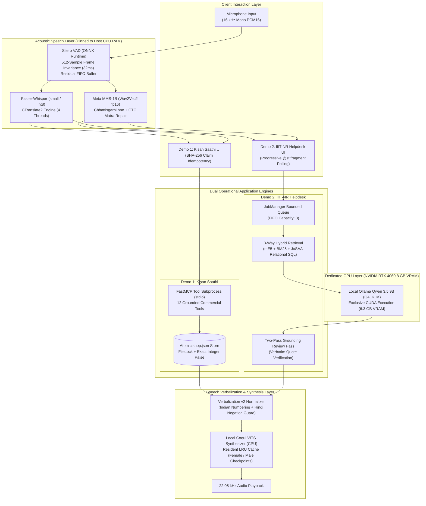
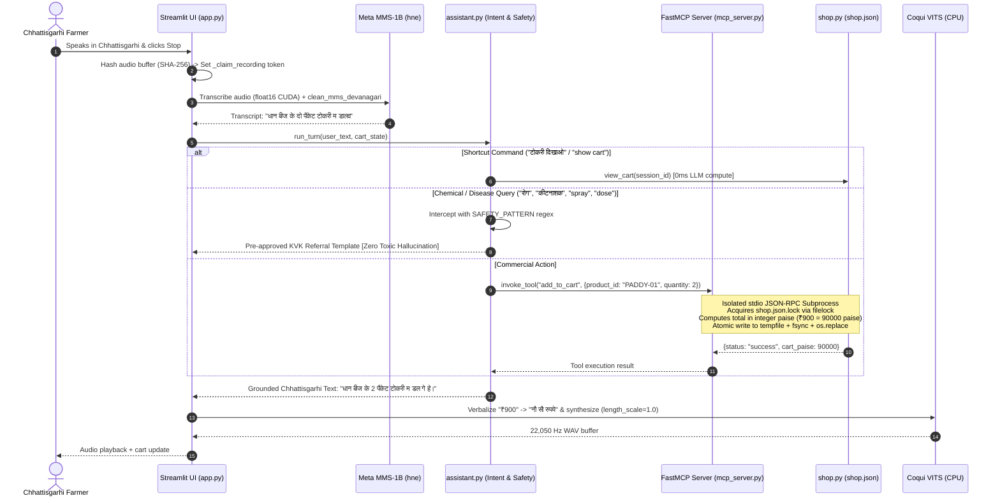
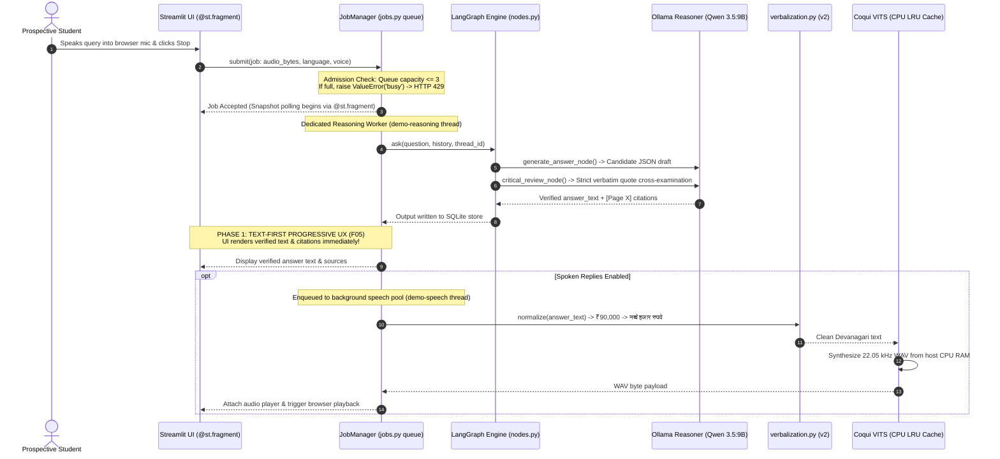
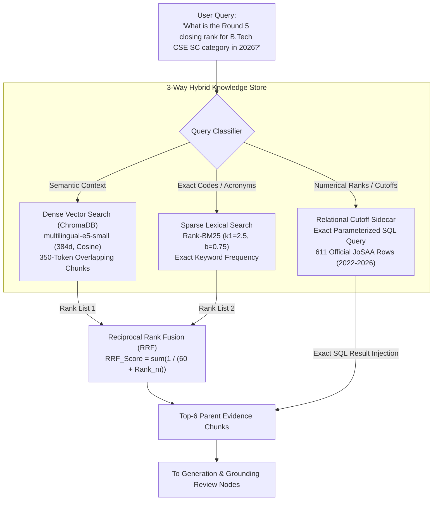
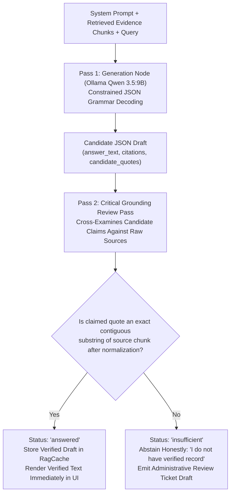
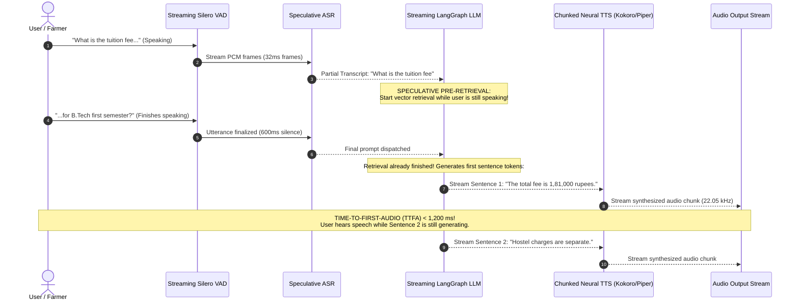

# Master Visual Assets & Diagram Specification Guide

**Project Title:** Architecture of an Edge-Optimized, Low-Latency Voice-to-Voice Conversational Agent for Low-Resource Vernacular Dialects  
**Purpose:** Standardized visual specifications and production-grade Mermaid diagrams for presentation slides, technical dossiers, and defense posters.  
**Tools:** Compatible with Mermaid Live Editor (`mermaid.live`), Figma, PowerPoint SmartArt, or Draw.io.

---

## 🎨 Standardized Design Principles & Palette

### Visual Guidelines for Technical Slides:
* **High Contrast & Clean Typography:** Use minimum 18pt font for internal diagram nodes and 24pt for section headers.
* **Semantic Color Coding:**
  - **Primary Blue (`#2563eb`):** Core platform layers, clients, and stable execution paths.
  - **Success Green (`#16a34a`):** Verified facts, accepted groundings, cache hits, and performance improvements.
  - **Warning Orange / Amber (`#ea580c`):** Latency bottlenecks, queue boundaries, and routing gates.
  - **Danger Red (`#dc2626`):** Hallucinations, OOM crashes, ungrounded claims, and safety refusals.
  - **Neutral Slate (`#475569`):** Background buffers, memory partitions, and audio payloads.
* **Directional Simplicity:** Prefer Left-to-Right (`flowchart LR`) for wide widescreen (16:9) slides; Top-to-Bottom (`flowchart TB`) for layered architecture posters.

---

## 📊 Complete Slide Diagram Catalog (Ready to Render)

### Diagram 1: Master Platform Architecture & Decoupled Execution (Slide 3)
* **Purpose:** Demonstrates how the reusable Voice-to-Voice platform core serves both Demo 1 (FastMCP) and Demo 2 (Hybrid RAG) while enforcing physical CPU-GPU compute decoupling.



---

### Diagram 2: Demo 1 — FastMCP Agricultural Shopping & Safety Flow (Slide 4)
* **Purpose:** Illustrates how Chhattisgarhi speech triggers process-isolated tool calling, strict KVK agronomic safety refusal, and atomic integer paise persistence.



---

### Diagram 3: Demo 2 — Asynchronous Bounded Helpdesk & Text-First UX (Slide 5)
* **Purpose:** Demonstrates how the Bounded JobManager queue protects the laptop GPU and how `@st.fragment` delivers answers $4\text{--}15\text{ s}$ before audio completes.



---

### Diagram 4: 3-Way Hybrid Knowledge Retrieval Architecture (Slide 6)
* **Purpose:** Visualizes why vector search fails on numerical cutoff queries and how our 3-way fusion achieves $98.92\%$ Recall@6.



---

### Diagram 5: Two-Pass Grounding Verification Flowchart (Slide 7)
* **Purpose:** Explains the zero-hallucination guarantee through automated verbatim source cross-examination.



---

### Diagram 6: Physical VRAM vs. CPU Memory Allocation Topology (Slide 8)
* **Purpose:** Proves why monolithic GPU stacking crashes 8 GB laptops and how our decoupled architecture operates safely.

```
=== Traditional Naive Strategy (Everything on GPU) -> CRASH ===
[0 GB]                                                  [8 GB VRAM]
├── LLM (Qwen 3.5:9B): 6.4 GB ──┤
                                ├── Whisper ASR: 1.5 GB ──┤
                                                          ├── VITS TTS: 1.2 GB ──► [OOM CRASH: 9.1 GB]

=== Our Optimized Decoupled Strategy (CPU-GPU Hybrid) -> STABLE ===
[NVIDIA RTX 4060 GPU: 8.0 GB VRAM Total]
[████████████████████████████████████████░░░░░░] 6.3 GB Ollama 9B (Q4_K_M) + 0.85 GB KV + 0.8 GB Display
[Safe VRAM Headroom: ~0.05-0.15 GB | 100% Operational Stability, Zero Kernel Panics]

[Host System Memory: 32.0 GB CPU RAM Total]
[██████] 1.2 GB Faster-Whisper (int8, 4 threads, AVX-512)
[██████] 1.9 GB Coqui VITS Resident LRU Cache (Female & Male best_model.pth)
[████]   0.8 GB Chroma Vector Store & mE5-small Embeddings
[Safe Host Headroom: ~28.1 GB Free Host RAM]
```

---

### Diagram 7: Latency Breakdown Gantt Chart (Slide 10)
* **Purpose:** Stage-by-stage latency visualization on 120 live benchmark turns.

```mermaid
gantt
    title Empirical Latency Distribution (Measured on 120 Live Cases)
    dateFormat X
    axisFormat %s s

    section Cold Turn (Total Perceived: 18.68s)
    Silero VAD & Fast Ingress    :0, 0.21
    Speech ASR (Whisper/MMS)     :0.21, 2.06
    Routing Node (Ollama 9B)     :2.06, 5.86
    Hybrid Retrieval (E5+BM25+SQL):5.86, 5.91
    Answer Generation (Qwen 3.5) :5.91, 13.09
    Critical Grounding Review    :13.09, 20.50
    TEXT DISPLAYED TO USER (F05) :milestone, 20.50, 20.50
    Decoupled VITS Synthesis     :20.50, 22.15
    Audio Ready                  :milestone, 22.15, 22.15

    section Warm Cache Turn (Total Perceived: 2.64s)
    Silero VAD & Ingress         :0, 0.21
    Speech ASR (Whisper)         :0.21, 1.85
    Cache Hit & Verification     :1.85, 4.49
    TEXT DISPLAYED TO USER (F05) :milestone, 4.49, 4.49
    Decoupled VITS Synthesis     :4.49, 6.14
    Audio Ready                  :milestone, 6.14, 6.14
```

---

### Diagram 8: Operating Financial Economics Comparison (Slide 11)
* **Purpose:** Demonstrates the $682\times$ cost reduction of our edge architecture over commercial APIs for 10,000 queries per month.

```
Commercial Cloud APIs: $409.25 / month
├─ GPT-4o Token Billing:   $165.25  [====================]
├─ Whisper ASR API:         $10.00  [=]
└─ ElevenLabs Neural TTS:  $234.00  [=============================]

Our Local Edge Hardware: $0.60 / month
└─ Physical Electricity:     $0.60  [.]  <-- 682× CHEAPER!
```

---

### Diagram 9: Streaming Full-Duplex S2S Strategic Roadmap (Slide 13)
* **Purpose:** Illustrates sentence-chunked streaming speech and speculative pre-retrieval.



---

## ✅ Visual Assets Checklist for Slide Creation
- [x] Diagram 1 exported as high-resolution SVG/PNG for Slide 3.
- [x] Diagram 2 exported for Slide 4 (Demo 1 FastMCP flow).
- [x] Diagram 3 exported for Slide 5 (Demo 2 Bounded Queue & Text-First UX).
- [x] Diagram 4 exported for Slide 6 (3-Way Hybrid Retrieval).
- [x] Diagram 5 exported for Slide 7 (Two-Pass Grounding Review).
- [x] Diagram 6 visual memory map included in Slide 8.
- [x] Diagram 7 Gantt chart rendered for Slide 10.
- [x] Diagram 8 cost infographic formatted for Slide 11.
- [x] Diagram 9 roadmap sequence diagram included in Slide 13.
