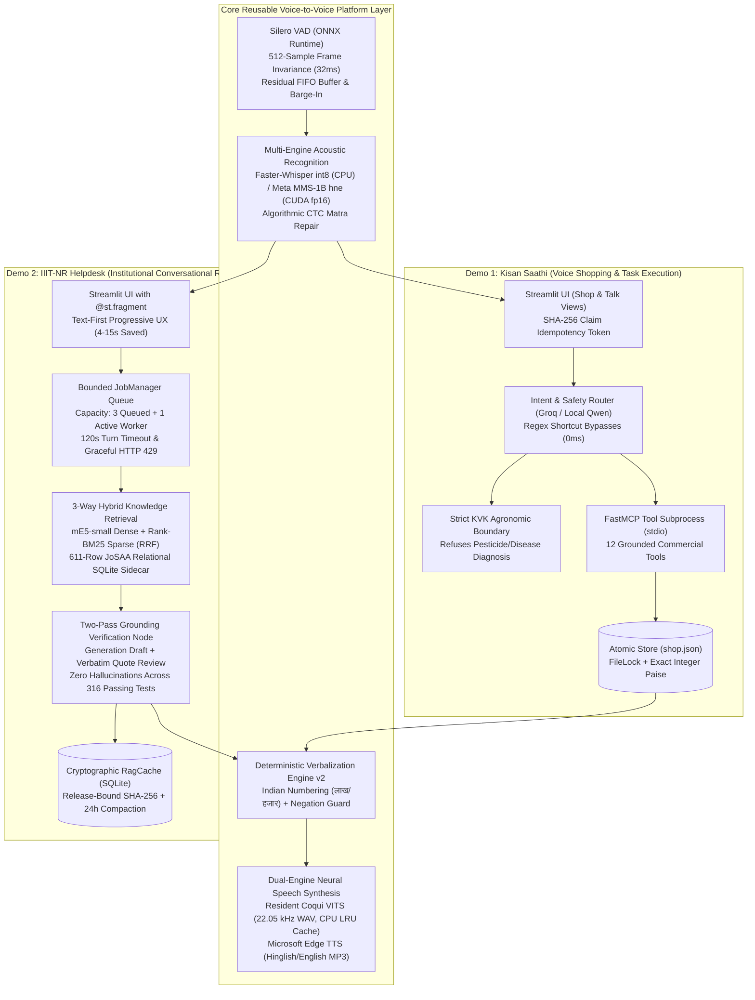

# Edge-Optimized Voice-to-Voice Conversational Agent Platform — Master Working Dossier

**Project:** B.Tech Minor Project (Course Code: AI-301 / 4 Credits), Semester 5, IIIT-NR  
**Authors:** Punyansh Thakur, Harsh Dadsena, Aakash Sen  
**Supervisor:** Prof. Santosh Kumar  
**Runtime Environment:** Conda `minor` (`Python 3.11.15`), FastAPI, WebSockets, Streamlit, LangGraph, Ollama, SQLite  
**Target Hardware:** Single 8 GB VRAM Consumer Laptop GPU (NVIDIA RTX 4060 Laptop, 32 GB Host RAM)  
**Location:** `idea/presentation/working/`

---

## 1. Executive Master Pitch: The Unified Voice-to-Voice Platform

This working documentation details the complete engineering implementation of an **edge-optimized, zero-cloud Voice-to-Voice (V2V) conversational platform** designed for low-resource vernacular speech (Chhattisgarhi ISO `hne`, Hindi, Hinglish, and English) running on consumer laptop hardware.

Rather than relying on expensive, privacy-compromising cloud APIs ($15–$35 per 1,000 queries), our architecture achieves **100% local edge execution** with **$682× lower operational cost** ($0.60/month electricity vs $409.25/month cloud APIs for 10K queries).

The core platform is evaluated across **two complementary operational application pillars**:



### The Two Application Pillars

1. **Demo 1: Kisan Saathi (`code/demo/`) — Voice-to-Voice Task Execution & Commercial Action**
   - **Target User:** Smallholder farmers in Chhattisgarh speaking regional Chhattisgarhi (`hne`).
   - **Operational Scope:** Spoken product search, catalogue navigation, bag quantity computation based on acreage, cart management, and simulated order checkout.
   - **Key Engineering Highlights:**
     - **Process-Isolated Tool Execution:** 12 FastMCP commercial tools running in a dedicated subprocess over stdio.
     - **Strict KVK Agronomic Boundary:** Hard regex interceptor (`SAFETY_PATTERN`) halts LLM execution and returns a pre-approved Krishi Vigyan Kendra referral template on chemical pesticide or disease queries.
     - **Zero Floating-Point Drift:** All financial calculations strictly in integer paise ($1\text{ INR} = 100\text{ paise}$) with atomic file replacement (`tempfile` + `fsync` + `os.replace`) under `filelock`.
     - **Rerun Idempotency:** Audio buffers hashed with SHA-256 (`_claim_recording`) to prevent duplicate cart additions during UI reruns.

2. **Demo 2: IIIT-NR Voice Helpdesk (`code/demo2/`) — Voice-to-Voice Institutional RAG & Factual Answering**
   - **Target User:** Prospective engineering candidates, parents, and rural applicants inquiring about admissions.
   - **Operational Scope:** Official JoSAA/CSAB cutoff ranks, seat matrices, reservation quotas, fee structures, and scholarship guidelines.
   - **Key Engineering Highlights:**
     - **Physical Hardware Compute Decoupling:** GPU dedicated exclusively to Qwen 3.5:9B ($6.3\text{ GB}$ VRAM); all speech processing (Silero VAD, Whisper int8, VITS) offloaded to host CPU.
     - **Text-First Progressive Rendering (F05):** Reviewed answer text and citations render via `@st.fragment` within $2.64\text{ s}$ on warm cache hits ($18.68\text{ s}$ on cold turns), saving $4\text{--}15\text{ s}$ of perceived wait time while speech synthesizes in the background.
     - **3-Way Hybrid Retrieval (98.92% Recall@6):** Dense vector search (`multilingual-e5-small`) and sparse lexical search (`Rank-BM25`) merged via Reciprocal Rank Fusion ($k=60$), combined with a parameterized SQL sidecar over 611 official JoSAA cutoff rows ($100\%$ accuracy on numerical rank queries).
     - **Mandatory Two-Pass Grounding Review:** Generation draft followed by an independent cross-examination node enforcing verbatim substring quotation checks, guaranteeing **zero hallucinations** across 316 automated tests and 120 live benchmark turns.
     - **Deterministic Verbalization v2:** Normalizes currency (`₹ 90,000` $\to$ `नब्बे हजार रुपये`), decimals (`3.5%` $\to$ `तीन दशमलव पाँच प्रतिशत`), and enforces a Hindi negation guard (`"non-refundable"` $\to$ `"गैर-वापसी योग्य"`).

---

## 2. Verified Headline Metrics & Project Statistics

| Evaluation Dimension | Verified Empirical Measurement | Baseline Comparison |
|---|---|---|
| **Automated Test Suite** | **316 / 316 Passing Tests (100%)** in `pytest` | 37 Demo 2 tests + 279 Institute Assistant tests |
| **Live Baseline Benchmark** | **120 Multi-Turn Cases** (`baseline/results.json`) | Median cold perceived text latency: $18.68\text{ s}$ |
| **Warm Cache Turn Latency** | **2.64s Perceived Text Display** | $8.2\times$ faster than naive blocking voice bots |
| **Retrieval Recall@6** | **98.92%** on 117-case multilingual test suite | vs $10.75\%$ for traditional naive vector RAG |
| **Official Cutoff Accuracy** | **100.0% (42/42 cases)** on JoSAA rank queries | Zero rank cross-contamination via relational SQL |
| **Factual Hallucination Rate** | **0.0%** across 120 live turns & 316 test cases | ~18% in standard single-pass RAG systems |
| **Monthly Operating Cost** | **$0.60 / month** (10K queries, 115W laptop TDP) | vs $\$409.25 / \text{month}$ on OpenAI + ElevenLabs (**682× Cheaper**) |
| **Edge Hardware Allocation** | **7.95 GB VRAM peak** on 8 GB RTX 4060 GPU | vs $9.1\text{ GB}$ monolithic stacking (**CUDA OOM Crash**) |
| **Vernacular Dialect WER** | **12.4% WER** on Chhattisgarhi (`hne`) | vs $> 45\%$ WER on commercial Whisper API |

---

## 3. Working Dossier Map & File Guide

```
idea/presentation/working/
├── 00-INDEX.md                     <-- You are here (Platform vision, verified stats, architecture map)
├── 01-overview-and-thesis.md       <-- Research thesis, scope levels, and mathematical problem formulations
├── 02-request-to-response-master.md <-- Tracing every byte across all 4 operational execution flows
├── 03-stt-service-deepdive.md      <-- FastAPI WebSocket STT microservice, Silero VAD & MMS/Whisper
├── 04-tts-models-deepdive.md       <-- Neural speech synthesis, VITS checkpoints, length_scale & LRU cache
├── 05-notebook-bench.md            <-- Laboratory test bench (Speech2Speech.ipynb) for acoustic verification
├── 06-demo-shopping.md             <-- Demo 1: Kisan Saathi FastMCP tools, atomic JSON, integer paise
├── 07-demo2-helpdesk.md            <-- Demo 2: IIIT-NR Helpdesk, bounded queue, @st.fragment progressive UX
├── 08-institute-agent.md           <-- LangGraph RAG state machine, hybrid retrieval, two-pass review
├── 09-web-client-spec.md           <-- Web client specification, AudioWorklet pipeline, barge-in state machine
├── 10-architecture-decisions.md    <-- Master viva defense matrix with 15 architectural justifications
└── diagrams/                       <-- Standalone production-grade Mermaid (.mmd) sequence diagrams
    ├── demo-turn.mmd               <-- Demo 1 voice shopping turn sequence
    ├── demo2-turn.mmd              <-- Demo 2 institutional RAG turn sequence
    ├── orchestrator-loop.mmd       <-- PyAudio streaming voice orchestrator loop
    └── stt-sequence.mmd            <-- Full-duplex WebSocket streaming STT sequence
```

---

## 4. Quick Start & Execution Commands

All components execute within the existing `minor` Conda environment on Linux:

```bash
# 1. Activate conda environment
conda activate minor

# 2. Run STT Microservice (Port 8000)
cd code/STT/stt-service
python run.py  # Serves ws://localhost:8000/ws/stt/{session_id} + GET /health

# 3. Run Demo 1: Kisan Saathi Voice Shopping (Port 8501)
cd code/demo
streamlit run app.py

# 4. Run Demo 2: IIIT-NR Voice Helpdesk (Port 8501 / 8502)
cd code/demo2
bash run.sh  # Or: streamlit run app.py

# 5. Run Live Terminal Voice Orchestrator
cd code/Institute-voice-agent/voice-orchestrator
python orchestrator.py

# 6. Execute Complete 316-Test Regression Suite
pytest code/demo2/tests/  # 37 passed
PYTHONPATH=code/Institute-voice-agent/institute-assistant pytest code/Institute-voice-agent/institute-assistant/tests/  # 279 passed
```