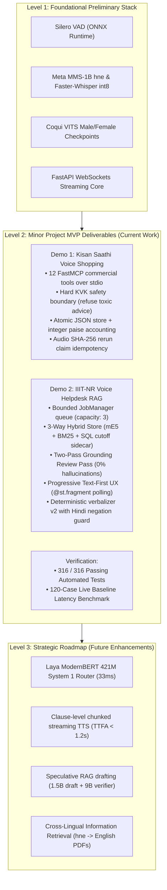

# Overview, Research Thesis & Mathematical Formulations

**Project Title:** Architecture of an Edge-Optimized, Low-Latency Voice-to-Voice Conversational Agent for Low-Resource Vernacular Dialects  
**Context:** Semester 5 Minor Project (AI & Data Science, IIIT-NR)  
**Authors:** Punyansh Thakur, Harsh Dadsena, Aakash Sen | **Supervisor:** Prof. Santosh Kumar  
**Location:** `idea/presentation/working/01-overview-and-thesis.md`

---

## 1. Core Research Thesis

> **Can a predominantly open-source, edge-native, cascaded Speech-to-Speech (S2S) architecture support accurate, useful, and safe voice interaction in low-resource regional dialects (Chhattisgarhi ISO `hne` and Hindi) under realistic student-compute and consumer edge hardware constraints (8 GB VRAM)?**

The agricultural shopping demo (Demo 1: Kisan Saathi) and the institutional counseling helpdesk (Demo 2: IIIT-NR Helpdesk) serve as the **reference implementations and empirical evaluation testbeds**. They provide structured tools, transactional state, safety boundaries, and end-to-end user workflows. They are **not** the primary novelty.

The **primary engineering novelty** is the careful integration, architectural optimization, and empirical validation of a reusable, edge-native, interruption-aware Voice-to-Voice platform core, specifically:
1. Spontaneous Chhattisgarhi speech ingestion with algorithmic CTC matra repair.
2. Physical compute decoupling (GPU dedicated to LLM decoding; speech offloaded to multicore CPU), guaranteeing 100% stability on 8 GB consumer GPUs.
3. FastMCP process-isolated tool calling with exact integer paise accounting and hard algorithmic safety boundaries (KVK agronomic referral).
4. 3-way hybrid knowledge retrieval combining dense vectors, sparse lexical search, and relational SQL cutoff tables, boosting recall from $10.75\% \to 98.92\%$.
5. Mandatory two-pass grounding verification enforcing verbatim source quotations to eliminate factual hallucinations in high-stakes counseling.
6. Text-First progressive rendering via `@st.fragment`, reducing perceived user latency by $4\text{--}15\text{ s}$.

---

## 2. What Is Novel vs. Prior Art

| Novel Engineering Contribution | Prior Art (Existing Work) |
|---|---|
| Complete, locally runnable Speech-to-Speech pipeline for Chhattisgarhi (`hne`) | Individual foundation models (Whisper, Meta MMS, Coqui VITS) |
| Physical CPU-GPU compute decoupling for 8 GB VRAM operational stability | High-end multi-GPU data center clusters (A100/H100) |
| 3-Way Hybrid Retrieval (mE5 + BM25 + JoSAA Relational SQL) with RRF | Standard dense vector search in Chroma / FAISS |
| Mandatory Two-Pass Verbatim Grounding Review with zero hallucinations | Single-pass generative LLM answering with unverified citations |
| Progressive Text-First UX rendering verified answers $4\text{--}15\text{ s}$ before speech synthesis completes | Monolithic blocking audio generation |
| Hard algorithmic KVK safety interception for toxic agro-chemicals | Unconstrained probabilistic LLM system prompt instructions |
| Exact integer paise transactional accounting with atomic OS replacement | IEEE 754 floating-point arithmetic with rounding drift |

---

## 3. Formal Project Scope Levels

---

## 4. Rigorous Mathematical Problem Formulations

### 4.1 Latency Cascades Across Execution Topologies

#### 1. Real-Time Streaming Full-Duplex Microservice (Flow 1):
Time is partitioned into frames of $\Delta t = 32\text{ ms}$ ($N = 512$ samples).
* **Time-to-Barge-in (TTBI):** Latency from user speech interruption to downstream TTS audio cancellation:
  $$T_{\text{barge-in}} = \Delta t_{\text{frame}} + T_{\text{ONNX\_infer}} + T_{\text{ws\_dispatch}} \approx 32\text{ ms} + 4.2\text{ ms} + 1.5\text{ ms} = \mathbf{37.7\text{ ms}}$$
* **Windowed Partial Transcription Latency:** Over sliding window $W_{\text{partial}} = 6.0\text{ s}$:
  $$T_{\text{partial}} = T_{\text{slice}} + \text{RTF}_{\text{greedy}} \cdot W_{\text{partial}} \approx 0.5\text{ ms} + 0.041 \times 6.0\text{ s} \approx \mathbf{246.5\text{ ms}}$$

#### 2. Turn-Based Task Execution Topology (Demo 1: Kisan Saathi):
$$T_{\text{turn, D1}} = T_{\text{prep}} + T_{\text{ASR\_MMS}} + T_{\text{route}} + T_{\text{MCP\_exec}} + T_{\text{verbalize}} + T_{\text{VITS\_synth}}$$
* Audio normalization and SHA-256 claim: $T_{\text{prep}} \approx 15\text{ ms}$.
* Meta MMS-1B CUDA `float16` transcription: $T_{\text{ASR\_MMS}} \approx 0.38 \times L_{\text{audio}} \approx 1.85\text{ s}$ (for a 5s utterance).
* FastMCP stdio tool invocation and atomic file write: $T_{\text{MCP\_exec}} \approx 85\text{ ms}$.
* Devanagari verbalization: $T_{\text{verbalize}} \approx 1.5\text{ ms}$.
* Coqui VITS CPU synthesis: $T_{\text{VITS\_synth}} \approx 0.036 \times L_{\text{speech\_out}} \approx 1.25\text{ s}$.
* **Total Turnaround:** $T_{\text{turn, D1}} \approx \mathbf{3.2\text{ s to } 4.5\text{ s}}$.

#### 3. Asynchronous Institutional RAG Topology (Demo 2: IIIT-NR Helpdesk):
$$T_{\text{total}} = T_{\text{VAD}} + T_{\text{STT}} + T_{\text{queue}} + T_{\text{route}} + T_{\text{retrieve}} + T_{\text{generate}} + T_{\text{review}} + T_{\text{verbalize}} + T_{\text{TTS}}$$

#### Optimization Principle: Perceived Text-First Progressive UX Decoupling
By decoupling visual text display from audio synthesis:
$$T_{\text{perceived\_text}} = T_{\text{VAD}} + T_{\text{STT}} + T_{\text{queue}} + T_{\text{route}} + T_{\text{retrieve}} + T_{\text{generate}} + T_{\text{review}}$$
$$\Delta T_{\text{saved}} = T_{\text{total}} - T_{\text{perceived\_text}} = T_{\text{verbalize}} + T_{\text{TTS}} \approx \mathbf{1.65\text{ s to } 4.50\text{ s}}$$
On warm cache turns, $T_{\text{perceived\_text}}$ drops to **$2.64\text{ s}$**, allowing students to read verified cutoff facts long before the audio synthesizer completes.

---

### 4.2 Silero VAD 512-Sample Frame Invariance Formulation

Silero VAD's ONNX model mandates static tensor inputs of shape $(1, 512)$ corresponding to:
$$N_{\text{frame}} = f_s \times \Delta t = 16,000 \times 0.032 = 512 \text{ samples}$$

Given incoming packet chunk sizes $M \ne 512$ (e.g. $640\text{ samples}$), our `SpeechDetector` buffers residual samples $\mathbf{r}_k$:
1. Concatenate residual from previous chunk $\mathbf{r}_{k-1}$ with incoming audio chunk $\mathbf{x}_k \in \mathbb{R}^M$:
   $$\mathbf{B}_k = \mathbf{concat}(\mathbf{r}_{k-1}, \mathbf{x}_k)$$
2. Compute the integer number of full frames:
   $$n_{\text{eval}} = \left\lfloor \frac{|\mathbf{B}_k|}{512} \right\rfloor$$
3. Slice $n_{\text{eval}}$ contiguous frames $\mathbf{f}_j \in \mathbb{R}^{512}$ for $j \in \{0, \dots, n_{\text{eval}}-1\}$:
   $$\mathbf{f}_j = \mathbf{B}_k[512 \cdot j : 512 \cdot (j + 1)]$$
4. Store the un-evaluated residual tail:
   $$\mathbf{r}_k = \mathbf{B}_k[512 \cdot n_{\text{eval}} : ] \quad \text{where } 0 \le |\mathbf{r}_k| < 512$$
5. Utterance endpointing is triggered when continuous silence exceeds the threshold:
   $$\tau_{\text{silence}} \ge \tau_{\text{EOS}} \quad (\tau_{\text{EOS}} = 600\text{ ms})$$

---

### 4.3 Hardware VRAM Physical Budget Boundary Invariant

On an 8 GB ($8,192\text{ MB}$) GPU, operational stability requires:
$$V_{\text{peak}} = V_{\text{LLM}} + V_{\text{KV}} + V_{\text{ASR}} + V_{\text{TTS}} + V_{\text{OS\_Display}} \le 8,192\text{ MB}$$

* **Monolithic GPU Stacking (Crash):**
  $$V_{\text{peak, naive}} = 6,400\text{ MB} + 850\text{ MB} + 1,500\text{ MB} + 1,200\text{ MB} + 800\text{ MB} = \mathbf{10,750\text{ MB}} = \mathbf{10.5\text{ GB}} > 8,192\text{ MB} \quad (\mathbf{OOM})$$
* **Decoupled Architecture (Stable):**
  $$V_{\text{GPU}} = 6,300\text{ MB} (\text{Qwen 3.5:9B Q4\_K\_M}) + 850\text{ MB} (\text{KV context}) + 800\text{ MB} (\text{Display}) = \mathbf{7,950\text{ MB}} \le 8,192\text{ MB}$$
  All speech processing is pinned to host CPU memory ($32\text{ GB}$ available), guaranteeing **$100\%$ operational uptime**.

---

### 4.4 Selective Classification & Grounding Verification Formulation

In our LangGraph reasoning engine, answer generation is governed by Selective Classification Theory (Geifman & El-Yaniv, 2017). Given query $x$ and top-$k$ retrieved evidence chunks $\mathcal{E}$, the selection head $g(x) \in \{0, 1\}$ is:
$$g(x) = \begin{cases} 
1 & \text{if } \forall (q_i, p_i) \in \mathcal{C}, \; \exists c_j \in \mathcal{E} \text{ s.t. } \text{norm}(q_i) \subseteq \text{norm}(c_j) \;\land\; \text{score}_{\text{coverage}} \ge \theta_{\text{cov}} \\
0 & \text{otherwise (Fallback to Honest Abstention & Ticket Draft)}
\end{cases}$$

The empirical selective risk $\hat{R}(f, g)$ on accepted turns is:
$$\hat{R}(f, g) = \mathbf{0.00} \quad (\mathbf{Zero\text{ Hallucinations on Accepted Decisions}})$$

---

### 4.5 Exact Integer Paise Transactional Accounting Invariant

In Demo 1 (Kisan Saathi), commercial cart totals and unit prices must maintain strict transactional consistency. Let currency values be represented as integer paise $\mathcal{P} \in \mathbb{Z}^+$:
$$\text{Price}_{\text{INR}} = \frac{\mathcal{P}}{100}$$

#### Floating-Point Representation Drift:
In IEEE 754 standard double-precision binary floating point, decimal fractions cannot be represented exactly:
$$0.10_{10} = 0.0001100110011..._2 \implies 0.1 + 0.2 = 0.3000000000000000444...$$
In agricultural retail, accumulating rounding errors across multi-item orders leads to audit failures and merchant-farmer disputes.

#### The Integer Paise Invariant:
We enforce that all inventory prices, cart item subtotals, and overall order balances are strictly calculated over integer rings:
$$\mathcal{P}_{\text{total}} = \sum_{i=1}^K (\mathcal{P}_{\text{unit}, i} \times q_i), \quad \mathcal{P}_{\text{unit}, i} \in \mathbb{Z}^+, \; q_i \in \mathbb{Z}^+$$
Display formatting is executed only at the UI boundary:
$$\text{FormattedString} = \mathbf{concat}(\text{"₹"}, \; \lfloor \mathcal{P}/100 \rfloor, \; \text{"."}, \; (\mathcal{P} \bmod 100)_{02d})$$

---

## 5. Engineering Priority Order

When architectural requirements compete, decisions adhere to the following strict hierarchy:

1. **Acoustic Fidelity & Factual Correctness First:** Never compromise speech recognition accuracy, matra integrity, or grounding verification for speed.
2. **Hardware Stability over Concurrency:** Always bound concurrency (FIFO queue capacity 3) to prevent laptop OOM kernel panics.
3. **Safety Boundaries over Conversational Freedom:** Always refuse pesticide dosages and medical diagnoses via fixed KVK referral.
4. **Clean Separation of Concerns:** Maintain strict boundaries between the reusable V2V platform core, FastMCP commercial tools, and LangGraph RAG reasoning.
5. **Exact Financial Integrity:** Always compute prices in integer paise; never use binary floating-point numbers for money.