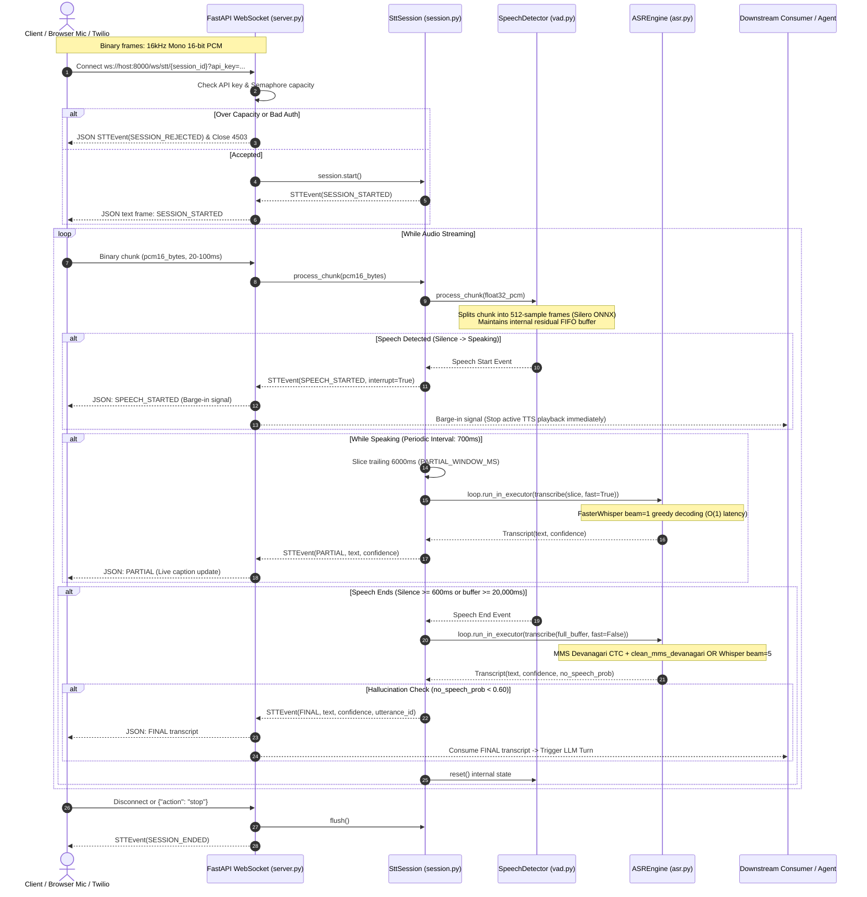
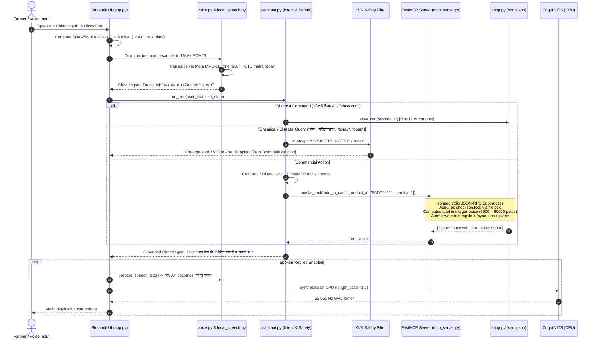
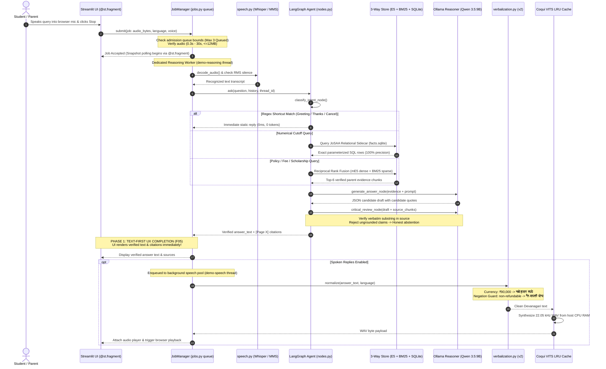
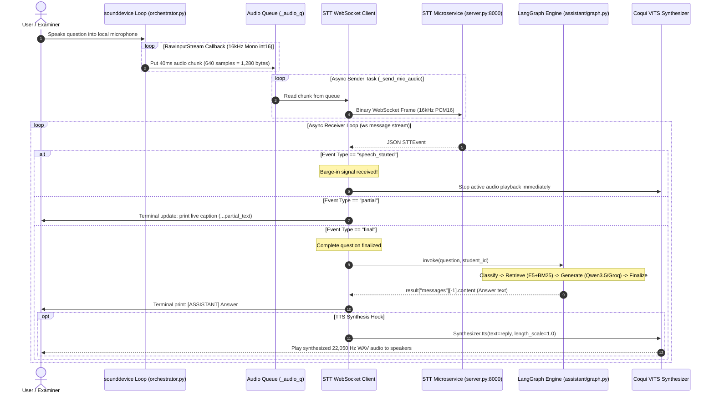

# Request-to-Response Master Architecture & Execution Flow Guide

**Project Title:** Architecture of an Edge-Optimized, Low-Latency Voice-to-Voice Conversational Agent for Low-Resource Vernacular Dialects  
**Context:** Central Architectural Roadmap for All 4 Operational Execution Flows  
**Location:** `idea/presentation/working/02-request-to-response-master.md`

---

## 1. The Four Operational Execution Flows

The repository implements four distinct end-to-end request-to-response execution flows:

| Flow # | System Component | Primary Goal & Scope | Latency Profile | Audio In / Out Protocols |
|---|---|---|---|---|
| **Flow 1** | [STT Microservice](file:///run/media/rtx/Files/Study/Semester%205/Minor/code/STT/stt-service) | Real-time streaming ASR with Silero VAD endpointing & barge-in | ~100–300 ms per chunk | 16 kHz PCM16 in $\to$ JSON `STTEvent` out |
| **Flow 2** | [Demo 1: Kisan Saathi](file:///run/media/rtx/Files/Study/Semester%205/Minor/code/demo) | Turn-based agricultural voice shopping with FastMCP & atomic JSON | 3.2–4.5 s end-to-end | Mic PCM16 in $\to$ 22.05 kHz VITS WAV out |
| **Flow 3** | [Demo 2: Institute Helpdesk](file:///run/media/rtx/Files/Study/Semester%205/Minor/code/demo2) | Asynchronous academic RAG with bounded workers & two-pass verification | 18.68s cold / 2.64s warm (Text) | Mic/WAV/FLAC in $\to$ VITS / Edge audio out |
| **Flow 4** | [Voice Orchestrator](file:///run/media/rtx/Files/Study/Semester%205/Minor/code/Institute-voice-agent/voice-orchestrator) | PyAudio live microphone streaming client to LangGraph state machine | Streaming pipeline | Mic stream $\to$ Terminal text / TTS hook |

---

## 2. Hard Audio Contract Matrix

All audio pipelines across the repository strictly adhere to the following binary contract:

| Audio Parameter | Input Contract (ASR / STT) | Output Contract (TTS / VITS) | Telephony Path (Twilio) |
|---|---|---|---|
| **Sampling Rate** | **16,000 Hz** (16 kHz) | **22,050 Hz** (22.05 kHz) | 8,000 Hz $\to$ Resampled to 16,000 Hz |
| **Channel Count** | Mono (1 Channel) | Mono (1 Channel) | Mono (1 Channel) |
| **Bit Depth & Format** | 16-bit Signed PCM Little-Endian | 16-bit Signed PCM WAV | 8-bit G.711 $\mu$-law |
| **Header Specification** | **Raw PCM (No RIFF/WAV Header)** | Standard RIFF/WAV Header | Base64-encoded raw payload |
| **Packet Size** | 20 ms to 100 ms (typically 40 ms = 640 samples) | Sentence-level WAV buffer | 20 ms (160 bytes $\mu$-law) |
| **VAD Frame Invariant** | Exactly **512 samples** per ONNX frame | N/A | Resampled to 16 kHz $\implies$ 512 samples |

---

## 3. Flow 1: Streaming Real-Time STT Microservice

The standalone FastAPI microservice (`code/STT/stt-service/`) accepts streaming binary PCM audio over WebSockets and emits structured JSON events.

---

## 4. Flow 2: Turn-Based Voice Shopping Assistant (Demo 1)

Demo 1 (`code/demo/`) executes commercial agricultural transactions over process-isolated FastMCP tools and atomic JSON storage.

---

## 5. Flow 3: Asynchronous Academic Voice Helpdesk (Demo 2)

Demo 2 (`code/demo2/`) delivers verified academic counseling facts using bounded worker queues, 3-way hybrid retrieval, and mandatory two-pass grounding verification.

---

## 6. Flow 4: Terminal Voice Orchestrator Client

The voice orchestrator (`code/Institute-voice-agent/voice-orchestrator/orchestrator.py`) is a lightweight streaming client connecting local audio devices to the backend STT service and LangGraph agent.

---

## 7. Fault Tolerance & Exception Recovery Matrix

| Execution Point | Potential Failure Mode | Algorithmic / Architectural Recovery Strategy |
|---|---|---|
| **Audio Ingress** | Corrupt audio codec / zero-byte upload | Caught in `decode_audio()`; rejected before model invocation; user prompted to re-record. |
| **Silero VAD** | Arbitrary chunk sizes ($M \ne 512$) | Buffered in `_residual` FIFO; exact 512-sample evaluation prevents ONNX tensor shape crashes. |
| **Admission Queue** | Peak concurrent traffic $> \text{QUEUE\_CAPACITY}$ | JobManager raises immediate `ValueError("busy")`; UI returns graceful HTTP 429 overload cue. |
| **Ollama LLM** | Ollama daemon down or connection refused | UI exposes explicit Groq cloud fallback toggle; error message provides exact local startup command. |
| **Grounding Review** | Candidate draft quotes missing from context | Review node rejects claim (`"insufficient"`); system falls back to honest abstention & staff review ticket. |
| **FastMCP Tools** | Tool subprocess exception or syntax crash | Process boundary isolates crash; main web server remains responsive; returns structured error JSON. |
| **JSON Storage** | Abrupt power loss during file write | `shop.py` writes to `tempfile`, calls `os.fsync()`, and executes atomic `os.replace()`, preventing corrupt JSON. |
| **Neural Synthesis** | Missing Latin digits or `₹` in VITS vocab | `verbalization.py` converts currency and numbers to phonetic Devanagari words before reaching vocoder. |
