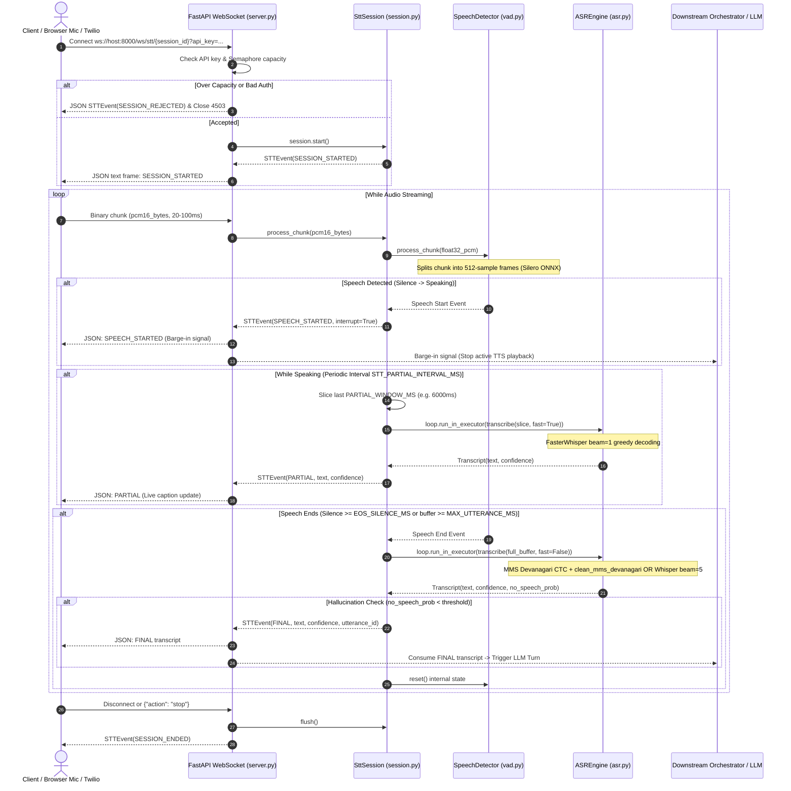
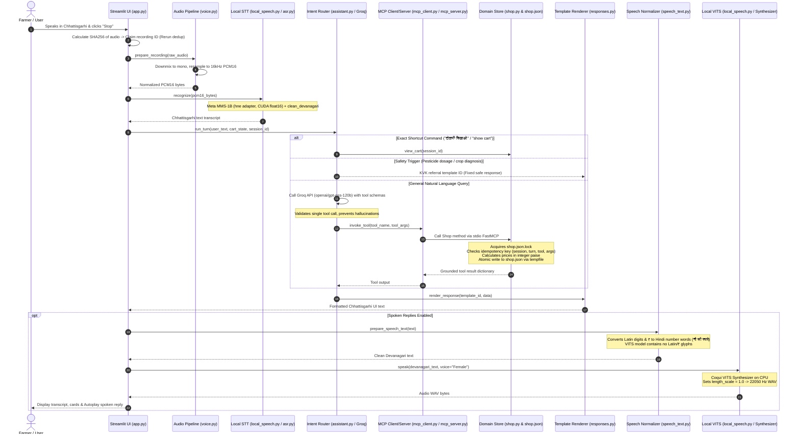
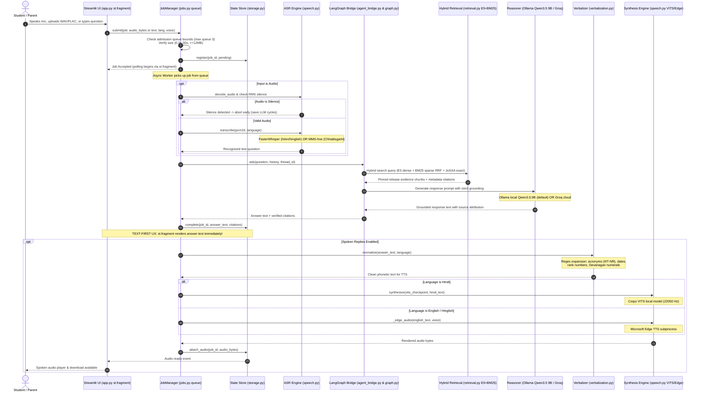
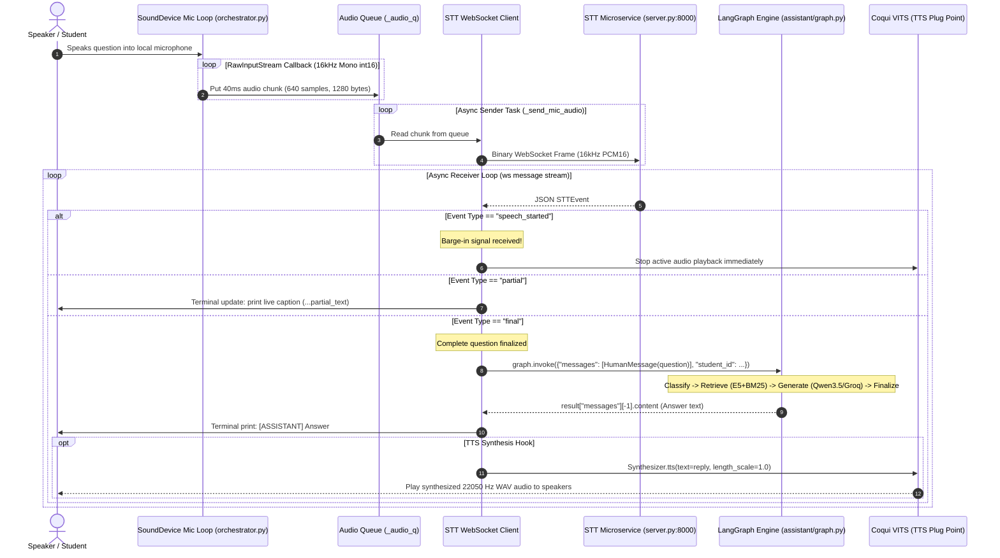

# Request-to-Response Master Architecture & Flow Guide

This document is the central architectural roadmap tracing every byte of data from audio input to spoken output across all 4 execution flows in the repository.

---

## 1. The Four Operational Execution Flows

The repository implements four distinct request-to-response topologies:

| Flow # | System Component | Primary Goal | Latency Profile | Audio In / Out |
|---|---|---|---|---|
| **Flow 1** | [STT Microservice](file:///run/media/rtx/Files/Study/Semester%205/Minor/code/STT/stt-service) | Streaming real-time ASR with VAD endpointing & barge-in | ~100–300 ms per chunk | 16 kHz PCM16 in $\to$ JSON `STTEvent` out |
| **Flow 2** | [Demo 1: Kisan Saathi](file:///run/media/rtx/Files/Study/Semester%205/Minor/code/demo) | Turn-based agricultural voice shopping with MCP & JSON state | 5–15 s end-to-end | Mic PCM16 in $\to$ 22.05 kHz VITS WAV out |
| **Flow 3** | [Demo 2: Institute Helpdesk](file:///run/media/rtx/Files/Study/Semester%205/Minor/code/demo2) | Asynchronous academic RAG with bounded workers & citations | 20–50 s (local 9B LLM) | Mic/WAV/FLAC in $\to$ VITS / Edge audio out |
| **Flow 4** | [Voice Orchestrator](file:///run/media/rtx/Files/Study/Semester%205/Minor/code/Institute-voice-agent/voice-orchestrator) | PyAudio live microphone streaming client to LangGraph | Streaming pipeline | Mic stream $\to$ Terminal text / TTS hook |

---

## 2. Hard Audio Contract Matrix

All components must strictly adhere to the following audio specifications. Mismatched sample rates, endianness, or headers cause silent failures or acoustic distortions.

| Parameter | Input Contract (STT / ASR) | Output Contract (TTS / VITS) | Telephony Path (Twilio) |
|---|---|---|---|
| **Sampling Rate** | **16,000 Hz** (16 kHz) | **22,050 Hz** (22.05 kHz) | 8,000 Hz $\to$ upsampled to 16,000 Hz |
| **Channels** | Mono (1 channel) | Mono (1 channel) | Mono (1 channel) |
| **Bit Depth** | 16-bit Signed Integer (Little-Endian) | 32-bit Float or 16-bit PCM WAV | 8-bit G.711 $\mu$-law |
| **Header Format** | **Raw PCM (No WAV Header)** | Standard RIFF/WAV Header | Base64-encoded raw payload |
| **Frame Size** | 20 ms to 100 ms (typically 40 ms = 640 samples = 1,280 bytes) | Variable sentence waveform | 20 ms (160 bytes $\mu$-law) |
| **VAD Buffer** | Exactly **512 samples** per Silero ONNX frame | N/A | Resampled to 16 kHz $\implies$ 512 samples |

---

## 3. Flow 1: Streaming Real-Time STT Microservice

The standalone FastAPI microservice accepts streaming binary PCM audio over WebSockets and emits structured JSON events.

### Sequence Diagram

### Step-by-Step Data Transformation:
1. **Connection & Admission**: Client connects to [`server.py`](file:///run/media/rtx/Files/Study/Semester%205/Minor/code/STT/stt-service/src/server.py). The server validates `?api_key=...`. An `asyncio.Semaphore(MAX_CONCURRENT_SESSIONS)` gate protects server memory. If at capacity, an immediate `SESSION_REJECTED` event is returned and the connection closes with HTTP 4503.
2. **Audio Ingestion**: Client streams raw 16 kHz PCM bytes over WebSocket binary frames. An idle timeout (`asyncio.wait_for(..., timeout=IDLE_TIMEOUT_S)`) guards against orphaned connections.
3. **VAD Windowing**: [`vad.py`](file:///run/media/rtx/Files/Study/Semester%205/Minor/code/STT/stt-service/src/vad.py) wraps Silero VAD (ONNX runtime). Because Silero requires exactly 512 samples per frame, an internal `_residual` buffer holds excess samples across chunk boundaries.
4. **Barge-in Signaling**: When speech transition is detected (`SILENCE` $\to$ `SPEAKING`), an `STTEvent(SPEECH_STARTED)` is emitted with `interrupt_previous_response=True`. Downstream consumers use this signal to kill running audio playback immediately.
5. **Windowed Partials**: While speaking, every `STT_PARTIAL_INTERVAL_MS` (700 ms), the session slices only the trailing `STT_PARTIAL_WINDOW_MS` (6000 ms) of speech. This bounded window prevents CPU inference latency from increasing linearly with sentence duration.
6. **Final Endpointing**: When silence exceeds `STT_EOS_SILENCE_MS` (600 ms) or audio hits `STT_MAX_UTTERANCE_MS` (20,000 ms), the entire utterance is passed to [`asr.py`](file:///run/media/rtx/Files/Study/Semester%205/Minor/code/STT/stt-service/src/asr.py) with `fast=False` (beam size 5 or CTC decoding).
7. **Post-Processing**: For Meta MMS-1B (`hne`), `clean_mms_devanagari()` strips extraneous whitespaces before Devanagari dependent vowel signs (matras). Hallucination checks drop transcripts with high `no_speech_prob`.

---

## 4. Flow 2: Turn-Based Voice Shopping Assistant (Demo 1)

This flow implements a voice-driven e-commerce transaction loop over isolated MCP tools and atomic JSON storage.

### Sequence Diagram

### Step-by-Step Data Transformation:
1. **Audio Capture & Rerun De-duplication**: The user speaks via the Streamlit browser microphone component. When "Stop" is clicked, [`app.py`](file:///run/media/rtx/Files/Study/Semester%205/Minor/code/demo/app.py) hashes the audio bytes with SHA-256. A record claim token ensures that Streamlit state reruns do not re-execute financial transactions.
2. **Audio Normalization**: [`voice.py`](file:///run/media/rtx/Files/Study/Semester%205/Minor/code/demo/voice.py) decodes arbitrary container audio (WebM, WAV, OGG) using PyAV/soundfile, downmixes stereo channels to mono, and resamples to 16 kHz 16-bit PCM.
3. **Acoustic Recognition**: [`local_speech.py`](file:///run/media/rtx/Files/Study/Semester%205/Minor/code/demo/local_speech.py) calls `get_engine().transcribe(pcm16, fast=False)`. It runs Meta MMS-1B with the Chhattisgarhi `hne` adapter loaded in CUDA `float16`.
4. **Intent & Safety Routing**:
   - *Deterministic Shortcuts*: Phrases matching `टोकरी दिखाओ` or `show cart` bypass the LLM and query the cart state directly.
   - *Safety Boundary*: If the user asks for chemical pesticide dosages or plant disease diagnostics, [`assistant.py`](file:///run/media/rtx/Files/Study/Semester%205/Minor/code/demo/assistant.py) intercepts the query and returns a fixed Krishi Vigyan Kendra (KVK) referral template without invoking an external LLM.
   - *Tool Routing*: For commercial queries, Groq (`openai/gpt-oss-120b`) selects a validated shopping tool schema.
5. **MCP Tool Execution & Atomic Persistence**: [`mcp_client.py`](file:///run/media/rtx/Files/Study/Semester%205/Minor/code/demo/mcp_client.py) communicates with [`mcp_server.py`](file:///run/media/rtx/Files/Study/Semester%205/Minor/code/demo/mcp_server.py) across a separate stdio subprocess. [`shop.py`](file:///run/media/rtx/Files/Study/Semester%205/Minor/code/demo/shop.py) executes the business logic:
   - File locking: `shop.json.lock` acquired using `filelock`.
   - Accounting: All prices and cart totals are calculated strictly in integer paise (1 Rupee = 100 paise).
   - Atomic Write: New state is written to a temporary file, flushed to disk via `fsync()`, and renamed atomically onto `shop.json`.
6. **Template Verbalization**: [`responses.py`](file:///run/media/rtx/Files/Study/Semester%205/Minor/code/demo/responses.py) merges the grounded database record into pre-approved Chhattisgarhi response strings. The LLM never hallucinates raw prices.
7. **Phonetic Pre-processing**: [`speech_text.py`](file:///run/media/rtx/Files/Study/Semester%205/Minor/code/demo/speech_text.py) converts all numbers, quantities, and currency symbols (`₹900` $\to$ `नौ सौ रुपये`) into phonetic Devanagari words because the VITS tokenizer contains no Latin or currency symbols.
8. **Neural Synthesis**: Coqui VITS synthesizer runs on CPU using `Female/best_model.pth`, adjusts `length_scale = 1.0`, and outputs a 22,050 Hz WAV buffer that streams back to the browser.

---

## 5. Flow 3: Asynchronous Academic Voice Helpdesk (Demo 2)

This architecture uses bounded worker queues, hybrid semantic search, and dual-mode TTS to deliver grounded academic helpdesk answers.

### Sequence Diagram

### Step-by-Step Data Transformation:
1. **Bounded Job Admission**: In [`jobs.py`](file:///run/media/rtx/Files/Study/Semester%205/Minor/code/demo2/jobs.py), `JobManager` enforces a concurrency limit: at most 1 active inference worker and 1 active speech worker, with a FIFO queue depth capped at 3. Excess requests receive immediate 429 backpressure.
2. **Audio Decoding & RMS Silence Gate**: In [`speech.py`](file:///run/media/rtx/Files/Study/Semester%205/Minor/code/demo2/speech.py), `decode_audio()` extracts PCM samples. An RMS energy calculation verifies that the recording contains audible speech. If the frame is pure silence, the job aborts immediately without loading the LLM.
3. **Multilingual ASR Routing**:
   - `Hindi`, `English`, and `Hinglish` route to `FasterWhisper` (`small` or `base`).
   - `Chhattisgarhi` routes to Meta MMS-1B (`hne` adapter).
4. **Hybrid Retrieval**: [`retrieval.py`](file:///run/media/rtx/Files/Study/Semester%205/Minor/code/Institute-voice-agent/institute-assistant/assistant/retrieval.py) conducts Reciprocal Rank Fusion (RRF):
   - Dense retrieval: `intfloat/multilingual-e5-base` (350 token chunks with 50 token overlap).
   - Sparse retrieval: `rank_bm25` index over verified markdown knowledge docs.
   - Tabular cutoff matcher: Direct relational query on JoSAA opening/closing rank tables.
5. **Local Reasoning Engine**: Query + retrieved evidence are passed to local Ollama running `Qwen3.5 9B` (or Groq cloud fallback). The prompt instructs the LLM to output structured source citations.
6. **Decoupled Text-First Completion**: The moment the LLM emits the answer, [`storage.py`](file:///run/media/rtx/Files/Study/Semester%205/Minor/code/demo2/storage.py) saves the text record. The Streamlit UI updates via `@st.fragment`, allowing the user to read the answer while audio synthesis proceeds in the background.
7. **Verbalization v2**: [`verbalization.py`](file:///run/media/rtx/Files/Study/Semester%205/Minor/code/demo2/verbalization.py) applies regex normalization rules:
   - Acronym expansion: `IIIT-NR` $\to$ `आई.आई.आई.टी. नया रायपुर`.
   - Ordinal/Date conversion: `15th August 2026` $\to$ `पंद्रह अगस्त दो हज़ार छब्बीस`.
   - Rank numbers: `15432` $\to$ `पंद्रह हज़ार चार सौ बत्तीस`.
8. **Dual-Path Speech Synthesis**:
   - *Hindi Path*: Local Coqui VITS model synthesizes audio on CPU at 22,050 Hz.
   - *English/Hinglish Path*: Streams audio using Microsoft Edge TTS (`edge-tts` subprocess) to support Indian English phonetics.

---

## 6. Flow 4: PyAudio Real-Time Voice Orchestrator

The terminal-based orchestrator connects local microphone capture to the remote STT microservice and pipes final transcripts to LangGraph.

### Sequence Diagram

### Step-by-Step Data Transformation:
1. **Audio Callback**: [`sounddevice.RawInputStream`](file:///run/media/rtx/Files/Study/Semester%205/Minor/code/Institute-voice-agent/voice-orchestrator/orchestrator.py#L71) captures microphone audio at 16 kHz 16-bit integer PCM. Every 40 ms (640 samples = 1,280 bytes), `_mic_callback` puts the chunk into a thread-safe `_audio_q`.
2. **WebSocket Pipeline**: The coroutine `_send_mic_audio()` extracts chunks from `_audio_q` via `loop.run_in_executor()` and sends them as binary frames over a persistent WebSocket connection to `ws://localhost:8000/ws/stt/{student_id}`.
3. **Reactive Handling**:
   - `partial`: Console updates `\r...<text>` for zero-latency user feedback.
   - `speech_started`: Triggers barge-in handler to stop any audio speaker playback.
   - `final`: Extracts user text and invokes the LangGraph state machine.
4. **LangGraph Pipeline**: `graph.invoke()` executes the node sequence: classification $\to$ retrieval $\to$ generation $\to$ evaluation.
5. **TTS Synthesis Hook**: The final message string is dispatched to the Coqui VITS synthesizer hook for speaker playback.

---

## 7. Comparative Summary of Architectural Tradeoffs

| Architecture Dimension | Flow 1 (STT Microservice) | Flow 2 (Demo 1 Shopping) | Flow 3 (Demo 2 Helpdesk) | Flow 4 (Voice Orchestrator) |
|---|---|---|---|---|
| **Interaction Model** | Full-duplex Streaming | Half-duplex Turn-based | Half-duplex Asynchronous | Full-duplex Streaming |
| **Barge-in Support** | ✅ Built-in VAD event | ❌ Turn completed first | ❌ Cancel via UI button | ✅ Built-in via STT event |
| **Primary Reasoner** | None (Speech only) | Cloud Groq 120B | Local Ollama Qwen3.5 9B | Local / Cloud LangGraph |
| **State Storage** | In-memory session | JSON with filelock | SQLite with 24h retention | SQLite memory checkpointer |
| **Safety Boundary** | Silero VAD energy | Hard KVK template | Grounded RAG citations | LangGraph verification node |
| **TTS Engine** | None | Coqui VITS Chhattisgarhi | Coqui VITS + Edge TTS | Coqui VITS hook |

---

## Next: `03-stt-service-deepdive.md` $\to$ Code-level walkthrough of the STT microservice
