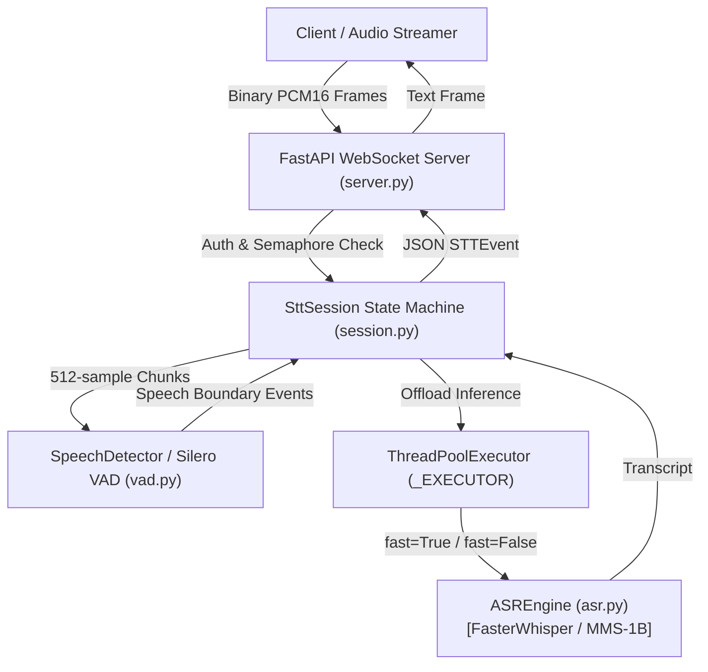

# STT Service Deep-Dive: Streaming Speech-to-Text Microservice

**Location:** [`code/STT/stt-service/`](file:///run/media/rtx/Files/Study/Semester%205/Minor/code/STT/stt-service)  
**Primary Tech Stack:** FastAPI, WebSockets, Silero VAD (ONNX), faster-whisper (CTranslate2), Meta MMS-1B (`transformers`), ThreadPoolExecutor, Python 3.11.

---

## 1. Module Overview & Role in the System

The STT service is a standalone, real-time, bidirectional WebSocket microservice. It is responsible for:
1. Ingesting raw 16 kHz 16-bit mono PCM streaming audio chunks over WebSocket binary frames.
2. Performing voice activity detection (VAD) and speech boundary tracking on 512-sample frames.
3. Emitting immediate **barge-in signals** (`speech_started`) when a speaker interrupts playback.
4. Generating low-latency **partial transcripts** at bounded intervals for UI captions.
5. Emitting high-accuracy **final transcripts** upon speaker silence or maximum utterance timeouts.
6. Abstracting the underlying acoustic model (switching seamlessly between FasterWhisper and Meta MMS-1B).



---

## 2. File-by-File Technical Deep Dive

### 2.1 `src/config.py` — Central Tunables & Environment Invariants

[`config.py`](file:///run/media/rtx/Files/Study/Semester%205/Minor/code/STT/stt-service/src/config.py) defines the `Settings` immutable dataclass (`@dataclass(frozen=True)`). No numeric constant or model path is hardcoded anywhere else in the microservice.

| Field Name | Type | Default | Environment Variable | Architectural Rationale |
|---|---|---|---|---|
| `SAMPLE_RATE` | `int` | `16000` | `STT_SAMPLE_RATE` | Fixed audio contract (16 kHz). Matches Silero VAD and MMS acoustic models. |
| `FRAME_MS` | `int` | `32` | N/A | 512 samples @ 16 kHz = 32 ms. Exact required frame size for Silero ONNX. |
| `ASR_MODEL_SIZE` | `str` | `"small.en"` | `STT_MODEL_SIZE` | Default Whisper model size for non-Chhattisgarhi queries. |
| `ASR_DEVICE` | `str` | `"cpu"` | `STT_DEVICE` | `"cpu"` or `"cuda"`. Defaults to CPU to avoid competing with GPU VRAM. |
| `ASR_COMPUTE_TYPE`| `str` | `"int8"` | `STT_COMPUTE_TYPE` | 8-bit quantization on CPU; `float16` when running on CUDA. |
| `MMS_DTYPE` | `str` | `"float32"`| `STT_MMS_DTYPE` | MMS model weight precision. Set to `float16` on CUDA to prevent OOM. |
| `ASR_BEAM_SIZE` | `int` | `1` | `STT_BEAM_SIZE` | Greedy decoding (`beam_size=1`) for partials to maximize speed. |
| `ASR_FINAL_BEAM_SIZE`| `int`| `5` | `STT_FINAL_BEAM_SIZE` | Beam search (`beam_size=5`) for finalized utterances to optimize accuracy. |
| `ASR_LANGUAGE` | `str` | `"en"` | `STT_LANGUAGE` | `"hne"` triggers `ChhattisgarhiMMSEngine`; any other string routes to Whisper. |
| `VAD_THRESHOLD` | `float`| `0.5` | `STT_VAD_THRESHOLD` | Speech probability cutoff in Silero VAD. |
| `END_OF_SPEECH_SILENCE_MS`| `int`| `600` | `STT_EOS_SILENCE_MS` | Continuous silence duration that finalizes an utterance. |
| `MAX_UTTERANCE_MS`| `int` | `20000` | `STT_MAX_UTTERANCE_MS` | Hard safety cap (20 s). Prevents unbounded buffer accumulation during continuous background noise. |
| `PARTIAL_INTERVAL_MS`| `int`| `700` | `STT_PARTIAL_INTERVAL_MS`| How often intermediate partial transcripts are dispatched to the client. |
| `PARTIAL_WINDOW_MS` | `int` | `6000` | `STT_PARTIAL_WINDOW_MS` | **Sliding window:** Only transcribes the trailing 6 seconds for partials, preventing $O(N)$ latency growth. |
| `NO_SPEECH_PROB_THRESHOLD`| `float`| `0.6` | `STT_NO_SPEECH_PROB_THRESHOLD`| Hallucination filter: drops Whisper transcripts on near-silent audio. |
| `ASR_WORKER_THREADS`| `int`| `4` | `STT_ASR_WORKER_THREADS`| Thread pool worker capacity for CPU/GPU-bound model inference. |
| `MAX_CONCURRENT_SESSIONS`| `int`| `8` | `STT_MAX_CONCURRENT_SESSIONS`| Hard ceiling on active WebSocket callers per process. |
| `IDLE_TIMEOUT_S` | `int` | `30` | `STT_IDLE_TIMEOUT_S` | Disconnects callers that maintain open sockets without streaming audio. |

---

### 2.2 `src/schemas.py` — The WebSocket Integration Contract

[`schemas.py`](file:///run/media/rtx/Files/Study/Semester%205/Minor/code/STT/stt-service/src/schemas.py) defines the schema that downstream consumers (LLM agents, Web clients, telephony orchestrators) depend on.

```python
class EventType(str, Enum):
    SESSION_STARTED = "session_started"
    SPEECH_STARTED = "speech_started"     # Barge-in interrupt trigger
    PARTIAL = "partial"                    # Live UI caption (unstable)
    FINAL = "final"                        # Grounded utterance for LLM consumption
    ERROR = "error"
    SESSION_ENDED = "session_ended"
    SESSION_REJECTED = "session_rejected"  # Over capacity or unauthenticated
```

#### Fields of `STTEvent`:
- `type: EventType`: Event identifier.
- `session_id: str`: Unique session identifier.
- `text: str`: Decoded transcript text (empty on `speech_started`).
- `start_ms: Optional[int]`: Utterance start timestamp relative to connection start.
- `end_ms: Optional[int]`: Utterance end timestamp.
- `confidence: Optional[float]`: Normalized proxy $[0.0, 1.0]$ derived from log probability.
- `utterance_id: Optional[int]`: Monotonically increasing counter per finalized utterance for downstream deduplication.
- `interrupt_previous_response: bool`: Flagged `True` on `speech_started`. Explicit signal telling downstream audio player to stop active TTS playback.

---

### 2.3 `src/vad.py` — Voice Activity Detection via Silero ONNX

[`vad.py`](file:///run/media/rtx/Files/Study/Semester%205/Minor/code/STT/stt-service/src/vad.py) wraps Silero VAD. Silero is packaged with self-contained ONNX weights inside the pip package, requiring zero runtime internet access.

#### Core Mechanics:
1. **Model Singleton**: `_shared_model()` loads the ONNX runtime model once per process. It is stateless across inference calls.
2. **Per-Session State**: `SpeechDetector` creates a dedicated `VADIterator` for each connection to preserve temporal recurrent states.
3. **The 512-Sample Frame Invariant**: Silero strictly mandates 512 samples per evaluation at 16 kHz. Because clients stream chunks of arbitrary size (e.g. 640 samples for 40 ms), `SpeechDetector.process()` buffers excess samples in `self._residual`:
   $$\text{Total Buffer} = \mathbf{concat}(\text{residual}, \text{new\_samples})$$
   $$n\_frames = \lfloor \text{len}(\text{Buffer}) / 512 \rfloor$$
   $$\text{residual}_{\text{new}} = \text{Buffer}[n\_frames \times 512 :]$$
4. **State Reset**: `reset()` clears the recurrent memory of `VADIterator` and empties `_residual` after each finalized utterance.

---

### 2.4 `src/asr.py` — Acoustic Model Abstraction Layer

[`asr.py`](file:///run/media/rtx/Files/Study/Semester%205/Minor/code/STT/stt-service/src/asr.py) defines the abstract interface [`ASREngine`](file:///run/media/rtx/Files/Study/Semester%205/Minor/code/STT/stt-service/src/asr.py#L31):

```python
class ASREngine(ABC):
    @abstractmethod
    def transcribe(self, audio: np.ndarray, *, fast: bool) -> Transcript:
        pass
```

#### Implementations:

1. **`FasterWhisperEngine`**:
   - Uses CTranslate2-accelerated Whisper models.
   - Sets `beam_size = 1` when `fast=True` (for partials) and `beam_size = 5` when `fast=False` (for finals).
   - Injects `initial_prompt` to bias decoding towards domain vocabulary (e.g. clinic or agricultural terms).
   - Computes `no_speech_prob` to filter out hallucinated echoes on low-energy background noise.

2. **`ChhattisgarhiMMSEngine`**:
   - Meta MMS (`facebook/mms-1b-all`) with language adapter `hne`.
   - 1 billion parameter Wav2Vec2 backbone with CTC output head.
   - **VRAM Optimization**: Pre-loads weights in reduced precision (`float16`) before moving tensors to CUDA:
     ```python
     self._model = Wav2Vec2ForCTC.from_pretrained(model_id, torch_dtype=self._dtype)
     self._model.load_adapter("hne")
     self._model.to(self._device).eval()
     ```
   - **Devanagari CTC Matra Repair (`clean_mms_devanagari`)**: MMS CTC tokenization frequently emits space characters between consonants and dependent vowel signs (matras). Unchecked, this renders invalid characters with dotted circles (e.g., `क ो` $\to$ `क◌ो`). The regex re-attaches them:
     ```python
     text = re.sub(r'\s+([\u093e-\u094c\u0901-\u0903\u094d])', r'\1', text)
     ```

3. **Singleton Factory (`get_engine`)**: Loads a single shared engine instance per process based on `settings.ASR_LANGUAGE`.

---

### 2.5 `src/session.py` — State Machine & Concurrency Control

[`session.py`](file:///run/media/rtx/Files/Study/Semester%205/Minor/code/STT/stt-service/src/session.py) manages the per-caller lifecycle.

```
       ┌───────────┐
       │  SILENCE  │◄───────────────────────────┐
       └─────┬─────┘                            │
             │ VAD detects speech               │ Silence >= EOS_SILENCE_MS
             ▼                                  │ OR buffer >= MAX_UTTERANCE_MS
       ┌───────────┐                            │ (emits FINAL event)
  ┌───►│ SPEAKING  │────────────────────────────┘
  │    └─────┬─────┘
  │          │ Periodic interval (PARTIAL_INTERVAL_MS)
  └──────────┘ (slices last PARTIAL_WINDOW_MS -> emits PARTIAL event)
```

#### Key Implementation Details:
- **Async ThreadPool Offloading**: ASR model inference is CPU/GPU-bound and synchronous. Executing `transcribe()` directly inside an `async` handler would block FastAPI's event loop, starving all concurrent callers. `session.py` delegates every call to a shared `ThreadPoolExecutor` via:
  ```python
  transcript = await loop.run_in_executor(_EXECUTOR, get_engine().transcribe, audio, fast)
  ```
- **Windowed Partials**: When an utterance reaches 15 seconds, transcribing the entire 15 s for every partial causes linear latency degradation ($O(T)$). `session.py` slices only `settings.PARTIAL_WINDOW_MS` (6 seconds) for partial decoding, guaranteeing constant inference time ($O(1)$) regardless of sentence length. Finals always decode the full audio buffer.

---

### 2.6 `src/server.py` — WebSocket Ingress & Lifecycle Protection

[`server.py`](file:///run/media/rtx/Files/Study/Semester%205/Minor/code/STT/stt-service/src/server.py) provides the FastAPI entry point.

- **Lifespan Warm-up**: The `lifespan` context manager initializes `get_engine()` before opening the network port. This prevents the first connecting caller from experiencing cold-start latency.
- **Pre-Accept Auth Checking**: If `STT_API_KEY` is configured, connections lacking `?api_key=...` are rejected before `accept()` with WebSocket close code 4401.
- **Bounded Concurrency Semaphore**: `_capacity = asyncio.Semaphore(MAX_CONCURRENT_SESSIONS)`. When capacity is reached, new callers receive an immediate `SESSION_REJECTED` JSON event and close code 4503, preventing hardware thrashing.
- **Idle Timeout**: Every `websocket.receive()` call is wrapped in `asyncio.wait_for(..., timeout=IDLE_TIMEOUT_S)`. Connections that stay silent or drop packets are cleaned up automatically.
- **Disconnect Auto-Flush**: The `finally` block of `stt_websocket()` calls `session.flush()`, guaranteeing that if a caller hangs up mid-sentence, the final utterance is still transcribed and sent downstream.
- **Health Endpoint**: `GET /health` exposes `at_capacity: bool` for external load balancers.

---

### 2.7 `src/telephony_adapter.py` — Twilio Media Streams Bridge

[`telephony_adapter.py`](file:///run/media/rtx/Files/Study/Semester%205/Minor/code/STT/stt-service/src/telephony_adapter.py) enables PSTN phone connectivity without changing the core STT pipeline.

- **Network Reality**: Real telephone networks deliver 8,000 Hz, 8-bit $\mu$-law (G.711) audio payloads wrapped in base64 JSON frames over WebSockets.
- **Transcoding Logic (`mulaw_8k_to_pcm16_16k`)**:
  1. `audioop.ulaw2lin(mulaw_bytes, 2)`: Expands 8-bit $\mu$-law samples to 16-bit linear PCM at 8 kHz.
  2. `audioop.ratecv(pcm16_8k, 2, 1, 8000, 16000, None)`: Polyphase filter upsamples 8 kHz audio to 16 kHz.
- **Python 3.13 Portability**: Includes conditional fallback to `audioop_lts` because `audioop` was removed from the standard library in Python 3.13.

---

## 3. Architecture Decisions & Rationale (Viva Defense)

| Design Decision | Alternative Considered | Technical Rationale for Choice |
|---|---|---|
| **Cascaded STT Microservice** | End-to-end multimodal model (e.g. Speech-LLM) | 1) Modular benchmarking: allows measuring WER independently of LLM reasoning errors.<br/>2) Resource bounds: 1B speech model + 9B LLM can run concurrently on an 8 GB consumer GPU.<br/>3) Deterministic safety: intermediate text allows hard regex/schema filtering before database actions. |
| **Silero VAD (ONNX)** | WebRTC VAD / Energy RMS | Silero utilizes a deep neural network trained on 6,000+ languages. Unlike energy thresholds, it rejects ambient farm noises, coughs, and fan hum while maintaining low CPU overhead. |
| **Meta MMS-1B for Chhattisgarhi** | OpenAI Whisper / IndicWhisper | Standard Whisper models do not include Chhattisgarhi (`hne`) in their training vocabulary. Meta MMS-1B provides a specialized 1024-dimension adapter specifically fine-tuned on Chhattisgarhi speech. |
| **Greedy vs. Beam Search Split** | Uniform Beam Size 5 | Beam search on MMS-1B takes ~1.2 s per evaluation. Slicing partials to greedy decoding (`beam_size=1`) cuts latency to ~250 ms, providing instant feedback without degrading the final transcript. |
| **ThreadPoolExecutor in FastAPI** | Native asyncio coroutines | Python C-extensions (PyTorch, CTranslate2) release the GIL during matrix math, but synchronous C-calls still block the asyncio event loop thread unless offloaded to OS worker threads. |

---

## Next: `04-tts-models-deepdive.md` $\to$ Neural speech synthesis with Coqui VITS
