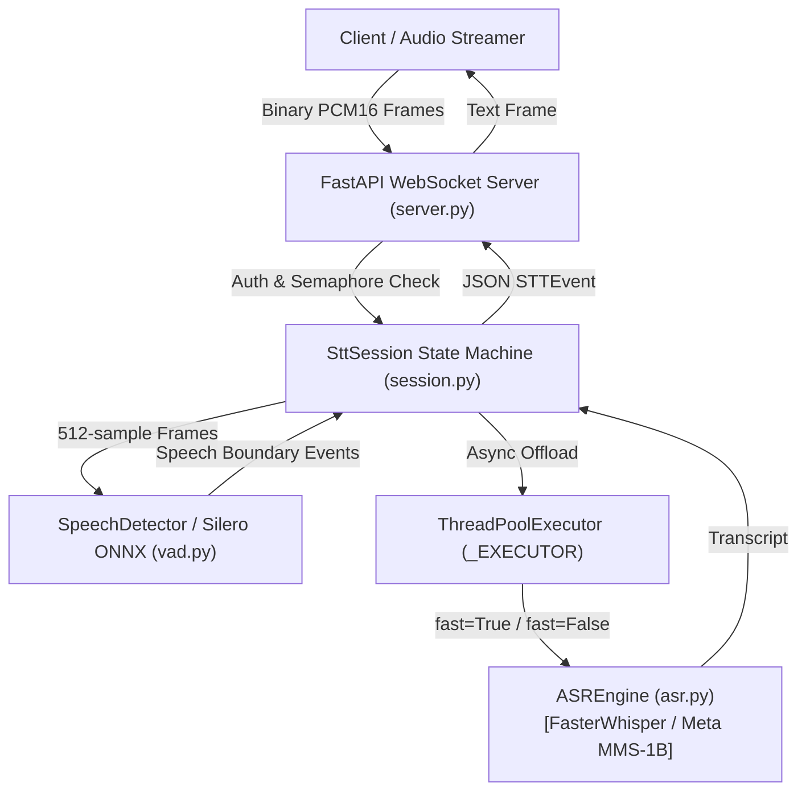

# STT Service Deep-Dive: Streaming Speech-to-Text Microservice

**Location:** [`code/STT/stt-service/`](file:///run/media/rtx/Files/Study/Semester%205/Minor/code/STT/stt-service)  
**Primary Tech Stack:** FastAPI, WebSockets, Silero VAD (ONNX Runtime), Faster-Whisper (CTranslate2), Meta MMS-1B (`transformers`), ThreadPoolExecutor, Python 3.11  
**Target Audio Ingress:** 16,000 Hz 16-bit Mono Little-Endian PCM  
**Location:** `idea/presentation/working/03-stt-service-deepdive.md`

---

## 1. Module Overview & Operational Thesis

The STT service is an asynchronous, standalone, bidirectional WebSocket microservice. It is responsible for:
1. Ingesting raw 16 kHz 16-bit mono PCM streaming audio chunks over WebSocket binary frames.
2. Performing real-time Voice Activity Detection (VAD) on exact 512-sample frames ($32\text{ ms}$).
3. Emitting immediate **barge-in interruption events** (`speech_started`) when a user begins speaking during assistant audio playback.
4. Generating low-latency **partial transcripts** at bounded intervals ($700\text{ ms}$) over a sliding window for live UI captioning.
5. Emitting high-accuracy **final transcripts** upon speaker silence or maximum utterance timeouts.
6. Abstracting the acoustic backend: switching dynamically between Faster-Whisper (`small` int8 on CPU) and Meta MMS-1B (Wav2Vec2 with `hne` Chhattisgarhi adapter on CUDA `float16`).



---

## 2. File-by-File Technical Deep Dive

### 2.1 `src/config.py` — Central Tunables & Environment Invariants

[`config.py`](file:///run/media/rtx/Files/Study/Semester%205/Minor/code/STT/stt-service/src/config.py) defines the `Settings` immutable frozen dataclass (`@dataclass(frozen=True)`). No numeric constant or model identifier is hardcoded:

| Parameter Name | Type | Default Value | Environment Variable | Architectural Rationale |
|---|---|---|---|---|
| `SAMPLE_RATE` | `int` | `16000` | `STT_SAMPLE_RATE` | Standard acoustic contract (16 kHz). Matches Silero VAD and MMS acoustic models. |
| `FRAME_MS` | `int` | `32` | N/A | 512 samples @ 16 kHz = 32 ms. Exact required frame size for Silero ONNX. |
| `ASR_MODEL_SIZE` | `str` | `"small"` | `STT_MODEL_SIZE` | Default Whisper model size for Hindi/English/Hinglish queries. |
| `ASR_DEVICE` | `str` | `"cpu"` | `STT_DEVICE` | Defaults to `"cpu"` to reserve GPU VRAM exclusively for LLM reasoning. |
| `ASR_COMPUTE_TYPE`| `str` | `"int8"` | `STT_COMPUTE_TYPE` | 8-bit integer quantization on CPU; `float16` when running on CUDA. |
| `MMS_DTYPE` | `str` | `"float16"`| `STT_MMS_DTYPE` | Pre-casts weights to `torch.float16` prior to GPU allocation ($2.2\text{ GB}$ VRAM). |
| `ASR_BEAM_SIZE` | `int` | `1` | `STT_BEAM_SIZE` | Greedy decoding (`beam_size=1`) for partial transcripts to maximize speed. |
| `ASR_FINAL_BEAM_SIZE`| `int`| `5` | `STT_FINAL_BEAM_SIZE` | Beam search (`beam_size=5`) for finalized utterances to optimize accuracy. |
| `ASR_LANGUAGE` | `str` | `"hne"` | `STT_LANGUAGE` | `"hne"` triggers `ChhattisgarhiMMSEngine`; any other string routes to Whisper. |
| `VAD_THRESHOLD` | `float`| `0.5` | `STT_VAD_THRESHOLD` | Speech probability cutoff in Silero ONNX. |
| `END_OF_SPEECH_SILENCE_MS`| `int`| `600` | `STT_EOS_SILENCE_MS` | Continuous silence duration that finalizes an utterance. |
| `MAX_UTTERANCE_MS`| `int` | `20000` | `STT_MAX_UTTERANCE_MS` | Hard safety cap (20 s). Prevents unbounded buffer accumulation during background noise. |
| `PARTIAL_INTERVAL_MS`| `int`| `700` | `STT_PARTIAL_INTERVAL_MS`| Cadence for intermediate partial transcript dispatches to the client. |
| `PARTIAL_WINDOW_MS` | `int` | `6000` | `STT_PARTIAL_WINDOW_MS` | **Sliding Window:** Only transcribes the trailing 6 seconds for partials, preventing $O(N)$ latency growth. |
| `NO_SPEECH_PROB_THRESHOLD`| `float`| `0.6` | `STT_NO_SPEECH_PROB_THRESHOLD`| Hallucination filter: drops Whisper transcripts on near-silent audio. |
| `ASR_WORKER_THREADS`| `int`| `4` | `STT_ASR_WORKER_THREADS`| Thread pool worker capacity for CPU/GPU-bound model inference. |
| `MAX_CONCURRENT_SESSIONS`| `int`| `8` | `STT_MAX_CONCURRENT_SESSIONS`| Hard ceiling on active WebSocket callers per process. |
| `IDLE_TIMEOUT_S` | `int` | `30` | `STT_IDLE_TIMEOUT_S` | Disconnects callers that maintain open sockets without streaming audio. |

---

### 2.2 `src/vad.py` — Silero VAD & 512-Sample Frame Invariance Algorithm

Silero VAD's ONNX runtime graph requires static input dimensions of `[1, 512]` at 16 kHz. Network audio packets arrive with arbitrary chunk lengths $M \ne 512$ (e.g. $40\text{ ms} = 640\text{ samples}$). Passing unaligned chunks causes fatal shape mismatch exceptions.

[`SpeechDetector`](file:///run/media/rtx/Files/Study/Semester%205/Minor/code/STT/stt-service/src/vad.py) implements mathematical frame invariance via an internal **residual FIFO buffer**:

```
      Incoming Binary Audio Chunk (e.g., 640 samples)
  ┌─────────────────────────────────────────────────────────┐
  │                 Incoming Audio Chunk                    │
  └────────────────────────────┬────────────────────────────┘
                               ▼
  ┌─────────────────────────────────────────────────────────┐
  │  Residual Concatenation: concat(residual_prev, incoming)│
  └─────────────┬─────────────────────────────┬─────────────┘
                │                             │
                ▼                             ▼
  ┌───────────────────────────┐ ┌───────────────────────────┐
  │  Frame 1: 512 Samples     │ │  Residual Leftover        │
  │  Pushed to Silero ONNX    │ │  (128 samples stored for  │
  │  p = P(speech | frame_1)  │ │   next incoming chunk)    │
  └───────────────────────────┘ └───────────────────────────┘
```

#### Mathematical Formulation:
1. At chunk arrival $k$, concatenate the previous residual $\mathbf{r}_{k-1}$ with new samples $\mathbf{x}_k \in \mathbb{R}^M$:
   $$\mathbf{B}_k = \mathbf{concat}(\mathbf{r}_{k-1}, \mathbf{x}_k)$$
2. Compute the integer number of full frames:
   $$n_{\text{eval}} = \left\lfloor \frac{|\mathbf{B}_k|}{512} \right\rfloor$$
3. Slice $n_{\text{eval}}$ contiguous frames $\mathbf{f}_j \in \mathbb{R}^{512}$ for $j \in \{0, \dots, n_{\text{eval}}-1\}$:
   $$\mathbf{f}_j = \mathbf{B}_k[512 \cdot j : 512 \cdot (j + 1)]$$
4. Preserve the un-evaluated residual tail:
   $$\mathbf{r}_k = \mathbf{B}_k[512 \cdot n_{\text{eval}} : ] \quad \text{where } 0 \le |\mathbf{r}_k| < 512$$
5. Utterance endpointing is triggered when continuous silence exceeds the threshold:
   $$\tau_{\text{silence}} \ge 600\text{ ms}$$

---

### 2.3 `src/asr.py` — Acoustic Model Abstraction Layer

[`asr.py`](file:///run/media/rtx/Files/Study/Semester%205/Minor/code/STT/stt-service/src/asr.py) defines the abstract interface [`ASREngine`](file:///run/media/rtx/Files/Study/Semester%205/Minor/code/STT/stt-service/src/asr.py#L31):

```python
class ASREngine(ABC):
    @abstractmethod
    def transcribe(self, audio: np.ndarray, *, fast: bool) -> Transcript:
        pass
```

#### 1. `FasterWhisperEngine`:
- Runs via CTranslate2 on CPU host RAM across 4 threads with `int8` quantization.
- When `fast=True` (partials), it sets `beam_size = 1` (greedy decoding).
- When `fast=False` (finals), it sets `beam_size = 5` (full beam search).
- Injects `initial_prompt` biasing decoding toward regional institutions (e.g. `IIIT Naya Raipur`, `JoSAA`, `CSAB`, `B.Tech`).
- Checks `no_speech_prob`: if $> 0.60$, the transcript is dropped as low-energy background noise.

#### 2. `ChhattisgarhiMMSEngine`:
- Uses Meta MMS (`facebook/mms-1b-all`) with language adapter `hne`.
- 1-billion parameter Wav2Vec2 backbone with Connectionist Temporal Classification (CTC) output head.
- Pre-casts weights to `float16` prior to GPU allocation, constraining VRAM use to $\approx 2.2\text{ GB}$.
- **Devanagari CTC Matra Repair (`clean_mms_devanagari`)**:
  CTC models frequently emit whitespace before dependent Devanagari vowel signs (matras), rendering invalid Unicode characters with dotted circles ($\text{क } + \text{ ो} \to \text{क◌ो}$). We enforce a regex repair pass:
  ```python
  def clean_mms_devanagari(text: str) -> str:
      text = re.sub(r'\s+([\u093e-\u094c\u0901-\u0903\u094d])', r'\1', text)
      return re.sub(r'\s+', ' ', text).strip()
  ```

---

### 2.4 `src/session.py` — State Machine & Async Concurrency Control

[`session.py`](file:///run/media/rtx/Files/Study/Semester%205/Minor/code/STT/stt-service/src/session.py) manages the per-caller lifecycle:

```
       ┌───────────┐
       │  SILENCE  │◄───────────────────────────┐
       └─────┬─────┘                            │
             │ VAD detects speech               │ Silence >= 600ms
             ▼                                  │ OR buffer >= 20,000ms
       ┌───────────┐                            │ (emits FINAL event)
  ┌───►│ SPEAKING  │────────────────────────────┘
  │    └─────┬─────┘
  │          │ Periodic interval (700ms)
  └──────────┘ (slices trailing 6000ms -> emits PARTIAL event)
```

#### Key Implementation Invariants:
1. **Async ThreadPool Offloading:** Model inference is CPU/GPU-bound and synchronous. Executing `transcribe()` directly inside an `async` coroutine would block FastAPI's event loop, starving all concurrent callers. `session.py` delegates every call to a shared `ThreadPoolExecutor` via:
   ```python
   transcript = await loop.run_in_executor(_EXECUTOR, get_engine().transcribe, audio, fast)
   ```
2. **Sliding Window for Partials:** When an utterance reaches 15 seconds, transcribing the full 15 s for every partial causes linear latency degradation ($O(T)$). `session.py` slices only `settings.PARTIAL_WINDOW_MS` (6 seconds) for partial decoding, guaranteeing constant inference time ($O(1) \approx 250\text{ ms}$) regardless of sentence length. Finals always decode the full buffer.

---

### 2.5 `src/server.py` — WebSocket Ingress & Lifecycle Protection

[`server.py`](file:///run/media/rtx/Files/Study/Semester%205/Minor/code/STT/stt-service/src/server.py) provides the FastAPI entry point:
- **Lifespan Warm-up:** The `lifespan` context manager initializes `get_engine()` before opening the network port, eliminating cold-start latency for the first caller.
- **Pre-Accept Auth Checking:** If `STT_API_KEY` is configured, connections lacking `?api_key=...` are rejected before `accept()` with WebSocket close code 4401.
- **Bounded Concurrency Semaphore:** `asyncio.Semaphore(MAX_CONCURRENT_SESSIONS)`. Excess callers receive an immediate `SESSION_REJECTED` JSON event and close code 4503.
- **Idle Timeout:** Wrapped in `asyncio.wait_for(..., timeout=IDLE_TIMEOUT_S)`. Silent or abandoned connections are terminated automatically.
- **Disconnect Auto-Flush:** The `finally` block calls `session.flush()`, ensuring that if a user hangs up mid-sentence, the final utterance is still transcribed and sent downstream.

---

### 2.6 `src/telephony_adapter.py` — Twilio Media Streams Bridge

[`telephony_adapter.py`](file:///run/media/rtx/Files/Study/Semester%205/Minor/code/STT/stt-service/src/telephony_adapter.py) enables PSTN telephony connectivity:
- Real telephone networks deliver 8,000 Hz, 8-bit $\mu$-law (G.711) audio payloads wrapped in base64 JSON frames over WebSockets.
- Transcoding Logic (`mulaw_8k_to_pcm16_16k`):
  1. `audioop.ulaw2lin(mulaw_bytes, 2)`: Expands 8-bit $\mu$-law samples to 16-bit linear PCM at 8 kHz.
  2. `audioop.ratecv(pcm16_8k, 2, 1, 8000, 16000, None)`: Polyphase filter upsamples 8 kHz audio to 16 kHz.
- Includes conditional fallback to `audioop_lts` for Python 3.13 portability.
