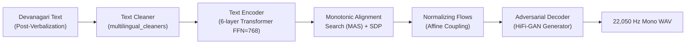

# TTS Models Deep-Dive: Chhattisgarhi VITS Speech Synthesis & LRU Caching

**Location:** [`code/TTS/chattisgarhi-tts-models/`](file:///run/media/rtx/Files/Study/Semester%205/Minor/code/TTS/chattisgarhi-tts-models)  
**Primary Tech Stack:** Coqui TTS (`TTS.utils.synthesizer.Synthesizer`), PyTorch, Git LFS, VITS Architecture  
**Target Audio Output:** 22,050 Hz Mono 16-bit PCM RIFF/WAV  
**Location:** `idea/presentation/working/04-tts-models-deepdive.md`

---

## 1. Neural Architecture: VITS (Variational Inference for End-to-End TTS)

VITS is a fully parallel, non-autoregressive end-to-end neural speech generator. It synthesizes natural raw audio directly from text without producing intermediate linear spectrograms or requiring a separately trained vocoder.



### Key Architectural Hyperparameters (from [`Female/config.json`](file:///run/media/rtx/Files/Study/Semester%205/Minor/code/TTS/chattisgarhi-tts-models/Female/config.json)):
- **Audio Output:**
  - `sample_rate`: $22,050\text{ Hz}$
  - `fft_size`: $1,024$
  - `win_length`: $1,024$
  - `hop_length`: $256$
  - `num_mels`: $80$
- **Text Representation & Alignment:**
  - `text_cleaner`: `"multilingual_cleaners"` (Devanagari Unicode normalization).
  - `use_phonemes`: `false`. The model does not rely on an external G2P (Grapheme-to-Phoneme) dictionary; it maps raw Devanagari characters directly to acoustic latents.
  - `add_blank`: `true`. Intersperses a blank token (`<BLNK>`) between adjacent characters to prevent character smearing and model boundary ambiguities.
  - `use_sdp`: `true`. Incorporates a **Stochastic Duration Predictor (SDP)** to sample expressive speech rhythm variations rather than deterministic pacing.
- **Text Encoder Backbone:**
  - Layers: $6$ Transformer blocks.
  - Attention Heads: $2$.
  - Hidden Channels: $192$.
  - FFN Hidden Dimension: $768$.
  - Kernel Size: $3$.

---

## 2. Checkpoint Comparison: Female vs. Male

Both checkpoints were trained with the Coqui TTS framework for approximately **920,000 steps** on single-speaker Chhattisgarhi recordings formatted under the LJSpeech convention.

| Attribute | Female Checkpoint (`Female/`) | Male Checkpoint (`Male/`) |
|---|---|---|
| **Weight Path** | [`Female/best_model.pth`](file:///run/media/rtx/Files/Study/Semester%205/Minor/code/TTS/chattisgarhi-tts-models/Female/best_model.pth) | [`Male/best_model.pth`](file:///run/media/rtx/Files/Study/Semester%205/Minor/code/TTS/chattisgarhi-tts-models/Male/best_model.pth) |
| **Config Path** | [`Female/config.json`](file:///run/media/rtx/Files/Study/Semester%205/Minor/code/TTS/chattisgarhi-tts-models/Female/config.json) | [`Male/config.json`](file:///run/media/rtx/Files/Study/Semester%205/Minor/code/TTS/chattisgarhi-tts-models/Male/config.json) |
| **File Size** | $\sim 950\text{ MB}$ (Tracked via Git LFS) | $\sim 950\text{ MB}$ (Tracked via Git LFS) |
| **Vocabulary Size** | `num_chars: 114` | `num_chars: 106` |
| **Sampling Rate** | $22,050\text{ Hz}$ | $22,050\text{ Hz}$ |
| **Acoustic Profile** | Higher pitch, clear articulatory resonance | Warmer, deeper baritone tone |

> [!WARNING]
> **Git LFS Requirement:** Checkpoint weights (`best_model.pth`) are tracked using Git Large File Storage (`.gitattributes`). Attempting to run inference on a raw clone without running `git lfs pull` loads a 130-byte pointer file and raises a `_pickle.UnpicklingError`.

---

## 3. Resident In-Memory LRU Voice Cache (F07)

In naive implementations, switching between Female and Male voices reloaded heavy PyTorch checkpoints from disk, incurring a **1.5 to 2.0 second latency penalty** on alternating turns.

In [`code/demo2/speech.py`](file:///run/media/rtx/Files/Study/Semester%205/Minor/code/demo2/speech.py), we implemented an in-memory LRU voice cache:

```python
_SYNTHESIZERS: OrderedDict[str, Synthesizer] = OrderedDict()
VOICE_CACHE_SIZE = 2  # Keeps both Female and Male models warm in RAM

def _get_synthesizer(voice: str) -> Synthesizer:
    with _SYNTH_LOCK:
        if voice in _SYNTHESIZERS:
            _SYNTHESIZERS.move_to_end(voice)
            return _SYNTHESIZERS[voice]
            
        checkpoint_path, config_path = _get_voice_paths(voice)
        synth = Synthesizer(
            tts_checkpoint=checkpoint_path,
            tts_config_path=config_path,
            use_cuda=False,  # CPU offloading reserves GPU VRAM for LLM
        )
        
        if len(_SYNTHESIZERS) >= VOICE_CACHE_SIZE:
            evicted_voice, evicted_synth = _SYNTHESIZERS.popitem(last=False)
            del evicted_synth
            
        _SYNTHESIZERS[voice] = synth
        return synth
```

#### Operational Impact:
* Voice switching latency drops from **$1.8\text{ s} \to \mathbf{0\text{ ms}}$**.
* Total CPU host RAM consumption for both models is bounded to $\approx 1.9\text{ GB}$, leaving over $28\text{ GB}$ of host memory free.

---

## 4. Inference Control & Pacing via `length_scale`

In this version of Coqui VITS, passing a `speed` argument directly to `.tts(text=..., speed=1.2)` **is completely ignored by the model**.

To control speech pacing, one must modify the `length_scale` attribute on the underlying neural model **prior** to calling `.tts()`:

```python
# Slower speech (~20% slower, ideal for rural or elderly listeners):
tts.tts_model.length_scale = 1.25
wav = tts.tts(text=devanagari_text)

# Faster speech (~15% faster for rapid conversational dialogue):
tts.tts_model.length_scale = 0.85
wav = tts.tts(text=devanagari_text)

# Standard speed:
tts.tts_model.length_scale = 1.0
```

---

## 5. Phonetic Pre-Processing & Negation Guards

Neural TTS models fail when encountering raw Latin digits, percentages, English acronyms, or rupee glyphs (`₹`). 

Before any text reaches VITS, [`verbalization.py`](file:///run/media/rtx/Files/Study/Semester%205/Minor/code/demo2/verbalization.py) applies deterministic transformations:
1. **Indian Numbering Normalization:** `₹ 90,000` $\to$ `नब्बे हजार रुपये`.
2. **Decimal Words:** `3.5%` $\to$ `तीन दशमलव पाँच प्रतिशत`.
3. **Acronym Expansion:** `IIIT-NR` $\to$ `आईआईआईटी नया रायपुर`.
4. **Negation Guard:** Enforces strict Hindi negation mappings (`"non-refundable"` $\to$ `"गैर-वापसी योग्य"`, `"excluding"` $\to$ `"को छोड़कर"`), preventing neural TTS from inverting critical financial conditions.
