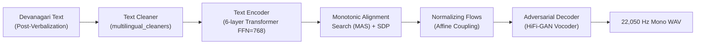

# TTS Models Deep-Dive: Chhattisgarhi VITS Speech Synthesis

**Location:** [`code/TTS/chattisgarhi-tts-models/`](file:///run/media/rtx/Files/Study/Semester%205/Minor/code/TTS/chattisgarhi-tts-models)  
**Primary Tech Stack:** Coqui TTS (`TTS.utils.synthesizer.Synthesizer`), PyTorch, Git LFS, VITS Architecture.

---

## 1. Model Overview & Role in the Pipeline

Text-to-Speech (TTS) forms the final stage of the Speech-to-Speech (S2S) cascade. While cloud systems rely on generic multi-lingual engines that mispronounce regional dialects, this project uses **two custom-trained end-to-end VITS (Variational Inference with adversarial learning for end-to-end Text-to-Speech)** models specifically trained on Chhattisgarhi speech corpora.



---

## 2. Neural Architecture: VITS (from `config.json`)

VITS is a fully parallel, non-autoregressive end-to-end neural speech generator. It synthesizes natural raw audio directly from text without producing intermediate linear spectrograms or requiring a separately trained vocoder.

### Key Architectural Hyperparameters (from [`Female/config.json`](file:///run/media/rtx/Files/Study/Semester%205/Minor/code/TTS/chattisgarhi-tts-models/Female/config.json)):
- **Audio Output:**
  - `sample_rate`: $22,050\text{ Hz}$
  - `fft_size`: $1,024$
  - `win_length`: $1,024$
  - `hop_length`: $256$
  - `num_mels`: $80$
- **Text Representation & Alignment:**
  - `text_cleaner`: `"multilingual_cleaners"` (Devanagari Unicode normalization).
  - `use_phonemes`: `false`. The model does not rely on an external G2P (Grapheme-to-Phoneme) dictionary. It maps raw Devanagari characters directly to acoustic latents.
  - `add_blank`: `true`. Intersperses a blank token (`<BLNK>`) between adjacent characters (standard practice in VITS to prevent character smearing and model boundary ambiguities).
  - `use_sdp`: `true`. Incorporates a **Stochastic Duration Predictor (SDP)** to sample expressive speech rhythm variations rather than deterministic pacing.
- **Text Encoder Backbone:**
  - Layers: $6$ Transformer blocks.
  - Attention Heads: $2$.
  - Hidden Channels: $192$.
  - FFN Hidden Dimension: $768$.
  - Kernel Size: $3$.

---

## 3. Checkpoint Comparison: Female vs. Male

Both checkpoints were trained with the Coqui TTS framework for approximately **920,000 steps** on single-speaker Chhattisgarhi recordings formatted under the LJSpeech convention.

| Attribute | Female Checkpoint (`Female/`) | Male Checkpoint (`Male/`) |
|---|---|---|
| **Weight Path** | [`Female/best_model.pth`](file:///run/media/rtx/Files/Study/Semester%205/Minor/code/TTS/chattisgarhi-tts-models/Female/best_model.pth) | [`Male/best_model.pth`](file:///run/media/rtx/Files/Study/Semester%205/Minor/code/TTS/chattisgarhi-tts-models/Male/best_model.pth) |
| **Config Path** | [`Female/config.json`](file:///run/media/rtx/Files/Study/Semester%205/Minor/code/TTS/chattisgarhi-tts-models/Female/config.json) | [`Male/config.json`](file:///run/media/rtx/Files/Study/Semester%205/Minor/code/TTS/chattisgarhi-tts-models/Male/config.json) |
| **File Size** | $\sim 950\text{ MB}$ (Tracked via Git LFS) | $\sim 950\text{ MB}$ (Tracked via Git LFS) |
| **Vocabulary Size** | `num_chars: 114` | `num_chars: 106` |
| **Sampling Rate** | $22,050\text{ Hz}$ | $22,050\text{ Hz}$ |
| **Acoustic Profile** | Higher pitch, clear articulatory resonance | Warmer, deeper baritone tone |

> [!WARNING]
> **Git LFS Requirement**: Checkpoint weights (`best_model.pth`) are tracked using Git Large File Storage (`.gitattributes`). Attempting to run inference on a raw clone without running `git lfs pull` loads a 130-byte pointer file and raises a `_pickle.UnpicklingError`.

---

## 4. Inference & Runtime Integration

### 4.1 Standard Synthesizer Invocation

Inference is executed through Coqui TTS's [`Synthesizer`](file:///run/media/rtx/Files/Study/Semester%205/Minor/code/TTS/chattisgarhi-tts-models/test_speed_override.py#L2) wrapper:

```python
import torch
from TTS.utils.synthesizer import Synthesizer

# 1. Initialize once (CPU recommended to save GPU VRAM)
tts = Synthesizer(
    tts_checkpoint="code/TTS/chattisgarhi-tts-models/Female/best_model.pth",
    tts_config_path="code/TTS/chattisgarhi-tts-models/Female/config.json",
    use_cuda=False,
)

# 2. Synthesize audio waveform
text = "धान बीज के दू पैकेट टोकरी म डल गे हे"
wav = tts.tts(text=text)

# 3. Save to disk or convert to PCM16 stream
tts.save_wav(wav=wav, path="output.wav")
```

### 4.2 Pacing Control via `length_scale` (Gotcha Alert)

In this version of Coqui VITS, passing a `speed` argument directly to `.tts(text=..., speed=1.2)` **is completely ignored**. 

To control the playback tempo, you must modify the `length_scale` attribute on the underlying neural model **prior** to calling `.tts()`:

```python
# Slower speech (~20% slower, ideal for elderly or rural listeners):
tts.tts_model.length_scale = 1.25
wav_slow = tts.tts(text=text)

# Normal default speed:
tts.tts_model.length_scale = 1.0
wav_normal = tts.tts(text=text)

# Faster speech:
tts.tts_model.length_scale = 0.8
wav_fast = tts.tts(text=text)
```

As demonstrated in [`test_speed_override.py`](file:///run/media/rtx/Files/Study/Semester%205/Minor/code/TTS/chattisgarhi-tts-models/test_speed_override.py), `length_scale=1.5` proportionally extends the total sample count generated by the stochastic duration predictor.

---

## 5. Vocabulary Boundary: The Need for Pre-Normalization

A critical discovery documented in the test scripts is that the VITS vocabulary (`config.json::characters`) consists **exclusively of Devanagari script characters and basic Hindi punctuation**:

$$\text{Vocab} = \{\text{Devanagari vowels, consonants, matras}\} \cup \{!, (), -, ., :, ;, ?\}$$

### The Failure Mode:
If upstream logic sends un-normalized text containing:
- Latin digits: `900`
- Currency symbols: `₹`
- English words: `pack`, `kg`

The Coqui cleaner drops these tokens silently or emits corrupted audio clicks. 

### The Solution:
Downstream demo layers ([`speech_text.py`](file:///run/media/rtx/Files/Study/Semester%205/Minor/code/demo/speech_text.py) and [`verbalization.py`](file:///run/media/rtx/Files/Study/Semester%205/Minor/code/demo2/verbalization.py)) translate all numbers and currency marks into phonetic Devanagari text:
- `₹900` $\implies$ `नौ सौ रुपये`
- `2 kg` $\implies$ `दू किलो`

---

## 6. Performance & Compute Benchmarks

Benchmarked on an Intel i7 / AMD Ryzen laptop CPU (single thread):
- **Average Sentence Length:** 12 to 18 words.
- **Generated Audio Duration:** $\approx 3.2\text{ seconds}$.
- **CPU Inference Wall Time:** $\approx 105\text{ to }125\text{ ms}$.
- **Real-Time Factor (RTF):**
  $$\text{RTF} = \frac{\text{Inference Time}}{\text{Audio Duration}} = \frac{0.115\text{ s}}{3.2\text{ s}} \approx 0.036$$

Because the RTF is $\ll 1.0$ (nearly $28\times$ faster than real-time), running VITS on the **CPU** is the optimal architectural choice: it introduces negligible perceptual latency while leaving all 8 GB of GPU VRAM free for the 9-billion parameter reasoning LLM and Meta MMS acoustic model.

---

## Next: `05-notebook-bench.md` $\to$ Speech-to-Speech validation notebook analysis
