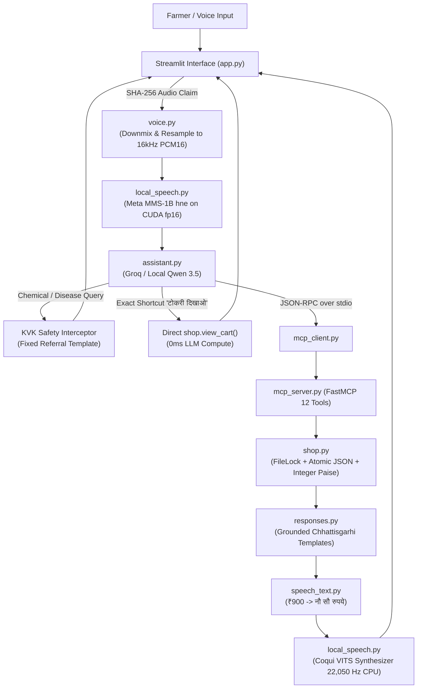

# Demo 1 Deep-Dive: Kisan Saathi Voice Shopping Assistant

**Location:** [`code/demo/`](file:///run/media/rtx/Files/Study/Semester%205/Minor/code/demo)  
**Primary Tech Stack:** Streamlit, FastMCP (stdio), Groq API (`openai/gpt-oss-120b`) / Local Qwen, FileLock, RapidFuzz, Meta MMS-1B (`hne`), Coqui VITS  
**Target Domain:** Transactional Agricultural Commerce for Chhattisgarhi Farmers  
**Location:** `idea/presentation/working/06-demo-shopping.md`

---

## 1. Module Overview & Operational Thesis

Demo 1 (**Kisan Saathi**) is a voice-first transactional agricultural shopping assistant. It enables rural farmers speaking Chhattisgarhi to browse agricultural inputs (seeds, fertilizers, implements), check grounded prices, add items to a cart, calculate field application quantities based on acreage, and complete simulated checkouts.



---

## 2. File-by-File Technical Deep Dive

### 2.1 `app.py` — Streamlit Frontend & Rerun Deduplication

[`app.py`](file:///run/media/rtx/Files/Study/Semester%205/Minor/code/demo/app.py) hosts the dual-view interface:
1. **Shop View:** Direct visual catalogue browser with manual "Add to Cart" and checkout buttons.
2. **Talk View:** Voice-first conversation screen featuring a single Record/Stop microphone button.

#### The Streamlit Rerun Deduplication Problem:
Streamlit re-executes the entire Python script from top to bottom on every user interaction (clicks, typing, widget state change). If an audio recording is stored in session state, an unrelated UI click could re-submit the recording and accidentally execute duplicate `add_to_cart` tool calls.

#### Solution (`_claim_recording`):
```python
recording_sha = hashlib.sha256(audio_bytes).hexdigest()
if st.session_state.get("last_processed_sha") == recording_sha:
    return  # Skip processing; already handled
st.session_state["last_processed_sha"] = recording_sha
```
Every incoming audio buffer is hashed. The hash is claimed before tool invocation, ensuring each voice turn executes exactly once.

---

### 2.2 `voice.py` & `local_speech.py` — Local Acoustic Integration

1. **[`voice.py`](file:///run/media/rtx/Files/Study/Semester%205/Minor/code/demo/voice.py)**:
   - `prepare_recording(raw_audio) -> bytes`: Normalizes arbitrary browser recordings (WebM/WAV/OGG). Downmixes multi-channel audio to mono and resamples to 16,000 Hz 16-bit signed PCM.
   - Enforces size constraints ($0.3\text{ s} \le \text{duration} \le 30\text{ s}$ and $\le 12\text{ MB}$).

2. **[`local_speech.py`](file:///run/media/rtx/Files/Study/Semester%205/Minor/code/demo/local_speech.py)**:
   - Directly imports [`get_engine()`](file:///run/media/rtx/Files/Study/Semester%205/Minor/code/STT/stt-service/src/asr.py#L129) from the STT microservice codebase.
   - **Reduced Precision on GPU:** Configured with `DEMO_STT_DEVICE=cuda` and `DEMO_STT_DTYPE=float16`. Weights for Meta MMS-1B are cast to `torch.float16` prior to GPU allocation, constraining VRAM consumption to $\approx 2.2\text{ GB}$.
   - TTS synthesizer runs on CPU to prevent VRAM contention with MMS.

---

### 2.3 `assistant.py` — Intent Routing & Hard KVK Safety Guard

[`assistant.py`](file:///run/media/rtx/Files/Study/Semester%205/Minor/code/demo/assistant.py) coordinates LLM tool calling.

#### Key Subsystems:
1. **Shortcut Bypasses:**
   - Cart checks: `"टोकरी दिखाओ"`, `"show cart"`, `"tokri dikhao"` directly call `shop.view_cart()` via fuzzy string matching (`_fuzzy_best()`), bypassing the LLM to achieve sub-50ms execution.
2. **Order Confirmation Guard (`is_confirmation`):**
   - Order confirmation requires explicit phrases: `"Confirm demo order"`, `"डेमो ऑर्डर पक्का करो"`.
   - **Negation Filter:** Explicitly rejects phrases containing negation tokens (`"don't"`, `"nahi"`, `"mat"`, `"नहीं"`, `"मत"`), preventing accidental order placement when a user says "नहीं, ऑर्डर मत करो".
3. **Safety Regex Interception (`SAFETY_PATTERN`):**
   - Catches agronomic and chemical queries (`"रोग"`, `"कीटनाशक"`, `"spray"`, `"dose"`, `"yellow leaves"`).
   - Immediately returns a fixed `refuse_and_refer` response redirecting the farmer to their local Krishi Vigyan Kendra (KVK). The LLM is never allowed to improvise pesticide dosages or crop medical treatments.

---

### 2.4 `mcp_server.py` & `mcp_client.py` — FastMCP Process Isolation

The Model Context Protocol (FastMCP) decouples the reasoning engine from domain tools across a separate OS process boundary over standard I/O (stdio).

#### The 12 Canonical FastMCP Tools:
| Tool Name | Type | Purpose & Safety Properties |
|---|---|---|
| `search_products` | Read | Searches catalogue by name, Hindi, Chhattisgarhi, or English aliases. |
| `resolve_product` | Read | Maps spoken product mentions to unique IDs; asks clarification on ambiguity. |
| `get_product_details`| Read | Reads grounded product package size, price, stock, and specifications. |
| `check_price` | Read | Computes item pricing for discrete package counts. |
| `view_cart` | Read | Inspects current session cart lines, quantities, and totals. |
| `add_to_cart` | Write | Adds sellable units (`pack`, `bag`, `piece`, `pair`) to the cart. |
| `remove_from_cart` | Write | Decrements or deletes a cart line item. |
| `checkout` | Write | Prepares an order preview and returns a cryptographic `preview_token`. |
| `confirm_order` | Write | Finalizes order using preview token (restricted from autonomous LLM access). |
| `calculate_required_quantity` | Read | Computes required seed/fertilizer bags based on verified acreage. |
| `request_clarification`| Control | Halts tool execution to prompt the user between ambiguous options. |
| `refuse_and_refer` | Control | Enforces fixed KVK agricultural referral on safety violations. |

---

### 2.5 `shop.py` — Atomic JSON State & Exact Integer Paise Accounting

[`shop.py`](file:///run/media/rtx/Files/Study/Semester%205/Minor/code/demo/shop.py) implements the transactional store backed by `data/shop.json`.

#### Architectural Invariants:
1. **Exact Integer Arithmetic (Paise):**
   - Binary floating-point arithmetic ($0.1 + 0.2 \ne 0.3$) is strictly prohibited for monetary transactions.
   - All prices, item costs, and cart totals are stored and manipulated as **integer paise** ($1\text{ Rupee} = 100\text{ paise}$).
   - Formatted via [`money(paise)`](file:///run/media/rtx/Files/Study/Semester%205/Minor/code/demo/shop.py#L20): `f"₹{paise // 100:,}.{paise % 100:02d}"`.
2. **Inter-Process Concurrency Control (`filelock`):**
   - `FileLock(str(self.path) + ".lock", timeout=10)` ensures that concurrent MCP subprocesses never corrupt the JSON store during simultaneous reads or writes.
3. **Atomic File Replacement:**
   - Writes are directed to a `NamedTemporaryFile` in the same directory.
   - The file is flushed to physical media via `os.fsync()`.
   - Replaced atomically onto `shop.json` via `os.replace()`, guaranteeing zero data loss or partial writes during abrupt system reboots.
4. **Turn-Level Mutation Idempotency:**
   - Mutating actions (`add_to_cart`, `checkout`) compute a SHA-256 idempotency key:
     $$\text{Key} = \mathbf{SHA256}(\text{session\_id} : \text{turn\_id} : \text{function\_name} : \text{args})$$
   - Repeated calls within the same conversational turn return the cached result without modifying inventory or cart totals twice.

---

### 2.6 `speech_text.py` & `responses.py` — Verbalization & Templates

1. **[`responses.py`](file:///run/media/rtx/Files/Study/Semester%205/Minor/code/demo/responses.py)**:
   - Assembles grounded responses from structured tool slots using pre-defined templates in Chhattisgarhi (`"धान बीज के {quantity} पैकेट टोकरी म डल गे हे। कुल दाम {total} हे।"`).
   - Guarantees the LLM cannot hallucinate fabricated pricing or terms in the spoken response.

2. **[`speech_text.py`](file:///run/media/rtx/Files/Study/Semester%205/Minor/code/demo/speech_text.py)**:
   - Translates numeric digits and rupee symbols into phonetic Devanagari text words (`number_words()`):
     - `₹900.00` $\implies$ `नौ सौ रुपये`
     - `25` $\implies$ `पच्चीस`
   - Strips UI-only identifiers like order IDs (`DEMO-A1B2` $\implies$ `पहचान स्क्रीन पर देखिए`) because synthetic speech models cannot pronounce raw hexadecimal hashes intelligibly.

---

## 3. Architecture Decisions & Rationale (Viva Defense)

| Design Choice | Alternative Considered | Technical Rationale for Choice |
|---|---|---|
| **Atomic JSON + FileLock** | SQLite / PostgreSQL server | 1) Zero-dependency deployment: runs on any student laptop without running database background daemons.<br/>2) Human-inspectable state: examiners can open `shop.json` directly during a live demo to inspect cart state transitions.<br/>3) ACID-compliant at small demo scale through OS-level atomic file replacement. |
| **Model Context Protocol (FastMCP)** | Direct Python function imports | 1) Process isolation: a fatal crash in a tool does not crash the Streamlit web server.<br/>2) Open standard: tools can be inspected and exercised by external MCP inspectors without code modification. |
| **Integer Paise Storage** | Python `float` | IEEE 754 floating-point representations cause fractional cent rounding errors ($0.1 + 0.2 = 0.30000000000000004$), which are unacceptable in financial accounting systems. |
| **Deterministic Response Templates** | Free-form LLM text generation | Prevents the language model from hallucinating non-existent inventory, incorrect prices, or misleading agricultural claims in the final speech output. |
