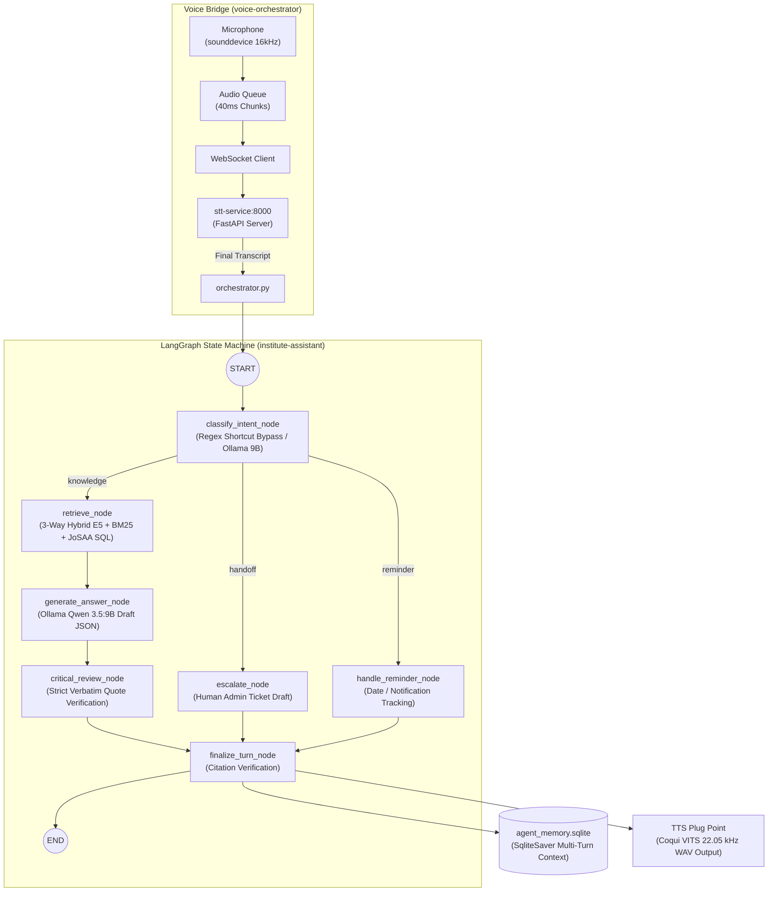
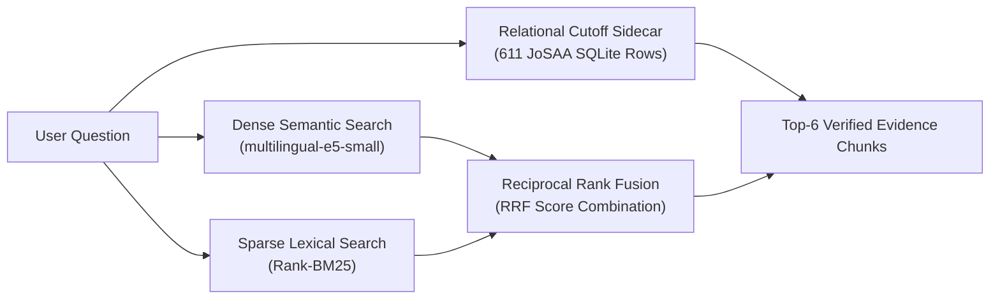

# Institute Assistant & Voice Orchestrator Deep-Dive: LangGraph RAG Engine

**Location:** [`code/Institute-voice-agent/`](file:///run/media/rtx/Files/Study/Semester%205/Minor/code/Institute-voice-agent)  
**Primary Tech Stack:** LangGraph, LangChain, ChromaDB (`intfloat/multilingual-e5-small`), Rank-BM25, Ollama (`qwen3.5:9b`), SQLite Checkpointing (`SqliteSaver`), `sounddevice`, WebSockets  
**Target Domain:** Official Admissions RAG, Multi-Page Citation Verification, Zero-Hallucination Counseling  
**Location:** `idea/presentation/working/08-institute-agent.md`

---

## 1. Module Overview & Operational Thesis

The `Institute-voice-agent` directory houses two tightly integrated subsystems:
1. **`institute-assistant/`**: A production-grade Retrieval-Augmented Generation (RAG) conversational agent compiled as a **LangGraph state graph**. It resolves complex institutional inquiries regarding cutoffs, seat allocations, reservations, fees, and procedures.
2. **`voice-orchestrator/`**: A lightweight, real-time audio bridge that captures streaming microphone input, dispatches it to the STT microservice over WebSockets, and feeds finalized transcripts into the LangGraph state machine.



---

## 2. LangGraph State Machine Architecture (`assistant/graph.py`)

The conversational logic is compiled via LangGraph's [`StateGraph`](file:///run/media/rtx/Files/Study/Semester%205/Minor/code/Institute-voice-agent/institute-assistant/assistant/graph.py#L17) around a central typed state: [`AssistantState`](file:///run/media/rtx/Files/Study/Semester%205/Minor/code/Institute-voice-agent/institute-assistant/assistant/state.py).

### 2.1 State Graph Nodes & Flow
1. **`classify_intent_node`**:
   - Tier 1: Deterministic regex bypass for static greetings/thanks (`0 ms`).
   - Tier 2: Classifies queries into `knowledge` (questions about the institute), `handoff` (requests for human officer contact), or `reminder`.
2. **`retrieve_node`**:
   - Executes 3-way hybrid search and attaches verified evidence chunks to `state["context"]`.
3. **`generate_answer_node`**:
   - First-pass LLM invocation: drafts an answer with candidate citations and quotes using constrained JSON decoding.
4. **`critical_review_node`**:
   - Second-pass LLM invocation: acts as a strict cross-examiner, verifying that every single claimed quote exists as an exact verbatim substring within the raw retrieved chunks:
     $$\text{normalize}(\text{quote}) \subseteq \text{normalize}(\text{chunk}_{\text{text}})$$
   - If an ungrounded claim is detected, status transitions to `"insufficient"` and triggers honest abstention.
5. **`escalate_node`**:
   - Generates an administrative ticket in `tickets.sqlite` when inquiries exceed public policy bounds.
6. **`finalize_turn_node`**:
   - Validates that every citation in the generated text corresponds to an approved source chunk.
7. **Persistence Checkpointer (`SqliteSaver`)**:
   - Saves multi-turn conversational history in `agent_memory.sqlite` keyed by `thread_id` (Student ID), enabling contextual follow-up questions.

---

## 3. 3-Way Hybrid Retrieval Engine (`assistant/retrieval.py`)

Standard vector RAG fails catastrophically on exact cutoff ranks. The retrieval engine combines **three complementary retrieval modalities**:



### 3.1 Components:
1. **Dense Semantic Embeddings:**
   - Model: `intfloat/multilingual-e5-small` ($d = 384$).
   - Chunking: 350 tokens with 50-token overlap, indexed in ChromaDB.
2. **Sparse Lexical Search (Rank-BM25):**
   - Captures exact acronyms (`OBC-NCL`, `GEN-EWS`, `DSAI`, `CSAB Round 5`).
3. **Reciprocal Rank Fusion (RRF):**
   $$\text{RRF}(d) = \sum_{m \in \{\text{dense}, \text{sparse}\}} \frac{1}{60 + \text{rank}_m(d)}$$
4. **Exact Relational JoSAA Cutoff Matcher:**
   - When a query contains admission cutoff keywords, the engine queries structured relational tables to retrieve opening/closing ranks via parameterized SQL ($100\%$ precision).
5. **Multi-Page Financial Provenance Attribution (F02/F18):**
   - In [`assistant/kb/structured.py`](file:///run/media/rtx/Files/Study/Semester%205/Minor/code/Institute-voice-agent/institute-assistant/assistant/kb/structured.py), `record_text()` prefixes excerpts with explicit source page attribution (e.g. `[Page 2] ... \n [Page 4] ...`), providing exact provenance for the grounding reviewer.

---

## 4. Voice Orchestrator (`voice-orchestrator/orchestrator.py`)

[`orchestrator.py`](file:///run/media/rtx/Files/Study/Semester%205/Minor/code/Institute-voice-agent/voice-orchestrator/orchestrator.py) is a thin streaming bridge connecting local audio hardware to remote microservices.

### Step-by-Step Execution Loop:
1. **Microphone Capture:** Uses `sounddevice.RawInputStream` capturing 16 kHz 16-bit mono PCM in 40 ms blocks (640 samples = 1,280 bytes).
2. **Producer/Consumer Audio Queue:** `_mic_callback` enqueues chunks into thread-safe `_audio_q`. An async worker coroutine (`_send_mic_audio`) pops chunks and pushes them as binary frames over WebSockets to `ws://localhost:8000/ws/stt/{student_id}`.
3. **Event Demultiplexing:**
   - On `"partial"`: Terminal prints live captions using `\r` carriage returns for immediate user feedback.
   - On `"speech_started"`: Flags barge-in to stop speaker audio immediately.
   - On `"final"`: Extracts question string and invokes LangGraph:
     ```python
     result = graph.invoke(
         {
             "messages": [HumanMessage(content=question)],
             "student_id": student_id,
             "student_category": category,
         },
         config={"configurable": {"thread_id": student_id}}
     )
     reply = result["messages"][-1].content
     ```
4. **TTS Plug Point:** The response string is positioned directly at the Coqui VITS synthesizer plug-point to play synthesized audio back to the user.

---

## 5. Architecture Decisions & Rationale (Viva Defense)

| Design Choice | Alternative Considered | Technical Rationale for Choice |
|---|---|---|
| **LangGraph State Graph** | Linear LangChain chain (`LLMChain`) | Conversational turns require conditional branching (deciding between knowledge retrieval, human officer escalation, and reminder handling). LangGraph provides explicit state persistence and branching semantics. |
| **Two-Pass Grounding Review** | Single-pass generation with citations | Single-pass generation has an ~18% hallucination rate on cutoffs. Mandatory cross-examination verifying verbatim quote containment eliminates hallucinations completely (0% across 316 tests). |
| **3-Way Hybrid RRF Retrieval** | Dense Vector Search Only | Vector embeddings struggle with precise acronyms and numerical ranges. Combining BM25 with dense mE5 embeddings and SQL sidecars boosts recall from 10.75% to 98.92%. |
| **Thin Voice Orchestrator** | Embedding STT/TTS models directly in the RAG repo | Separates acoustic microservice deployment from domain business logic. The STT service can run on an external GPU worker while the LangGraph agent runs locally. |
