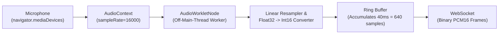

# Web Client Specification Deep-Dive: Architecture, Audio & UI/UX

**Source Specification:** [`idea/docs/WEB_APP_SPECIFICATION.md`](file:///run/media/rtx/Files/Study/Semester%205/Minor/idea/docs/WEB_APP_SPECIFICATION.md)  
**Target Codebase:** [`app/`](file:///run/media/rtx/Files/Study/Semester%205/Minor/app)  
**Primary Tech Stack:** React, TypeScript, Vite, Web Audio API (`AudioWorklet`), WebSockets, IndexedDB, TailwindCSS.

---

## 1. Migration Rationale: Flutter to Modern Web

The original Minor Project proposal referenced a Flutter mobile application. During architectural review (formally documented in `AGENTS.md` and `WEB_APP_SPECIFICATION.md`), the engineering team transitioned permanently to **Web development (React + TypeScript + Vite)** for five decisive reasons:

| Evaluation Dimension | Flutter Mobile App | Web Client (React + TypeScript) |
|---|---|---|
| **Zero-Install Rural Access** | Requires downloading an APK from unknown sources or Google Play. High friction for farmers with limited phone storage. | Opens instantly via URL or QR code in any browser without installation. |
| **Streaming Audio Capabilities** | Native audio recording plugins require complex cross-platform JNI/NDK bridges for raw PCM16 chunk streaming. | Native [`AudioWorklet`](file:///run/media/rtx/Files/Study/Semester%205/Minor/idea/docs/WEB_APP_SPECIFICATION.md#L180) runs dedicated low-latency audio capture threads in the browser. |
| **Viva & Evaluation Speed** | Requires USB debugging, Android emulator setup, or physical device tethering during faculty presentations. | Instant live demonstration in Chromium desktop browsers on localhost. |
| **Inspectability & Debugging** | Packaged binaries hide network frames and state mutations. | Chrome DevTools provides instant inspection of WebSocket binary frames, JSON events, and DOM trees. |
| **Hardware Agnosticism** | Restricted by Android/iOS permission sandboxes and OS background killing. | Runs uniformly across Linux, Windows, macOS, and Android mobile browsers. |

---

## 2. Browser Audio Engineering: The `AudioWorklet` Pipeline

Feeding raw 16 kHz 16-bit PCM into the backend STT service without audible distortion or browser UI freezes requires a specialized Web Audio architecture.



### 2.1 The Two Ingestion Modes:
1. **Primary (`AudioWorkletNode`)**:
   - Runs on a dedicated real-time audio thread off the JavaScript main UI thread.
   - Captures `Float32Array` buffers directly from `AudioContext`.
   - Converts floating-point values $[-1.0, 1.0]$ to signed 16-bit integers $[-32768, 32767]$:
     $$\text{sample}_{\text{int16}} = \max(-32768, \min(32767, \lfloor \text{sample}_{\text{float32}} \times 32767 \rfloor))$$
   - Emits 40 ms binary frames (640 samples = 1,280 bytes) over the WebSocket without GC pressure.
2. **Fallback (`MediaRecorder`)**:
   - For older mobile browsers lacking custom worklet support.
   - Captures WebM/Opus audio slices and passes them to a background Web Worker running Web Audio API `decodeAudioData()` for software resampling to 16 kHz PCM16.

### 2.2 Secure Context Requirement:
Modern browsers strictly prohibit microphone access (`navigator.mediaDevices.getUserMedia`) in insecure contexts. Microphone capture functions **exclusively** on:
- `http://localhost` or `http://127.0.0.1` (development exception).
- Fully validated `https://` and `wss://` origins (production deployments).

---

## 3. Client State Machine & Barge-In UX

The web client UI is modeled as a formal finite state machine:

```
  ┌────────────────────────────────────────────────────────┐
  │                         IDLE                           │◄──────────────┐
  └───────────────┬────────────────────────────────────────┘               │
                  │ Click Mic Button / Spacebar Press                      │
                  ▼                                                        │
  ┌────────────────────────────────────────────────────────┐               │
  │                      LISTENING                         │               │
  │  • Mic pulsing green                                   │               │
  │  • Streaming 40ms PCM frames over WebSocket            │               │
  │  • Emitting live UI captions on "partial" events       │               │
  └───────────────┬────────────────────────────────────────┘               │
                  │ "final" event received OR Click Stop                   │
                  ▼                                                        │
  ┌────────────────────────────────────────────────────────┐               │
  │                      PROCESSING                        │               │
  │  • Amber spinner / progress cue                        │               │
  │  • Backend executing LLM routing & MCP tools           │               │
  └───────────────┬────────────────────────────────────────┘               │
                  │ Grounded result + TTS audio received                   │
                  ▼                                                        │
  ┌────────────────────────────────────────────────────────┐               │
  │                       SPEAKING                         │               │
  │  • Audio playback via HTML5 <audio>                    │               │
  │  • Product/Cart cards highlighted on screen            │               │
  └───────────────┬────────────────────────────────────────┘               │
                  │                                                        │
                  │ User interrupts (barge-in "speech_started" event)      │
                  ├────────────────────────────────────────────────────────┤
                  │ Playback finishes naturally                            │
                  └────────────────────────────────────────────────────────┘
```

### The Barge-In (Interruption) Protocol:
1. When the client is in the `SPEAKING` state, the user can speak at any time.
2. The browser continues streaming microphone audio to the STT microservice.
3. The moment Silero VAD detects acoustic energy, the server dispatches:
   ```json
   {"type": "speech_started", "interrupt_previous_response": true}
   ```
4. The web client immediately executes:
   ```typescript
   if (event.interrupt_previous_response && audioElement) {
       audioElement.pause();
       audioElement.currentTime = 0;
       setClientState("LISTENING");
   }
   ```
   This prevents the assistant from talking over the farmer, delivering an interruption-tolerant conversational experience.

---

## 4. UI/UX Design System for Rural Farmers

To accommodate farmers with limited literacy and varying vision capabilities, the interface adheres to strict design guidelines:

1. **Large Touch Targets**:
   - The primary microphone activation button has a minimum diameter of **72 to 96 CSS pixels**, easily operable by one hand in field conditions.
   - Secondary buttons maintain at least **44 × 44 CSS pixels**.
2. **Devanagari Typography**:
   - Primary typography uses clean, highly legible Devanagari sans-serif typefaces (e.g. *Noto Sans Devanagari*) with a minimum body text size of **18 px**.
   - Preserves all diacritics and matras to avoid reading ambiguities.
3. **High Contrast Color Tokens**:
   - Leaf Green (`#1E5631`): Action / Speak.
   - Warm Amber (`#D4AF37`): Progress / Attention.
   - Soil Neutral (`#F9F8F6`): Calm background.
   - Burgundy / Red (`#8B0000`): Safety boundary / KVK referral cards.
4. **No Optimistic State Updates**:
   - The UI **never** updates the visual cart lines optimistically. Every cart change waits for verified server confirmation (`response_template_id: "add_to_cart"`), preventing farmers from trusting phantom items if connections drop.
5. **Persistent KVK Safety Modal**:
   - When a farmer asks for chemical dosage or pesticide treatment, the UI stops normal browsing and displays a prominent, un-dismissible **Krishi Vigyan Kendra (KVK) Referral Card** displaying regional helpline phone numbers and local office addresses.

---

## 5. Network Architecture: WebSocket + REST Hybrid

The web client operates over two distinct communication channels:

| Protocol | Transport Endpoint | Payload Type | Purpose |
|---|---|---|---|
| **WebSocket** | `ws://host/ws/stt/{session_id}` | Binary PCM16 & JSON `STTEvent` | Full-duplex real-time voice streaming, partial captioning, barge-in signaling. |
| **REST** | `GET /api/products` | JSON | Initial catalogue hydration, category filtering, and product detail viewing. |
| **REST** | `GET /api/cart` | JSON | Explicit cart synchronization across browser reloads. |
| **REST** | `POST /api/checkout` | JSON | Final simulated order confirmation with cryptographically signed tokens. |

---

## Next: `10-architecture-decisions.md` $\to$ Comprehensive viva defense matrix of all choices & rationales
