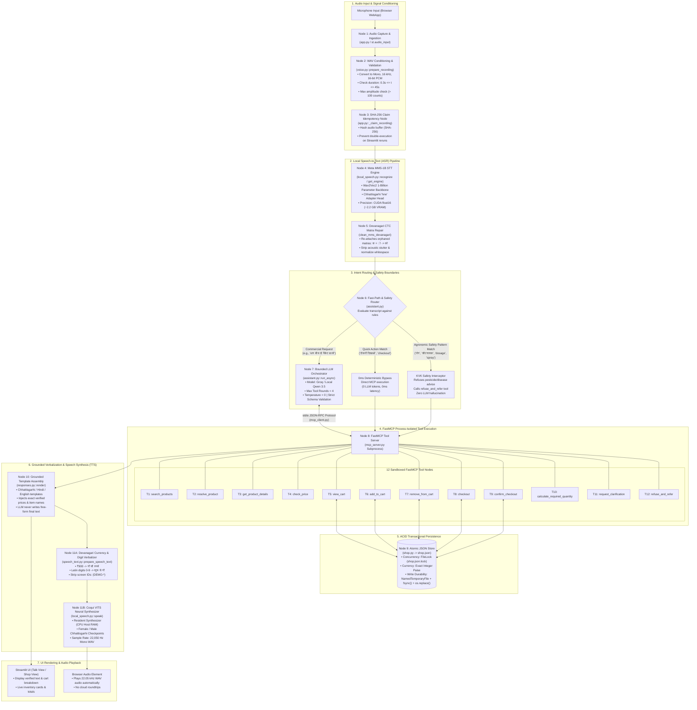

# Demo 1 (Kisan Saathi) — Complete Architecture, Node Topologies, STT & TTS Pipeline Specification

**Project Codebase:** [`code/demo/`](file:///run/media/rtx/Files/Study/Semester%205/Minor/code/demo)  
**System Class:** Voice-to-Voice Task Execution, Commercial Catalogue Search & Order Processing  
**Target User & Dialect:** Smallholder farmers in Chhattisgarh speaking regional Chhattisgarhi (`hne`), Hindi, and Romanized code-switching  
**Execution Runtime:** Streamlit WebApp + Dedicated Python Subprocess (FastMCP stdio) + Local Acoustic Speech Models  

---

## 1. Executive Summary & Node Count Overview

Demo 1 (**Kisan Saathi**) is an edge-optimized, transactional voice assistant engineered specifically for agricultural commerce. Rather than treating an LLM as an unconstrained chat agent, Demo 1 treats the language model strictly as a **bounded tool selector** orchestrating a catalog of verified commercial tools via the **Model Context Protocol (MCP)**. All factual data (prices, stock, bag weights, cart line items, orders) originates deterministically from local storage, and all audio processing executes locally without cloud speech APIs.

### Total Node Counts in Demo 1

In Demo 1, nodes are organized across two distinct conceptual layers:

| Layer Category | Node Count | Component Breakdown |
|---|---|---|
| **1. End-to-End System Pipeline Nodes** | **11 Nodes** | 1. Client Audio Input Node<br/>2. PCM Wave Conditioning & Validation Node<br/>3. SHA-256 Claim Idempotency Node<br/>4. Meta MMS-1B STT Acoustic Recognition Node<br/>5. Devanagari CTC Matra Repair Node<br/>6. Deterministic Shortcut & KVK Safety Gate Node<br/>7. Bounded LLM Tool Orchestrator Node<br/>8. FastMCP Stdio RPC Bridge Node<br/>9. Atomic ACID JSON Data Store Node (`shop.json`)<br/>10. Multi-Dialect Grounded Template Renderer Node<br/>11. Local Coqui VITS Neural Speech Synthesizer Node |
| **2. FastMCP Sandboxed Tool Nodes** | **12 Tool Nodes** | 1. `search_products` (Catalogue query)<br/>2. `resolve_product` (Disambiguate spoken mentions)<br/>3. `get_product_details` (Fetch specs, unit, stock, price)<br/>4. `check_price` (Price computation for quantity)<br/>5. `view_cart` (Inspect session cart)<br/>6. `add_to_cart` (Mutate cart with count & package unit)<br/>7. `remove_from_cart` (Remove or decrement line item)<br/>8. `checkout` (Generate simulated checkout preview)<br/>9. `confirm_checkout` (Finalize order with HMAC/session token)<br/>10. `calculate_required_quantity` (Land area calculation)<br/>11. `request_clarification` (Handle ambiguity/missing info)<br/>12. `refuse_and_refer` (KVK safety refusal boundary) |

---

## 2. End-to-End Architecture & Dataflow Diagram (Mermaid)

The following diagram illustrates the complete audio-to-audio lifecycle of Demo 1, tracing the user's spoken voice from microphone capture through local acoustic recognition, safety interception, MCP tool execution, and local speech synthesis:



---

## 3. Node-by-Node Detailed Functional Specification

### 3.1 Pipeline Nodes (Audio Ingestion to Output)

#### Node 1: Audio Capture & Ingestion
* **Location:** [`code/demo/app.py`](file:///run/media/rtx/Files/Study/Semester%205/Minor/code/demo/app.py#L180-L220)
* **Function:** Ingests raw audio from the browser using Streamlit's audio input widget. Captures the farmer's spoken query into an in-memory buffer without touching disk.
* **Input:** Raw microphone stream from browser media devices.
* **Output:** Byte array representing WAV audio.
* **Invariants:** Raw audio buffer must not exceed `MAX_AUDIO_BYTES` (4 MB / 45 seconds).

#### Node 2: WAV Conditioning & Validation
* **Location:** [`code/demo/voice.py::prepare_recording`](file:///run/media/rtx/Files/Study/Semester%205/Minor/code/demo/voice.py#L14-L46)
* **Function:** Validates audio headers, downmixes multi-channel input (stereo) to mono, computes GCD-based polyphase resampling to exactly 16,000 Hz, clips amplitude values, and validates non-silence energy ($\max(|A|) \ge 100$).
* **Input:** Variable-rate, mono/stereo WAV byte buffer.
* **Output:** Standardized mono 16 kHz PCM16 Little-Endian WAV buffer.
* **Failure Boundary:** Raises `ValueError("Record between 0.3 and 45 seconds of valid WAV audio.")` if audio is corrupted, too short, or silent.

#### Node 3: SHA-256 Claim Idempotency Node
* **Location:** [`code/demo/app.py::_claim_recording`](file:///run/media/rtx/Files/Study/Semester%205/Minor/code/demo/app.py)
* **Function:** Solves the Streamlit script re-execution dilemma. When the user interacts with any UI control (e.g., clicking a dropdown or changing tabs), Streamlit re-runs the script from top to bottom. Node 3 computes the SHA-256 digest of the audio bytes and tracks the active claim token. If the hash matches the previously processed token, the pipeline aborts immediately, preventing accidental duplicate purchases.
* **Input:** Standardized audio byte buffer.
* **Output:** Unique claim hash string; aborts turn if already claimed.

#### Node 4: Meta MMS-1B STT Acoustic Recognition Node
* **Location:** [`code/demo/local_speech.py::recognize`](file:///run/media/rtx/Files/Study/Semester%205/Minor/code/demo/local_speech.py#L16-L36) (invoking `STT/stt-service/src/asr.py`)
* **Function:** Executes local acoustic speech recognition using the 1-billion parameter Meta MMS Wav2Vec2 self-supervised model fine-tuned on Chhattisgarhi (`hne`).
* **Precision & Memory:** Runs in CUDA `float16` to cap VRAM consumption to $\approx 2.2\text{ GB}$. Audio samples are normalized to $[-1.0, 1.0]$ float32.
* **Input:** Mono 16 kHz PCM16 byte stream.
* **Output:** Uncorrected Devanagari text transcript.

#### Node 5: Devanagari CTC Matra Repair Node
* **Location:** `clean_mms_devanagari` in [`code/STT/stt-service/src/asr.py`](file:///run/media/rtx/Files/Study/Semester%205/Minor/code/STT/stt-service/src/asr.py)
* **Function:** Connectionist Temporal Classification (CTC) decoders emit whitespace characters between consonants and dependent Devanagari vowel diacritics (matras) when acoustic boundaries are blurred (e.g. `क ` + ` ो` instead of `को`). Node 5 applies a specialized regex pass:
  ```python
  re.sub(r'\s+([\u093e-\u094c\u0901-\u0903\u094d])', r'\1', text)
  ```
  Re-attaching orphaned vowel signs ensures valid Unicode strings for downstream LLM parsing.

#### Node 6: Deterministic Shortcut & KVK Safety Gate Node
* **Location:** [`code/demo/assistant.py`](file:///run/media/rtx/Files/Study/Semester%205/Minor/code/demo/assistant.py#L40-L85)
* **Function:** Enforces two high-priority rule-based filters before LLM invocation:
  1. **Quick Actions:** Uses fuzzy ratio matching (`_fuzzy_best`) to intercept standard commands like "show cart", "tokri dikhao", "चेकआउट", "checkout". These trigger direct FastMCP tool calls (`view_cart`, `checkout`), resulting in **0 ms LLM latency and 0 token cost**.
  2. **KVK Safety Guard:** Scans queries using `SAFETY_PATTERN` regex for crop disease, chemical pesticide names, symptom queries (e.g., "yellow leaves", "रोग", "कीटनाशक", "दवाई", "dosage"). Upon detection, LLM generation is completely blocked, directly invoking `refuse_and_refer` to output an official Krishi Vigyan Kendra helpline referral.

#### Node 7: Bounded LLM Tool Orchestrator Node
* **Location:** [`code/demo/assistant.py::run_async`](file:///run/media/rtx/Files/Study/Semester%205/Minor/code/demo/assistant.py#L104-L193)
* **Function:** Manages the tool-calling loop using Groq API (`openai/gpt-oss-120b`) or a local Ollama model.
* **Constraints:**
  - `MAX_ROUNDS = 4`: Prevents infinite tool-calling loops.
  - `temperature = 0`: Deterministic tool selection.
  - `parallel_tool_calls = False`: Enforces strict sequential reasoning; rejects invalid parallel tool batches.
  - `tool_choice = "required"` on first round if tools have not yet fired.
* **Input:** System prompt, last 8 dialogue history messages, current user transcript, and 12 FastMCP tool schemas.
* **Output:** Sequence of validated tool call invocations.

#### Node 8: FastMCP Stdio RPC Bridge Node
* **Location:** [`code/demo/mcp_client.py`](file:///run/media/rtx/Files/Study/Semester%205/Minor/code/demo/mcp_client.py) <-> [`code/demo/mcp_server.py`](file:///run/media/rtx/Files/Study/Semester%205/Minor/code/demo/mcp_server.py)
* **Function:** Spawns `mcp_server.py` as a separate child OS process using Python `asyncio.subprocess_exec`. Communicates strictly over standard input/output using JSON-RPC 2.0.
* **Architectural Advantage:** Complete process isolation. If a tool encounters a memory fault, segmentation fault, or recursion error, the parent Streamlit web service remains completely healthy.

#### Node 9: Atomic ACID JSON Data Store Node
* **Location:** [`code/demo/shop.py::Shop`](file:///run/media/rtx/Files/Study/Semester%205/Minor/code/demo/shop.py#L63-L120)
* **Function:** Manages product catalogue, cart states, session locks, and orders in `shop.json` without an external database engine.
* **ACID Invariants:**
  - **Atomicity & Durability:** Writes are directed to a `NamedTemporaryFile` in the same directory, flushed, forced to disk via `os.fsync()`, and replaced via POSIX atomic `os.replace()`.
  - **Consistency:** Inter-process concurrency is protected using `filelock.FileLock("shop.json.lock", timeout=10)`.
  - **Financial Accuracy:** All monetary figures are stored strictly as **integer paise** ($1\text{ INR} = 100\text{ paise}$), completely avoiding binary floating-point roundoff drift.

#### Node 10: Multi-Dialect Grounded Template Renderer Node
* **Location:** [`code/demo/responses.py::render`](file:///run/media/rtx/Files/Study/Semester%205/Minor/code/demo/responses.py#L6-L65)
* **Function:** In agricultural commerce, allowing an LLM to hallucinate free-form confirmation text risks inventing product prices or quantities. Demo 1 completely discards free-form LLM text generation. Instead, the final user-facing reply is rendered by deterministic, human-audited templates in Chhattisgarhi, Hindi, or English, parameterizing the exact data slots returned by the executed tools.
* **Input:** Structured tool output dictionary (e.g. `{"response_template_id": "added", "items": [...]}`).
* **Output:** Audited conversational string (e.g. `"धान बीज के 2 पैकेट टोकरी म जोड़ दे हवं। कुल: ₹900.00"`).

#### Node 11: Verbalization & Local Coqui VITS Neural Speech Synthesizer Node
* **Location:** [`code/demo/speech_text.py`](file:///run/media/rtx/Files/Study/Semester%205/Minor/code/demo/speech_text.py) & [`code/demo/local_speech.py::speak`](file:///run/media/rtx/Files/Study/Semester%205/Minor/code/demo/local_speech.py#L38-L68)
* **Function:** Converts verified response text into natural Chhattisgarhi speech:
  1. **Verbalization (`speech_text.py`):** Converts currency (`₹900` $\to$ `नौ सौ रुपये`), Latin digits (`0-9` $\to$ Devanagari words `शून्य...नौ`), and strips screen-only IDs like `(DEMO-01)` because the VITS neural voice dictionary contains only Devanagari characters.
  2. **Synthesis (`local_speech.py`):** Feeds normalized Devanagari phonemes into resident Coqui VITS checkpoints running on CPU host memory, producing 22,050 Hz 16-bit mono WAV audio.

---

### 3.2 The 12 FastMCP Tool Nodes

The FastMCP server (`mcp_server.py`) exposes 12 strictly typed, JSON-Schema-annotated tools:

| Tool Node Name | Access Mode | Function & Responsibilities |
|---|---|---|
| `T1: search_products` | Read-Only | Performs fuzzy catalogue lookup across English, Hindi, and Chhattisgarhi product aliases using `rapidfuzz` (threshold $\ge 70$). Tolerates phonetic dialect variations (e.g. *dhan* vs *dhaan*, *gehu* vs *gehun*). |
| `T2: resolve_product` | Read-Only | Resolves ambiguous spoken mentions into a single verified `product_id`. If multiple candidates match, it returns an ambiguity payload requiring user clarification rather than guessing. |
| `T3: get_product_details` | Read-Only | Returns verified product metadata: formal title, local name, package unit (`bori`, `pack`, `nag`), unit price in integer paise, and live stock count. |
| `T4: check_price` | Read-Only | Computes total price for an explicit quantity of sellable units (`quantity × unit_price_paise`) without modifying the cart. |
| `T5: view_cart` | Read-Only | Reads the active session's cart, returning line item IDs, product names, quantities, individual line totals, and grand total in integer paise. |
| `T6: add_to_cart` | Write (Mutating) | Adds an explicit count of verified packages to the session cart. Verifies inventory stock availability before locking the price into the cart. |
| `T7: remove_from_cart` | Write (Mutating) | Removes a line item or decrements the package count in the active session's cart. |
| `T8: checkout` | Read-Only (Stateful) | Compiles a simulated order checkout preview, freezing prices and generating an unconfirmed order summary. Instructs the user to confirm. |
| `T9: confirm_checkout` | Write (Privileged) | Finalizes the checkout into an official simulated order. **Guarded by application-injected capability token (`CONFIRM_TOKEN`)**; the LLM cannot self-invoke this tool without explicit human confirmation. |
| `T10: calculate_required_quantity` | Read-Only | Handles land acreage requests (e.g., *"How many bags for 3 acres?"*). Returns an unverified metadata warning referring the farmer to Krishi Vigyan Kendra. |
| `T11: request_clarification` | Read-Only | Triggers a structured clarification prompt when a user request is missing critical parameters (e.g., product name missing, package count ambiguous). |
| `T12: refuse_and_refer` | Read-Only | Fixed safety boundary response for crop pathology, disease diagnostics, chemical pesticide selection, or dosage recommendations. |

---

## 4. Speech-to-Text (STT) Deep-Dive in Demo 1

### Acoustic Model Architecture
* **Model:** Meta MMS-1B (Massively Multilingual Speech)
* **Backbone:** Wav2Vec 2.0 architecture with 1 billion parameters. Pre-trained on 430,000+ hours of speech across 1,400+ languages with self-supervised contrastive loss.
* **Target Adapter:** Dedicated adapter head fine-tuned for Chhattisgarhi (`hne`).

### Precision & Hardware Strategy
* **Execution Device:** GPU CUDA with `float16` weights (`DEMO_STT_DTYPE=float16`).
* **VRAM Footprint:** $\approx 2.2\text{ GB}$. By using half-precision, MMS-1B coexists comfortably on an 8 GB VRAM GPU alongside smaller language models.
* **Audio Input:** Resampled polyphase mono 16,000 Hz, converted to float32 tensor normalized between $[-1.0, 1.0]$.

### CTC Decoding & Diacritic Normalization
1. **Acoustic Inference:** Raw audio frames pass through the convolutional encoder and Transformer blocks, outputting Connectionist Temporal Classification (CTC) logits.
2. **Greedy CTC Collapse:** Repeated characters and CTC blank tokens are collapsed.
3. **No-Speech Probability Gating:** If $P(\text{no\_speech}) \ge 0.60$, the transcript is discarded as background noise, returning an empty string.
4. **Matra Repair Pass (`clean_mms_devanagari`):** Strips erroneous whitespace preceding vowel diacritics (`ा`, `ि`, `ी`, `ु`, `ू`, `े`, `ै`, `ो`, `ौ`, `्`) and nasal signs (`ं`, `ँ`), preventing broken Devanagari glyphs in downstream prompts.

---

## 5. Text-to-Speech (TTS) Deep-Dive in Demo 1

### Neural Synthesizer Architecture
* **Model:** Coqui VITS (Variational Inference with adversarial learning for end-to-end Text-to-Speech).
* **Architecture:** Conditional Variational Autoencoder (VAE) coupled with a Normalizing Flow and a HiFi-GAN adversarial vocoder. Directly predicts raw audio waveforms from input phoneme sequences without intermediate mel-spectrogram representations.
* **Checkpoints:** Dedicated fine-tuned checkpoints trained on native Chhattisgarhi speakers:
  - Female voice: `TTS/chattisgarhi-tts-models/Female/best_model.pth`
  - Male voice: `TTS/chattisgarhi-tts-models/Male/best_model.pth`

### Computational Resource Allocation
* **Device:** CPU host RAM (`DEMO_TTS_DEVICE=cpu`) utilizing AVX-512 multi-threading (`SPEECH_THREADS=4`).
* **Rationale:** By reserving the GPU exclusively for MMS-1B and the reasoning model, TTS never competes for GPU VRAM, preventing Out-Of-Memory (OOM) crashes.

### Deterministic Text Verbalization Pipeline
VITS checkpoints possess a fixed phonetic vocabulary limited to Devanagari characters and basic Hindi punctuation. Latin numerals (`0-9`) or currency symbols (`₹`) cause phonetic dropouts, silent pauses, or crashes. Node 11A (`speech_text.py`) executes a strict pre-synthesis transform:

$$\text{"₹900.00"} \implies \text{"नौ सौ रुपये"}$$
$$\text{"DEMO-E48F"} \implies \text{"पहचान स्क्रीन पर देखिए"}$$
$$\text{"(PADDY-01)"} \implies \text{""} \quad (\text{stripped from audio})$$

### Output Acoustic Contract
* **Audio Format:** Standard 16-bit Signed Little-Endian PCM WAV.
* **Sampling Rate:** $22,050\text{ Hz}$ (native VITS vocoder rate).
* **Playback:** Delivered as an in-memory byte stream directly to the browser UI without writing intermediate files to disk.

---

## 6. Summary of Architectural Guarantees (Demo 1)

1. **Zero Financial Hallucination:** Product prices and cart line items are computed strictly using integer paise in `shop.py`. The LLM has zero authority to formulate or alter price strings.
2. **Crash Resilience:** The 12 FastMCP commercial tools run in an isolated OS subprocess over stdio. Tool faults cannot crash the web application.
3. **Double-Purchase Prevention:** SHA-256 audio hashing guarantees idempotency across Streamlit UI reruns.
4. **Hard Agricultural Safety Boundary:** Strict regex pattern interception blocks LLM generation for agronomic pathology and pesticide dosage, protecting farmers from toxic misinformation.
