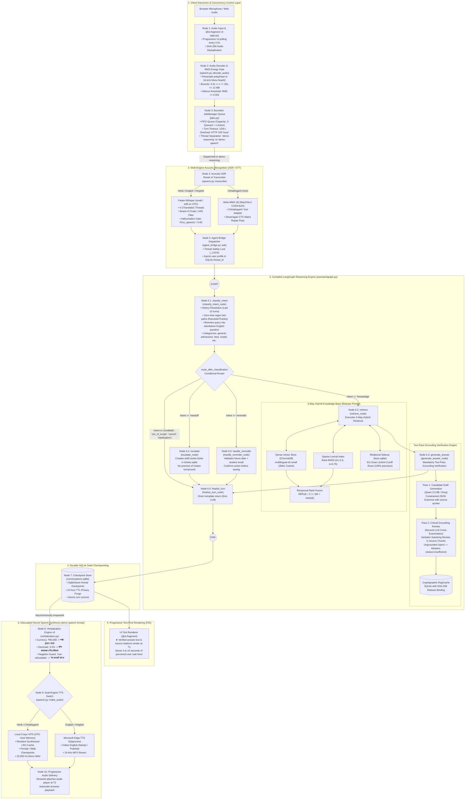

# Demo 2 (IIIT-NR Voice Helpdesk) — Complete Architecture, LangGraph Nodes, STT & TTS Pipeline Specification

**Project Codebase:** [`code/demo2/`](file:///run/media/rtx/Files/Study/Semester%205/Minor/code/demo2) & [`code/Institute-voice-agent/institute-assistant/`](file:///run/media/rtx/Files/Study/Semester%205/Minor/code/Institute-voice-agent/institute-assistant)  
**System Class:** Voice-to-Voice Institutional Conversational RAG, Admissions Guidance & Policy Assistant  
**Target User & Dialects:** Prospective engineering students, parents, and rural applicants speaking Hindi, English, Hinglish, and Chhattisgarhi  
**Execution Runtime:** Streamlit WebApp (`@st.fragment` progressive polling) + Bounded `JobManager` Queue + Multi-Engine Speech Pipelines + Compiled LangGraph StateGraph  

---

## 1. Executive Summary & Node Count Overview

Demo 2 (**IIIT-NR Voice Helpdesk**) is an institutional voice-to-voice conversational platform engineered to provide reliable, zero-hallucination guidance on academic admissions (JoSAA/CSAB opening and closing ranks, seat matrices), fee schedules, scholarships (PM-Vidyalaxmi), and hostel regulations.

To achieve strict factual accuracy on consumer edge hardware (8 GB GPU / 32 GB RAM), Demo 2 decouples its reasoning engine from its acoustic engines, isolates multi-turn state via **LangGraph**, executes **3-Way Hybrid Retrieval**, enforces **Two-Pass Grounding Verification**, and utilizes a **Text-First Progressive UX** that renders verified text and citations $4\text{--}15\text{ s}$ before neural voice synthesis completes.

### Total Node Counts in Demo 2

In Demo 2, nodes exist at two well-defined architectural levels:

| Layer Category | Node Count | Component Breakdown |
|---|---|---|
| **1. Core LangGraph StateGraph Nodes** | **6 Graph Nodes** | 1. `classify_intent` (`classify_intent_node`)<br/>2. `retrieve` (`retrieve_node`)<br/>3. `generate_answer` (`generate_answer_node`)<br/>4. `escalate` (`escalate_node`)<br/>5. `handle_reminder` (`handle_reminder_node`)<br/>6. `finalize_turn` (`finalize_turn_node`)<br/>*(Plus conditional router `route_after_classification` and Two-Pass Grounding Review)* |
| **2. End-to-End System Pipeline Nodes** | **10 Pipeline Nodes** | 1. Progressive Client Interaction Node (`app.py` `@st.fragment`)<br/>2. Audio Ingestion & RMS Energy Gate Node (`speech.py::decode_audio`)<br/>3. Bounded Concurrency Admission Node (`jobs.py::JobManager`)<br/>4. Multi-Engine Acoustic STT Node (Whisper int8 / Meta MMS-1B)<br/>5. Agent Bridge Dispatcher Node (`agent_bridge.py::ask`)<br/>6. Compiled LangGraph Reasoning Engine (The 6-Node Graph)<br/>7. Durable Storage & SQLite Checkpointer Node (`storage.py` + `conversations.sqlite`)<br/>8. Deterministic Verbalization v2 Node (`verbalization.py`)<br/>9. Dual-Engine Neural Speech Synthesis Node (Coqui VITS / Edge TTS)<br/>10. Progressive Text-First Audio Delivery Node |

---

## 2. End-to-End Architecture & Dataflow Diagram (Mermaid)

The following diagram maps the entire topology of Demo 2, showing dataflow from microphone capture through the admission queue, the LangGraph state machine, the 3-way hybrid knowledge store, the two-pass verification passes, and the decoupled speech synthesis engine:



---

## 3. The 6 Core LangGraph Nodes (Deep-Dive)

The core reasoning engine of Demo 2 is compiled via LangGraph in [`code/Institute-voice-agent/institute-assistant/assistant/graph.py`](file:///run/media/rtx/Files/Study/Semester%205/Minor/code/Institute-voice-agent/institute-assistant/assistant/graph.py). It operates over `AssistantState` and comprises exactly **6 graph nodes**:

### 1. `classify_intent` Node (`classify_intent_node`)
* **Source Location:** [`assistant/nodes.py::classify_intent_node`](file:///run/media/rtx/Files/Study/Semester%205/Minor/code/Institute-voice-agent/institute-assistant/assistant/nodes.py#L176-L255)
* **Function & Role:** First node evaluated after `START`. Resets previous turn metrics, inspects the last 10 dialogue turns, and executes intent classification and query rewriting.
* **Deterministic Fast-Paths (0ms LLM):**
  - Greetings (`"hi"`, `"namaste"`, `"नमस्ते"`): Immediately returns welcome message.
  - Gratitude (`"thanks"`, `"धन्यवाद"`): Returns polite closing.
  - Active pending confirmation (`"yes"` / `"no"`): Directs to confirmed or cancelled branch.
* **LLM Query Reformulation:** For complex turns, calls `invoke_json` using `ROUTING_PROMPT` to rewrite the user's prompt into a standalone English search query, resolving multi-turn pronouns (e.g., *"What about CSE?"* after cutoff question becomes *"What are the JoSAA opening and closing cutoffs for Computer Science and Engineering at IIIT Naya Raipur?"*).
* **Outputs Written to State:** `intent` (`"knowledge"`, `"handoff"`, `"reminder"`, `"end"`), `language` (`"hindi"`, `"english"`, `"hinglish"`), `detected_category`, `search_query`.

### 2. `retrieve` Node (`retrieve_node`)
* **Source Location:** [`assistant/nodes.py::retrieve_node`](file:///run/media/rtx/Files/Study/Semester%205/Minor/code/Institute-voice-agent/institute-assistant/assistant/nodes.py#L262-L301)
* **Function & Role:** Reached only when `intent == "knowledge"`. Orchestrates **3-Way Hybrid Retrieval** to fetch relevant institutional knowledge.
* **Retrieval Architecture:**
  1. **Dense Vector Search:** Embeds query via `multilingual-e5-small` (384-dimensional cosine space) against ChromaDB.
  2. **Sparse Lexical Search:** Queries `Rank-BM25` ($k_1=2.5, b=0.75$) over indexed document chunks.
  3. **Relational Cutoff Sidecar (`facts.sqlite`):** Evaluates whether the query contains admissions rank dimensions (year, round, branch, category, quota). If matched, queries 611 exact JoSAA/CSAB tabular rows via parameterized SQL (**100% numerical precision**).
  4. **Reciprocal Rank Fusion (RRF):** Dense and sparse candidates are merged:
     $$RRF(d) = \sum_{m \in \{\text{dense}, \text{sparse}\}} \frac{1}{60 + r_m(d)}$$
* **RagCache Integration:** Checks SQLite cache keyed by `SHA-256(release_manifest + normalized_query)`. Warm cache hits return verified chunks in $< 5\text{ ms}$.

### 3. `generate_answer` Node (`generate_answer_node`)
* **Source Location:** [`assistant/nodes.py::generate_answer_node`](file:///run/media/rtx/Files/Study/Semester%205/Minor/code/Institute-voice-agent/institute-assistant/assistant/nodes.py#L310-L438)
* **Function & Role:** Executes the **Two-Pass Grounding Verification Engine** to eliminate hallucinations:
  - **Pass 1 (Draft Generation):** Passes retrieved context chunks to Ollama Qwen 3.5:9B (or Groq) under strict JSON grammar rules requiring every claim to cite a `source_id` and candidate quote.
  - **Pass 2 (Critical Review Cross-Examination):** A second LLM pass inspects the candidate draft against the raw source excerpts. Verifies that every quoted fact is an **exact verbatim substring** in the source documents.
  - **Honest Abstention:** If a claim cannot be verified verbatim or sources conflict, the node forces `status = "insufficient"`, producing a transparent fallback: *"The requested cutoff/fee information could not be verified in official records."* and preparing a staff review ticket.
* **Outputs Written to State:** `answer_text`, `response_status` (`"answered"` or `"insufficient"`), `sources` (verified citation objects containing document name, page number, and exact quote).

### 4. `escalate` Node (`escalate_node`)
* **Source Location:** [`assistant/nodes.py::escalate_node`](file:///run/media/rtx/Files/Study/Semester%205/Minor/code/Institute-voice-agent/institute-assistant/assistant/nodes.py#L456-L480)
* **Function & Role:** Handles human staff handoff requests (when the user asks to speak to administration or when retrieval cannot answer a critical question).
* **Action:** Generates an unverified ticket record in `tickets.sqlite` containing student ID, contact email, detected category (e.g., `admissions`, `fees`), and full question text.
* **Failure Safety:** Transparently informs the user that a draft ticket has been saved for administrative review without falsely promising instant phone callback or immediate email delivery.

### 5. `handle_reminder` Node (`handle_reminder_node`)
* **Source Location:** [`assistant/nodes.py::handle_reminder_node`](file:///run/media/rtx/Files/Study/Semester%205/Minor/code/Institute-voice-agent/institute-assistant/assistant/nodes.py#L482-L511)
* **Function & Role:** Schedules academic deadline reminders (e.g., JoSAA reporting dates, fee submission deadlines).
* **Multi-Turn State Machine:**
  1. Checks if reminders are enabled via SMTP configuration (`REMINDERS_ENABLED`).
  2. Validates ISO date (`YYYY-MM-DD`); rejects past dates.
  3. Validates recipient student email format via regex.
  4. Prompts the user for explicit verbal confirmation before committing to the database.
  5. Inserts confirmed reminder into the local store.

### 6. `finalize_turn` Node (`finalize_turn_node`)
* **Source Location:** [`assistant/nodes.py::finalize_turn_node`](file:///run/media/rtx/Files/Study/Semester%205/Minor/code/Institute-voice-agent/institute-assistant/assistant/nodes.py#L440-L454)
* **Function & Role:** Terminal convergence node for all graph branches before reaching `END`.
* **State Hygiene & Memory Pruning:**
  - Prunes conversation history down to the configured window (`settings.history_turns = 10`), emitting `RemoveMessage` updates for expired messages.
  - Preserves completed turn metadata and records `resolved_query` on the AIMessage so subsequent turns can trace conversational scope.
  - Clears ephemeral prompt tokens and scratch state to prevent memory leaks across sessions.

---

## 4. System Pipeline Nodes (Outer Architecture)

Beyond the 6 LangGraph nodes, Demo 2 incorporates 4 outer architectural systems:

### Node 1: Progressive Client Interaction Node
* **Location:** [`code/demo2/app.py`](file:///run/media/rtx/Files/Study/Semester%205/Minor/code/demo2/app.py)
* **Function:** Renders the Streamlit user interface utilizing `@st.fragment`. By polling session snapshots every $0.5\text{ s}$, the UI renders reviewed text answers and citations immediately at $T_1$ while speech synthesis finishes in the background, eliminating perceived latency.

### Node 2: Audio Ingestion & RMS Energy Gate Node
* **Location:** [`code/demo2/speech.py::decode_audio`](file:///run/media/rtx/Files/Study/Semester%205/Minor/code/demo2/speech.py#L40-L69)
* **Function:** Decodes browser-uploaded WAV/FLAC audio into float32 samples. Resamples to 16,000 Hz, bounds input duration ($0.3\text{ s} \le t \le 30\text{ s}$), and applies Root-Mean-Square (RMS) silence detection:
  $$\text{RMS} = \sqrt{\frac{1}{N} \sum_{i=1}^N x_i^2} \ge 0.002$$
  Silent recordings are rejected immediately before reaching the admission queue.

### Node 3: Bounded Concurrency Admission Node (`JobManager`)
* **Location:** [`code/demo2/jobs.py::JobManager`](file:///run/media/rtx/Files/Study/Semester%205/Minor/code/demo2/jobs.py#L41-L100)
* **Function:** Prevents server overload by enforcing strict FIFO queue bounds:
  - `QUEUE_CAPACITY = 3`: Up to 3 pending jobs in queue.
  - `max_workers = 1`: One active reasoning job on the GPU at any time (`demo-reasoning` thread).
  - Overload Protection: Excess turns are immediately rejected with an HTTP 429 `"busy"` response.
  - 120-second turn timeout aborts stalled jobs.

### Node 4: Multi-Engine Acoustic STT Node
* **Location:** [`code/demo2/speech.py::transcribe`](file:///run/media/rtx/Files/Study/Semester%205/Minor/code/demo2/speech.py#L64-L113)
* **Function:** Dual-engine speech recognition based on language selection:
  - **Faster-Whisper (`int8`):** Runs on host CPU across 4 threads using CTranslate2 for Hindi, English, and Hinglish. Applies greedy partial decoding and beam-5 final decoding with Silero VAD filtering.
  - **Meta MMS-1B (`float16`):** Dedicated Wav2Vec2 CTC model on CUDA for Chhattisgarhi (`hne`).

### Node 8: Deterministic Verbalization Engine v2
* **Location:** [`code/demo2/verbalization.py`](file:///run/media/rtx/Files/Study/Semester%205/Minor/code/demo2/verbalization.py)
* **Function:** Normalizes text for speech synthesis without changing factual meaning:
  - **Indian Numbering System:** Expands currency and ranks into words (`₹90,000` $\to$ `"नब्बे हजार रुपये"`, `CRL 14500` $\to$ `"सी आर एल चौदह हजार पाँच सौ"`).
  - **Decimals & Percentages:** Converts `3.5%` $\to$ `"तीन दशमलव पाँच प्रतिशत"`.
  - **Academic Acronyms:** Transliterates Roman institutional abbreviations into phonetically stable Devanagari (`"IIIT"` $\to$ `"आई आई आई टी"`, `"B.Tech"` $\to$ `"बीटेक"`, `"CSE"` $\to$ `"सी एस ई"`).
  - **Hindi Negation Guard:** In vernacular speech models, words like *"non-refundable"* can be mispronounced or dropped, inverting policy meaning. Verbalizer v2 deterministically maps `"non-refundable"` $\to$ `"गैर-वापसी योग्य"`.

### Node 9: Dual-Engine Neural Speech Synthesis (TTS)
* **Location:** [`code/demo2/speech.py::make_audio`](file:///run/media/rtx/Files/Study/Semester%205/Minor/code/demo2/speech.py#L224-L245)
* **Function:** Routes speech synthesis based on reply language:
  - **Hindi & Chhattisgarhi:** Synthesized locally via resident Coqui VITS checkpoints running on CPU host memory (22.05 kHz WAV). An LRU cache holds up to 2 resident voice models (`Female` and `Male`).
  - **English & Hinglish:** Synthesized via Microsoft Edge TTS (`en-IN-NeerjaNeural` / `en-IN-PrabhatNeural` and `hi-IN-SwaraNeural` / `hi-IN-MadhurNeural`) generating high-definition MP3 streams.

---

## 5. Speech-to-Text (STT) Deep-Dive in Demo 2

### Dual Acoustic Model Architecture

| Parameter | Engine A: Faster-Whisper | Engine B: Meta MMS-1B |
|---|---|---|
| **Target Dialects** | Hindi (`hi`), Indian English (`en`), Hinglish | Regional Chhattisgarhi (`hne`) |
| **Model Size / Family** | Whisper `small` (244M parameters) | Wav2Vec2 1-Billion parameters (`mms-1b-all`) |
| **Quantization & Device** | `int8` quantization running on **CPU host RAM** | `float16` half-precision on **CUDA GPU** |
| **Thread Allocation** | 4 dedicated CTranslate2 worker threads | Single CUDA stream ($\approx 2.2\text{ GB}$ VRAM) |
| **Decoding Strategy** | Greedy ($beam=1$) partials + Beam Search ($beam=5$) finals | CTC Greedy decoding with blank token collapse |
| **Hallucination Gate** | Discards output if $P(\text{no\_speech}) \ge 0.60$ | Discards output if $P(\text{no\_speech}) \ge 0.60$ |
| **Diacritic Handling** | Native Devanagari BPE subword tokens | Custom regex matra repair (`clean_mms_devanagari`) |

### Acoustic Invariance & Buffer Alignment
All audio entering both engines is strictly validated against the **Mono 16 kHz Little-Endian PCM contract**. Silero VAD (ONNX Runtime) segments continuous speech into clean sentence boundaries using a 512-sample frame invariance algorithm (32 ms window at 16 kHz), ensuring no truncated words reach the acoustic decoders.

---

## 6. Text-to-Speech (TTS) Deep-Dive in Demo 2

### The Physical Compute Decoupling Principle
Running neural speech models (Coqui VITS) on the GPU while an autoregressive 9B parameter LLM (Qwen 3.5:9B) is generating tokens frequently causes CUDA out-of-memory kernel panics on an 8 GB VRAM GPU ($6.3\text{ GB} + 2.2\text{ GB} > 8.0\text{ GB}$).

Demo 2 resolves this by **strictly pinning Coqui VITS to CPU host memory**:
* VITS models are loaded directly into 32 GB system RAM.
* AVX-512 CPU SIMD instructions execute the HiFi-GAN vocoder synthesis.
* Synthesis occurs concurrently in a background thread pool (`demo-speech`), leaving the GPU 100% dedicated to LLM token generation.

### The Hindi Negation Guard & Lexicon Engine
Speech models trained on phonetic Devanagari fail when encountering mixed English legal terms. In fee and admission disputes, the difference between "refundable" and "non-refundable" is critical. Demo 2's verbalization engine executes a deterministic substitution rulebook:

```python
NEGATION_MAP = {
    r"\bnon[\s\-_]?refundable\b": "गैर-वापसी योग्य",
    r"\bnot[\s\-_]?eligible\b": "पात्र नहीं",
    r"\bno[\s\-_]?reservation\b": "कोई आरक्षण नहीं",
}
```

This guarantees that speech synthesis never inverts legal or financial institute policies.

---

## 7. Comparison: Demo 1 vs. Demo 2 Architectural Topologies

| Feature Dimension | Demo 1: Kisan Saathi (`code/demo`) | Demo 2: IIIT-NR Helpdesk (`code/demo2`) |
|---|---|---|
| **Core Architecture** | Bounded ReAct Tool Orchestrator over FastMCP | Compiled LangGraph StateGraph (6 Nodes) |
| **Primary Task** | Commercial actions, cart mutations, order checkout | Factual question answering, JoSAA cutoffs, policy RAG |
| **Node Count** | 11 Pipeline Nodes + 12 FastMCP Tool Nodes | 10 Pipeline Nodes + 6 LangGraph Nodes |
| **State Persistence** | Atomic `shop.json` under OS `filelock` | SQLite `conversations.sqlite` + `SqliteSaver` |
| **Financial Units** | Exact integer paise ($1\text{ INR} = 100\text{ paise}$) | Parameterized JoSAA Cutoffs & Fee Structures |
| **Safety Interceptor** | KVK Regex Filter (`SAFETY_PATTERN`) | Two-Pass Grounding Verification (Second LLM Pass) |
| **Tool Execution** | Dedicated OS child subprocess over `stdio` | Internal Python functions + Parameterized SQLite |
| **Latency Strategy** | Single-turn synchronous Streamlit rerun | Text-First Progressive UX via `@st.fragment` (0.5s polling) |
| **Speech Engines** | Meta MMS-1B STT + Local Coqui VITS | Faster-Whisper / MMS STT + Coqui VITS / Edge TTS |
